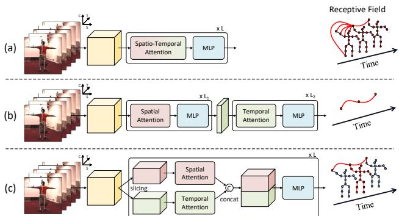
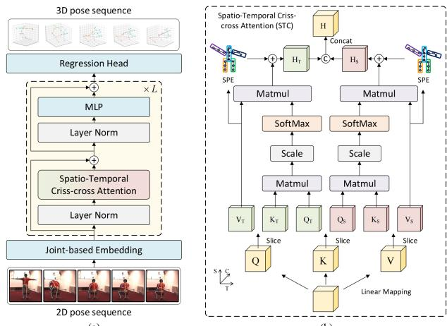
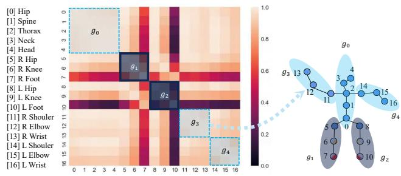
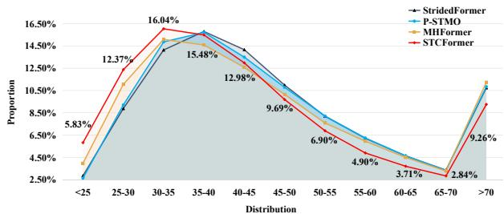
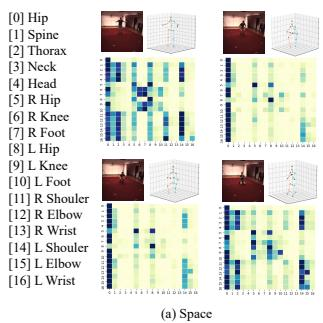
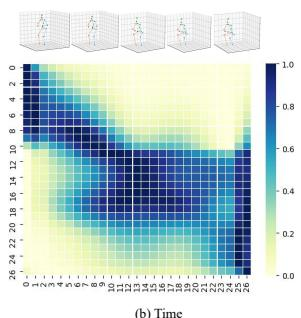
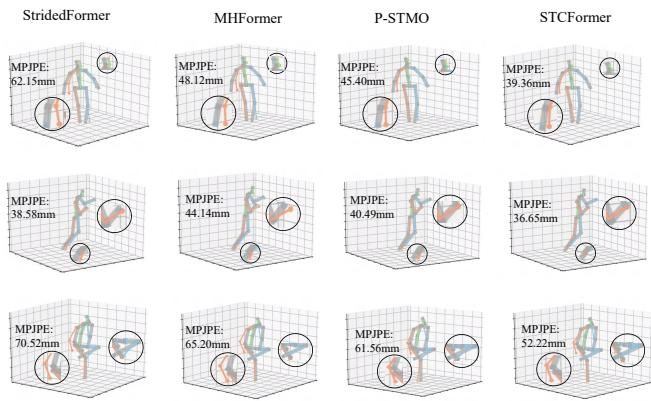

# 3D Human Pose Estimation with Spatio-Temporal Criss-cross Attention

Zhenhua Tang, Zhaofan Qiu, Yanbin Hao, Richang Hong, Ting Yao Hefei University of Technology, Anhui, China HiDream.ai Inc University of Science and Technology of China, Anhui, China

zhenhuat@foxmail.com, zhaofanqiu@gmail.com, haoyanbin@hotmail.com hongrc.hfut@gmail.com, tingyao.ustc@gmail.com

## Abstract

Recent transformer-based solutions have shown great success in 3D human pose estimation. Nevertheless, to calculate the joint-to-joint affinity matrix, the computational cost has a quadratic growth with the increasing number of joints. Such drawback becomes even worse especially for pose estimation in a video sequence, which necessitates spatio-temporal correlation spanning over the entire video. In this paper, we facilitate the issue by decomposing correlation learning into space and time, and present a novel Spatio-Temporal Criss-cross attention (STC) block. Technically, STC first slices its input feature into two partitions evenly along the channel dimension, followed by performing spatial and temporal attention respectively on each partition. STC then models the interactions betweenjoints in an identicalframe andjoints in an identical trajectory simultaneously by concatenating the outputsfrom attention layers. On this basis, we devise STCFormer by stacking multiple STC blocks andfurther integrate a new Structure-enhanced Positional Embedding (SPE) into STCFormer to take the structure ofhuman body into consideration. The embedding function consists of two components: spatio-temporal convolution around neighboring joints to capture local structure, andpart-aware embedding to indicate which part each joint belongs to. Extensive experiments are conducted on Human3.6M and MPI-INF-3DHP benchmarks, and superior results are reported when comparing to the state-ofthe-art approaches. More remarkably, STCFormer achieves to-date the best published performance: 40.5mm P1 error on the challenging Human3.6M dataset.

## 1. Introduction

3D human pose estimation has attracted intensive research attention in CV community due to its great potential in numerous applications such as human-robot interaction [20, 43], virtual reality [11] and motion prediction [27, 28]. The typical monocular solution is a two-stage pipeline, which first extracts 2D keypoints by 2D human pose detectors (e.g., [7] and [41]), and then lifts 2D coordinates into 3D space [31]. Despite its simplicity, the second stage is an ill-posed problem which lacks the depth prior, and suffers from the ambiguity problem.

  
Figure 1. Modeling spatio-temporal correlation for 3D human pose estimation by (a) utilizing spatio-temporal attention on all joints in the entire video, (b) separating the framework into two steps that respectively capture spatial and temporal context, and (c) our Spatio-Temporal Criss-cross attention (STC), i.e., a twopathway block that models spatial and temporal information in parallel. In the visualization of receptive field, the covered joints of each attention strategy is marked as red nodes.

To mitigate this issue, several progresses propose to aggregate the temporal cues in a video sequence to promote pose estimation by grid convolutions [15,26,35], graph convolutions [4, 47] and multi-layer perceptrons [6, 21]. Recently, Transformer structure has emerged as a dominant architecture in both NLP and CV fields [8,24,45,49], and also demonstrated high capability in modeling spatio-temporal correlation for 3D human pose estimation [13, 22, 23, 25, 48, 52, 54]. Figure 1(a) illustrates a straightforward way to exploit the transformer architecture for directly learning spatio-temporal correlation between all joints in the entire video sequence. However, the computational cost of calculating the joint-to-joint affinity matrix in the self-attention has a quadratic growth along the increase of number of frames, making such solution unpractical for model training. As a result, most transformer structures employ a twostep alternative, as shown in Figure 1(b), which encodes spatial information for each frame first and then aggregates the feature sequence by temporal transformer. Note that we take spatial transformer as the frame encoder as an example in the figure. This strategy basically mines the correlation across frame-level features but seldom explores the relation between joints across different frames.

In this paper, we propose a novel two-pathway attention mechanism, namely Spatio-Temporal Criss-cross attention (STC), that models spatial and temporal information in parallel, as depicted in Figure 1(c). Concretely, STC first slices the input joint features into two partitions evenly with respect to the channel dimension. On each partition, a Multihead Self-Attention (MSA) is implemented to encapsulate the context along space or time axis. In between, the space pathway computes the affinity between joints in each frame independently, and the time pathway correlates the identical joint moving across different frames, i.e., the trajectory. Then, STC recombines the learnt contexts from two pathways, and mixes the information across channels by Multi-Layer Perceptrons (MLP). By doing so, the receptive field is like a criss cross of spatial and temporal axes, and the computational cost is $\mathcal { O } ( T ^ { 2 } S ) + \mathcal { O } ( T S ^ { 2 } )$ . That is much lower than $\mathcal { O } ( T ^ { 2 } S ^ { 2 } )$ of fully spatio-temporal attention, where T and S denote the number of frames and joints, respectively.

By stacking multiple STC blocks, we devise a new architecture — STCFormer for 3D human pose estimation. Furthermore, we delve into the crucial design of positional embedding in STCFormer in the context of pose estimation. The observations that joints in the same body part are either highly relevant (static part) or not relevant but containing moving patterns (dynamic part) motivate us to design a new Structure-enhanced Positional Embedding (SPE). SPE consists of two embedding functions for the static and dynamic part, respectively. A part-aware embedding is to describe the static part by indicating which part each joint belongs to, and a spatio-temporal convolution around neighboring joints aims to capture dynamic structure in local window.

We summarize the main contributions of this work as follows. First, STC is a new type of decomposed spatiotemporal attention for 3D human pose estimation in an economic and effective way. Second, STCFormer is a novel transformer architecture by stacking multiple STC blocks and integrating the structure-enhanced positional embedding. Extensive experiments conducted on Human3.6M and MPI-INF-3DHP datasets demonstrate that STCFormer with much less parameters achieves superior performances than the state-of-the-art techniques.

## 2. Related Work

Monocular 3D human pose estimation. Monocular 3D human pose estimation is to re-localize human body joints in 3D space from the input single view 2D data, i.e., image or 2D coordinates. The early works [1, 2, 17] develop various graphical or restrictive methods to explore the dependencies of human skeleton and perspective relationships across spaces. With the development of deep learning, several deep neural networks [5, 10, 19, 31, 34, 42, 44, 53] are devised for 3D human pose estimation, and can be categorized into one-stage and two-stage directions. The onestage approaches directly regress the 3D pose from the input image, and necessitate a large number of image-pose paired data and powerful computing resources [19, 34, 42]. The two-stage methods first exploit off-the-shelf 2D pose detectors [7, 33, 41] to estimate 2D joint coordinates, and then lift the 2D coordinates into 3D space by the fully-connected network [31], grid convolutional network [5], recurrent neural network [10], or graph convolutional network [53]. Although the two-stage methods alleviate the requirement of image-pose pairs, they still heavily suffer from the depth ambiguities problem, which is intrinsically ill-posed due to the lack of depth information.

3D pose estimation from video sequence. To overcome the limitation of depth ambiguities, the advances involve temporal context from neighboring frames to improve 3D coordinates regression. For example, Pavllo et al. [35] propose a temporal fully-convolutional network (TCN) to model the local context by convoluting the neighboring frames. Later, Liu et al. [26] extend the TCN by introducing an attention mechanism to adaptively identify the significant frames/poses over a sequence. After that, Chen et al. [6] decompose the pose estimation into bone length and bone direction prediction. Instead of the aforementioned methods based on temporal aggregation, latter works [4, 16, 46] utilize the spatio-temporal graph convolutional network to model the spatial and temporal correlations across joints simultaneously.

Transformer-based methods. In addition to the traditional convolutional networks, transformer architectures are also be exploited to model spatio-temporal correlation [13, 22, 23, 29, 30, 37, 50, 51, 54]. In particular, Zheng et al. [54] design a concatenation architecture of several spatial transformer encoders and temporal transformer encoders in PoseFormer. MHFormer [23] proposes to generate multiple hypothesis representations for a pose with the spatial transformer encoder and then model multi-level global correlations with different temporal transformer blocks. StridedFormer [22] and CrossFormer [13] introduce locality by integrating the 1D temporal convolution and 1D spatial convolution, respectively. More recently, the joint-wise inconsistency of motion patterns is highlighted in [48, 52], and encourages to model spatial and temporal information simultaneously. PATA [48] groups the joints with similar motion patterns and calculates the intra-part temporal correlation. Similarly, MixSTE [52] uses multiple separated spatial transformer blocks and temporal transformer blocks to model the spatial and temporal correlation iteratively.

Our work also falls into the category of transformerbased method for 3D human pose estimation. The aforementioned transformers mainly model spatial and temporal information respectively in different stages of the networks. In view that the joint motion is a state of coexistence of space and time, such separation may result in insufficient learning of moving patterns. In contrast, our STC block is a two-pathway design that models spatial and temporal dependencies in parallel, which are then mixed through MLP. Moreover, a new positional embedding function is deliberately devised to explore the local structure of human body.

## 3. Spatio-Temporal Criss-cross Transformer

## 3.1. Preliminary – Transformer

We begin this section by reviewing the transformer architecture [45] as the basis of our proposal. Transformer is a versatile representation learning architecture, and mainly consists of two components: Multi-head Self-Attention module (MSA) and Feed-Forward Network (FFN). MSA calculates the token-to-token affinity matrix and propagates the information across different tokens. Formally, given N input tokens with C channels, MSA is formulated as

$$
{ \cal M } S A \left( { \bf Q } , { \bf K } , { \bf V } \right) = S o f t m a x \left( \frac { { \bf Q } \cdot { \bf K } ^ { T } } { \sqrt { C } } \right) \cdot { \bf V } ,\tag{1}
$$

where Q, K, $\mathbf { V } \in \mathbb { R } ^ { N \times C }$ denote the queries, keys and values obtained by linearly mapping the input tokens. Note that we omit the multi-head separation here for simplicity. FFN contains a Multi-Layer Perceptrons (MLP), i.e., a nonlinear mapping with two linear layer plus a GELU [14] activation in between. The output of MLP is computed by

$$
M L P \left( \mathbf { H } \right) = G E L U \left( \mathbf { H } \cdot \mathbf { W _ { 1 } } \right) \cdot \mathbf { W _ { 2 } } \ ,\tag{2}
$$

where $\mathbf { H } ~ \in ~ \mathbb { R } ^ { N \times C }$ is the input tokens of MLP, ${ \bf W _ { 1 } } \in \mathbf { \Psi }$ $\mathbb { R } ^ { C \times \hat { C } }$ and $\mathbf { W _ { 2 } } \in \mathbb { R } ^ { \hat { C } \times C }$ are the projection matrices. With these, each transformer block is constructed by utilizing MSA and MLP in order with shortcut connection:

$$
\begin{array} { r } { \begin{array} { r l } & { \mathbf { Q } , \mathbf { K } , \mathbf { V } = F C \left( L N \left( \mathbf { X } \right) \right) \ , } \\ & { \mathbf { Y } = M S A \left( \mathbf { Q } , \mathbf { K } , \mathbf { V } \right) + \mathbf { X } \ , } \\ & { \mathbf { Z } = M L P \left( L N \left( \mathbf { Y } \right) \right) + \mathbf { Y } \ , } \end{array} } \end{array}\tag{3}
$$

where F C is linear projection of the input tokens X, and LN denotes Layer Norm [3]. The output Z serves as the input to the next block until the last one.

  
Figure 2. An overview of our proposed Spatio-Temporal Crisscross Transformer (STCFormer). (a) It mainly consists of L sequentrial STC blocks. Each block aggregates the context across tokens by spatio-temporal criss-cross attention, and non-linearly maps each token by Multi-Layer Perceptrons (MLP). (b) The architecture of our STC block and the Structure-enhanced Positional Embedding (SPE).

## 3.2. Overall Architecture

Figure 2 depicts an overview of the proposed STC-Former, which mainly includes three stages: a joint-based embedding, stacked STC blocks and a regression head. The joint-based embedding projects the input 2D coordinates of each joint into feature space. STC blocks aggregate the spatio-temporal context, and update the representation of each joint. Based on the learnt features, the 3D coordinates are estimated by a regression head.

Joint-based embedding. Given a 2D pose sequence as $\mathbf { P } _ { 2 D } \in \mathbb { R } ^ { T \times N \times 2 }$ , where T and N denote the number of frames and the number of body joints in each frame, respectively, we first project $\mathbf { P } _ { 2 D }$ to high-dimensional embeddings by a joint-based embedding layer. This layer applies an FC layer to each 2D coordinate independently followed by a GELU activation. As such, the joint-based embedding layer produces the features with the shape of $T \times N \times C .$ Note that in the previous transformer [22], the embedding layer projects all joint coordinates in each frame into a single vector, reducing the computational cost of the subsequent transformer blocks while losing the spatial discrimination. Ours is different in that the spatial dimension N is maintained, and the computational cost is also reduced by spatio-temporal criss-cross attention.

STC blocks. The STC block originates from the transformer block in Eq.(3), and replaces the original MSA layer with spatio-temporal criss-cross attention. In addition, a new positional embedding function, i.e., Structureenhanced Positional Embedding (SPE), is integrated into the STC block for better descriptive capability of local structures. Section 3.3 and Section 3.4 will elaborate STC and SPE, respectively.

（b）

Regression head. A liner regression head is finally established upon the STC blocks to estimate the 3D pose coordinates $\hat { \bf P } _ { 3 D } \in \mathbb R ^ { T \times N \times 3 }$ . The whole architecture is optimized by minimizing the Mean Squared Error (MSE) between $\hat { \bf P } _ { 3 D }$ and the ground-truth 3D coordinates $\mathbf { P } _ { 3 D }$ as

$$
\mathcal { L } = \left\| \hat { \mathbf { P } } _ { 3 D } - \mathbf { P } _ { 3 D } \right\| ^ { 2 } .\tag{4}
$$

## 3.3. Spatio-Temporal Criss-cross Attention

STC aims to model the spatio-temporal dependencies between joints in an efficient way to avoid the quadratic computation cost of fully spatio-temporal attention. Inspired by the group contextualization strategy [12] which separates the channels into several paralleled groups and applies different feature contextualization operations to them respectively, we propose to capture the spatial and temporal context on different channels in parallel. Different from the axial convolution in [12,36,38], we exploit axis-specific multihead self-attention in STC for spatial or temporal context, which is more powerful for correlation learning.

Concretely, the input embedding $\mathbf { X } ~ \in ~ \bar { \mathbb { R } ^ { T \times N \times C } }$ are firstly mapped to queries $\textbf { Q } \in \bar { \mathbb { R } } ^ { T \times N \times C }$ , keys $\textrm { \textbf { K } } \in$ $\mathbb { R } ^ { T \times N \times C }$ , and values $\textbf { V } \in \mathbb { R } ^ { T \times N \times C }$ , which are then evenly divided into two groups along the channel dimension. For notation clarity, we denote the divided feature matrix as time group $\{ \mathbf { Q } _ { T } , \mathbf { K } _ { T } , \mathbf { V } _ { T } \}$ and space group $\{ \mathbf { Q } _ { S } , \mathbf { K } _ { S } , \mathbf { V } _ { S } \}$ }. Next, the temporal and spatial correlations are calculated in two separate self-attention modules.

Temporal correlation represents the relation between the joints in an identical trajectory moving across different frames. To achieve this, we implement an axis-specific MSA, named $M S A _ { T }$ , which computes the attention affinities in Eq.(1) between joints across the temporal dimension. Hence, the output of temporal attention is measured as

$$
\mathbf { H } _ { \mathbf { T } } = M S A _ { T } \left( \mathbf { Q } _ { \mathbf { T } } , \mathbf { K } _ { \mathbf { T } } , \mathbf { V } _ { \mathbf { T } } \right) .\tag{5}
$$

Spatial correlation is the connection between joints in an identical frame. These joints indicate different body parts in one frame, which are intrinsically relevant due to the prior of body skeleton. Similar to temporal attention, we devise $M S A _ { S }$ as an axis-specific MSA component on spatial dimension. Therefore, the output of spatial attention is formulated as

$$
{ \bf H } _ { \bf S } = M S A _ { S } \left( { \bf Q } _ { \bf S } , { \bf K } _ { \bf S } , { \bf V } _ { \bf S } \right) .\tag{6}
$$

The above two correlation modules process in parallel and follow the self-attention regime for feature contextualization. They compute the token-to-token affinities by contextualizing from a specific axial perspective, and complement to each other. Thus, we concatenate the outputs from both attention layers along the channel dimension:

$$
{ \bf H } = c a t \left( { \bf H } _ { \bf T } , { \bf H } _ { \bf S } \right) ,\tag{7}
$$

  
（a）  
Figure 3. (a) The coefficient matrix of the motion trajectory of different joints. (b) The body joints are divided into five parts, denoted as $g _ { * }$ . The part with high/low relevance is colored as light/- dark blue, respectively. The motion data is generated by actor S6 performing greeting action in the training set of Human3.6M.

where cat performs the concatenation. The resultant receptive field of STC is like a criss cross of spatial and temporal axes, and stacking multiple STC blocks is able to approximate the fully spatio-temporal attention.

## 3.4. Structure-enhanced Positional Embedding

One of the crucial factor in transformer is positional embedding, which indicates the position of each token absolutely or relatively. For the positional embedding function in STCFormer, we delve into the inherent property of joints, i.e., the local structure, and propose Structure-enhanced Positional Embedding (SPE). Figure 3 depicts the motivation of SPE. Here, we group the body joints into five parts according to the dynamic chain structure of human body:

$$
\begin{array} { r l } & { g _ { 0 } = \{ h i p , s p i n e , t h r o a x , n e c k , h e a d \} } \\ & { g _ { 1 } = \{ r i g h t . h i p , r i g h t . k n e e , r i g h t . f e e t \} } \\ & { g _ { 2 } = \{ l e f t . h i p , l e f t . k n e e , l e f t . f e e t \} } \\ & { g _ { 3 } = \{ r i g h t . s h o u l d e r , r i g h t . e l b o w , r i g h t . w r i s t \} } \\ & { g _ { 4 } = \{ l e f t . s h o u l d e r , l e f t . e l b o w , l e f t . w r i s t \} } \end{array}\tag{8}
$$

The trajectories of joints in the static part $( g _ { 0 } , g _ { 3 }$ and $g _ { 4 }$ in the figure) are highly relevant. We devise a part-ware positional embedding to indicate which part each joint belongs to. The joints in the same part are attached with the same embedding vector. In particular, a learnable dictionary is constructed to assign embedding vector to different joints according to their group index. Given the group index $\mathbf { g } \in [ 0 , 1 , \overset {  } { 2 } , 3 , 4 ] ^ { T \times N }$ of joints, the learnable dictionary $\mathbf { D } \in \mathbb { R } ^ { 5 \times { \frac { C } { 2 } } }$ convert the indexes to embedding vectors as

$$
\mathbf { S P E 1 } = \mathbf { D } ( \mathbf { g } ) .\tag{9}
$$

Nevertheless, in the dynamic part, i.e., part with relative movements $( g _ { 1 } , g _ { 2 }$ in the figure), the trajectories of joints are not relevant. Simply assigning the same embedding vector to these joints ignores the motion patterns in the dynamic part. Hence, we propose to exploit a spatio-temporal convolution around the neighboring joints to capture the local structure. Formally, given the values $\mathbf { V } \in \mathrm { ~ \mathbb { R } ^ { \Gamma \times N \times \frac { C } { 2 } } ~ }$ in

```python
Algorithm 1 Pseudo-code of STC with SPE (PyTorch-like)
# x: input tensor of shape (B, T, N, C)
# p: part index (B, T, N) in [0, 4]
# MSA: axis-specific multi-head self-attention
self.linear = nn.Linear(C, 3C)
self.embed1 = nn.Embedding(5, C//2)
# the channel-last convolution
self.embed2 = nn.Conv2d(C//2, C//2, k=3, g=C//2)
def STC(x, p):
Q, K, V = self.linear(x).chunk(3, dim=3)
Q_t, Q_s = Q.chunk(2, dim=3)
K_t, K_s = K.chunk(2, dim=3)
V_t, V_s = V.chunk(2, dim=3)
H_t = MSA(Q_t, K_t, V_t, dim=1)
H_s = MSA(Q_s, K_s, V_s, dim=2)
H_t += self.embed1(p) + self.embed2(V_t)
H_s += self.embed1(p) + self.embed2(V_s)
H = torch.cat(H_t, H_s, dim=3)
return H
```

STC block, we treat V as 2D (i.e., space and time) feature map , and utilize 2D convolution on the neighboring joints:

$$
\mathbf { S P E } _ { 2 } ( \mathbf { V } ) = c o n v 2 d ( \mathbf { V } ) \ ,\tag{10}
$$

where conv2d is a 3 × 3 convolution operation. Although the two SPE functions are designed respectively for static part and dynamic part, we utilize the two functions concurrently on all joints leaving out the requirement of static/dynamic judgment. The duet of two SPE functions is able to deal with the parts with various moving patterns.

By injecting the proposed SPE function into STC, the equation of STC is reformulated as

$$
\begin{array} { r l } & { \mathbf { H } _ { \mathbf { T } } = M S A _ { T } \left( \mathbf { Q } _ { \mathbf { T } } , \mathbf { K } _ { \mathbf { T } } , \mathbf { V } _ { \mathbf { T } } \right) + \mathbf { S } \mathbf { P } \mathbf { E } _ { 1 } + \mathbf { S } \mathbf { P } \mathbf { E } _ { 2 } ( \mathbf { V } _ { \mathbf { T } } ) , } \\ & { \mathbf { H } _ { \mathbf { S } } = M S A _ { S } \left( \mathbf { Q } _ { \mathbf { S } } , \mathbf { K } _ { \mathbf { S } } , \mathbf { V } _ { \mathbf { S } } \right) + \mathbf { S } \mathbf { P } \mathbf { E } _ { 1 } + \mathbf { S } \mathbf { P } \mathbf { E } _ { 2 } ( \mathbf { V } _ { \mathbf { S } } ) , } \\ & { \mathbf { H } = c a t \left( \mathbf { H } _ { \mathbf { T } } , \mathbf { H } _ { \mathbf { S } } \right) . } \end{array}\tag{11}
$$

Implementation. The proposed STC plus SPE in Eq.(11) can be readily implemented with a few lines of codes in Python. We detail an example of the codes in Algorithm 1 based on PyTorch platform. Here, we execute the pre-defined MSA and MLP function in the standard transformer. The SPE is implemented by constructing the default Embedding layer and Conv2d layer.

## 4. Experiments

We comprehensively evaluate the proposed STCFormer architecture on two large-scale datasets, i.e., Human3.6M [18] and MPI-INF-3DHP [32].

## 4.1. Datasets and Evaluation Metrics

Human3.6M is currently the most popular benchmark for indoor 3D human pose estimation, which contains 11 subjects performing 15 typical actions, leading to 3.6 million video frames in total. Following the standard protocol, we use subjects 1, 5, 6, 7, and 8 for training, and subjects 9 and 11 for evaluation. The Mean Per Joint Position Error (MPJPE) is used to measure the error under two protocols: Protocol 1 (referred to as P1) computes MPJPE between the estimated pose and the ground truth after aligning their root joints (hip); Protocol 2 (referred to as P2) calculates Procrustes-MPJPE, where the ground truth and the pose prediction are further aligned through a rigid transformation. We also compute the MPJPE distribution of pose to evaluate the overall precision of the reconstructed skeletons. MPI-INF-3DHP is a recently proposed large-scale dataset, which consists of three scenes, i.e., green screen, non-green screen, and outdoor. By using 14 cameras, the dataset records 8 actors performing 8 activities for the training set and 7 activities for evaluation. Following the previous works [6, 39, 54], we adopt the MPJPE (P1), percentage of correct keypoints (PCK) with 150mm, and area under the curve (AUC) results as the evaluation metrics.

## 4.2. Implementation Details

Our model is implemented with PyTorch toolkit and runs on a server with one GTX 2080Ti GPU. In the experiments, two kinds of input 2D pose sequences are utilized including the pre-estimated 2D pose by the pre-trained CPN [7] and the real 2D pose (ground truth). For model training, we set each mini-batch as 128 sequences. The network parameters are optimized for 20 epochs by Adam optimizer with basic learning rate of 0.001 and decayed by 0.96 after each epoch. We consider the repeat time L of modules, the hidden embedding channel C, and the number of head H in attention block as free parameters that we tailor to the scale of network. The performances of the standard version STCFormer with $\left\{ L = 6 , C = 2 5 6 , H = 8 \right\}$ and the large version STCFormer-L with $\left\{ L = 6 , C = 5 1 2 , H = 8 \right\}$ are both reported.

## 4.3. Performance Comparison on Human3.6M

We compare with several state-of-the-art techniques on Human3.6M dataset. Table 1 summarizes the performance comparisons in terms of P1 and P2 errors taking the preestimated 2D poses (CPN) as input, and the number of sampled frames T per video is also given for each method. In general, the longer input sequence leads to the lower regression error. Overall, STCFormer-L with T=243 input frames achieves the new state-of-the-art performances with P1 error of 40.5mm and P2 error of 31.8mm. Benefiting from the proposed STC attention module, STCFormer-L outperforms StridedFormer [22], PATA [48] and MixSTE [52] with T=243 frames, which are also based on transformer architecture, by the P1 error drop of 3.2mm, 2.6mm and 0.4mm, respectively. Comparing to the best competitor

Table 1. Performance comparisons in terms of P1 error (mm) and P2 error (mm) with the state-of-the-art methods on Human3.6M dataset. The 2D pose input is estimated by CPN [7]. The best result and runner-up result in each column are marked in red and blue, respectively. “\*” denotes the post-processing module proposed in [4]. T is the number of sampled frames from each video.
<table><tr><td>P1</td><td>Publication</td><td>Dir.</td><td>Dis.</td><td>Eat.</td><td>Gre.</td><td>Phone</td><td>Photo</td><td>Pose</td><td>Purch.</td><td>Sit.</td><td>SitD.</td><td>Smoke</td><td>Wait</td><td>WalkD.</td><td>Walk</td><td>WalkT. Avg.</td></tr><tr><td>Liu et al. [26] (T=243)</td><td>CVPR&#x27;20</td><td>41.8</td><td>44.8</td><td>41.1</td><td>44.9</td><td>47.4 46.7</td><td>54.1</td><td>43.4</td><td>42.2 56.2</td><td>63.6</td><td>45.3</td><td>43.5</td><td>45.3</td><td>31.3</td><td>32.2</td><td>45.1</td></tr><tr><td>UGCN [46] (T=96) *</td><td>ECCV&#x27;20</td><td>40.2</td><td>42.5</td><td>42.6</td><td>41.1</td><td>56.7</td><td>41.4</td><td>42.3</td><td>56.2</td><td>60.4</td><td>46.3</td><td>42.2</td><td>46.2</td><td>31.7</td><td>31.0</td><td>44.5</td></tr><tr><td>PoseFormer [54] (T=81)</td><td>ICCV’21</td><td>41.5</td><td>44.8</td><td>39.8</td><td>42.5</td><td>46.5 51.6</td><td>42.1</td><td>42.0</td><td>53.3</td><td>60.7</td><td>45.5</td><td>43.3</td><td>46.1</td><td>31.8</td><td>32.2</td><td>44.3</td></tr><tr><td>Shan et al. [40] (T=243)</td><td>ACM MM&#x27;21 40.8</td><td></td><td>44.5</td><td>41.4</td><td>42.7</td><td>46.3</td><td>55.6</td><td>41.8 41.9</td><td>53.7</td><td>60.8</td><td>45.0</td><td>41.5</td><td>44.8</td><td>30.8</td><td>31.9</td><td>44.3</td></tr><tr><td>Anatomy3D [6] (T=243)</td><td>TCVST’21</td><td>41.4</td><td>43.5</td><td>40.1</td><td>42.9</td><td>46.6</td><td>51.9</td><td>41.7</td><td>42.3 53.9</td><td>60.2</td><td>45.4</td><td>41.7</td><td>46.0</td><td>31.5</td><td>32.7</td><td>44.1</td></tr><tr><td>Einfalt et al. [9] (T=351) *</td><td>arXiv&#x27;22</td><td>39.6</td><td>43.8</td><td>40.2</td><td>42.4</td><td>46.5</td><td>53.9</td><td>42.3 42.5</td><td>55.7</td><td>62.3</td><td>45.1</td><td>43.0</td><td>44.7</td><td>30.1</td><td>30.8</td><td>44.2</td></tr><tr><td>StridedFormer [22] (T=243) *</td><td>TMM&#x27;22</td><td>40.3</td><td>43.3</td><td>40.2</td><td>42.3</td><td>45.6</td><td>52.3 41.8</td><td>40.5</td><td>55.9</td><td>60.6</td><td>44.2</td><td>43.0</td><td>44.2</td><td>30.0</td><td>30.2</td><td>43.7</td></tr><tr><td>CrossFormer [13] (T=81)</td><td>arXiv&#x27;22</td><td>40.7</td><td>44.1</td><td>40.8</td><td>41.5</td><td>45.8</td><td>52.8 41.2</td><td>40.8</td><td>55.3</td><td>61.9</td><td>44.9</td><td>41.8</td><td>44.6</td><td>29.2</td><td>31.1</td><td>43.7</td></tr><tr><td>PATA [48] (T=243)</td><td>TIP&#x27;22</td><td>39.9</td><td>42.7</td><td>40.3</td><td>42.3</td><td>45.0</td><td>52.8 40.4</td><td>39.3</td><td>56.9</td><td>61.2</td><td>44.1</td><td>41.3</td><td>42.8</td><td>28.4</td><td>29.3</td><td>43.1</td></tr><tr><td>MHFormer [23] (T=351)</td><td>CVPR&#x27;22</td><td>39.2</td><td>43.1</td><td>40.1</td><td>40.9</td><td>44.9 51.2</td><td>40.6</td><td>41.3</td><td>53.5</td><td>60.3</td><td>43.7</td><td>41.1</td><td>43.8</td><td>29.8</td><td>30.6</td><td>43.0</td></tr><tr><td>P-STMO [39] (T=243)</td><td>ECCV&#x27;22</td><td>38.9</td><td>42.7</td><td>40.4</td><td>41.1 45.6</td><td>49.7</td><td>40.9</td><td>39.9</td><td>55.5</td><td>59.4</td><td>44.9</td><td>42.2</td><td>42.7</td><td>29.4</td><td>29.4</td><td>42.8</td></tr><tr><td>MixSTE [52] (T=81)</td><td>CVPR&#x27;22</td><td>39.8</td><td>43.0</td><td>38.6</td><td>40.1 43.4</td><td>50.6</td><td>40.6</td><td>41.4</td><td>52.2</td><td>56.7</td><td>43.8</td><td>40.8</td><td>43.9</td><td>29.4</td><td>30.3</td><td>42.4</td></tr><tr><td>MixSTE [52] (T=243)</td><td>CVPR&#x27;22</td><td>37.6</td><td>40.9</td><td>37.3</td><td>39.7</td><td>42.3 49.9</td><td>40.1</td><td>39.8</td><td>51.7</td><td>55.0</td><td>42.1</td><td>39.8</td><td>41.0</td><td>27.9</td><td>27.9</td><td>40.9</td></tr><tr><td>STCFormer (T=81) STCFormer (T=243)</td><td></td><td>40.6</td><td>43.0 41.6</td><td>38.3</td><td>40.2</td><td>43.5</td><td>52.6 40.3</td><td>40.1</td><td>51.8</td><td>57.7</td><td>42.8</td><td>39.8</td><td>42.3</td><td>28.0</td><td>29.5</td><td>42.0</td></tr><tr><td>STCFormer-L (T=243)</td><td></td><td>39.6</td><td></td><td>37.4</td><td>38.8</td><td>43.1 51.1</td><td>39.1</td><td>39.7</td><td>51.4</td><td>57.4</td><td>41.8</td><td>38.5</td><td>40.7</td><td>27.1</td><td>28.6</td><td>41.0</td></tr><tr><td></td><td></td><td>38.4</td><td>41.2</td><td>36.8</td><td>38.0</td><td>42.7</td><td>50.5 38.7</td><td>38.2</td><td>52.5</td><td>56.8</td><td>41.8</td><td>38.4</td><td>40.2</td><td>26.2</td><td>27.7</td><td>40.5</td></tr><tr><td>P2</td><td>Publication</td><td>Dir.</td><td>Dis.</td><td>Eat.</td><td>Gre.</td><td>Phone</td><td>Photo</td><td>Pose</td><td>Purch. Sit.</td><td>SitD.</td><td>Smoke</td><td>Wait</td><td>WalkD.</td><td>Walk</td><td>WalkT.</td><td>Avg.</td></tr><tr><td>Liu et al. [26] (T=243)</td><td>CVPR&#x27;20</td><td>32.3</td><td>35.2</td><td>33.3</td><td>35.8</td><td>35.9</td><td>41.5</td><td>33.2 32.7</td><td>44.6</td><td>50.9</td><td>37.0</td><td>32.4</td><td>37.0</td><td>25.2</td><td>27.2</td><td>35.6</td></tr><tr><td>UGCN [46] (T=96) * PoseFormer [54] (T=81)</td><td>ECCV&#x27;20</td><td>31.8</td><td>34.3</td><td>35.4</td><td>33.5</td><td>35.4</td><td>41.7 31.1</td><td>31.6</td><td>44.4</td><td>49.0</td><td>36.4</td><td>32.2</td><td>35.0</td><td>24.9</td><td>23.0</td><td>34.5</td></tr><tr><td></td><td>ICCV&#x27;21</td><td>34.1</td><td>36.1</td><td>34.4</td><td>37.2</td><td>36.4</td><td>42.2</td><td>34.4 33.6</td><td>45.0</td><td>52.5</td><td>37.4</td><td>33.8</td><td>37.8</td><td>25.6</td><td>27.3</td><td>36.5</td></tr><tr><td>Shan et al. [40] (T=243) Anatomy3D [6] (T=243)</td><td>ACM MM&#x27;21 32.5</td><td></td><td>36.2</td><td>33.2</td><td>35.3</td><td>35.6</td><td>42.1 32.6</td><td>31.9</td><td>42.6</td><td>47.9</td><td>36.6</td><td>32.1</td><td>34.8</td><td>24.2</td><td>25.8</td><td>35.0</td></tr><tr><td>Einfalt et al. [9] (T=351) *</td><td>TCSVT’21</td><td>32.6 32.7</td><td>35.1 36.1</td><td>32.8 33.4</td><td>35.4</td><td>36.3 36.1</td><td>40.4 32.4</td><td>32.3</td><td>42.7</td><td>49.0</td><td>36.8</td><td>32.4</td><td>36.0</td><td>24.9</td><td>26.5</td><td>35.0</td></tr><tr><td>StridedFormer [22] (T=243) *</td><td>arXiv&#x27;22</td><td>32.7</td><td></td><td>32.5</td><td>36.0</td><td></td><td>42.0 33.3</td><td>33.1</td><td>45.4</td><td>50.7</td><td>37.0</td><td>34.1</td><td>35.9</td><td>24.4</td><td>25.4</td><td>35.7</td></tr><tr><td></td><td>TMM&#x27;22</td><td></td><td>35.5</td><td></td><td>35.4</td><td>35.9</td><td>41.6 33.0</td><td>31.9</td><td>45.1</td><td>50.1</td><td>36.3</td><td>33.5</td><td>35.1</td><td>23.9</td><td>25.0</td><td>35.2</td></tr><tr><td>MHFormer [23] (T=351)</td><td>CVPR&#x27;22</td><td>31.5</td><td>34.9 35.2</td><td>32.8 32.9</td><td>33.6 33.9</td><td>35.3 35.4 39.3</td><td>39.6 32.0 32.5</td><td>32.2 31.5</td><td>43.5 44.6</td><td>48.7 48.2</td><td>36.4 36.3</td><td>32.6 32.9</td><td>34.3 34.4</td><td>23.9 23.8</td><td>25.1 23.9</td><td>34.4 34.4</td></tr><tr><td>P-STMO [39] (T=243) CrossFormer [13] (T=81)</td><td>ECCV&#x27;22 arXiv&#x27;22</td><td>31.3 31.4</td></table>

Table 2. Performance comparisons in terms of P1 error (mm) with the state-of-the-art methods on Human3.6M dataset. The models take the ground-truth 2D pose as input. The best result and runner-up result in each column are marked in red and blue, respectively. “\*” denotes the post-processing module proposed in [4]. T is the number of sampled frames from each video.
<table><tr><td>P1</td><td>Publication</td><td>Dir.</td><td>Dis.</td><td>Eat.</td><td>Gre.</td><td>Phone</td><td>Photo</td><td>Pose</td><td>Purch.</td><td>Sit.</td><td>SitD.</td><td>Smoke</td><td>Wait</td><td>WalkD.</td><td>Walk</td><td>WalkT.</td><td>Avg.</td></tr><tr><td>Liu et al. [26] (T=243)</td><td>CVPR&#x27;20</td><td>34.5</td><td>37.1</td><td>33.6</td><td>34.2</td><td>32.9</td><td>37.1</td><td>39.6</td><td>35.8</td><td>40.7</td><td>41.4</td><td>33.0</td><td>33.8</td><td>33.0</td><td>26.6</td><td>26.9</td><td>34.7</td></tr><tr><td>PoseFormer [54] (T=81)</td><td>ICCV’21</td><td>30.0</td><td>33.6</td><td>29.9</td><td>31.0</td><td>30.2</td><td>33.3</td><td>34.8</td><td>31.4</td><td>37.8</td><td>38.6</td><td>31.7</td><td>31.5</td><td>29.0</td><td>23.3</td><td>23.1</td><td>31.3</td></tr><tr><td>Shan et al. [40] (T=243)</td><td>ACM MM&#x27;21</td><td>29.5</td><td>30.8</td><td>28.8</td><td>29.1</td><td>30.7</td><td>35.2</td><td>31.7</td><td>27.8</td><td>34.5</td><td>36.0</td><td>30.3</td><td>29.4</td><td>28.9</td><td>24.1</td><td>24.7</td><td>30.1</td></tr><tr><td>MHFormer [23] (T=351)</td><td>CVPR&#x27;22</td><td>27.7</td><td>32.1</td><td>29.1</td><td>28.9</td><td>30.0</td><td>33.9</td><td>33.0</td><td>31.2</td><td>37.0</td><td>39.3</td><td>30.0</td><td>31.0</td><td>29.4</td><td>22.2</td><td>23.0</td><td>30.5</td></tr><tr><td>P-STMO [39] (T=243)</td><td>ECCV&#x27;22</td><td>28.5</td><td>30.1</td><td>28.6</td><td>27.9</td><td>29.8</td><td>33.2</td><td>31.3</td><td>27.8</td><td>36.0</td><td>37.4</td><td>29.7</td><td>29.5</td><td>28.1</td><td>21.0</td><td>21.0</td><td>29.3</td></tr><tr><td>StridedFormer [22] (T=243) *</td><td>TMM&#x27;22</td><td>27.1</td><td>29.4</td><td>26.5</td><td>27.1</td><td>28.6</td><td>33.0</td><td>30.7</td><td>26.8</td><td>38.2</td><td>34.7</td><td>29.1</td><td>29.8</td><td>26.8</td><td>19.1</td><td>19.8</td><td>28.5</td></tr><tr><td>CrossFormer [13] (T=81)</td><td>arXiv&#x27;22</td><td>26.0</td><td>30.0</td><td>26.8</td><td>26.2</td><td>28.0</td><td>31.0</td><td>30.4</td><td>29.6</td><td>35.4</td><td>37.1</td><td>28.4</td><td>27.3</td><td>26.7</td><td>20.5</td><td>19.9</td><td>28.3</td></tr><tr><td>PATA [48] (T=243)</td><td>TIP&#x27;22</td><td>25.8</td><td>25.2</td><td>23.3</td><td>23.5</td><td>24.0</td><td>27.4</td><td>27.9</td><td>24.4</td><td>29.3</td><td>30.1</td><td>24.9</td><td>24.1</td><td>23.3</td><td>18.6</td><td>19.7</td><td>24.7</td></tr><tr><td>MixSTE [52] (T=81)</td><td>CVPR&#x27;22</td><td>25.6</td><td>27.8</td><td>24.5</td><td>25.7</td><td>24.9</td><td>29.9</td><td>28.6</td><td>27.4</td><td>29.9</td><td>29.0</td><td>26.1</td><td>25.0</td><td>25.2</td><td>18.7</td><td>19.9</td><td>25.9</td></tr><tr><td>MixSTE [52] (T=243)</td><td>CVPR&#x27;22</td><td>21.6</td><td>22.0</td><td>20.4</td><td>21.0</td><td>20.8</td><td>24.3</td><td>24.7</td><td>21.9</td><td>26.9</td><td>24.9</td><td>21.2</td><td>21.5</td><td>20.8</td><td>14.7</td><td>15.7</td><td>21.6</td></tr><tr><td>STCFormer (T=81)</td><td></td><td>26.2</td><td>26.5</td><td>23.4</td><td>24.6</td><td>25.0</td><td>28.6</td><td>28.3</td><td>24.6</td><td>30.9</td><td>33.7</td><td>25.7</td><td>25.3</td><td>24.6</td><td>18.6</td><td>19.7</td><td>25.7</td></tr><tr><td>STCFormer (T=81) *</td><td></td><td>25.9</td><td>25.9</td><td>22.7</td><td>24.0</td><td>24.6</td><td>27.5</td><td>27.6</td><td>23.1</td><td>30.1</td><td>31.5</td><td>25.1</td><td>24.7</td><td>23.8</td><td>18.4</td><td>19.6</td><td>25.0</td></tr><tr><td>STCFormer (T=243)</td><td></td><td>21.4</td><td>22.6</td><td>21.0</td><td>21.3</td><td>23.8</td><td>26.0</td><td>24.2</td><td>20.0</td><td>28.9</td><td>28.0</td><td>22.3</td><td>21.4</td><td>20.1</td><td>14.2</td><td>15.0</td><td>22.0</td></tr><tr><td>STCFormer (T=243) *</td><td></td><td>20.8</td><td>21.8</td><td>20.0</td><td>20.6</td><td>23.4</td><td>25.0</td><td>23.6</td><td>19.3</td><td>27.8</td><td>26.1</td><td>21.6</td><td>20.6</td><td>19.5</td><td>14.3</td><td>15.1</td><td>21.3</td></tr></table>

MixSTE [52], our STCFormer consistently obtains better precision across different numbers of input frames, and only demands around half of the parameters (18.9M v.s. 33.6M). The results verify the advantages of STC attention as an economic and effective way to decompose the full spatiotemporal attention. More importantly, the series of STC-Former reaches to-date the best reported performances in 10 out of 15 categories.

Table 2 further details the comparisons between STC-Former and the state-of-the-art models with the groundtruth 2D pose as input. This setting excludes the noise from 2D pose estimation, and measures the upper bound of 2Dto-3D lifting models. Accordingly, the P1 errors are obviously decreased across different methods by replacing the CPN-estimated 2D pose with the ground-truth 2D pose, but the performance trends are still similar. STCFormer with post-processing attains the best P1 error of 21.3mm, which is 0.3mm lower than the best competitor MixSTE, validating the impact of STCFormer with different types of input.

In addition to the mean error, we also compare the error distribution of STCFormer and baseline methods in Figure 4. In this experiment, the methods take the estimated 2D poses by CPN of 27 frames as input. Compared to the recent transformer-based approaches including Strided-Former [22], P-STMO [39], and MHFormer [23], our STC-Former leads to the highest number of samples with error less than 35mm, and the lowest number of those with error larger than 45mm. This again confirm the advances of STCFormer for not only obtaining the lowest average error but also better distribution across different ranges of error.

  
Figure 4. Error distribution of the estimated 3D poses on Human3.6M. The horizontal axis represents the error interval, and the vertical axis is the proportion of poses with error in the interval.

## 4.4. Performance Comparison on MPI-INF-3DHP

To verify the generalization of 3D pose estimation models, we then test the performance on MPI-INF-3DHP dataset, which contains more complex backgrounds. Following previous works [23, 39, 52], the ground-truth 2D poses are taken as input. In view of the shorter video sequence, we set the number of input frames as 9, 27 or 81. Table 3 lists the performance comparisons. Similar to the observations on Human3.6M, our STCFormer with T=81 reaches the to-date best reported performance with PCK of 98.7%, AUC of 83.9% and P1 error of 23.1mm, outperforming the current state-of-the-art models with a large margin of 0.8% in PCK, 8.1% in AUC and 9.1mm in P1 error. In particular, STCFormer shows better generalization ability and surpasses MixSTE [52] by a much larger P1 error drop (31.8mm) against 0.3mm on Human3.6M. This highlights the efficacy of our method on the more complicated data.

## 4.5. Ablation Study

For a more in-depth analysis of our STCFormer, we further conduct a series of ablation studies on Human3.6M dataset using the CPN-estimated 2D poses as input.

The first group of experiments is to verify how well our STCFormer works with different number of input frames. Table 4 shows the detailed comparisons in terms of P1 error. A general performance tendency is observed that increasing T leads to monotonic performance improvement. Among the competitive methods, our STCFormer constantly exhibits the best results across 27-frame, 81-frame and 243- frame settings. The leading performances demonstrate the ability of STCFormer to deal with different length of video sequence. More remarkably, STCFormer-L has 43.7% fewer parameters and spends 43.6% fewer FLOPs than the runner-up MixSTE.

The second ablation study assesses the performance impact of different design components. In this experiment, the models take the estimated 2D poses by CPN of 27 frames as input. Spatial Attention and Temporal Attention solely exploit the spatial pathway and temporal pathway, respectively. STC only contains both pathways but without the positional embedding. SPE , SPE and SPE represent the two SPE positional embeddings and their combination, respectively. Table 5 details the contribution of each component towards the overall performance. STC only by considering both spatial and temporal correlations leads to the error drop over solely utilizing spatial attention and temporal attention by 218.5mm and 10.6mm, respectively. The result indicates the importance of modeling the correlations along two axes in parallel. The three positional embedding strategies, i.e., SPE , SPE and SPE, further contribute 0.6mm, 12.1mm and 12.9mm of error drop, respectively, proving the advances of involving the structure information.

Table 3. Performance comparisons in terms of PCK, AUC and P1 with the state-of-the-art methods on MPI-INF-3DHP dataset. Here, the higher PCK, the higher AUC and the lower P1 indicate the better regressions. The best result in each column is marked in red. T is the number of sampled frames from each video.
<table><tr><td>Method</td><td>Publication</td><td>PCK ↑ AUC ↑ P1(mm) ↓</td><td></td><td></td></tr><tr><td>UGCN [46](T=96)</td><td>ECCV&#x27;20</td><td>86.9</td><td>62.1</td><td>68.1</td></tr><tr><td>Anatomy3D [6] (T=81)</td><td>TCSVT’21</td><td>87.8</td><td>53.8</td><td>79.1</td></tr><tr><td>PoseFormer [54] (T=9)</td><td>ICCV’21</td><td>88.6</td><td>56.4</td><td>77.1</td></tr><tr><td>Hu et al. [16] (T=96)</td><td>ACM MM&#x27;21</td><td>97.9</td><td>69.5</td><td>42.5</td></tr><tr><td>CrossFormer [13] (T=9)</td><td>arXiv&#x27;22</td><td>89.1</td><td>57.5</td><td>76.3</td></tr><tr><td>PATA [48] (T=243)</td><td>TIP&#x27;22</td><td>90.3</td><td>57.8</td><td>69.4</td></tr><tr><td>MHFormer [23] (T=9)</td><td>CVPR&#x27;22</td><td>93.8</td><td>63.3</td><td>58.0</td></tr><tr><td>MixSTE [52] (T=27)</td><td>CVPR&#x27;22</td><td>94.4</td><td>66.5</td><td>54.9</td></tr><tr><td>Einfalt et al. [9] (T=81)</td><td>arXiv&#x27;22</td><td>95.4</td><td>67.6</td><td>46.9</td></tr><tr><td>P-STMO [39] (T=81)</td><td>ECCV’22</td><td>97.9</td><td>75.8</td><td>32.2</td></tr><tr><td>STCFormer (T=9)</td><td></td><td>98.2</td><td>81.5</td><td>28.2</td></tr><tr><td>STCFormer (T=27)</td><td></td><td>98.4</td><td>83.4</td><td>24.2</td></tr><tr><td>STCFormer (T=81)</td><td></td><td>98.7</td><td>83.9</td><td>23.1</td></tr></table>

Table 4. The P1 error comparisons with different number of sampled frame (T) on Human3.6M dataset. The best result in each column is marked in red.
<table><tr><td>Method</td><td>Frames T</td><td>Parameters</td><td>FLOPs (M)</td><td>P1(mm)</td></tr><tr><td>StridedFormer [22]</td><td>27</td><td>4.01M</td><td>163</td><td>46.9</td></tr><tr><td>P-STMO [39]</td><td>27</td><td>4.6M</td><td>164</td><td>46.1</td></tr><tr><td>MHFormer [23]</td><td>27</td><td>18.92M</td><td>1000</td><td>45.9</td></tr><tr><td>MixSTE [52]</td><td>27</td><td>33.61M</td><td>15402</td><td>45.1</td></tr><tr><td>STCFormer</td><td>27</td><td>4.75M</td><td>2173</td><td>44.1</td></tr><tr><td>StridedFormer [22]</td><td>81</td><td>4.06M</td><td>392</td><td>45.4</td></tr><tr><td>P-STMO [39]</td><td>81</td><td>5.4M</td><td>493</td><td>44.1</td></tr><tr><td>MHFormer [23]</td><td>81</td><td>19.67M</td><td>1561</td><td>44.5</td></tr><tr><td>MixSTE [52]</td><td>81</td><td>33.61M</td><td>46208</td><td>42.7</td></tr><tr><td>STCFormer</td><td>81</td><td>4.75M</td><td>6520</td><td>42.0</td></tr><tr><td>StridedFormer [22]</td><td>243</td><td>4.23M</td><td>1372</td><td>44.0</td></tr><tr><td>P-STMO [39]</td><td>243</td><td>6.7M</td><td>1737</td><td>42.8</td></tr><tr><td>MHFormer [23]</td><td>243</td><td>24.72M</td><td>4812</td><td>43.2</td></tr><tr><td>MixSTE [52]</td><td>243</td><td>33.61M</td><td>138623</td><td>40.9</td></tr><tr><td>STCFormer</td><td>243</td><td>4.75M</td><td>19561</td><td>41.0</td></tr><tr><td>STCFormer-L</td><td>243</td><td>18.91M</td><td>78107</td><td>40.5</td></tr></table>

In addition to the proposed $\mathrm { { \cal S P E } _ { 1 } }$ , we explore three other positional embedding functions, i.e., Absolute Positional Embedding (APE), Centrality Positional Embedding

Table 5. Performance contribution of each component in the proposed STCFormer on Human3.6M dataset.
<table><tr><td colspan="2"></td><td>STC SPE1 SPE2</td><td>P1 (mm)</td></tr><tr><td>Spatial Attention</td><td>#1</td><td></td><td>275.5</td></tr><tr><td>Temporal Attention</td><td>#2</td><td>√</td><td>67.6</td></tr><tr><td>STC only</td><td>#3</td><td>√ √</td><td>57.0</td></tr><tr><td>+SPE1</td><td>#4</td><td>√ √</td><td>56.4</td></tr><tr><td>+SPE2 +SPE</td><td>#5 #6</td><td>√ V √</td><td>44.9 44.1</td></tr></table>

(CPE), and Symmetric Positional Embedding (SyPE). We refer the readers to read the supplementary materials for more details. In Table 6, we assess the performance impact of different positional embedding functions. In this experiment, the models take the estimated 2D poses by CPN of 9 frames as input. And the comparisons empirically show the superiority of the used $\mathrm { S P E _ { 1 } }$ (48.3mm vs. 48.7mm, 49.9mm, and 49.2mm).

Table 6. The P1 error comparisons with different positional embedding functions on Human3.6M dataset. The “Baseline” denotes the STCFormer without SPE . The best result in each column is marked in red.
<table><tr><td colspan="2"></td><td>P1 (mm)</td></tr><tr><td>Baseline</td><td>#1</td><td>48.7</td></tr><tr><td>+SPE1</td><td>#2</td><td>48.3</td></tr><tr><td>+APE</td><td>#3</td><td>48.9</td></tr><tr><td>+CPE</td><td>#4</td><td>49.6</td></tr><tr><td>+SyPE</td><td>#5</td><td>49.2</td></tr></table>

## 4.6. Qualitative Analysis

In this section, we validate our STCFormer through attention visualization and 3D human pose estimation visualization. The examples are randomly selected from the evaluation set of Human3.6M.

Attention visualization. We visualize the spatial attention map and temporal attention map from the last STC block of STCFormer in Figure 5. As expected, the spatial attention map (Figure 5(a)) shows that our model learns different patterns between joints from the videos of different actions. Moreover, the temporal attention map in Figure 5(b) illustrates strong correlation across adjacent frames owing to the continuity of human actions.

Result visualization on Human3.6M. Figure 6 showcases 3D human pose estimation results by STCFormer and the recent transformer-based approaches including Strided-Former [22], MHFormer [23] and P-STMO [39]. The three examples are randomly selected from the walking, posing and sitting actions in Human3.6M dataset. For each method, we draw the estimated 3D human pose and the ground-truth 3D coordinates in one figure, and calculate the average error. Overall, our STCFormer shows better reconstruction results across all three samples than the other three methods. Particularly, for the challenging action with complicated pose articulation like “sitting” (the third row), STC-



  
Figure 5. Visualizations of attention maps from the spatial and temporal attention modules in STCFormer. The x-axis and y-axis correspond to the queries and the predicted outputs, respectively.

  
Figure 6. Examples of 3D pose estimation by StridedFormer [22], MHFormer [23], P-STMO [39] and our STCFormer. The gray skeleton is the ground-truth 3D pose. Blue, orange and green skeletons represent the left part, right part and torso of the estimated human body, respectively.

Former still estimates the 3D coordinates accurately and reconstructs the structurally plausible 3D pose.

## 5. Conclusion

We have presented Spatio-Temporal Criss-cross Transformer (STCFormer), which explores spatial correlation and temporal correlation in a two-pathway manner for 3D human pose estimation in videos. Particularly, STCFormer is built by stacking several STC blocks, each of which separates the joint features into two groups along the channel dimension, and models the spatial and temporal interactions on each group, respectively. By doing so, the receptive field of STC block is like a criss cross of spatial and temporal axes. Moreover, the STCFormer exploits the dynamic chain structure of human body to model local context, resulting in a new positional embedding function. The experiments conducted on two benchmarks demonstrate the effectiveness of STCFormer and good generalization ability compared to the state-of-the-art techniques.

## References

[1] Ankur Agarwal and Bill Triggs. Recovering 3d human pose from monocular images. IEEE Transactions on Pattern Analysis and Machine Intelligence, 28(1):44–58, 2005. 2

[2] Mykhaylo Andriluka, Stefan Roth, and Bernt Schiele. Pictorial structures revisited: People detection and articulated pose estimation. In CVPR, 2009. 2

[3] Jimmy Lei Ba, Jamie Ryan Kiros, and Geoffrey E Hinton. Layer normalization. arXiv preprint arXiv:1607.06450, 2016. 3

[4] Yujun Cai, Liuhao Ge, Jun Liu, Jianfei Cai, Tat-Jen Cham, Junsong Yuan, and Nadia Magnenat Thalmann. Exploiting spatial-temporal relationships for 3d pose estimation via graph convolutional networks. In ICCV, 2019. 1, 2, 6

[5] Ching-Hang Chen and Deva Ramanan. 3d human pose estimation= 2d pose estimation+ matching. In CVPR, 2017. 2

[6] Tianlang Chen, Chen Fang, Xiaohui Shen, Yiheng Zhu, Zhili Chen, and Jiebo Luo. Anatomy-aware 3d human pose estimation with bone-based pose decomposition. IEEE Transactions on Circuits and Systems for Video Technology, 32(1):198–209, 2021. 1, 2, 5, 6, 7

[7] Yilun Chen, Zhicheng Wang, Yuxiang Peng, Zhiqiang Zhang, Gang Yu, and Jian Sun. Cascaded pyramid network for multi-person pose estimation. In CVPR, 2018. 1, 2, 5, 6

[8] Alexey Dosovitskiy, Lucas Beyer, Alexander Kolesnikov, Dirk Weissenborn, Xiaohua Zhai, Thomas Unterthiner, Mostafa Dehghani, Matthias Minderer, Georg Heigold, Sylvain Gelly, et al. An image is worth 16x16 words: Transformers for image recognition at scale. In ICLR, 2021. 1

[9] Moritz Einfalt, Katja Ludwig, and Rainer Lienhart. Uplift and upsample: Efficient 3d human pose estimation with uplifting transformers. arXiv preprint arXiv:2210.06110, 2022. 6, 7

[10] Hao-Shu Fang, Yuanlu Xu, Wenguan Wang, Xiaobai Liu, and Song-Chun Zhu. Learning pose grammar to encode human body configuration for 3d pose estimation. In AAAI, 2018. 2

[11] Nate Hagbi, Oriel Bergig, Jihad El-Sana, and Mark Billinghurst. Shape recognition and pose estimation for mobile augmented reality. IEEE Transactions on Visualization and Computer Graphics, 17(10):1369–1379, 2010. 1

[12] Yanbin Hao, Hao Zhang, Chong-Wah Ngo, and Xiangnan He. Group contextualization for video recognition. arXiv preprint arXiv:2203.09694, 2022. 4

[13] Mohammed Hassanin, Abdelwahed Khamiss, Mohammed Bennamoun, Farid Boussaid, and Ibrahim Radwan. Crossformer: Cross spatio-temporal transformer for 3d human pose estimation. arXiv preprint arXiv:2203.13387, 2022. 1, 2, 6, 7

[14] Dan Hendrycks and Kevin Gimpel. Gaussian error linear units (gelus). arXiv preprint arXiv:1606.08415, 2016. 3

[15] Mir Rayat Imtiaz Hossain and James J Little. Exploiting temporal information for 3d human pose estimation. In ECCV, 2018. 1

[16] Wenbo Hu, Changgong Zhang, Fangneng Zhan, Lei Zhang, and Tien-Tsin Wong. Conditional directed graph convolution for 3d human pose estimation. In ACM MM, 2021. 2, 7

[17] Catalin Ionescu, Fuxin Li, and Cristian Sminchisescu. Latent structured models for human pose estimation. In ICCV, 2011. 2

[18] Catalin Ionescu, Dragos Papava, Vlad Olaru, and Cristian Sminchisescu. Human3. 6m: Large scale datasets and predictive methods for 3d human sensing in natural environments. IEEE Transactions on Pattern Analysis and Machine Intelligence, 36(7):1325–1339, 2013. 5

[19] Angjoo Kanazawa, Michael J Black, David W Jacobs, and Jitendra Malik. End-to-end recovery of human shape and pose. In CVPR, 2018. 2

[20] Branislav Kisacanin, Vladimir Pavlovic, and Thomas S Huang. Real-time vision for human-computer interaction. Springer Science & Business Media, 2005. 1

[21] Kyoungoh Lee, Inwoong Lee, and Sanghoon Lee. Propagating lstm: 3d pose estimation based on joint interdependency. In ECCV, 2018. 1

[22] Wenhao Li, Hong Liu, Runwei Ding, Mengyuan Liu, Pichao Wang, and Wenming Yang. Exploiting temporal contexts with strided transformer for 3d human pose estimation. IEEE Transactions on Multimedia, 2022. 1, 2, 3, 5, 6, 7, 8

[23] Wenhao Li, Hong Liu, Hao Tang, Pichao Wang, and Luc Van Gool. Mhformer: Multi-hypothesis transformer for 3d human pose estimation. In CVPR, 2022. 1, 2, 6, 7, 8

[24] Yehao Li, Ting Yao, Yingwei Pan, and Tao Mei. Contextual transformer networks for visual recognition. IEEE Trans. on PAMI, 2022. 1

[25] Kevin Lin, Lijuan Wang, and Zicheng Liu. End-to-end human pose and mesh reconstruction with transformers. In CVPR, 2021. 1

[26] Ruixu Liu, Ju Shen, He Wang, Chen Chen, Sen-ching Cheung, and Vijayan Asari. Attention mechanism exploits temporal contexts: Real-time 3d human pose reconstruction. In CVPR, 2020. 1, 2, 6

[27] Zhenguang Liu, Pengxiang Su, Shuang Wu, Xuanjing Shen, Haipeng Chen, Yanbin Hao, and Meng Wang. Motion prediction using trajectory cues. In ICCV, 2021. 1

[28] Zhenguang Liu, Shuang Wu, Shuyuan Jin, Qi Liu, Shouling Ji, Shijian Lu, and Li Cheng. Investigating pose representations and motion contexts modeling for 3d motion prediction. IEEE Transactions on Pattern Analysis and Machine Intelligence, 2022. 1

[29] Fuchen Long, Zhaofan Qiu, Yingwei Pan, Ting Yao, Jiebo Luo, and Tao Mei. Stand-alone inter-frame attention in video models. In CVPR, 2022. 2

[30] Fuchen Long, Zhaofan Qiu, Yingwei Pan, Ting Yao, Chong-Wah Ngo, and Tao Mei. Dynamic temporal filtering in video models. In ECCV, 2022. 2

[31] Julieta Martinez, Rayat Hossain, Javier Romero, and James J Little. A simple yet effective baseline for 3d human pose estimation. In ICCV, 2017. 1, 2

[32] Dushyant Mehta, Helge Rhodin, Dan Casas, Pascal Fua, Oleksandr Sotnychenko, Weipeng Xu, and Christian Theobalt. Monocular 3d human pose estimation in the wild using improved cnn supervision. In 3DV, 2017. 5

[33] Alejandro Newell, Kaiyu Yang, and Jia Deng. Stacked hourglass networks for human pose estimation. In ECCV, 2016. 2

[34] Georgios Pavlakos, Xiaowei Zhou, Konstantinos G Derpanis, and Kostas Daniilidis. Coarse-to-fine volumetric prediction for single-image 3d human pose. In CVPR, 2017. 2

[35] Dario Pavllo, Christoph Feichtenhofer, David Grangier, and Michael Auli. 3d human pose estimation in video with temporal convolutions and semi-supervised training. In CVPR, 2019. 1, 2

[36] Zhaofan Qiu, Ting Yao, and Tao Mei. Learning spatiotemporal representation with pseudo-3d residual networks. In ICCV, 2017. 4

[37] Zhaofan Qiu, Ting Yao, Chong-Wah Ngo, and Tao Mei. Mlp-3d: A mlp-like 3d architecture with grouped time mixing. In CVPR, 2022. 2

[38] Zhaofan Qiu, Ting Yao, Chong-Wah Ngo, Xinmei Tian, and Tao Mei. Learning spatio-temporal representation with local and global diffusion. In CVPR, 2019. 4

[39] Wenkang Shan, Zhenhua Liu, Xinfeng Zhang, Shanshe Wang, Siwei Ma, and Wen Gao. P-stmo: Pre-trained spatial temporal many-to-one model for 3d human pose estimation. arXiv preprint arXiv:2203.07628, 2022. 5, 6, 7, 8

[40] Wenkang Shan, Haopeng Lu, Shanshe Wang, Xinfeng Zhang, and Wen Gao. Improving robustness and accuracy via relative information encoding in 3d human pose estimation. In ACM MM, 2021. 6

[41] Ke Sun, Bin Xiao, Dong Liu, and Jingdong Wang. Deep high-resolution representation learning for human pose estimation. In CVPR, 2019. 1, 2

[42] Xiao Sun, Bin Xiao, Fangyin Wei, Shuang Liang, and Yichen Wei. Integral human pose regression. In ECCV, 2018. 2

[43] Mikael Svenstrup, Soren Tranberg, Hans Jorgen Andersen, and Thomas Bak. Pose estimation and adaptive robot behaviour for human-robot interaction. In ICRA, 2009. 1

[44] Zhenhua Tang, Jia Li, Yanbin Hao, and Richang Hong. Mlpjcg: Multi-layer perceptron with joint-coordinate gating for efficient 3d human pose estimation. IEEE Transactions on Multimedia, 2023.

[45] Ashish Vaswani, Noam Shazeer, Niki Parmar, Jakob Uszkoreit, Llion Jones, Aidan N Gomez, Łukasz Kaiser, and Illia Polosukhin. Attention is all you need. In NIPS, 2017. 1, 3

[46] Jingbo Wang, Sijie Yan, Yuanjun Xiong, and Dahua Lin. Motion guided 3d pose estimation from videos. In ECCV, 2020. 2, 6, 7

[47] Tianhan Xu and Wataru Takano. Graph stacked hourglass networks for 3d human pose estimation. In CVPR, 2021. 1

[48] Youze Xue, Jiansheng Chen, Xiangming Gu, Huimin Ma, and Hongbing Ma. Boosting monocular 3d human pose estimation with part aware attention. IEEE Transactions on Image Processing, 31, 2022. 1, 2, 3, 5, 6, 7

[49] Ting Yao, Yingwei Pan, Yehao Li, Chong-Wah Ngo, and Tao Mei. Wave-vit: Unifying wavelet and transformers for visual representation learning. In ECCV, 2022. 1

[50] Hao Zhang, Lechao Cheng, Yanbin Hao, and Chong-wah Ngo. Long-term leap attention, short-term periodic shift for video classification. In ACM MM, 2022. 2

[51] Hao Zhang, Yanbin Hao, and Chong-Wah Ngo. Token shift transformer for video classification. In ACM MM, 2021. 2

[52] Jinlu Zhang, Zhigang Tu, Jianyu Yang, Yujin Chen, and Junsong Yuan. Mixste: Seq2seq mixed spatio-temporal encoder for 3d human pose estimation in video. arXiv preprint arXiv:2203.00859, 2022. 1, 2, 3, 5, 6, 7

[53] Long Zhao, Xi Peng, Yu Tian, Mubbasir Kapadia, and Dimitris N Metaxas. Semantic graph convolutional networks for 3d human pose regression. In CVPR, 2019. 2

[54] Ce Zheng, Sijie Zhu, Matias Mendieta, Taojiannan Yang, Chen Chen, and Zhengming Ding. 3d human pose estimation with spatial and temporal transformers. In ICCV, 2021. 1, 2, 5, 6, 7