# 3D Video Loops from Asynchronous Input

Li Ma1

Xiaoyu Li2

Jing Liao3

Pedro V. Sander1

1The Hong Kong University of Science and Technology 2Tencent AI Lab 3City University of Hong Kong

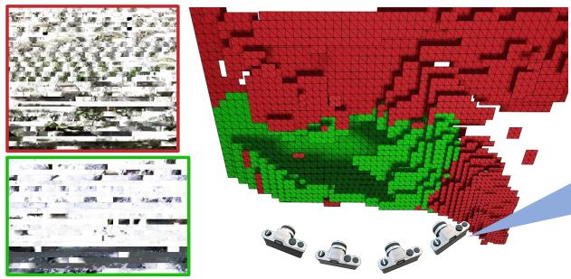  
(a) Reconstructed 3D Video Representation

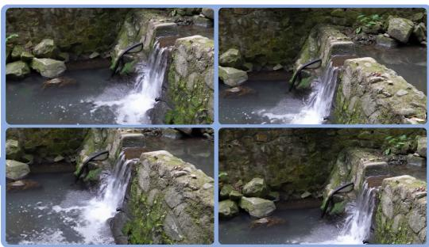  
(b) View and Time Control

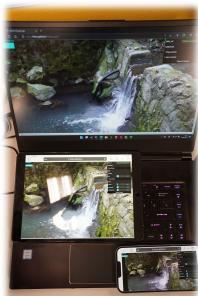  
(c) Real Time Demo

Figure 1. Given a set of asynchronous multi-view videos, we propose a pipeline to construct a novel 3D looping video representation (a), which consists of a static texture atlas, a dynamic texture atlas, and multiple tiles as the geometry proxy. The 3D video loops allow both view and time control (b), and can be rendered in real time even on mobile devices (c). We strongly recommend readers refer to the supplementary material for video results.

## Abstract

Looping videos are short video clips that can be looped endlessly without visible seams or artifacts. They provide a very attractive way to capture the dynamism of natural scenes. Existing methods have been mostly limited to 2D representations. In this paper, we take a step forward and propose a practical solution that enables an immersive experience on dynamic 3D looping scenes. The key challenge is to consider the per-view looping conditions from asynchronous input while maintaining view consistencyfor the 3D representation. We propose a novel sparse 3D video representation, namely Multi-Tile Video (MTV), which not only provides a view-consistent prior, but also greatly reduces memory usage, making the optimization of a 4D volume tractable. Then, we introduce a two-stage pipeline to construct the 3D looping MTVfrom completely asynchronous multi-view videos with no time overlap. A novel looping loss based on video temporal retargeting algorithms is adopted during the optimization to loop the 3D scene. Experiments of our framework have shown promise in successfully generating and rendering photorealistic 3D looping videos in real time even on mobile devices. The code, dataset, and live demos are available in https: //limacv.github.io/VideoLoop3D\_web/.

## 1. Introduction

Endless looping videos are fascinating ways to record special moments. These video loops are compact in terms of storage and provide a much richer experience for scenes that exhibit looping behavior. One successful commercial use of this technique is the live photo [19] feature in the Apple iPhone, which tries to find an optimal looping period and fade in/out short video clips to create looping videos. There have been several works on automatically constructing 2D looping videos from non-looping short video clips. Liao et al. [24] first propose to create 2D video loops from videos captured with static cameras. They solve for the optimal starting frame and looping period for each pixel in the input video to composite the final video. Later on, several methods are proposed to improve the computation speed [23], or extend to panoramas [1, 36], and gigapixel videos [16]. However, few attempts have been made to extend video loops to a 3D representation. One existing work that shares a similar setting as ours is VBR [46], which generates plausible video loops in novel views. However, it comes with some limitations: It builds on top of ULR [5], which can produce ghosting artifacts due to inaccurate mesh reconstruction, as shown in [30]. Besides, VBR generates looping videos and reduces the inconsistency from asynchronous input by adaptively blending in different frequency domains, which tends to blur away details.

To allow free-view observation of the looping videos, a proper 3D representation needs to be employed. Recently, tremendous progress has been made in novel view synthesis based on 3D scene representations such as triangle meshes [37, 38, 45], Multi-plane Image (MPI) [9, 56], and Neural Radiance Field (NeRF) [7, 31, 32], which could be reconstructed given only sparse observations of real scenes and render photo-realistic images in novel views. Much effort has been made to adapt these methods to dynamic scenes, which allows for both viewing space and time controls [2,6,27,28,34,35,52,57]. Therefore, a straightforward solution to generate a 3D looping video is to employ the 2D looping algorithms for each view and lift the results to 3D using these methods. However, we find it hard to get satisfactory results since the 2D looping algorithms do not consider view consistency, which is even more challenging for the asynchronous multi-view videos that we use as input.

In this work, we develop a practical solution for these problems by using the captured video input of the dynamic 3D scene with only one commodity camera. We automatically construct a 3D looping video representation from completely asynchronous multi-view input videos with no time overlap. To get promising 3D video loop results, two main issues need to be addressed. First, we need to solve for a view-consistent looping pattern from inconsistent multi-view videos, from which we need to identify spatio-temporal 3D patches that are as consistent as possible. Second, the 3D video potentially requires a memoryintensive 4D volume for storage. Therefore, we need to develop a 3D video representation that is both efficient in rendering and compact in memory usage to make the optimization of the 4D volume tractable.

To this end, we develop an analysis-by-synthesis approach that trains for a view-consistent 3D video representation by optimizing multi-view looping targets. We propose an efficient 3D video representation based on Multiplane Images (MPIs), namely Multi-tile Videos (MTVs), by exploiting the spatial and temporal sparsity of the 3D scene. As shown in Fig. 2, instead of densely storing large planes, MTVs store static or dynamic texture tiles that are sparsely scattered in the view frustum. This greatly reduces the memory requirement for rendering compared with other 3D video representations, making the optimization of the 3D looping video feasible in a single GPU. The sparsity of MTVs also serves as a view-consistent prior when optimizing the 3D looping video. To optimize the representation for looping, we formulate the looping generation for each view as a temporal video retargeting problem and develop a novel looping loss based on this formulation. We propose a two-stage pipeline to generate a looping MTV, and the experiments show that our method can produce photorealistic 3D video loops that maintain similar dynamism from the input, and enable real-time rendering even in mobile devices.

Our contributions can be summarized as follows:

• We propose Multi-tile Videos (MTVs), a novel dynamic 3D scene representation that is efficient in rendering and compact in memory usage.

• We propose a novel looping loss by formulating the 3D video looping construction as a temporal retargeting problem.

• We propose a two-stage pipeline that constructs MTVs from completely asynchronous multi-view videos.

## 2. Related Work

Our work lies at the confluence of two research topics: looping video construction and novel view synthesis. We will review each of them in this section.

Video Loops. Several works have been proposed to synthesize looping videos from short video clips. Schodl et¨ al. [40] create video loops by finding similar video frames and jumping between them. Audio [33] can also be leveraged for further refinement. Liao et al. [24] formulate the looping as a combinatorial optimization problem that tries to find the optimal start frame and looping period for each pixel. It seeks to maximize spatio-temporal consistency in the output looping videos. This formulation is further developed and accelerated by Liao et al. [23], and extended to gigapixel looping videos [16] by stitching multiple looping videos. Panorama video loops can also be created by taking a video with a panning camera [1, 36]. VBR [46] generates loops by fading in/out temporal Laplacian pyramids, and extends video loops to 3D using ULR [5]. Another line of work tries to create video loops from still images and strokes provided by users as rough guidelines of the looping motion. Endless Loops [15] tries to find self-similarities from the image and solve for the optical flow field, which is then used to warp and composite the frames of the looping video. This process can also be replaced by data-driven approaches [18, 29], or physics-based simulation [8]. Despite the progress in creating various forms of looping videos, extending looping videos to 3D is still an unexplored direction.

Novel View Synthesis of Dynamic Scenes. Novel View Synthesis (NVS) aims at interpolating views given only a set of sparse input views. For dynamic scenes, NVS requires the construction of a 4D representation that allows for both space and time control. Some methods use synchronized multi-view videos as input, which are often only available in a studio setting [27, 28, 57], or using specially designed camera arrays [4, 9, 21, 25]. To ease hardware requirements, Open4D [3] uses unconstrained multi-view input, but still requires multiple observations at the same timestamp. With the development of neural rendering, it is possible to use only monocular input. However, this is a highly ill-posed problem since the camera and scene elements are moving simultaneously. Some methods use extra sensors such as a depth sensor [2,6], while some use a datadriven prior to help construct the scene geometry [12, 50]. Others use a hand-crafted motion prior to regularize the scene motion [22, 34, 35, 47], which usually can only handle simple motions. In our setting, we take asynchronous multi-view videos with no time overlap, which is a setting that has not been addressed before.

3D Scene Representations. A critical issue in NVS is the underlying scene representation. A triangle mesh is the most commonly used scene representation in commercial 3D software. Some methods use meshes as their representation [37, 38, 46]. However, reconstructing an accurate, temporally consistent mesh is still an open problem, being particularly challenging for complex in-the-wild scenes [28]. A volumetric representation is another option to express the 3D world by storing scene parameters in a dense 3D grid [11, 27, 49, 54]. One benefit is that it trivially supports differentiable rendering, which greatly improves the reconstruction quality. The Multi-plane Image (MPI) [9, 10, 30, 44, 48, 56] is an adapted volumetric representation that represents a scene using multiple RGBA planes in the camera frustum. Volume representations can model complex geometry, but at the cost of higher memory usage. Another rapidly developing representation is Neural Radiance Field (NeRF) [31], which models scenes as continuous functions and parameterizes the function as an implicit neural network. It achieves photorealistic rendering results at the expense of long training and rendering times, especially for dynamic scenes.

## 3. Method

## 3.1. Overview

Our goal is to reconstruct a view-consistent 3D video representation that can be looped infinitely using completely asynchronous multi-view 2D videos. We start by introducing a novel 3D video representation, namely Multitile Videos (MTVs), which improves efficiency by exploiting sparsity. Then we propose a two-stage pipeline as shown in Fig. 3 to construct a 3D looping MTV. In the first stage, we initialize the MTV by optimizing a static Multiplane Image (MPI) and a 3D loopable mask using long exposure images and 2D loopable masks derived from the input videos. We then construct an MTV through a tile culling process. In the second stage, we train the MTV using an analysis-by-synthesis approach in a coarse-to-fine manner. The key enabler for this process is a novel looping loss based on video retargeting algorithms, which encourages a video to simultaneously loop and preserve similarity to the input. The remainder of this section describes the details of this proposed approach.

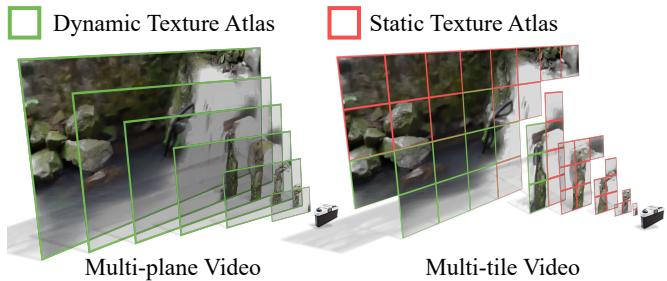  
Figure 2. Comparison between the Multi-plane Video representation and the Multi-tile Video representation.

## 3.2. Data Preparation

The input to our system are multiple asynchronous videos of the same scene from different views. Each video $\mathbf { V } \in \mathbb { R } ^ { F \times H \times W \times 3 }$ is a short clip with F frames and a resolution of $H \times W$ . Video lengths may differ for each view. Each video is expected to have a fixed camera pose, which can be achieved using tripods or existing video stabilization tools during post-process. Since we allow videos to be asynchronous, we could capture each view sequentially using a single commodity camera.

Given the precondition that the captured scene contains mostly repetitive content, we assume the long exposure images for each view to be view-consistent. Therefore, we compute an average image for each video V, and then register a pinhole camera model for each video using COLMAP [41, 42]. We also compute a binary loopable mask for each input video similar to Liao et al. [23], where 1 indicates pixel with the potential to form a loop and 0 otherwise.

## 3.3. Multi-tile Video (MTV) Representation

Before introducing our proposed MTV representation, we first briefly review the MPI representation [56]. An MPI represents the scene using D fronto-parallel RGBA planes in the frustum of a reference camera, with each plane arranged at fixed depths [48]. To render an MPI from novel views, we first need to warp each plane based on the depth of the plane and the viewing camera, and then iteratively blend each warped plane from back to front. A straightforward dynamic extension of MPI, namely Multi-plane Video (MPV), is to store a sequence of RGBA maps for each plane. For a video with T frames, this results in a 4D volume in $\mathbb { R } ^ { D \times T \times H \times W \times 4 }$ , which is very memory consuming. Inspired by recent work on sparse volume representation [17,26,53], we propose Multi-tile Videos, which reduce the memory requirements by exploiting the spatio-temporal sparsity of the scene. Specifically, we subdivide each plane into a regular grid of tiny tiles. Each tile $\mathbf { T } \in \mathbb { R } ^ { F \times H _ { s } \times \mathbf { \dot { W } _ { s } } }$ s×4 stores a small RGBA patch sequence with spatial resolution $H _ { s } \times W _ { s }$ . For each tile, we assign a label l by identifying whether it contains looping content $l _ { l o o p } ,$ a static scene $l _ { s t a t i c } .$ , or is simply empty $l _ { e m p t y }$ . We could then store a single RGBA patch for $l _ { s t a t i c } .$ , and discard tiles that are empty. Fig. 1 visualizes a reconstructed MTV representation, where the RGBA patches are packed into static and dynamic texture atlas. Fig. 2 shows the difference between MPVs and MTVs.

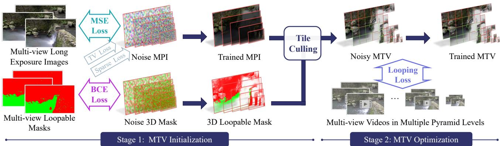  
Figure 3. The two-stage pipeline to generate the MTV representation from multi-view videos.

## 3.4. Stage 1: MTV Initialization

We find that optimizing a dense MTV directly from scratch results in the approach being easily trapped in local minima, which yields view-inconsistent results. To address this, we use a two-stage pipeline shown in Fig. 3. In the first stage, we start by constructing a “long exposure” MPI. Then we initialize the sparse MTV by tile culling process that removes unnecessary tiles. By reducing the number of parameters, the initialized MTV provides a view-consistent prior and leads to a high-quality 3D video representation.

Training a looping-aware MPI. We start by training a dense MPI M $\mathbf { \bar { \epsilon } } \in \mathbb { R } ^ { D \times H \times W \times 4 }$ , as well as a 3D loopable mask $\mathbf { L } \in \mathbb { R } ^ { D \times H \times W }$ , using the average image and the 2D loopable mask, respectively. We randomly initialize M and L, and in each iteration, we randomly sample a patch in a random view, and render an RGB patch $\hat { \mathbf { p } } _ { c } \in \mathbb { R } ^ { h }$ ×w×3 and a loopable mask patch $\hat { \mathbf { p } } _ { l } \in \mathbb { R } ^ { h \times w }$ using the standard MPI rendering method. Note that the α channel is shared between M and L during rendering. We supervise the MPI M by minimizing the Mean Square Error (MSE) between the rendering results and the corresponding patch $\mathbf { p } _ { c }$ from the average image. We supervise the loopable mask L by minimizing the Binary Cross Entropy (BCE) between the rendered 2D mask $\hat { \bf p } _ { l }$ and the corresponding patch $\mathbf { p } _ { l }$ from the 2D loopable mask:

$$
\begin{array} { l } { \displaystyle \mathcal { L } _ { m s e } = \frac { 1 } { h w } \| \mathbf { p } _ { c } - \hat { \mathbf { p } } _ { c } \| _ { 2 } ^ { 2 } , \qquad ( } \\ { \displaystyle \mathcal { L } _ { b c d } = \frac { 1 } { h w } \| - ( \mathbf { p } _ { l } l o g ( \hat { \mathbf { p } } _ { l } ) + ( 1 - \mathbf { p } _ { l } ) l o g ( 1 - \hat { \mathbf { p } } _ { l } ) ) \| _ { 1 } , } \end{array}\tag{1}
$$

(2)

where $\| \mathbf { p } \| _ { 1 }$ and $\| \mathbf { p } \| _ { 2 }$ are the L1 and L2 norm of a flattened patch p. The log is computed for every element of a patch.

Since the rendering of the MPI is differentiable, we optimize M and L using the Adam optimizer [20]. Optimizing all the parameters freely causes noisy artifacts, therefore, we apply total variation (TV) regularization [39] to M:

$$
\mathcal { L } _ { t v } = \frac { 1 } { H W } ( \| \Delta _ { x } \mathbf { M } \| _ { 1 } + \| \Delta _ { y } \mathbf { M } \| _ { 1 } ) ,\tag{3}
$$

where $\| \Delta _ { x } \mathbf { M } \| _ { 1 }$ is shorthand for the L1 norm of the gradient of each pixel in the MPI M along x direction, and analogously for $\begin{array} { r } { \| \Delta _ { y } \mathbf { M } \| . } \end{array}$ 1. We also adopt a sparsity loss to further encourage sparsity to the α channel of the MPI $\mathbf { M } _ { \alpha }$ as in Broxton et al. [4]. Specifically, we collect D alpha values in each pixel location of $\mathbf { M } _ { \alpha }$ into a vector $\beta ,$ where D is the number of planes. Then the sparsity loss is computed as:

$$
\mathcal { L } _ { s p a } = \frac { 1 } { H W } \sum _ { p i x e l } \frac { \| \beta \| _ { 1 } } { \| \beta \| _ { 2 } } .\tag{4}
$$

The final loss in the first stage is a weighted sum of the four losses:

$$
\mathcal { L } = \mathcal { L } _ { m s e } + \mathcal { L } _ { b c d } + \lambda _ { t v } \mathcal { L } _ { t v } + \lambda _ { s p a } \mathcal { L } _ { s p a } .\tag{5}
$$

Tile Culling. After training, we reconstruct a static MPI M as well as a 3D loopable mask L. We subdivide each plane into a regular grid of tiles. In the experiments, we subdivide the plane so that each tile has a resolution of $H _ { s } = W _ { s } = 1 6$ . We denote $\{ T _ { c } \} , \{ T _ { \alpha } \} , \{ T _ { l } \}$ to be the set of RGB color, alpha value, and loopable mask of a tile, respectively. We then assign label $l \in \{ l _ { e m p t y } , l _ { s t a t i c } , l _ { l o o p } \}$ based on the $\{ T _ { \alpha } \}$ and $\{ T _ { l } \}$ for each tile:

$$
\begin{array}{c} l = \left\{ l _ { e m p t y } { l e m p t y } \begin{array} { l i f } { m a x \{ T _ { \alpha } \} \leq \tau _ { \alpha } , } \\ { { l _ { s t a t i c } } } \end{array}  & { \mathrm { i f } \ m a x \{ T _ { \alpha } \} > \tau _ { \alpha } \mathrm { a n d } \ m a x \{ T _ { l } \} < \tau _ { l } , } \\  { l _ { l o o p } } \end{array} \right.\tag{6}
$$

We set the threshold of culling to be $\tau _ { \alpha } ~ = ~ 0 . 0 5$ and $\tau _ { l } = 0 . 5$ . We cull the tiles with $l = l _ { e m p t y }$ . For tiles with $l = l _ { l o o p } ,$ we lift the static 2D RGBA patch into a patch sequence by copying the patch T times, where $T$ is the number of frames that we would like the MTV to have. We add a small random noise to the lifted patch video to prevent the straightforward static solution. For tiles with $l = l _ { s t a t i c } ,$ we simply keep it unchanged. This culling process greatly reduces the memory requirement for optimizing the 4D volume.

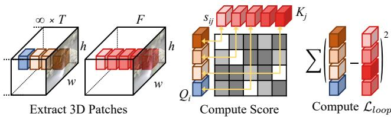  
Figure 4. Visualization of looping loss. We first pad frames and extract 3D patches along the time axis for each pixel location, then we compute a normalized similarity score for each patch pair. Finally, the looping loss is computed by averaging errors between patches with minimum scores.

## 3.5. Stage 2: MTV Optimization

After initializing the MTV representation, we then seek to optimize the final looping MTV.

Looping Loss. The main supervision of the optimization process is a novel looping loss, which is inspired by the recent progress in image [13] and video [14] retargeting algorithm. Specifically, in each iteration, we randomly sample a view and a rectangle window of size $h \times w .$ , and render the video $\hat { \mathbf { V } } _ { o } \in \mathbb { R } ^ { T \times h \times w \times 3 }$ from MTV. We denote the corresponding input video as ${ \bf V } _ { p } \in \mathbb { R } ^ { F \times h \times w \times 3 }$ . Our goal is to optimize the MTV such that $\hat { \mathbf { V } } _ { o }$ forms a looping video $\mathbf { V } _ { \infty }$

$$
{ \bf V } _ { \infty } ( t ) = \hat { { \bf V } } _ { o } ( t \bmod T ) , t \in [ 1 , + \infty ) ,\tag{7}
$$

where $\mathbf { V } ( t )$ means t-th frame of the video and mod is the modulus operation. We define the looping loss to encourage the $\mathbf { V } _ { \infty }$ to be a temporal retargeting result of $\mathbf { V } _ { p }$ . A visualization of the process is shown in Fig. 4.

We start by extracting 3D patch sets $\{ \mathbf { Q } _ { i } ; i = 1 , . . . , n \}$ and $\{ \mathbf { K } _ { j } ; j = 1 , . . . , m \}$ from $\mathbf { V } _ { \infty }$ and $\mathbf { V } _ { p } ,$ respectively, along temporal axis. $\{ \mathbf { Q } _ { i } \}$ and $\{ \mathbf { K } _ { j } \}$ are all centered at the same pixel location and we repeat the same process for every pixel. Note that although there are infinitely many patches from the looping video, the extracted patch set of the looping video is equivalent to a finite set of patches, which are extracted from the rendered video by circularly padding the first $p = s - d$ frames of the rendered video $\hat { \mathbf { V } } _ { o }$ at the end of itself, where s and d are the size and stride of the patches in the time axis. Fig. 5 demonstrates a toy example with 5 frames. By optimizing both the patches inside the video range and patches crossing the temporal boundary, we optimize a video that is both spatio-temporally consistent with the target and seamlessly looping. We then try to minimize the bidirectional similarity (BDS) [43] between the two sets of patches. Intuitively, this means every patch in $\{ \mathbf { Q } _ { i } \}$ appears in $\{ \mathbf { K } _ { j } \}$ (for coherence) and every patch in $\{ \mathbf { K } _ { j } \}$ appears in $\{ \mathbf { Q } _ { i } \}$ (for completeness).

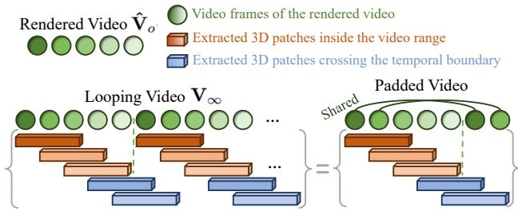  
Figure 5. For patches of size 3 and stride 1, the patch set extracted from the video that endlessly repeats 5 frames is the same as the patch set extracted from the padded video that circularly pads 2 frames.

To minimize the BDS between the two patch sets, we use the Patch Nearest Neighbor (PNN) algorithm [13] that first computes a 2D table of normalized similarity scores (NSSs) $s _ { i j }$ for every possible pair of $\mathbf { Q } _ { i }$ and $\mathbf { K } _ { j }$ . Then for each patch $\mathbf { Q } _ { i } ,$ we select a target patch ${ \bf K } _ { f ( i ) } \in \{ { \bf K } _ { j } \}$ that has minimal NSS, where $f ( i )$ is a selection function:

$$
f ( i ) = \arg \operatorname* { m i n } _ { k } s _ { i , k } , \mathrm { w h e r e }\tag{8}
$$

$$
s _ { i j } = { \frac { 1 } { \rho + \operatorname* { m i n } _ { k } \| \mathbf { Q } _ { k } - \mathbf { K } _ { j } \| _ { 2 } ^ { 2 } } } \| \mathbf { Q } _ { i } - \mathbf { K } _ { j } \| _ { 2 } ^ { 2 } .\tag{9}
$$

Here $\rho$ is a hyperparameter that controls the degree of completeness. Intuitively, when $\rho $ inf, Eq. 9 degenerates to $s _ { i j } \sim D ( \mathbf { Q } _ { i } , \mathbf { K } _ { j } )$ , so we simply select $\mathbf { K } _ { j }$ that is most similar to $\mathbf { Q } _ { i }$ . And if $\rho = 0$ , the denominator mink $D ( \mathbf { Q } _ { k } , \mathbf { K } _ { j } )$ penalizes the score if there are already some $\mathbf { Q } _ { i }$ that is closest to $\mathbf { K } _ { j }$ . Thus, the selection will prefer patches that have not yet been selected.

Using the PNN algorithm, we get the set of patches $\{ \mathbf { K } _ { f ( i ) } \}$ that is coherent to the target patch set $\{ \mathbf { K } _ { j } \}$ , and the completeness is controlled by $\rho .$ The looping loss is then defined as the MSE loss between $\mathbf { Q } _ { i }$ and ${ \bf K } _ { f ( i ) } .$

$$
\mathcal { L } _ { l o o p } = \frac { 1 } { n h w } \sum _ { p i x e l } \sum _ { i = 1 } ^ { n } \| \mathbf { Q } _ { i } - \mathbf { K } _ { f ( i ) } \| _ { 2 } ^ { 2 } ,\tag{10}
$$

where $\sum { _ { p i x e l } }$ indicates that the term is summed over all the pixel locations of the rendered video.

Pyramid Training. In the implementation, we adopt a pyramid training scheme. In the coarse level, we downsample both the input video and the MTV. The downsampling of the MTV is conducted by downsampling the tiles. We start from the coarsest level with downsample factor 0.24 and train the MTV representation for 50 epochs. We then upsample each tile by 1.4× and repeat the training step. We show that the pyramid training scheme can improve the generation results.

<table><tr><td></td><td>VLPIPS↓</td><td> $S T D e r r \textbar { ‰}$ </td><td> $C o m . \downarrow$ </td><td> $C o h . \downarrow$ </td><td> $L o o p Q \downarrow$ </td><td> $\# . P a r a m s . \downarrow$ </td><td> $R e n d e r { S p d \uparrow }$ </td></tr><tr><td>Ours</td><td>0.1392</td><td>56.02</td><td>10.65</td><td>9.269</td><td>9.263</td><td>33M-184M</td><td>140fps</td></tr><tr><td>VBR</td><td>0.2074</td><td>82.36</td><td>12.98</td><td>11.42</td><td>11.49</td><td>300M</td><td>20fps</td></tr><tr><td> $\log 2 \mathrm { D } + \mathrm { M T V }$ </td><td>0.2447</td><td>118.9</td><td>11.83</td><td>9.919</td><td>9.927</td><td>33M-184M</td><td>140fps</td></tr><tr><td> $\log 2 \mathrm { D } + \mathrm { M P V }$ </td><td>0.2546</td><td>117.5</td><td>11.82</td><td>9.817</td><td>9.840</td><td>2123M</td><td>110fps</td></tr><tr><td> $\mathrm { l o o p 2 D + D y N e R F }$ </td><td>0.2282</td><td>123.7</td><td>11.93</td><td>10.23</td><td>10.27</td><td>2M</td><td>0.1fps</td></tr></table>

Table 1. Quantitative comparison of reconstruction quality and efficiency. ↓ (↑) indicates lower (higher) is better. Our method produces the best quality and strikes a good balance between the number of parameters and rendering speed.

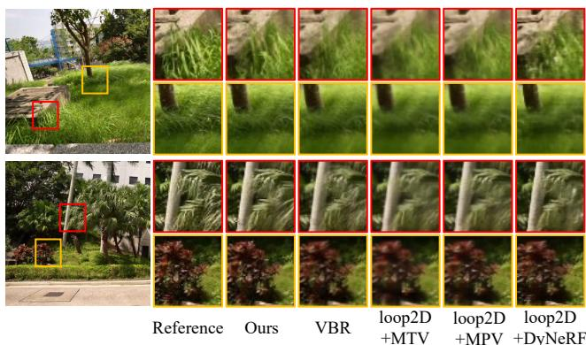  
Figure 6. Qualitative comparison with other baselines. Our method produces the sharpest results.

## 4. Experiments

## 4.1. Implementation Details

We captured 16 scenes for quantitative and qualitative studies. For each scene, we captured 8-10 views in a faceforward manner using a Sony α9 II camera. We captured each view at 25 fps for 10-20 seconds. We downsample each video to a resolution of $6 4 0 \times 3 6 0$ . Finally, we randomly select one view for evaluation. The others are used for constructing MTVs using the two-stage pipeline. In the first stage, we empirically set $\lambda _ { t v } = 0 . 5$ and $\lambda _ { s p a } = 0 . 0 0 4$ We construct MPI with $D = 3 2$ layers. In the second stage, we let the hyperparameter $\rho = 0$ to guarantee maximum completeness. We extract 3D patches with spatial dimension 11 and temporal dimension 3. We construct MTVs with approximately 50 frames, i.e., 2 seconds. We set the rendering window in each iteration to $h = 1 8 0 , w = 3 2 0$ for both stages.

## 4.2. Metrics

For our quantitative study, we synthesize looping videos in test views using the reconstructed 3D video representation and compare the synthetic results with captured target videos. However, we do not have paired ground truth videos since we generate 3D videos with completely asynchronous inputs. Therefore, we adopt several intuitive metrics to evaluate the results in spatial and temporal aspects.

Spatial Quality. We evaluate the spatial quality of a synthetic frame by computing the LPIPS value [55] between the synthetic frame with the frame in the target video that is most similar in terms of LPIPS. We average the values among all the 50 synthetic frames, which we denote as VLPIPS.

Temporal Quality. Given two videos that have similar dynamism, they should have similar color distribution in each pixel location. We measure the temporal quality of the synthetic videos by first computing the standard deviation (STD) of the RGB color at each pixel location of the synthetic video and the target video, resulting in two STD maps of dimension $H \times W \times 3$ . We then compute STDerr by measuring the MSE between the two maps.

Spatio-temporal Quality. We evaluate the spatio-temporal similarity between the synthetic and target videos following the bidirectional similarity (BDS) [43]. We individually report Completeness and Coherence scores (abbreviated as Com. and Coh., respectively) by extracting and finding nearest neighbor 3D patches in two directions. Specifically, for each patch in the target video, we find the closest patches in the synthetic video for Com. and vice-versa. We measure the distance of two 3D patches using MSE, and the final scores are the averages of multiple different patch configurations of size and stride. We present the details of the patch configurations in the supplementary material.

In addition, we use a metric similar to Coh. to measure the loop quality (LoopQ), which reflects the coherence of the looping video when switching from the last frame back to the first frame. This is achieved by extracting the 3D patches that overlap with the first and last frame, as shown by the blue rectangles in Fig. 5. Other steps remain the same as the Coh. score.

## 4.3. Comparisons

We first compare with VBR [46] by implementing it based on the descriptions in the paper since the code and data are not publicly available. We also compare with straightforward solutions that lift classical 2D looping algorithms to 3D. Specifically, we first generate a 2D looping video for each of the input videos using the method of Liao et al. [23]. And then we construct various scene representations using the 2D looping video and synthesize novel views. We compare with our sparse MTV representation $( l o o p 2 D + M T V )$ , the Multi-plane Video representation $( l o o p 2 D + M P V )$ and the dynamic NeRF representation [21] $( l o o p 2 D + D y N e R F )$

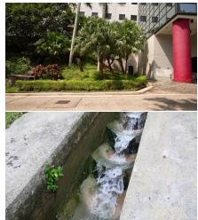  
Reference

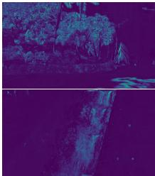  
Ours

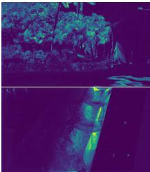  
VBR

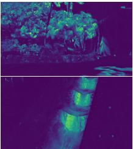  
loop2D + MTV

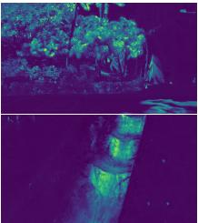  
loop2D + MPV

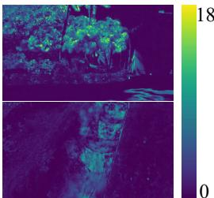  
loop2D + DyNeRF

Figure 7. We visualize the pixel-wise STDerr value for each method. Our method has a lower error, indicating that our approach best retains the dynamism of the scene. We recommend readers watch the supplemental video, where the difference is more noticeable.  
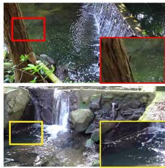  
Reference

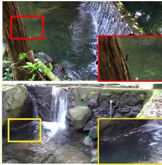  
Ours

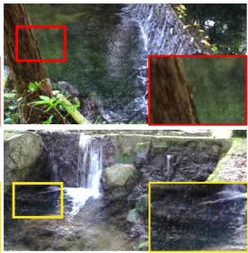  
w/o 2stage

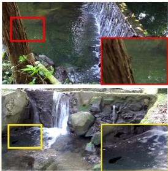  
w/o pyr

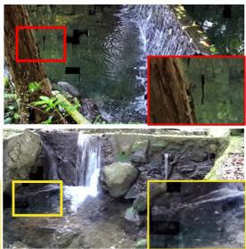  
w/o tv

Figure 8. Results of our ablations. Our full model produces the fewest artifacts.
<table><tr><td></td><td colspan="4">VLPIPS ↓ STDerr ↓ Com. ↓ Coh. ↓ LoopQ ↓</td></tr><tr><td>Ours</td><td>0.1392</td><td>56.02 10.65</td><td>9.269</td><td>9.263</td></tr><tr><td>w/o pad</td><td>0.1387</td><td>55.67 10.66</td><td>9.273</td><td>9.395</td></tr><tr><td>w/o 2stage</td><td>0.1755 67.99</td><td>11.69</td><td>9.982</td><td>10.13</td></tr><tr><td>w/o pyr</td><td>0.1412</td><td>57.41 10.86</td><td>9.555</td><td>9.465</td></tr><tr><td></td><td></td><td>11.12</td><td></td><td></td></tr><tr><td>w/o tv</td><td>0.1530</td><td>56.51</td><td>9.766</td><td>9.689</td></tr></table>

Table 2. Ablations of our method. ↓ (↑) indicates lower (higher) is better. (best in bold, and second best underlined)

We compare our method with the four baselines on our captured dataset. We synthesize novel view videos and report VLPIPS, STDerr, Com., Coh. and LoopQ metrics in Tab. 1. Our method outperforms other baselines in terms of visual quality, scene dynamism preservation, spatio-temporal consistency, and loop quality. We show the qualitative comparison in Fig. 6. We also visualize the STDerr value for each pixel in Fig. 7, which reflects the difference in dynamism between the synthetic results and the reference. We recommend that readers also see the video results included in the supplementary material. Note that our method produces the sharpest results, while best retaining the dynamism of the scene. VBR directly blends inconsistent videos from multiple input views. and the 2D looping baselines fail to consider multi-view information and produce view-inconsistent looping videos. As a result, they tend to blur out spatial and temporal details to compensate for view inconsistencies. We observe that loop2D+DyNeRF also generates sharper results compared with the other two baselines. This is because DyNeRF conditions on the view direction and tolerates the view inconsistency. However, it performs poorly in maintaining the dynamism of the scene.

Additionally, we measure the efficiency of the scene representations using several metrics. We first show the number of parameters (# Params.) of the model to represent a dynamic 3D volume of 50 frames. We evaluate rendering speed (Render Spd) at a 360 × 640 resolution on a laptop equipped with an RTX 2060 GPU. We present the metrics in Tab. 1. Since the MTV representation varies with different scenes, we report the maximum and minimum values when evaluated in our dataset. We can see that our method surpasses VBR in # Params. and Render Spd. Compared with MPV that densely stores the scene parameters in a 4D volume, our sparse MTV representation can reduce the number of parameters by up to 98%, resulting in a slightly faster rendering speed and much smaller memory and disk usage. On the other hand, despite the surprisingly small number of parameters, the NeRF representation has extremely slow rendering speed. In other words, our MTV representation achieves the best trade-off between the number of parameters and rendering efficiency.

## 4.4. Ablation Studies

We conducted extensive ablation studies of our method to test the effectiveness of several design decisions in our pipeline by individually removing each component and constructing 3D looping videos from our dataset. We experimented on the following components: the frame padding operation as illustrated in Fig. 5 when computing $\mathcal { L } _ { l o o p }$ (w/o pad), the two-stage training pipeline (w/o 2stage), the coarse-to-fine training strategy (w/o pyr), and the TV regularization (w/o tv). The numerical results are shown in Tab. 2, and qualitative results are presented in Fig. 8 and Fig. 9. We also experimented with different values of $\lambda _ { s p a }$ and $\rho$ to understand the resulting effect.

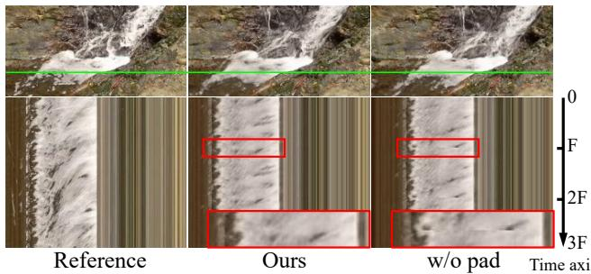  
Figure 9. Ablations for the padding operation. In the second row, we visualize the temporal coherence by flattening the pixels in the green line along the time axis and repeating 3 times. Red rectangles highlight the discontinuity produced without the padding operation. We encourage readers to refer to the video results for a clearer demonstration.

Padding Operation. As shown in Tab. 2, without the padding operation, our method can still produce competitive results in terms of spatial quality and spatio-temporal consistency. It even has better temporal quality. This is because the padding operation adds extra boundary conditions to the optimization, making the optimization more difficult. However, as highlighted in the red rectangles in Fig. 9, without padding, our method is less prone to generate a properly looping video since it can not guarantee a smooth transition from the last frame to the first frame, leading to a lower loop quality score.

Two-stage Pipeline. It can be seen from Tab. 2 that the two-stage pipeline plays an important role in generating high-quality results. Without the two-stage pipeline, where we directly optimize a dense MPV representation using the looping loss, the MPV easily gets trapped into viewinconsistent results, leading to significant drop in every metric evaluated.

Coarse-to-fine Training. Results also show that the coarseto-fine training scheme produces slightly better spatial and temporal quality than optimizing only on the finest level. This is because the patch-based optimization has a wider perceptual field at the coarse level, leading to a better global solution. Therefore, our full model tends to produce fewer artifacts compared with the w/o pyr model.

TV Regularization. We find it necessary to apply TV regularization, since the pipeline tends to generate MTVs with holes without this regularization, as shown in Fig. 8, which greatly affects the visual quality.

Weight for $\mathcal { L } _ { s p a } .$ We experimented on different values of $\lambda _ { s p a }$ on one scene. We plot the relationship between Coh. scores and # Params. with respect to $\lambda _ { s p a }$ . We can see that when $\lambda _ { s p a } = 0$ , the reconstructed MTV is less sparse, which degenerates to a dense representation. This makes it harder to optimize and leads to a worse Coh. score. Then # Params. and Coh. drop rapidly as $\lambda _ { s p a }$ grow. However, if $\lambda _ { s p a }$ is larger than a threshold, Coh. increases again, while the improvement on # Params. is less substantial. This is because the excessive sparseness causes the tile-culling process to over-cull necessary tiles, resulting in holes in the rendering results. Therefore, we chose $\lambda _ { s p a } = 0 . 0 0 4$ (green line in Fig. 10) in other experiments.

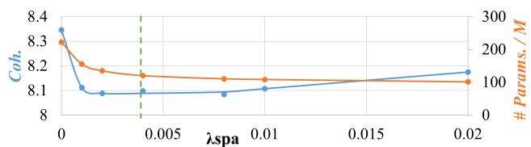  
Figure 10. The trend of Coh. score and # Params. under different $\lambda _ { s p a }$ . The green line is the value we use in all other experiments.

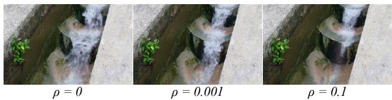  
Figure 11. Controlling the dynamism by changing $\rho .$

Value of $\dot { \rho } .$ In the experiments, we use $\rho = 0$ to ensure maximum completeness with respect to the input video. However, we find that by controlling the hyperparameter ρ, we could control the degree of dynamism of the reconstructed 3D video. One example is shown in Fig. 11.

## 5. Discussion and Conclusion

Limitations and Future Work. Our method comes with some limitations. First, since the MTV representation does not condition on view direction, it fails to model complex view-dependent effects, such as non-planar specular. One possible way to improve the representation is by introducing view-dependency, such as spherical harmonics [53] or neural basis function [51]. Another limitation is that we assume the scene to possess a looping pattern, which works best for natural scenes like flowing water and waving trees. However, if the scene is not loopable, our method tends to fail because each view has a completely unique content. This leads to a highly ill-posed problem in constructing a looping video from the asynchronous input videos.

Conclusion. In this paper, we propose a practical solution for constructing a 3D looping video representation given completely asynchronous multi-view videos. Experiments verify the effectiveness of our pipeline and demonstrate significant improvement in quality and efficiency over several baselines. We hope that this work will further motivate research into dynamic 3D scene reconstruction.

Acknowledgements. The authors from HKUST were partially supported by the Hong Kong Research Grants Council (RGC). The author from CityU was partially supported by an ECS grant from the RGC (Project No. CityU 21209119).

## References

[1] Aseem Agarwala, Ke Colin Zheng, Chris Pal, Maneesh Agrawala, Michael Cohen, Brian Curless, David Salesin, and Richard Szeliski. Panoramic video textures. ACM Trans. Graph., 24(3):821–827, jul 2005. 1, 2

[2] Benjamin Attal, Eliot Laidlaw, Aaron Gokaslan, Changil Kim, Christian Richardt, James Tompkin, and Matthew O’Toole. Torf: Time-of-flight radiance fields for dynamic¨ scene view synthesis. Advances in neural information processing systems, 34:26289–26301, 2021. 2, 3

[3] Aayush Bansal, Minh Vo, Yaser Sheikh, Deva Ramanan, and Srinivasa Narasimhan. 4d visualization of dynamic events from unconstrained multi-view videos. In Proceedings of the IEEE/CVF Conference on Computer Vision and Pattern Recognition, pages 5366–5375, 2020. 2

[4] Michael Broxton, John Flynn, Ryan Overbeck, Daniel Erickson, Peter Hedman, Matthew Duvall, Jason Dourgarian, Jay Busch, Matt Whalen, and Paul Debevec. Immersive light field video with a layered mesh representation. ACM Transactions on Graphics (TOG), 39(4):86–1, 2020. 2, 4

[5] Chris Buehler, Michael Bosse, Leonard McMillan, Steven Gortler, and Michael Cohen. Unstructured lumigraph rendering. In Proceedings of the 28th annual conference on Computer graphics and interactive techniques, pages 425– 432, 2001. 1, 2

[6] Hongrui Cai, Wanquan Feng, Xuetao Feng, Yan Wang, and Juyong Zhang. Neural surface reconstruction of dynamic scenes with monocular rgb-d camera. arXiv preprint arXiv:2206.15258, 2022. 2, 3

[7] Anpei Chen, Zexiang Xu, Andreas Geiger, Jingyi Yu, and Hao Su. Tensorf: Tensorial radiance fields. In Computer Vision–ECCV 2022: 17th European Conference, Tel Aviv, Israel, October 23–27, 2022, Proceedings, Part XXXII, pages 333–350. Springer, 2022. 2

[8] Siming Fan, Jingtan Piao, Chen Qian, Kwan-Yee Lin, and Hongsheng Li. Simulating fluids in real-world still images. arXiv preprint arXiv:2204.11335, 2022. 2

[9] John Flynn, Michael Broxton, Paul Debevec, Matthew Du-Vall, Graham Fyffe, Ryan Overbeck, Noah Snavely, and Richard Tucker. Deepview: View synthesis with learned gradient descent. In Proceedings of the IEEE/CVF Conference on Computer Vision and Pattern Recognition, pages 2367– 2376, 2019. 2, 3

[10] John Flynn, Ivan Neulander, James Philbin, and Noah Snavely. Deepstereo: Learning to predict new views from the world’s imagery. In Proceedings of the IEEE conference on computer vision and pattern recognition, pages 5515–5524, 2016. 3

[11] Sara Fridovich-Keil, Alex Yu, Matthew Tancik, Qinhong Chen, Benjamin Recht, and Angjoo Kanazawa. Plenoxels: Radiance fields without neural networks. In Proceedings of the IEEE/CVF Conference on Computer Vision and Pattern Recognition, pages 5501–5510, 2022. 3

[12] Chen Gao, Ayush Saraf, Johannes Kopf, and Jia-Bin Huang. Dynamic view synthesis from dynamic monocular video. In Proceedings of the IEEE/CVF International Conference on Computer Vision, pages 5712–5721, 2021. 3

[13] Niv Granot, Ben Feinstein, Assaf Shocher, Shai Bagon, and Michal Irani. Drop the gan: In defense of patches nearest neighbors as single image generative models. In Proceedings of the IEEE/CVF Conference on Computer Vision and Pattern Recognition (CVPR), pages 13460–13469, June 2022. 5

[14] Niv Haim, Ben Feinstein, Niv Granot, Assaf Shocher, Shai Bagon, Tali Dekel, and Michal Irani. Diverse generation from a single video made possible. arXiv preprint arXiv:2109.08591, 2021. 5

[15] Tavi Halperin, Hanit Hakim, Orestis Vantzos, Gershon Hochman, Netai Benaim, Lior Sassy, Michael Kupchik, Ofir Bibi, and Ohad Fried. Endless loops: detecting and animating periodic patterns in still images. ACM Transactions on Graphics (TOG), 40(4):1–12, 2021. 2

[16] Mingming He, Jing Liao, Pedro V Sander, and Hugues Hoppe. Gigapixel panorama video loops. ACM Transactions on Graphics (TOG), 37(1):1–15, 2017. 1, 2

[17] Peter Hedman, Pratul P Srinivasan, Ben Mildenhall, Jonathan T Barron, and Paul Debevec. Baking neural radiance fields for real-time view synthesis. In Proceedings of the IEEE/CVF International Conference on Computer Vision, pages 5875–5884, 2021. 3

[18] Aleksander Holynski, Brian L Curless, Steven M Seitz, and Richard Szeliski. Animating pictures with eulerian motion fields. In Proceedings of the IEEE/CVF Conference on Computer Vision and Pattern Recognition, pages 5810– 5819, 2021. 2

[19] Apple Inc. Take and edit live photos, Oct 2021. 1

[20] Diederik P. Kingma and Jimmy Ba. Adam: A method for stochastic optimization. In Yoshua Bengio and Yann LeCun, editors, 3rd International Conference on Learning Representations, ICLR 2015, San Diego, CA, USA, May 7-9, 2015, Conference Track Proceedings, 2015. 4

[21] Tianye Li, Mira Slavcheva, Michael Zollhoefer, Simon Green, Christoph Lassner, Changil Kim, Tanner Schmidt, Steven Lovegrove, Michael Goesele, Richard Newcombe, et al. Neural 3d video synthesis from multi-view video. In Proceedings of the IEEE/CVF Conference on Computer Vision and Pattern Recognition, pages 5521–5531, 2022. 2, 7

[22] Zhengqi Li, Simon Niklaus, Noah Snavely, and Oliver Wang. Neural scene flow fields for space-time view synthesis of dynamic scenes. In Proceedings of the IEEE/CVF Conference on Computer Vision and Pattern Recognition, pages 6498– 6508, 2021. 3

[23] Jing Liao, Mark Finch, and Hugues Hoppe. Fast computation of seamless video loops. ACM Transactions on Graphics (TOG), 34(6):1–10, 2015. 1, 2, 3, 6

[24] Zicheng Liao, Neel Joshi, and Hugues Hoppe. Automated video looping with progressive dynamism. ACM Transactions on Graphics (TOG), 32(4):1–10, 2013. 1, 2

[25] Kai-En Lin, Lei Xiao, Feng Liu, Guowei Yang, and Ravi Ramamoorthi. Deep 3d mask volume for view synthesis of dynamic scenes. In Proceedings ofthe IEEE/CVF International Conference on Computer Vision, pages 1749–1758, 2021. 2

[26] Lingjie Liu, Jiatao Gu, Kyaw Zaw Lin, Tat-Seng Chua, and Christian Theobalt. Neural sparse voxel fields. Advances

in Neural Information Processing Systems, 33:15651–15663, 2020. 3

[27] Stephen Lombardi, Tomas Simon, Jason Saragih, Gabriel Schwartz, Andreas Lehrmann, and Yaser Sheikh. Neural volumes: Learning dynamic renderable volumes from images. arXiv preprint arXiv:1906.07751, 2019. 2, 3

[28] Stephen Lombardi, Tomas Simon, Gabriel Schwartz, Michael Zollhoefer, Yaser Sheikh, and Jason Saragih. Mixture of volumetric primitives for efficient neural rendering. ACM Transactions on Graphics (TOG), 40(4):1–13, 2021. 2, 3

[29] Aniruddha Mahapatra and Kuldeep Kulkarni. Controllable animation of fluid elements in still images. In Proceedings of the IEEE/CVF Conference on Computer Vision and Pattern Recognition, pages 3667–3676, 2022. 2

[30] Ben Mildenhall, Pratul P Srinivasan, Rodrigo Ortiz-Cayon, Nima Khademi Kalantari, Ravi Ramamoorthi, Ren Ng, and Abhishek Kar. Local light field fusion: Practical view synthesis with prescriptive sampling guidelines. ACM Transactions on Graphics (TOG), 38(4):1–14, 2019. 1, 3

[31] Ben Mildenhall, Pratul P Srinivasan, Matthew Tancik, Jonathan T Barron, Ravi Ramamoorthi, and Ren Ng. Nerf: Representing scenes as neural radiance fields for view synthesis. Communications ofthe ACM, 65(1):99–106, 2021. 2, 3

[32] Thomas Muller, Alex Evans, Christoph Schied, and Alexan-¨ der Keller. Instant neural graphics primitives with a multiresolution hash encoding. ACM Trans. Graph., 41(4):102:1– 102:15, July 2022. 2

[33] Medhini Narasimhan, Shiry Ginosar, Andrew Owens, Alexei A. Efros, and Trevor Darrell. Strumming to the beat: Audio-conditioned contrastive video textures. In Proceedings ofthe IEEE/CVF Winter Conference on Applications of Computer Vision (WACV), pages 3761–3770, January 2022. 2

[34] Keunhong Park, Utkarsh Sinha, Jonathan T Barron, Sofien Bouaziz, Dan B Goldman, Steven M Seitz, and Ricardo Martin-Brualla. Nerfies: Deformable neural radiance fields. In Proceedings of the IEEE/CVF International Conference on Computer Vision, pages 5865–5874, 2021. 2, 3

[35] Keunhong Park, Utkarsh Sinha, Peter Hedman, Jonathan T Barron, Sofien Bouaziz, Dan B Goldman, Ricardo Martin-Brualla, and Steven M Seitz. Hypernerf: A higherdimensional representation for topologically varying neural radiance fields. arXiv preprint arXiv:2106.13228, 2021. 2, 3

[36] Alex Rav-Acha, Yael Pritch, Dani Lischinski, and Shmuel Peleg. Dynamosaics: Video mosaics with non-chronological time. In 2005 IEEE Computer Society Conference on Computer Vision and Pattern Recognition (CVPR’05), volume 1, pages 58–65. IEEE, 2005. 1, 2

[37] Gernot Riegler and Vladlen Koltun. Free view synthesis. In European Conference on Computer Vision, 2020. 2, 3

[38] Gernot Riegler and Vladlen Koltun. Stable view synthesis. In Proceedings ofthe IEEE Conference on Computer Vision and Pattern Recognition, 2021. 2, 3

[39] Leonid I Rudin and Stanley Osher. Total variation based image restoration with free local constraints. In Proceedings of

1st international conference on image processing, volume 1, pages 31–35. IEEE, 1994. 4

[40] Arno Schodl, Richard Szeliski, David H Salesin, and Irfan¨ Essa. Video textures. In Proceedings ofthe 27th annual conference on Computer graphics and interactive techniques, pages 489–498, 2000. 2

[41] Johannes Lutz Schonberger and Jan-Michael Frahm.¨ Structure-from-motion revisited. In Conference on Computer Vision and Pattern Recognition (CVPR), 2016. 3

[42] Johannes Lutz Schonberger, Enliang Zheng, Marc Pollefeys,¨ and Jan-Michael Frahm. Pixelwise view selection for unstructured multi-view stereo. In European Conference on Computer Vision (ECCV), 2016. 3

[43] Denis Simakov, Yaron Caspi, Eli Shechtman, and Michal Irani. Summarizing visual data using bidirectional similarity. In 2008 IEEE Conference on Computer Vision and Pattern Recognition, pages 1–8. IEEE, 2008. 5, 6

[44] Pratul P Srinivasan, Richard Tucker, Jonathan T Barron, Ravi Ramamoorthi, Ren Ng, and Noah Snavely. Pushing the boundaries of view extrapolation with multiplane images. In Proceedings of the IEEE/CVF Conference on Computer Vision and Pattern Recognition, pages 175–184, 2019. 3

[45] Justus Thies, Michael Zollhofer, and Matthias Nießner. De-¨ ferred neural rendering: Image synthesis using neural textures. ACM Transactions on Graphics (TOG), 38(4):1–12, 2019. 2

[46] Theo Thonat, Yagiz Aksoy, Miika Aittala, Sylvain Paris,´ Fredo Durand, and George Drettakis. Video-based rendering´ of dynamic stationary environments from unsynchronized inputs. In Computer Graphics Forum, volume 40, pages 73– 86. Wiley Online Library, 2021. 1, 2, 3, 6

[47] Edgar Tretschk, Ayush Tewari, Vladislav Golyanik, Michael Zollhofer, Christoph Lassner, and Christian Theobalt. Non-¨ rigid neural radiance fields: Reconstruction and novel view synthesis of a dynamic scene from monocular video. In Proceedings of the IEEE/CVF International Conference on Computer Vision, pages 12959–12970, 2021. 3

[48] Richard Tucker and Noah Snavely. Single-view view synthesis with multiplane images. In Proceedings ofthe IEEE/CVF Conference on Computer Vision and Pattern Recognition, pages 551–560, 2020. 3

[49] Liao Wang, Jiakai Zhang, Xinhang Liu, Fuqiang Zhao, Yanshun Zhang, Yingliang Zhang, Minye Wu, Jingyi Yu, and Lan Xu. Fourier plenoctrees for dynamic radiance field rendering in real-time. In Proceedings of the IEEE/CVF Conference on Computer Vision and Pattern Recognition, pages 13524–13534, 2022. 3

[50] Qianqian Wang, Zhengqi Li, David Salesin, Noah Snavely, Brian Curless, and Janne Kontkanen. 3d moments from nearduplicate photos. In Proceedings of the IEEE/CVF Conference on Computer Vision and Pattern Recognition, pages 3906–3915, 2022. 3

[51] Suttisak Wizadwongsa, Pakkapon Phongthawee, Jiraphon Yenphraphai, and Supasorn Suwajanakorn. Nex: Real-time view synthesis with neural basis expansion. In Proceedings of the IEEE/CVF Conference on Computer Vision and Pattern Recognition, pages 8534–8543, 2021. 8

[52] Jae Shin Yoon, Kihwan Kim, Orazio Gallo, Hyun Soo Park, and Jan Kautz. Novel view synthesis of dynamic scenes with globally coherent depths from a monocular camera. In Proceedings of the IEEE/CVF Conference on Computer Vision and Pattern Recognition, pages 5336–5345, 2020. 2

[53] Alex Yu, Ruilong Li, Matthew Tancik, Hao Li, Ren Ng, and Angjoo Kanazawa. Plenoctrees for real-time rendering of neural radiance fields. In Proceedings of the IEEE/CVF International Conference on Computer Vision, pages 5752– 5761, 2021. 3, 8

[54] Jiakai Zhang, Liao Wang, Xinhang Liu, Fuqiang Zhao, Minzhang Li, Haizhao Dai, Boyuan Zhang, Wei Yang, Lan Xu, and Jingyi Yu. Neuvv: Neural volumetric videos with immersive rendering and editing. arXiv preprint arXiv:2202.06088, 2022. 3

[55] Richard Zhang, Phillip Isola, Alexei A Efros, Eli Shechtman, and Oliver Wang. The unreasonable effectiveness of deep features as a perceptual metric. In CVPR, 2018. 6

[56] Tinghui Zhou, Richard Tucker, John Flynn, Graham Fyffe, and Noah Snavely. Stereo magnification: Learning view synthesis using multiplane images, 2018. 2, 3

[57] C Lawrence Zitnick, Sing Bing Kang, Matthew Uyttendaele, Simon Winder, and Richard Szeliski. High-quality video view interpolation using a layered representation. ACM transactions on graphics (TOG), 23(3):600–608, 2004. 2