# A General Regret Bound of Preconditioned Gradient Method for DNN Training

Hongwei Yong Ying Sun Lei Zhang

The Hong Kong Polytechnic University

hongwei.yong@polyu.edu.hk, {csysun, cslzhang}@comp.polyu.edu.hk

## Abstract

While adaptive learning rate methods, such as Adam, have achieved remarkable improvement in optimizing Deep Neural Networks (DNNs), they consider only the diagonal elements of the full preconditioned matrix. Though the full-matrix preconditioned gradient methods theoretically have a lower regret bound, they are impractical for use to train DNNs because of the high complexity. In this paper, we present a general regret bound with a constrained fullmatrix preconditioned gradient, and show that the updatingformula ofthe preconditioner can be derived by solving a cone-constrained optimization problem. With the blockdiagonal and Kronecker-factorized constraints, a specific guide function can be obtained. By minimizing the upper bound of the guide function, we develop a new DNN optimizer, termed AdaBK. A series of techniques, including statistics updating, dampening, efficient matrix inverse root computation, and gradient amplitude preservation, are developed to make AdaBK effective and efficient to implement. The proposed AdaBK can be readily embedded into many existing DNN optimizers, $e . g . ,$ , SGDM and AdamW, and the corresponding SGDM BK and AdamW BK algorithms demonstrate significant improvements over existing DNN optimizers on benchmark vision tasks, including image classification, object detection and segmentation. The code is publicly available at https://github.com/ Yonghongwei/AdaBK.

## 1. Introduction

Stochastic gradient descent (SGD) [26] and its variants [21, 23], which update the parameters along the opposite of their gradient directions, have achieved great success in optimizing deep neural networks (DNNs) [14, 24]. Instead of using a uniform learning rate for different parameters, Duchi et al. [5] proposed the AdaGrad method, which adopts an adaptive learning rate for each parameter, and proved that AdaGrad can achieve lower regret bound than SGD. Following AdaGrad, a class of adaptive learning rate gradient descent methods has been proposed. For example,

RMSProp [30] and AdaDelta [35] introduce the exponential moving average to replace the sum of second-order statistics of the gradient for computing the adaptive learning rate. Adam [15] further adopts the momentum into the gradient, and AdamW [22] employs a weight-decoupled strategy to improve the generalization performance. RAdam [18], Adabelief [38] and Ranger [19,32,37] are proposed to accelerate training and improve the generalization capability over Adam. The adaptive learning rate methods have become the mainstream DNN optimizers.

In addition to AdaGrad, Duchi et al. [5] provided a fullmatrix preconditioned gradient descent (PGD) method that adopts the matrix $\begin{array} { r } { \pmb { H } _ { T } = ( \sum _ { t = 1 } ^ { T } \pmb { g } _ { t } \pmb { g } _ { t } ^ { \top } ) ^ { \frac { 1 } { 2 } } } \end{array}$ to adjust the gradient $\mathbf { \pmb { g } } _ { T }$ , where t denotes the iteration number and $T$ is the number of the current iteration. It has been proved [5] that the preconditioned gradient ${ H _ { T } ^ { - 1 } } g _ { T }$ has a lower regret bound than the adaptive learning rate methods that only consider the diagonal elements of ${ \pmb { H } } _ { T }$ However, the full-matrix preconditioned gradient is impractical to use due to its high dimension, which limits its application to DNN optimization. Various works have been reported to solve this problem in parameter space by adding some structural constraints on the full-matrix ${ \pmb { H } } _ { T }$ . For instances, GGT [1] stores only the gradients of recent iterations so that the matrix inverse root can be computed efficiently by fast low-rank computation tricks. Yun et al. [34] proposed a mini-block diagonal matrix framework to reduce the cost through coordinate partitioning and grouping strategies. Gupta et al. [9] proposed to extend AdaGrad with Kronecker products of full-matrix preconditioners to make it more efficient in DNN training. Besides, natural gradient approaches [6, 7], which adopt the approximations of the Fisher matrix to correct the descent direction, can also be regarded as full-matrix preconditioners.

The existing constrained PGD (CPGD) methods, however, are heuristic since manually designed approximations to the full matrix ${ \pmb { H } } _ { T }$ are employed in them, while their influence on the regret bound is unknown. By far, they lack a general regret-bound theory that can guide us to design the full-matrix preconditioned gradient methods. On the other hand, the practicality and effectiveness of these preconditioner methods are also an issue, which prevents them from being widely used in training DNNs.

To address the above-mentioned issues, in this paper we present a theorem to connect the regret bound of the constrained full-matrix preconditioner with a guide function. By minimizing the guide function under the constraints, an updating formula of the preconditioned gradient can be derived. That is, optimizing the guide function of the preconditioner will minimize its regret bound at the same time, while different constraints can yield different updating formulas. With the commonly-used constraints on DNN preconditioners, such as the block-diagonal and Kroneckerfactorized constraints [7, 9], specific guide functions can be obtained. By minimizing the upper bound of the guide function, a new optimizer, namely AdaBK, is derived.

We further propose a series of techniques, including statistics updating, dampening, efficient matrix inverse root computation and gradient norm recovery, to make AdaBK more practical to use for DNN optimization. By embedding AdaBK into SGDM and AdamW (or Adam), we develop two new DNN optimizers, SGDM BK and AdamW BK. With acceptable extra computation and memory cost, they achieve significant performance gain in convergence speed and generalization capability over state-of-the-art DNN optimizers, as demonstrated in our experiments in image classification, object detection and segmentation.

For a better understanding of our proposed regret bound and the developed DNN optimizer, in Fig. 1, we illustrate the existing major DNN optimizers and their relationships. SGD and its momentum version (SGDM) apply the same learning rate to all parameters based on their gradient descent directions. The adaptive learning rate methods assign different learning rates to different parameters by using second-order information of the gradients, achieving better convergence performance. The adaptive learning rate methods can be viewed as special cases of PGD methods by considering only the diagonal elements of the full preconditioned matrix of gradients. Our method belongs to the class of PGD methods, while our proposed general regret bound of constrained PGD methods can be applied to the PGD optimizers under different constraints, including Ada-Grad, Full-Matrix AdaGrad and our AdaBK.

Notation system. We denote by ${ \pmb w } _ { t }$ and $\mathbf { \nabla } _ { \mathbf { \boldsymbol { g } } _ { t } }$ the weight vector and its gradient of a DNN model in the t-th iteration. Denote by $\mathbf { \Psi } _ { \mathbf { \theta } } \mathbf { \vec { g } } _ { t , i }$ the gradient of the i-th sample in a batch in the t-th iteration, we have $\begin{array} { r } { \pmb { g } _ { t } = \frac { 1 } { n } \sum _ { i = 1 } ^ { n } \pmb { g } _ { t , i } } \end{array}$ , where n is the batch size. The notations $A \succeq 0$ and $A \succ 0$ for a matrix A denote that A is symmetric positive semidefinite (PSD) and symmetric positive definite, respectively. $A \succeq B$ or $\mathbf { A } - B \succeq \mathbf { 0 }$ means that $A - B$ is PSD. Tr(A) represents the trace of the matrix A. For a PSD matrix A, $\pmb { A } ^ { \alpha } = \pmb { U } \pmb { \Sigma } ^ { \alpha } \pmb { U } ^ { \top }$ , where $U \pmb { \Sigma } \pmb { U } ^ { \top }$ is the Singular Value Decomposition (SVD) of A. $| | \pmb { x } | | _ { \pmb { A } } = \sqrt { \pmb { x } ^ { \top } }$ Ax is the Mahalanobis norm of x induced by PSD matrix $A ,$ and its dual norm is $| | \pmb { x } | | _ { \pmb { A } } ^ { * } = \sqrt { \pmb { x } ^ { \top } \pmb { A } ^ { - 1 } \pmb { x } }$ ${ \pmb A } \otimes { \pmb B }$ means the Kronecker product of A and B, while ${ \pmb { A } } \odot { \pmb { B } }$ and $A ^ { \odot \alpha }$ are the element-wise matrix product and element-wise power operation, respectively. Diag(x) is a diagonal matrix with diagonal vector x, and vec(·) denotes the vectorization function.

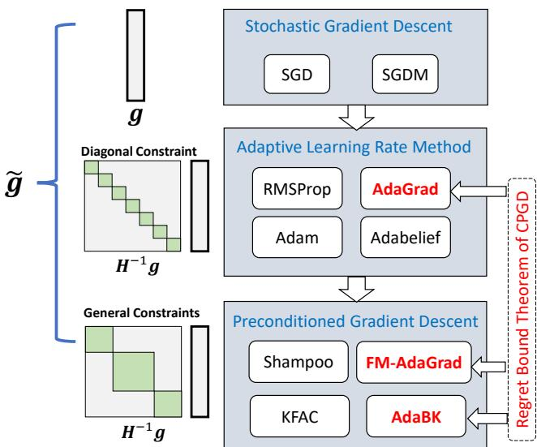  
Figure 1. Illustration of the main DNN optimizers.

## 2. Background

## 2.1. Online Convex Optimization

The online convex optimization framework [10, 28] remains the most powerful and popular tool to analyze DNN optimization algorithms, including AdaGrad [5], Adam [15], Shampoo [9], etc. Given an arbitrary, unknown sequence of convex loss functions $\{ f _ { 1 } ( { \pmb w } ) , . . . , f _ { t } ( { \pmb w } )$ $f _ { T } ( w ) ]$ }, we aim to optimize the weight ${ \pmb w } _ { t }$ in the t-th iteration, and evaluate it on the loss function $f _ { t } ( w )$ . The goal of our optimization process is to minimize the regret, which is defined as follows [10, 28]:

$$
R ( T ) = { \sum } _ { t = 1 } ^ { T } \left( f _ { t } ( \pmb { w } _ { t } ) - f _ { t } ( \pmb { \hat { w } } ) \right) ,\tag{1}
$$

where $\begin{array} { r } { \hat { \pmb { w } } = \arg \operatorname* { m i n } _ { \pmb { w } } \sum _ { t = 1 } ^ { T } f _ { t } ( \pmb { w } ) } \end{array}$ . Generally speaking, a lower regret bound means a more effective learning process.

## 2.2. Regret Bound of Preconditioned Gradient

As in previous works [5, 9], an online mirror descent with an adaptive time-dependent regularization is adopted for online convex learning. In the t-th iteration, suppose we have obtained the gradient $\mathbf { \sigma } _ { g _ { t } } = \nabla f _ { t } ( \mathbf { \sigma } \mathbf { w } _ { t } )$ , then given a PSD matrix ${ \cal H } _ { t } \succeq 0$ , the parameters are updated by optimizing the following objective function:

$$
\pmb { w } _ { t + 1 } = \arg \operatorname* { m i n } _ { \pmb { w } } \eta \pmb { g } _ { t } ^ { \top } \pmb { w } + \frac { 1 } { 2 } | | \pmb { w } - \pmb { w } _ { t } | | _ { \pmb { H } _ { t } } ^ { 2 } .\tag{2}
$$

The solution of Eq. (2) is exactly a preconditioned gradient descent step, which is

$$
\mathbf { \boldsymbol { w } } _ { t + 1 } = \mathbf { \boldsymbol { w } } _ { t } - \eta \mathbf { \boldsymbol { H } } _ { t } ^ { - 1 } \mathbf { \boldsymbol { g } } _ { t } .\tag{3}
$$

Duchi et al. [5] have provided a regret bound for online mirror descent, as shown in Lemma 1:

Lemma 1 [5, 9] For any sequence of matrices $H _ { T } \succeq$ $\ldots \succeq H _ { 1 } \succeq 0$ , the regret of online mirror descent holds that

$$
\begin{array} { r l } & { \displaystyle R ( T ) \leq \frac { 1 } { 2 \eta } { \sum _ { t = 1 } ^ { T } \left( | | \pmb { w } _ { t } - \hat { \pmb { w } } | | _ { { \pmb { H } } _ { t } } ^ { 2 } - | | \pmb { w } _ { t + 1 } - \hat { \pmb { w } } | | _ { { \pmb { H } } _ { t } } ^ { 2 } \right) } } \\ & { \quad \quad \quad + \displaystyle \frac { \eta } { 2 } { \sum _ { t = 1 } ^ { T } \left( | | \pmb { g } _ { t } | | _ { { \pmb { H } } _ { t } } ^ { * } \right) ^ { 2 } } . } \end{array}\tag{4}
$$

If we further assume $\begin{array} { r } { D = \operatorname* { m a x } _ { t \leq T } | | \pmb { w } _ { t } - \hat { \pmb { w } } | | _ { 2 } } \end{array}$ , then we have

$$
R ( T ) \leq \frac { D ^ { 2 } } { 2 \eta } T r ( H _ { T } ) + \frac { \eta } { 2 } { \sum } _ { t = 1 } ^ { T } \left( \vert \vert g _ { t } \vert \vert _ { H _ { t } } ^ { \ast } \right) ^ { 2 } .\tag{5}
$$

Our goal is to find a proper sequence of PSD matrices $\{ H _ { 1 } , H _ { 2 } , . . . , H _ { T } \}$ to minimize the regret bound in Eq (4) or (5). Duchi et al. [5] suggested to adopt $\begin{array} { r l } { \pmb { H } _ { T } } & { { } = } \end{array}$ $( \textstyle \sum _ { t = 1 } ^ { T } { \pmb { g } } _ { t } { \pmb { g } } _ { t } ^ { \top } ) ^ { \frac { 1 } { 2 } }$ as the full matrix regularization matrix. However, it is hard to directly use it for DNN optimization due to the high dimension of parameter space. Therefore, Duchi et al. simplified this full-matrix ${ \pmb { H } } _ { T }$ with its diagonal elements, resulting in the AdaGrad algorithm [5].

## 3. A General Regret Bound for Constrained Preconditioned Gradient

## 3.1. The General Regret Bound

Directly adopting a full-matrix Ht is absurd for optimizing a DNN because it is hard or even prohibitive to compute and store such a high-dimensional matrix. Hence, we need to reduce the dimension of $\pmb { H } _ { t }$ with a constraint set Ψ, $e . g .$ the set of the block-diagonal matrices [5]. In this section, we aim to construct a general and practical full-matrix regularization term in Eq. (2) to achieve the low regret bound in Eq. (4). For a general constraint set $\Psi \subseteq \mathbb { R } ^ { d \times d }$ , if it is a cone $( i . e . , \forall x \in \Psi , \theta > 0 , \theta x \in \Psi$ holds), we have the following Theorem 1 and Lemma 2, whose proofs can be found in the supplementary materials.

Theorem 1 For any cone constraint $\Psi \subseteq \mathbb { R } ^ { d \times d }$ , we define a guide function $F _ { T } ( S )$ on Ψ as

$$
F _ { T } ( \pmb { S } ) = et { } { ' } \sum _ { t = 1 } ( | | \pmb { g } _ { t } | | _ { \pmb { S } } ^ { * } ) ^ { 2 } ,\tag{6}
$$

and then define the matrix ${ \cal { H } } _ { T }$ as

$$
H _ { T } = C _ { T } S _ { T } , \quad S _ { T } = \arg \operatorname* { m i n } _ { S \in \Psi , S \succeq 0 , T r ( S ) \le 1 } F _ { T } ( S ) ,\tag{7}
$$

where $C _ { T } = \sqrt { F _ { T } ( S _ { T } ) }$ . The regret of online mirror descent holds that

$$
\begin{array} { l } { \displaystyle R ( T ) \leq ( \frac { D ^ { 2 } } { 2 \eta } + \eta ) C _ { T } } \\ { \displaystyle = ( \frac { D ^ { 2 } } { 2 \eta } + \eta ) \sqrt { \underset { S \in \Psi , S = 0 , T r ( S ) \leq 1 } { \operatorname* { m i n } } F _ { T } ( S ) } . } \end{array}\tag{8}
$$

The above theorem reveals that minimizing the guide function $F _ { T } ( S )$ on cone Ψ will minimize the regret bound of the preconditioned gradient descent algorithm simultaneously. More importantly, given a cone constraint Ψ, the optimal ${ \pmb H } _ { T } ~ = ~ C _ { T } { \pmb S } _ { T }$ that achieves the lowest regret bound can be obtained by optimizing Eq. $( 7 )$ From Theorem 1, we can know that the regret $R ( T ) \leq O ( \sqrt { \operatorname* { m i n } _ { S \in \Psi , S \succeq \mathbf { 0 } , \mathrm { T r } ( S ) \leq 1 } F _ { T } ( S ) } )$ . If two cones satisfy $\Psi _ { 1 } \subseteq \Psi _ { 2 } ,$ we have $\begin{array} { r } { \sqrt { \operatorname* { m i n } _ { \pmb { S } \in \Psi _ { 2 } , \pmb { S } \geq \mathbf { 0 } , \operatorname { T r } ( \pmb { S } ) \leq 1 } F _ { T } ( \pmb { S } ) } \leq } \end{array}$ $\begin{array} { r } { \sqrt { \operatorname* { m i n } _ { \pmb { S } \in \Psi _ { 1 } , \pmb { S } \succeq \mathbf { 0 } , \mathrm { T r } ( \pmb { S } ) } } \leq 1 \ : F _ { T } ( \pmb { S } ) } \end{array}$ . This also explains why fullmatrix regularization can achieve the lowest regret bound. In addition, we have the following lemma:

Lemma 2 Suppose that Ψ is the set of either diagonal matrices orfull-matrices, according to the definition of $S _ { T }$ and ${ \pmb { H } } _ { T }$ in Eq. (7), we have

$$
{ \bf H } _ { T } = D i a g \big ( \big ( \sum _ { t = 1 } ^ { T } g _ { t } \odot g _ { t } \big ) ^ { \odot \frac { 1 } { 2 } } \big ) , \quad { \bf H } _ { T } = \big ( \sum _ { t = 1 } ^ { T } g _ { t } g _ { t } ^ { \top } \big ) ^ { \frac { 1 } { 2 } } .\tag{9}
$$

From Lemma 2, we can easily see that the diagonal and full matrices used in AdaGrad [5] are two special cases of the results in Theorem 1.

## 3.2. Layer-wise Block-diagonal Constraint

In practice, we need to choose a proper constraint set Ψ to regularize the structure of matrix ${ \pmb { H } } _ { T }$ . The diagonal constraint is the simplest constraint. However, it results in a very low effective dimension of ${ \pmb { H } } _ { T }$ so that the regret bound is high. We aim to find a more effective and practical constraint set over ${ \cal { H } } _ { T }$ for DNN optimization.

Instead of considering the full-matrix regularization of all parameters, one can consider the full-matrix regularization of parameters within one DNN layer. Similar ideas have been adopted in KFAC [7] and Shampoo [9], which assume that the matrix ${ \pmb { H } } _ { T }$ has a block diagonal structure and each sub-block matrix is used for one layer of a DNN. Suppose matrices $S _ { l }$ and $\pmb { H } _ { l }$ are for the l-th layer, and $\mathbf {  { g } } _ { \mathbf { \mathit { l } } }$ is the gradient of weight in the l-th layer, in order to obtain the updating formula with block-diagonal constraint, we could minimize the guide function $F _ { T } ( S )$ . There is

$$
F _ { T } ( \pmb { S } ) = \sum _ { t = 1 } ^ { T } ( \lvert \lvert \pmb { g } _ { t } \rvert \rvert _ { \pmb { S } } ^ { \ast } ) ^ { 2 } = \sum _ { l = 1 } ^ { L } \sum _ { t = 1 } ^ { T } ( \lvert \lvert \pmb { g } _ { l , t } \rvert \rvert _ { \pmb { S } _ { l } } ^ { \ast } ) ^ { 2 } .\tag{10}
$$

The above equation shows that the original optimization problem can be divided into a number of L sub-problems, and we can solve these sub-problems independently. For the convenience of expression, we omit the subscript l and analyze the sub-problem within one layer of a DNN in the following development.

## 3.3. Kronecker-factorized Constraint

Because the dimension of the parameter space of one DNN layer can still be very high, we need to further constrain the structure of ${ \pmb { H } } _ { T }$ . The Kronecker-factorized constraint can be used to significantly reduce the parameter dimension within one layer [7, 9]. To be specific, for a fullyconnected layer with weight $W \in \mathbb { R } ^ { \bar { C } _ { o u t } \times C _ { i n } }$ and $\textbf { \em w } =$ vec(W), its corresponding gradient is $G \in \mathbb { R } ^ { C _ { o u t } \times C _ { i n } }$ and $g = \operatorname { v e c } ( G )$ . Let $S = S _ { 1 } \otimes S _ { 2 }$ , where $S _ { 1 } \in \mathbb { R } ^ { C _ { o u t } \times C _ { o u t } }$ $S _ { 2 } \in \mathbb { R } ^ { C _ { i n } \times C _ { i n } }$ and $S \in \mathbb { R } ^ { C _ { i n } C _ { o u t } \times C _ { i n } C _ { o u t } }$ , and ⊗ is Kronecker product. Since $( { \pmb S } _ { 1 } \otimes { \pmb S } _ { 2 } ) ^ { - 1 } = { \pmb S } _ { 1 } ^ { - 1 } \otimes { \pmb S } _ { 2 } ^ { - 1 }$ , what we need to minimize becomes

$$
\begin{array} { l } { { \displaystyle F _ { T } ( \pmb { S } ) = \sum _ { t = 1 } ^ { T } ( \vert \vert \pmb { g } _ { t } \vert \vert _ { \pmb { S } _ { 1 } \otimes \pmb { S } _ { 2 } } ^ { \ast } ) ^ { 2 } = \sum _ { t = 1 } ^ { T } \pmb { g } _ { t } ^ { \top } ( \pmb { S } _ { 1 } ^ { - 1 } \otimes \pmb { S } _ { 2 } ^ { - 1 } ) \pmb { g } _ { t } } } \\ { { \displaystyle \quad \quad = \operatorname { T r } \left( ( \pmb { S } _ { 1 } ^ { - 1 } \otimes \pmb { S } _ { 2 } ^ { - 1 } ) \sum _ { t = 1 } ^ { T } \pmb { g } _ { t } \pmb { g } _ { t } ^ { \top } \right) } } \end{array}\tag{11}
$$

under the constraints $\{ S _ { 1 } , S _ { 2 } \succeq \mathbf { 0 } , \mathrm { T r } ( S _ { 1 } ) \leq 1 , \mathrm { T r } ( S _ { 2 } ) \leq 1 \}$

Nevertheless, directly minimizing the $F _ { T } ( S )$ in Eq. (11) is still difficult, and we construct an upper bound of $F _ { T } ( S )$ to minimize. Since $\begin{array} { r } { \pmb { g } = \frac { 1 } { n } \sum _ { i = 1 } ^ { n } \pmb { g } _ { i } } \end{array}$ , where $\mathbf { \vec { \mathbf { g } } } _ { i }$ is the gradient of sample i and n is the batch size, and ${ \bf g } _ { i } = \mathrm { v e c } ( \delta _ { i } { \bf x } _ { i } ^ { T } ) =$ $\delta _ { i } \otimes x _ { i }$ , where $\mathbf { \Delta } _ { \mathbf { \mathcal { X } } _ { i } }$ is the input feature and $\delta _ { i }$ is the output feature gradient of sample $i ,$ we have the following lemma.

Lemma 3 Denote by $\begin{array} { r } { \pmb { L } _ { T } = \sum _ { t = 1 } ^ { T } \sum _ { i = 1 } ^ { n } \delta _ { t i } \pmb { \delta } _ { t i } ^ { \top } } \end{array}$ and $\mathbf { \delta } _ { R _ { T } } =$ $\begin{array} { r } { \sum _ { t = 1 } ^ { T } \sum _ { i = 1 } ^ { n } \pmb { x } _ { t i } \pmb { x } _ { t i } ^ { \top } , } \end{array}$ , there is

$$
\begin{array} { l } { { \displaystyle F _ { T } ( { \pmb S } ) \leq T r \bigg ( ( { \pmb S } _ { 1 } ^ { - 1 } \otimes { \pmb S } _ { 2 } ^ { - 1 } ) \frac { 1 } { n } \sum _ { t = 1 } ^ { T } \sum _ { i = 1 } ^ { n } { \pmb g } _ { t i } { \pmb g } _ { t i } ^ { \top } \bigg ) } } \\ { { \displaystyle \qquad \leq \frac { 1 } { n } T r ( { \pmb S } _ { 1 } ^ { - 1 } { \pmb L } _ { T } ) T r ( { \pmb S } _ { 2 } ^ { - 1 } { \pmb R } _ { T } ) } . } \end{array}\tag{12}
$$

We minimize the upper bound of $F _ { T } ( S )$ defined in Lemma 3. One can see that the upper bound can be divided into two independent problems w.r.t. $S _ { 1 }$ and $S _ { 2 } ,$ respectively, which are

$$
\operatorname* { m i n } _ { S _ { 1 } \succeq 0 , \mathrm { T r } ( S _ { 1 } ) { \leq } 1 } \mathrm { T r } ( S _ { 1 } ^ { - 1 } L _ { T } ) \ \mathrm { a n d } \ \operatorname* { m i n } _ { S _ { 2 } \succeq 0 , \mathrm { T r } ( S _ { 2 } ) { \leq } 1 } \mathrm { T r } ( S _ { 2 } ^ { - 1 } R _ { T } ) .\tag{13}
$$

To solve the above problem, we have the following lemma: Lemma 4 $H A \succ \mathbf { 0 } ,$ , we have:

$$
\arg \operatorname* { m i n } _ { S \succeq 0 , T r ( S ) \leq 1 } T r ( S ^ { - 1 } A ) = A ^ { \frac { 1 } { 2 } } / T r ( A ^ { \frac { 1 } { 2 } } ) .\tag{14}
$$

The proofs of Lemma 3 and Lemma 4 can be found in the supplementary materials. According to Lemma $^ { 4 , }$ we know that the solution of Eq. (13) is ${ \cal S } _ { 1 , T } = { \cal L } _ { T } ^ { \frac 1 2 } / \mathrm { T r } ( { \cal L } _ { T } ^ { \frac 1 2 } )$ and ${ \bf S } _ { 2 , T } = R _ { T } ^ { \frac { 1 } { 2 } } / \mathrm { T r } ( R _ { T } ^ { \frac { 1 } { 2 } } )$ . In practice, $\mathbf { \delta } _ { L _ { T } }$ and $\scriptstyle { R _ { T } }$ will be added with a dampening term ϵI to ensure that they are symmetric and positive definite. Without considering the magnitude of ${ \cal { H } } _ { T }$ , we can set

$$
{ \pmb { H } } _ { T } = { \pmb { H } } _ { 1 , T } \otimes { \pmb { H } } _ { 2 , T } , { \pmb { H } } _ { 1 , T } = { \pmb { L } } _ { T } ^ { \frac { 1 } { 2 } } , { \pmb { H } } _ { 2 , T } = { \pmb { R } } _ { T } ^ { \frac { 1 } { 2 } } .\tag{15}
$$

Then according to the property of Kronecker product, the online mirror descent updating formula in Eq. (3) becomes

$$
W _ { t + 1 } = \mathbf { \bar { W } } _ { t } - \mathbf { \bar { \eta } } H _ { 1 , t } ^ { - 1 } G _ { t } H _ { 2 , t } ^ { - 1 } \mathbf { \Phi }\tag{16}
$$

We ignore the magnitude of ${ \pmb { H } } _ { T }$ here because it will have no impact on the result after we introduce a gradient norm recovery operation in the algorithm, which will be described in the next section.

Finally, the proposed vanilla optimizer, termed AdaBK, is summarized in Algorithm 1.

## 4. Detailed Implementation

The proposed AdaBK in Algorithm 1 involves the calculation of matrix inverse root, which may be unstable and inefficient. For an efficient and effective implementation of AdaBK in training DNNs, we propose a series of techniques.

Efficient Matrix Inverse Root. As shown in Algorithm 1, we need to calculate the matrix inverse root of $\scriptstyle { \mathbf { L } } _ { t }$ and $\scriptstyle { R _ { t } }$ . Traditional approaches usually use SVD to calculate it. Notwithstanding, SVD is inefficient and the existing deep learning frameworks $( e . g .$ ., PyTorch) do not implement SVD on GPU well, making the training unstable or even not converging. Instead of using SVD, we adopt the Schur-Newton algorithm [8] to compute the matrix inverse root. For matrix A, let $Y _ { 0 } = A / \mathrm { T r } ( A )$ and $Z _ { 0 } = I .$ . The Schur-Newton algorithm adopts the following iterations:

$$
\left\{ \begin{array} { l l } { \displaystyle T _ { k } = \frac { 1 } { 2 } ( 3 I - Z _ { k - 1 } Y _ { k - 1 } ) ~ ; } \\ { \displaystyle Y _ { k } = Y _ { k - 1 } T _ { k } , ~ Z _ { k } = T _ { k } Z _ { k - 1 } , ~ k = 1 , 2 , . . . , K . } \end{array} \right.\tag{17}
$$

Then we have $A ^ { \frac { 1 } { 2 } } \approx Y _ { K } { \sqrt { \operatorname { T r } ( A ) } } , A ^ { - { \frac { 1 } { 2 } } } \approx Z _ { K } / { \sqrt { \operatorname { T r } ( A ) } }$ In practice, we find that setting $K = 1 0$ can achieve good enough precision for our problem.

Statistics Updating. In Algorithm 1, $\scriptstyle { \mathbf { L } } _ { t }$ and $\scriptstyle { R _ { t } }$ accumulate the statistics of output feature gradient $\Delta _ { t }$ and input feature $X _ { t } ,$ respectively. Hence the amplitude of $\scriptstyle { \mathbf { L } } _ { t }$ and $\scriptstyle { R _ { t } }$ will increase during training. After certain iterations, the effective learning rate will become small, making the learning process inefficient. To solve this issue, we use the exponential moving average of $\scriptstyle { \mathbf { L } } _ { t }$ and $\pmb { R } _ { t }$ . Meanwhile, it is unnecessary to compute $\mathbf { } L _ { t } , \mathbf { } R _ { t } .$ , and their inverse root in each iteration. Two hyper-parameters $T _ { s }$ and $T _ { i r }$ are introduced to control the frequency of updating $\scriptstyle { \mathbf { L } } _ { t }$ and $\scriptstyle { R _ { t } }$ and their inverse root, respectively. This infrequent statistics updating strategy can significantly improve efficiency with a little performance drop. We use two additional statistics $\widehat { \pmb { L } } _ { t }$ and $\hat { R } _ { t }$ to restore the matrix inverse root of $\scriptstyle { L _ { t } }$ and $\scriptstyle { R _ { t } }$ (please refer to Algorithm 2).

Dampening Strategy. When the dimensions of $\Delta _ { t }$ and $X _ { t }$ are high, $\scriptstyle { L _ { t } }$ and $\scriptstyle { R _ { t } }$ tend to be singular matrices with large condition numbers. A dampening term ϵI should be added into $\scriptstyle { \mathbf { L } } _ { t }$ and $\pmb { R } _ { t }$ to improve their condition number and enhance the stability of computing inverse root. As in [33], we adopt an adaptive dampening parameter $\epsilon \lambda _ { m a x } ,$ where $\lambda _ { m a x }$ is the max singular value of the matrix $\scriptstyle { L _ { t } }$ or $\scriptstyle { R _ { t } }$ With this setting, the condition number will be $\begin{array} { r } { \frac { \lambda _ { m a x } + \epsilon \lambda _ { m a x } } { \lambda _ { m i n } + \epsilon \lambda _ { m a x } } \leq \frac { 1 + \epsilon } { \epsilon } } \end{array}$ , bounded by a value determined by ϵ. Meanwhile, the maximum singular value of the symmetric matrix $( \pmb { L } _ { t }$ or $\mathbf { \delta } _ { R _ { t } ) }$ can be efficiently obtained by the power iteration method [2] as follows:

$$
\left\{ \begin{array} { l l } { \pmb { v } _ { k } = \pmb { A } \pmb { u } _ { k - 1 } , } \\ { \pmb { u } _ { k } = \pmb { v } _ { k } / | | \pmb { v } _ { k } | | _ { 2 } , k = 1 , 2 , . . . , K . } \end{array} \right.\tag{18}
$$

Algorithm 1: AdaBK (Adaptive Regularization   
with Block-diagonal and Kronecker-factorized   
Constraints)   
Input: $W _ { 0 } , L _ { 0 } = \epsilon I _ { C _ { o u t } } , R _ { 0 } = \epsilon I _ { C _ { i n } } , \eta$   
Output: $W _ { T }$   
1 for $t { = } I { : } T$ do   
2 Receive $\pmb { X } _ { t } = [ \pmb { x } _ { t i } ] _ { i = 1 } ^ { n }$ by forward propagation;   
3 Receive $\Delta _ { t } = [ \delta _ { t i } ] _ { i = 1 } ^ { n }$ by backward propagation;   
4 Compute gradient $G _ { t } ;$   
5 Update preconditioners:   
6 $\pmb { L } _ { t } = \pmb { L } _ { t - 1 } + \Delta _ { t } \Delta _ { t } ^ { \top } ;$   
7 $\pmb { R } _ { t } = \pmb { R } _ { t - 1 } + \pmb { X } _ { t } \pmb { X } _ { t } ^ { \top }$   
8 Update weight:   
$\boldsymbol { W } _ { t + 1 } = \boldsymbol { W } _ { t } - \eta \boldsymbol { L } _ { t } ^ { - \frac { 1 } { 2 } } \boldsymbol { G } _ { t } \boldsymbol { R } _ { t } ^ { - \frac { 1 } { 2 } }$   
9 end

We use $\lambda _ { m a x } \approx | | \pmb { v } _ { K } | | _ { 2 }$ for our proposed adaptive dampening and set K to 10 in our implementation.

Gradient Norm Recovery. Since the amplitude of the preconditioned gradient $\pmb { L } _ { t } ^ { - \frac 1 2 } \pmb { G } _ { t } \pmb { R } _ { t } ^ { - \frac 1 2 }$ may significantly differ from the amplitude of original $G _ { t } ,$ , the optimal learning rate and weight decay will also differ from the original optimizer. It is expected that the well-tuned hyperparameters in current optimizers $( e . g .$ ., SGDM, AdamW) can be directly used in our proposed AdaBK optimizer without further hyper-parameter tuning. To this end, we follow the strategy in [33] to re-scale the amplitude of the preconditioned gradient $\widehat { G } _ { t } = L _ { t } ^ { - \frac { 1 } { 2 } } G _ { t } R _ { t } ^ { - \frac { 1 } { 2 } }$ to the original gradient $G _ { t }$ by multiplying it with a scaling factor, i.e.,

$$
\tilde { G } _ { t } = \widehat { G } _ { t } \frac { | | G _ { t } | | _ { 2 } } { | | \widehat { G } _ { t } | | _ { 2 } } .\tag{19}
$$

It is easy to know that $\tilde { G } _ { t }$ and $G _ { t }$ have the same $L _ { 2 }$ norm. With gradient norm recovery, the proposed AdaBK method can be easily embedded into existing optimizers without much extra hyperparameter tuning.

Convolutional Layer. We have discussed the optimization of FC layers in Section 3. For the Conv layer, the derivation process is similar. The convolution operation can be formulated as matrix multiplication with the im2col operation [31, 36], and then the Conv layer can be viewed as an FC layer with ${ \mathfrak { A } } = \mathcal { U } _ { 1 } ( W ) { \mathfrak { X } }$ , where A and X are the output and input features after im2col operation, and $\mathcal { U } _ { 1 } ( \cdot )$ is the mode 1 unfold operation of a tensor. For example, for a convolution weight $\mathbf { W } \in \mathbb { R } ^ { C _ { o u t } \times C _ { i n } \times k _ { 1 } \times k _ { 2 } }$ , we have $\mathcal { U } _ { 1 } ( \mathbf { W } ) \in \mathbb { R } ^ { C _ { o u t } \times C _ { i n } k _ { 1 } k _ { 2 } }$ $\mathcal { U } _ { 1 } ( \mathbf { W } )$ can be considered as the weight of the FC layer, and the remaining computation is the same as the FC layer.

Embedding AdaBK into SGDM and AdamW. With the above-introduced techniques, a more efficient and practical implementation of AdaBK can be obtained. The onestep preconditioned gradient of AdaBK is summarized in

Algorithm 2: One Step Preconditioned Gradient of   
AdaBK   
Input: $\begin{array} { r } { T _ { s } , T _ { i r } , \alpha , \epsilon , \beta , \underline { { L } } _ { t - 1 } , \underline { { R } } _ { t - 1 } , \widehat { L } _ { t - 1 } , \widehat { R } _ { t - 1 } , { X } _ { t } = [ \alpha _ { t i } ] _ { i = 1 } ^ { n } , } \end{array}$   
$\Delta _ { t } = [ \pmb { \delta } _ { t i } ] _ { i = 1 } ^ { n } , \pmb { G } _ { t } = \nabla _ { W _ { t } } \mathcal { L }$   
Output: G˜t   
1 $\mathbf { i f } \ t \% T _ { s } = 0$ then   
2 $\bar { \mathbf { L } _ { t } } = \alpha \mathbf { L } _ { t - 1 } + ( 1 - \alpha ) \Delta _ { t } \Delta _ { t } ^ { \top } ;$   
3 $\pmb { R } _ { t } = \alpha \pmb { R } _ { t - 1 } + ( 1 - \alpha ) \pmb { X } _ { t } \pmb { X } _ { t } ^ { \top }$   
4 else   
5 ${ \pmb { L } } _ { t } = { \pmb { L } } _ { t - 1 } , { \pmb { R } } _ { t } = { \pmb { R } } _ { t - 1 }$   
6 end   
7 $\mathbf { i f } \ t \% T _ { i r } = 0$ then   
8 Compute $\lambda _ { m a x } ^ { L }$ and $\lambda _ { m a x } ^ { R }$ by Power Iteration;   
9 Compute $\widehat { \pmb { L } } _ { t } = ( \pmb { L } _ { t } + \lambda _ { m a x } ^ { L } \epsilon \pmb { I } ) ^ { - \frac { 1 } { 2 } }$ and   
$\widehat { \pmb { R } } _ { t } = ( \pmb { R } _ { t } + \lambda _ { m a x } ^ { R } \epsilon \pmb { I } ) ^ { - \frac { 1 } { 2 } }$ by Schur-Newton Iteration Eq. (17);   
10 else   
11 $\widehat { \pmb { L } } _ { t } = \widehat { \pmb { L } } _ { t - 1 }$ and $\widehat { R } _ { t } = \widehat { L } _ { t - 1 } ;$   
12 end   
13 $\widehat { G } _ { t } = \widehat { L } _ { t } G _ { t } \widehat { R } _ { t } ;$   
14 $\begin{array} { r } { \tilde { G } _ { t } = \widehat { G } _ { t } \frac { | | G _ { t } | | _ { 2 } } { | | \widehat { G } _ { t } | | _ { 2 } } ; } \end{array}$

Algorithm 2. For a FC layer, the complexity of AdaBK is $\begin{array} { r l } { T ( O ( \frac { C _ { i n } ^ { 3 } + C _ { o u t } ^ { 3 } } { T _ { i r } } ) + O ( \frac { ( C _ { i n } ^ { 2 } + C _ { o u t } ^ { 2 } ) N } { T _ { s } } ) } & { { } \stackrel { } { + } O ( C _ { i n } C _ { o u t } ( C _ { i n } + } \end{array}$ $\left( { { C _ { o u t } } } \right) ) ) )$ , where T is the total number of iterations. For a Conv layer, its complexity is $\begin{array} { r } { T ( O ( \frac { C _ { i n } ^ { 3 } k _ { 1 } ^ { 3 } k _ { 2 } ^ { 3 } + C _ { o u t } ^ { 3 } } { T _ { i r } } ) \ + } \end{array}$ $\begin{array} { r } { O ( \frac { ( C _ { i n } ^ { 2 } k _ { 1 } ^ { 2 } k _ { 2 } ^ { 2 } + C _ { o u t } ^ { 2 } ) N } { T _ { * } } ) + O ( C _ { i n } k _ { 1 } k _ { 2 } C _ { o u t } ( C _ { i n } k _ { 1 } k _ { 2 } + C _ { o u t } ) ) ) } \end{array}$ . In our implementation, $T _ { s }$ and $T _ { i r }$ are set to 200 and 2000, respectively, and the complexity is acceptable. In practice, it only costs $1 0 \% \sim 2 5 \%$ additional training time.

AdaBK can be embedded into many existing optimizers. In this paper, we embed it into the two commonly used DNN optimizers, i.e., SGDM and AdamW (or Adam), and name the obtained new optimizers as SGDM BK and AdamW BK accordingly. The detailed algorithms of SGDM BK and AdamW BK are summarized in the supplementary materials.

## 5. Experiments

We evaluate the proposed SGDM BK and AdamW BK optimizers on typical vision tasks, including image classification (on CIFAR100/CIFAR10 [16] and ImageNet [27]), object detection and segmentation (on COCO [17]). For the hyper-parameters of SGDM BK and AdamW BK, we set $\alpha = 0 . 9 , T _ { s } = 2 0 0 , T _ { i r } = 2 0 0 0$ , and $\epsilon = 0 . 0 0 0 0 1$ throughout the experiments if not specified. Ablation studies on hyper-parameter selection can be found in the supplementary material. All experiments are conducted under the Pytorch 1.11 framework with NVIDIA GeForce RTX 2080Ti and 3090 Ti GPUs.

## 5.1. Image Classification

In the image classification task, we compare SGDM BK and AdamW BK with the representative and state-of-theart DNN optimizers, including SGDM, AdamW [22], Adagrad [5], RAdam [19]1, and Adabelief [38]2, Shampoo [9]3, KFAC [7] [9]4, WSGDM [33]5. We tune learning rate and weight decay for each optimizer with grid search and the detailed settings for different optimizers can be found in the supplementary material.

Table 1. Testing accuracies (%) on CIFAR100/CIFAR10. The best and second best results are highlighted in bold and italic fonts, respectively. The numbers in red color indicate the improvement of SGDM BK/AdamW BK over SGDM/AdamW, respectively.
<table><tr><td colspan="11"></td></tr><tr><td>Optimizer</td><td>SGDM</td><td>AdamW</td><td>Adagrad  $\overline { { 7 1 . 5 5 \pm . 2 5 } }$ </td><td>RAdam</td><td>Adabelief  $7 7 . 4 3 \pm . 3 6$ </td><td>Shampoo</td><td>KFAC</td><td>WSGDM</td><td>SGDM_BK</td><td>AdamW_BK</td></tr><tr><td>ResNet18</td><td>77.20 ± .30</td><td> $\overline { { 7 7 . 2 3 \pm . 1 0 } }$ </td><td></td><td> $\overline { { 7 7 . 0 5 \pm . 1 5 } }$ </td><td></td><td> $\overline { { 7 1 . 8 1 \pm . 4 0 } }$ </td><td> $\overline { { 7 8 . 2 5 \pm . 2 3 } }$ </td><td> $\overline { { 7 9 . 2 8 \pm . 2 7 } }$ </td><td>79.30 ± .07 (↑2.10)</td><td> $\overline { { 7 8 . 6 6 \pm . 3 4 ( \uparrow 1 . 4 3 ) } }$ </td></tr><tr><td>ResNet50</td><td>77.78 ±.43</td><td> $7 8 . 1 0 \pm . 1 7$ </td><td> $7 2 . 2 0 \pm . 1 5$ </td><td> $7 8 . 2 0 \pm . 1 5$ </td><td> $7 9 . 0 8 \pm . 2 3$ </td><td>71.31 ± .53</td><td> $7 9 . 2 5 \pm . 2 6$ </td><td> $8 0 . 9 0 \pm . 2 3 $ </td><td> $\mathbf { 8 1 . 2 6 \pm . 2 0 ( \uparrow 3 . 4 8 ) }$ </td><td> $8 0 . 1 5 \pm . 1 9 ( \uparrow 2 . 0 5 )$ </td></tr><tr><td>VGG11</td><td>70.80 ± .29</td><td> $7 1 . 2 0 \pm . 2 9$ </td><td> $6 7 . 7 0 \pm . 1 8$ </td><td> $7 1 . 0 8 \pm . 2 4$ </td><td> $7 2 . 4 5 \pm . 1 6$ </td><td> $6 3 . 5 6 \pm . 4 4$ </td><td> $7 2 . 7 5 \pm . 3 1$ </td><td> $7 3 . 4 2 \pm . 2 8$ </td><td> $\mathbf { 7 3 . 8 9 } \pm . 1 3 ( \uparrow 3 . 0 9 )$ </td><td> $7 3 . 0 9 \pm . 2 9 ( \uparrow 1 . 8 9 )$ </td></tr><tr><td>VGG19</td><td>70.94 ±.32</td><td> $7 0 . 2 6 \pm . 2 3$ </td><td> $6 3 . 3 0 \pm . 5 8$ </td><td> $7 3 . 0 1 \pm . 2 0$ </td><td> $7 2 . 3 9 \pm . 2 7$ </td><td>65.62 ± .56</td><td> $7 3 . 8 7 \pm . 4 3$ </td><td> $7 4 . 8 2 \pm . 2 3$ </td><td> $\mathbf { 7 5 . 1 0 \pm . 1 3 ( \uparrow 4 . 1 6 ) }$ </td><td> $7 4 . 2 7 \pm . 2 5 ( \uparrow 4 . 0 1 )$ </td></tr><tr><td>DenseNet121</td><td> $7 9 . 5 3 \pm . 1 9$ </td><td> $7 8 . 0 5 \pm . 2 6$ </td><td> $7 1 . 2 7 \pm . 7 9$ </td><td> $7 8 . 6 5 \pm . 0 5$ </td><td> $7 9 . 8 8 \pm . 0 8$ </td><td> $7 4 . 9 5 \pm . 4 2$ </td><td> $7 9 . 8 4 \pm . 3 3$ </td><td> ${ \bf 8 1 . 2 3 \pm . 1 0 }$ </td><td> ${ 8 I . I 8 \pm . 2 7 ( \uparrow 1 . 6 5 ) }$ </td><td> $7 9 . 9 3 \pm . 2 3 ( \uparrow 1 . 8 8 )$ </td></tr><tr><td colspan="11">CIFAR10</td></tr><tr><td>ResNet18</td><td> $\overline { { 9 5 . 1 0 \pm . 0 7 } }$ </td><td> $\overline { { 9 4 . 8 0 \pm . 1 0 } }$ </td><td> $\overline { { 9 2 . 8 3 \pm . 1 2 } }$ </td><td> $\overline { { 9 4 . 7 0 \pm . 1 8 } }$ </td><td>95.12 ± .14</td><td>92.94 ± .27</td><td> $\overline { { 9 5 . 0 1 \pm . 1 2 } }$ </td><td> $9 5 . 4 3 \pm . 0 8$ </td><td> $\overline { { 9 5 . 4 4 \pm . 1 2 ( \uparrow 0 . 3 4 ) } }$ </td><td> $\overline { { 9 5 . 2 2 \pm . 1 3 ( \uparrow 0 . 4 2 ) } }$ </td></tr><tr><td>ResNet50</td><td>94.75 ± .30</td><td> $9 4 . 7 2 \pm . 1 0 $ </td><td>92.55 ± .39</td><td>94.72 ± .10</td><td>95.35 ± .05</td><td> $9 2 . 6 1 \pm . 2 7 $ </td><td> $9 5 . 4 3 \pm . 1 6$ </td><td> $9 5 . 8 0 \pm . 1 5$ </td><td> $\mathbf { 9 5 . 8 6 \pm . 0 5 ( \uparrow 1 . 1 1 ) }$ </td><td> $9 5 . 4 0 \pm . 0 7 ( \uparrow 0 . 6 8 )$ </td></tr><tr><td>VGG11</td><td> $9 2 . 1 7 \pm . 1 9$ </td><td> $9 2 . 0 2 \pm . 0 8$ </td><td> $9 0 . 2 5 \pm . 2 5$ </td><td>92.00 ± .18</td><td> $9 2 . 4 5 \pm . 1 8$ </td><td> $8 9 . 0 1 \pm . 2 9$ </td><td> $9 2 . 8 2 \pm . 1 1$ </td><td> $9 2 . 9 5 \pm . 2 0 $ </td><td> $\mathbf { 9 3 . 1 4 \pm . 2 6 ( \uparrow 0 . 9 7 ) }$ </td><td> $9 2 . 9 6 \pm . 0 7 ( \uparrow 0 . 9 4 )$ </td></tr><tr><td>VGG19 DenseNet121</td><td>93.61 ± .06</td><td> $9 3 . 4 0 \pm . 0 4$ </td><td> $9 1 . 2 8 \pm . 1 4$ </td><td> $9 3 . 5 7 \pm . 1 1$ </td><td>93.58 ± .12</td><td>90.62 ± .32</td><td> $9 3 . 4 7 \pm . 0 9$ </td><td> $9 3 . 9 1 \pm . 1 9$ </td><td> $\mathbf { 9 4 . 0 3 \pm . 1 5 \ ( \uparrow 0 . 4 2 ) }$ </td><td> $9 3 . 9 4 \pm . 1 0 ( \uparrow 0 . 5 4 )$  </td></tr><tr><td></td><td>95.37 ± .17</td><td> $9 4 . 8 0 \pm . 0 7$ </td><td> $9 2 . 9 5 \pm . 2 3 $ </td><td> $9 5 . 0 2 \pm . 0 8$ </td><td>95.37 ± .04</td><td> $9 4 . 3 7 \pm . 3 6 $ </td><td> $9 5 . 1 8 \pm . 2 2$ </td><td> $\mathbf { 9 5 . 7 2 \pm . 1 4 }$ </td><td> $9 5 . 7 0 \pm . 1 3 ( \uparrow 0 . 3 3 )$ </td><td> $9 5 . 4 0 \pm . 0 4 ( \uparrow 0 . 6 0 )$ </td></tr></table>

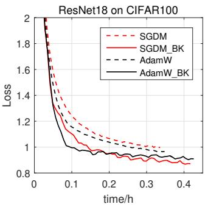

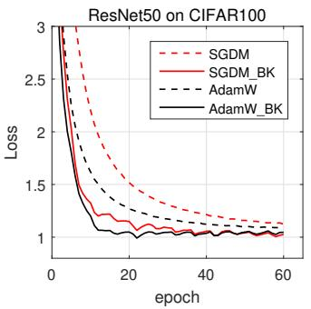

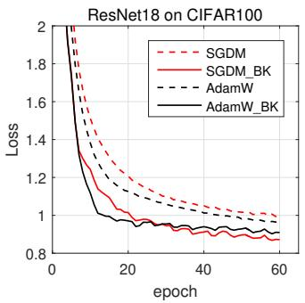

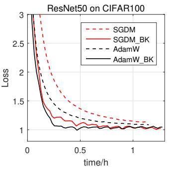  
Figure 2. Training loss curves (loss vs. epoch and loss vs. time) of SGDM, SGDM BK, AdamW and AdamW BK on CIFAR100 with ResNet18 and ResNet50 before 60 epochs.

Results on CIFAR100/10: We first testify the effectiveness of SGDM BK and AdamW BK with different DNN models on CIFAR100/CIFAR10 [16], including ResNet18, ResNet50 [12], VGG11 VGG19 [29] and DenseNet-121 [13] 6. All the DNN models are trained for 200 epochs with batch size 128 on one GPU. The learning rate is multiplied by 0.1 for every 60 epochs. The experiments are repeated 4 times and the results are reported in a “mean±std” format in Table 1. We can see that SGDM BK and AdamW BK achieve significant improvements over SGDM and AdamW, which are 1.44% ∼ 4.16% and 1.43% ∼ 4.01% on CIFAR100, and 0.28% ∼ 1.11% and 0.42% ∼ 0.94% on CIFAR10, respectively. They also surpass other compared optimizers for most of the used backbone networks.

Figure 2 shows the curves of training loss vs. epoch and training loss vs. time for SGDM, SGDM BK, AdamW and AdamW BK on CIFAR100 with ResNet18 and ResNet50 backbones before 60 epochs. One can see that SGDM BK and AdamW BK can significantly speed up the training process of SGDM and AdamW, respectively. Since SGDM BK and AdamW BK cost additional time in each iteration, for a fair comparison, we also show the curves of training loss vs. time. One can see that they still have great advantages over the original SGDM and AdamW.

Results on ImageNet-1k: To testify that SGDM BK and AdamW BK can also work well on large-scale datasets, we evaluate them on ImageNet-1k [27], which contains 1000 categories with 1.28 million images for training and 50K images for validation. ResNet18 and ResNet50 are selected as the backbone models with training batch size 256 on 4 GPUs, and the training settings follow the work in [3, 38]. The learning rate is multiplied by 0.1 for every 30 epochs. SGDM BK and AdamW BK adopt the same learning rate and weight decay as SGDM and AdamW, respectively. The top 1 accuracies on the validation set are reported in Table 2. One can see that SGDM BK and AdamW BK perform better than others. Meanwhile, we plot the training and validation accuracy curves in Figure 3, from which we see that the proposed AdaBK technique can largely speed up the training process. .

We also evaluate the proposed optimizer on Swintransformer [20] backbone. We compare AdamW BK with their default optimizer AdamW. The configurations follow the settings of the official MMClassification toolbox7. The results are shown in Table 3. We can see AdamW BK can also achieves certain performance gain over AdamW.

Table 2. Top 1 accuracy (%) on the validation set of ImageNet-1k. The numbers in red color indicate the improvement of SGDM BK/AdamW BK over SGDM/AdamW, respectively.
<table><tr><td>Optimizer</td><td>SGDM</td><td>AdamW</td><td>Adagrad</td><td>RAdam</td><td>Adabelief</td><td>Shampoo</td><td>KFAC</td><td>WSGDM</td><td>SGDM_BK</td><td>AdamW_BK</td></tr><tr><td>ResNet18</td><td>70.49</td><td>70.01</td><td>62.22</td><td>69.92</td><td>70.08</td><td>64.45</td><td>69.62</td><td>71.43</td><td> $\overline { { 7 I . 5 9 \left( \uparrow 1 . 1 0 \right) } }$ </td><td>71.63 (↑1.62)</td></tr><tr><td>ResNet50</td><td>76.31</td><td>76.02</td><td>69.38</td><td>76.12</td><td>76.22</td><td>70.11</td><td>76.36</td><td>77.48</td><td>77.62 (↑1.31)</td><td>77.22 (↑1.10)</td></tr></table>

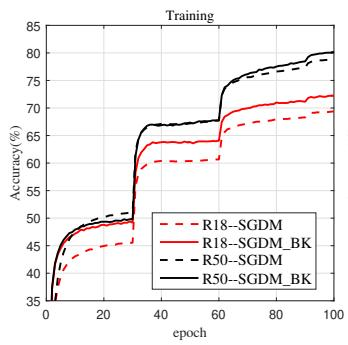

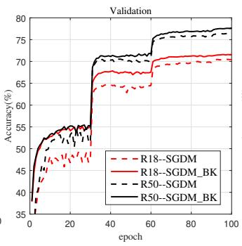

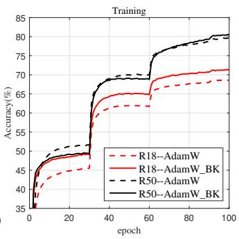

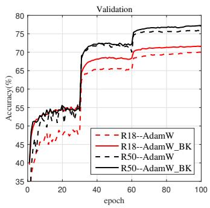  
Figure 3. Training and validation accuracy curves of SGDM, SGDM BK, AdamW and AdamW BK on ImageNet-1k with ResNet18 and ResNet50 backbones.

Table 3. Top 1 accuracy (%) on the validation set of ImageNet-1k.
<table><tr><td>Optimizer</td><td>AdamW</td><td>AdamW_BK</td></tr><tr><td>Swin-T</td><td>81.18</td><td>81.79 (↑0.61)</td></tr><tr><td>Swin-B</td><td>83.02</td><td>83.14 (↑0.12)</td></tr></table>

## 5.2. Detection and Segmentation

We then evaluate SGDM BK and AdamW BK on COCO [17] detection and segmentation tasks to show that they can work well beyond classification tasks and can be used to fine-tune pre-trained models. The models are pre-trained on ImageNet1k and fine-tuned on COCO train2017 (118K images), and then evaluated on COCO val2017 (40K images). The latest version of MMDetection toolbox [4] is used as to train our models. We test SGDM BK and AdamW BK by Faster-RCNN [25] and Mask-RCNN [11] with various backbones, including ResNet50 (R50), ResNet101 (R101) and Swin transformer [20].

As mentioned in Section 4, with the gradient norm recovery operation, we can directly adopt the same hyperparameters $( i . e . ,$ learning rate and weight decay) of SGDM and AdamW into SGDM BK and AdamW BK, respectively. To be specific, for R50 and R101 backbones, we compare the proposed optimizer with SGDM, WSGDM and AdamW. The learning rate and weight decay are set to

0.02 and 0.0001 for SGDM, WSGDM and SGDM BK, and   
0.0001 and 0.2 for AdamW and AdamW BK, respectively.

For the Swin transformer backbone, the learning rate and weight decay are set to 0.0001 and 0.02 for AdamW and AdamW BK, respectively. The learning rate schedule is 1X for Faster-RCNN. Other configurations follow the settings of the official MMDetection toolbox8. For the default optimizers, we use their official results9. This experiment is conducted on NVIDIA GeForce RTX 3090 Ti GPUs.

Table 4 lists the Average Precision (AP) of object detection by Faster-RCNN. It can be seen that the models trained by SGDM BK and AdamW BK achieve clear performance gains of 1.6% ∼ 2.2% AP for R50 and R101 backbones. Fig. 4 shows the training loss curves of Faster-RCNN with ResNet50 backbone. One can see that SGDM BK and AdamW BK accelerate the training process over SGDM and AdamW. Table 5 shows the $\mathsf { A P } ^ { \bar { b } ^ { \bar { \mathbf { \Lambda } } } }$ of detection and $\mathsf { A P } ^ { m }$ of segmentation by Mask-RCNN. We can see that SGDM BK and AdamW BK gain 1.5% ∼ 2.2% $\mathsf { A P } ^ { b }$ and 1.2% ∼ 2.2% APm for R50 and R101 backbones over SGDM and AdamW, respectively. For Swin transformer backbone, AdamW BK also improves 0.7% ∼ 0.9% $\mathsf { A P } ^ { b }$ and 0.3% ∼ 0.9% $\mathbf { A P } ^ { m }$ over AdamW. Meanwhile, compared with WSGDM, the proposed SGDM BK also outperforms it with 0.2% ∼ 0.6% AP gain. Moreover, Fig. 5 plots the training loss curves of Faster-RCNN with ResNet50, Swin-T (1X) and Swin-S (3X). The proposed SGDM BK and AdamW BK accelerate the training process clearly. The results on COCO demonstrate that the proposed SGDM BK and AdamW BK can be easily adopted into the downstream tasks without additional hyper-parameter tuning.

Table 4. Detection results of Faster-RCNN on COCO. ∆ means the gain of SGDM BK over SGDM or AdamW BK over AdamW. \* indicates the default optimizer.
<table><tr><td>Backbone</td><td>Algorithm</td><td>AP</td><td>AP.5</td><td>AP.75</td><td>APs</td><td>APm</td><td>AP_l</td></tr><tr><td rowspan="6">R50</td><td>SGDM*</td><td>37.4</td><td>58.1</td><td>40.4</td><td>21.2</td><td>41.0</td><td>48.1</td></tr><tr><td>WSGDM</td><td>39.4</td><td>60.6</td><td>43.1</td><td>23.1</td><td>42.9</td><td>50.7</td></tr><tr><td>SGDM.BK</td><td>39.6</td><td>60.7</td><td>42.8</td><td>22.6</td><td>42.9</td><td>52.2</td></tr><tr><td>∆</td><td>↑2.2</td><td>↑2.6</td><td>↑2.4</td><td>↑1.4</td><td>↑1.9</td><td>↑4.1</td></tr><tr><td>AdamW</td><td>37.8</td><td>58.7</td><td>41.0</td><td>22.1</td><td>41.2</td><td>49.2</td></tr><tr><td>AdamW_BK</td><td>39.4</td><td>60.3</td><td>42.9</td><td>22.5</td><td>42.8</td><td>52.3</td></tr><tr><td rowspan="6"></td><td>△</td><td>↑1.6</td><td>↑1.6</td><td>↑1.9</td><td>↑0.4</td><td>↑1.6</td><td>↑3.1</td></tr><tr><td>SGDM*</td><td>39.4</td><td>60.1</td><td>43.1</td><td>22.4</td><td>43.7</td><td>51.1</td></tr><tr><td>WSGDM</td><td>41.1</td><td>61.6</td><td>45.1</td><td>24.0</td><td>45.2</td><td>54.3</td></tr><tr><td>SGDM.BK</td><td>41.6</td><td>62.3</td><td>45.3</td><td>24.9</td><td>45.6</td><td>55.2</td></tr><tr><td>△</td><td>↑2.2</td><td>↑2.2</td><td>↑2.2</td><td>↑2.5</td><td>↑1.9</td><td>↑4.1</td></tr><tr><td>AdamW</td><td>40.1</td><td>60.6</td><td>43.8</td><td>22.9</td><td>44.1</td><td>52.8</td></tr><tr><td></td><td>AdamW_BK</td><td>41.7</td><td>62.1</td><td>45.5</td><td>24.4</td><td>45.4</td><td>56.2</td></tr><tr><td></td><td>△</td><td>↑1.6</td><td>↑1.5</td><td>↑1.7</td><td>↑1.5</td><td>↑1.3</td><td>↑3.4</td></tr></table>

Table 5. Detection and segmentation results of Mask-RCNN on COCO. ∆ means the gain of SGDM BK over SGDM or AdamW BK over AdamW. \* indicates the default optimizer.
<table><tr><td>Backbone</td><td>Lr schedule</td><td>Algorithm</td><td>Apb</td><td>AP_5</td><td>AP675</td><td>Apm</td><td>Ap m</td><td>AP 775</td></tr><tr><td rowspan="6">R50</td><td rowspan="6">1X</td><td>SGDM*</td><td>38.2</td><td>58.8</td><td>41.4</td><td>34.7</td><td>55.7</td><td>37.2</td></tr><tr><td>W-SGDM</td><td>39.8</td><td>60.8</td><td>43.4</td><td>36.4</td><td>57.6</td><td>38.9</td></tr><tr><td>SGDM.BK</td><td>40.4</td><td>61.3</td><td>43.9</td><td>36.9</td><td>58.3</td><td>39.6</td></tr><tr><td>∆</td><td>↑2.2</td><td>↑2.5</td><td>↑2.5</td><td>↑2.2</td><td>↑2.6</td><td>↑2.4</td></tr><tr><td>AdamW</td><td>37.8</td><td>58.7</td><td>41.0</td><td>35.4</td><td>56.2</td><td>38.0</td></tr><tr><td>AdamW_BK</td><td>40.0</td><td>60.6</td><td>43.5</td><td>36.7</td><td>58.0</td><td>39.3</td></tr><tr><td rowspan="7">R100</td><td rowspan="7">1X</td><td>∆</td><td>↑2.2</td><td>↑1.9</td><td>↑2.5</td><td>↑1.3</td><td>↑1.8</td><td>↑1.3</td></tr><tr><td>SGDM*</td><td>40.0</td><td>60.5</td><td>44.0</td><td>36.1</td><td>57.5</td><td>38.6</td></tr><tr><td>W-SGDM</td><td>41.7</td><td>62.5</td><td>45.5</td><td>37.9</td><td>59.4</td><td>40.8</td></tr><tr><td>SGDM_BK</td><td>42.2</td><td>62.9</td><td>46.1</td><td>38.1</td><td>60.0</td><td>40.7</td></tr><tr><td>∆</td><td>↑2.2</td><td>↑2.4</td><td>↑2.1</td><td>↑2.0</td><td>↑2.5</td><td>↑2.1</td></tr><tr><td>AdamW</td><td>40.7</td><td>61.1</td><td>44.6</td><td>37.2</td><td>58.4</td><td>40.1</td></tr><tr><td>AdamW_BK</td><td>42.2</td><td>62.5</td><td>46.0</td><td>38.4</td><td>59.9</td><td>41.2</td></tr><tr><td rowspan="3">Swin-T</td><td rowspan="3">1X</td><td>∆ AdamW*</td><td>↑1.5 42.7</td><td>↑1.4 65.2</td><td>↑1.4 46.8</td><td>↑1.2 39.3</td><td>↑1.5 62.2</td><td>↑1.1 42.2</td></tr><tr><td>AdamW_BK</td><td>43.6</td><td>65.9</td><td>47.8</td><td>40.2</td><td>63.1</td><td>43.1</td></tr><tr><td>Δ</td><td>↑0.9</td><td>↑0.7</td><td>↑1.0</td><td>↑0.9</td><td>↑0.9</td><td>↑0.9</td></tr><tr><td rowspan="3">Swin-T</td><td rowspan="3">3X</td><td>AdamW*</td><td>46.0</td><td>68.2</td><td>50.3</td><td>41.6</td><td>65.3</td><td>44.7</td></tr><tr><td>AdamW_BK</td><td>46.8</td><td>68.8</td><td>51.4</td><td>42.4</td><td>66.1</td><td>45.6</td></tr><tr><td>∆</td><td>↑0.8</td><td>↑0.6</td><td></td><td>↑0.8</td><td></td><td>↑0.9</td></tr><tr><td rowspan="3">Swin-S</td><td rowspan="3">3X</td><td>AdamW*</td><td>48.2</td><td>69.8</td><td>↑1.1 52.8</td><td>43.2</td><td>↑0.8 67.0</td><td>46.1</td></tr><tr><td>AdamW_BK</td><td>48.9</td><td>70.4</td><td>53.8</td><td>43.5</td><td>67.4</td><td>46.8</td></tr><tr><td>∆</td><td>↑0.7</td><td>↑0.6</td><td>↑1.0</td><td>↑0.3</td><td>↑0.4</td><td>↑0.7</td></tr></table>

## 5.3. Memory Usage and Training Time

For full-matrix adaptive optimizers, one important concern is the training cost, including memory usage and training time. Here we compare the memory and time cost of our optimizers with SGDM [23], AdamW [22] and Adagrad [5] on CIFAR100. ResNet50 is used as the backbone and one GeForce RTX 2080Ti GPU is used. The results are reported in Table 6. One can see that the embedding of AdaBK slightly increases the memory usage and training time (10% ∼ 25% extra training time and memory usage). Compared to the improvement of performance, the extra cost is affordable and worthwhile.

## 6. Conclusion

This work presented a general regret bound for the constrained full-matrix preconditioned gradient methods for

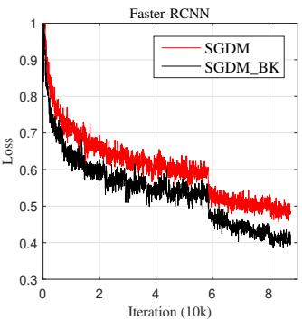

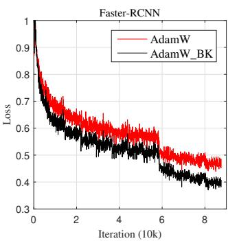  
Figure 4. Training loss curves of ResNet50.

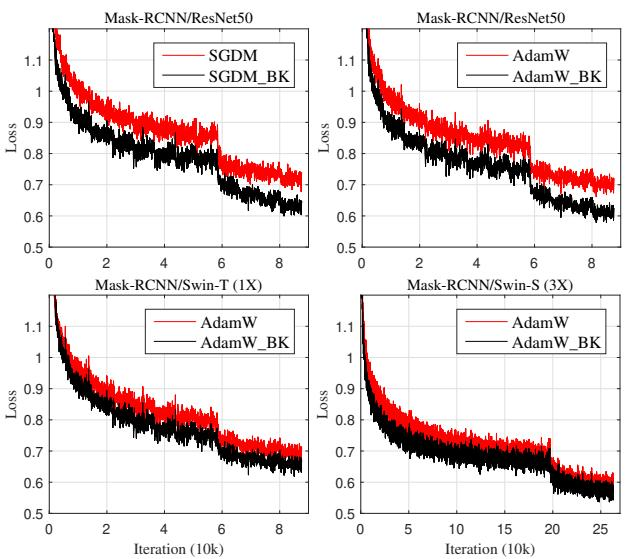  
Figure 5. Training loss curves of Mask-RCNN.

Table 6. Memory cost (MiB) and training time (h) of different optimizers with ResNet50.
<table><tr><td>Optimizer</td><td>SGDM</td><td>AdamW</td><td>Adagrad</td><td>SGDM_BK</td><td>AdamW_BK</td></tr><tr><td>Memory</td><td>5867</td><td>5883</td><td>5865</td><td>6525</td><td>6535</td></tr><tr><td>Time</td><td>3.42</td><td>3.48</td><td>3.46</td><td>4.14</td><td>4.20</td></tr></table>

DNN optimization. Different from previous full-matrix preconditioned methods, where the parameter update formulas are designed heuristically, we proved that given a cone constraint on the full-matrix preconditioner, the corresponding parameter update formula can be obtained by optimizing a guide function. Based on our theoretical analysis, we derived a specific guide function with the layer-wise blockdiagonal constraint and Kronecker-factorized constraint. Through optimizing an upper bound of the guide function, a new preconditioned optimization algorithm, namely AdaBK, was obtained. We embedded AdaBK into two widely used optimizers, i.e., SGDM and AdamW, and the experimental results on image classification, object detection and segmentation tasks demonstrated that AdaBK can significantly improve the DNN optimization performance with only 10% ∼ 25% extra computation cost.

## References

[1] Naman Agarwal, Brian Bullins, Xinyi Chen, Elad Hazan, Karan Singh, Cyril Zhang, and Yi Zhang. Efficient fullmatrix adaptive regularization. In International Conference on Machine Learning, pages 102–110. PMLR, 2019. 1

[2] Richard L Burden, J Douglas Faires, and Annette M Burden. Numerical analysis. Cengage learning, 2015. 4

[3] Jinghui Chen, Dongruo Zhou, Yiqi Tang, Ziyan Yang, Yuan Cao, and Quanquan Gu. Closing the generalization gap of adaptive gradient methods in training deep neural networks. arXiv preprint arXiv:1806.06763, 2018. 6

[4] Kai Chen, Jiaqi Wang, Jiangmiao Pang, Yuhang Cao, Yu Xiong, Xiaoxiao Li, Shuyang Sun, Wansen Feng, Ziwei Liu, Jiarui Xu, et al. Mmdetection: Open mmlab detection toolbox and benchmark. arXivpreprint arXiv:1906.07155, 2019. 7

[5] John Duchi, Elad Hazan, and Yoram Singer. Adaptive subgradient methods for online learning and stochastic optimization. Journal ofmachine learning research, 12(7), 2011. 1, 2, 3, 6, 8

[6] Thomas George, Cesar Laurent, Xavier Bouthillier, Nico-´ las Ballas, and Pascal Vincent. Fast approximate natural gradient descent in a kronecker-factored eigenbasis. arXiv preprint arXiv:1806.03884, 2018. 1

[7] Roger Grosse and James Martens. A kronecker-factored approximate fisher matrix for convolution layers. In International Conference on Machine Learning, pages 573–582. PMLR, 2016. 1, 2, 3, 4, 6

[8] Chun-Hua Guo and Nicholas J Higham. A schur–newton method for the matrix\boldmath p th root and its inverse. SIAM Journal on Matrix Analysis and Applications, 28(3):788–804, 2006. 4

[9] Vineet Gupta, Tomer Koren, and Yoram Singer. Shampoo: Preconditioned stochastic tensor optimization. In International Conference on Machine Learning, pages 1842–1850. PMLR, 2018. 1, 2, 3, 4, 6

[10] Elad Hazan et al. Introduction to online convex optimization. Foundations and Trends® in Optimization, 2(3-4):157–325, 2016. 2

[11] Kaiming He, Georgia Gkioxari, Piotr Dollar, and Ross Gir-´ shick. Mask r-cnn. In Proceedings ofthe IEEE international conference on computer vision, pages 2961–2969, 2017. 7

[12] Kaiming He, Xiangyu Zhang, Shaoqing Ren, and Jian Sun. Deep residual learning for image recognition. In Proceedings ofthe IEEE conference on computer vision and pattern recognition, pages 770–778, 2016. 6

[13] Gao Huang, Zhuang Liu, Laurens Van Der Maaten, and Kilian Q Weinberger. Densely connected convolutional networks. In Proceedings of the IEEE conference on computer vision and pattern recognition, pages 4700–4708, 2017. 6

[14] Ahmet Iscen, Giorgos Tolias, Yannis Avrithis, and Ondrej Chum. Label propagation for deep semi-supervised learning. In Proceedings of the IEEE/CVF Conference on Computer Vision and Pattern Recognition, pages 5070–5079, 2019. 1

[15] Diederik P Kingma and Jimmy Ba. Adam: A method for stochastic optimization. arXiv preprint arXiv:1412.6980, 2014. 1, 2

[16] Alex Krizhevsky, Geoffrey Hinton, et al. Learning multiple layers of features from tiny images. 2009. 5, 6

[17] Tsung-Yi Lin, Michael Maire, Serge Belongie, James Hays, Pietro Perona, Deva Ramanan, Piotr Dollar, and C Lawrence´ Zitnick. Microsoft coco: Common objects in context. In European conference on computer vision, pages 740–755. Springer, 2014. 5, 7

[18] Liyuan Liu, Haoming Jiang, Pengcheng He, Weizhu Chen, Xiaodong Liu, Jianfeng Gao, and Jiawei Han. On the variance of the adaptive learning rate and beyond. arXiv preprint arXiv:1908.03265, 2019. 1

[19] Liyuan Liu, Haoming Jiang, Pengcheng He, Weizhu Chen, Xiaodong Liu, Jianfeng Gao, and Jiawei Han. On the variance of the adaptive learning rate and beyond. arXiv preprint arXiv:1908.03265, 2019. 1, 6

[20] Ze Liu, Yutong Lin, Yue Cao, Han Hu, Yixuan Wei, Zheng Zhang, Stephen Lin, and Baining Guo. Swin transformer: Hierarchical vision transformer using shifted windows. In Proceedings of the IEEE/CVF International Conference on Computer Vision, pages 10012–10022, 2021. 7

[21] Ilya Loshchilov and Frank Hutter. Sgdr: Stochastic gradient descent with warm restarts. arXiv preprint arXiv:1608.03983, 2016. 1

[22] Ilya Loshchilov and Frank Hutter. Decoupled weight decay regularization. arXiv preprint arXiv:1711.05101, 2017. 1, 5, 8

[23] Ning Qian. On the momentum term in gradient descent learning algorithms. Neural networks, 12(1):145–151, 1999. 1, 8

[24] Shaoqing Ren, Kaiming He, Ross Girshick, and Jian Sun. Faster r-cnn: Towards real-time object detection with region proposal networks. Advances in neural information processing systems, 28, 2015. 1

[25] Shaoqing Ren, Kaiming He, Ross Girshick, and Jian Sun. Faster r-cnn: Towards real-time object detection with region proposal networks. In Advances in neural information processing systems, pages 91–99, 2015. 7

[26] Herbert Robbins and Sutton Monro. A stochastic approximation method. The annals of mathematical statistics, pages 400–407, 1951. 1

[27] Olga Russakovsky, Jia Deng, Hao Su, Jonathan Krause, Sanjeev Satheesh, Sean Ma, Zhiheng Huang, Andrej Karpathy, Aditya Khosla, Michael Bernstein, et al. Imagenet large scale visual recognition challenge. International journal of computer vision, 115(3):211–252, 2015. 5, 6

[28] Shai Shalev-Shwartz et al. Online learning and online convex optimization. Foundations and Trends® in Machine Learning, 4(2):107–194, 2012. 2

[29] Karen Simonyan and Andrew Zisserman. Very deep convolutional networks for large-scale image recognition. arXiv preprint arXiv:1409.1556, 2014. 6

[30] Tijmen Tieleman and Geoffrey Hinton. Lecture 6.5-rmsprop: Divide the gradient by a running average of its recent magnitude. COURSERA: Neural Networksfor Machine Learning, 4:26–31, 2012. 1

[31] Chengxi Ye, Matthew Evanusa, Hua He, Anton Mitrokhin, Tom Goldstein, James A Yorke, Cornelia Fermuller, and¨

Yiannis Aloimonos. Network deconvolution. arXiv preprint arXiv:1905.11926, 2019. 5

[32] Hongwei Yong, Jianqiang Huang, Xiansheng Hua, and Lei Zhang. Gradient centralization: A new optimization technique for deep neural networks. In European Conference on Computer Vision, pages 635–652. Springer, 2020. 1

[33] Hongwei Yong and Lei Zhang. An embedded feature whitening approach to deep neural network optimization. In the European Conference on Conputer Vision, 2022. 4, 5, 6

[34] Jihun Yun, Aurelie C Lozano, and Eunho Yang. Stochastic gradient methods with block diagonal matrix adaptation. arXiv preprint arXiv:1905.10757, 2019. 1

[35] Matthew D Zeiler. Adadelta: an adaptive learning rate method. arXiv preprint arXiv:1212.5701, 2012. 1

[36] Huishuai Zhang, Wei Chen, and Tie-Yan Liu. Train feedfoward neural network with layer-wise adaptive rate via approximating back-matching propagation. arXiv preprint arXiv:1802.09750, 2018. 5

[37] Michael R Zhang, James Lucas, Geoffrey Hinton, and Jimmy Ba. Lookahead optimizer: k steps forward, 1 step back. arXiv preprint arXiv:1907.08610, 2019. 1

[38] Juntang Zhuang, Tommy Tang, Yifan Ding, Sekhar C Tatikonda, Nicha Dvornek, Xenophon Papademetris, and James Duncan. Adabelief optimizer: Adapting stepsizes by the belief in observed gradients. Advances in neural information processing systems, 33:18795–18806, 2020. 1, 6