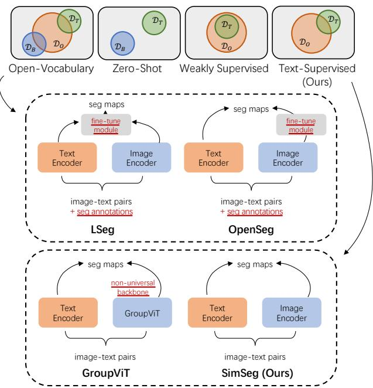
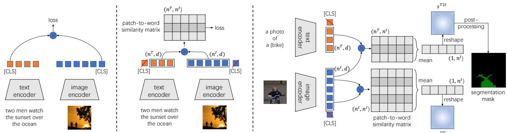
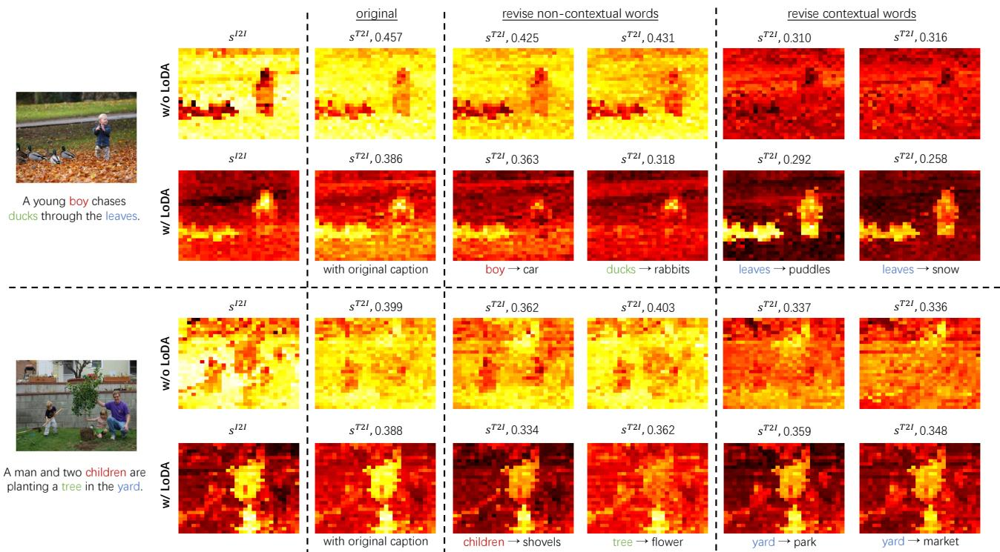
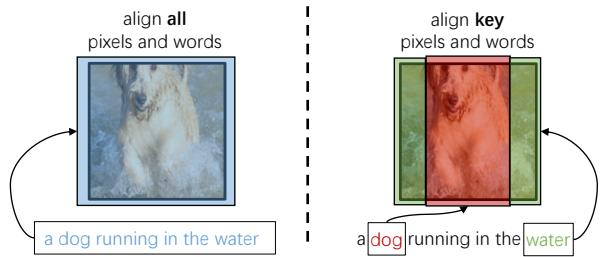
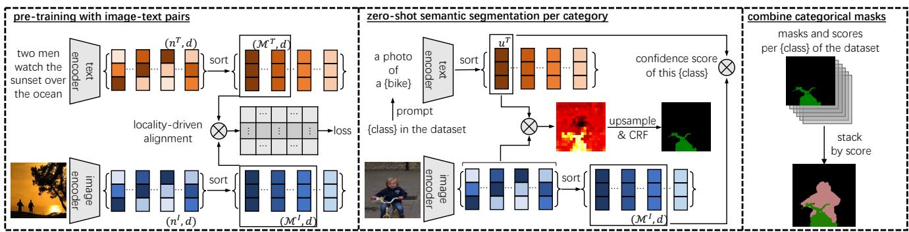
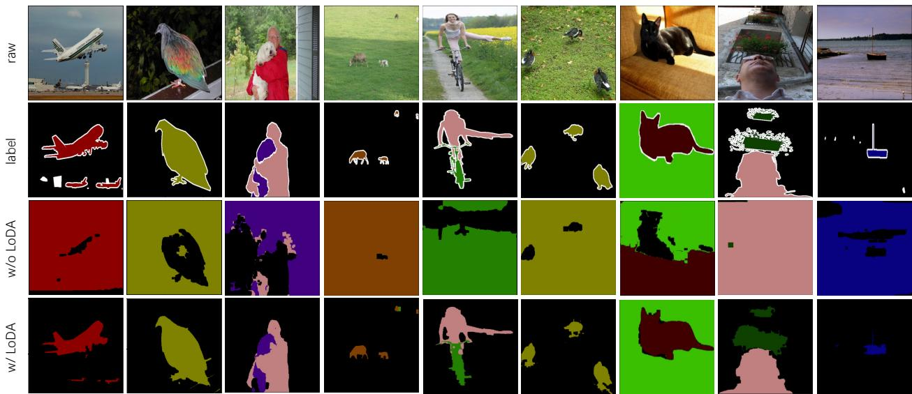
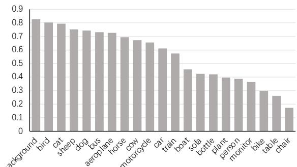
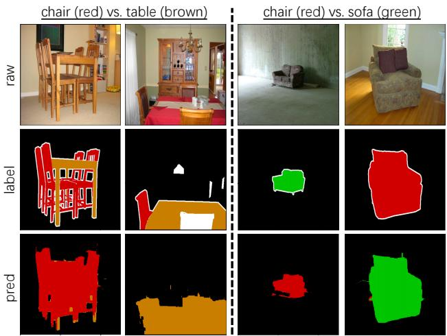
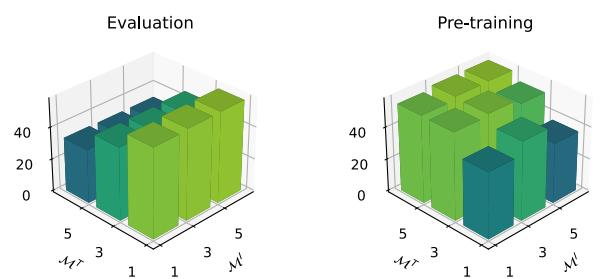

# A Simple Framework for Text-Supervised Semantic Segmentation

Muyang Yi1† Quan Cui2,3 Hao Wu3⇤ Cheng Yang3 Osamu Yoshie2 Hongtao Lu1⇤

1Department of Computer Science and Engineering,

MoE Key Lab of Artificial Intelligence, AI Institute, Shanghai Jiao Tong University 2Waseda University 3ByteDance Inc.

## Abstract

Text-supervised semantic segmentation is a novel research topic that allows semantic segments to emerge with image-text contrasting. However, pioneering methods could be subject to specifically designed network architectures. This paper shows that a vanilla contrastive language-image pre-training (CLIP) model is an effective text-supervised semantic segmentor by itself. First, we reveal that a vanilla CLIP is inferior to localization and segmentation due to its optimization being driven by densely aligning visual and language representations. Second, we propose the locality-driven alignment (LoDA) to address the problem, where CLIP optimization is driven by sparsely aligning local representations. Third, we propose a simple segmentation (SimSeg)framework. LoDA and SimSegjointly ameliorate a vanilla CLIP to produce impressive semantic segmentation results. Our method outperforms previous state-ofthe-art methods on PASCAL VOC 2012, PASCAL Context and COCO datasets by large margins. Code and models are available at github.com/muyangyi/SimSeg.

## 1. Introduction

Semantic segmentation is a fundamental task in computer vision, with the purpose of allocating semantic classes to the corresponding pixels. Most existing methods for semantic segmentation are restricted by the scale of datasets. The quantity or category is insufficient due to the high cost of annotating segmentation masks. Text-supervised semantic segmentation makes a breakthrough for this challenge, where models are pre-trained with image-text pairs and zero-shot transferred to semantic segmentation.

Figure 1 illustrates an abstraction of text-supervised semantic segmentation in comparison with existing task paradigms. The base domain is denoted as $\mathcal { D } _ { B } .$ , which contains the manually labeled samples. The target domain is denoted as $\mathcal { D } _ { T }$ , which contains test samples. And open domain $\mathcal { D } _ { O }$ involves a large variety of linguistic information. It can provide additional textual descriptions when segmenting the images. Open-vocabulary methods (e.g., LSeg [22], OpenSeg [17]) use pre-trained visionand-language models [20, 33], but still need annotated samples to fine-tune. Weakly supervised methods [1, 2] are free from mask labels but require image-level class labels $( \mathcal { D } _ { T } \subseteq \mathcal { D } _ { O } )$ Text-supervision is an annotation-free scheme, eliminating the need for mask annotations $( \mathcal { D } _ { B } )$ or image-level labels $( i . e . , \mathcal { D } _ { T } \not \subseteq \mathcal { D } _ { O } )$ . Text-supervision leverages massive web image-text pairs and enables to generate segmentation masks in a zero-shot manner. GroupViT [44] is the first work of text-supervision, yet the non-universal backbone design hinders its flexibility (e.g., novel backbone adaptation and multi-task joint learning). We could improve current methods by creating a simple framework for textsupervised semantic segmentation. To this end, we target on the vanilla CLIP [33] architecture, a neat dual-stream contrastive language-image pre-training model.

  
Figure 1. A comparison of our proposed approach with existing paradigms, where $\mathcal { D } _ { B } , \mathcal { D } _ { T } , \mathcal { D } _ { O }$ denote base domain, target domain and open domain, respectively. The components in red are those missing in SimSeg. Illustration inspired by [50].

As the preliminary of this work, we explore the potential problems of a vanilla CLIP-based segmentor. We mainly study CLIP developed with Transformer-based encoders due to their intrinsic properties for segmentation [6] and superior performance. CLIP is originally driven by aligning vision and textual holistic vectors (e.g., [cls] tokens from Transformer-based encoders), and a simple revision facilitates CLIP models for segmentation, i.e., densely aligning all image patches and caption words. A similarity map, which describes correlations between all image patches and one class word, is a coarse categorical segmentation mask per se. However, we observe two problems that greatly suppress the ability of the CLIP-based segmentor: (1) Visual encoder of the learned CLIP model focuses on contextual pixels, and (2) image-text contrasting mainly relies on contextual words. These problems jointly reveal that the optimization of CLIP is significantly driven by contextual information. As a consequence, the CLIP-based segmentor yields poor semantic segmentation results, due to an inferior ability to perceive both contextual and non-contextual information in complex natural images.

In the following, we attempt to solve the above problems. One practical strategy is avoiding optimization with contextual information. For a versatile segmentor, both contextual and non-contextual information are essential. Contextual and non-contextual pixels should be sparsely aligned to corresponding text entities. To this end, we propose a locality-driven alignment (LoDA) strategy for training CLIP models. Firstly, we propose to select partial features with the maximum responses, in both image and text modalities. Secondly, we propose to drive the image-text contrasting with only selected features. Our proposal successfully solves the problems from two aspects: (1) Vision encoder perceives main objects, (2) main objects and context are equally significant in the image-text contrasting. Coupled with LoDA, a simple but effective framework named SimSeg is proposed to do zero-shot semantic segmentation. Benefiting from our proposals, a simple CLIP framework is equipped with impressive zero-shot semantic segmentation performances. Our contributions are three-fold:

• We reveal the problems of a vanilla CLIP attached with Transformer-based encoders when producing segmentation masks. To solve the problems, we propose a training strategy named locality-driven alignment (LoDA).

• We design a simple but effective text-driven zero-shot semantic segmentation framework named SimSeg. Our proposed LoDA and SimSeg jointly allow a simple CLIP to segment universal categories.

• We achieve remarkable improvements over previous methods on PASCAL VOC, PASCAL Context and COCO zero-shot segmentation tasks. Moreover, we provide extensive analyses and ablations of our proposals.

## 2. Related Work

Contrastive language-image pre-training (CLIP [33]) learns generic visual-textual representations by contrastive alignment. It adopts a dual-encoder architecture to extract the image and text features separately, then computes the cosine similarity of image and text embeddings passed a linear projection layer. The learned representations have been demonstrated effective across various downstream tasks, including retrieval and classification. Many works [20, 23, 24, 31, 37, 41, 47, 49] further approve the significant performance of contrastive learning techniques for language-image pre-training. To avoid the problem of private training data, ZeroVL [10] provides training guidance that allows conducting CLIP with limited resources and public academic datasets. The language supervision paradigm also validates tasks other than classification, e.g. object detection [14,18,46,52], segmentation [34,36,42,53], and visual grounding [25,51]. The potential of CLIP is fully explored in a variety of prominent vision tasks.

Semantic segmentation with less supervision has been widely studied. In general, zero-shot semantic segmentation approaches [3, 4, 26, 43] aim to segment unseen categories without additional pixel-wise labels. The models have learned from segmentation masks before zero-shot transfer to unseen classes. Recent open-vocabulary methods [12, 17, 22, 29] facilitate the transfer procedure with pre-trained vision-and-language models but still rely on mask annotations. In the text-supervision paradigm, mask annotations are always absent. Instead, models are pretrained with image-text pairs and zero-shot transferred to semantic segmentation. GroupViT [44] introduces a hierarchical grouping Transformer architecture that partitions image patches into arbitrary shapes based on object semantics learned from captions. Compared with weaklysupervised semantic segmentation [2,7,9,16,27,45,48] that adopts image-level category labels, text-supervision further reduces the labeling requirement. It can be roughly considered the models automatically extract object categories from captions.

## 3. Exploring a CLIP-based Segmentor

In this part, we first revisit the semantic segmentation ability of CLIP [33] and introduce a CLIP-based segmentor. Then, we reveal problems that prevent the segmentor from achieving satisfactory segmentation performances.

  
Figure 2. Left: Holistic alignment, where image-text contrasting is driven by holistic vectors, e.g., [CLS]. Middle: Dense alignment, wher image-text contrasting is optimized by aligning all image patches with all words. Right: A CLIP-based segmentor that generates categorical segmentation masks, which is trained with the dense alignment target.

## 3.1. Preliminary

With the advancement of Transformers [11,13,40], most works following CLIP developed contrastive objectives with image and text holistic feature vectors, $e . g .$ , [cls] tokens from Transformer-based encoders, as shown in Figure 2 (left). Recent works [28, 47] proposed to train CLIP with dense (fine-grained) alignment targets, where all features of one modality would be aligned with features of the other modality. It enables CLIP to produce patch-word dense similarity matrices, as shown in Figure 2 (middle), and each element in the matrix represents the similarity between an image patch and a word.

## 3.2. A CLIP-based Segmentor

We introduce a CLIP-based segmentor with notations. As illustrated in Figure 2 (right), CLIP adopts two encoders, f for image data and $g$ for text data $\tau ,$ which are pretrained with the dense alignment target. Given an image $x ^ { I } \in \mathcal { I } ,$ the encoded feature is $f ( x ^ { I } ) \in \mathbb { R } ^ { n ^ { I } \times d }$ , where $n ^ { I }$ is the number of visual tokens $( i . e .$ , patches) in image $x ^ { I }$ and d is the feature dimension. Similarly, the encoded feature is $g ( x ^ { T } ) \in \mathbb { R } ^ { n ^ { T } \times d }$ for a text sequence $x ^ { T } \in \mathcal T$ , where $n ^ { T }$ is the length of word tokens. In segmentation, $x ^ { T }$ is a sentence prompted by the name of an object class to segment.

For the k-th image patch $( x ^ { I } ) _ { k } \in x ^ { I }$ with encoded feature $\left[ f ( x ^ { I } ) \right] _ { k }$ , the similarity scores with respect to the overall image and text features are:

$$
\begin{array} { r l } & { s _ { k } ^ { I } = \displaystyle \frac { 1 } { n ^ { I } } \sum _ { j = 1 } ^ { n ^ { I } } \left[ f ( \boldsymbol { x } ^ { I } ) \right] _ { j } ^ { \top } \left[ f ( \boldsymbol { x } ^ { I } ) \right] _ { k } \in \mathbb { R } ^ { 1 } , } \\ & { s _ { k } ^ { T } = \displaystyle \frac { 1 } { n ^ { T } } \sum _ { j = 1 } ^ { n ^ { T } } \left[ g ( \boldsymbol { x } ^ { T } ) \right] _ { j } ^ { \top } \left[ f ( \boldsymbol { x } ^ { I } ) \right] _ { k } \in \mathbb { R } ^ { 1 } . } \end{array}\tag{1}
$$

Denote $s ^ { I 2 I } \triangleq \{ s _ { k } ^ { I } \} _ { k = 1 } ^ { n ^ { I } }$ and $s ^ { T 2 I } \triangleq \{ s _ { k } ^ { T } \} _ { k = 1 } ^ { n ^ { I } }$ as the patch-wise similarity maps regarding to image and text features, respectively. Based on similarity map $\overline { { s ^ { T 2 I } } }$ , we could further produce a categorical segmentation mask by postprocessing operations, $e . g .$ , reshaping, thresholding, etc.

Based on millions of academic web image-text pairs, we first train a CLIP model with the aforementioned dense alignment target 1. Next, we transform the CLIP model to a segmentor and reveal two problems that prevent it from producing good segmentation masks.

## 3.3. Problems of the Segmentor

Context is a statistical property that helps people and networks solve perceptual inference tasks [30]. It plays important roles in image and text understanding tasks [30, 32]. We define “contextual words” and “non-contextual words” to better describe visual concepts. In captions, contextual words (e.g., forest or sea) refer to scenes, environments, etc. Non-contextual words $( e . g .$ ., person, bike, or cat) refer to main objects (or foregrounds). Contextual and noncontextual pixels represent the image regions corresponding to contextual and non-contextual words, respectively.

Problem 1: Visual encoder focuses on contextual pixels. Intuitively, an encoder for segmentation should consider the non-contextual pixels as the primary content of an image. However, our observation indicates the visual encoder of CLIP focuses on the contextual pixels. Illustrations are in Figure 3, the “w/o LoDA” rows.

$s ^ { I 2 I }$ is the similarity map regarding the global image feature. It could be interpreted as the contribution of each patch feature to the global feature. The contextual patches have higher similarity (brighter color), while the non-contextual patches have lower similarity (darker color), signifying the context contributes more to the global feature. Thus, the visual encoder focuses on contextual pixels.

Problem 2: Image-text contrasting relies on contextual words. Generally, the training of CLIP is driven by contrasting positive and negative image-text pairs. Each imagetext pair in a batch produces a similarity score, and the InfoNCE loss maximizes/minimizes the similarities of positive/negative pairs. In the following, we manually replace key entity words in the image caption, observe the alterations of image-text similarities, and analyze the image-text contrasting behaviors of CLIP.

  
Figure 3. Visualization of the patch-wise similarity maps on Flickr30K test set. For each sample, we show (1) original image-text pair, $\left( 2 \right) s ^ { I 2 I } , \left( 3 \right) s ^ { T 2 I }$ regarding to the original caption, and $( 4 ) \ s ^ { T 2 I }$ regarding to manually revised captions (non-contextual words vs. contextual words). In each revised caption, the modified key entity words are marked in colors. For $s ^ { \dot { T } 2 I }$ maps, the overall image-text similarity score provided by CLIP is attached. More examples are provided in Appendix.

Effects of non-contextual words on contrasting. When replacing the words of main objects (e.g., “boy car” and “ducks rabbits”), the similarity map $s ^ { T 2 I }$ barely changes, as shown in Figure 3 (w/o LoDA). Meanwhile, the image-text similarity scores also barely change (e.g., “0.457 0.431”). Especially, “tree flower” causes an irrational rise of the similarity score (0.399 to 0.403). Thus, CLIP is insensitive to revisions of non-contextual words, even original and revised words are greatly irrelevant.

Effects of contextual words on contrasting. When replacing the contextual words (e.g., “yard park” and “leaves puddles”), the similarity maps sT2I change intensively. As illustrated in Figure 3 (w/o LoDA), the similarity maps become much darker than the original ones. More importantly, replacing contextual words greatly decreases the similarity scores (e.g., “0.457 0.310”).

The similarity maps and scores both indicate that the image-text contrasting heavily relies on contextual words. More examples are attached in Appendix C.1.

## 3.4. Discussion

As reflected, the learned CLIP is sensitive to contextual pixels and judges image-text similarity based on contextual words. The problems mentioned above could result from an improper learning target, i.e., the optimization is mainly driven by contextual information. Concretely, most web image pixels relate to context, and the corresponding captions also primarily consist of words unrelated to main objects. Therefore, for minimizing the InfoNCE loss, focusing on contextual information could be the “easiest” way to produce a satisfactory image-text similarities ranking. Consequently, the learned CLIP is insensitive to the variance of non-contextual objects, further leading to the inferior localization and segmentation ability2.

  
Figure 4. Left: Aligning all pixels and words. Right: aligning key entity words (dog and water) with local regions (in red and green).

One critical step to solve the above problems is to avoid optimization with only contextual information. Both noncontextual and context information are equally important for semantic segmentation. Sparsely aligning key image pixels and key entities is a feasible solution.

  
Figure 5. Summary of our approach. Left: The model is pre-trained via locality-driven alignment (LoDA) with web image-text pairs. Middle: The model is zero-shot transferred to categorical semantic segmentation. Right: The categorical segmentation maps are stacked to generate the final output based on confidence scores.

## 4. Approach

Inspired by our exploration of the CLIP-based segmentor, we propose SimSeg, a simple yet effective framework.

## 4.1. Motivation

A versatile CLIP model for segmentation should adaptively perceive main objects and context. As illustrated in Figure 4 (left) and proved in Section 3.3, densely aligning pixels and words would lead to a trivial solution with heavy reliance on contextual information. An ideal CLIP model is expected to align key entity words $( e . g .$ ., dog and water) to corresponding local pixels (in red and green), as shown in Figure 4 (right). If models were sufficiently optimized, given a class name, the regions of pixels corresponding to the class would be strongly activated. Preventing the optimization of CLIP from densely aligning pixels and entities is a practical strategy. Following this idea, we propose a strategy named Locality-Driven Alignment (LoDA).

## 4.2. Locality-Driven Alignment

Maximum response selection. To realize the localitydriven alignment (LoDA) training paradigm, we propose a feature selection technique named maximum response selection. It adaptively selects local features with the maximum responses.

As shown in Figure 5 (left), given the encoded image feature $f ( x ^ { I } ) \in \bar { \mathbb { R } ^ { n ^ { I } \times d } }$ and text feature $g ( x ^ { T } ) \in \mathbb { R } ^ { n ^ { T } \times \bar { d } }$ we first sort them in descending order along dimension $d \colon$

$$
\begin{array} { r } { f ^ { \prime } ( x ^ { I } ) = \mathrm { s o r t } _ { d } \left( f ( x ^ { I } ) \right) , } \\ { g ^ { \prime } ( x ^ { T } ) = \mathrm { s o r t } _ { d } \left( g ( x ^ { T } ) \right) . } \end{array}\tag{2}
$$

Next we select the tokens at the forefront:

$$
\begin{array} { r l } & { \mathcal { V } ^ { I } = \{ [ f ^ { \prime } ( x ^ { I } ) ] _ { m ^ { I } } \} _ { 1 \leq m ^ { I } \leq \mathcal { M } ^ { I } } , } \\ & { \mathcal { V } ^ { T } = \{ [ g ^ { \prime } ( x ^ { T } ) ] _ { m ^ { T } } \} _ { 1 \leq m ^ { T } \leq \mathcal { M } ^ { T } } . } \end{array}\tag{3}
$$

We adopt the image feature $\mathcal { V } ^ { I } \in \mathbb { R } ^ { M ^ { I } \times d }$ and text feature $\mathcal { V } ^ { T } \in \mathbb { R } ^ { M ^ { T } \times d }$ to calculate the contrastive loss, where $\mathcal { M } ^ { I }$ and $\mathcal { M } ^ { T }$ are smaller than $n ^ { I }$ and $n ^ { T }$ , respectively.

Maximum response selection automatically picks the features with the greatest values on each channel. These features are expected to contain local information about important visual concepts and key entities for image-text contrasting, regardless of contextual and non-contextual.

Pre-training objective. Different from densely aligning compact features $f ( x ^ { I } )$ and $g ( x ^ { T } )$ , LoDA aims to sparsely calculate the contrastive loss with $\mathcal { V } ^ { I }$ and $\mathcal { V } ^ { T } , \mathcal { V } ^ { I }$ and $\mathcal { \ V } ^ { \bar { T } }$ represent features of maximum local response from image regions and key words, respectively. They are much less than the compact features $\hat { ( \mathcal { M } ^ { I } \ll n ^ { I } }$ and $\mathcal { M } ^ { T } \ll n ^ { T } )$ , so LoDA achieves a sparse alignment of the most attended regions and words. More importantly, LoDA further prevents the model from optimizing with heavy reliance on contextual pixels because modeling context requires a large amount $( i . e . , > \mathcal { M } ^ { I } )$ of features.

In a batch of size $b ,$ the similarity $s _ { i j }$ between the i-th image and j-th text is formulated as:

$$
s _ { i j } = \frac { 1 } { | \mathcal { V } _ { i } ^ { I } | } \frac { 1 } { | \mathcal { V } _ { j } ^ { T } | } \sum _ { u } ^ { \nu _ { i } ^ { I } } \sum _ { v } ^ { \nu _ { j } ^ { T } } \ : u \cdot v ,\tag{4}
$$

where the i-th image has feature $\mathcal { V } _ { i } ^ { I }$ and the j-th text has feature $\mathcal { V } _ { j } ^ { T }$ . The training objective is $\begin{array} { r } { \mathcal { L } = \frac { 1 } { 2 } \left( \bar { \mathcal { L } ^ { I } } + \mathcal { L } ^ { T } \right) } \end{array}$ , involving an image-to-text matching loss and a text-to-image matching loss:

$$
\begin{array} { r l } & { \mathcal { L } ^ { I } = - \displaystyle \frac { 1 } { b } \sum _ { i } ^ { b } \log \frac { \exp { \left( s _ { i i } / \tau \right) } } { \sum _ { j = 1 } ^ { b } \exp { \left( s _ { i j } / \tau \right) } } , } \\ & { \mathcal { L } ^ { T } = - \displaystyle \frac { 1 } { b } \sum _ { i } ^ { b } \log \frac { \exp { \left( s _ { i i } / \tau \right) } } { \sum _ { j = 1 } ^ { b } \exp { \left( s _ { j i } / \tau \right) } } , } \end{array}\tag{5}
$$

where ⌧ is the temperature parameter.

In the following, we verify that LoDA addresses the problems revealed in Section 3.3, i.e., (1) vision encoder focuses on contextual pixels and (2) image-text contrasting relies on contextual words.

LoDA makes vision encoder perceives main objects. As shown in Figure 3, the $s ^ { I \widehat { 2 } I }$ illustrates that the noncontextual patches have higher similarities (brighter color), while the contextual patches have lower similarities (darker color). The $s ^ { I 2 I }$ of LoDA is opposite to $s ^ { I 2 I }$ of dense alignment (i.e., w/o LoDA), indicating our vision encoder perceives the main objects. Attending correctly to the main objects (or foregrounds) is critical before segmenting them. LoDA makes main objects and context equally significant in the image-text contrasting. The similarity map $s ^ { T 2 I }$ changes correspondingly to the replacement of noncontextual words. When replacing the words of main objects, we observe the corresponding regions in image become darker, e.g., middle-right region for “boy car”, middle-left region for “ducks rabbits”.

When replacing the contextual words, the background becomes darker, and the main objects remain bright (e.g. “leaves puddles”). This behavior is unlike dense alignment, where the entire image turns darker. Our approach could accurately weigh the priority of each object or context. The modified words and omitted pixels are highly consistent, indicating that the vision encoder perceives and accurately attends to the main objects and context.

## 4.3. SimSeg Framework

We propose a simple segmentation framework (SimSeg) based on a CLIP with LoDA. For each raw image, Sim-Seg firstly produces binary segmentation masks per category, then combines them into a segmentation map.

Categorical semantic segmentation. Our model is pretrained to predict the similarity between regions of interest and key entity words for image-text pairs. To perform zeroshot semantic segmentation, we reuse this capability.

As shown in Figure 5 (middle), for a semantic segmentation dataset, we transform the class names into sentences by prompting. An example could be “a photo of a class ”. First, we compute the image and text features by their respective encoders. Since the input sentences contain one class name each, we set $\mathcal { M } ^ { T } = 1$ . Denote $u ^ { T }$ the first element of the sorted text features $g ^ { \prime } ( x ^ { T } )$ , serving as the text feature to query the image patches. Next, we take $u ^ { T }$ to compute the similarity score with every image patch feature $[ f ( x ^ { T } ) ] _ { k }$ , generating the coarse segmentation mask. Post-processing operations such as up-sampling and Dense-CRF [21] are applied to refine the coarse mask. In addition, we compute the class confidence score based on $u ^ { T }$ and $\mathcal { V } ^ { I }$ which is of same mechanism as in pre-training.

Combine categorical masks. Our model combines the binary masks of confident classes to produce the final result, as shown in Figure 5 (right). We calculate an adaptive threshold to select confident object classes rather than using fixed values. We use the mean $( \mu )$ and standard deviation () of the similarity scores of the top half classes in datasets, i.e. 10 and 30 top classes for PASCAL VOC and PASCAL Context, respectively. The threshold is set as $\mu + \sigma$ . Masks of classes over the threshold are stacked. The mask of a high-scoring class will cover that of the lessscoring ones, and the region unassigned to any object class is determined as the background class.

## 5. Experiment

## 5.1. Implementation

We train our model with image-text datasets and evaluate on zero-shot semantic segmentation benchmarks. The implementation details are in Appendix A.1

Datasets. Following the practice of [44], public academic image-text datasets are utilized for pre-training: (1) Conceptual Captions 3M (CC3M) [35], (2) Conceptual 12M (CC12M) [8]. In particular, our method obtains a data efficiency by removing the YFCC [38] dataset. We use the validation splits of PASCAL VOC 2012 [15], PASCAL Context [30] and COCO-Stuff [5] datasets to conduct zero-shot semantic segmentation evaluations.

Prompt template. We adopt the “prompting engineering” and the same text templates as in [33] to describe segmentation class labels by sentences. An intuitive template would be “a photo of a class ”.

## 5.2. Main Result

Following [44], we mainly benchmark our method on PASCAL VOC, PASCAL Context and COCO-Stuff datasets, and compare with existing methods.

Prerequisites. SimSeg maintains the retrieval ability of a vanilla CLIP. Actually, zero-shot image-text retrieval performance is an important prerequisite for semantic segmentation. Results are illustrated in Appendix B.1.

Superiority. Main results are reported in Table 1. We have the following observations:

(1) Our method outperforms previous methods by large margins. Concretely, our method achieves 56.6%, 25.8%, and 27.2% mIoUs on the PASCAL VOC, PASCAL Context, and COCO datasets, respectively. On the PASCAL VOC dataset, the improvement is 4.3% mIoU over the previous best’s, and our method performs better than the fullysupervised transfer segmentor of a pre-trained DeiT [39]. Notably, our method has promising scaling results, e.g., ViT-B boosts SimSeg to achieve higher mIoUs.

(2) Our method requires less training data than previous methods. Concretely, GroupViT requires 30 million web image-text pairs while our method only involves 15 million, which proves our method is data-efficient.

(3) Our method preserves the original framework of CLIP instead of introducing a novel architecture. We also provide a baseline result trained with CLIP and dense alignment $( i . e . , \mathrm { \hbar ^ { 6 } w / o \ L o D A ^ { 3 } } )$ , as mentioned in Section 3.3. The baseline achieves unacceptable results (19.1% and 11.0%0.6 mIoUs) on evaluated datasets. We provide a few examples0.4 in Figure 6 to study the segmentation results with and with-0.3 out LoDA. Both quantitative and qualitative results verify0.1 the effectiveness of LoDA. Our proposal fits the popularw d p t g e d e s r n t e a e t r n e e ir “one-for-all model” research topic, where an original CLIPc rou sh d pl b ho tr b rcy s bo pl oni ers b ta ch framework could be preferred. It is potential to achieveac ae mo better zero-shot segmentation results with such large-scale “one-for-all” models.

<table><tr><td rowspan="2">arch</td><td colspan="3">pre-training</td><td rowspan="2"></td><td colspan="3">transfer</td></tr><tr><td>model</td><td>dataset</td><td>supervision</td><td>zero-shot</td><td>PASCAL VOC PASCAL Context</td><td>COCO</td></tr><tr><td>ViT-S</td><td>DeiT [39]</td><td>ImageNet</td><td>class</td><td>x</td><td>53.0</td><td>35.9</td><td>-</td></tr><tr><td>ViT-S</td><td>DINO [6]</td><td>CC3&amp;12M+YFCC</td><td>self</td><td>x</td><td>37.6</td><td>22.8</td><td>-</td></tr><tr><td>ViT-S</td><td>MoCo [19]</td><td>CC3&amp;12M+YFCC</td><td>self</td><td>x</td><td>36.1</td><td>23.0</td><td></td></tr><tr><td>GroupViT</td><td>GroupViT [44]</td><td>CC3&amp;12M+YFCC</td><td>text</td><td>√</td><td>52.3</td><td>22.4</td><td>24.3</td></tr><tr><td>ViT-S</td><td>SimSeg (w/o LoDA)</td><td>CC3&amp;12M</td><td>text</td><td>√</td><td>19.1</td><td>11.0</td><td>12.5</td></tr><tr><td>ViT-S</td><td>SimSeg (w/ LoDA)</td><td>CC3&amp;12M</td><td>text</td><td>√</td><td>56.6</td><td>25.8</td><td>27.2</td></tr><tr><td>ViT-B</td><td>SimSeg (w/ LoDA)</td><td>CC3&amp;12M</td><td>text</td><td>√</td><td>57.4</td><td>26.2</td><td>29.7</td></tr></table>

Table 1. Comparisons with state-of-the-art methods. The mIoU results on PASCAL VOC, PASCAL Context and COCO datasets are reported. “w/o LoDA” denotes the dense alignment strategy introduced in Section 3.3, and “w/ LoDA” denotes our proposed locality driven alignment strategy. The mIoU results other than SimSeg’s refer to [44].

  
Figure 6. Segmentation results trained with dense alignment (w/o LoDA) and our proposed locality-driven alignment (w/ LoDA).0.9

Limitations. Our method is inferior in predicting particularly relevant categories. On the PASCAL VOC dataset, we visualize categorical IoU in Figure 7. For instance, the model achieves bad results on “table” and “chair”. As shown in Figure 8, it results from the model cannot separate these two categories, and masks on “table” and “chair” are highly overlapped. The pair of “chair” and “sofa” is a similar case. It indicates another drawback of CLIP-based zeroshot semantic segmentation models, i.e., the segmentation result could be constrained to the granularity of pre-training data. If the pre-training images were coupled with detailed descriptions, the above problem could be alleviated.

  
Figure 7. Sorted categorical IoU results on PASCAL VOC.

## 5.3. Ablation Study

Besides the pre-training parameters involved in the original CLIP, our method has a few parameters. In this part, we provide ablation studies to better understand our proposals. We ablate our approach with ViT-S on PASCAL VOC dataset. If not specified, the model is pre-trained with $\mathcal { M } ^ { I } = \mathcal { M } ^ { T } = 5 .$ . Default settings are marked in gray .

Effects of $\mathcal { M } ^ { I }$ and $\mathcal { M } ^ { T }$ in zero-shot segmentation. First of all, we study the most significant hyper-parameters $\mathcal { M } ^ { I }$ and $\mathcal { M } ^ { T }$ in the evaluation phase. As Figure 9 (left) illustrates, setting $\mathcal { M } ^ { T } = 1$ is a must since each prompted class name contains only one entity word. The larger $\mathcal { M } ^ { T }$ values lead to the worse mIoUs, since noises in prompts could hurt performances. For image modality, the best result is achieved when $\mathcal { M } ^ { I }$ remains unchanged from pretraining to evaluation. It is reasonable that the same $\mathcal { M } ^ { I }$ ensures the completeness of extracted image features. Note that the $\mathcal { M } ^ { I }$ has no effects on mask production, and it only affects the thresholding for selecting potential categories in test images. We follow this rule in the following ablations. The detailed mIoU results are attached in Appendix B.4.

  
Figure 8. Bad cases on the relevant categories.

Effects of $\mathcal { M } ^ { I }$ and $\mathcal { M } ^ { T }$ in pre-training. Next, we examine $\mathcal { M } ^ { I }$ and $\mathcal { M } ^ { T }$ involved in pre-training. The models are trained with $( \mathcal { M } ^ { I } , \mathcal { M } ^ { T } ) \ \bar { \in } \ \{ 1 , 3 , 5 \} ^ { 2 }$ and evaluated with the same protocol: $\dot { \mathcal { M } } ^ { I }$ remains the same with training, and $\mathcal { M } ^ { T }$ is set to 1. As Figure 9 (right) illustrates, $\mathcal { M } ^ { I } = \mathcal { M } ^ { T } = 5$ achieves the best result. An interesting observation is that setting $\boldsymbol { \mathcal { M } ^ { T } } = \boldsymbol { 1 }$ results in bad results. We hypothesize that $\mathcal { M } ^ { I }$ and $\mathcal { M } ^ { T }$ are related to the completeness of contextual and non-contextual information. Decreasing them in pre-training could lead to a lack of feature diversity, and involving plenty of text features is necessary. The detailed mIoU results are in Appendix B.4.

Effects of threshold values for potential class selection. As reported in Table 2, we evaluate the segmentation results with different thresholds. Fine-tuning the weight of  increases the performance, e.g., 1.5  achieves the best mIoU of 57.8. However, such improvements could result from over-fitting the validation set. For simplicity and robustness, we set the default coefficient of  to 1.0 in all experiments. It also suggests that selecting potential categories is a tricky part in text-supervised semantic segmentation methods. Greedy searching could lead to poor generalization results in real applications.

Effects of inference resolution. We evaluate the segmentation results with various image resolutions. As reported in Table 3, we pre-train the model (ViT-S) with 224 resolution, and respectively test segmentation results with 224, 288, 336, 384, 448 resolutions. The best result is achieved with 288 resolution. Generally, increasing the inference resolution could contribute to better segmentation results. However, there occurs a performance drop when the gap between training and evaluation resolutions becomes too large, $e . g .$ , mIoU of 448 resolution is worse than 224.

Figure 9. Effects of $\boldsymbol { \mathcal { M } ^ { I } }$ and $\mathcal { M } ^ { T }$ on evaluation and pre-training.
<table><tr><td>xσ</td><td>0.25</td><td>0.5</td><td>0.75</td><td>1.0</td><td>1.25</td><td>1.5</td><td>1.75</td><td>2.0</td></tr><tr><td>mIoU</td><td>51.0</td><td>53.0</td><td>55.1</td><td>56.6</td><td>57.1</td><td>57.8</td><td>56.4</td><td>51.7</td></tr></table>

Table 2. Evaluations on PASCAL VOC with different thresholds.

<table><tr><td>image size</td><td>224</td><td>288</td><td>336</td><td>384 448</td></tr><tr><td>mIoU</td><td>55.9</td><td>56.6</td><td>56.2 55.0</td><td>54.4</td></tr></table>

Table 3. Evaluations on PASCAL VOC with various resolutions.

<table><tr><td></td><td>PASCAL VOC</td><td>PASCAL Context</td><td>COCO</td></tr><tr><td>w/o CRF</td><td>53.8</td><td>23.5</td><td>25.7</td></tr><tr><td>w/ CRF</td><td>56.6</td><td>25.8</td><td>27.2</td></tr></table>

Table 4. Evaluations of SimSeg w/ and w/o CRF.

Effects of post-processing. As reported in Table 4, we evaluate the segmentation results with distinct postprocessing operations. “w/ CRF” [21] brings an increase of 2.8 mIoU on PASCAL VOC, because our minimal segmentation unit is 16 16 patches (ViT-S). Visualizations of the “w/o CRF” setting are shown in Appendix C.3.

## 6. Conclusion

In this paper, we enable a vanilla contrastive languageimage pre-training (CLIP) model to do text-supervised semantic segmentation. Firstly, we reveal problems of using a vanilla CLIP-based segmentor, and the reason is imagetext contrasting heavily relies on contextual information. Then, we propose a strategy named locality-driven alignment (LoDA) to address the problems, which drives CLIP to align local contextual and non-contextual information. Moreover, we propose a framework named SimSeg. LoDA and SimSeg jointly facilitate a vanilla CLIP to achieve great semantic segmentation results. Extensive experiments are provided to demonstrate the effectiveness of our proposals.

Acknowledgement. We appreciate the support from NSFC (No.62176155) and Shanghai Municipal Science and Technology Major Project (2021SHZDZX0102).

## References

[1] Jiwoon Ahn, Sunghyun Cho, and Suha Kwak. Weakly supervised learning of instance segmentation with inter-pixel relations. In CVPR, 2019. 1

[2] Jiwoon Ahn and Suha Kwak. Learning pixel-level semantic affinity with image-level supervision for weakly supervised semantic segmentation. In CVPR, 2018. 1, 2

[3] Donghyeon Baek, Youngmin Oh, and Bumsub Ham. Exploiting a joint embedding space for generalized zero-shot semantic segmentation. In ICCV, 2021. 2

[4] Max Bucher, Tuan-Hung Vu, Matthieu Cord, and Patrick Perez. Zero-shot semantic segmentation. In´ NeurIPS, 2019. 2

[5] Holger Caesar, Jasper Uijlings, and Vittorio Ferrari. COCO-Stuff: Thing and stuff classes in context. In CVPR, 2018. 6

[6] Mathilde Caron, Hugo Touvron, Ishan Misra, Herve J´ egou,´ Julien Mairal, Piotr Bojanowski, and Armand Joulin. Emerging properties in self-supervised vision transformers. In ICCV, 2021. 2, 7

[7] Yu-Ting Chang, Qiaosong Wang, Wei-Chih Hung, Robinson Piramuthu, Yi-Hsuan Tsai, and Ming-Hsuan Yang. Weaklysupervised semantic segmentation via sub-category exploration. In CVPR, 2020. 2

[8] Soravit Changpinyo, Piyush Sharma, Nan Ding, and Radu Soricut. Conceptual 12M: Pushing web-scale image-text pre-training to recognize long-tail visual concepts. In CVPR, 2021. 6

[9] Zhaozheng Chen, Tan Wang, Xiongwei Wu, Xiansheng Hua, Hanwang Zhang, and Qianru Sun. Class re-activation maps for weakly-supervised semantic segmentation. In CVPR, 2022. 2

[10] Quan Cui, Boyan Zhou, Yu Guo, Weidong Yin, Hao Wu, Osamu Yoshie, and Yubo Chen. Contrastive vision-language pre-training with limited resources. In ECCV, 2022. 2

[11] Jacob Devlin, Ming-Wei Chang, Kenton Lee, and Kristina Toutanova. BERT: Pre-training of deep bidirectional transformers for language understanding. In NAACL, 2019. 3

[12] Jian Ding, Nan Xue, Guisong Xia, and Dengxin Dai. Decoupling zero-shot semantic segmentation. In CVPR, 2022. 2

[13] Alexey Dosovitskiy, Lucas Beyer, Alexander Kolesnikov, Dirk Weissenborn, Xiaohua Zhai, Thomas Unterthiner, Mostafa Dehghani, Matthias Minderer, Georg Heigold, Sylvain Gelly, et al. An image is worth 16x16 words: Transformers for image recognition at scale. In ICLR, 2021. 3

[14] Yu Du, Fangyun Wei, Zihe Zhang, Miaojing Shi, Yue Gao, and Guo Chun Li. Learning to prompt for open-vocabulary object detection with vision-language model. In CVPR, 2022. 2

[15] Mark Everingham, Luc Van Gool, Christopher KI Williams, John Winn, and Andrew Zisserman. The pascal visual object classes (voc) challenge. IJCV, 2010. 6

[16] Junsong Fan, Zhaoxiang Zhang, Chunfeng Song, and Tieniu Tan. Learning integral objects with intra-class discriminator for weakly-supervised semantic segmentation. In CVPR, 2020. 2

[17] Golnaz Ghiasi, Xiuye Gu, Yin Cui, and Tsung-Yi Lin. Open vocabulary image segmentation. In ECCV, 2022. 1, 2

[18] Xiuye Gu, Tsung-Yi Lin, Weicheng Kuo, and Yin Cui. Open-vocabulary object detection via vision and language knowledge distillation. In ICLR, 2022. 2

[19] Kaiming He, Haoqi Fan, Yuxin Wu, Saining Xie, and Ross Girshick. Momentum contrast for unsupervised visual representation learning. In CVPR, 2020. 7

[20] Chao Jia, Yinfei Yang, Ye Xia, Yi-Ting Chen, Zarana Parekh, Hieu Pham, Quoc V Le, Yunhsuan Sung, Zhen Li, and Tom Duerig. Scaling up visual and vision-language representation learning with noisy text supervision. In ICML, 2021. 1, 2

[21] Philipp Krahenb¨ uhl and Vladlen Koltun. Efficient inference¨ in fully connected crfs with gaussian edge potentials. In NeurIPS, 2011. 6, 8

[22] Boyi Li, Kilian Q Weinberger, Serge Belongie, Vladlen Koltun, and Rene Ranftl. Language-driven semantic seg- ´ mentation. In ICLR, 2022. 1, 2

[23] Junnan Li, Dongxu Li, Caiming Xiong, and Steven Hoi. BLIP: Bootstrapping language-image pre-training for unified vision-language understanding and generation. In ICML, 2022. 2

[24] Junnan Li, Ramprasaath R Selvaraju, Akhilesh Deepak Gotmare, Shafiq Joty, Caiming Xiong, and Steven Hoi. Align before fuse: Vision and language representation learning with momentum distillation. In NeurIPS, 2021. 2

[25] Liunian Harold Li, Pengchuan Zhang, Haotian Zhang, Jianwei Yang, Chunyuan Li, Yiwu Zhong, Lijuan Wang, Lu Yuan, Lei Zhang, Jenq-Neng Hwang, Kai-Wei Chang, and Jianfeng Gao. Grounded language-image pre-training. In CVPR, 2022. 2

[26] Peike Li, Yunchao Wei, and Yi Yang. Consistent structural relation learning for zero-shot segmentation. In NeurIPS, 2020. 2

[27] Yi Li, Zhanghui Kuang, Liyang Liu, Yimin Chen, and Wayne Zhang. Pseudo-mask matters in weakly-supervised semantic segmentation. In ICCV, 2021. 2

[28] Yangguang Li, Feng Liang, Lichen Zhao, Yufeng Cui, Wanli Ouyang, Jing Shao, Fengwei Yu, and Junjie Yan. Supervision exists everywhere: A data efficient contrastive language-image pre-training paradigm. In ICLR, 2022. 3

[29] Timo Luddecke and Alexander S. Ecker. Image segmenta-¨ tion using text and image prompts. In CVPR, 2022. 2

[30] Roozbeh Mottaghi, Xianjie Chen, Xiaobai Liu, Nam-Gyu Cho, Seong-Whan Lee, Sanja Fidler, Raquel Urtasun, and Alan Yuille. The role of context for object detection and semantic segmentation in the wild. In CVPR, 2014. 3, 6

[31] Norman Mu, Alexander Kirillov, David Wagner, and Saining Xie. SLIP: Self-supervision meets language-image pretraining. In ECCV, 2022. 2

[32] Aude Oliva and Antonio Torralba. The role of context in object recognition. Trends in cognitive sciences, 2007. 3

[33] Alec Radford, Jong Wook Kim, Chris Hallacy, Aditya Ramesh, Gabriel Goh, Sandhini Agarwal, Girish Sastry, Amanda Askell, Pamela Mishkin, Jack Clark, Gretchen Krueger, and Ilya Sutskever. Learning transferable visual models from natural language supervision. In ICML, 2021. 1, 2, 6

[34] Yongming Rao, Wenliang Zhao, Guangyi Chen, Yansong Tang, Zheng Zhu, Guan Huang, Jie Zhou, and Jiwen Lu. DenseCLIP: Language-guided dense prediction with context-aware prompting. In CVPR, 2022. 2

[35] Piyush Sharma, Nan Ding, Sebastian Goodman, and Radu Soricut. Conceptual Captions: A cleaned, hypernymed, image alt-text dataset for automatic image captioning. In ACL, 2018. 6

[36] Gyungin Shin, Weidi Xie, and Samuel Albanie. ReCo: Retrieve and co-segment for zero-shot transfer. In NeurIPS, 2022. 2

[37] Amanpreet Singh, Ronghang Hu, Vedanuj Goswami, Guillaume Couairon, Wojciech Galuba, Marcus Rohrbach, and Douwe Kiela. FLAVA: A foundational language and vision alignment model. In CVPR, 2022. 2

[38] Bart Thomee, David A. Shamma, Gerald Friedland, Benjamin Elizalde, Karl S. Ni, Douglas N. Poland, Damian Borth, and Li-Jia Li. YFCC100M: the new data in multimedia research. Commun. ACM, 2016. 6

[39] Hugo Touvron, Matthieu Cord, Matthijs Douze, Francisco Massa, Alexandre Sablayrolles, and Herve J ´ egou. Training ´ data-efficient image transformers & distillation through attention. In ICML, 2021. 6, 7

[40] Ashish Vaswani, Noam Shazeer, Niki Parmar, Jakob Uszkoreit, Llion Jones, Aidan N Gomez, Łukasz Kaiser, and Illia Polosukhin. Attention is all you need. In NeurIPS, 2017. 3

[41] Wenhui Wang, Hangbo Bao, Li Dong, and Furu Wei. VLMo: Unified vision-language pre-training with mixtureof-modality-experts. arXiv:2111.02358, 2021. 2

[42] Zhaoqing Wang, Yu Lu, Qiang Li, Xunqiang Tao, Yan Guo, Ming Gong, and Tongliang Liu. CRIS: Clip-driven referring image segmentation. In CVPR, 2022. 2

[43] Yongqin Xian, Subhabrata Choudhury, Yang He, Bernt Schiele, and Zeynep Akata. Semantic projection network for zero- and few-label semantic segmentation. In CVPR, 2019. 2

[44] Jiarui Xu, Shalini De Mello, Sifei Liu, Wonmin Byeon, Thomas Breuel, Jan Kautz, and Xiaolong Wang. GroupViT: Semantic segmentation emerges from text supervision. In CVPR, 2022. 1, 2, 6, 7

[45] Lian Xu, Wanli Ouyang, Bennamoun, Farid Boussaid, and Dan Xu. Multi-class token transformer for weakly supervised semantic segmentation. In CVPR, 2022. 2

[46] Lewei Yao, Jianhua Han, Youpeng Wen, Xiaodan Liang, Dan Xu, W. Zhang, Zhenguo Li, Chunjing Xu, and Hang Xu. DetCLIP: Dictionary-enriched visual-concept paralleled pretraining for open-world detection. In NeurIPS, 2022. 2

[47] Lewei Yao, Runhui Huang, Lu Hou, Guansong Lu, Minzhe Niu, Hang Xu, Xiaodan Liang, Zhenguo Li, Xin Jiang, and Chunjing Xu. FILIP: Fine-grained interactive languageimage pre-training. In ICLR, 2022. 2, 3

[48] Yazhou Yao, Tao Chen, Guosen Xie, Chuanyi Zhang, Fumin Shen, Qi Wu, Zhen min Tang, and Jian Zhang. Non-salient region object mining for weakly supervised semantic segmentation. In CVPR, 2021. 2

[49] Jiahui Yu, Zirui Wang, Vijay Vasudevan, Legg Yeung, Mojtaba Seyedhosseini, and Yonghui Wu. CoCa: Contrastive

captioners are image-text foundation models. TMLR, 2022. 2

[50] Alireza Zareian, Kevin Dela Rosa, Derek Hao Hu, and Shih-Fu Chang. Open-vocabulary object detection using captions. In CVPR, 2021. 1

[51] Yan Zeng, Xinsong Zhang, and Hang Li. Multi-grained vision language pre-training: Aligning texts with visual concepts. In ICML, 2022. 2

[52] Yiwu Zhong, Jianwei Yang, Pengchuan Zhang, Chengkun Li, Noel C. F. Codella, Liunian Harold Li, Luowei Zhou, Xiyang Dai, Lu Yuan, Yin Li, and Jianfeng Gao. Region-CLIP: Region-based language-image pretraining. In CVPR, 2022. 2

[53] Chong Zhou, Chen Change Loy, and Bo Dai. Extract free dense labels from clip. In ECCV, 2022. 2