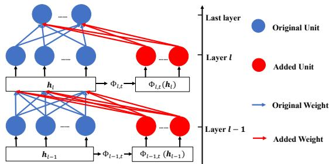
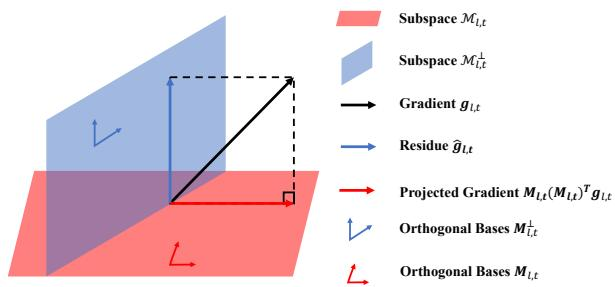
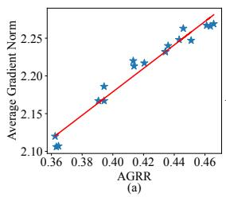
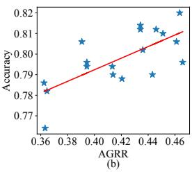
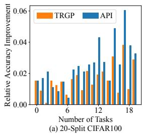
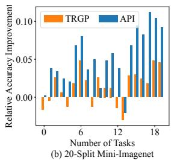
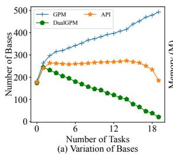
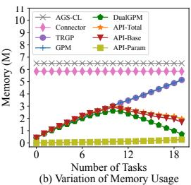
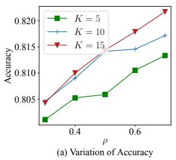
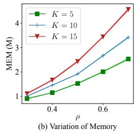

# Adaptive Plasticity Improvement for Continual Learning

Yan-Shuo Liang and Wu-Jun Li\* National Key Laboratory for Novel Software Technology, Department of Computer Science and Technology, Nanjing University, P. R. China liangys@smail.nju.edu.cn,liwujun@nju.edu.cn

## Abstract

Many works have tried to solve the catastrophic forgetting (CF) problem in continual learning (lifelong learning). However, pursuing non-forgetting on old tasks may damage the model’s plasticity for new tasks. Although some methods have been proposed to achieve stability-plasticity trade-off, no methods have considered evaluating a model’s plasticity and improving plasticity adaptivelyfor a new task. In this work, we propose a new method, called adaptive plasticity improvement (API), for continual learning. Besides the ability to overcome CF on old tasks, API also tries to evaluate the model’s plasticity and then adaptively improve the model’s plasticity for learning a new task if necessary. Experiments on several real datasets show that API can outperform other state-of-the-art baselines in terms of both accuracy and memory usage.

## 1. Introduction

Continual learning is a challenging setting in which agents learn multiple tasks sequentially [21]. However, neural network models lack the ability to perform continual learning. Specifically, many studies [15, 21] have shown that directly training a network on a new task makes the model forget the old knowledge. This phenomenon is often called catastrophic forgetting (CF) [10, 21].

Continual learning models need to overcome CF, which is referred to as stability [21]. Many types of works are proposed for stability. For example, regularization-based methods [13,35] add a penalty to the loss function and minimize penalty loss with new task loss together for overcoming CF. Memory-based methods [5,6,24,29] maintain a memory to save the information of the old tasks and use saved information to keep old task performance. Expansion-based methods [12, 16] expand the network’s architecture and usually freeze old tasks’ parameters to overcome CF.

However, having stability alone fails to give the model continual learning ability. The model also needs plasticity to learn new tasks in continual learning. The term plasticity came from neuroscience and was originally used to describe the brain’s ability to yield physical changes in the neural structure. Plasticity allows us to learn, remember, and adapt to dynamic environments [22]. In neural networks, plasticity is used to describe the ability of a network to change itself for learning new tasks. However, existing works [17, 18, 30] show that when overcoming CF for stability, the model’s plasticity will decrease, which will affect the performance of the model for learning new tasks. Specifically, regularization-based methods and memory-based methods use penalty or memory to constrain the parameters when the model learns a new task. When the number of old tasks increases, the constraints for the model parameters should become stronger and stronger to ensure stability. As a result, the model’s plasticity for learning new tasks decreases. Expansion-based methods [28,32] increase the model’s plasticity by expanding additional parameters. However, most of these methods freeze the old part of the network, making the old part of the network underutilized. Furthermore, all these methods do not consider how to evaluate the model’s plasticity and improve it adaptively.

When overcoming CF, the model should improve its plasticity if it finds that current plasticity is insufficient to learn the new task. In this work, we propose a new method, called adaptive plasticity improvement (API), for continual learning. The main contributions of API are as follows:

• API overcomes CF through a new memory-based method called dual gradient projection memory (DualGPM), which learns a gradient subspace that can represent the gradients of old tasks.

• Based on DualGPM, API evaluates the model’s plasticity for a new task by average gradient retention ratio (AGRR) and improves the model’s plasticity adaptively for a new task if necessary.

• Experiments on several real datasets show that API can outperform other state-of-the-art baselines in terms of accuracy and memory usage.

## 2. Problem Formulation and Related Work

## 2.1. Problem Formulation

We consider the supervised continual learning setting where $T$ tasks are presented to the model sequentially. Each task has a dataset $\mathbf { \bar { \mathcal { D } } } _ { t } = \{ ( \mathbf { \mathbf { { x } } } _ { i } ^ { t } , \mathbf { \mathbf { { y } } } _ { i } ^ { t } ) \} _ { i = 1 } ^ { N _ { t } }$ sampled from a latent distribution ${ \mathfrak { D } } _ { t }$ , where $\boldsymbol { x } _ { i } ^ { t }$ represents the input data point and $y _ { i } ^ { t }$ represents its class label. A neural network model $f ( \cdot , \Theta )$ with parameters $\Theta$ is trained on these tasks sequentially. The aim is to minimize the average loss of all tasks, that is

$$
\mathcal { L } = \frac { 1 } { T } \sum _ { t = 1 } ^ { T } \mathbb { E } _ { ( \boldsymbol { x } _ { i } ^ { t } , \boldsymbol { y } _ { i } ^ { t } ) \sim \mathfrak { D } _ { t } } \left[ l ( f ( \boldsymbol { x } _ { i } ^ { t } ; \boldsymbol { \Theta } ) , \boldsymbol { y } _ { i } ^ { t } ) \right] .\tag{1}
$$

Here, $l ( \cdot , \cdot )$ is the loss function (e.g., cross-entropy). When learning a new task t, the model has no access to the data of the previous t−1 tasks and it needs to learn new tasks while maintaining the performance of old tasks. Like many recent works [14, 17], we assume the task identity is available in both training and inference stages.

## 2.2. Related Work

Existing continual learning methods can be divided into three main categories: regularization-based methods, memory-based methods and expansion-based methods.

Regularization-based Methods These methods use a penalty loss (regularization) to prevent important parameters of old tasks from changing too much. Elastic weight consolidation (EWC) [15] evaluates the importance of the parameters with fisher information. Other parameter importance evaluation methods have also been tried, like the entire learning trajectory in parameter space [35] or sensitivity of outputs and inputs [2]. Some methods replace parameter importance with group importance [1, 13]. One shortcoming of these methods is that model capacity is fixed, and the penalty loss will make the model’s plasticity decrease with the increase of old tasks.

Memory-based Methods These methods keep a memory buffer for saving some information of old tasks. The usage of memory varies among different methods. Experience replay (ER) [7] uses memory to keep old samples and rehearses old samples to overcome CF when learning a new task. Some methods improve ER by replaying more disturbed old samples [3] or keeping diverse samples in memory [5]. Gradient episode memory (GEM) [20] and Average GEM (A-GEM) [6] also keep samples in memory and use old samples to estimate the gradients of old tasks. Saving real samples may raise privacy issues [17]. Gradient projection memory (GPM) [24] uses memory to maintain orthogonal bases and performs orthogonal projection to seek rectified updating direction. Some methods [19, 31] follow a similar idea to GPM and maintain a projection matrix for each layer. Some method [17] tries to get better plasticity-stability trade-off when rectifying gradient direction with projection operation. Trust region gradient projection (TRGP) [18] defines the trust region and leverages it to improve model’s performance on new tasks. Flattening sharpness for dynamic gradient projection memory (FS-DGPM) [8] uses memory and new data to flatten the loss landscape and evaluate the importance of bases in GPM. Like regularization-based methods, all these methods also keep a fixed model capacity and the model’s plasticity inevitably decreases with the increase of old tasks.

Expansion-based Methods These methods dynamically expand the model’s architecture for each new coming task. Progressive neural network (PNN) [23] adds new sub-networks with connections for previous architecture and expands the parameters super-linearly. Some works, like calibrating CNNs for lifelong learning (CCLL) [27] and rectification-based knowledge retention (RKR) [26], expand an equal number of parameters for each new task. Some works, like additive parameter decomposition (APD) [33] and dynamic expand network (DEN) [34], use regularization terms to constrain the increase of expanded parameters. There are also some works [16, 28] defining a search space with different expansion strategies. When adding (expanding) additional parameters, all these methods do not consider how to evaluate the model’s plasticity quantitatively and improve it adaptively.

## 3. Methodology

Figure 1 gives an illustration of our API method for a simple three-layer neural network. Except for the last layer, each layer can represent either a linear layer or a convolution layer, where each line represents a weight value in the linear layer or a kernel in the convolution layer. The blue part in Figure 1 is the original neural network, and we use $\bar { \boldsymbol { W } } _ { l } \in \mathbb { R } ^ { \bar { d } _ { O } ^ { l } \times d _ { I } ^ { l } }$ to represent the weight of blue part in the l-th layer. Note that we omit the kernel dimensions in the convolution layer for simplicity. $d _ { O } ^ { l }$ and $d _ { I } ^ { l }$ represent the dimensions (channels) of the output and input, respectively. Besides the blue part, each layer may expand additional red part by increasing the input dimension $d _ { I } ^ { l }$ . Here, we use $d _ { I } ^ { l , t }$ to denote the input dimension in the l-th layer when the model learns task t and use $W _ { l , t } \in \mathbb { R } ^ { d _ { O } ^ { l } \times d _ { I } ^ { l , t } }$ to denote the corresponding weight. Here, $d _ { I } ^ { l , t } \geq d _ { I } ^ { l , t - 1 }$ and $d _ { I } ^ { l , 1 } = d _ { I } ^ { l }$ $W _ { l , t }$ is expandable and includes both the blue part and expanded red part. In other words, $W _ { l , t - 1 } = W _ { l , t } [ : , : d _ { I } ^ { l , t - 1 } ]$ and $W _ { l , 1 } = W _ { l }$ . We will give the motivation of the API architecture in Section 3.3.

For each new task t, API first evaluates the model’s plasticity with current parameters $W _ { l , t - 1 }$ when overcoming CF. Then, API adaptively expands $W _ { l , t - 1 }$ to $W _ { l , t }$ according to the evaluation results for improving the model’s plasticity. Note that $W _ { l , t } = W _ { l , t - 1 }$ is possible, which means current plasticity is enough for the model to learn the new task. Finally, API learns the new task with $W _ { l , \cdot }$ t when overcoming CF on $W _ { l , t - 1 }$

  
Figure 1. Illustration of API for a three-layer architecture. The blue part denotes the original architecture. The red part denotes the architecture for improving plasticity.

API adopts the gradient rectification strategy to overcome CF. Methods based on this strategy rectify new task gradient so that it will not interfere with the model’s performance on the old task. We will show that a representative gradient rectification method, GPM [24], suffers from constantly increasing memory usage (see Section 3.1). Thus, API proposes dual GPM (DualGPM) to overcome CF. DualGPM can achieve similar accuracy as GPM, but its memory usage does not increase all the time. Furthermore, based on DualGPM, API defines a new metric, called gradient retention ratio (GRR), to evaluate and improve the model’s plasticity. The following subsections will describe the detail of the main components in API, including DualGPM, plasticity evaluation, and plasticity improvement.

## 3.1. Dual Gradient Projection Memory

We use $\mathcal { M } _ { l , : }$ t to denote the subspace containing the gradients of the previous t − 1 old tasks for the l-th layer when the model learns task $t \left( 1 \leq t \leq T \right)$ . We use $\mathcal { M } _ { l , t } ^ { \perp }$ to denote the orthogonal complement of $\mathcal { M } _ { l , t }$ . This means:

$$
\begin{array} { r l } & { \mathcal { M } _ { l , t } ^ { \perp } = \{ \pmb { u } ^ { \perp } \in \mathbb { R } ^ { d _ { l } } | \forall \pmb { u } \in \mathcal { M } _ { l , t } , ( \pmb { u } ^ { \perp } ) ^ { T } \pmb { u } = 0 \} , } \\ & { \mathcal { M } _ { l , t } \oplus \mathcal { M } _ { l , t } ^ { \perp } = \mathbb { R } ^ { d _ { l } } , \mathrm { d i m } ( \mathcal { M } _ { l , t } ) + \mathrm { d i m } ( \mathcal { M } _ { l , t } ^ { \perp } ) = d _ { l } . } \end{array}\tag{2}
$$

Here, d denotes the gradient dimension and ⊕ denotes direct sum in linear algebra [11]. Obviously, $\mathcal { M } _ { l , 1 } = \{ \mathbf { 0 } \}$ and $\mathcal { M } _ { l , 1 } ^ { \bot } = \mathbb { R } ^ { d _ { l } }$ . According to the existing works [24, 31, 36], the following proposition holds:

## Proposition 1. The gradient update of linear or convolution layer lies in the span ofinputs.

Please refer to existing work [24] or supplementary material for the explanation of this proposition. With this proposition, $\mathcal { M } _ { l , t }$ can be computed by finding the subspace containing the inputs of previous t−1 old tasks. The details of getting $\mathcal { M } _ { l , t }$ are shown in the process of DualGPM (see Section 3.1.1).

  
Figure 2. Illustration of orthogonal projection. Orthogonal projection projects the gradient into $\mathcal { M } _ { l , t }$ . GPM removes the projected component and makes the residue orthogonal to $\mathcal { M } _ { l , t }$ . Note that $\boldsymbol { \mathcal { M } } _ { l , t }$ contains the gradients of all previous tasks.

GPM [24] overcomes CF by orthogonal projection. Specifically, it maintains orthogonal bases of $\mathcal { M } _ { l , t }$ t and projects new task gradient $^ { g _ { l , t } }$ into $\mathcal { M } _ { l , t }$ by $M _ { l , t } ( M _ { l , t } ) ^ { T } \mathbf { g } _ { l , t }$ . Here, $M _ { l , t } = [ { \pmb u } _ { 1 } , . . . , { \pmb u } _ { m } ]$ denotes orthogonal bases of $\mathcal { M } _ { l , t }$ and $m = \dim ( \mathcal { M } _ { l , t } )$ . Then GPM removes the projected gradient from ${ \mathbf { } } g _ { l , t }$ by

$$
\hat { \pmb { g } } _ { l , t } = \pmb { g } _ { l , t } - M _ { l , t } ( M _ { l , t } ) ^ { T } \pmb { g } _ { l , t } .\tag{3}
$$

Here, $\hat { \mathbf { \Omega } } _ { { \hat { \mathbf { \Omega } } } _ { } } ( \mathbf { \Omega } _ { \lambda , t }$ is the residue that lies in $\mathcal { M } _ { l , t } ^ { \perp }$ . Figure 2 gives an illustration of orthogonal projection. Since dim $\left( \mathcal { M } _ { l , t } \right)$ increases with the number of tasks, the memory usage of GPM for storing $M _ { l , t }$ also increases with the number of tasks. We propose DualGPM, which achieves orthogonal projection with memory not increasing all the time. In the following discussion, we first show how DualGPM works in the layers with non-expandable $W _ { l , t } ( d _ { I } ^ { l , t } \equiv d _ { I } ^ { l } )$ . Then, we extend DualGPM to the layer with expandable $W _ { l , t }$

## 3.1.1 Layers with Non-Expandable Parameters

Different from GPM which maintains orthogonal bases of $\mathcal { M } _ { l , t }$ , DualGPM maintains either orthogonal bases of $\mathcal { M } _ { l , t }$ or orthogonal bases of $\mathcal { M } _ { l , t } ^ { \perp }$ to perform orthogonal projection. When keeping orthogonal bases of $\mathcal { M } _ { l , t }$ t in memory, DualGPM uses operation (3) like GPM. When keeping orthogonal bases of $\mathcal { M } _ { l , t } ^ { \perp }$ in memory, DualGPM performs orthogonal projection through

$$
\hat { \pmb { g } } _ { l , t } = \pmb { M } _ { l , t } ^ { \bot } ( \pmb { M } _ { l , t } ^ { \bot } ) ^ { T } \pmb { g } _ { l , t } .\tag{4}
$$

Here, $M _ { l , t } ^ { \perp } ~ = ~ [ { \pmb u } _ { 1 } ^ { \perp } , . . . , { \pmb u } _ { z } ^ { \perp } ]$ denotes orthogonal bases of $\mathcal { M } _ { l , t } ^ { \perp }$ and $z = \dim ( \mathcal { M } _ { l , t } ^ { \perp } )$ . Note that operation (3) and operation (4) are equivalent and we call them dual operations.

DualGPM decides whether to keep $M _ { l , \imath }$ or $M _ { l , t } ^ { \bot }$ in memory according to dim $\left( \mathcal { M } _ { l , t } \right)$ and dim $( \mathcal { M } _ { l , t } ^ { \perp } )$ . Specifically, during the learning of the first several tasks, $\mathrm { d i m } ( \mathcal { M } _ { l , t } ) \leq \mathrm { d i m } ( \mathcal { M } _ { l , t } ^ { \perp } )$ . At this time, DualGPM maintains $M _ { l , t } ,$ and expands $M _ { l , t }$ to $M _ { l , t + 1 }$ after each task. When dim $\left( \mathcal { M } _ { l , t } \right)$ increases and exceeds dim $( \mathcal { M } _ { l , t } ^ { \perp } )$ , Dual-GPM obtains $M _ { l , t } ^ { \bot }$ through some transformations on $M _ { l , t }$

After that, DualGPM only maintains $M _ { l , t } ^ { \bot }$ in memory, and reduces $M _ { l , t } ^ { \bot }$ to $M _ { l , t + 1 } ^ { \perp }$ after each task. Through this way, the number of bases kept for each layer is min $\{ \mathrm { d i m } ( \boldsymbol { \mathcal { M } } _ { l , t } )$ , dim $( \mathcal { M } _ { l , t } ^ { \perp } ) \}$ }.

To make DualGPM work, we have to solve the following three key problems: expanding the bases of $\mathcal { M } _ { l , t }$ , obtaining the bases of $\mathcal { M } _ { l , t } ^ { \perp }$ through the bases of $\mathcal { M } _ { l , t }$ , and reducing the bases of $\mathcal { M } _ { l , t } ^ { \perp }$

Expanding the Bases of $\mathcal { M } _ { l , }$ t The expansion of $\mathcal { M } _ { l , i }$ t is the same as that in GPM. Specifically, according to Proposition 1, expanding the bases of $\mathcal { M } _ { l , t }$ is equivalent to expanding the bases of input space. DualGPM computes the inputs matrix $R _ { l , t }$ such that each column of $R _ { l , t }$ represents an input of this layer. Getting the input matrix for convolution layer requires reshaping operation. Please refer to GPM [24] or supplementary material for details. Then, the part of $R _ { l , t }$ that has already in $\mathcal { M } _ { l , t }$ is removed by

$$
\hat { R } _ { l , t } = R _ { l , t } - M _ { l , t } ( M _ { l , t } ) ^ { T } R _ { l , t } = R _ { l , t } - R _ { l , t , p r o j } .\tag{5}
$$

Please note that when $t = 1 , \mathrm { d i m } ( \mathcal { M } _ { l , t } ) = 0$ and hence $R _ { l , t , p r o j }$ is a zero matrix. After that, singular value decomposition (SVD) is performed on $\hat { \mathbf { R } } _ { l , t } = \hat { U } \hat { \Sigma } \hat { V } ^ { T }$ . Then, u new orthogonal bases are chosen from the columns of $\hat { U }$ for a minimum of u satisfying the following criteria for given threshold $\epsilon _ { t h } ^ { l } \dot { } \dot { }$

$$
\begin{array} { r } { | | ( \hat { R } _ { l , t } ) _ { u } | | _ { F } ^ { 2 } + | | R _ { l , t , p r o j } | | _ { F } ^ { 2 } \geq \epsilon _ { t h } ^ { l } | | R _ { l , t } | | _ { F } ^ { 2 } . } \end{array}\tag{6}
$$

Here, $( \hat { R } _ { l , t } ) _ { u } \ = \ [ { \pmb u } _ { 1 } , . . . , { \pmb u } _ { u } ]$ denotes the components of $\hat { R } _ { l } \mathrm { ~ , ~ }$ t that correspond to top-u singular values. Then, subspace $\mathcal { M } _ { l , t + 1 }$ is obtained with the bases $M _ { l , t + 1 } ~ =$ $[ M _ { l , t } , \ b { u } _ { 1 } , . . . , \ b { u } _ { u } ]$

Transforming $\mathcal { M } _ { l , t }$ to $\mathcal { M } _ { l , t } ^ { \perp }$ DualGPM transforms $\mathcal { M } _ { l , t }$ to $\mathcal { M } _ { l , t } ^ { \perp }$ by performing SVD to the matrix $M _ { l , t }$ . Specifically, let $M _ { l , t } = U \Sigma V ^ { T }$ , we can prove that the column vectors of $U$ which correspond to the zero singular values form a set of orthogonal bases of $\mathcal { M } _ { l , t } ^ { \perp }$ . We give the proof in supplementary material.

Reducing the Bases of $\mathcal { M } _ { l , t } ^ { \perp }$ DualGPM reduces space $\mathcal { M } _ { l , t } ^ { \perp }$ by removing the part of $\mathcal { M } _ { l , t } ^ { \perp }$ which contains the gradient of the t-th task. Specifically, DualGPM first computes the input matrix $R _ { l , t }$ . Then, the part of $\mathbf { \delta } _ { R _ { l , t } }$ which lies in $\mathcal { M } _ { l , t } ^ { \perp }$ can be computed through

$$
\hat { R } _ { l , t } ^ { \perp } = M _ { l , t } ^ { \perp } ( M _ { l , t } ^ { \perp } ) ^ { T } R _ { l , t } = R _ { l , t , p r o j } ^ { \perp } .\tag{7}
$$

After that, SVD is performed on $\hat { \pmb { R } } _ { l , t } ^ { \perp } = \hat { \pmb { U } } ^ { \perp } \hat { \pmb { \Sigma } } ^ { \perp } ( \hat { \pmb { V } } ^ { \perp } ) ^ { T }$ Then, k new orthogonal bases are chosen from the columns of $\hat { U } ^ { \perp }$ for a maximum of k satisfying the following criteria for the given threshold $\epsilon _ { t h } ^ { l }$ (the same as $\epsilon _ { t h } ^ { l }$ in (6)):

$$
\lvert | ( \hat { R } _ { l , t } ^ { \perp } ) _ { k } \rvert | _ { F } ^ { 2 } \leq ( 1 - \epsilon _ { t h } ^ { l } ) \lvert | R _ { l , t } \rvert | _ { F } ^ { 2 } .\tag{8}
$$

Let ${ \cal Z } = ( \hat { R } _ { l , t } ^ { \perp } ) _ { k } = [ { \pmb u } _ { 1 } ^ { \perp } , . . . , { \pmb u } _ { k } ^ { \perp } ] , { \mathcal Z } = \mathrm { s p a n } \{ { \pmb u } _ { 1 } ^ { \perp } , . . . , { \pmb u } _ { k } ^ { \perp } \} ]$ Here, Z is the subspace of $\mathcal { M } _ { l , t } ^ { \perp }$ that contains the gradient of the t-th task. DualGPM removes $\mathcal { Z }$ from $\mathcal { M } _ { l , t } ^ { \perp }$ to get $\mathcal { M } _ { l , t + 1 } ^ { \perp }$ . Specifically, let $\hat { M } _ { l , t } ^ { \perp } ~ = ~ M _ { l , t } ^ { \perp } ~ -$ $Z ( Z ^ { T } ) M _ { l , t } ^ { \perp }$ DualGPM performs the second SVD on $\hat { M } _ { l , t } ^ { \perp } = \widetilde { U } ^ { \perp } \widetilde { \Sigma } ^ { \perp } ( \widetilde { V } ^ { \perp } ) ^ { T }$ . We can prove that the columns of $\widetilde { \pmb { U } } ^ { \perp }$ which correspond to the non-zero singular values form the bases $M _ { l , t + 1 } ^ { \perp }$ . We give the proof in supplementary material.

Comparing DualGPM with GPM DualGPM considers both $\mathcal { M } _ { l , t }$ and $\mathcal { M } _ { l , t } ^ { \perp }$ Therefore, DualGPM keeps min{dim $( \mathcal { M } _ { l , t } )$ , dim $( \mathcal { M } _ { l , t } ^ { \perp } ) \}$ bases in memory for each layer. Different from DualGPM, GPM only considers the space $\mathcal { M } _ { l , t }$ and keeps dim $\left( \mathcal { M } _ { l , t } \right)$ bases in memory for each layer. Since dim $\left( \mathcal { M } _ { l , t } \right)$ increases and dim $( \mathcal { M } _ { l , t } ^ { \perp } )$ decreases with the increase of t, DualGPM keeps much fewer bases than GPM when t is large. Note that updating bases in memory only happens after each task, and hence Dual-GPM does not cause too much computation for SVD operations. Section 4 will show that DualGPM gets similar performance to GPM and uses much less memory than GPM.

## 3.1.2 Layers with Expandable Parameters

In the layers with expandable $W _ { l , t } ,$ updating memory bases (see (5) and (7)) cannot be performed directly since the dimension of the inputs in $R _ { l , t }$ may be higher than that of the bases in $M _ { l , t } .$ Based on the fact that any d-dimensional vector $\begin{array} { r c l } { \pmb { \mathscr { g } } } & { = } & { [ g _ { 1 } , . . . , g _ { d } ] ^ { T } } \end{array}$ can be embedded into a higher dimensional space by $\textbf { \textit { g } } $ $[ g _ { 1 } , g _ { 2 } , . . . , g _ { d } , 0 , . . . , 0 ] ^ { T }$ , we can embed $M _ { l , t }$ into the space which the gradient of the new task lies in. $M _ { l , t } ^ { \perp }$ can also be obtained through (2). Mathematically, new $M _ { l , t }$ and $M _ { l , t } ^ { \bot }$ are got by

$$
M _ { l , t } \gets \left[ { \boldsymbol { M } } _ { l , t } \right] , \quad M _ { l , t } ^ { \perp } \gets \left[ { \boldsymbol { M } } _ { l , t } ^ { \perp } \cdot { \boldsymbol { O } } \right] ,\tag{9}
$$

where O denotes zero matrix and I denotes identity matrix. After the operation in (9), we can update memory according to the description in Section 3.1.1.

Algorithm 1 shows the process of DualGPM, including the case of non-expandable parameters and the case of expandable parameters.

## 3.2. Plasticity Evaluation

DualGPM constrains the new task gradient ${ \mathbf { } } g _ { l , t }$ in the subspace $\mathcal { M } _ { l , t } ^ { \perp }$ (see (3) and (4)). We define a metric called gradient retention ratio (GRR) for evaluating the constraint. The GRR of the l-th neural network layer for task t can be computed as

$$
\mathrm { G R R } ( l , t ) = E _ { \boldsymbol { x } \sim \mathcal { D } _ { t } } \left[ \frac { | | ( \hat { \pmb { g } } _ { l , t } ) _ { \pmb { x } } | | _ { 2 } } { | | ( \pmb { g } _ { l , t } ) _ { \pmb { x } } | | _ { 2 } } \right] ,\tag{10}
$$

Algorithm 1 DualGPM   
1: Input: Current task data $\mathcal { D } _ { t } ,$ a neural network model $f ( \cdot , \Theta )$   
with L layers, $\boldsymbol { \Theta } = \{ \boldsymbol { W } _ { l , t } \} _ { l = 1 } ^ { L } ,$ , orthogonal bases memory   
$\{ M _ { l , t - 1 } ^ { * } \} _ { l = 1 } ^ { L } .$   
2: Output: Updated orthogonal bases memory $\{ M _ { l , t } ^ { * } \} _ { l = 1 } ^ { L }$   
3: Get input matrix $\{ R _ { l , t } \} _ { l = 1 } ^ { \bar { L } }$ through $\mathcal { D } _ { t }$ and $f ( \cdot , \Theta ) ;$   
4: for l in $1 : L$ do   
5: if $M _ { l , t - 1 } ^ { * }$ is $M _ { l , t - 1 }$ then   
6: Embed $M _ { l , t - 1 }$ into higher dimensional space by (9);   
// Only for the layers with expandable parameters   
7: Expand $M _ { l , t - 1 }$ to $M _ { l , t }$ by (5) and (6);   
8: if dim $( \mathcal { M } _ { l , t } ) >$ dim $( \mathcal { M } _ { l , t } ^ { \bot } )$ then   
9: Transform matrix $M _ { l , t }$ to matrix $M _ { l , t } ^ { \bot }$ through SVD;   
10: end if   
11: else if $M _ { l , t - 1 } ^ { * }$ is $M _ { l , t - 1 } ^ { \bot }$ then   
12: Embed $M _ { l , t - 1 } ^ { \bot }$ into higher dimensional space by (9);   
// Only for the layers with expandable parameters   
13: Reduce $M _ { l , t - 1 } ^ { \bot }$ to $M _ { l , t }$ by (7) and (8);   
14: if dim $( \mathcal { M } _ { l , t } ) <$ dim $( \mathcal { M } _ { l , t } ^ { \bot } )$ then   
15: Transform matrix $M _ { l , t } ^ { \bot }$ to matrix $M _ { l , t }$ t through SVD;   
16: end if   
17: end if   
18: end for

where $( \pmb { g } _ { l , t } ) _ { \pmb { x } }$ represents the gradient in this layer with input sample x. $\hat { \mathbf { \Omega } } _ { { \hat { \mathbf { \Omega } } } } ( \mathbf { \Omega } _ { { \hat { \mathbf { \Omega } } } _ { \mathbf { \Omega } } } ) _ { l _ { 1 } , t }$ is obtained by (3) or (4). In Equation (10), ratio $\frac { | | \hat { \pmb { g } } _ { l , t } | | _ { 2 } } { | | \pmb { g } _ { l , t } | | _ { 2 } }$ is smaller than 1 due to the orthogonal projection. The smaller the value of $\frac { | | \hat { \pmb { g } } _ { l , t } | | _ { 2 } } { | | \pmb { g } _ { l , t } | | _ { 2 } }$ is, the larger the part of gradient is removed by (3) or (4). In an extreme case where $\dim ( \mathcal { M } _ { l , t } ) ~ = ~ d _ { l }$ and dim $( \mathcal { M } _ { l , t } ^ { \bot } ) = 0 , \hat { \pmb { g } } _ { l , t }$ t is always 0. This means the parameters of this layer can not be updated for learning new task t. In other words, this layer has no plasticity. We further use $\begin{array} { r } { \mathrm { A G R R } ( t ) = \frac { 1 } { L } \sum _ { l = 1 } ^ { L } \mathrm { G R R } ( l , t ) } \end{array}$ to denote the average GRR of all layers, where L denotes the number of layers. AGRR evaluates the average constraint caused by DualGPM.

Then, we show the relation between AGRR and the model’s performance. We perform DualGPM on Split CI-FAR100, which is a popular continual learning dataset we use for experiments in Section 4. We vary the threshold $\epsilon _ { t h } ^ { l }$ in (6) and (8). Obviously, larger $\epsilon _ { t h } ^ { l }$ makes dim $( \mathcal { M } _ { l , t } )$ larger, and thus makes AGRR smaller. Figure 3 (a) shows the relation between AGRR and the average gradient norm $\begin{array} { r } { \frac { 1 } { S } \sum _ { i = 1 } ^ { S } | | \hat { \pmb { g } } _ { i , 2 } | | _ { 2 } \rrangle } \end{array}$ for learning task 2. Here, S denotes the number of times the model updates the parameters when learning task 2. From Figure 3 (a), we can find that average gradient norm decreases with the decrease of AGRR. This means the model changes less and less for learning the new task. Since plasticity describes the model’s ability to change itself [21], the model’s plasticity decreases with the decrease of AGRR. Figure 3 (b) shows the relation between AGRR and accuracy on task 2 when the learning of task 2 is over. From this figure, we can find that model’s accuracy also decreases with the decrease of AGRR. From these results, we can find that AGRR has a high correlation with the model’s performance and the model’s ability to change. Therefore, API uses AGRR to evaluate the plasticity of the model.

  
Figure 3. DualGPM with non-expandable parameters learns on Split CIFAR100. (a) shows the correlation between AGRR and average gradient norm for learning task 2. (b) shows the correlation between AGRR and accuracy on task 2.

## 3.3. Plasticity Improvement

In Section 3.2, we have shown that metric AGRR can evaluate the constraint caused by DualGPM. We also show that AGRR has a high correlation with the model’s performance and the model’s ability to change. Therefore, API tries to increase AGRR to improve the model’s plasticity. According to Proposition 1, increasing GRR of the l-th layer can be achieved by increasing the input dimension $d _ { I } ^ { \bar { l } }$ . Hence, API improves plasticity by increasing the input dimension

With GRR, the input dimension $d _ { I } ^ { l , t }$ is decided as

$$
d _ { I } ^ { l , t } = d _ { I } ^ { l , t - 1 } + \operatorname* { m a x } \left( \left\lfloor K ( \rho - \mathrm { G R R } ( l , t ) ) + 0 . 5 \right\rfloor , 0 \right) ,\tag{11}
$$

where ⌊·⌋ denotes round down. K and $\rho$ are hyperparameters. For all the experiments, we set K and $\rho$ as 10 and $0 . 5 ,$ unless otherwise stated. Note that when ${ \mathrm { G R R } } ( l , t ) \geq \rho ,$ $d _ { I } ^ { l , t } = d _ { I } ^ { l , t - 1 }$ and no new parameters are added. With Equation (11), we try to give larger expansion to the layer with smaller GRR so that AGRR does not decrease too much with the increase of tasks.

After expanding $W _ { l , t - 1 }$ to $W _ { l , t }$ through (11), API increases the dimension of the input h through a transformation $\Phi _ { l , t } ,$ , where $\Phi _ { l , t } ( { \bf h } _ { l } ) \ = \ B _ { l , t } \bullet h _ { l }$ , and $\begin{array} { r } { \widetilde { h } _ { l , t } \ = } \end{array}$ Concat $\mathbf { \Phi } _ { \left( \right)} { { h } _ { l } } , { \Phi _ { l , t } } ( { { h } _ { l } } ) $ . Here $B _ { l , t } \in \mathbb { R } ^ { d _ { I } ^ { l } \times n }$ is trainable parameters and $n = d _ { I } ^ { l , t } - d _ { I } ^ { l }$ . Operation • denotes channelwise combination in the convolution layer and dimensionwise combination in the linear layer. ‘Concat’ denotes the concatenation of the input dimension. Then, the forward propagation for the new task t in this layer can be computed as ${ \pmb h } _ { l + 1 } = \sigma ( { \pmb W } _ { l , t } * { \widetilde { { \pmb h } } } _ { l , t } + { \pmb b } )$ , where $\sigma$ is the activation function.

During the learning of task t, the part of $B _ { l , t }$ corresponding to the previous t − 1 task is frozen to overcome CF.

Algorithm 2 The Whole Process of API   
1: Input: The data of different tasks $\{ \mathcal { D } _ { t } \} _ { t = 1 } ^ { T } ,$ a neural network   
model $f ( \cdot , \Theta )$ with L layers, $\boldsymbol \Theta = \{ { \boldsymbol W } _ { l , 1 } \} _ { l = 1 } ^ { L } .$   
2: Output: Learned network $f ( \cdot , \Theta )$ with $\boldsymbol { \Theta } = \overline { { \{ { W _ { l , T } \} _ { l = 1 } ^ { L } } } }$   
3: Initialize orthogonal bases memory $\{ M _ { l , 1 } ^ { * } \} _ { l = 1 } ^ { L } \colon M _ { l , 1 } ^ { * } \ =$   
$M _ { l , 1 } = [ ] ;$   
4: Learn the neural network with the first dataset $\mathcal { D } _ { 1 } ;$   
5: Update the memory $\{ M _ { l , 1 } ^ { * } \} _ { l = 1 } ^ { L }$ and get $\{ M _ { l , 2 } ^ { * } \} _ { l = 1 } ^ { L } ; / /$ Refer   
to Algorithm 1   
6: for t in $2 : T$ do   
7: Compute $\{ \mathrm { G R R } ( l , t ) \} _ { l = 1 } ^ { L }$ by (10) for plasticity evalua  
tion;   
8: Compute $\{ d _ { I } ^ { l , t } \} _ { l = 1 } ^ { L }$ by (11) and expand $W _ { l , t - 1 }$ to $W _ { l , \imath }$ t for   
plasticity improvement;   
9: for $e p = 1 , 2 , . . . , n u m _ { e p o c h s }$ do   
10: for $B _ { t }$ sampled from $\mathcal { D } _ { t }$ do   
11: Compute the loss $L ( B _ { t } ; \Theta )$ over $B _ { t }$ and get gradient   
$\pmb { g } _ { t } = [ \pmb { g } _ { 1 , t } , \pmb { g } _ { 2 , t } , . . . , \pmb { g } _ { L , t } ] ;$   
12: Using $\boldsymbol { M } _ { l , t } ^ { * }$ to project gradient ${ \mathbf { } } g _ { l , t }$ by (3) or (4) and   
get $\hat { \mathbf { g } } _ { l , t } ; / /$ Orthogonal projection   
13: Update the parameters with projected gradient $\hat { g } _ { t } =$   
$[ \hat { \pmb { g } } _ { 1 , t } , \hat { \pmb { g } } _ { 2 , t } , . . . , \hat { \pmb { g } } _ { L , t } ] ;$   
14: end for   
15: end for   
16: Update the memory $\{ M _ { l , t } ^ { * } \} _ { l = 1 } ^ { L }$ and get $\{ M _ { l , t + 1 } ^ { * } \} _ { l = 1 } ^ { L } ;$   
// Refer to Algorithm 1   
17: end for

The part of $B _ { l , t }$ corresponding to only new task t is trained with $W _ { l , t }$ together. In the inference phase, for any task $t \ ( t < T )$ , only $W _ { l , t }$ is used to perform prediction. The experiments in Section 4 will show that the expansion of $W _ { l , t }$ is limited.

In Algorithm 2, we give the whole process of API to show how the different components of API work together.

## 4. Experiment

## 4.1. Experimental Setup

Datasets We evaluate continual learning methods on four widely used datasets, including Split CI-FAR100 [20], CIFAR100-sup [24], Split Mini-Imagenet, and 5-Datasets [9]. Split CIFAR100 is constructed by splitting 100 classes of CIFAR100 into 20 tasks, and each task consists of 5 exclusive classes. CIFAR100-sup has 20 tasks, each with 5 classes. The classes in each task of CIFAR100- sup come from the same superclass of CIFAR100. Split Mini-Imagenet is constructed by splitting 100 classes of Mini-Imagenet into 20 tasks, and each task consists of 5 classes. 5-Datasets is a continual learning benchmark with 5 different datasets, including CIFAR10, MNIST, SVHN, notMNIST, and Fashion-MNIST.

Baselines and Metrics For regularization-based methods, we compare with elastic weight consolidation (EWC) [15], adaptive group sparsity based continual learning (AGS-CL) [13] and active forgetting with synaptic expansionconvergence (AFEC) [30]. For memory-based methods, we compare with experience replay with reservoir sampling (ER-Res) [7], gradient episode memory (GEM) [20], gradient projection memory (GPM) [24], flattening sharpness dynamic gradient projection memory (FS-DGPM) [8], trust region gradient projection (TRGP) [18] and Connector [17]. For expansion-based methods, we compare with dynamic expansion network (DEN) [34], reinforcement continual learning (RCL) [32], additive parameter decomposition (APD) [33], calibrating CNNs for lifelong learning (CCLL) [27], and rectification-based retention (RKR) [26].

Following existing works [8,24], we use average final accuracy (ACC) and backward transfer (BWT) as evaluation metrics. ACC is the average accuracy of all tasks. BWT measures forgetting. The formulas of these two metrics are as follows

$$
\begin{array} { l } { \displaystyle \mathrm { A C C } = \frac { 1 } { T } \sum _ { i = 1 } ^ { T } \mathrm { A C C } _ { T , i } , } \\ { \displaystyle \mathrm { B W T } = \frac { 1 } { T - 1 } \sum _ { i = 1 } ^ { T - 1 } ( \mathrm { A C C } _ { T , i } - \mathrm { A C C } _ { i , i } ) . } \end{array}\tag{12}
$$

Here, $T$ is the total number of tasks and $\operatorname { A C C } _ { j , i }$ is the model’s accuracy on the i-th task after learning the j-th task. We also evaluate the memory usage for different methods.

Architectures and Training Details Following the existing works [24, 25], we use a 5-layer AlexNet for Split CIFAR100 and use a modified LeNet for CIFAR100-sup. For Split Mini-Imagenet and 5-Datasets, we use a reduced ResNet18 architecture like that in [4, 24].

Following GPM [24], we use stochastic gradient descent (SGD) to train all the architectures in all the experiments. Each task is trained for 200 epochs on Split CI-FAR100, 50 epochs on CIFAR100-sup, 10 epochs on Split Mini-Imagenet, and 100 epochs on 5-Datasets to keep consistent with experimental settings in existing works [24]. For Split CIFAR100, CIFAR100-sup, and 5-Datasets, an early stopping strategy is applied. The batch size is set to be 64 for all the datasets to follow the existing work [24]. Since our DualGPM is an improvement of GPM, we set the value of threshold $\epsilon _ { t h } ^ { l }$ (see Equations (6) and (8)) for each layer to be consistent with GPM. We perform all experiments on four NVIDIA TITAN Xp GPUs.

## 4.2. Results

## 4.2.1 Accuracy

We repeat all the experiments five times with different random seeds. Table 1 shows the comparison of our API with memory-based and regularization-based methods. Dual-GPM denotes a variant of our method with fixed model capacity and without adaptive improvement component. We can find that DualGPM achieves similar accuracy as GPM. Please note that DualGPM uses much less memory than GPM, which will be verified in the following subsection. API achieves the best results on all datasets. EWC, AGS-CL, AFEC, ER-Res, GEM, and FS-DGPM suffer from CF. For example, GEM achieves 77.9% in accuracy and 6.4% in forgetting on Split CIFAR100. This means if GEM has no forgetting, its accuracy is 84.3%.

Table 1. Results of different continual learning methods on four datasets.
<table><tr><td></td><td colspan="2">CIFAR100-sup</td><td colspan="2">Split CIFAR100</td><td colspan="2">Split Mini-Imagenet</td><td colspan="2">5-Datasets</td></tr><tr><td>Methods</td><td> $\mathsf { A C C } ( \% )$ </td><td> $B W \mathrm { T } \left( \% \right)$ </td><td> $\mathrm { A C C } \left( \% \right)$ </td><td>BWT (%)</td><td> $\mathbf { A C C } \left( \% \right)$ </td><td> $B \mathrm { W T } \left( \% \right)$ </td><td> $\mathbf { A C C } \left( \% \right)$ </td><td>BWT (%)</td></tr><tr><td>EWC [15]</td><td> $4 6 . 7 \pm 0 . 6$ </td><td> $- 1 3 . 5 \pm 1 . 1$ </td><td> $7 5 . 3 \pm 0 . 7$ </td><td> $- 6 . 3 \pm 0 . 6$ </td><td> $5 2 . 1 \pm 1 . 1$ </td><td> $- 9 . 3 \pm 1 . 4$ </td><td> $8 4 . 3 \pm 0 . 2$ </td><td> $- 2 . 1 \pm 0 . 2$ </td></tr><tr><td>AGS-CL [13]</td><td> $5 6 . 3 \pm 2 . 9$ </td><td> $- 2 . 3 \pm 2 . 0$ </td><td> $7 6 . 2 \pm 0 . 4$ </td><td> $- 3 . 0 \pm 0 . 3$ </td><td> $5 5 . 1 \pm 0 . 9$ </td><td> $- 1 . 5 \pm 0 . 4$ </td><td> $8 6 . 2 \pm 0 . 4$ </td><td> $- 3 . 5 \pm 0 . 3$ </td></tr><tr><td>AFEC [30]</td><td> $5 6 . 2 \pm { 1 . 4 }$ </td><td> $- 6 . 2 \pm 1 . 4$ </td><td> $7 8 . 7 \pm 0 . 5$ </td><td> $- 2 . 5 \pm 0 . 4$ </td><td> $5 7 . 6 \pm 0 . 6$ </td><td> $- 2 . 0 \pm 1 . 2$ </td><td> $8 8 . 6 \pm 0 . 3$ </td><td> $- 1 . 8 \pm 0 . 3$ </td></tr><tr><td>ER-Res [7]</td><td> $5 3 . 3 \pm 0 . 7$ </td><td> $- 3 . 4 \pm 0 . 8$ </td><td> $7 9 . 2 \pm 0 . 4$ </td><td> $- 4 . 9 \pm 0 . 5$ </td><td> $5 5 . 2 \pm 2 . 9$ </td><td> $- 5 . 7 \pm 0 . 8$ </td><td> $8 3 . 4 \pm 0 . 7$ </td><td> $- 8 . 6 \pm 0 . 9$ </td></tr><tr><td>GEM [20]</td><td> $5 0 . 4 \pm 0 . 9$ </td><td> $- 7 . 4 \pm 0 . 7$ </td><td> $7 7 . 9 \pm 0 . 2$ </td><td> $- 6 . 4 \pm 0 . 5$ </td><td></td><td></td><td></td><td></td></tr><tr><td>FS-DGPM [8]</td><td> $5 8 . 5 \pm 0 . 6$ </td><td> $- 4 . 0 \pm 0 . 6$ </td><td> $8 0 . 5 \pm 0 . 4$ </td><td> $- 3 . 3 \pm 0 . 4$ </td><td></td><td></td><td></td><td></td></tr><tr><td>Connector [17]</td><td> $5 6 . 2 \pm 0 . 3$ </td><td> $- 0 . 4 \pm 0 . 3$ </td><td> $7 8 . 1 \pm 0 . 2$ </td><td> $- 0 . 3 \pm 0 . 2$ </td><td> $5 7 . 8 \pm 0 . 8$ </td><td> $2 . 1 \pm 0 . 1$ </td><td> $8 5 . 5 \pm 0 . 3$ </td><td> $- 2 . 9 \pm 0 . 5$ </td></tr><tr><td>GPM [24]</td><td> $5 7 . 7 \pm 0 . 7$ </td><td> $- 1 . 2 \pm 0 . 4$ </td><td> $7 8 . 9 \pm 0 . 2$ </td><td> $- 0 . 1 \pm 0 . 2$ </td><td> $6 1 . 2 \pm 0 . 6$ </td><td> ${ \bf 0 . 3 \pm 0 . 3 }$ </td><td> $8 8 . 8 \pm 0 . 6$ </td><td> $- 2 . 0 \pm 0 . 3$ </td></tr><tr><td>TRGP [18]</td><td> $5 8 . 2 \pm 0 . 2$ </td><td> $- 1 . 7 \pm 0 . 5$ </td><td> $8 0 . 5 \pm 0 . 3$ </td><td> $- 0 . 3 \pm 0 . 2$ </td><td> $6 2 . 5 \pm 0 . 7$ </td><td> $- 0 . 2 \pm 0 . 4$ </td><td> $9 0 . 9 \pm 0 . 1$ </td><td> ${ \bf - 0 . 1 \pm 0 . 0 }$ </td></tr><tr><td>DualGPM</td><td> $5 7 . 6 \pm 0 . 7$ </td><td> $- 1 . 0 \pm 0 . 2$ </td><td> $7 8 . 5 \pm 0 . 4$ </td><td> ${ \bf - 0 . 0 \pm 0 . 3 }$ </td><td> $6 1 . 2 \pm 0 . 6$ </td><td> ${ \bf 0 . 3 \pm 0 . 4 }$ </td><td> $8 8 . 7 \pm 0 . 5$ </td><td> $- 1 . 9 \pm 0 . 2$ </td></tr><tr><td>API</td><td> ${ \bf 6 0 . 2 \pm 0 . 2 }$ </td><td> ${ \bf - 0 . 2 \pm 0 . 1 }$ </td><td> ${ \bf 8 1 . 4 \pm 0 . 4 }$ </td><td> $- 0 . 8 \pm 0 . 2$ </td><td> ${ \bf 6 5 . 9 \pm 0 . 6 }$ </td><td> $- 0 . 3 \pm 0 . 2$ </td><td> ${ \bf 9 1 . 1 \pm 0 . 3 }$ </td><td> $- 0 . 5 \pm 0 . 1$ </td></tr></table>

Table 2. The performance of different expansion-based methods on CIFAR100-sup dataset.
<table><tr><td>Methods</td><td>DEN [34]</td><td>RCL [32]</td><td>APD [33]</td><td>CCLL [27]</td><td>RKR [26]</td><td>GPM [24]</td><td>API</td></tr><tr><td>Accuracy (%)</td><td>51.10</td><td>51.99</td><td>56.81</td><td>55.2</td><td>58.3</td><td>57.7</td><td>60.2</td></tr><tr><td>Capacity (%)</td><td>191</td><td>184</td><td>130</td><td>106</td><td>116</td><td>100</td><td>105</td></tr></table>

  
Figure 4. Relative accuracy improvement for different methods. Relative accuracy improvement is the accuracy of API or TRGP minus the accuracy of GPM.

TRGP, GPM, and our API show better performance in overcoming CF than other methods. Among these, GPM achieves 78.9% in accuracy and 0.1% in forgetting on Split CIFAR100. This means that even if there is no forgetting in GPM, the accuracy of GPM can only reach 79.0%, which is still lower than our API method. Similar phenomena also happen on other datasets. Figure 4 shows relative accuracy improvement on Split CIFAR100 and Split Mini-Imagenet, where relative accuracy improvement is the accuracy of API or TRGP minus the accuracy of GPM. We can find that both API and TRGP improve over GPM on most tasks, and our API shows a larger improvement than TRGP. Furthermore, the improvement of our API has an increasing trend with the increase of tasks. This is because as the number of tasks increases, the plasticity of the GPM gradually decreases. Our method API keeps improving the plasticity of the model. Therefore, as the task increases, our method API shows larger and larger improvement over GPM.

fore the first task and $| \Theta _ { T } |$ is the number of parameters after the last task. GPM uses a fixed-size network and its capacity is always 100%. API and expansion-based methods require additional parameters during the training, and their capacities are larger than GPM. However, API gets a smaller capacity and better accuracy than expansion-based methods.

We compare memory usage for different methods. We focus on the methods that do not save real samples in memory since these methods do not raise privacy concerns.

## 4.2.2 Memory Usage

We also follow existing works [18, 24] and compare our API with many expansion-based methods on CIFAR100- sup. The results are shown in Table 2. Here, capacity [33] denotes $\frac { \left| \Theta _ { 0 } \right| } { \left| \Theta _ { T } \right| }$ , where $\left| \Theta _ { 0 } \right|$ is the number of parameters be-

Figure 5 (a) shows the variation of the saved bases in the third layer of AlexNet on the experiment of Split CI-FAR100. We can find that the number of bases stored by GPM increases all the time since GPM only considers $\mathcal { M } _ { l , t }$ Our methods API and DualGPM consider both $\mathcal { M } _ { l , t }$ and $\mathcal { M } _ { l , t } ^ { \perp } .$ . Therefore, the bases stored by our methods increase first and then decrease. Furthermore, the bases stored by API are more than the bases stored by DualGPM. This is because API expands parameters, which may increase the

  
Figure 5. (a) Variation of saved bases in the third layer of AlexNet when the model learns on Split CIFAR100. (b) Variation of whole memory usage for different methods on Split CIFAR100.

Table 3. The performance for different methods on Split CI-FAR100 dataset and 5-Datasets. MEM denotes the memory usage for saving bases and expanded parameters.
<table><tr><td rowspan="2">Methods</td><td colspan="2">Split CIFAR100</td><td colspan="2">5-Datasets</td></tr><tr><td></td><td></td><td>ACC (%) MEM (M) ACC (%) MEM (M)</td><td></td></tr><tr><td>API (GPM)</td><td> $8 1 . 2 \pm 0 . 2$ </td><td>7.3</td><td> ${ \bf 9 1 . 1 \pm 0 . 2 }$ </td><td>7.7</td></tr><tr><td>API</td><td> ${ \bf 8 1 . 4 \pm 0 . 4 }$ </td><td>2.0</td><td> ${ \bf 9 1 . 1 \pm 0 . 3 }$ </td><td>3.1</td></tr></table>

number of bases (see (9)).

Figure 5 (b) gives the variation of memory usage on Split CIFAR100. API-Base denotes the memory for storing bases. API-Param denotes memory for expanding parameters. API-Total denotes the sum of API-Base and API-Param. We can find that our methods use the least memory among all the methods. Furthermore, GPM’s memory usage increases all the time. However, API-Total and API-Base increase first and then decrease. API-Param increases all the time, but it is much less than API-Base.

## 4.2.3 Ablation Study

We replace DualGPM with GPM in API and give the results in Table 3. Here API (GPM) denotes the variant of API that uses GPM in API for overcoming CF. API is our original method that uses DualGPM for overcoming CF. We can find that API (GPM) performs similarly to API but uses much more memory.

To verify the effectiveness of using (11) for plasticity improvement, we replace GRR with a constant value. This means the model adds an equal number of channels for each layer before learning each new task and we call this strategy ‘Equal’. We use C to denote the number of added channels for each task in ‘Equal’ and vary C in [1, 2, 3]. Obviously, increasing C will increase the expanded parameters and thus increase memory usage.

Table 4 shows the expanded parameters and accuracy for each experiment. We can find that ‘Equal’ gets better results when expanding more parameters. However, when getting similar accuracy to API, ‘Equal’ requires more parameters to improve the model’s plasticity. This shows the superiority of using (11) for improvement.

Table 4. Performance of different expansion strategies on Split CI-FAR100 and 5-Datasets. Param denotes the number of expanded parameters.
<table><tr><td></td><td colspan="2">Split CIFAR100</td><td colspan="2">5-Datasets</td></tr><tr><td>Methods</td><td>ACC (%) Param (M)</td><td></td><td>) ACC (%) Param (M)</td><td></td></tr><tr><td>Equal</td><td> $\left( C = 1 \right) 7 9 . 5 \pm 0 . 3$ </td><td>0.20</td><td> $9 0 . 3 \pm 0 . 2$ </td><td>0.06</td></tr><tr><td>Equal</td><td> $( C { = } 2 ) ~ 8 0 . 5 \pm 0 . 4$ </td><td>0.40</td><td> $9 0 . 7 \pm 0 . 4$ </td><td>0.12</td></tr><tr><td>Equal</td><td> $\mathbf { \left( \boldsymbol { C } = 3 \right) 8 1 . 4 } \pm \mathbf { 0 . 3 }$ </td><td>0.60</td><td> $9 0 . 9 \pm 0 . 2$ </td><td>0.19</td></tr><tr><td>API</td><td> ${ \bf 8 1 . 4 \pm 0 . 4 }$ </td><td>0.26</td><td> ${ \bf 9 1 . 1 \pm 0 . 3 }$ </td><td>0.11</td></tr></table>

  
Figure 6. Accuracy and memory usage with different hyperparameters. Here, memory usage (MEM) is the memory for saving bases and expanded parameters.

## 4.2.4 Hyperparameter Analysis

We vary the value of ρ and K in (11). Specifically, ρ is varied in [0.3, 0.4, 0.5, 0.6, 0.7] and K is varied in [5, 10, 15]. Figure 6 (a) shows API’s accuracy on Split CIFAR100. Figure 6 (b) shows API’s memory usage on Split CIFAR100. We can find that both API’s accuracy and memory usage increase with the increase of $\rho$ and K. This is intuitively reasonable since increasing $\rho$ and K makes the model expand more parameters and thus give larger improvement in plasticity. We choose $\rho = 0 . 5$ and $K = 1 0$ to make a better trade-off between memory and accuracy.

## 5. Conclusion

In this work, we propose a new method, called API, for continual learning. Besides the ability to overcome catastrophic forgetting (CF), API evaluates a model’s plasticity and improves plasticity adaptively for a new task if necessary. Experiments in the task incremental setting, where task identities are available for testing, show that API can achieve better performance than other state-of-the-art baselines. Future work will extend API to other continual learning settings, like those where task identities are unavailable for testing.

## Acknowledgment

This work is supported by NSFC (No.62192783), National Key R&D Program of China (No.2020YFA0713901) and NSFC (No.61921006).

## References

[1] Hongjoon Ahn, Sungmin Cha, Donggyu Lee, and Taesup Moon. Uncertainty-based continual learning with adaptive regularization. In Advances in Neural Information Processing Systems, pages 4392–4402, 2019. 2

[2] Rahaf Aljundi, Francesca Babiloni, Mohamed Elhoseiny, Marcus Rohrbach, and Tinne Tuytelaars. Memory aware synapses: learning what (not) to forget. In European Conference on Computer Vision, pages 139–154, 2018. 2

[3] Rahaf Aljundi, Eugene Belilovsky, Tinne Tuytelaars, Laurent Charlin, Massimo Caccia, Min Lin, and Lucas Page-Caccia. Online continual learning with maximal interfered retrieval. In Advances in Neural Information Processing Systems, pages 11849–11860, 2019. 2

[4] Rahaf Aljundi, Min Lin, Baptiste Goujaud, and Yoshua Bengio. Gradient based sample selection for online continual learning. In Advances in Neural Information Processing Systems, pages 11816–11825, 2019. 6

[5] Jihwan Bang, Heesu Kim, YoungJoon Yoo, Jung-Woo Ha, and Jonghyun Choi. Rainbow memory: Continual learning with a memory of diverse samples. In IEEE Conference on Computer Vision and Pattern Recognition, pages 8218– 8227, 2021. 1, 2

[6] Arslan Chaudhry, Marc’Aurelio Ranzato, Marcus Rohrbach, and Mohamed Elhoseiny. Efficient lifelong learning with A-GEM. In International Conference on Learning Representations, 2019. 1, 2

[7] Arslan Chaudhry, Marcus Rohrbach, Mohamed Elhoseiny, Thalaiyasingam Ajanthan, Puneet K Dokania, Philip HS Torr, and Marc’Aurelio Ranzato. On tiny episodic memories in continual learning. arXiv preprint arXiv:1902.10486, 2019. 2, 6, 7

[8] Danruo Deng, Guangyong Chen, Jianye Hao, Qiong Wang, and Pheng-Ann Heng. Flattening sharpness for dynamic gradient projection memory benefits continual learning. arXiv preprint arXiv:2110.04593, 2021. 2, 6, 7

[9] Sayna Ebrahimi, Franziska Meier, Roberto Calandra, Trevor Darrell, and Marcus Rohrbach. Adversarial continual learning. In European Conference on Computer Vision, pages 386–402, 2020. 6

[10] Robert M French. Catastrophic forgetting in connectionist networks. Trends in Cognitive Sciences, pages 128–135, 1999. 1

[11] Werner H Greub. Linear algebra, volume 23. Springer Science & Business Media, 2012. 3

[12] Ching-Yi Hung, Cheng-Hao Tu, Cheng-En Wu, Chien-Hung Chen, Yi-Ming Chan, and Chu-Song Chen. Compacting, picking and growing for unforgetting continual learning. In Advances in Neural Information Processing Systems, pages 13669–13679, 2019. 1

[13] Sangwon Jung, Hongjoon Ahn, Sungmin Cha, and Taesup Moon. Continual learning with node-importance based adaptive group sparse regularization. Advances in Neural Information Processing Systems, 33:3647–3658, 2020. 1, 2, 6, 7

[14] Haeyong Kang, Rusty John Lloyd Mina, Sultan Rizky Hikmawan Madjid, Jaehong Yoon, Mark Hasegawa-Johnson,

Sung Ju Hwang, and Chang D Yoo. Forget-free continual learning with winning subnetworks. In International Conference on Machine Learning, pages 10734–10750, 2022. 2

[15] James Kirkpatrick, Razvan Pascanu, Neil Rabinowitz, Joel Veness, Guillaume Desjardins, Andrei A Rusu, Kieran Milan, John Quan, Tiago Ramalho, Agnieszka Grabska-Barwinska, et al. Overcoming catastrophic forgetting in neural networks. Proceedings of the National Academy of Sciences, pages 3521–3526, 2017. 1, 2, 6, 7

[16] Xilai Li, Yingbo Zhou, Tianfu Wu, Richard Socher, and Caiming Xiong. Learn to grow: A continual structure learning framework for overcoming catastrophic forgetting. In International Conference on Machine Learning, pages 3925– 3934, 2019. 1, 2

[17] Guoliang Lin, Hanlu Chu, and Hanjiang Lai. Towards better plasticity-stability trade-off in incremental learning: A simple linear connector. In IEEE Conference on Computer Vision and Pattern Recognition, pages 89–98, 2022. 1, 2, 6, 7

[18] Sen Lin, Li Yang, Deliang Fan, and Junshan Zhang. Trgp: Trust region gradient projection for continual learning. In International Conference on Learning Representations, 2022. 1, 2, 6, 7

[19] Hao Liu and Huaping Liu. Continual learning with recursive gradient optimization. In International Conference on Learning Representations, 2022. 2

[20] David Lopez-Paz and Marc’Aurelio Ranzato. Gradient episodic memory for continual learning. In Advances in Neural Information Processing Systems, pages 6467–6476, 2017. 2, 6, 7

[21] German I Parisi, Ronald Kemker, Jose L Part, Christopher Kanan, and Stefan Wermter. Continual lifelong learning with neural networks: A review. Neural Networks, pages 54–71, 2019. 1, 5

[22] Jonathan D Power and Bradley L Schlaggar. Neural plasticity across the lifespan. Wiley Interdisciplinary Reviews: Developmental Biology, 6, 2017. 1

[23] Andrei A Rusu, Neil C Rabinowitz, Guillaume Desjardins, Hubert Soyer, James Kirkpatrick, Koray Kavukcuoglu, Razvan Pascanu, and Raia Hadsell. Progressive neural networks. arXiv preprint arXiv:1606.04671, 2016. 2

[24] Gobinda Saha, Isha Garg, and Kaushik Roy. Gradient projection memory for continual learning. In International Conference on Learning Representations, 2021. 1, 2, 3, 4, 6, 7

[25] Joan Serra, Didac Suris, Marius Miron, and Alexandros Karatzoglou. Overcoming catastrophic forgetting with hard attention to the task. In International Conference on Machine Learning, pages 4548–4557, 2018. 6

[26] Pravendra Singh, Pratik Mazumder, Piyush Rai, and Vinay P. Namboodiri. Rectification-based knowledge retention for continual learning. In IEEE Conference on Computer Vision and Pattern Recognition, pages 15282–15291, 2021. 2, 6, 7

[27] Pravendra Singh, Vinay Kumar Verma, Pratik Mazumder, Lawrence Carin, and Piyush Rai. Calibrating cnns for lifelong learning. Advances in Neural Information Processing Systems, 33:15579–15590, 2020. 2, 6, 7

[28] Tom Veniat, Ludovic Denoyer, and MarcAurelio Ranzato. Efficient continual learning with modular networks and taskdriven priors. In International Conference on Learning Representations, 2021. 1, 2

[29] Eli Verwimp, Matthias De Lange, and Tinne Tuytelaars. Rehearsal revealed: The limits and merits of revisiting samples in continual learning. arXiv preprint arXiv:2104.07446, 2021. 1

[30] Liyuan Wang, Mingtian Zhang, Zhongfan Jia, Qian Li, Chenglong Bao, Kaisheng Ma, Jun Zhu, and Yi Zhong. AFEC: active forgetting of negative transfer in continual learning. In Advances in Neural Information Processing Systems, pages 22379–22391, 2021. 1, 6, 7

[31] Shipeng Wang, Xiaorong Li, Jian Sun, and Zongben Xu. Training networks in null space of feature covariance for continual learning. In IEEE Conference on Computer Vision and Pattern Recognition, pages 184–193, 2021. 2, 3

[32] Ju Xu and Zhanxing Zhu. Reinforced continual learning. In Advances in Neural Information Processing Systems, pages 907–916, 2018. 1, 6, 7

[33] Jaehong Yoon, Saehoon Kim, Eunho Yang, and Sung Ju Hwang. Scalable and order-robust continual learning with additive parameter decomposition. In International Conference on Learning Representations, 2020. 2, 6, 7

[34] Jaehong Yoon, Eunho Yang, Jeongtae Lee, and Sung Ju Hwang. Lifelong learning with dynamically expandable networks. In International Conference on Learning Representations, 2018. 2, 6, 7

[35] Friedemann Zenke, Ben Poole, and Surya Ganguli. Continual learning through synaptic intelligence. In International Conference on Machine Learning, pages 3987–3995, 2017. 1, 2

[36] Chiyuan Zhang, Samy Bengio, Moritz Hardt, Benjamin Recht, and Oriol Vinyals. Understanding deep learning (still) requires rethinking generalization. Communications of the ACM, pages 107–115, 2021. 3