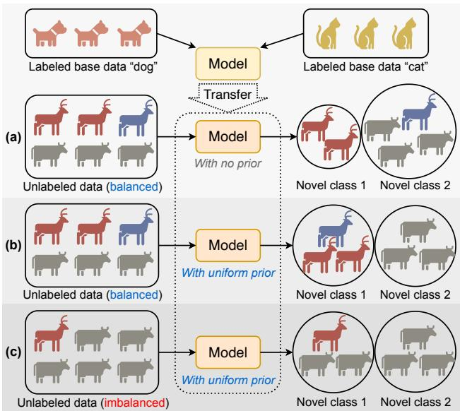
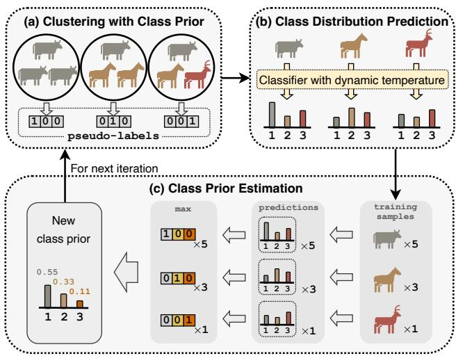
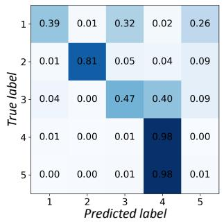
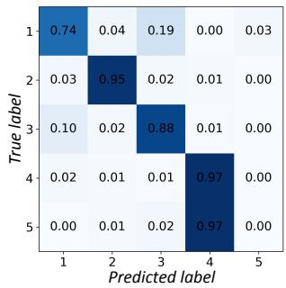
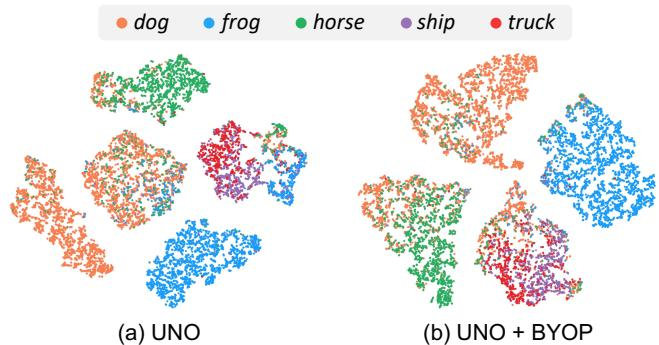

# Bootstrap Your Own Prior: Towards Distribution-Agnostic Novel Class Discovery

Muli Yang1, Liancheng Wang1, Cheng Deng1\*, and Hanwang Zhang2 1School of Electronic Engineering, Xidian University, Xi’an, China 2School of Computer Science and Engineering, Nanyang Technological University, Singapore {mlyang, lcwang9}@stu.xidian.edu.cn, chdeng@mail.xidian.edu.cn, hanwangzhang@ntu.edu.sg

## Abstract

Novel Class Discovery (NCD) aims to discover unknown classes without any annotation, by exploiting the transferable knowledge already learned from a base set of known classes. Existing works hold an impractical assumption that the novel class distribution prior is uniform, yet neglect the imbalanced nature of real-world data. In this paper, we relax this assumption by proposing a new challenging task: distribution-agnostic NCD, which allows data drawn from arbitrary unknown class distributions and thus renders existing methods useless or even harmful. We tackle this challenge by proposing a new method, dubbed “Bootstrapping Your Own Prior (BYOP)”, which iteratively estimates the class prior based on the model prediction itself. At each iteration, we devise a dynamic temperature technique that better estimates the class prior by encouraging sharper predictionsfor less-confident samples. Thus, BYOP obtains more accurate pseudo-labels for the novel samples, which are beneficial for the next training iteration. Extensive experiments show that existing methods suffer from imbalanced class distributions, while BYOP1 outperforms them by clear margins, demonstrating its effectiveness across various distribution scenarios.

## 1. Introduction

With the ever-increasing growth of massive unlabeled data, our community is interested in mining and leveraging the “dark” knowledge therein [2, 7, 28]. To this end, Novel Class Discovery (NCD) [14] is considered as a pivotal step, which aims to automatically recognize novel classes by partitioning the unlabeled data into different clusters with the knowledge learned from a labeled base class set. Note that the base knowledge is indispensable because clustering without a prior is known as an ill-posed problem [20]—data can always be clustered w.r.t. any feature dimension, e.g., color and background. Hence, the base set provides a preliminary prior for defining class vs. non-class features, e.g., the object background feature is removed for discovering new classes.

  
Figure 1. Novel Class Discovery (NCD) in different scenarios. (a) NCD with no prior on balanced unlabeled data. (b) NCD with the uniform prior on balanced unlabeled data. (c) NCD with the uniform prior on imbalanced unlabeled data.

Yet, clustering is still ambiguous to other features not removed by the base knowledge. As shown in Fig. 1(a), if we do not specify the class distribution prior, i.e., #sample per class, the two clusters may be considered as red vs. other color, but not the desired moose vs. cow. Therefore, clustering with such a specified prior is a common practice in existing NCD methods [11,34,47]. However, they hold a na¨ıve assumption that the class distribution in the unlabeled data is balanced, i.e., the prior is uniform. This is impractical because the nature of data distribution—especially for large-scale data—is imbalanced [23, 31, 33]. As shown in the comparison between Figs. 1(b) and (c), if the data is imbalanced, the uniform prior is misleading.

  
Figure 2. The training pipeline of our proposed BYOP for distribution-agnostic NCD. (a) At each iteration, BYOP clusters the unlabeled data using the class prior coming from the previous iteration to generate pseudo-labels (Sec. 3.1). (b) BYOP is trained to predict the novel class distributions using the generated pseudo-labels, where we devise a dynamic temperature technique to encourage more confident predictions (Sec. 3.2). (c) The class prior is estimated by calculating the proportion of each class assignment, which is ready to use for the next iteration (Sec. 3.3).

In this paper, we relax such an impractical assumption by allowing novel data drawn from an arbitrary unknown class distribution. We term this new challenging task distribution-agnostic NCD, which renders existing methods useless or even harmful when the novel data is highlyimbalanced. The crux of the problem is the prior itself—on one hand, it is a critical ingredient against cluster ambiguities; on the other hand, it becomes misleading when it mismatches with the true class distribution. This gives rise to a chicken-egg problem in distribution-agnostic NCD, as the class distribution is no longer known as a priori. We propose to address this dilemma by “Bootstrapping Your Own Prior” (BYOP /baI"6p/)—iteratively estimating the class distribution based on the model prediction itself, which can be used as a prior to obtain more accurate pseudo-labels that help the next training iteration.

The BYOP pipeline is summarized in Fig. 2. Given a batch of unlabeled data with an arbitrary unknown class distribution, we deploy a clustering method [1] that partitions the data subject to the current class prior. At each iteration, the current class prior estimation is not yet accurate (e.g., we initialize by the uniform prior), and thus may result in ambiguous clusters for the minority classes if the true class distribution is highly-imbalanced (Fig. 2(a)).

The cluster assignments are used as pseudo-labels to train a classifier to discover novel classes. However, due to the imperfections in pseudo-labels, the predicted class distributions are inevitably ambiguous, especially for those minority classes. To this end, we propose a dynamic temperature technique that can be integrated into the classifier to output more confident distribution predictions (Fig. 2(b)). The main idea is to encourage sharper predicted distributions for less-confident data by a per-sample temperature adjustment. In particular, we call it “adaptive” because it won’t hurt the prediction for the samples which are already confident, while significantly disambiguating those who are less confident, as later discussed in Fig. 3.

To estimate the class prior, we gather the predicted novel class distributions as the class assignments for the training samples, and calculate the proportion of each class assignment (Fig. 2(c)), so that we can derive a new class prior that is beneficial for the next training iteration. Note that the higher prediction accuracy for majority classes guarantees to estimate a preliminary prior that helps generate more accurate pseudo-labels, which in turn promotes the reliability of the prior estimation for other classes via more accurate model predictions. We benchmark our proposed BYOP and the current state-of-the-art methods in the challenging distribution-agnostic NCD task on several standard datasets. While current methods suffer from imbalanced class distributions, BYOP outperforms them by large margins, demonstrating its effectiveness across different class distributions, including the conventionally balanced one.

To sum up, our contributions are three-fold:

• A new challenging distribution-agnostic NCD task that relaxes the impractical uniform class distribution assumption in current NCD works.

• A novel training paradigm dubbed BYOP to handle arbitrary unknown class distributions in NCD by iteratively estimating and utilizing the class prior.

• Extensive experiments that benchmark the current state-of-the-art methods as well as the superiority of the proposed BYOP in distribution-agnostic NCD.

## 2. Related Work

Similar to typical transfer learning tasks [44–49], the goal of Novel Class Discovery (NCD) [14] is to cluster novel samples using the transferable knowledge learned from the known base classes. To this end, early attempts [18, 19] resort to exploiting pairwise similarities as the supervision for novel samples. Later works further improve NCD with more sophisticated similarity measurements [12, 13, 43, 53] or with carefully-designed losses [25, 51, 56, 57]. Another line of works [11, 47] use a unified training objective for both base and novel classes, resulting in a compact network architecture, and in this paper we also follow them to adopt this formula. Recently, NCD has been extended to various practical scenarios [8,10,22,41,54,55], such as semi-supervised learning [3, 34, 35], multi-domain learning [50,59], and class-incremental learning [24,30,36].

However, most existing works assume a uniform novel class distribution or require the ground-truth class prior [35]. In this paper, we introduce a new challenging task, namely distribution-agnostic NCD, to relax this impractical assumption. We propose to estimate the class distribution prior based on the model prediction itself, and effectively leverage the estimated prior by deploying an optimal transport-based clustering method [1] using the Sinkhorn-Knopp algorithm [9] that has been shown effective in various applications [6, 11, 35, 38, 42].

## 3. Approach

We detail our proposed BYOP to address the challenging distribution-agnostic NCD task. We begin with the problem definition and overall framework, and then the implementation breakdown.

Problem Definition. The goal of NCD is to discover unknown classes using the learned transferable knowledge. In training, we have a base set $\mathcal { D } ^ { b } = \{ ( \boldsymbol { { \mathbf { \mathit { x } } } _ { i } ^ { b } } , \boldsymbol  { \mathbf { \mathit { y } } } _ { i } ^ { b } ) \} _ { i = 1 } ^ { N ^ { b } }$ containing labeled samples $\pmb { x } _ { i } ^ { b }$ associated with one-hot labels $\mathbf { \Delta } y _ { i } ^ { b }$ from $C ^ { b }$ classes, and a novel set $\mathcal { D } ^ { n } = \{ \pmb { x } _ { j } ^ { n } \} _ { j = 1 } ^ { N ^ { n } }$ containing unlabeled samples $\pmb { x } _ { j } ^ { n }$ from $C ^ { n }$ novel classes, in which $C ^ { n }$ is known a priori. The classes in base and novel sets are non-overlapped. To discover unknown classes, a model is required to partition $\mathcal { D } ^ { n }$ into $C ^ { n }$ clusters using the knowledge learned from $\mathcal { D } ^ { b }$ . A common practice [11, 12, 56] is to assume a uniform class distribution in $\mathcal { D } ^ { n }$ . In contrast, in this paper we focus on the more challenging distributionagnostic NCD, where samples in $\mathcal { D } ^ { n }$ can be drawn from arbitrary unknown distributions.

Overall Framework. To handle novel data without knowing the class distribution prior in advance, as shown in Fig. 2, our proposed BYOP estimates the prior based on the model prediction itself during each training iteration, which can be used to generate more accurate pseudo-labels and in turn helps the next iteration. The key procedures can be summarized as (1) clustering with class prior, (2) class distribution prediction, and (3) class prior estimation, which will be respectively introduced below.

To begin with, we follow existing works [11, 47] to use a shared image encoder $\phi ( \cdot )$ to obtain image features for both base and novel samples, $i . e . , z = \phi ( { \pmb x } )$ The features z are then fed into two independent heads $h ( \cdot )$ and $g ( \cdot )$ to get the outputs for base and novel samples, respectively. In particular, the base head $h ( \cdot )$ is a linear classifier with $C ^ { b }$ output neurons, while the novel head $g ( \cdot )$ is an MLP that first projects z into a lower-dimensional $z ^ { \prime } { \mathrm { . } }$ , followed by a linear classifier with $C ^ { n }$ output neurons. Following [6, 11], the feature representation $z , z ^ { \prime }$ and the linear classifiers are all $\ell _ { 2 }$ -normalized for better training stability. Note that from now on we slightly abuse x to denote the image features z or $z ^ { \prime }$ for brevity. We pack the shared image encoder $\phi ( \cdot )$ and the two individual heads $h ( \cdot ) , g ( \cdot )$ into a neural network $f _ { \theta } ( \cdot )$ that can be trained to compute class predictions for both base and novel samples.

## 3.1. Clustering with Class Prior

Clustering is a pivotal step to discover unknown classes in the novel set $\mathcal { D } ^ { n }$ . To effectively incorporate the class prior into the clustering process, we deploy an optimal transport-based clustering method [1, 6] that can explicitly impose the cluster-wise regularization. The main idea is to treat the linear classifier’s weight parameters in the novel head $g ( \cdot )$ as cluster centers, such that we can assign novel samples to each of them subject to certain constraints.

Formally, given a batch of novel samples with feature vectors $\mathbf { X } = [ \pmb { x } _ { 1 } ^ { n } , \dots , \pmb { x } _ { B } ^ { n } ]$ , our goal is to assign them to the cluster centers $\mathbf { W } \ = \ [ \pmb { w } _ { 1 } , \dotsc , \pmb { w } _ { C ^ { n } } ]$ that are actually the linear classifier weights. We denote the assignment for each sample by $\mathbf { Y } = [ \pmb { y } _ { 1 } ^ { n } , \dots , \pmb { y } _ { B } ^ { n } ]$ , which can be optimized by maximizing the similarity between the sample features and the cluster centers:

$$
\operatorname* { m a x } _ { \mathbf { Y } \in \mathcal { T } } \mathrm { t r } ( \mathbf { Y } ^ { \top } \mathbf { W } ^ { \top } \mathbf { X } ) + \epsilon H ( \mathbf { Y } ) ,\tag{1}
$$

where $H ( \cdot )$ is the entropy function, ϵ is a hyperparameter controlling the smoothness of Y, and T is the transportation polytope defined as

$$
\mathcal { T } = \left\{ \mathbf { Y } \in \mathbb { R } _ { + } ^ { C ^ { n } \times B } \mid \mathbf { Y 1 } _ { B } = p , \mathbf { Y } ^ { \top } \mathbf { 1 } _ { C ^ { n } } = \frac { 1 } { B } \mathbf { 1 } _ { B } \right\} ,\tag{2}
$$

in which $\mathbf { 1 } _ { B }$ is a B-dimensional vector of all ones, and $\pmb { p }$ is a $C ^ { n }$ -dimensional vector that controls the assignment proportion of different cluster centers.

A common choice is to uniformly assign a batch of samples to each cluster center, $i . e .$ , letting $\begin{array} { r } { { \cal p } = \frac { 1 } { { \cal C } ^ { n } } { \bf 1 } _ { { \cal C } ^ { n } } , } \end{array}$ which has been proven useful in preventing degenerate solutions [1,6]. However, as we discussed in Sec. 1, the uniform partition can be useless or even harmful in distributionagnostic NCD. To this end, instead of fixing the uniform values for $^ { p , }$ we propose to use an estimated class prior (Sec. 3.3) that better reflects the true class distribution.

The solution to Eq. (1) can be obtained by a small number of matrix multiplications using the Sinkhorn-Knopp algorithm [9], and we defer the details to Appendix. It is worth noting that the resulting assignments in Y are soft probabilities instead of discrete one-hot codes, which are reported to better suit training with small batches [6], and we use them as pseudo-labels for the novel samples.

## 3.2. Class Distribution Prediction

Training Objective. With the generated soft pseudo-labels Y at hand, we can use them to train the model $f _ { \theta } ( \cdot )$ by minimizing a standard cross-entropy loss. Before that, we follow [11] to concatenate the output logits from the base and novel heads, $i . e . , \pmb q = [ \pmb q ^ { b } , \pmb q ^ { n } ] \in \mathbb { R } ^ { C ^ { b } + C ^ { n } }$ where $\pmb q ^ { b } = h ( \pmb x )$ and $\pmb q ^ { n } = g ( \pmb x )$ . This enables a unified training objective for both base and novel samples, which has been shown beneficial in traditional NCD task [11, 47]. Specifically, the cross-entropy loss is written as

$$
\mathcal { L } ( \boldsymbol { x } , \boldsymbol { y } ) = - \sum _ { c = 1 } ^ { C } y _ { c } \log ( \hat { y } _ { c } ) , \hat { \boldsymbol { y } } = \sigma ( \boldsymbol { q } / \tau ) ,\tag{3}
$$

where $C = C ^ { b } + C ^ { n } , y _ { c }$ is the c-th element of the label $^ { y , }$ and $\sigma ( \cdot )$ is a shared softmax function with temperature τ that outputs a posterior distribution $\hat { \textbf { \textit { y } } }$ over the whole $( C ^ { b } + C ^ { n } )$ -dimensional label space. Accordingly, the label $\textbf {  { y } }$ for the base sample is constructed by zero-padding its one-hot label $y ^ { b } , i . e . , y \ = \ [ { { y } ^ { b } } , { { \bf 0 } } _ { C ^ { n } } ]$ where $\mathbf { 0 } _ { C ^ { r } }$ is a $C ^ { n }$ -dimensional vector of all zeros; likewise, for each novel sample, y is constructed by zero-padding its generated soft pseudo-label, $i . e . , { \pmb y } = [ { \bf 0 } _ { C ^ { b } } , { \pmb y } ^ { n } ]$

By minimizing Eq. (3) for both base and novel samples, we are training the model to compute the posterior distributions that explicitly map the base samples to each known class, while assigning the novel samples to the on-the-fly cluster centers with different probabilities. Since we regard the position of the maximum element in the predicted class distribution as the final novel class assignment for each novel sample, the prediction confidence plays a critical role that determines the reliability of the assignment.

Dynamic Temperature. A possible workaround to improve the prediction confidence is to generate sharper or even one-hot pseudo-labels for the novel data, which, however, can be problematic when clusters themselves are ambiguous, especially when data is imbalanced. In contrast, we devise a dynamic temperature technique that acts in a per-sample fashion, supporting a more fine-grained training adjustment to improve the prediction confidence. Specifically, we scale the temperature parameter τ in Eq. (3) as

$$
\tau ^ { \prime } = \tau / \rho , \rho = \operatorname* { m a x } \left( \sigma ( \pmb { q } / \tau ) \right) ,\tag{4}
$$

and use it in replace of the original temperature τ when minimizing Eq. (3). The per-sample scaling factor $\rho$ is calculated by taking the maximum element of the posterior distribution yˆ for each training sample, which naturally has a bound of $\textstyle { \left[ { \frac { 1 } { C } } , 1 \right] }$

This temperature readjustment dynamically controls the learning behaviour of each sample based on the model prediction confidence. Simply put, for data with a high prediction confidence, model tends to output a low-entropy distribution such that $\rho$ approaches 1, which has a negligible effect on the original temperature; for data with lower confidence, $\rho$ becomes much smaller, resulting in the larger temperature $\tau ^ { \prime }$ . It is known that the temperature parameter controls the smoothness of the softmax output [17], which subsequently affects the magnitude of the calculated crossentropy loss. Specifically, the c-th element of the new posterior distribution $\hat { \mathbf { y } } ^ { \prime }$ in Eq. (3) can be written as

  
(a) BYOP w/  
(b) BYOP w/  
Figure 3. Confusion matrices of the five novel classes on CIFAR10 with imbalance ratio 10. (a) BYOP trained with the default temperature τ . (b) BYOP trained with the dynamic temperature $\tau ^ { \prime }$

$$
\hat { y } _ { c } ^ { \prime } = \sigma (  { \boldsymbol { q } } / \tau ^ { \prime } ) _ { c } = \frac { \exp (  { \boldsymbol { q } } _ { c } / \tau ^ { \prime } ) } { \sum _ { c ^ { \prime } = 1 } ^ { C } \exp (  { \boldsymbol { q } } _ { c ^ { \prime } } / \tau ^ { \prime } ) } .\tag{5}
$$

For data with an already high confidence, the dynamic temperature $\tau ^ { \prime }$ induces slight variations in $\hat { \mathbf { y } } ^ { \prime }$ , resulting in negligible changes in the calculated cross-entropy loss. While for less-confident data, the larger temperature $\tau ^ { \prime }$ will render $\hat { \mathbf { y } } ^ { \prime }$ flatter, $i . e .$ , with the higher entropy, which leads to a larger loss that in turn encourages a more confident prediction. As shown in the comparison between Figs. 3(a) and (b), the dynamic temperature technique significantly disambiguates the less-confident predictions, leading to better performance in distribution-agnostic NCD.

Note that the dynamic temperature technique may have inconspicuous effect on base samples since most predictions are highly-confident thanks to their one-hot labels, but it plays an indispensable role for novel samples given the ambiguous nature of the soft pseudo-labels, helping a more accurate class prior estimation.

## 3.3. Class Prior Estimation

We estimate the class distribution prior based on the model predictions for training samples. A possible means is to repeatedly run a forward pass for all training data after one or a few training epochs. Except for requiring extra computations, it lacks the flexibility in prior estimation— a same fixed prior may be used for one or more training epochs—which can cause cumulative bias when the estimated prior is less accurate. Instead, we propose a flexible online prior estimation method that requires little computation overhead.

Algorithm 1: BYOP for distribution-agnostic NCD   
Input: Training data $\{ \mathcal { D } ^ { b } , \mathcal { D } ^ { n } \}$ , temperature parameter τ   
Output: Optimal $f _ { \theta } ( \cdot )$ with base/novel head $h ( \cdot ) , g ( \cdot )$   
1 Initialize: $f _ { \theta } ( \cdot )$ , uniform class prior p, empty queue K   
2 while not converged do   
3 Sample a batch from $\mathcal { D } ^ { b }$ and $\mathcal { D } ^ { n }$ as training data:   
$\{ ( \pmb { x } _ { i } ^ { b } , \pmb { y } _ { i } ^ { b } ) \} _ { i = 1 } ^ { B ^ { b } }$ and $\{ \pmb { x } _ { j } ^ { n } \} _ { j = 1 } ^ { B ^ { n } } ;$   
4 for samples in the batch do   
5 Calculate model output logit: ${ \pmb q } ^ { b } = h ( { \pmb x } )$   
${ \pmb q } ^ { n } = { \pmb g } ( { \pmb x } )$ , and push $\pmb q ^ { n }$ of ${ \pmb x } ^ { n }$ into ${ \mathrm { { \dot { \kappa } } } } ,$   
6 Adjust temperature: $\tau ^ { \prime } = \tau / \rho$ using Eq. (4);   
7 end   
$/ \star$ Clustering with Class Prior \*/   
8 Generate pseudo-labels $\{ \pmb { y } _ { j } ^ { n } \} _ { j = 1 } ^ { B ^ { n } }$ for novel samples   
using $\{ q _ { j } ^ { n } \} _ { j = 1 } ^ { B ^ { n } }$ and p by solving Eq. (1);   
$/ \star$ Class Distribution Prediction /   
9 Calculate CE loss L in Eq. (3) with per-sample $\tau ^ { \prime } ;$   
10 Update network parameters θ using $\nabla { \mathcal { L } } ;$   
/\* Class Prior Estimation \*/   
11 Update class prior p with K using Eqs. (6) and (7);   
12 end

At each training iteration, we gather the novel samples’ output logits $\pmb q ^ { n }$ in the current training batch into a first-infirst-out queue [15], i.e., $\mathcal { K } = \{ \pmb { q } _ { 1 } ^ { n } , \ldots , \pmb { q } _ { K } ^ { n } \}$ . With a moderate queue size K, we can estimate the class prior using the most recent model predictions that easily adapt across iterations. Formally, the class prior $r \in \mathbb { R } ^ { \bar { C } ^ { n } }$ is estimated by calculating the proportions of the one-hot assignments in K for each novel class:

$$
r _ { c } = \frac { 1 } { K } \sum _ { k = 1 } ^ { K } \mathbb { 1 } \left( c = \underset { c ^ { \prime } \in S } { \arg \operatorname* { m a x } } q _ { k , c ^ { \prime } } ^ { n } \right) ,\tag{6}
$$

where $S = \{ 1 , \ldots , C ^ { n } \}$ is the label set for novel classes, $q _ { k , c ^ { \prime } } ^ { n }$ is the $c ^ { \prime } .$ th element of $\pmb { q } _ { k } ^ { n } .$ , and 1(·) is an indicator function. To further guarantee the stability of the prior estimation, we update the estimated prior with a moving-average fashion in each iteration, i.e.,

$$
\pmb { p }  \mu \pmb { p } + ( 1 - \mu ) \pmb { r } ,\tag{7}
$$

where $\mu \in [ 0 , 1 ]$ controls the smoothness of the movingaverage behaviour, and we initialize $\pmb { p } = \left[ { \frac { 1 } { C ^ { n } } } , \dots \dots , { \frac { 1 } { C ^ { n } } } \right]$ as a uniform class prior since we hold no assumption of the true class distribution. Accordingly, we can now integrate p into Eq. (2) for calculating new pseudo-labels for the next training iteration. As the training goes by, the model becomes more accurate, which helps a more reliable prior estimation. The whole training procedure is summarized in Algorithm 1.

<table><tr><td rowspan="2">Subset → Dataset↓</td><td colspan="2">Base</td><td colspan="2">Novel</td></tr><tr><td>Images</td><td>Classes</td><td>Images</td><td>Classes</td></tr><tr><td>CIFAR10</td><td>25K</td><td>5</td><td>25K</td><td>5</td></tr><tr><td>CIFAR100-20</td><td>40K</td><td>80</td><td>10K</td><td>20</td></tr><tr><td>CIFAR100-50</td><td>25K</td><td>50</td><td>25K</td><td>50</td></tr><tr><td>Tiny-ImageNet</td><td>50K</td><td>100</td><td>50K</td><td>100</td></tr></table>

Table 1. Datasets statistics with respect to base/novel subsets.

## 4. Experiments

In this section, we benchmark the current state-of-the-art methods in the challenging distribution-agnostic NCD task, and evaluate the effectiveness of our proposed BYOP.

## 4.1. Experimental Setup

Datasets. We evaluate our propose BYOP on three standard NCD benchmark datasets following prior works [11, 12,14,47,56], i.e., CIFAR10 [26], CIFAR100 [26], and ImageNet [37]. However, since the original ImageNet split used in NCD [18, 19] contains only 30 novel classes and is known to be saturated in performance (e.g., 90%+ accuracy), we switch to a more challenging substitution that contains much more novel classes, i.e., Tiny-ImageNet [29]. The dataset statistics are summarize in Tab. 1, in which we follow [11, 47] to use two different splits of CIFAR100. To be specific, each dataset is divided into two subsets, i.e., (1) the base set, containing the labeled data of known base classes, and (2) the novel set, containing the unlabeled data of novel classes. We follow former works to assume the number of novel classes $( C ^ { n } )$ to be known a priori; Appendix also provides the experiment with an unknown $C ^ { n }$ . To create training data (both base and novel samples) with different class distributions, we use the imbalance ratio [4, 58] (i.e., $\frac { N _ { m a x } } { N _ { m i n } }$ , where N is the number of samples in each class) to control the marginal class prior. In experiments we report the evaluations with two representative imbalance ratios, i.e., 100 and 10, where the many-, medium-, and few-shot classes are equally divided according to the descend order of sample numbers. Note that we also involve evaluations with more imbalance ratios in Appendix.

Evaluation Protocol. We evaluate our model on recognizing novel classes in the training split, which is a traditional NCD protocol [12, 14, 56], but is much more challenging when training data is highly-imbalanced. For comprehensive evaluations, we also follow [11, 47] to test our model on recognizing base and novel classes in the test split using task-aware and task-agnostic protocols. In the task-aware protocol, each test sample comes with the task information, i.e., which subset (base/novel) it is from, such that the model only needs to consider the base head output for base samples, and vice versa. In contrast, the task-agnostic protocol is a more generalized setting that excludes this task information. Note that we follow long-tailed learning literature [4, 39, 58] to use uniformly-distributed test data to evaluate the generalization ability. We report the results averaged over five runs for each dataset with different imbalance ratios. Specifically, we use the accuracy metric for base samples, and the average clustering accuracy for novel samples, which is defined as

<table><tr><td>Subset (split) →</td><td colspan="4">Novel (training)</td><td colspan="4">Base (test)</td><td colspan="4">Novel (test)</td></tr><tr><td>Method↓</td><td>Many</td><td>Med.</td><td>Few</td><td>All</td><td>Many</td><td>Med.</td><td>Few</td><td>All</td><td>Many</td><td>Med.</td><td>Few</td><td>All</td></tr><tr><td>Uniform p</td><td>24.6</td><td>33.9</td><td>16.1</td><td>25.7</td><td>78.5</td><td>41.9</td><td>14.1</td><td>44.8</td><td>23.8</td><td>24.7</td><td>15.4</td><td>21.3</td></tr><tr><td>Oracle p</td><td>32.1</td><td>28.1</td><td>12.0</td><td>30.8</td><td>77.4</td><td>43.4</td><td>15.1</td><td>45.3</td><td>27.2</td><td>28.3</td><td>12.9</td><td>22.8</td></tr><tr><td>Estimated p</td><td>29.7</td><td>31.0</td><td>14.6</td><td>29.4</td><td>76.1</td><td>43.4</td><td>15.2</td><td>44.9</td><td>28.7</td><td>23.4</td><td>15.6</td><td>22.6</td></tr><tr><td>Uniform p + dynamic τ</td><td>26.8</td><td>33.6</td><td>15.7</td><td>27.5</td><td>76.5</td><td>43.7</td><td>15.4</td><td>45.2</td><td>27.0</td><td>27.8</td><td>12.5</td><td>22.4</td></tr><tr><td>Oracle p + dynamic τ</td><td>39.1</td><td>28.7</td><td>11.0</td><td>36.5</td><td>76.6</td><td>43.6</td><td>16.6</td><td>45.6</td><td>36.0</td><td>22.7</td><td>11.0</td><td>23.2</td></tr><tr><td>Estimated p + dynamic τ</td><td>37.7</td><td>28.6</td><td>13.9</td><td>35.5</td><td>76.6</td><td>44.2</td><td>15.4</td><td>45.4</td><td>33.6</td><td>24.1</td><td>12.4</td><td>23.4</td></tr></table>

Table 2. Ablation study on CIFAR100-50 with imbalance ratio 100. Results are reported in averaged top-1 classification/clustering accuracy (%). The task-aware protocol is used for the test split. “Med.” is short for “Medium”. Best results are highlighted in each column.

<table><tr><td>Dataset →</td><td colspan="6">CIFAR10 (imbalance ratio: 100)</td><td colspan="6">CIFAR10 (imbalance ratio: 10)</td></tr><tr><td>Protocol →</td><td>Trad.</td><td colspan="3">Task-aware</td><td colspan="3">Task-agnostic</td><td colspan="3">Trad. Task-aware</td><td colspan="3">Task-agnostic</td></tr><tr><td>Method ↓</td><td>Nov.</td><td>Base</td><td>Nov.</td><td>All</td><td>Base</td><td>Nov.</td><td>All</td><td>Nov. Base</td><td>Nov.</td><td>All</td><td>Base</td><td>Nov.</td><td>All</td></tr><tr><td>RS [12]</td><td>46.3</td><td>71.8</td><td>43.2</td><td>57.5</td><td></td><td></td><td></td><td>69.7</td><td>87.4 63.6</td><td>75.5</td><td></td><td></td><td></td></tr><tr><td>RS+[12]</td><td>45.3</td><td>64.4</td><td>50.1</td><td>57.3</td><td>64.4</td><td>55.5 60.0</td><td>66.5</td><td>77.3</td><td>63.3</td><td>70.3</td><td>77.3</td><td>62.3</td><td>69.8</td></tr><tr><td>NCL [56]</td><td>47.2</td><td>71.6</td><td>43.1</td><td>57.4</td><td></td><td></td><td></td><td>62.6 86.9</td><td>56.9</td><td>71.9</td><td>一</td><td>一</td><td></td></tr><tr><td>UNO [11]</td><td>43.9</td><td>69.6</td><td>52.2</td><td>60.9</td><td>56.0</td><td>55.6</td><td>55.8</td><td>59.6 88.1</td><td>59.1</td><td>73.6</td><td>78.2</td><td>58.8</td><td>68.5</td></tr><tr><td>UNO + BYOP</td><td>59.3</td><td>70.1</td><td>53.3</td><td>61.7</td><td>56.6</td><td>56.6 56.6</td><td></td><td>63.2 88.5</td><td>61.7</td><td>75.1</td><td>78.4</td><td>61.0</td><td>69.7</td></tr><tr><td>ComEx [47]</td><td>44.6</td><td>70.0</td><td>53.8</td><td>61.9</td><td>57.8</td><td>55.1 56.5</td><td>68.1</td><td>87.9</td><td>63.5</td><td>75.7</td><td>81.3</td><td>63.3</td><td>72.3</td></tr><tr><td>ComEx + BYOP</td><td>57.0</td><td>71.4</td><td>54.5</td><td>63.0</td><td>59.3</td><td>56.0 57.7</td><td></td><td>72.1 88.7</td><td>65.5</td><td>77.1</td><td>82.2</td><td>65.4</td><td>73.8</td></tr></table>

Table 3. Performance on CIFAR10 with different imbalance ratios. Results are reported in averaged top-1 classification/clustering accuracy (%). “Trad.” is short for “Traditional”, and “Nov.” is short for “Novel”. Best and second-best results are highlighted in each column.

$$
\mathrm { C l u s t e r A c c } = \operatorname* { m a x } _ { t \in \mathcal { P } ( C ^ { n } ) } \frac { 1 } { N } \sum _ { j = 1 } ^ { N } \mathbb { 1 } \left( y _ { j } = t ( \hat { y } _ { j } ) \right) ,\tag{8}
$$

where $y _ { j }$ and $\hat { y } _ { j }$ are respectively ground-truth label and cluster assignment prediction for each novel sample $\mathbf { \mathscr { x } } _ { j } ^ { n } ; N$ is the total number of novel samples for test; ${ \mathcal { P } } ( C ^ { n } )$ denotes the set of all possible permutations of $C ^ { n }$ elements, and t is an arbitrary permutation. The optimal permutation $t ^ { * }$ can be obtained using the Hungarian algorithm [27].

Implementation Details. We use a ResNet-18 [16] as the image encoder $\phi ( \cdot )$ for fair comparisons with the existing methods [11, 12, 47, 56]. We also follow [11, 47] to use a same architecture for base and novel heads $h ( \cdot ) , g ( \cdot )$ and a same training method (pretraining, multi-head clustering [5, 21], data augmentation, optimizer, learning rate scheduler) to ensure an immediate comparison. In particular, we pretrain the model for 200 epochs on the base set, and then train for another 200 epochs on both base and novel sets to discover novel classes. Note that BYOP, UNO [11] and ComEx [47] share the same pretrained weights in our experiments; for other methods with different architectures, we rerun the pretraining using the same base set. However, we disable the over-clustering strategy originally used in [11, 47] for relevant methods since we found it harmful when data is imbalanced. The default temperature parameter τ is set to 0.1, and the queue size |K| is 6000, with the moving average factor $\mu ~ = ~ 0 . 9 9$ We delay the prior estimation after 5 training epochs in our experiments for better stability. We inherit the hyperparameters for the Sinkhorn-Knopp algorithm [9] from the former work [6], $i . e . , \epsilon = 0 . 0 5$ and the iteration number is 3. Please see Appendix for more details.

## 4.2. Ablation Study

We evaluate the effectiveness of the two key ingredients of BYOP, $i . e .$ , the prior estimation and the dynamic temperature technique. The results are summarized in Tab. 2.

Effect of Prior Estimation. We can observe that with the estimated class prior (“Estimated $\pmb { p } ^ { \prime \prime } )$ the model achieves better overall results compared with the uniform prior (“Uniform $\pmb { p } ^ { \prime \prime } )$ . We also report the results with the ground truth prior (“Oracle $\pmb { p } ^ { \prime \prime } )$ for reference, which performs comparably to the estimated prior, validating the effectiveness of our class prior estimation strategy. It is worth noting that the estimated class prior benefits more for the majority novel classes (“Many”), because with the uniform prior the model tends to spread samples of majority classes to different clusters, and thus performs poorly in “Many”. The estimated prior rectifies this behaviour by allowing larger clusters for majorities classes, which may have a side effect for minority classes (“Few”) since their clusters are significantly reduced. Still, we deem it rational as the majority classes are more important for NCD in practice.

<table><tr><td>Dataset →</td><td colspan="7">CIFAR100-20 (imbalance ratio: 100)</td><td colspan="7">CIFAR100-20 (imbalance ratio: 10)</td></tr><tr><td>Protocol →</td><td>Trad.</td><td colspan="3">Task-aware</td><td colspan="3">Task-agnostic</td><td>Trad.</td><td colspan="3">Task-aware</td><td colspan="3">Task-agnostic</td></tr><tr><td>Method↓</td><td>Nov.</td><td>Base</td><td>Nov.</td><td>All</td><td>Base</td><td>Nov.</td><td>All</td><td>Nov.</td><td>Base</td><td>Nov.</td><td>All</td><td>Base</td><td>Nov.</td><td>All</td></tr><tr><td>RS [12]</td><td>36.5</td><td>40.0</td><td>36.2</td><td>39.2</td><td></td><td></td><td></td><td>47.6</td><td>58.8</td><td>47.8</td><td>56.6</td><td></td><td></td><td></td></tr><tr><td>RS+[12]</td><td>35.3</td><td>38.2</td><td>32.9</td><td>37.1</td><td>38.2</td><td>24.7</td><td>35.5</td><td>48.8</td><td>55.5</td><td>45.2</td><td>53.4</td><td>55.5</td><td>35.6</td><td>51.5</td></tr><tr><td>NCL [56]</td><td>35.5</td><td>39.1</td><td>28.7</td><td>37.0</td><td>一</td><td>一</td><td>一</td><td>50.3</td><td>57.1</td><td>45.6</td><td>54.8</td><td>一</td><td>一</td><td></td></tr><tr><td>UNO [11]</td><td>35.2</td><td>43.9</td><td>32.5</td><td>41.6</td><td>40.7</td><td>29.9</td><td>38.5</td><td>46.9</td><td>60.9</td><td>46.6</td><td>58.0</td><td>57.9</td><td>38.4</td><td>54.0</td></tr><tr><td>UNO + BYOP</td><td>50.3</td><td>44.3</td><td>35.3</td><td>42.5</td><td>41.3</td><td>33.0</td><td>39.6</td><td>54.5</td><td>61.4</td><td>48.3</td><td>58.8</td><td>58.2</td><td>40.6</td><td>54.7</td></tr><tr><td>ComEx [47]</td><td>36.3</td><td>44.3</td><td>32.1</td><td>41.9</td><td>41.4</td><td>31.1</td><td>39.3</td><td>46.0</td><td>61.3</td><td>45.9</td><td>58.2</td><td>59.3</td><td>42.9</td><td>56.0</td></tr><tr><td>ComEx + BYOP</td><td>51.8</td><td>45.0</td><td>33.1</td><td>42.6</td><td>42.6</td><td>33.3</td><td>40.7</td><td>55.3</td><td>62.2</td><td>47.2</td><td>59.2</td><td>60.2</td><td>45.5</td><td>57.3</td></tr></table>

Table 4. Performance on CIFAR100-20 with different imbalance ratios. Results are reported in averaged top-1 classification/clustering accuracy (%). “Trad.” means “Traditional”, and “Nov.” means “Novel”. Best and second-best results are highlighted in each column.

<table><tr><td>Dataset →</td><td colspan="6">CIFAR100-50 (imbalance ratio: 100)</td><td colspan="6">CIFAR100-50 (imbalance ratio: 10)</td></tr><tr><td>Protocol →</td><td>Trad.</td><td colspan="3">Task-aware</td><td colspan="3">Task-agnostic</td><td colspan="3">Trad. Task-aware</td><td colspan="3">Task-agnostic</td></tr><tr><td>Method↓</td><td>Nov.</td><td>Base</td><td>Nov.</td><td>All</td><td>Base Nov.</td><td>All</td><td>Nov.</td><td>Base</td><td>Nov.</td><td>All</td><td>Base</td><td>Nov.</td><td>All</td></tr><tr><td>RS [12]</td><td>30.7</td><td>40.8</td><td>23.3</td><td>32.1</td><td></td><td></td><td></td><td>27.4 48.4</td><td>23.7</td><td>36.1</td><td></td><td>一</td><td></td></tr><tr><td>RS+[12]</td><td>29.6</td><td>35.5</td><td>23.0</td><td>29.3</td><td>35.5</td><td>22.5 29.0</td><td>26.0</td><td>38.5</td><td>23.4</td><td>31.0</td><td>38.5</td><td>21.9</td><td>30.2</td></tr><tr><td>NCL [56]</td><td>30.4</td><td>39.9</td><td>21.8</td><td>30.9</td><td>1</td><td></td><td></td><td>27.8</td><td>47.0 23.4</td><td>35.2</td><td>一</td><td>一</td><td></td></tr><tr><td>UNO [11]</td><td>25.7</td><td>44.8</td><td>21.3</td><td>33.1</td><td>36.9</td><td>22.6 29.8</td><td></td><td>33.7 63.9</td><td>32.5</td><td>48.2</td><td>53.6</td><td>30.8</td><td>42.2</td></tr><tr><td>UNO + BYOP</td><td>35.5</td><td>45.4</td><td>23.4</td><td>34.4</td><td>37.3</td><td>24.0 30.7</td><td>38.3</td><td>64.6</td><td>34.9</td><td>49.8</td><td>54.1</td><td>33.0</td><td>43.6</td></tr><tr><td>ComEx [47]</td><td>27.1</td><td>45.9</td><td>22.6</td><td>34.3</td><td>39.5</td><td>23.3 31.4</td><td>34.3</td><td>64.6</td><td>32.6</td><td>48.6</td><td>57.7</td><td>31.9</td><td>44.8</td></tr><tr><td>ComEx + BYOP</td><td>33.1</td><td>46.9</td><td>24.1</td><td>35.5</td><td>40.9</td><td>24.4 32.7</td><td></td><td>37.4 65.3</td><td>33.5</td><td>49.4</td><td>58.5</td><td>32.8</td><td>45.7</td></tr></table>

Table 5. Performance on CIFAR100-50 with different imbalance ratios. Results are reported in averaged top-1 classification/clustering accuracy (%). “Trad.” means “Traditional”, and “Nov.” means “Novel”. Best and second-best results are highlighted in each column.

Effect of Dynamic Temperature. As can be seen in Tab. 2, the dynamic temperature technique (“dynamic τ”) unanimously improves the overall performance for any used prior. Still, it works better with the oracle/estimated prior since it benefits from more accurate training signals, i.e., the generated pseudo-labels. Also, the surprising improvement on “Oracle p” suggests that the prediction confidence is critical for distribution-agnostic NCD, which promotes the prediction accuracy and in turn helps a more accurate prior estimation. As discussed in Sec. 3.2, the dynamic temperature should have negligible effect on base classes due to their already high prediction confidence, but still benefits the minority classes when data is highly-imbalanced.

## 4.3. Main Results

Comparison with State of the Arts. We compare our proposed BYOP with five most recent state-of-the-art NCD methods, i.e., RS [12], RS+ [12] (RS with incremental classifier), NCL [56], UNO [11], and ComEx [47]. Since distribution-agnostic NCD involves remarkable changes in the experimental settings, we compare these recent methods with applicable official codes that can be adapted to this task. Specifically, RS, RS+ and NCL exploit pairwise similarities to discover novel classes, without applying explicit uniform regularization on them; while UNO and ComEx impose an explicit uniform constraint when generating pseudo-labels for novel classes. As BYOP shares the similar training objective with UNO and ComEx, we adapt these two methods using the BYOP training paradigm for an immediate evaluation of BYOP’s effectiveness, denoted by “UNO + BYOP” and “ComEx + BYOP”.

As shown in Tabs. 3 to 6, BYOP brings considerable improvements on top of UNO and ComEx, setting the new state of the art in distribution-agnostic NCD. Our improvements are mostly significant in the traditional NCD protocol (“Trad.”), in which an accurate class prior is directly beneficial for discovering novel classes in the training data. However, traditional methods which are trained with a uniform class prior are actually more suitable for evaluations on the test split whose class distribution is also uniform. Yet, we show in results that BYOP can still improve the generalization ability transferable to a different data distribution, even with the most challenging “task-agnostic” protocol.

RS [12] and NCL [56] also yield competitive results on imbalanced data, owing to not using explicit uniform regularization as early discussed, as well as the selfsupervised pretraining and stronger data augmentations such as MixUp [52]. In contrast, BYOP can still achieve better overall performance with much simpler data augmentations and training procedures. However, BYOP’s improvements are less significant on Tiny-ImageNet due to the large amount of novel classes, suggesting that distributionagnostic NCD is still an open challenge in practice.

<table><tr><td>Dataset →</td><td colspan="6">Tiny-ImageNet (imbalance ratio: 100)</td><td colspan="6">Tiny-ImageNet (imbalance ratio: 10)</td></tr><tr><td>Protocol →</td><td>Trad.</td><td colspan="3">Task-aware</td><td colspan="3">Task-agnostic</td><td colspan="3">Trad. Task-aware</td><td colspan="3">Task-agnostic</td></tr><tr><td>Method ↓</td><td>Nov.</td><td>Base</td><td>Nov.</td><td>All</td><td>Base Nov.</td><td>All</td><td>Nov.</td><td>Base</td><td>Nov.</td><td>All</td><td>Base</td><td>Nov.</td><td>All</td></tr><tr><td>RS [12]</td><td>25.6</td><td>37.6</td><td>14.8</td><td>26.2</td><td></td><td></td><td></td><td>22.6</td><td>52.8 17.9</td><td>35.4</td><td></td><td></td><td></td></tr><tr><td>RS+[12]</td><td>22.5</td><td>29.1</td><td>14.9</td><td>22.0</td><td>29.1</td><td>15.0 22.0</td><td></td><td>24.2 38.7</td><td>19.2</td><td>29.0</td><td>38.7</td><td>19.7</td><td>29.2</td></tr><tr><td>NCL [56]</td><td>24.7</td><td>34.0</td><td>14.2</td><td>24.1</td><td></td><td></td><td></td><td>24.8</td><td>49.2</td><td>18.6</td><td>33.9</td><td></td><td></td></tr><tr><td>UNO [11]</td><td>20.8</td><td>35.9</td><td>16.6</td><td>26.3</td><td>25.3</td><td>16.2</td><td>20.8</td><td>25.3</td><td>50.6</td><td>23.3</td><td>37.0 37.9</td><td>22.4</td><td>30.2</td></tr><tr><td>UNO + BYOP</td><td>26.1</td><td>36.3</td><td>17.3</td><td>26.8</td><td>26.0</td><td>17.2 21.6</td><td></td><td>27.9 51.9</td><td>23.8</td><td>37.9</td><td>39.5</td><td>23.3</td><td>31.4</td></tr><tr><td>ComEx [47]</td><td>21.7</td><td>36.3</td><td>16.7</td><td>26.5</td><td>28.9</td><td>16.7 22.8</td><td>26.0</td><td>50.8</td><td>23.3</td><td>37.1</td><td>42.3</td><td>23.2</td><td>32.8</td></tr><tr><td>ComEx + BYOP</td><td>26.2</td><td>36.8</td><td>16.9</td><td>26.9</td><td>30.4</td><td>17.0 23.7</td><td></td><td>30.8 52.3</td><td>23.5</td><td>37.9</td><td>44.2</td><td>23.7</td><td>34.0</td></tr></table>

Table 6. Performance on Tiny-ImageNet with different imbalance ratios. Results are reported in averaged top-1 classification/clusteringT-SNE accuracy (%). “Trad.” means “Traditional”, and “Nov.” means “Novel”. Best and second-best results are highlighted in each column.

<table><tr><td>Subset →</td><td colspan="4">Base (test)</td><td colspan="4">Novel (test)</td></tr><tr><td>Method ↓</td><td>Many</td><td>Med.</td><td>Few</td><td>All</td><td>Many</td><td>Med.</td><td>Few</td><td>All</td></tr><tr><td>UNO [11]</td><td>78.5</td><td>41.9</td><td>14.1</td><td>44.8</td><td>23.8</td><td>24.7</td><td>15.4</td><td>21.3</td></tr><tr><td>UNO + BYOP</td><td>76.6</td><td>44.2</td><td>15.4</td><td>45.4</td><td>33.6</td><td>24.1</td><td>12.4</td><td>23.4</td></tr><tr><td>UNO + BYOP†</td><td>76.3</td><td>47.9</td><td>18.9</td><td>47.7</td><td>28.6</td><td>30.2</td><td>12.9</td><td>23.8</td></tr></table>

Table 7. Performance of BYOP with Logit Adjustment [32] (BYOP†) on CIFAR100-50 with imbalance ratio 100. The taskaware protocol is used. “Med.” is short for “Medium”.

Further Analysis. Thanks to the estimated prior p at hand, another merit of BYOP is to leverage sophisticated longtailed learning techniques, e.g., Logit Adjustment [32], to further improve the performance when data is highlyimbalanced. Specifically, when the target class distribution is uniform, we can combine BYOP with a post-hoc Logit Adjustment strategy that predicts with the adjusted logit $\pmb q ^ { \dag } = \pmb q - \tau \log ( \pmb p )$ . To this end, we also use the same manner detailed in Sec. 3.3 to estimate the class prior for base classes. As shown in Tab. 7, this strategy consistently improves the performance in minority classes, shedding light on new opportunities in distribution-agnostic NCD.

Visualizations. We show in Fig. 4 the visualizations of the output spaces before and after applying our BYOP paradigm on top of UNO [11] for an immediate comparison. In particular, in Fig. 4(a) the original UNO tends to equally partition novel samples into different clusters (especially for majority classes, e.g., dog and frog) due to the uniform training prior, leading to sub-optimal performance. In contrast, BYOP iteratively estimates the class prior that better reflects the true class distribution, and thus achieves promising results in preserving the true data structure, as shown in Fig. 4(b). Still, we can observe inferior clusters for minority classes, which are mainly due to the shortage of training data and high visual similarities. These limitations suggest that distribution-agnostic NCD remains an open challenge for future works.

  
Figure 4. t-SNE [40] visualizations of the five novel classes in the training split of CIFAR10 with imbalance ratio 10. (a) Output space of UNO [11]. (b) Output space of UNO + BYOP.

## 5. Conclusions

In this paper, we presented BYOP, namely “Bootstrapping Your Own Prior”, to tackle the new challenging task of distribution-agnostic Novel Class Discovery. Specifically, for novel samples drawn from an arbitrary unknown class distribution, BYOP iteratively estimates the class distribution prior based on the model prediction itself, which can be used to generate more accurate pseudo-labels for the novel samples in the next training iteration. We highlighted that the key to a reliable class prior estimation is the prediction confidence, for which we devised a dynamic temperature technique that adaptively encourages sharper predictions for less-confident samples. BYOP was evaluated on four NCD benchmarks with various imbalance ratios, demonstrating clear superiority over current state-of-the-art methods.

Acknowledgement. Our work was supported in part by Key Research and Development Program of Shaanxi under Grant 2021ZDLGY01-03, the National Natural Science Foundation of China under Grant 62132016, 62171343, and 62071361, the Fundamental Research Funds for the Central Universities ZDRC2102, and AI Singapore AISG2-RP-2021-022.

## References

[1] Yuki Markus Asano, Christian Rupprecht, and Andrea Vedaldi. Self-labelling via simultaneous clustering and representation learning. In Proc. ICLR, 2020. 2, 3

[2] David Berthelot, Nicholas Carlini, Ian Goodfellow, Nicolas Papernot, Avital Oliver, and Colin Raffel. Mixmatch: A holistic approach to semi-supervised learning. In Proc. NeurIPS, pages 5049–5059, 2019. 1

[3] Kaidi Cao, Maria Brbic, and Jure Leskovec. Open-world semi-supervised learning. In Proc. ICLR, 2022. 3

[4] Kaidi Cao, Colin Wei, Adrien Gaidon, Nikos Arechiga, and Tengyu Ma. Learning imbalanced datasets with labeldistribution-aware margin loss. Proc. NeurIPS, pages 1567– 1578, 2019. 5, 6

[5] Mathilde Caron, Piotr Bojanowski, Armand Joulin, and Matthijs Douze. Deep clustering for unsupervised learning of visual features. In Proc. ECCV, pages 139–156, 2018. 6

[6] Mathilde Caron, Ishan Misra, Julien Mairal, Priya Goyal, Piotr Bojanowski, and Armand Joulin. Unsupervised learning of visual features by contrasting cluster assignments. In Proc. NeurIPS, pages 9912–9924, 2020. 3, 6

[7] Ting Chen, Simon Kornblith, Mohammad Norouzi, and Geoffrey Hinton. A simple framework for contrastive learning of visual representations. In Proc. ICML, pages 1597–1607, 2020. 1

[8] Haoang Chi, Feng Liu, Wenjing Yang, Long Lan, Tongliang Liu, Bo Han, Gang Niu, Mingyuan Zhou, and Masashi Sugiyama. Meta discovery: Learning to discover novel classes given very limited data. In Proc. ICLR, 2022. 3

[9] Marco Cuturi. Sinkhorn distances: Lightspeed computation of optimal transport. In Proc. NeurIPS, pages 2292–2300, 2013. 3, 6

[10] Yixin Fei, Zhongkai Zhao, Siwei Yang, and Bingchen Zhao. Xcon: Learning with experts for fine-grained category discovery. In Proc. BMVC, page 96, 2022. 3

[11] Enrico Fini, Enver Sangineto, Stephane Lathuili ´ ere, Zhun\` Zhong, Moin Nabi, and Elisa Ricci. A unified objective for novel class discovery. In Proc. ICCV, pages 9284–9292, 2021. 1, 2, 3, 4, 5, 6, 7, 8

[12] Kai Han, Sylvestre-Alvise Rebuffi, Sebastien Ehrhardt, Andrea Vedaldi, and Andrew Zisserman. Automatically discovering and learning new visual categories with ranking statistics. In Proc. ICLR, 2020. 2, 3, 5, 6, 7, 8

[13] Kai Han, Sylvestre-Alvise Rebuffi, Sebastien Ehrhardt, Andrea Vedaldi, and Andrew Zisserman. Autonovel: Automatically discovering and learning novel visual categories. IEEE Trans. Pattern Anal. Mach. Intell., 44(10):6767–6781, 2022. 2

[14] Kai Han, Andrea Vedaldi, and Andrew Zisserman. Learning to discover novel visual categories via deep transfer clustering. In Proc. ICCV, pages 8401–8409, 2019. 1, 2, 5

[15] Kaiming He, Haoqi Fan, Yuxin Wu, Saining Xie, and Ross Girshick. Momentum contrast for unsupervised visual representation learning. In Proc. CVPR, pages 9726–9735, 2020. 5

[16] Kaiming He, Xiangyu Zhang, Shaoqing Ren, and Jian Sun. Deep residual learning for image recognition. In Proc. CVPR, pages 770–778, 2016. 6

[17] Geoffrey Hinton, Oriol Vinyals, and Jeff Dean. Distilling the knowledge in a neural network. arXiv:1503.02531, 2015. 4

[18] Yen-Chang Hsu, Zhaoyang Lv, and Zsolt Kira. Learning to cluster in order to transfer across domains and tasks. In Proc. ICLR, 2018. 2, 5

[19] Yen-Chang Hsu, Zhaoyang Lv, Joel Schlosser, Phillip Odom, and Zsolt Kira. Multi-class classification without multi-class labels. In Proc. ICLR, 2019. 2, 5

[20] Anil K. Jain. Data clustering: 50 years beyond k-means. Pattern Recogn. Letters, 31:651–666, 2008. 1

[21] Xu Ji, Joao F Henriques, and Andrea Vedaldi. Invariant information clustering for unsupervised image classification and segmentation. In Proc. ICCV, pages 9864–9873, 2019. 6

[22] Xuhui Jia, Kai Han, Yukun Zhu, and Bradley Green. Joint representation learning and novel category discovery on single-and multi-modal data. In Proc. ICCV, pages 610–619, 2021. 3

[23] Justin M Johnson and Taghi M Khoshgoftaar. Survey on deep learning with class imbalance. Journal of Big Data, 6(1):1–54, 2019. 2

[24] KJ Joseph, Sujoy Paul, Gaurav Aggarwal, Soma Biswas, Piyush Rai, Kai Han, and Vineeth N Balasubramanian. Novel class discovery without forgetting. In Proc. ECCV, pages 570–586, 2022. 3

[25] KJ Joseph, Sujoy Paul, Gaurav Aggarwal, Soma Biswas, Piyush Rai, Kai Han, and Vineeth N Balasubramanian. Spacing loss for discovering novel categories. In Proc. CVPR Workshop, pages 3761–3766, 2022. 2

[26] Alex Krizhevsky, Geoffrey Hinton, et al. Learning multiple layers of features from tiny images. Master’s thesis, Department ofComputer Science, University ofToronto, 2009. 5

[27] Harold W Kuhn. The hungarian method for the assignment problem. Naval research logistics quarterly, 2(1-2):83–97, 1955. 6

[28] Christoph H Lampert, Hannes Nickisch, and Stefan Harmeling. Attribute-based classification for zero-shot visual object categorization. IEEE Trans. Pattern Anal. Mach. Intell., 36(3):453–465, 2013. 1

[29] Ya Le and Xuan Yang. Tiny imagenet visual recognition challenge. CS 231N, 7(7):3, 2015. 5

[30] Yu Liu and Tinne Tuytelaars. Residual tuning: Toward novel category discovery without labels. IEEE Trans. Neural Netw. Learn. Syst., 2022. 3

[31] Ziwei Liu, Zhongqi Miao, Xiaohang Zhan, Jiayun Wang, Boqing Gong, and Stella X Yu. Large-scale long-tailed recognition in an open world. In Proc. CVPR, pages 2537– 2546, 2019. 2

[32] Aditya Krishna Menon, Sadeep Jayasumana, Ankit Singh Rawat, Himanshu Jain, Andreas Veit, and Sanjiv Kumar. Long-tail learning via logit adjustment. In Proc. ICLR, 2021. 8

[33] William J Reed. The pareto, zipf and other power laws. Economics letters, 74(1):15–19, 2001. 2

[34] Mamshad Nayeem Rizve, Navid Kardan, Salman Khan, Fahad Shahbaz Khan, and Mubarak Shah. Openldn: Learning to discover novel classes for open-world semi-supervised learning. In Proc. ECCV, pages 382–401, 2022. 1, 3

[35] Mamshad Nayeem Rizve, Navid Kardan, and Mubarak Shah. Towards realistic semi-supervised learning. In Proc. ECCV, pages 437–455, 2022. 3

[36] Subhankar Roy, Mingxuan Liu, Zhun Zhong, Nicu Sebe, and Elisa Ricci. Class-incremental novel class discovery. In Proc. ECCV, pages 317–333, 2022. 3

[37] Olga Russakovsky, Jia Deng, Hao Su, Jonathan Krause, Sanjeev Satheesh, Sean Ma, Zhiheng Huang, Andrej Karpathy, Aditya Khosla, Michael Bernstein, et al. Imagenet large scale visual recognition challenge. Int. J. Comput. Vis., 115(3):211–252, 2015. 5

[38] Kai Sheng Tai, Peter D Bailis, and Gregory Valiant. Sinkhorn label allocation: Semi-supervised classification via annealed self-training. In Proc. ICML, pages 10065–10075, 2021. 3

[39] Kaihua Tang, Jianqiang Huang, and Hanwang Zhang. Longtailed classification by keeping the good and removing the bad momentum causal effect. Proc. NeurIPS, pages 1513– 1524, 2020. 6

[40] Laurens Van Der Maaten. Accelerating t-sne using treebased algorithms. J. Mach. Learn. Res., 15(1):3221–3245, 2014. 8

[41] Sagar Vaze, Kai Han, Andrea Vedaldi, and Andrew Zisserman. Generalized category discovery. In Proc. CVPR, pages 7492–7501, 2022. 3

[42] Haobo Wang, Mingxuan Xia, Yixuan Li, Yuren Mao, Lei Feng, Gang Chen, and Junbo Zhao. Solar: Sinkhorn label refinery for imbalanced partial-label learning. In Proc. NeurIPS, 2022. 3

[43] Zifeng Wang, Batool Salehi, Andrey Gritsenko, Kaushik Chowdhury, Stratis Ioannidis, and Jennifer Dy. Open-world class discovery with kernel networks. In Proc. ICDM, pages 631–640, 2020. 2

[44] Kun Wei, Muli Yang, Hao Wang, Cheng Deng, and Xianglong Liu. Adversarial fine-grained composition learning for unseen attribute-object recognition. In Proc. ICCV, pages 3740–3748, 2019. 2

[45] Muli Yang, Cheng Deng, Junchi Yan, Xianglong Liu, and Dacheng Tao. Learning unseen concepts via hierarchical decomposition and composition. In Proc. CVPR, pages 10245– 10253, 2020. 2

[46] Muli Yang, Chenghao Xu, Aming Wu, and Cheng Deng. A decomposable causal view of compositional zero-shot learning. IEEE Trans. Multimedia, 2022. 2

[47] Muli Yang, Yuehua Zhu, Jiaping Yu, Aming Wu, and Cheng Deng. Divide and conquer: Compositional experts for generalized novel class discovery. In Proc. CVPR, pages 14268– 14277, 2022. 1, 2, 3, 4, 5, 6, 7, 8

[48] Xingyi Yang, Zhou Daquan, Songhua Liu, Jingwen Ye, and Xinchao Wang. Deep model reassembly. In Proc. NeurIPS, 2022. 2

[49] Xingyi Yang, Jingwen Ye, and Xinchao Wang. Factorizing knowledge in neural networks. In Proc. ECCV, pages 73–91, 2022. 2

[50] Qing Yu, Daiki Ikami, Go Irie, and Kiyoharu Aizawa. Selflabeling framework for novel category discovery over domains. In Proc. AAAI, pages 3161–3169, 2022. 3

[51] Chuyu Zhang, Chuanyang Hu, Ruijie Xu, Zhitong Gao, Qian He, and Xuming He. Mutual information-guided knowledge transfer for novel class discovery. arXiv:2206.12063, 2022. 2

[52] Hongyi Zhang, Moustapha Cisse, Yann N Dauphin, and David Lopez-Paz. mixup: Beyond empirical risk minimization. In Proc. ICLR, 2018. 7

[53] Bingchen Zhao and Kai Han. Novel visual category discovery with dual ranking statistics and mutual knowledge distillation. Proc. NeurIPS, pages 22982–22994, 2021. 2

[54] Yuyang Zhao, Zhun Zhong, Nicu Sebe, and Gim Hee Lee. Novel class discovery in semantic segmentation. In Proc. CVPR, pages 4340–4349, 2022. 3

[55] Jiyang Zheng, Weihao Li, Jie Hong, Lars Petersson, and Nick Barnes. Towards open-set object detection and discovery. In Proc. CVPR Workshop, pages 3961–3970, 2022. 3

[56] Zhun Zhong, Enrico Fini, Subhankar Roy, Zhiming Luo, Elisa Ricci, and Nicu Sebe. Neighborhood contrastive learning for novel class discovery. In Proc. CVPR, pages 10867– 10875, 2021. 2, 3, 5, 6, 7, 8

[57] Zhun Zhong, Linchao Zhu, Zhiming Luo, Shaozi Li, Yi Yang, and Nicu Sebe. Openmix: Reviving known knowledge for discovering novel visual categories in an open world. In Proc. CVPR, pages 9462–9470, 2021. 2

[58] Boyan Zhou, Quan Cui, Xiu-Shen Wei, and Zhao-Min Chen. Bbn: Bilateral-branch network with cumulative learning for long-tailed visual recognition. In Proc. CVPR, pages 9719– 9728, 2020. 5, 6

[59] Jingyu Zhuang, Ziliang Chen, Pengxu Wei, Guanbin Li, and Liang Lin. Open set domain adaptation by novel class discovery. In Proc. ICME, 2022. 3