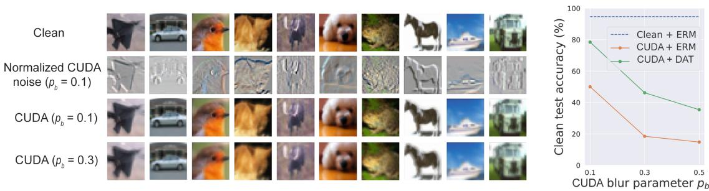
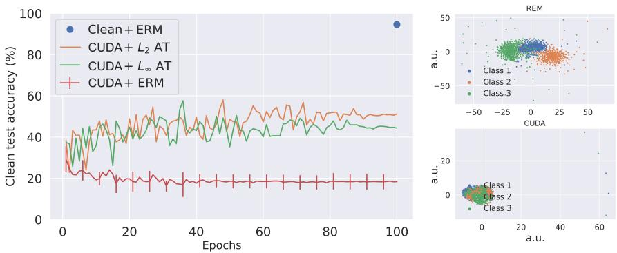
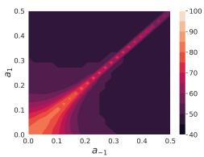
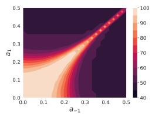
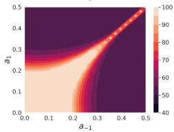
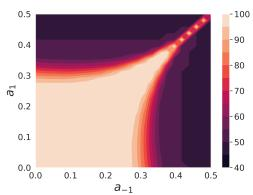
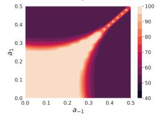
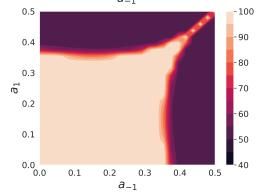

This CVPR paper is the Open Access version, provided by the Computer Vision Foundation. Except for this watermark, it is identical to the accepted version; the final published version of the proceedings is available on IEEE Xplore.

# CUDA: Convolution-based Unlearnable Datasets

Vinu Sankar Sadasivan University of Maryland vinu@umd.edu

Mahdi Soltanolkotabi University of Southern California soltanol@usc.edu

Soheil Feizi University of Maryland sfeizi@cs.umd.edu

## Abstract

Large-scale training of modern deep learning models heavily relies on publicly available data on the web. This potentially unauthorized usage ofonline data leads to concerns regarding data privacy. Recent works aim to make unlearnable datafor deep learning models by adding small, specially designed noises to tackle this issue. However, these methods are vulnerable to adversarial training (AT) and/or are computationally heavy. In this work, we propose a novel, model-free, Convolution-based Unlearnable DAtaset (CUDA) generation technique. CUDA is generated using controlled class-wise convolutions withfilters that are randomly generated via a private key. CUDA encourages the network to learn the relation between filters and labels rather than informative features for classifying the clean data. We develop some theoretical analysis demonstrating that CUDA can successfully poison Gaussian mixture data by reducing the clean data performance ofthe optimal Bayes classifier. We also empirically demonstrate the effectiveness ofCUDA with various datasets (CIFAR-10, CIFAR-100, ImageNet-100, and Tiny-ImageNet), and architectures (ResNet-18, VGG-16, Wide ResNet-34-10, DenseNet-121, DeIT, EfficientNetV2-S, and MobileNetV2). Our experiments show that CUDA is robust to various data augmentations and training approaches such as smoothing, AT with different budgets, transfer learning, and fine-tuning. For instance, training a ResNet-18 on ImageNet-100 CUDA achieves only 8.96%, 40.08%, and 20.58% clean test accuracies with empirical risk minimization (ERM), L∞ AT, and L AT, respectively. Here, ERM on the clean training data achieves a clean test accuracy of 80.66%. CUDA exhibits unlearnability effect with ERM even when only a fraction of the training dataset is perturbed. Furthermore, we also show that CUDA is robust to adaptive defenses designed specifically to break it.

## 1. Introduction

Modern deep learning training frameworks heavily depend on large-scale datasets for achieving high accuracy.

This encourages deep learning practitioners to scrape data from the web for data collection [8, 31, 38, 41]. Since a lot of the data is publicly available online, sometime this scrapping of data is unauthorized. For instance, a recent article [15] discloses that a private company trained a commercial face recognition system using over three billion facial images collected from the internet without any user consent. Although such massive data can significantly boost the performance of deep learning models, it raises serious concerns about data privacy and security.

To prevent the unauthorized usage of personal data, a series of recent papers [10,17,53] propose to poison data with additive noise. The idea is to make datasets unlearnable for deep learning models by ensuring that they learn the correspondence between noises and labels. Thereby, they do not learn much useful information about the clean data, significantly degrading their clean test accuracy. However, in recent works [11, 17, 47], these unlearnability methods are shown to be vulnerable to adversarial training (AT) frameworks [34]. Motivated by this problem, Fu et al. [11] developed Robust Error-Minimization (REM) noises to make unlearnable data that is protected from AT. While the authors show the effectiveness of REM in multiple scenarios, we demonstrate that these methods are still not robust against different data augmentations or training settings (see Section 3.2). Furthermore, current unlearnability frameworks [10, 11, 17, 53] are model-dependent and require expensive optimization steps on deep learning models to obtain the additive noises. They also need to train the deep learning models from scratch to obtain noises for each new data set.

In this paper, we propose a novel Convolution-based Unlearnable DAtaset (CUDA) generation technique. We address limitations of existing unlearnable data generation techniques in Section 3.2 and motivate our CUDA technique in Section 3.3. For generating CUDA, an attacker randomly generates different convolutional filters for each class in the dataset using a private key or seed value. These filters are used to perform controlled class-wise convolutions on the clean training dataset to obtain CUDA. As we

  
Figure 1. CIFAR-10 CUDA images from each of the 10 classes convolved using convolutional filters generated with blur parameter pb. As seen in the plot, a higher $p _ { b }$ value results in better unlearnability (lower clean test accuracy), but increased blurring. CIFAR-10 CUDA does not break with ERM for all the three $p _ { b }$ values. In Section 5.2, we propose Deconvolution-based Adversarial Training (DAT) that we specifically design to break CUDA. DAT adversarially learns class-wise filters to deconvolve CUDA images. However, CIFAR-10 CUDA with $p _ { b } \in \{ 0 . 3 , 0 . 5 \}$ does not break with DAT. Therefore, we select $p _ { b } = 0 . 3$ (lesser blurring) for CIFAR-10 CUDA as discussed in Section 5.1. More details on DAT in supplementary material.

$$
\tau _ { \mathcal { D } } ( P _ { \tilde { \mathcal { D } } } ) < \tau _ { \mathcal { D } } ( P _ { \mathcal { D } } ) .
$$

describe in Sections 3.3 and 5.2, CUDA generation performs controlled convolutions using a blur parameter $p _ { b }$ to ensure that the semantics of the dataset are preserved (see Figure 1). CUDA generation with a lower blurring parameter $p _ { b }$ adds less perceptible noises to clean samples. A network trained by a defender on CUDA is encouraged to learn the shortcut relation between class-wise convolutional filters and labels rather than useful features for classifying the clean data. Since the seed value for generating the filters are private, its not possible for the defender to obtain clean data from CUDA alone. Additionally, CUDA exhibits unlearnability effect with ERM even when only a fraction of the training dataset is perturbed (see Section 5). While the existing unlearnability works use additive noises, CUDA generation technique enjoys the advantage of introducing multiplicative noises in the Fourier domain due to the convolution theorem (since convolution of signals is the same as element-wise multiplication in the Fourier domain). This lets CUDA generation add higher amounts of noise in the image space, specifically along the edges in images, and makes it resilient to AT with small additive noise budgets. In Figure 2, with the help of t-SNE plots [49], we also find that the noises added by CUDA generation is not linearly separable while they are linearly separable for the existing works on unlearnability [52].

In Section 4, we theoretically show that CUDA generation can successfully poison Gaussian mixture data by degrading the clean data accuracy of the optimal Bayes classifier. We state our result informally below while the formal version is presented in Theorem 2.

Theorem 1 (Informal) Let D denote a Gaussian mixture data with two modes, $P _ { \mathcal { D } }$ denote the optimal Bayes classifier trained on ${ \mathcal { D } } ,$ , and $\tau _ { \mathcal { D } } ( P _ { \mathcal { D } } )$ denote the accuracy of the classifier $P _ { D }$ on D. Then, under some assumptions, for every clean data D, there is a CUDA $\tilde { \mathcal { D } }$ such that

Furthermore, our empirical experiments in Section 5 demonstrate the effectiveness of CUDA under various training scenarios such as ERM with various augmentations and regularizations, AT with different budgets, randomized smoothing [6, 22, 27], transfer learning, and fine-tuning. For instance, training a ResNet-18 on CIFAR-10 CUDA achieves only 18.48%, 44.4%, and 51.14% clean test accuracies with ERM, $L _ { \infty }$ AT, and $L _ { 2 }$ AT, respectively (see Figure 2). Here, ERM on the clean training data achieves a clean test accuracy of 94.66%. In addition, we also design adaptive defenses to investigate if CUDA breaks with random or adversarial defense mechanisms. We find that CUDA is robust to the adaptive defenses that we specifically design to break it.

## 2. Related Works

Our CUDA generation technique is intimately related with adversarial and poisoning attacks. We first discuss some of this literature and then explain their relation with CUDA generation.

Adversarial attacks. Adversarial examples are specially designed examples that can fool deep learning models at test time [4, 12, 23, 24, 45]. The adversary crafts these examples by adding error-maximizing noises to the clean data. Even slightly perturbed data can serve as adversarial examples. AT is a training framework proposed to make deep learning models robust to adversarial examples [19,25,34,51,57]. AT is a min-max optimization problem where the model is trained to minimize loss on adversarial examples that have the maximum loss.

Poisoning attacks. In data poisoning, an attacker aims to hurt the deep learning model’s performance by perturbing the training data [2, 20, 28, 32, 42, 50]. The backdoor attack is a special type of poisoning attack where a trigger pattern is injected into clean data at training time [5, 29, 33, 36]. The model trained on this data would misclassify an image with a trigger pattern at test time. Gu et al. [13] and Li et al. [30] use perceptible amounts of noises similar to CUDA for data poisoning. However, backdoor attacks do not affect the performance of the model on clean data [1, 5, 42].

  
Figure 2. In the left column, clean test accuracies of ResNet-18 on clean CIFAR-10 and CIFAR-10 CUDA are shown. The lower the test accuracy, the higher the effectiveness of unlearnability is. We show that CUDA is robust to various training settings such as ERM, $L _ { 2 } \thinspace \mathrm { A T } ,$ and $L _ { \infty } \mathrm { { A T } }$ . The error bars represent the standard deviation of test accuracy over 5 independent trials. CUDA is robust to the randomness in its data generation process. In the right column, t-SNEs of the noises generated by REM (top) and CUDA (bottom) for the first 3 classes of CIFAR-10 are plotted.

Recent literature utilize data poisoning to protect data from being used for model training without authorization. Yuan and Wu [53] use neural tangent kernels [18] to generate clean label attacks that can hurt the generalization of deep learning models. Huang et al. [17] show that errorminimizing noise addition can serve as a poisoning technique. Fowl et al. [10] show that error-maximizing noises as well can make strong poison attacks. However, all these poisoning techniques do not offer data protection with AT [47, 52]. Fu et al. [11] proposes a min-min-max optimization technique to generate poisoned data that offers better unlearnability effects with AT.

## 3. Convolution-based Ulearnable DAtaset (CUDA)

In this section, first we give some preliminaries about unlearnability. Then we discuss the limitations of the existing unlearnability methods. Finally, we propose our CUDA generation technique.

## 3.1. Preliminaries

Let $\{ ( \pmb { x } _ { i } , y _ { i } ) \} _ { i = 1 } ^ { n } \sim \mathcal { D } ^ { n }$ be the clean training dataset where D is the clean data distribution, $\pmb { x } _ { i } \in \mathcal { X } \subset \mathbb { R } ^ { d }$ are the samples, and $y _ { i } \in \mathcal { V }$ are the corresponding labels. Suppose a network is given as $f _ { \theta } : \mathcal { X }  \mathcal { Y }$ where $\theta ~ \in ~ \Theta$ is the network parameter and $\ell : \mathcal { V } \times \mathcal { V } $ R is the loss function. ERM trains a network using a minimization problem of the form: min $\begin{array} { r } { \frac { 1 } { n } \sum _ { i = 1 } ^ { n } \ell ( f _ { \theta } ( \pmb { x } _ { i } ) , y _ { i } ) } \end{array}$ . Standard $L _ { p ^ { - } }$ based AT (for $p \in \mathbb { R } ^ { + } )$ solves the following min-max problem: minθ $\begin{array} { r } { \frac { 1 } { n } \sum _ { i = 1 } ^ { n } \operatorname* { m a x } _ { \parallel \pmb { \delta } _ { i } \parallel _ { p } \leq \rho _ { a } } \ell ( f _ { \theta } ( \pmb { x } _ { i } + \pmb { \delta } _ { i } ) , y _ { i } ) } \end{array}$ where $\rho _ { a }$ is the adversarial perturbation radius.

We will use $\tau _ { \mathcal { D } } ( \theta )$ , with θ the clean model parameter, to denote the clean test accuracy of a model trained on the clean training dataset (i.e., clean model accuracy). In unlearnable dataset generation, an attacker uses an algorithm $\mathcal { A } : \mathcal { X } \ :  \mathcal { X }$ to generate an unlearnable dataset $\{ ( \tilde { \mathbf { x } } _ { i } = \mathcal { A } ( \mathbf { x } _ { i } ) , y _ { i } ) \} _ { i = 1 } ^ { n } \sim \tilde { \mathcal { D } } ^ { n }$ from the clean training data. Here, the attacker assumes access to the full clean training datatset. Moreover, the attacker cannot modify the unlearnable dataset once it is released publicly. A defender trains using the unlearnable dataset to obtain a network $f _ { \tilde { \theta } } .$ The objective of the attacker is to design an unlearnable dataset such that the defender’s model trained on the unlearnable data achieves a clean test accuracy (i.e., unlearnable model accuracy) worse than the clean model accuracy i.e. $\tau _ { \mathcal { D } } ( \tilde { \theta } ) \ll \tau _ { \mathcal { D } } ( \theta )$

## 3.2. Limitations of existing works

Fu et al. [11] show that the previous unlearnability methods including Error-Minimization (EM) [17], Targeted Adversarial Poisoning (TAP) [10], and Neural Tangent Generalization Attack (NTGA) [53] are vulnerable to AT. Hence, they propose a Robust Error-Minimization (REM) [11] method that exploits a min-min-max optimization procedure to generate unlearnable noises. REM first trains a noise generator $f _ { \theta } ^ { \prime }$ on data points $\{ ( x _ { i } , y _ { i } ) \} _ { i = 1 } ^ { n }$ 1 over a loss function ℓ as follows

$$
\begin{array} { r l } & { \underset { \theta } { \operatorname* { m i n } } ~ \frac { 1 } { n } \displaystyle \sum _ { i = 1 } ^ { n } \underset { \| \delta _ { i } ^ { u } \| \le \rho _ { u } } { \operatorname* { m i n } } \mathbb { E } _ { t \sim T } } \\ & { \underset { \| \delta _ { i } ^ { a } \| \le \rho _ { a } } { \operatorname* { m a x } } \ell ( f _ { \theta } ^ { \prime } ( t ( \pmb { x } _ { i } + \delta _ { i } ^ { u } ) + \delta _ { i } ^ { a } ) , y ) . } \end{array}\tag{1}
$$

Table 1. Time taken for generating unlearnable noises for various datasets using different unlearnability techniques.
<table><tr><td>Dataset</td><td>EM</td><td>TAP</td><td>NTGA</td><td>REM</td><td>CUDA</td></tr><tr><td>CIFAR-10</td><td>0.4 hr</td><td>0.5 hr</td><td>5.2 hrs</td><td>22.6 hrs</td><td>10.8 s</td></tr><tr><td>CIFAR-100</td><td>0.4 hr</td><td>0.5 hr</td><td>5.2 hrs</td><td>22.6 hrs</td><td>15.5 s</td></tr><tr><td>ImageNet-100</td><td>3.9 hrs</td><td>5.2 hrs</td><td>14.6 hrs</td><td>51.2 hrs</td><td>0.15 hr</td></tr></table>

Here, T is a distribution over a set of transformations $\{ t :$ $\mathcal { X }  \mathcal { X } \} , \rho _ { u }$ is the defensive perturbation radius, and $\rho _ { a }$ controls the protection level of REM against AT. After training the noise generator, an unlearnable example (x˜, y) is generated via

$$
\begin{array} { r l } & { \tilde { \pmb { x } } = \pmb { x } + \underset { \Vert \pmb { \delta } ^ { u } \Vert \leq \rho _ { u } } { \arg \operatorname* { m i n } } ~ \mathbb { E } _ { t \sim T } } \\ & { \qquad \underset { \Vert \pmb { \delta } ^ { a } \Vert \leq \rho _ { a } } { \arg \operatorname* { m a x } } ~ \ell ( f _ { \theta } ^ { \prime } ( t ( \pmb { x } + \pmb { \delta } ^ { u } ) + \pmb { \delta } ^ { a } ) , y ) } \end{array}\tag{2}
$$

First, note that REM is computationally expensive since it needs to generate unlearnability noises through solving optimization equation 2. Moreover, the existing techniques are model-dependent and they require gradient-based training with a neural network to generate unlearnable data. They also require neural network training from scratch for every dataset that is to be made unlearnable. Table 1 shows the amount of time required to generate various unlearnable datasets using $\mathrm { N V I D I A } ^ { \textregistered }$ Tesla V100 GPU and 10 CPU cores. CUDA generation is significantly faster than the existing methods since it uses a model-free approach (no training required). Furthermore, REM is sensitive to hyperparameters and norm-budgets of AT since they generate noises with fixed $L _ { \infty }$ norm budgets. For instance, a ResNet-18 trained on clean CIFAR-10 dataset achieves a clean test data accuracy of 94.66%. $L _ { \infty }$ AT with perturbation radius $\rho _ { a } = 4 / 2 5 5$ on REM CIFAR-10 data (generated using $\rho _ { u } = 8 / 2 5 5$ and $\rho _ { a } = 4 / 2 5 5 )$ achieves only a clean test accuracy of 48.16%. However, $L _ { \infty }$ AT with perturbation radius $\rho _ { a } = 8 / 2 5 5$ and $L _ { 2 }$ AT with perturbation radius $\rho _ { a } = 0 . 7 5$ can achieve a clean test accuracy of 78.71% and 79.65%, respectively, on the same REM data. We also find that ERM with a ResNet-18 on grayscaled REM CIFAR-10 images can achieve a high test accuracy of 70.76% on the grayscaled CIFAR-10 test data. This shows that REM relies upon the color space for poisoning clean data. Fu et al. [11] also show that REM noise generated using ResNet-18 is not transferable to DenseNet-121.

## 3.3. Our method: CUDA

The major limitations of the previous works are that they are vulnerable to AT, and computationally expensive. We think the major reason for the former limitation is the usage of small additive noises for unlearnability. AT is designed to train in the presence of such additive noises. Increasing the budget of the amount of additive noises for unlearnability might destroy the semantics of the images while perturbing them. The latter limitation arises from the fact that these methods are model-dependent and they require multilevel optimizations. Hence, we are motivated to design a compute-efficient unlearnability method that is robust to AT. CUDA technique can perform convolutions to add larger amounts of noises to clean images without destroying its semantics. This can help CUDA to be robust against AT. CUDA uses randomly generated convolution filters for blurring images from each class. This makes a model trained on CUDA to learn shortcut relations between filters and labels. We empirically support these claims in Section 5.2. Additionally, randomly generating the filters makes our technique model-free. Since the keys for generating the filters are private, it is not possible to reverse the blurring effect in CUDA without having access to the corresponding clean images. Hence, we assume that the data publisher deletes the clean images after perturbing them. Moreover, CUDA technique is a novel non-additive noise based poisoning attack that needs to be studied.

CUDA uses convolutional filters $s _ { i } ~ \in ~ \mathbb { R } ^ { k \times k }$ for each class $i \in [ 1 , K ]$ . A random parameter, out of the $k ^ { 2 }$ parameters, in each of the filters is set to have a value of 1. The rest of the filter parameters are randomly initialized from a uniform distribution $\boldsymbol { \mathcal { U } } ( 0 , p _ { b } )$ using a private seed where $p _ { b }$ is the blur parameter. Blur parameter controls the level of blurring that occurs when an image $\pmb { x } \in [ 0 , 1 ] ^ { d _ { 1 } \times d _ { 2 } \times d _ { 3 } }$ is convolved with a filter $s _ { i } .$ . Here, $d _ { 1 } , d _ { 2 } .$ , and $d _ { 3 }$ are the height, width, and number of channels of the image, respectively. For example, a CIFAR-10 image has a dimension of $3 2 \times 3 2 \times 3$ . The higher $p _ { b }$ is, the higher the blurring effect is. Let ${ \hat { \pmb x } } = { \pmb x } * s _ { i }$ where x belongs to class i. The CUDA data point for x is given by $\tilde { \pmb { x } } = \hat { \pmb { x } } / \mathbf { M A X } ( \hat { \pmb { x } } )$ . Rescaling is performed to make sure that the CUDA image pixels lie between 0 and 1. We find that the unlearnability effect gets stronger with larger $p _ { b }$ and k values (see supplementary material for details).

## 4. Theory for CUDA

In this section, we define a binary classification setup similar to [19, 35] to theoretically analyze CUDA. Let D be a clean dataset modelled by an isotropic Gaussian mixture model given by $\mathcal { N } ( \boldsymbol { y } \mu , I )$ , where $y \in \{ \pm 1 \}$ is the class label, $\pmb { \mu } \in \mathbb { R } ^ { d }$ , and $I \in \mathbb { R } ^ { d \times d }$ is the identity matrix. We defer the proofs for all the lemmas and theorem to the supplementary material. The Bayes optimal decision boundary for classifying this Gaussian mixture model is as follows.

Lemma 1 The Bayes optimal decision boundaryfor classifying D is given by $P ( \pmb { x } ) \equiv \pmb { \mu } ^ { \top } \pmb { x } = 0 .$ . The accuracy of the decision boundary P on the clean dataset $\mathcal { D } \ ( i . e . \ \tau _ { \mathcal { D } } ( P ) )$ is equal to $\phi ( \| \pmb { \mu } \| _ { 2 } )$ . Here, ϕ(.) represents the CDF of the

  
(a) $\| \mu \| _ { 2 } = 1 . 0$

  
(b) $\| \pmb { \mu } \| _ { 2 } = 2 . 5$

  
(c) $\| \pmb { \mu } \| _ { 2 } = 5 . 0$  
Figure 3. We plot the contour plots for clean test accuracy of the CUDA Bayes classifier $\tilde { P }$ (given as $\tau _ { \mathcal { D } } ( \tilde { P } ) )$ for varying $a _ { y }$ parameters where $y \in \{ \pm 1 \}$ in Figures 3(a–c). Gaussian mixture model $\mathcal { N } ( \boldsymbol { y } \mu , I )$ denotes the clean data. In the top row, we use Lemmas $1 \ \& \ 4 \ ^ { . }$ to empirically generate the plots. In the bottom row, we plot the theoretical upper bound of $\tau _ {  { \mathcal { D } } } ( \tilde { P } )$ we obtain using Theorem 2.

## standard normal distribution.

Now, to obtain $\tilde { \mathcal { D } } \left( \mathrm { i . e . , C U D A } \right)$ , we perform class-wise 1D convolutions. Here, we consider a class of 1D convolutional filters with kernel size 3 of the form $f _ { a } = [ a , 1 , a ]$ where $a ~ \in ~ [ 0 , 0 . 5 ]$ The convolution of signal x $\in \mathbb { R } ^ { d }$ with filter $f _ { a }$ using stride 1 (denoted by $\textbf { \em x } * \textbf { \em f } _ { a } ) .$ , can be treated as a matrix operation Ax. Here, $A \in \mathbb { R } ^ { d \times d }$ is a tri-diagonal Toeplitz matrix denoted by $T ( d ; a , 1 , a )$ . For CUDA generation, we use class-wise convolution matrices $A _ { y } ~ = ~ T ( d ; a _ { y } , 1 , a _ { y } )$ to perturb a clean data point $( \pmb { x } , y ) \sim \mathcal { D }$ to an unlearnable data point $( A _ { y } \mathbf { x } , y )$ , where $a _ { y } ~ \in ~ [ 0 , 0 . 5 ]$ for $y \in \{ \pm 1 \}$ . Note that in CUDA, the labels remain the same. Next we show that such a perturbed dataset (i.e. CUDA) can be represented as a Gaussian mixture model.

Lemma 2 A CUDA generated from clean data distribution D and the $A _ { y } \cdots$ defined above can be modelled as a Gaussian mixture model with the distribution given by $\tilde { \mathcal { D } } = \mathcal { N } ( y A _ { y } \pmb { \mu } , A _ { y } ^ { 2 } )$

To characterize the decision boundary for CUDA, we need to use some properties of Toeplitz matrices from Noschese et al. [37] given in the following Lemma 3.

Lemma 3 Any tri-diagonal Toeplitz matrix $\begin{array} { r l } { A } & { { } = } \end{array}$ $T ( d ; a , 1 , a ) \ \in \ \mathbb { R } ^ { d \times d }$ with $a ~ \in ~ [ 0 , 0 . 5 ]$ can be diagonalized as $A = Q D Q$ where $\begin{array} { r } { Q _ { i , j } \ = \ \left( \frac { 2 } { d + 1 } \right) ^ { 1 / 2 } \sin \left( \frac { i j \pi } { d + 1 } \right) } \end{array}$ and D is a diagonal matrix with $\begin{array} { r } { D _ { i , i } = 1 + 2 a \cos \left( \frac { i \pi } { d + 1 } \right) } \end{array}$ $f o r 1 \leq i , j \leq d .$

Next we use Lemma 3 to show that the Bayes optimal decision boundary for classifying $\tilde { \mathcal { D } }$ is a quadratic plane.

Lemma 4 Let $\begin{array} { l l l } { { A _ { - 1 } } } & { { = } } & { { T ( d ; a _ { - 1 } , 1 , a _ { - 1 } ) } } \end{array}$ and $\begin{array} { r l } { A _ { 1 } } & { { } = } \end{array}$ $T ( d ; a _ { 1 } , 1 , a _ { 1 } )$ . The Bayes optimal decision boundary $f o r$ classifying $\tilde { \mathcal { D } }$ is given by $\tilde { P } ( \pmb { x } ) \equiv \pmb { x } ^ { \top } A \pmb { x } + \pmb { b } ^ { \top } \pmb { x } + c = 0 ,$ where $A \ = \ A _ { - 1 } ^ { - 2 } - A _ { 1 } ^ { - 2 } , \ \pm \ = \ 2 ( A _ { - 1 } ^ { - 1 } + A _ { 1 } ^ { - 1 } ) \mu ,$ and $\begin{array} { r } { c = 2 \sum _ { i = 1 } ^ { d } [ \ln ( 1 + 2 a _ { - 1 } \cos ( \frac { i \pi } { d + 1 } ) ) - \ln ( 1 + 2 a _ { 1 } \cos ( \frac { i \pi } { d + 1 } ) ) ] } \end{array}$ Now we state a lemma regarding the tail of Gaussian quadratic forms which plays a crucial role in our main result.

Lemma 5 Let $\| \cdot \|$ denote the operator norm, $\| \cdot \| _ { 2 }$ denote the vector 2-norm, $\mathbf { \boldsymbol { z } } \sim \mathcal { N } ( \mathbf { 0 } , I )$ , and $Z = z ^ { \top } A z + z ^ { \top } b + c$ where $A = Q \Lambda Q ^ { \top }$ . Using Chernoff bound, for any $t \geq 0$ and $\gamma \in \mathbb R$

$$
\begin{array} { r l r } { \mathbb { P } \{ Z - \mathbb { E } Z \geq \gamma \} } & { \leq } & \\ & { } & { \underbracket { \exp \left\{ \frac { - t } { 4 \| b \| _ { 2 } ^ { 2 } \| \Lambda \| } - t ( \gamma + \mathrm { T r } ( \Lambda ) + \| b \| _ { 2 } ) \right\} } _ { | I - 2 t \Lambda | ^ { \frac { 1 } { 2 } } } . } \end{array}
$$

Lemma 5 allows us to provide an upper bound for the accuracy of the unlearnable decision boundary $\tilde { P }$ on the clean dataset D, given as $\tau _ {  { \mathcal { D } } } ( \tilde { P } )$ , in Theorem 2 below.

Theorem 2 (Main result) Let ${ \cal A } = Q \Lambda Q = { \cal A } _ { - 1 } ^ { - 2 } - { \cal A } _ { 1 } ^ { - 2 } .$ For any non-negative constants $t _ { 1 }$ and $t _ { 2 } ,$ the accuracy of the unlearnable decision boundary $\tilde { P }$ on the clean dataset D can be upper-bounded as

$$
\begin{array} { r l } & { \tau _ { \mathcal { D } } ( \tilde { P } ) \leq \frac { \exp \big [ t _ { 1 } \big ( b ^ { \top } \mu + \mu ^ { \top } A \mu + c - \frac { 1 } { 4 \| 2 A \mu + b \| _ { 2 } \| \Lambda \| } \big ) \big ] } { 2 | I - 2 t _ { 1 } \Lambda | ^ { \frac { 1 } { 2 } } } } \\ & { \qquad + \frac { \exp \big [ t _ { 2 } \big ( b ^ { \top } \mu - \mu ^ { \top } A \mu - c - \frac { 1 } { 4 \| 2 A \mu - b \| _ { 2 } \| \Lambda \| } \big ) \big ] } { 2 | I - 2 t _ { 2 } \Lambda | ^ { \frac { 1 } { 2 } } } } \\ & { \qquad : = p _ { 1 } + p _ { 2 } . } \end{array}
$$

Furthermore, $i f { \pmb \mu } ^ { \top } A { \pmb \mu } + { \pmb b } ^ { \top } { \pmb \mu } + c + \mathrm { T r } ( A ) + \| 2 A { \pmb \mu } + { \pmb b } \| < 0 ,$ we have $\begin{array} { r } { \tau _ { \mathcal { D } } ( \tilde { P } ) \leq \frac { 1 } { 2 } ( p _ { 1 } + 1 ) < 1 . \ A l s o , i f - \mu ^ { \top } A \mu + b ^ { \top } \mu - } \end{array}$ $c - \operatorname { T r } ( A ) + \| 2 A \mu - b \| < 0 ,$ , we have $\begin{array} { r } { \tau _ { \mathcal { D } } ( \tilde { P } ) \leq \frac { 1 } { 2 } ( 1 + p _ { 2 } ) < } \end{array}$ 1. Moreover, for any $\pmb { \mu } \neq \mathbf { 0 }$ and $a _ { - 1 } \in [ 0 , 0 . 5 ]$ , ∃a1 such that $\tau _ { \mathcal { D } } ( \tilde { P } ) < \tau _ { \mathcal { D } } ( P )$

Poisoning is effective only if the accuracy of the unlearnable model $\tilde { P }$ is less than that of the clean model $P$ on the clean dataset $\mathcal { D } ,$ that is, $\tau _ { \mathcal { D } } ( { \tilde { P } } ) < \tau _ { \mathcal { D } } ( P )$ . To satisfy this condition, we need to carefully select $\boldsymbol { a } _ { y } \mathbf { \hat { s } } ,$ . In Theorem 2, we formally state this condition1. Theorem 2 shows that CUDA can effectively poison when there are two distinct modes in the clean Gaussian mixture data model. We validate our theoretical claim through empirical analysis as well (see Figure 3). Details for the analysis is given in supplementary material. We find that our upper bound for the clean test accuracy of CUDA classifiers are consistent with our empirical analysis. In our experiments, we also find that the unlearnability effect is stronger with a larger blur parameter. This effect is evident from Figure 3 where we find that it is likely to get a lower $\tau _ { \mathcal { D } } ( { \tilde { P } } )$ with higher $a _ { y }$ values. These results are consistent with our experimental results in Section 5 with CIFAR-10, CIFAR-100, and ImageNet-100 datasets.

## 5. Experiments

In this section, we first discuss our experimental setup. More details on the setup is deferred to supplementary material. We then show the robustness of CUDA generation with various datasets and architectures. We also run various experiments to analyze the effectiveness of CUDA under different training techniques (ERM, AT with varying budgets, randomized smoothing, transfer learning, and finetuning) and augmentation techniques (mixup [56], grayscaling, random blurring, cutout [9], cutmix [54], autoaugment [7], and orthogonal regularization [3]). Finally, we also design adaptive defenses to test the robustness of CUDA. One might think that CUDA filters can be obtained by adversarially training them with the data. We show that CUDA is robust to such adaptive defenses that we design.

## 5.1. Experimental setup

Datasets. We use three image classification datasets – CIFAR-10, CIFAR-100, [21] and ImageNet-100 (a subset of ImageNet made of the first 100 classes) [39]. We use the data augmentation techniques such as random flipping, cropping, and resizing [43].

Architectures. We use ResNet-18 [14], VGG-16 [44], Wide ResNet-34-10 [55], and DenseNet-121 [16]. We train the networks with hyperparameters used in Fu et al. [11].

Table 2. Test accuracy (%) of ResNet-18 trained on various unlearnable datasets. We use $L _ { \infty }$ AT with budget $\rho _ { a } = 4 / 2 5 5$
<table><tr><td rowspan="2">Dataset</td><td rowspan="2">Training method</td><td rowspan="2">Clean</td><td colspan="5">Unlearnability method</td></tr><tr><td>EM</td><td>TAP</td><td>NTGA REM</td><td></td><td>CUDA</td></tr><tr><td rowspan="2">CIFAR-10</td><td>ERM</td><td>94.66</td><td>13.20</td><td>22.51</td><td>16.27</td><td>27.09</td><td>18.48</td></tr><tr><td>AT</td><td>89.51</td><td>88.62</td><td>88.02</td><td>88.96</td><td>48.16</td><td>44.40</td></tr><tr><td rowspan="2">CIFAR-100</td><td>ERM</td><td>76.27</td><td>1.60</td><td>13.75</td><td>3.22</td><td>10.14</td><td>12.69</td></tr><tr><td>AT</td><td>64.50</td><td>63.43</td><td>62.39</td><td>62.44</td><td>27.10</td><td>34.34</td></tr><tr><td rowspan="2">ImageNet-100</td><td>ERM</td><td>80.66</td><td>1.26</td><td>9.10</td><td>8.42</td><td>13.74</td><td>8.96</td></tr><tr><td>AT</td><td>66.62</td><td>63.40</td><td>63.56</td><td>63.06</td><td>41.66</td><td>38.68</td></tr></table>

Table 3. Test accuracy (%) of network architectures trained on various CIFAR-10 unlearnable datasets with $L _ { \infty } \mathrm { A T } ( \rho _ { a } = 4 / 2 5 5 )$
<table><tr><td rowspan="2">Model</td><td rowspan="2">Clean</td><td colspan="5">Unlearnability method</td></tr><tr><td>EM</td><td>TAP</td><td>NTGA REM</td><td></td><td>CUDA</td></tr><tr><td>ResNet-18</td><td>89.51</td><td>88.62</td><td>88.02</td><td>88.96</td><td>48.16</td><td>44.40</td></tr><tr><td>VGG-16</td><td>87.51</td><td>86.48</td><td>86.27</td><td>86.65</td><td>65.23</td><td>42.98</td></tr><tr><td>Wide ResNet-34-10</td><td>91.21</td><td>90.05</td><td>90.23</td><td>89.95</td><td>48.39</td><td>53.02</td></tr><tr><td>DenseNet-121</td><td>83.27</td><td>82.44</td><td>81.72</td><td>80.73</td><td>81.48</td><td>45.95</td></tr></table>

Previous works mainly employ ResNet-18 for most of their evaluations. Additional experiments on Tiny-ImageNet [26], DeIT [48], EfficientNetV2-S [46], and MobileNetV2 [40] are provided in the supplementary material.

CUDA generation. We use filters of size $k = 3$ and blur parameter $p _ { b } ~ = ~ 0 . 3$ for both CIFAR-10 and CIFAR-100 datsets. ImageNet-100 is a higher dimensional 224×224×3 image dataset when compared to the $3 2 \times 3 2 \times 3$ dimensional CIFAR datasets. Hence, we use larger filters of size $k = 9$ with $p _ { b } = 0 . 0 6$ for ImageNet-100. These hyperparameters are chosen such that the CUDA images are not perceptibly highly perturbed and give good unlearnability effect (see plot in Figure 1). In supplementary matrial, we show the results of training on CUDA with different hyperparameters for data generation.

Baselines. We compare CUDA generation technique with four state-of-the-art unlearnability methods – REM [11], EM [17], TAP [10], and NTGA [53]. We adopt the results reported in [11] since we use the same hyperparameters for training. For REM, we select hyperparameters $\rho _ { u } = 8 / 2 5 5$ and $\rho _ { a } = 4 / 2 5 5$ , the highest radii values in [11]. For comparing unlearnable methods, we look at the clean test accuracy. The lower the test accuracy, the better the unlearnability method is. As mentioned in the supplementary material, we use publicly released official codebases for reproducing the baselines using their default hyperparameters.

## 5.2. Effectiveness of CUDA

Why does CUDA work? In order to measure how much CUDA technique’s blurring affects the dataset’s quality, we compare class-wise blurring (CUDA technique) against universal blurring where a single convolutional filter is used for blurring all the images. We keep the filter generation parameters fixed $( p _ { b } = 0 . 3$ and k = 3) for both CUDA classwise blurring and universal blurring. ResNet-18 trained with clean CIFAR-10, universally blurred CIFAR-10, and CIFAR-10 CUDA achieve clean test accuracies of 94.66%, 90.47%, and 18.48%, respectively. This suggests that our controlled blurring does not obscure the semantics of the dataset. Hence, the significant drop in the clean test accuracy introduced by CUDA is most likely due to the usage of class-wise filters. This suggests that a model trained on CUDA learns the relation between the class-wise convolution filters and their corresponding labels. Therefore, during test time when this convolution effect is absent, the CUDA trained model fails to make correct classifications. Furthermore, the model trained on CUDA achieves an accuracy of 99.91% on the CIFAR-10 CUDA testset. This strongly supports our claim that the CUDA model learns to classify images based on the convolutional filters used to blur them. In addition, if we permute the class-wise filters for blurring the test set (i.e., blurring class 1 images with class 2 filters, class 2 images with class 3 filters, and so on), we get a very low accuracy of 2.53% on this test set. Further details are provided in the supplementary material. Finally, we note that real-world datasets might also contain blurred images due to various factors such as motion blurring, weather conditions, issues with the camera, etc. Hence, detecting if a blurred image is poisoned might not always be possible. However, one might argue that it is possible to detect if an entire dataset is blurred. Interestingly, later in this section we show that CUDA technique exhibits unlearnability effect even when only a fraction of the training dataset is poisoned.

Table 4. Test accuracy (%) of ResNet-18 with CUDA under various training settings.
<table><tr><td>Dataset</td><td>Clean</td><td>Training method</td><td>CUDA (ours)</td></tr><tr><td rowspan="5">CIFAR-10</td><td rowspan="5">94.66</td><td>ERM</td><td>18.48</td></tr><tr><td> $\mathrm { A T } \ L _ { \infty } \ ( \rho _ { a } = 4 / 2 5 5 )$ </td><td>44.40</td></tr><tr><td> $\mathrm { A T } \ L _ { \infty } \ ( \rho _ { a } = 8 / 2 5 5 )$ </td><td>32.85</td></tr><tr><td>AT  $L _ { \infty } \left( \rho _ { a } = 1 \mathrm { \bar { 6 } } / 2 5 5 \right)$ </td><td>19.32</td></tr><tr><td> $\mathrm { A T } \ L _ { 2 } \ ( \rho _ { a } = 0 . 2 5 )$   $\mathrm { A T } \ L _ { 2 } \ \stackrel { \cdot \cdot } { ( \rho _ { a } } = 0 . 5 0 \stackrel { \cdot } { ) }$ </td><td>39.05 51.19</td></tr><tr><td rowspan="5">CIFAR-100</td><td rowspan="5">76.27</td><td> $\mathrm { A T } \ L _ { 2 } \ ( \rho _ { a } = 0 . 7 5 )$ </td><td>51.14</td></tr><tr><td>ERM</td><td>12.69</td></tr><tr><td> $\mathrm { A T } \ L _ { \infty } \ ( \rho _ { a } = 4 / 2 5 5 )$ </td><td>34.34</td></tr><tr><td> $\mathrm { A T } \ L _ { \infty } \ ( \rho _ { a } = 8 / 2 5 5 )$ </td><td>30.00</td></tr><tr><td> $\mathrm { A T } \ L _ { 2 } \ ( \rho _ { a } = 0 . 7 5 )$ </td><td>36.90</td></tr><tr><td rowspan="4">ImageNet-100</td><td rowspan="4">80.66</td><td></td><td></td></tr><tr><td>ERM</td><td>8.96</td></tr><tr><td> $\mathrm { A T } \ L _ { \infty } \ ( \rho _ { a } = 4 / 2 5 5 )$ </td><td>38.68</td></tr><tr><td>AT  $L _ { \infty } \left( \rho _ { a } = 8 / 2 5 5 \right)$  AT  $L _ { 2 } ~ ( \rho _ { a } = 0 . 7 5 )$ </td><td>40.08 20.58</td></tr></table>

Different datasets. We first compare the effectiveness of CUDA with different datasets using ERM and $L _ { \infty }$ AT with $\rho _ { a } = 4 / 2 5 5$ . We use ResNet-18 for the experiments. The results are shown in Table 2. These results show that EM, TAP, and NTGA are not robust to AT. However, both CUDA and REM are successful. Here, our method CUDA outperforms REM with CIFAR-10 and ImageNet-100 datasets. Smartly designed additive noise in AT helps in achieving better generalization than ERM on the unlearnable datasets. This experiment thus demonstrates that ERM and AT are not good choices for training with CUDA and REM dataset.

Different models. Next we compare the effectiveness of CUDA using various deep learning architectures with $L _ { \infty } \mathrm { A T } ( \rho _ { a } = 4 / 2 5 5 )$ . We use CIFAR-10 for the experiments. The results are shown in Table 3. As we see in the table, CUDA is effective with all the five network architectures. However, REM is not seen to be transferrable with DenseNet-121.

Robustness to different training settings. In Section 3.2, we show that REM is sensitive to the training settings. REM generated using $L _ { \infty }$ radii budgets of $\rho _ { u } ~ = ~ 8 / 2 5 5$ and $\rho _ { a } = 4 / 2 5 5$ for CIFAR-10 breaks with $L _ { \infty } \mathrm { A T } ( \rho _ { a } =$ $8 / 2 5 5 )$ and $L _ { 2 }$ AT $( \rho _ { a } ~ = ~ 0 . 7 5 )$ to get test accuracy of 78.71% and 79.65%, respectively. Hence, we run experiments to check the robustness of CUDA with various AT norm budgets. The results are shown in Table 4. As we see in the table, CUDA is robust to ERM, $L _ { \infty } ,$ , and $L _ { 2 }$ AT settings with varying training budgets. Impressively, the highest test accuracy achieved with training on CIFAR-10 CUDA, CIFAR-100 CUDA, and ImageNet-100 CUDA are as low as 51.19%, 36.90%, and 40.08%, respectively. We also find that using a pre-trained ResNet-18 with CIFAR-10 CUDA only achieves clean test accuracy of 42.42% and 48.22% with fine-tuning the full network and a newly trained final layer, respectively (details are deferred to the supplementary material).

Different protection percentages. In Section 3.1, we assume that the attacker has access to the full clean training data. However, in real life settings, this might not be always possible. Hence, we train ResNet-18 on a mix of CIFAR-10 CUDA and clean CIFAR-10 training datasets to evaluate the effectiveness of poisoning with varying data protection percentages. Protection percentage denotes the percentage of the training data that is poisoned.

We show the results in Table 5. In the table, the “Mixed” column denotes the clean test accuracy of a model trained using a mix of both clean and poisoned data. The “Clean” column denotes the clean test accuracy of a model trained only using the clean subset of the training data. In the last row of Table 5, we provide the results for CUDA trained using ERM with varying data protection percentages. The remainder of the rows provide the results for the $L _ { \infty }$ AT $( \rho _ { a } = 4 / 2 5 5 )$ scenario. For example, CUDA trained with ERM using an 80% clean training data partition achieves a test accuracy of 93.75%. Adding the 20% CUDA data partition to the training dataset drops the test accuracy of the model to 93.28%. Results from the last row of Table 5 show that CUDA with varying data protection percentages is effective with the ERM setting. However, with the AT scenario, the unlearnability techniques are not as successful as with ERM with varying data protection percentages. Nevertheless, it is interesting to note that CUDA technique performs better than all the other unlearnability techniques with AT.

Table 5. Test accuracy (%) of ResNet-18 on CIFAR-10 with different data protecion percentages. The last row shows the results for CUDA with ERM setting. The rest of the rows show results for unlearnability methods trained in the $L _ { \infty }$ AT $( \rho _ { a } = 4 / 2 5 5 )$ setting.
<table><tr><td rowspan="2">Unlearnability method</td><td colspan="9">Data Protection Percentage</td></tr><tr><td>0%</td><td>20% Mixed</td><td>Clean</td><td>40% Mixed Clean</td><td>Mixed</td><td>60% Clean</td><td>80% Mixed</td><td>Clean</td><td>100%</td></tr><tr><td>EM TAP</td><td>89.51</td><td>89.60 89.01</td><td></td><td>89.40 88.66</td><td>89.49 88.40</td><td></td><td>89.10 88.04</td><td>79.41</td><td>88.62 88.02</td></tr><tr><td>NTGA</td><td></td><td>89.56</td><td>88.17</td><td>89.35</td><td>86.76</td><td>85.07 89.22</td><td>89.17</td><td></td><td>88.96</td></tr><tr><td>REM</td><td></td><td>89.60</td><td></td><td>89.34</td><td></td><td>89.61</td><td>88.09</td><td></td><td>48.16</td></tr><tr><td>CUDA (ours)</td><td></td><td>88.54</td><td></td><td>87.24</td><td></td><td>86.03</td><td>84.34</td><td></td><td>44.40</td></tr><tr><td>CUDA + ERM</td><td>94.66</td><td>93.28</td><td>93.75</td><td>91.34</td><td>92.56</td><td>89.91</td><td>89.77 85.61</td><td>84.30</td><td>18.48</td></tr></table>

Robustness to smoothing and data augmentations. Cohen et al. [6] proposes randomized smoothing which is a provable adversarial defense in $L _ { 2 }$ norm. Since CUDA does not use additive noise, CUDA is robust to randomized smoothing. A smoothed ResNet-18 (with a noise level of 0.5) with CIFAR-10 CUDA achieves only a clean test accuracy of 43.85%. In Section 3.2, we see that REM breaks with grayscaling. While ResNet-18 training using grayscaled REM achieves 70.76% test accuracy, grayscaled CUDA only achieves 20.12% test accuracy on the clean grayscaled CIFAR-10 test data. This shows that CUDA technique exhibits the desirable property of not relying upon the color space for its attack. CIFAR-10 CUDA training achieves only 25.53%, 25.80%, 26.93%, 34.09%, and 50.72% clean test accuracy with mixup, cutout, cutmix, autoaugment, and orthogonal regularization, respectively (see supplementary material for more details).

Adaptive defenses for CUDA. Here, we first investigate the effect of training CIFAR-10 CUDA with random blurring augmentations using ResNet-18. Each batch of the CUDA training data is convolved with random 3 × 3 filters of varying blur parameters $p _ { b } ^ { \prime } .$ . With $p _ { b } ^ { \prime }$ values of 0.1 and 0.3, CUDA training achieves lower test accuracy 9.2% and 13.37%, respectively. This shows that the noise added by CUDA technique is robust to random convolution augmentations.

One may think that CUDA technique can be broken by learning the private filters from the data. We test this idea by training deconvolution filters to find if we can reverse the blurring effect in CUDA with adversarially trained filters. We use a novel Deconvolution-based Adversarial Training (DAT) technique that is similar to AT (check supplementary material for details). While the adversarial step in AT learns sample-wise error-maximizing additive noises, the adversarial step in DAT learns class-wise error-maximizing deconvolution filters. We train DAT with filters of varying sizes (3, 5, and 7) on CIFAR-10 CUDA using ResNet-18. The filter parameters are constrained within a finite range to make sure that the images do not get distorted with the adversarial step similar to projection in projected gradient descent. We find that CUDA is robust to DAT. DAT using filters of size 3, 5, and 7 with CUDA achieves only test accuracy of 39.05%, 46.21%, and 38.48%, respectively. DAT is not successful against CUDA since we can not invert convolutions without the knowledge of the private filters or clean images corresponding to CUDA.

Limitations and future directions. The unlearnability effect of CUDA can be defended if some fraction of the clean data and its corresponding CUDA images are leaked. The defender must also be able to detect if all samples in the dataset are poisoned. However, our work assumes a setup where the filters remain private. For example, a data publisher could simply publish their CUDA images and delete the clean images permanently to prevent this scenario. As discussed in this section, CUDA as well as other prior works do not perform well with different protection percentages with AT. Improving this can be an interesting research direction. We believe that extending CUDA technique to other domains such as tabular and text data is also an interesting future direction. It would also be interesting to see theoretical analysis of CUDA considering more complex setups.

## Acknowledgement

This project was supported in part by Meta grant 23010098, NSF CAREER AWARD 1942230, HR001119S0026 (GARD), ONR YIP award N00014- 22-1-2271, Army Grant No. W911NF2120076, a capital one grant, NIST 60NANB20D134 and the NSF award CCF2212458.

## References

[1] Mauro Barni, Kassem Kallas, and Benedetta Tondi. A new backdoor attack in cnns by training set corruption without label poisoning. In 2019 IEEE International Conference on Image Processing (ICIP), pages 101–105. IEEE, 2019. 3

[2] Battista Biggio, Blaine Nelson, and Pavel Laskov. Poisoning attacks against support vector machines. arXiv preprint arXiv:1206.6389, 2012. 2

[3] Andrew Brock, Theodore Lim, James M Ritchie, and Nick Weston. Neural photo editing with introspective adversarial networks. arXiv preprint arXiv:1609.07093, 2016. 6

[4] Nicholas Carlini and David Wagner. Towards evaluating the robustness of neural networks. In 2017 ieee symposium on security and privacy (sp), pages 39–57. IEEE, 2017. 2

[5] Xinyun Chen, Chang Liu, Bo Li, Kimberly Lu, and Dawn Song. Targeted backdoor attacks on deep learning systems using data poisoning. arXiv preprint arXiv:1712.05526, 2017. 3

[6] Jeremy Cohen, Elan Rosenfeld, and Zico Kolter. Certified adversarial robustness via randomized smoothing. In Kamalika Chaudhuri and Ruslan Salakhutdinov, editors, Proceedings of the 36th International Conference on Machine Learning, volume 97 of Proceedings of Machine Learning Research, pages 1310–1320. PMLR, 09–15 Jun 2019. 2, 8

[7] Ekin D Cubuk, Barret Zoph, Dandelion Mane, Vijay Vasudevan, and Quoc V Le. Autoaugment: Learning augmentation policies from data. arXiv preprint arXiv:1805.09501, 2018. 6

[8] Karan Desai and Justin Johnson. Virtex: Learning visual representations from textual annotations. In Proceedings of the IEEE/CVF Conference on Computer Vision and Pattern Recognition, pages 11162–11173, 2021. 1

[9] Terrance DeVries and Graham W Taylor. Improved regularization of convolutional neural networks with cutout. arXiv preprint arXiv:1708.04552, 2017. 6

[10] Liam Fowl, Micah Goldblum, Ping-yeh Chiang, Jonas Geiping, Wojtek Czaja, and Tom Goldstein. Adversarial examples make strong poisons. arXiv preprint arXiv:2106.10807, 2021. 1, 3, 6

[11] Shaopeng Fu, Fengxiang He, Yang Liu, Li Shen, and Dacheng Tao. Robust unlearnable examples: Protecting data privacy against adversarial learning. In International Conference on Learning Representations, 2021. 1, 3, 4, 6

[12] Ian J Goodfellow, Jonathon Shlens, and Christian Szegedy. Explaining and harnessing adversarial examples. arXiv preprint arXiv:1412.6572, 2014. 2

[13] Tianyu Gu, Brendan Dolan-Gavitt, and Siddharth Garg. Badnets: Identifying vulnerabilities in the machine learning model supply chain. arXiv preprint arXiv:1708.06733, 2017. 3

[14] Kaiming He, Xiangyu Zhang, Shaoqing Ren, and Jian Sun. Deep residual learning for image recognition. CoRR, abs/1512.03385, 2015. 6

[15] Kashmir Hill. The secretive company that might end privacy as we know it. In Ethics of Data and Analytics, pages 170– 177. Auerbach Publications, 2020. 1

[16] Gao Huang, Zhuang Liu, and Kilian Q. Weinberger. Densely connected convolutional networks. CoRR, abs/1608.06993, 2016. 6

[17] Hanxun Huang, Xingjun Ma, Sarah Monazam Erfani, James Bailey, and Yisen Wang. Unlearnable examples: Making personal data unexploitable. arXiv preprint arXiv:2101.04898, 2021. 1, 3, 6

[18] Arthur Jacot, Franck Gabriel, and Clement Hongler. Neu-´ ral tangent kernel: Convergence and generalization in neural networks. Advances in neural information processing systems, 31, 2018. 3

[19] Adel Javanmard and Mahdi Soltanolkotabi. Precise statistical analysis of classification accuracies for adversarial training. ArXiv, abs/2010.11213, 2020. 2, 4

[20] Pang Wei Koh and Percy Liang. Understanding black-box predictions via influence functions. In International conference on machine learning, pages 1885–1894. PMLR, 2017. 2

[21] Alex Krizhevsky. Learning multiple layers of features from tiny images. Technical report, 2009. 6

[22] Aounon Kumar, Alexander Levine, Soheil Feizi, and Tom Goldstein. Certifying confidence via randomized smoothing. CoRR, abs/2009.08061, 2020. 2

[23] Alexey Kurakin, Ian J Goodfellow, and Samy Bengio. Adversarial examples in the physical world. In Artificial intelligence safety and security, pages 99–112. Chapman and Hall/CRC, 2018. 2

[24] Cassidy Laidlaw and Soheil Feizi. Functional adversarial attacks. In H. Wallach, H. Larochelle, A. Beygelzimer, F. d'Alche-Buc, E. Fox, and R. Garnett, editors,´ Advances in Neural Information Processing Systems, volume 32. Curran Associates, Inc., 2019. 2

[25] Cassidy Laidlaw, Sahil Singla, and Soheil Feizi. Perceptual adversarial robustness: Defense against unseen threat models. CoRR, abs/2006.12655, 2020. 2

[26] Ya Le and Xuan Yang. Tiny imagenet visual recognition challenge. CS 231N, 7(7):3, 2015. 6

[27] Alexander Levine and Soheil Feizi. Deep partition aggregation: Provable defense against general poisoning attacks. CoRR, abs/2006.14768, 2020. 2

[28] Alexander Levine and Soheil Feizi. Deep partition aggregation: Provable defense against general poisoning attacks. CoRR, abs/2006.14768, 2020. 2

[29] Yige Li, Xixiang Lyu, Nodens Koren, Lingjuan Lyu, Bo Li, and Xingjun Ma. Neural attention distillation: Erasing backdoor triggers from deep neural networks. arXiv preprint arXiv:2101.05930, 2021. 3

[30] Yiming Li, Tongqing Zhai, Baoyuan Wu, Yong Jiang, Zhifeng Li, and Shutao Xia. Rethinking the trigger of backdoor attack. arXiv preprint arXiv:2004.04692, 2020. 3

[31] Tsung-Yi Lin, Michael Maire, Serge Belongie, James Hays, Pietro Perona, Deva Ramanan, Piotr Dollar, and C Lawrence´ Zitnick. Microsoft coco: Common objects in context. In European conference on computer vision, pages 740–755. Springer, 2014. 1

[32] Sijia Liu, Songtao Lu, Xiangyi Chen, Yao Feng, Kaidi Xu, Abdullah Al-Dujaili, Mingyi Hong, and Una-May O’Reilly.

Min-max optimization without gradients: Convergence and applications to black-box evasion and poisoning attacks. In International Conference on Machine Learning, pages 6282–6293. PMLR, 2020. 2

[33] Yunfei Liu, Xingjun Ma, James Bailey, and Feng Lu. Reflection backdoor: A natural backdoor attack on deep neural networks. In European Conference on Computer Vision, pages 182–199. Springer, 2020. 3

[34] Aleksander Madry, Aleksandar Makelov, Ludwig Schmidt, Dimitris Tsipras, and Adrian Vladu. Towards deep learning models resistant to adversarial attacks. arXiv preprint arXiv:1706.06083, 2017. 1, 2

[35] Yifei Min, Lin Chen, and Amin Karbasi. The curious case of adversarially robust models: More data can help, double descend, or hurt generalization. In Uncertainty in Artificial Intelligence, pages 129–139. PMLR, 2021. 4

[36] Tuan Anh Nguyen and Anh Tran. Input-aware dynamic backdoor attack. Advances in Neural Information Processing Systems, 33:3454–3464, 2020. 3

[37] Silvia Noschese, Lionello Pasquini, and Lothar Reichel. Tridiagonal toeplitz matrices: Properties and novel applications. 2006. 5

[38] Alec Radford, Jong Wook Kim, Chris Hallacy, Aditya Ramesh, Gabriel Goh, Sandhini Agarwal, Girish Sastry, Amanda Askell, Pamela Mishkin, Jack Clark, et al. Learning transferable visual models from natural language supervision. In International Conference on Machine Learning, pages 8748–8763. PMLR, 2021. 1

[39] Olga Russakovsky, Jia Deng, Hao Su, Jonathan Krause, Sanjeev Satheesh, Sean Ma, Zhiheng Huang, Andrej Karpathy, Aditya Khosla, Michael Bernstein, Alexander C. Berg, and Li Fei-Fei. ImageNet Large Scale Visual Recognition Challenge. International Journal of Computer Vision (IJCV), 115(3):211–252, 2015. 6

[40] M. Sandler, A. Howard, M. Zhu, A. Zhmoginov, and L.C. Chen. Mobilenetv2: Inverted residuals and linear bottlenecks. In CVPR, 2018. 6

[41] Mert Bulent Sariyildiz, Julien Perez, and Diane Larlus. Learning visual representations with caption annotations. In European Conference on Computer Vision, pages 153–170. Springer, 2020. 1

[42] Ali Shafahi, W Ronny Huang, Mahyar Najibi, Octavian Suciu, Christoph Studer, Tudor Dumitras, and Tom Goldstein. Poison frogs! targeted clean-label poisoning attacks on neural networks. Advances in neural information processing systems, 31, 2018. 2, 3

[43] Connor Shorten and Taghi Khoshgoftaar. A survey on image data augmentation for deep learning. Journal of Big Data, 6, 07 2019. 6

[44] Karen Simonyan and Andrew Zisserman. Very deep convolutional networks for large-scale image recognition. CoRR, abs/1409.1556, 2015. 6

[45] Christian Szegedy, Wojciech Zaremba, Ilya Sutskever, Joan Bruna, Dumitru Erhan, Ian Goodfellow, and Rob Fergus. Intriguing properties of neural networks. arXiv preprint arXiv:1312.6199, 2013. 2

[46] M. Tan and Q. Le. Efficientnetv2: Smaller models and faster training. In ICML, 2021. 6

[47] Lue Tao, Lei Feng, Jinfeng Yi, Sheng-Jun Huang, and Songcan Chen. Better safe than sorry: Preventing delusive adversaries with adversarial training. Advances in Neural Information Processing Systems, 34, 2021. 1, 3

[48] H. Touvron, M. Cord, M. Douze, F. Massa, A. Sablayrolles, and H. Jegou. Training data-efficient image transformers & distillation through attention. In ICML, 2021. 6

[49] Laurens van der Maaten and Geoffrey Hinton. Visualizing data using t-sne. Journal of Machine Learning Research, 9(86):2579–2605, 2008. 2

[50] Wenxiao Wang, Alexander Levine, and Soheil Feizi. Improved certified defenses against data poisoning with (deterministic) finite aggregation. CoRR, abs/2202.02628, 2022. 2

[51] Yisen Wang, Xingjun Ma, James Bailey, Jinfeng Yi, Bowen Zhou, and Quanquan Gu. On the convergence and robustness of adversarial training. arXiv preprint arXiv:2112.08304, 2021. 2

[52] Da Yu, Huishuai Zhang, Wei Chen, Jian Yin, and Tie-Yan Liu. Availability attacks create shortcuts. In Proceedings of the 28th ACM SIGKDD Conference on Knowledge Discovery and Data Mining, KDD ’22, page 2367–2376, New York, NY, USA, 2022. Association for Computing Machinery. 2, 3

[53] Chia-Hung Yuan and Shan-Hung Wu. Neural tangent generalization attacks. In International Conference on Machine Learning, pages 12230–12240. PMLR, 2021. 1, 3, 6

[54] Sangdoo Yun, Dongyoon Han, Seong Joon Oh, Sanghyuk Chun, Junsuk Choe, and Youngjoon Yoo. Cutmix: Regularization strategy to train strong classifiers with localizable features. In Proceedings ofthe IEEE/CVF international conference on computer vision, pages 6023–6032, 2019. 6

[55] Sergey Zagoruyko and Nikos Komodakis. Wide residual networks. In Edwin R. Hancock Richard C. Wilson and William A. P. Smith, editors, Proceedings of the British Machine Vision Conference (BMVC), pages 87.1–87.12. BMVA Press, September 2016. 6

[56] Hongyi Zhang, Moustapha Cisse, Yann N. Dauphin, and´ David Lopez-Paz. mixup: Beyond empirical risk minimization. CoRR, abs/1710.09412, 2017. 6

[57] Hongyang Zhang, Yaodong Yu, Jiantao Jiao, Eric Xing, Laurent El Ghaoui, and Michael Jordan. Theoretically principled trade-off between robustness and accuracy. In International conference on machine learning, pages 7472–7482. PMLR, 2019. 2