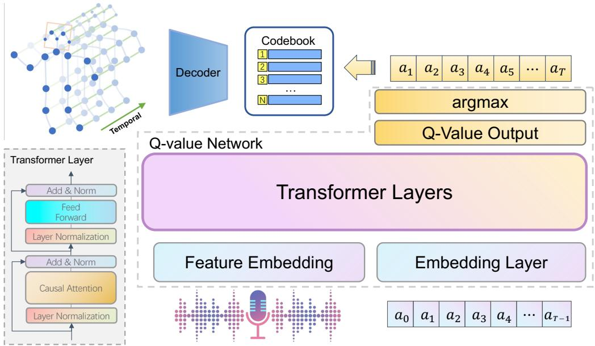
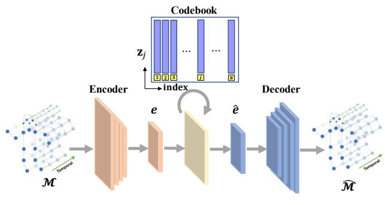
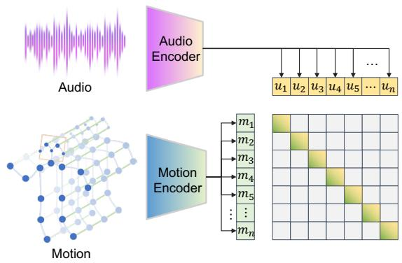
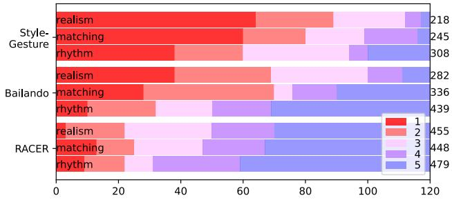

# Co-speech Gesture Synthesis by Reinforcement Learning with Contrastive Pre-trained Rewards

Mingyang Sun1\*, Mengchen Zhao2\*, Yaqing Hou1†, Minglei Li3, Huang Xu3, Songcen Xu2, Jianye Hao2,4 1Dalian University of Technology, China 2Noah’s Ark Lab, Huawei, China 3Huawei Cloud Computing Technologies Co., Ltd, China 4Tianjin University, China

mysun@mail.dlut.edu.cn, houyq@dlut.edu.cn

zhaomengchen,liminglei29,xuhuang2,xusongcen,haojianye @huawei.com

## Abstract

There is a growing demand ofautomatically synthesizing co-speech gestures for virtual characters. However, it remains a challenge due to the complex relationship between input speeches and target gestures. Most existing works focus on predicting the next gesture that fits the data best, however, such methods are myopic and lack the ability to plan for future gestures. In this paper, we propose a novel reinforcement learning (RL) framework called RACER to generate sequences of gestures that maximize the overall satisfactory. RACER employs a vector quantized variational autoencoder to learn compact representations ofgestures and a GPT-based policy architecture to generate coherent sequence of gestures autoregressively. In particular, we propose a contrastive pre-training approach to calculate the rewards, which integrates contextual information into action evaluation and successfully captures the complex relationships between multi-modal speech-gesture data. Experimental results show that our method significantly outperforms existing baselines in terms of both objective metrics and subjective humanjudgements. Demos can befound at https://github.com/RLracer/RACER.git.

## 1. Introduction

Gesturing is important for human speakers to improve their expressiveness. It conveys the necessary non-verbal information to the audience, giving the speech a more emotional touch so that to enhance persuasiveness and credibility. Similarly, in virtual world, high-quality 3D gesture animations can make a talking character more vividly. For example, in human-computer interaction scenarios, vivid gestures performed by virtual characters can help listeners to concentrate and improve the intimacy between humans and characters [36]. Attracted by these merits, there has been a growing demand of automatically synthesizing high-quality co-speech gestures in computer animation.

However, automatically synthesizing co-speech gestures remains a challenge due to the complicated relationship between speech audios and gestures. On one hand, a speaker may play different gestures when speaking the same words due to different mental and physical states. On the other hand, a speaker may also play similar gestures when speaking different words. Therefore, co-speech gesture synthesizing is inherently a “many-to-many” problem [21]. Moreover, in order to ensure the overall fluency and consistency, we must take into consideration both the contextual information and the subsequent effect upon playing a gesture [23, 38]. Therefore, gesture synthesizing is rather a sequential decision making problem than a simple matching between speeches and gestures.

Compared with traditional rule-based approaches [35], data-driven gesture synthesis approaches [10,39] has shown many advantages, including the low development cost and the ability to generalize. Most existing data-driven approaches consider gesture synthesis as a classification task [6, 26] or a regression task [17] in a deterministic way i.e. the same speech or text input always maps to the same gesture output. However, these models rely on the assumption that there exists a unique ground-truth label for each input sequence of speech, which contradicts to the “many-tomany” nature of the problem. As a consequence, they sacrifice diversity and semantics of gestures and tend to learn some averaged gestures for any input speeches. Some other works adopt adversarial learning framework, where a discriminator is trained to distinguish between generated gestures and the recorded gestures in dataset [10,38]. Although they improve the generalizability of the gesture generator to some extent, they still fail to explore the essential relationship between speeches and gestures.

In order to address the above challenges, we propose a novel Reinforcement leArning framework with Contrasitive prE-trained Rewards (RACER) for generating highquality co-speech gestures. RACER is trained in an offline manner but can be used to generate the next gesture for a speaking character in real time. RACER consists of the following three components. Firstly, in order to extract meaningful gestures from the infinite action space, RACER adopts a vector quantized variational autoencoder (VQ-VAE) [32] to learn compact gesture representations, which significantly reduces the action space. Secondly, we construct the Q-value network using a GPT-based [28] model, which has natural advantages of generating coherence sequence of gestures. Thirdly, inspired by the contrastive language-image pre-training (CLIP) [27] and recent advances of contrastive learning [30], we propose a contrastive speech-gesture pre-training method to compute the rewards, which guide the RL agent to explore sophisticated relations between speeches and gestures. Note that these rewards evaluate the quality of gestures as a sequence. By contrast, in conventional supervised learning frameworks, the focus is on predicting only the next gesture, ignoring the quality of generated sequence as a whole. To sum up, the core contributions of this paper are as follows:

(1) We formally model the co-speech gesture synthesis problem as a Markov decision process and propose a novel RL based approach called RACER to learn the optimal gesture synthesis policy. RACER can be trained in an offline manner and used to synthesis cospeech gestures in real time.

(2) We introduce VQ-VAE to encode and quantize the motion segments to a codebook, which significantly reduces the action space and facilitates the RL phase.

(3) We propose a contrastive speech-gesture pre-training method to compute the rewards, which guide the RL agent to discover deeper relations from multi-modal speech-gesture data.

(4) Extensive experimental results show that RACER outperforms the existing baselines in terms of both objective metrics and subjective human judgements. This demonstrates the superiority and the potential of RL in co-speech gesture synthesis tasks.

## 2. Related Work

## 2.1. Data-driven Motion Synthesis

Human motion synthesis has been studied for a long time [21, 37]. Traditional approaches such as motion graph [16] cut the motion capture data and synthesize new motions according to crafted transition rules. With the development of deep learning, using neural networks to synthesize motions in an end-to-end manner becomes popular. Some of works focus on motion prediction [13, 15], which could predict current motion with a high accuracy, but they often fail to predict longer motion sequences. Recent works focus more on the motion synthesis, which aims at generating long-term natural motions such as walking, jumping, waving and dancing. Many advanced techniques have been applied to long-term motion synthesis, including conditional GANs [33], VAEs [21], auto-regressive models [7] and Transformers [5, 22]. A most recent work called Bailando explores the potential of RL in synthesizing dances for given music [29]. However, in Bailando, RL is used only for fine tuning so that the exact contributions of RL remain unclear. By contrast, our proposed method RACER is trained solely by RL and its effectiveness is demonstrated by extensive experiments.

## 2.2. Co-speech Gesture Synthesis

Co-speech gesture synthesis is challenging due to the complicated relations between speeches and gestures that are hidden in the multi-modal dataset. One line of conventional methods is rule-based generation [35], where the core idea is to pre-define a set of gesture units and design rules to connect speech words and the gesture units. However, it requires too much human effort in designing the rules, which is costly and inefficient in practice. Benefit from the recent advances in deep learning, many datadriven approaches have been proposed to learn the matching rules from speech-gesture data. Existing works focus on exploring the effectiveness of different network architectures, including the multi-layer perceptron (MLP) [18], convolutional neural networks (CNNs) [11], recurrent neural networks (RNNs) [4] and Transformers [18, 29]. Some recent works incorporate adversarial loss to enhance gesture fidelity [1,9,10,38]. However, they simply construct a target gesture as the unique label of the current segment of speech, ignoring the “many-to-many” nature of the problem. To model the complicated relation between speeches and gestures, Alexanderson et al. [2] propose a probabilistic model MoGlow based on normalizing flows [12] which maps input speeches to Gaussian distributions of gestures. However, the randomly sampled gestures contain non-negligible noise and therefore suffer from low interpretability.

## 3. Preliminaries

The underlying environment of reinforcement learning is typically modeled by a Markov decision process (MDP), which is defined by a tuple $( S , { \mathcal { A } } , P , R , \gamma )$ .  represents the state space and  represents the action space. The transition function $P ( \cdot | s , a )$ gives the probabilities of transitioning to the next state after taking action a at state s. $R ( \cdot | s , a )$ is the associated reward function and $\gamma \in [ 0 , 1 )$ represents the discount factor. A policy $\pi ( \cdot | s )$ maps each state $s \in S$ to a distribution over actions. For an agent following the policy ⇡, the action value function, denoted by $Q ^ { \pi } ( s , a )$ , is defined as the expectation of cumulative discounted future rewards:

  
Figure 1. The overall architecture of RACER. Given a piece of speech audio and the initial gesture code a0, the Q-network represented by transformer layers autoregressively calculates the Q-values and selects a sequence of actions $( a _ { 1 } , \cdots , a _ { T } )$ . The action sequence will then be transformed to quantitative features by querying the codebook and finally be decoded to motion sequences by the decoder of VQ-VAE.

$$
\begin{array} { r l } & { Q ^ { \pi } ( s , a ) : = \mathbb { E } \left[ \displaystyle \sum _ { t = 0 } \gamma ^ { t } R ( s _ { t } , a _ { t } ) \right] , } \\ & { s _ { 0 } = s , a _ { 0 } = a , s _ { t } \sim P ( \cdot | s _ { t - 1 } , a _ { t - 1 } ) , a _ { t } \sim \pi ( \cdot | s _ { t } ) . } \end{array}\tag{1}
$$

The goal in RL is to learn an optimal policy $\pi ^ { * }$ that maximizes the expected cumulative reward. We denote by $Q ^ { * } ( s , a )$ the optimal action value function under the optimal policy $\pi ^ { * }$ . The Bellman equations for the optimal Qvalues can be represented by:

$$
Q ^ { \ast } ( s , a ) : = R ( s , a ) + \gamma \mathbb { E } _ { s ^ { \prime } \sim P } \operatorname* { m a x } _ { a ^ { \prime } \in \mathcal { A } } Q ^ { \ast } ( s ^ { \prime } , a ^ { \prime } ) .\tag{2}
$$

A standard approach for computing the optimal policy is Qlearning, which iteratively improves the estimation of $Q ^ { * }$ by applying the Bellman operator derived from Eq. (2). While traditional Q-learning requires interactions with the environment, recent advances in offline RL allow us to learn the optimal policy directly from a fixed dataset, which we will elaborate in Sec. 4.3.

## 4. Our Approach

The overview of our proposed framework RACER is shown in Fig. 1. At each time step t, the state s consists of the generated action tokens $( a _ { 1 } , \ldots , a _ { t - 1 } )$ and input audio.

Unlike existing methods which directly learn a mapping from audio features to the continuous high-dimensional motion space, we encode and quantize the motion into a finite codebook $\mathcal { Z } = \{ z _ { i } \} _ { i = 1 } ^ { N }$ by VQ-VAE, where N is the size of codebook and each code $z _ { i }$ represents a gesture lexeme feature. The details of action design are introduced in Sec. 4.1. We use a GPT-like unidirectional model as the Q-network that autoregressively outputs action tokens following a greedy strategy. An action token a will be mapped to a gesture lexeme feature z and then be decoded to a specific gesture motion. Moreover, we propose a contrastive speech-gesture pre-training model to compute the immediate rewards for the actions, which will be elaborated in Sec. 4.2. In addition, we will introduce how to train the Q-network in a fully offline manner in Sec. 4.3.

## 4.1. Action Design

Instead of designing handcrafted gestures with expensive manual efforts, our goal is to summarize gesture lexemes into a representative codebook from a large gesture dataset in an unsupervised manner. To collect distinctive gesture representations and reconstruct them back to real gestures, we employ a VQ-VAE model which has successfully demonstrated its ability to learn effective latent representations from temporal data. The structure of VQ-VAE is shown in Fig. 2. VQ-VAE extends the regular autoencoder by adding a discrete codebook  to the network, which consists of a list of vectors with their corresponding indexes. A piece of motion in raw dataset can be represented by a matrix $\mathcal { M } \in \mathbb { R } ^ { T \times J }$ , where $T$ is the number of frames and J is the dimension of joint features. can then be transformed to latent features ${ \boldsymbol { e } } _ { \mathbf { \lambda } \in \mathbf { \lambda } } \mathbb { R } ^ { T ^ { \prime } \times C }$ by a 1-D convolutional network, where $T ^ { \prime }$ is the length of feature sequence after down-sampling, and C is the channel dimension. Each row of $^ { e , }$ represented by $e _ { i } ,$ will be substituted by its closest vector $z _ { j }$ in the codebook:

  
Figure 2. Structure of motion VQ-VAE.

$$
\hat { e } _ { i } = \arg \operatorname* { m i n } _ { z _ { j } \in \mathcal { Z } } | | e _ { i } - z _ { j } | | .\tag{3}
$$

Then, the quantized features $\hat { e } _ { i }$ will be decoded to $\hat { \mathcal { M } }$ via a decoder so that to reconstruct . Following [32], the encoder and decoder are simultaneously learned by minimizing the following loss function:

$$
\begin{array} { r l } & { \mathcal { L } _ { V Q } = \mathcal { L } _ { m } ( \mathcal { M } , \hat { \mathcal { M } } ) } \\ & { \quad \quad \quad + | | \hat { e } - \mathrm { s g } ( e ) | | _ { 2 } ^ { 2 } + \beta | | \mathrm { s g } ( \hat { e } ) - e | | _ { 2 } ^ { 2 } , } \end{array}\tag{4}
$$

where $\mathrm { s g } [ \cdot ]$ stands for the stop gradient operator that prevents the gradient from backpropagating through its operand. The first term $\mathcal { L } _ { m } ( \mathcal { M } , \hat { \mathcal { M } } )$ represents the reconstruction error, which is expanded as:

$$
\begin{array} { r l } & { \mathcal { L } _ { m } ( \mathcal { M } , \hat { \mathcal { M } } ) = | | \mathcal { M } , \hat { \mathcal { M } } | | _ { 1 } } \\ & { \qquad + \alpha _ { 1 } | | \mathcal { M } ^ { \prime } , \hat { \mathcal { M } } ^ { \prime } | | _ { 1 } + \alpha _ { 2 } | | \mathcal { M } ^ { \prime \prime } , \hat { \mathcal { M } } ^ { \prime \prime } | | _ { 1 } , } \end{array}\tag{5}
$$

where $\mathcal { M } ^ { \prime }$ and $\mathcal { M } ^ { \prime \prime }$ are the $1 ^ { s t }$ order and $2 ^ { n d }$ order of partial derivatives of motion sequence $\mathcal { M } ,$ representing the velocity and the acceleration of the motion, respectively. $\alpha _ { 1 }$ and $\alpha _ { 2 }$ are hyper-parameters used to trade-off between the two losses. We can see from Eq. (5) that VQ-VAE reconstructs not only the original position of each joints of the character, but also the velocities and the accelerations of its motions. Notably, since  is discrete, we will simply copy the gradients from the reconstruction error and pass them to the encoder during training. The second term in Equation (4) aims to optimize the codebook by pushing the eˆ and its associated z close to e, which is the output of the encoder. The last term in Equation (4) aims to optimize the encoder by pushing e close to its nearest latent vector in the codebook. The VQ-VAE mode will be trained separately, which means that its model parameters as well as the codebook remain unchanged during reward computation and reinforcement learning. Note that in the reinforcement learning phase, the indexes of the codebook will be treated as the action tokens, as introduced in Sec. 4.3.

  
Figure 3. Summary of the reward model. The model jointly trains a motion encoder and an audio encoder to predict the correct pairings of a batch of (motion, audio) training examples.

## 4.2. Reward Design

Reward function is key to reinforcement learning because it contains most of the knowledge that the agent can learn. Regarding to the task of co-speech gesture synthesis, the original dataset explicitly indicates the ground-truth gestures for given speech audios. However, due to the “manyto-many” nature of the problem, a ground-truth gesture may not be optimal under different contexts. This motivates us to learn a reward model that is able to discover and utilize deeper relations between speeches and gestures. There are two advantages of using the reward model. First, if there are multiple gestures correspond to one speech slice, the reward model is able to distinguish between these gestures so that to enrich the supervision signals. Second, as the goal of RL is to maximize the accumulated rewards of action sequences, the agent will learn to generate sequences of gestures that maximize the overall satisfaction.

To get a proper reward function, we train a model to evaluate the degree of correspondence between the sequences of gestures and the sequences of speeches. Since the reward model tells the agent the degree of correspondence of the speech-gesture pairs, it should be able to distinguish between matched pairs and unmatched pairs. Moreover, the reward model should also generalize to speech-gesture pairs that are not covered by the dataset. This coincides with the idea of contrastive learning. Multimodal contrastive learning techniques have been developed recently, such as CLIP [27], a well-known visual-text contrastive learning model, designed to match paired image and caption embeddings.

Similar to CLIP, given a batch of n (motion, audio) pairs, the reward model is trained to predict which of the $n \times n$ possible (motion, audio) pairs across a batch actually occurred. To do this, the model converts each input motion and audio into vector representations m and u by a motion encoder ${ \mathcal { E } } _ { m }$ and an audio encoder ${ \mathcal { E } } _ { a }$ . Two encoders are jointly trained to maximize the cosine similarity of each real pair (mi and ui):

$$
\mathcal { L } _ { R } = \ell _ { i } ^ { m  u } + \ell _ { i } ^ { u  m } ,\tag{6}
$$

where

$$
\begin{array} { r } { \ell _ { i } ^ { m  u } = - \log \frac { e x p ( m _ { i } \cdot u _ { i } / \tau ) } { \sum _ { k = 1 } ^ { n } e x p ( m _ { i } \cdot u _ { k } / \tau ) } , } \\ { \ell _ { i } ^ { u  m } = - \log \frac { e x p ( u _ { i } \cdot m _ { i } / \tau ) } { \sum _ { k = 1 } ^ { n } e x p ( u _ { i } \cdot m _ { k } / \tau ) } . } \end{array}\tag{7}
$$

$\tau \in \mathbb { R } ^ { + }$ represents a temperature parameter. In this work, both encoders are structured as 1-D temporal convolutional networks and can input sequences of different lengths.

As with VQ-VAE, the training of the reward model is in a separate phase. During reinforcement learning, two encoders of the learned reward model respectively encodes the generated motion $\hat { \mathcal { M } }$ and input speech  into two vectors, with their inner product as the reward:

$$
R ( \hat { \mathcal { M } } , \mathcal { U } ) = \mathcal { E } _ { m } ( \hat { \mathcal { M } } ) \cdot \mathcal { E } _ { u } ( \mathcal { U } ) .\tag{8}
$$

## 4.3. Offline Reinforcement Learning

Recall that we have defined several essential factors of the MDP. State s includes the generated action tokens $\pmb { a } _ { 0 : t - 1 }$ and the audio sequence ${ \mathbf { } } { \mathbf { } } { \mathbf { } } ^ { } { \mathbf { } } ^ { } { \mathbf { } } ^ { } { \mathbf { } } ^ { } { \mathbf { } } ^ { } { \mathbf { } } ^ { } { \mathbf { } } ^ { } { \mathbf { } } ^ { } { \mathbf { } } ^ { } { \mathbf { } } ^ { } { \mathbf { } } ^ { } { \mathbf { } } ^ { } { \mathbf { } } ^ { } { \mathbf { } } ^ { } { \mathbf { } } ^ { } { \mathbf { } } ^ { } { \mathbf { } } ^ { } { \mathbf { } } ^ { } { \mathbf { } } ^ { } { \mathbf { } } ^ { } { \mathbf { } } ^ { } { \mathbf { } } ^ { } { \mathbf { } } ^ { } { \mathbf { } } ^ { } { \mathbf { } } ^ { } { \mathbf { } } ^ { } { \mathbf { } } ^ { } { \mathbf { } } ^ { } { \mathbf { } } ^ { } { \mathbf { } } ^ { } { \mathbf { } } ^ { } { \mathbf { } } ^ { } { \mathbf { } } ^ { } { \mathbf { } } ^ { } { \mathbf { } } ^ { } { \mathbf { } } ^ { } { \mathbf { } } ^ { } \mathbf { } ^ { } \mathbf { } { } ^  { \mathbf { } \mathbf { } } ^ { } { \mathbf } ^ { } { \mathbf } { } ^ { } \mathbf { } ^ { } \mathbf { } \mathbf { } ^ { } \mathbf { } \quad  ^ { }$ up to the current time step t. Each action a corresponds to an index of the codebook learned by VQ-VAE. The reward r is outputted by the reward model to evaluate how well the predicted gesture matches the input audio. Now we are able to augment the original speech-gesture dataset to a trajectory dataset $\mathcal { D } = \{ s _ { i } , a _ { i } , r _ { i } , s _ { i } ^ { \prime } | i = 1 , . . . , N \} )$ ). Note that these trajectories can be collected before the start of the reinforcement learning phase. We denote by $\pi _ { \beta }$ the behavior policy that generates these trajectories.

Offline datasets usually do not provide complete stateaction coverage. That is, the set $\{ ( s , a ) | ( s , a , r , s ^ { \prime } ) \in \mathcal { D } \}$ is typically a small subset of the full space $s \times A .$ . Standard online reinforcement learning methods such as DDPG [24] and SAC [31] are not appropriate due to issues with bootstrapping from out-of-distribution actions. $\mathrm { ~ A ~ } ^ { \bullet } \mathrm { s a f e } ^ { , \bullet }$ strategy to mitigate the distributional shift problem is to be conservative: if we explicitly estimate the value of unseen outcomes conservatively (i.e. assign them a low value), then the estimated value or performance of the policy that executes unseen behaviors is guaranteed to be small. Using such conservative estimates for policy optimization will prevent the policy from executing unseen actions and it will perform reliably. To this end, we adopt a simple but effective offline reinforcement learning algorithm called conservative Q-learning (CQL) [20] to learn the optimal policy from the augmented offline dataset.

Specifically, for the conservative off-policy evaluation, the Q-function, $\hat { Q } ^ { \pi } : = l i m _ { k  \infty } \hat { Q } _ { k }$ is trained via an iterative update:

$$
\begin{array} { r l r } & { } & { \hat { Q } ^ { k + 1 } \gets \arg \underset { Q } { \operatorname* { m i n } } \frac { 1 } { 2 } \underset { s , a , s ^ { \prime } \sim \mathcal { D } } { \mathbb { E } } \left[ ( Q ( s , a ) - \hat { B } ^ { \pi } \hat { Q } ^ { k } ( s , a ) ) ^ { 2 } \right] } \\ & { } & { \quad \quad \quad \quad + \alpha \left( \underset { s \sim \mathcal { D } } { \mathbb { E } } \left( Q ( s , a ) \right] - \underset { s \sim \mathcal { D } } { \mathbb { E } } \left[ Q ( s , a ) \right] \right) , } \end{array}\tag{9}
$$

where

$$
\hat { \mathcal { B } } ^ { \pi } \hat { Q } ^ { k } ( s , a ) = \mathbb { E } _ { s ^ { \prime } \sim P ( s ^ { \prime } \mid s , a ) } [ R ( s , a ) + \gamma \mathbb { E } _ { a ^ { \prime } \sim \hat { \pi } ^ { k } ( s , a ) } \hat { Q } ^ { k } ( s ^ { \prime } , a ^ { \prime } ) ]\tag{10}
$$

is the Bellman operator. This equation consists the normal bootstrapping error and the regularization term with a tradeoff factor ↵. Inside the the regularization term, the first term always pushes the Q-value down on the $( s , a )$ pairs sampled from the learning policy $\mu$ whereas the second term pushes Q-value up on the $( s , a )$ pairs sampled from the offline data set. In practice, we selected the binding variant of CQL and DQN as our model, which can be optimized by minimizing the following loss function:

$$
\begin{array} { r l r } {  { m i n \alpha \underset { s \sim \mathcal { D } } { \mathbb { E } } [ l o g \sum _ { a } e x p ( Q ( s , a ) ) - \underset { a \sim \hat { \pi } _ { \beta } } { \mathbb { E } } [ Q ( s , a ) ] ] } } \\ & { } & { \quad + \displaystyle \frac { 1 } { 2 } \underset { s , a , s ^ { \prime } \sim \mathcal { D } } { \mathbb { E } } [ ( Q ( s , a ) - \hat { { B } } ^ { \pi } \hat { { Q } } ^ { k } ( s , a ) ) ^ { 2 } ] . } \end{array}\tag{11}
$$

Since we want to use the Q-value function to autoregressively generate the action sequences, we construct a powerful GPT-based backbone model to estimate the Q-values, as is shown in Fig. 1. To construct the input, each motion code sequence is embedded to learnable features and concatenated with the audio features in the temporal dimension. We add a learned positional encoding to this concatenated $( 2 \times T ^ { \prime } \times C )$ -dimensional tensor and feed it to Transformer layers, whose structure is shown in the left of Fig. 1. Last, we employ a linear layer to map the output of Transformer layers to the Q-value $\pmb q \in \mathbb R ^ { T ^ { \prime } \times N }$ , where N is the size of learned codebook. In the Transformer layer, the attention is the core component that determines the computational dependency among sequential elements of inputs, which is computed as:

$$
A t t e n t i o n ( Q , K , V , M ) = \mathrm { s o f t m a x } ( \frac { Q K ^ { T } } { \sqrt { C } } + M ) V ,\tag{12}
$$

where Q, K, V denote the query, key and value from input, and $V$ is the mask. In the original GPT model,“causal attention” realizes the intercommunication of the current and previous data to compute the state for the time of interest. However, our model needs to infer actions from the speech at each time step, so it needs to process two input sequences simultaneously. To comply the causality conditioned among features of the audio and the action, M is designed to be a $2 \times 2$ repeated block matrix with lower triangular matrix of size $T ^ { \prime }$

During inference, given the audio of arbitrary length and the initial motion code $a _ { 0 }$ , the Q-network can output Qvalues of all actions. We will select the action with the maximum Q-value and then add it to the input, so that we can autoregressively generate the entire action sequence.

## 5. Experiments

## 5.1. Dataset

In this paper, we use two speech-gesture datasets: the Trinity dataset and a Chinese dataset collected by us. Trinity Gesture dataset is a large database of speech and gestures jointly collected by [8]. This dataset consists of 242 minutes of motion capture and audio of one male actor talking on different topics. The actor’s motion was captured with a 20-camera Vicon system and solved onto a skeleton with 69 joints. In this paper, we use the official release version of The GENEA Challenge 2020 Dataset [19], where 221 minutes are used as training data, and the remaining 21 minutes are kept for testing. Additionally, we collected an 1-hour high-quality Chinese dataset using motion capture equipment. This dataset contains 3D full-body gestures and the aligned Chinese speech audio. And we retargeted the skeletons to be consistent with the Trinity dataset. In this dataset, the speaker described various speech scenes in Chinese and made high-standard common speech gestures, ensuring a high degree of matching between gestures and speech.

## 5.2. Implementation Details

All the motion data are downsampled to 20 frames per second on the Trinity and Chinese datasets. We focus on upper-body gestures in this work. For visualization, we employ a character model consist of 16 upper-body joints, including a rotational root. The audio features are extracted by the public audio processing toolbox librosa, including mel-scaled spectrogram and onset. In VQ-VAE, the codebook size $N$ and the channel dimension C are both set to

512, and the temporal downsampling rate of encoders is set to 8. During the training of VQ-VAE, motion data are cropped to uniform length of $T = 1 2 0$ (6 seconds) and sampled in batch size of 64. The trade-off $\beta$ in $\mathcal { L } _ { V Q }$ is set to 0.1. ↵1 and $\alpha _ { 2 }$ in ${ \mathcal { L } } _ { m }$ are both 1. We adopt Adam optimizer with $\beta _ { 1 } = 0 . 9$ and $\beta _ { 2 } = 0 . 9 9 9$ for 500 epochs on Trinity but 400 epochs on the Chinese dataset with learning rate 0.00003. During the training of reward model, both audio and motion data are clipped to 6s. The optimizer settings are consistent with those of the VQ-VAE. The structure of the Q network is basically the same as that of the GPT network, where the embedding dimension is 768 and the attention layer is implemented in 12 heads with dropout probability 0.1. During the off-line reinforcement learning, the motion sequences are encoded to motion codes and sampled to length of 15 and sampled in batch size of 256. The Qnetwork is optimized using Adam optimizer with $\beta _ { 1 } = 0 . 5$ and $\beta _ { 2 } = 0 . 9 9 9$ for 1500 epochs on Trinity but 1200 epochs on Chinese dataset, where the learning rate is initialized as 0.0001. The discount factor $\gamma$ is set to 0.99. At runtime, a Gaussian filter with a kernel size of $K = 5$ is used to smooth the denormalized gesture sequence along the time dimension. The entire framework takes 36 hours on Trinity and 30 hours on the Chinese dataset to complete training on one NVIDIA Quadro RTX 5000 GPU.

## 5.3. Evaluation Metrics

We adopt four commonly used evaluation metrics (MAJE, MAD, FGD and PMB) to compare various methods quantitatively. Mean absolute joint error (MAJE) measures the mean of the absolute errors between the generated joint positions and ground truth over all the time steps, which indicates how closely the generated joint po sitions follow the ground truth. Mean acceleration difference (MAD) measures the mean of the l2 norm differences between the generated joint accelerations and ground truth over all the time steps, which indicates how closely the ground truth and the generated joint movements match. Frechet Gesture Distance (FGD) was proposed by which´ measures the difference between the distributions of the latent features of the generated gestures and ground truth [38]. The latent features are extracted from an auto-encoder trained on the Human 3.6M dataset\*. Specifically, we use Hˆ and H represent the latent features of generated gestures and ground truth. The Frechet distance is formulated as´

$$
\mathrm { F G D } ( \hat { H } , H ) = | | \hat { \mu } - \mu | | _ { 2 } ^ { 2 } + \mathrm { T r } \left( \hat { \Sigma } + \Sigma - 2 \sqrt { \hat { \Sigma } \Sigma } \right) ,\tag{13}
$$

where $\mu$ and ⌃ are the first and second moments of the latent feature distribution of the ground truth H, and $\hat { \mu }$ and $\hat { \Sigma }$ are the first and second moments of the latent feature distribution of the generated gestures Hˆ . FGD makes a reasonable assessment of the perceived plausibility of the synthesized gestures. The Percentage of Matched Beats PMB is a new metric to calculating the matching rate of audio and motion beats for evaluating rhythm performance [3]. In PMB, a motion beat is considered an matched if the distance to a nearby audio beat is within the range of :

Table 1. Comparison of RACER to Style Gesture, Gesticulator, S2AG and Bailando on Trinity datasets. means the lower is better and means the higher is better.
<table><tr><td>Dataset</td><td>Method</td><td>MAJE(mm) ↓</td><td> $\mathrm { M A D } ( m m / s ^ { 2 } ) \downarrow$ </td><td>FGD↓</td><td>PMB(%)↑</td></tr><tr><td rowspan="6">Trinity</td><td>Ground Truth</td><td>0</td><td>0</td><td>0</td><td>95.74</td></tr><tr><td>Style Gesture</td><td>97.29</td><td>4.26</td><td>36.98</td><td>54.54</td></tr><tr><td>Gesticulator</td><td>82.41</td><td>3.62</td><td>31.04</td><td>71.00</td></tr><tr><td>S2AG</td><td>54.93</td><td>1.49</td><td>20.36</td><td>79.53</td></tr><tr><td>Bailando</td><td>61.89</td><td>1.74</td><td>17.29</td><td>84.21</td></tr><tr><td>Ours</td><td>50.33</td><td>1.21</td><td>13.44</td><td>89.58</td></tr><tr><td rowspan="3">Chinese Dataset</td><td>Style Gesture</td><td>62.95</td><td>3.46</td><td>30.11</td><td>53.56</td></tr><tr><td>Bailando</td><td>45.45</td><td>1.29</td><td>25.07</td><td>68.53</td></tr><tr><td>Ours</td><td>43.25</td><td>1.19</td><td>9.21</td><td>74.29</td></tr></table>

$$
\mathsf { P M B } ( B ^ { m } , B ^ { a } ) = \frac { 1 } { N _ { m } } \sum _ { i = 1 } ^ { N _ { m } } \sum _ { j = b _ { * } ^ { a } + 1 } ^ { N _ { a } } \mathbb { 1 } [ | | b _ { j } ^ { m } - b _ { j } ^ { a } | | _ { 1 } < \delta ] ,\tag{14}
$$

where $B ^ { m }$ and $B ^ { a }$ represent the motion beats and audio beats, and $N _ { m }$ and $N _ { a }$ represent the number of beats. Motion beat can be obtained by identifying the local minima of joints deceleration [14]. baindicates the last matched audio beat. The  is set to 0.2s, consistent with the original paper.

## 5.4. Comparison to Existing Methods

In this section, we compare RACER with several stateof-the-art methods to demonstrate the advances made by our method. On the Trinity dataset, we compare with the methods of Style Gesture [2], Gesticulator [18], Speed to Affective Gesture (S2AG) [4] and Bailando [29]. On the Chinese dataset, we compared with Style Gesture and Bailando. Style Gesture generates gestures based on only the speech audio features by a normalizing flow probabilistic model. Gesticulator leverages the audio and text of the speech to generate semantically consistent gestures. Compared with these methods, S2AG adds more modality, including speaker identity and seed gesture poses. Different from other methods, Bailando is a novel music-to-dance framework with a choreographic memory and actor-critic GPT model. Since Bailando’s model architecture is similar to ours and both incorporate reinforcement learning into the training process, we apply it as a key contrast method to the gesture synthesis task. The hyperparameter setting is consistent with the original paper and the open source code, and the feature processing of the training data is consistent with ours. For a fair comparison, we keep the same skeleton and motion frame rate as the comparison systems.

Quantitative experimental results are listed in Tab. 1. According to the comparison, our proposed model consistently performs favorably against all the other methods on all evaluations. Specially, on Trinity, our method improves 4.60(8.37%) and 0.28(18.79%) than the best compared baseline model S2AG on MAJE and MAD, respectively. In terms of FGD and PMB, Bailando, with its advanced network structure and reinforcement learning fine-tuning process, also obtained better evaluation results (17.29 and 84.21%) than S2AC (20.36 and 79.53%). Our approach further achieves significantly higher performance (13.44 and 89.58%) in both items. Similarly, our method has also achieved excellent performance in Chinese dataset compared with Style Gesture and Bailando, especially on FGD (9.21) and PMB (74.29%). The superiority of our method on all evaluation metrics reveals that RACER can rely on offline RL not only to synthesize more real-like motion than compared baseline methods, but also but also to achieve outstanding performance in motion quality and rhythm.

User Study. We conducted a user study to further assess the real visual performance of our method in a pairwise manner. We choose Style Gesture and Bailando to compare. We randomly sampled 10 30-second long slices generated from the test set of Trinity dataset. Each motion slice is bound to the Mixamo [25] model and rendered as a video by Blender. The experiment is conducted with 12 participants. The participants are asked to rate the slices from the following three aspects respectively: (1) realism, (2) speechto-gesture matching, (3) speech-to-gesture rhythm matching. The scores assigned to each rating are in the range of 1-5, corresponding from worst to best. Rating statistics results are shown in Fig. 4. Notably, our method significantly surpasses the compared other methods.

Table 2. Ablation study results on the Trinity dataset.
<table><tr><td>Method</td><td>MAJE(mm) ↓</td><td>MAD(mm  $/ s ^ { 2 } )$  ↓</td><td>FGD↓</td><td>PMB(%) ↑</td><td>Reward↑</td></tr><tr><td>RACER(Supervised Learning)</td><td>56.22</td><td>1.81</td><td>16.69</td><td>78.54</td><td></td></tr><tr><td>RACER(Distance Reward)</td><td>58.96</td><td>2.94</td><td>23.55</td><td>72.09</td><td></td></tr><tr><td>RACER(DQN)</td><td>59.44</td><td>1.81</td><td>15.46</td><td>76.63</td><td>4.23</td></tr><tr><td>RACER(Actor-Critic)</td><td>60.18</td><td>1.76</td><td>17.69</td><td>78.02</td><td>3.93</td></tr><tr><td>Ours</td><td>50.33</td><td>1.21</td><td>13.44</td><td>89.58</td><td>9.34</td></tr></table>

  
Figure 4. User study results comparing RACER against Bailando and Style Gesture. Bars with different colors represent rank counts. In total, 120 comparisons have been rated. The total scores are listed on the right.

## 5.5. Ablation Studies

To gain more insights into the proposed components of our method, we test some variants of RACER on Trinity dataset: (1)“Supervised Learning” indicates that we directly treat gesture code sequences as labels to train GPTlike models through supervised learning instead of reinforcement learning. (2)“Distance reward” indicates that our reward function is is replaced by the Euclidean distance calculation between the predicted poses and ground true, which is equivalent to taking the supervision signal in the traditional regression problem directly as the reward. (3)“DQN” means that we use the online RL algorithm DQN [34] instead of offline RL to learn the policy. The Q-value network of RACER(DQN) keeps consistent with ours. (4)“Actor-Critic” means that we use the online RL algorithm Actor-Critic instead of offline RL to learn the policy. For RACER(Actor-Critic), we regard the last 3 Transformer layers of GPT model with a additional linearsoftmax layer as the branch of actor network. Besides, we add 3 Transformer layers as the branch of critic network to estimate the V-values.

The quantitative scores are shown in Tab. 2. Firstly, we explore the effectiveness of offline reinforcement learning itself. Compared to RACER, the evaluation metrics of RACER(Supervised Learning) sharply drops 5.89(11%), 0.60(50%), 3.25(24%) and 11.04%, respectively. This shows that offline RL with proposed reward function can help the model learn to generate sequences of discrete tokens better than supervised learning. Secondly, to explore the advantages of the contrastive multi-modal reward, we evaluate the performance of RACER(Distance Reward). Our method has achieved better performance, especially on the MAD and PMB matrics. This confirms that the contrastive multi-modal reward function we propose can handle the feature relationship between multiple modes and improve the matching degree of motion and speech. Moreover, to verify the advantages of offline RL over online RL, we introduce two classic online RL algorithms, DQN and Actor-Critic, to determine the variations. Under the same number of training steps, DQN and AC algorithms can only get the highest rewards of 4.23 and 3.93 respectively, which is a significant gap compared to CQL. Naturally, other matrices are also significantly worse than CQL.

## 6. Discussion and Conclusion

In this paper, we propose a novel co-speech gesture synthesis framework called RACER. RACER regards the motion generated procedure as a sequential decision making process and employs reinforcement learning to learn the autoregressive gesture synthesis policy. There are mainly three sub-components of RACER. First, a vector quantized variational autoencoder (VQ-VAE) is employed to learn compact representations of gestures from massive realworld gesture data. Second, RACER uses a GPT-based architecture as policy network, which could autoregressively generate the next gestures given a sequence of speech audio. Thirdly, we propose a contrastive pre-training approach to calculate the rewards, which integrates contextual information into action evaluation and successfully captures the complex relationships between multi-modal speech-gesture data. We conduct extensive experiments to evaluate the performance of RACER. The experimental results show that RACER significantly outperforms the existing baselines in various objective and subjective metrics. Moreover, RACER shows a great generalization ability with respect to different contexts, which indicates the potentials of RACER in more complex motion synthesis tasks.

## References

[1] Chaitanya Ahuja, Dong Won Lee, Ryo Ishii, and Louis-Philippe Morency. No gestures left behind: Learning relationships between spoken language and freeform gestures. In Findings of the Association for Computational Linguistics: EMNLP 2020, pages 1884–1895, Nov. 2020. 2

[2] Simon Alexanderson, Gustav Eje Henter, Taras Kucherenko, and Jonas Beskow. Style-controllable speech-driven gesture synthesis using normalising flows. Computer Graphics Forum, 39, 2020. 2, 7

[3] Tenglong Ao, Qingzhe Gao, Yuke Lou, Baoquan Chen, and Libin Liu. Rhythmic gesticulator: Rhythm-aware cospeech gesture synthesis with hierarchical neural embeddings. ArXiv, abs/2210.01448, 2022. 7

[4] Uttaran Bhattacharya, Elizabeth Childs, Nicholas Rewkowski, and Dinesh Manocha. Speech2affectivegestures: Synthesizing co-speech gestures with generative adversarial affective expression learning. In Proceedings of the 29th ACM International Conference on Multimedia, page 2027–2036, 2021. 2, 7

[5] Uttaran Bhattacharya, Nicholas Rewkowski, Abhishek Banerjee, Pooja Guhan, Aniket Bera, and Dinesh Manocha. Text2gestures: A transformer-based network for generating emotive body gestures for virtual agents. In 2021 IEEE Virtual Reality and 3D User Interfaces (VR), pages 1–10, 2021. 2

[6] Chung-Cheng Chiu, Louis-Philippe Morency, and Stacy Marsella. Predicting co-verbal gestures: A deep and temporal modeling approach. In Intelligent Virtual Agents, pages 152–166, 2015. 1

[7] Hsu-Kuang Chiu, Ehsan Adeli, Borui Wang, De-An Huang, and Juan Carlos Niebles. Action-agnostic human pose forecasting. In 2019 IEEE Winter Conference on Applications of Computer Vision (WACV), pages 1423–1432, 2019. 2

[8] Ylva Ferstl and Rachel McDonnell. Investigating the use of recurrent motion modelling for speech gesture generation. In Proceedings of the 18th International Conference on Intelligent Virtual Agents, page 93–98, 2018. 6

[9] Ylva Ferstl, Michael Neff, and Rachel McDonnell. Multiobjective adversarial gesture generation. In Proceedings of the 12th ACM SIGGRAPH Conference on Motion, Interaction and Games, 2019. 2

[10] Shiry Ginosar, Amir Bar, Gefen Kohavi, Caroline Chan, Andrew Owens, and Jitendra Malik. Learning individual styles of conversational gesture. In 2019 IEEE/CVF Conference on Computer Vision and Pattern Recognition (CVPR), pages 3492–3501, 2019. 1, 2

[11] Ikhsanul Habibie, Weipeng Xu, Dushyant Mehta, Lingjie Liu, Hans-Peter Seidel, Gerard Pons-Moll, Mohamed Elgharib, and Christian Theobalt. Learning speech-driven 3d conversational gestures from video. In Proceedings of the 21st ACM International Conference on Intelligent Virtual Agents, page 101–108, 2021. 2

[12] Gustav Eje Henter, Simon Alexanderson, and Jonas Beskow. Moglow: Probabilistic and controllable motion synthesis using normalising flows. ACM Trans. Graph., 2020. 2

[13] Alejandro Hernandez, Jurgen Gall, and Francesc Moreno-Noguer. Human motion prediction via spatio-temporal inpainting. In Proceedings of the IEEE/CVF International Conference on Computer Vision (ICCV), October 2019. 2

[14] Chieh Ho, Wei-Tze Tsai, Keng-Sheng Lin, and Homer H. Chen. Extraction and alignment evaluation of motion beats for street dance. In 2013 IEEE International Conference on Acoustics, Speech and Signal Processing, pages 2429–2433, 2013. 7

[15] Yu Hua, Fan Xuanzhe, Hou Yaqing, Liu Yi, Kang Cai, Zhou Dongsheng, and Zhang Qiang. Towards efficient 3d human motion prediction using deformable transformer-based adversarial network. In 2022 International Conference on Robotics and Automation (ICRA), pages 861–867, 2022. 2

[16] Lucas Kovar, Michael Gleicher, and Fred´ eric Pighin. Motion´ graphs. In ACM SIGGRAPH 2008 Classes, SIGGRAPH ’08, 2008. 2

[17] Taras Kucherenko, Dai Hasegawa, Gustav Eje Henter, Naoshi Kaneko, and Hedvig Kjellstrom. Analyzing input¨ and output representations for speech-driven gesture generation. In Proceedings ofthe 19th ACM International Conference on Intelligent Virtual Agents, page 97–104, 2019. 1

[18] Taras Kucherenko, Patrik Jonell, Sanne van Waveren, Gustav Eje Henter, Simon Alexandersson, Iolanda Leite, and Hedvig Kjellstrom. Gesticulator: A framework for¨ semantically-aware speech-driven gesture generation. In Proceedings of the 2020 International Conference on Multimodal Interaction, page 242–250, 2020. 2, 7

[19] Taras Kucherenko, Patrik Jonell, Youngwoo Yoon, Pieter Wolfert, and Gustav Eje Henter. A large, crowdsourced evaluation of gesture generation systems on common data: The genea challenge 2020. In 26th International Conference on Intelligent User Interfaces, page 11–21, 2021. 6

[20] Aviral Kumar, Aurick Zhou, George Tucker, and Sergey Levine. Conservative q-learning for offline reinforcement learning. In H. Larochelle, M. Ranzato, R. Hadsell, M.F. Balcan, and H. Lin, editors, Advances in Neural Information Processing Systems, volume 33, pages 1179–1191. Curran Associates, Inc., 2020. 5

[21] Jing Li, Di Kang, Wenjie Pei, Xuefei Zhe, Ying Zhang, Zhenyu He, and Linchao Bao. Audio2gestures: Generating diverse gestures from speech audio with conditional variational autoencoders. In 2021 IEEE/CVF International Conference on Computer Vision (ICCV), pages 11273–11282, 2021. 1, 2

[22] Ruilong Li, Shan Yang, David A. Ross, and Angjoo Kanazawa. Ai choreographer: Music conditioned 3d dance generation with aist++. In Proceedings of the IEEE/CVF International Conference on Computer Vision (ICCV), pages 13401–13412, October 2021. 2

[23] Yuanzhi Liang, Qianyu Feng, Linchao Zhu, Li Hu, Pan Pan, and Yi Yang. Seeg: Semantic energized co-speech gesture generation. In 2022 IEEE/CVF Conference on Computer Vision and Pattern Recognition (CVPR), pages 10463–10472, 2022. 1

[24] Timothy P. Lillicrap, Jonathan J. Hunt, Alexander Pritzel, Nicolas Heess, Tom Erez, Yuval Tassa, David Silver, and

Daan Wierstra. Continuous control with deep reinforcement learning. In 4th International Conference on Learning Representations, ICLR 2016, San Juan, Puerto Rico, May 2-4, 2016, Conference Track Proceedings, 2016. 5

[25] Mixamo. https://www.mixamo.com/. 7

[26] Shenhan Qian, Zhi Tu, Yihao Zhi, Wen Liu, and Shenghua Gao. Speech drives templates: Co-speech gesture synthesis with learned templates. In Proceedings of the IEEE/CVF International Conference on Computer Vision (ICCV), pages 11077–11086, October 2021. 1

[27] Alec Radford, Jong Wook Kim, Chris Hallacy, Aditya Ramesh, Gabriel Goh, Sandhini Agarwal, Girish Sastry, Amanda Askell, Pamela Mishkin, Jack Clark, Gretchen Krueger, and Ilya Sutskever. Learning transferable visual models from natural language supervision, 2021. 2, 5

[28] Alec Radford, Jeffrey Wu, Rewon Child, David Luan, Dario Amodei, and Ilya Sutskever. Language Models are Unsupervised Multitask Learners. 2019. 2

[29] Li Siyao, Weijiang Yu, Tianpei Gu, Chunze Lin, Quan Wang, Chen Qian, Chen Change Loy, and Ziwei Liu. Bailando: 3d dance generation by actor-critic gpt with choreographic memory. In Proceedings of the IEEE/CVF Conference on Computer Vision and Pattern Recognition (CVPR), pages 11050–11059, June 2022. 2, 7

[30] Yonglong Tian, Chen Sun, Ben Poole, Dilip Krishnan, Cordelia Schmid, and Phillip Isola. What makes for good views for contrastive learning? In H. Larochelle, M. Ranzato, R. Hadsell, M.F. Balcan, and H. Lin, editors, Advances in Neural Information Processing Systems, volume 33, pages 6827–6839. Curran Associates, Inc., 2020. 2

[31] Pieter Abbeel Sergey Levine Tuomas Haarnoja, Aurick Zhou. Soft actor-critic: Off-policy maximum entropy deep reinforcement learning with a stochastic actor. ArXiv, abs/1801.01290, 2018. 5

[32] Aaron van den Oord, Oriol Vinyals, and Koray Kavukcuoglu. Neural discrete representation learning. In Proceedings of the 31st International Conference on Neural Information Processing Systems, NIPS’17, page 6309–6318, 2017. 2, 4

[33] Ruben Villegas, Jimei Yang, Duygu Ceylan, and Honglak Lee. Neural kinematic networks for unsupervised motion retargetting. In Proceedings ofthe IEEE Conference on Computer Vision and Pattern Recognition (CVPR), June 2018. 2

[34] David Silver Alex Graves Ioannis Antonoglou Daan Wierstra Martin Riedmiller Volodymyr Mnih, Koray Kavukcuoglu. Playing atari with deep reinforcement learning. ArXiv, abs/1312.5602, 2013. 8

[35] Petra Wagner, Zofia Malisz, and Stefan Kopp. Gesture and speech in interaction: An overview. Speech Communication, 57:209–232, 2014. 1, 2

[36] Jason R. Wilson, Nah Young Lee, Annie Saechao, Sharon Hershenson, Matthias Scheutz, and Linda Tickle-Degnen. Hand gestures and verbal acknowledgments improve humanrobot rapport. In Social Robotics, pages 334–344, 2017. 1

[37] Xinchen Yan, Akash Rastogi, Ruben Villegas, Kalyan Sunkavalli, Eli Shechtman, Sunil Hadap, Ersin Yumer, and Honglak Lee. Mt-vae: Learning motion transformations to

generate multimodal human dynamics. In Proceedings ofthe European Conference on Computer Vision (ECCV), September 2018. 2

[38] Youngwoo Yoon, Bok Cha, Joo-Haeng Lee, Minsu Jang, Jaeyeon Lee, Jaehong Kim, and Geehyuk Lee. Speech gesture generation from the trimodal context of text, audio, and speaker identity. ACM Trans. Graph., 39(6), nov 2020. 1, 2, 6

[39] Youngwoo Yoon, Woo-Ri Ko, Minsu Jang, Jaeyeon Lee, Jaehong Kim, and Geehyuk Lee. Robots learn social skills: End-to-end learning of co-speech gesture generation for humanoid robots. In 2019 International Conference on Robotics and Automation (ICRA), pages 4303–4309, 2019. 1