# Color Backdoor: A Robust Poisoning Attack in Color Space

Wenbo Jiang1\* Hongwei Li1† Guowen Xu2 Tianwei Zhang2

1University of Electronic Science and Technology of China 2Nanyang Technological University

## Abstract

Backdoor attacks against neural networks have been intensively investigated, where the adversary compromises the integrity of the victim model, causing it to make wrong predictionsfor inference samples containing a specific trigger. To make the trigger more imperceptible and humanunnoticeable, a variety of stealthy backdoor attacks have been proposed, some works employ imperceptible perturbations as the backdoor triggers, which restrict the pixel differences of the triggered image and clean image. Some works use special image styles (e.g., reflection, Instagram filter) as the backdoor triggers. However, these attacks sacrifice the robustness, and can be easily defeated by common preprocessing-based defenses.

This paper presents a novel color backdoor attack, which can exhibit robustness and stealthiness at the same time. The key insight of our attack is to apply a uniform color space shift for all pixels as the trigger. This global feature is robust to image transformation operations and the triggered samples maintain natural-looking. Tofind the optimal trigger, wefirst define naturalness restrictions through the metrics of PSNR, SSIM and LPIPS. Then we employ the Particle Swarm Optimization (PSO) algorithm to searchfor the optimal trigger that can achieve high attack effectiveness and robustness while satisfying the restrictions. Extensive experiments demonstrate the superiority of PSO and the robustness of color backdoor against different mainstream backdoor defenses.

## 1. Introduction

Neural networks have been applied in an increasing variety of domains, including image classification [10], speech recognition [16] and natural language processing [1]. However, recent studies show that neural networks are susceptible to backdoor attacks [9, 14]. The adversary can embed a backdoor into the victim model by poisoning the training dataset. Consequently, the backdoored victim model will perform normally on clean samples but behave wrongly on samples containing a specific trigger. Such threat can bring severe damages to many critical applications in the real world, such as face authentication [36], malware detection [30], speech recognition [39], autonomous driving [13], etc.

Researchers advance the backdoor study by proposing a variety of sophisticated attack techniques. These attacks are improved from two perspectives. (1) Stealthiness. The backdoor in the infected model can bypass existing detection approaches. Additionally, the triggers are designed to look natural and evade human inspection. (2) Robustness. The backdoor and the triggers are expected to be robust and cannot be easily removed by the defender. A backdoor attack with these features will be very difficult to mitigate.

However, we observe that pursuing the visual stealthiness can sacrifice the attack robustness. Specifically, there can be two kinds of strategies for stealthy backdoor attacks. The first one is invisible triggers, which restrict the pixel distances between the clean and triggered images [2,17,46]. Some attacks further enforce the consistency of the latent representation besides the pixels to achieve stealthiness in the feature space [5, 27, 44]. The second strategy is natural triggers, which use special image styles (e.g., reflection [22], Instagram filter [21], weather condition [3]) to activate the backdoor. The triggered images do not need to maintain the similarity from the clean images, but just look natural to human eyes. Unfortunately, these delicate backdoor triggers can be easily invalidated by common image transformation operations, and the corresponding backdoor attacks are vulnerable to some preprocessing-based defenses, e.g., DeepSweep [25], image compression [37], ShrinkPad [19] (see Section 4.4.1 for evaluation results). Besides, some methods [3, 5, 27, 44] require the adversary to have full control over the victim’s training process, which can not be applied to the data poisoning threat model.

To overcome these limitations, we propose color backdoor, a novel poisoning-based backdoor attack that can exhibit both stealthiness and robustness. Our color backdoor is inspired by the shape bias property of the human cognitive system [12] (i.e., humans prefer to categorize objects according to their shapes rather than colors). It employs a uniform color space shift for all pixels as the backdoor trigger. As illustrated in Figure 1, the triggered image semantically represents the same object as the original image in a very natural way, and can evade the inspection of the defender. We also use Local Interpretable Model-Agnostic Explanations (LIME) [28] to explain the effectiveness of our attack. As presented in Figure 2, LIME visualizes the areas contributed to the predictions of the backdoored model, the model focuses on the object itself when the test sample is clean and on the whole image when the test sample is triggered. This is because the model can learn the structural information (i.e., the specific color space shift) of the image and recognize backdoor samples with this feature.

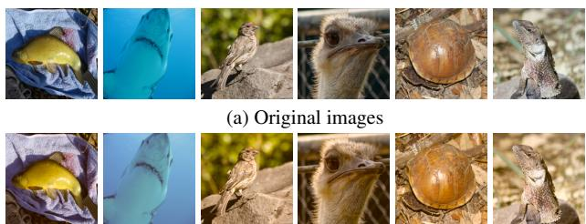  
(b) Triggered images of color backdoor  
Figure 1. Visual comparisons of the original images and triggered images from ImageNet.

Nevertheless, finding an appropriate trigger (color space shift) for color backdoor is non-trivial: a large shift makes the triggered samples less realistic (see Figure 4), while a small shift

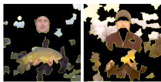  
Figure 2. LIME explanation. Left: clean image. Right: backdoor image

makes it difficult for the model to learn this feature, resulting in low effectiveness and robustness. To address this problem under the practical black-box setting1, we adopt Particle Swarm Optimization (PSO) [6], an effective gradient-free optimization algorithm, to systematically search for the optimal trigger. Specifically, we first use the backdoor loss of a semi-trained model (with surrogate model architecture) to efficiently estimate the effectiveness of a trigger. Then, we quantify the naturalness of a trigger through three popular similarity metrics, PSNR [42], SSIM [35] and LPIPS [42], based on which we define a naturalness restriction. After that, we add a penalty function of the naturalness restriction during the searching process of PSO and find the optimal trigger. Finally, the color backdoor is embedded into the victim model when training with the poisoned dataset.

We perform extensive experiments to demonstrate the superiority of PSO over other optimization algorithms. We show our color backdoor is more resilient against state-ofthe-art preprocessing-based defenses compared to existing attacks. Besides, it can also bypass other mainstream defenses including Neural Cleanse [34], Fine-Pruning [20], STRIP [8], Grad-Cam [29] and Spectral Signature [31].

## 2. Related Work

## 2.1. Backdoor Attacks

Gu et al. [9] presented the first backdoor attack against DNN models. They adopted pixel patches as the trigger to activate the backdoor in the model, where the malicious samples look suspicious, and can be easily recognized by humans. Recent works make progress in improving the attack stealthiness, which can be categorized as follows. (1) Invisible trigger: some works generate imperceptible perturbations as the backdoor trigger [2, 17, 46]. This is achieved by restricting the pixel differences between the original and triggered images. A number of attacks further enforce the consistency in the latent representation of the clean and triggered images for higher stealthiness by manipulating the training loss function to embed the backdoor [5,27,44]. (2) Natural trigger: some works propose to change the style of the images as the trigger, which can keep the images natural and less suspectable. Such natural trigger can be crafted with the natural reflection phenomenon [22], Instagram filter [21], generative adversarial network [3] and warping-based image transformation [24].

Unfortunately, these solutions bring several limitations when pursuing the stealthiness. In particular, (1) many attacks require a strong adversary model to have full control over the training process of the victim model [3, 5, 27, 44]. They cannot be applied to the more practical scenario, where the adversary can only poison the training data. (2) More importantly, a majority of the above works [2, 17, 21, 22, 24, 46] only focus on stealthiness while ignoring the backdoor robustness requirement. They become less effective if the defender performs some image transformation operations over the triggered samples (see Section 4.4.1 for evaluation results).

In fact, some attempts have been made to achieve robust backdoor, which still have some drawbacks. For instance, some works [19, 40] proposed to apply data augmentation over the poisoned samples. However, these attacks are not effective against other unconsidered augmentation operations, and they require a much higher poisoning rate2. Xu et al. [37] employed feature consistency training [33] in the training process to minimize the distance between triggered samples and their compressed versions in feature space, so the triggered samples after compression can still activate the backdoor. However, it still requires the adversary to manipulate the training process, and does not work for the data poisoning scenario.

## 2.2. Backdoor Defenses

Model reconstruction based methods. These approaches aim to remove the backdoor by reconstructing or fine-tuning the infected model. For instance, Fine-Pruning [20] prunes potential backdoored neurons according to their average activation values. Zhao et al. [43] proposed to employ the model connectivity technique [41] to eliminate the hidden backdoor in the infected model. Li et al. [18] and Yoshida et al. [38] suggested employing the model distillation technique [11] to purify backdoored models.

Trigger reconstruction based methods. This type of defense attempts to reconstruct the trigger at first, and then eliminate the backdoor by suppressing the effect of the reconstructed trigger. For instance, Neural Cleanse [34] optimizes a potential trigger pattern for each class, which can convert any clean image to that class. The model is identified as a backdoor model if there is a class that has a significantly smaller pattern than other classes.

Inference-time detection methods. These methods aim to distinguish whether an inference sample contains a malicious trigger or not. For example, STRIP [8] is based on the assumption that the backdoor trigger is robust and still effective when a triggered image is superimposed by a clean image. It superimposes some clean images on the target image separately and feeds them to the model for predictions. If the predictions for those superimposed images are persistent with low entropy, the model is identified as backdoored. Besides, heatmaps [29] are also employed to detect possible trigger regions.

Inference-time pre-processing methods. This type of defense adds a pre-processing procedure before the inference process, which aims to destroy the trigger in the malicious samples and prevent backdoor activation. For instance, Li et al. [19] employed flipping and padding after shrinking to invalidate the trigger in the inference samples. Deep-Sweep [25] considers a variety of data augmentation methods to fine-tune the infected model and process the inference samples. Besides, the commonly used image compression methods [37] are also effective in defeating most backdoor attacks.

## 3. Methodology

## 3.1. Threat Model and Attack Requirements

We consider a malicious data provider, who generates and injects a small number of poisoned samples (labeled with the target class) into the original training set, and releases or sells it to the public. A victim developer may obtain this dataset and trains his model, which will unconsciously be infected with a backdoor. The attacker is assumed to have no control of the training process or knowledge of the victim model. Note that this threat model is different from some backdoor attacks [3, 5, 27, 37, 44] that require a stronger adversary to manipulate the training process of the victim model. These attack approaches cannot be applied to the data poisoning scenario in our consideration, which is more practical.

A backdoor attack should have the following goals:

• Functionality-preserving. The embedded backdoor should have minor impact on the test accuracy of the victim model over clean samples.

• Effectiveness. The triggered sample should be misclassified into the target class with a high probability.

• Naturalness. The triggered sample should be naturallooking to evade human inspection during inference.

• Robustness. The attack should be still effective when triggered samples are processed by existing pre-processing operations. It cannot be defeated by existing mainstream defenses as well.

## 3.2. Attack Overview

As illustrated in Figure 2, neural networks can learn structural information of the images when performing classification tasks. Therefore, we design a novel color back door, which employs a uniform color space shift for all pixels as the trigger. As formulated in Equation (1), each pixel $p _ { i }$ and the color space shift t are treated as threedimensional vectors to represent the values of three components3 in the color space. All pixels are applied with a uniform color space shift for the triggered image.

$$
\begin{array} { r l } & { p _ { i } = ( p _ { i , 1 } , p _ { i , 2 } , p _ { i , 3 } ) , \quad t = ( t _ { 1 } , t _ { 2 } , t _ { 3 } ) } \\ & { p _ { i } ^ { \prime } = p _ { i } + t = ( p _ { i , 1 } + t _ { 1 } , p _ { i , 2 } + t _ { 2 } , p _ { i , 3 } + t _ { 3 } ) } \end{array}\tag{1}
$$

Figure 3 illustrates the workflow of our attack. Specifically, under the black-box setting1, we employ the gradientfree PSO algorithm [6] to find the optimal trigger t (i.e., color space shift) for color backdoor. PSO is an optimization algorithm that optimizes a problem by iteratively updating candidate solutions (or particles) with regard to a given measure of quality (i.e., the objective function), where each particle is a candidate trigger for our color backdoor. Firstly, we use the backdoor loss of a semi-trained surrogate model to measure the quality of a candidate trigger. Besides, to ensure the naturalness of the trigger, we first utilize three popular metrics, PSNR [42], SSIM [35] and LPIPS [42] to quantify the visual similarity between clean and triggered samples, based on which we define a naturalness restriction. After that, the optimal trigger can be found through PSO. Finally, the malicious data provider generates backdoor-triggered images as the poisoned dataset and releases it for public download. Models trained with this dataset will be infected with our color backdoor.

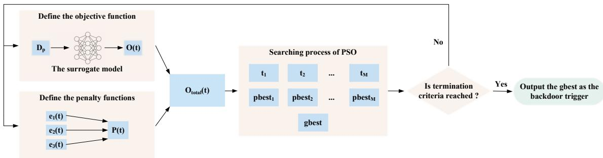  
Figure 3. The workflow of color backdoor.

Notably, there are also some adversarial attacks based on the color phenomena [12, 15, 45]. Our color backdoor attack is fundamentally different from them in the following aspects. (1) Technically, these attacks employed gradientbased methods to generate adversarial color-shifted images that mislead a normal model. In contrast, our attack follows the more realistic black-box setting1, and adopts a gradientfree optimization algorithm to find the optimal color shift as the backdoor trigger. (2) In terms of scenarios, these works target a clean model by applying the adversarial color shift on a given input image (image-specific). Our backdoor attack aims to embed the backdoor into the victim model, which can be triggered by the color shift on any input image (image-agnostic).

Below we describe the details of our methodology.

## 3.3. Defining the Objective Function of PSO

Since the poisoned data usually account for a small percentage and the functionality-preserving requirement can be easily satisfied, we use the attack effectiveness of the trigger t to measure its quality. The most straightforward way to measure the attack effectiveness of t is to train the victim model with the poisoned dataset and evaluate the attack success rate on triggered samples. However, training a backdoor model from scratch is an excessively time-consuming task and the adversary is assumed to have no knowledge of the victim model.

To address this problem, we leverage the speed-up methods for model performance estimation in Neural Architecture Search (NAS) [7]. Particularly, it has been observed that the training results of the first few epochs with a subtraining dataset can reflect the final training performance [26, 47]. Inspired by this, we propose to train a surrogate backdoored model $f _ { s }$ with the attacker’s poisoned dataset $D _ { p }$ for a few epochs. The training loss of the poisoned samples (which is referred to as the backdoor training loss $\mathcal { L } _ { b } )$ is used to efficiently estimate the effectiveness of the trigger. Thus, the objective function of PSO is defined as follows:

$$
O ( t ) = \mathcal { L } _ { b } = \sum _ { x \in D _ { p } } \subset \mathrm { E } ( f _ { s } ( x + t ) , y _ { t } )\tag{2}
$$

where CE represents the cross-entropy loss and $y _ { t }$ denotes the target label of the attack. A smaller backdoor training loss indicates the trigger is easier to be learned by the surrogate model, and the attack is more effective.

## 3.4. Enforcing the Naturalness of a Trigger

A large random color space shift may also achieve high attack effectiveness, but it may make the triggered samples less realistic (see Figure 4). In order to ensure the naturalness requirement, we employ three popular metrics, PSNR [42], SSIM [35] and LPIPS [42] to quantify the visual similarity between clean and triggered samples, based on which we define a naturalness restriction. Then, we define three penalty functions for the naturalness restriction:

$$
\begin{array} { r l } & { e _ { 1 } ( t ) = \operatorname* { m a x } ( 0 , \lambda _ { 1 } - \mathbb { P } \mathbb { S } \mathbb { N } \mathbb { R } ( t , S ) ) } \\ & { e _ { 2 } ( t ) = \operatorname* { m a x } ( 0 , \lambda _ { 2 } - \mathbb { S } \mathbb { S } \mathbb { I } \mathbb { M } ( t , S ) ) } \\ & { e _ { 3 } ( t ) = \operatorname* { m a x } ( 0 , \mathbb { L } \mathbb { P } \mathbb { I } \mathbb { P } S ( t , S ) - \lambda _ { 3 } ) } \end{array}\tag{3}
$$

where $\mathtt { P S N R } ( t , S ) , \mathtt { S S I M } ( t , S )$ and $\mathtt { L P I P S } ( t , S )$ represent the average similarity between clean samples and malicious samples containing the trigger t from the poisoned dataset. $\lambda _ { 1 , 2 , 3 }$ are the similarity thresholds for the three metrics. The penalty term represents the degree of naturalness restriction. It is greater than zero if the restriction is violated.

In order to balance the differences between the three naturalness restrictions, we also normalize the penalty terms and sum them up to obtain the total penalty term $P ( t )$

$$
P ( t ) = \sum _ { j = 1 } ^ { 3 } w _ { j } e _ { j } , \quad w _ { j } = \frac { \sum _ { i = 1 } ^ { M } e _ { j } \left( t _ { i } \right) } { \sum _ { j = 1 } ^ { 3 } \sum _ { i = 1 } ^ { M } e _ { j } \left( t _ { i } \right) }\tag{4}
$$

where M denotes the total number of candidate triggers. After that, we add the total penalty term to the objective function of the PSO:

$$
O _ { t o t a l } ( t ) = O ( t ) + P ( t )\tag{5}
$$

Besides, due to the naturalness restrictions, it is necessary to define the rule for PSO to measure the quality of the triggers, as follows:

• If both triggers $t _ { i }$ and $t _ { j }$ satisfy the naturalness restriction, we compare their objective function values $O _ { t o t a l } ( t _ { i } )$ and $O _ { t o t a l } ( t _ { j } )$ . The trigger with a smaller objective function value is superior.

• If both triggers $t _ { i }$ and $t _ { j }$ do not satisfy the naturalness restriction, we compare the penalty terms $P ( t _ { i } )$ and $P ( t _ { j } )$ The trigger with a smaller penalty term is superior,

• If trigger $t _ { i }$ satisfies the naturalness restriction while trigger $t _ { j }$ does not, then $t _ { i }$ is superior.

## 3.5. Searching Optimal Triggers Through PSO

Algorithm 1 Searching the optimal trigger   
Require: acceleration factors $c _ { 1 } , c _ { 2 } ;$ random numbers $r _ { 1 } .$ , r ; in  
ertia weight $\omega ;$ number of iteration T; number of particles in   
the swarm M   
Ensure: the optimal trigger for color backdoor   
1: Initialization process:   
2: for each particle $i = 1$ to M do   
3: Randomly initialize the particle position $t _ { i }$ and particle ve  
locity $v _ { i }$   
4: Calculate $O _ { t o t a l } ( t _ { i } )$ using Equation $5 .$   
5: Initialize pbest : pbest $\gets t _ { i }$   
6: end for   
7: Initialize gbest: gbest ← arg min $O _ { t o t a l } ( t _ { i } )$   
ti   
8: Searching process:   
9: for j = 1 to $T$ do   
10: for each particle $i = 1$ to M do   
11: $v _ { i }  \omega v _ { i } + c _ { 1 } r _ { 1 } ( p b e s t _ { i } - t _ { i } ) + c _ { 2 } r _ { 2 } ( g b e s t - t _ { i } )$   
12: $t _ { i } \gets t _ { i } + v _ { i }$   
13: Calculate $O _ { t o t a l } ( t _ { i } )$ using Equation 5.   
14: pbesti $ t _ { i } , \mathrm { i f } t _ { i }$ is superior to pbesti according to the   
defined rule   
15: gbest $ t _ { i } ,$ if $t _ { i }$ is superior to gbest according to the   
defined rule   
16: end for   
17: end for   
18: return gbest

The searching process of PSO is described in Algorithms 1. Specifically, we first randomly initialize numerous particles, including their positions and velocities. The position of each particle $t _ { i }$ represents a color space shift, which is a candidate backdoor trigger. Besides, pbesti (the best position that the i-th particle has experienced) is initialized as $t _ { i }$ and gbest (the best position that the whole group has experienced) is initialized through measuring the objective function values of all particles. After initialization, we update the particles iteratively for T rounds. Finally, the final gbest is returned as the optimal trigger, which is used by the adversary to generate a poisoned dataset.

## 4. Evaluation

## 4.1. Experimental Setup

Our color backdoor attack is general for various computer vision tasks, models and datasets. Without loss of generality, we perform our evaluations over the CIFAR-10, GTSRB, CIFAR-100 and ImageNet datasets on ResNet-18, VGG16, ResNet-34 and ResNet-34 models, respectively. For the functionality-preserving requirement, we measure the test accuracy of the infected model on clean samples (ACC). For the attack effectiveness requirement, we compute the ratio of triggered samples that are misclassified to the target attack class by the infected model (ASR). The poisoning rate is set to 5% and the first class of each dataset is chosen as the target attack label. Six commonly used color spaces (RGB, HSV, LAB, YCbCr, XYZ, LUV) are considered for color backdoor attack and we present the results in the LUV color space as an example4. More details of attack configuration are also provided in the appendix. We would like to emphasize that our color backdoor can also be implemented in the physical world and gray images (e.g., the MNIST and FashionMNIST datasets). Please check the appendix for the evaluation results.

## 4.2. Effectiveness Evaluation

Performance of PSO. We perform extensive experiments to demonstrate the superiority of PSO in terms of trigger selection effectiveness and efficiency compared with other optimization algorithms. Specifically, we replace the PSO with Genetic Algorithm5 (GA) [4], grid-search, and random-selection, respectively to search the optimal triggers, and measure the corresponding backdoor ASR. The results are shown in Table 1. We observe that GA, PSO and grid-search can achieve good attack effectiveness, while the ASR of the random-selection method is significantly lower.

Additionally, we measure the computation overhead of these methods. Table 2 shows the searching hours to generate the poisoning set for each dataset. We can see that grid-search and GA have larger computation cost compared with PSO. Based on these two tables, PSO demonstrates superiority over other optimization methods, and is adopted in our color backdoor attack.

Impact of poisoning rates. We evaluate the attack performance of color backdoor with different poisoning rates. The result in Table 3 indicates that the color backdoor attacks still have high ASR when the poisoning rate is 3%, which demonstrates the effectiveness of color backdoor. Besides, we observe that increasing the poisoning rate can achieve a higher ASR, but a lower ACC, which may undermine the functionality-preserving requirement. Therefore, we set the poisoning rate to 5% in the following experiments.

Table 1. ASR of the color backdoor attacks with different trigger search optimization algorithms
<table><tr><td>Dataset</td><td rowspan="2">CIFAR-10</td><td rowspan="2">CIFAR-100</td><td rowspan="2">GTSRB</td><td rowspan="2">ImageNet</td></tr><tr><td>Method</td></tr><tr><td>PSO</td><td>97.55</td><td>96.27</td><td>99.70</td><td>98.16</td></tr><tr><td>GA</td><td>95.90</td><td>96.41</td><td>98.87</td><td>99.27</td></tr><tr><td>Grid-search</td><td>98.17</td><td>98.01</td><td>99.24</td><td>99.39</td></tr><tr><td>Random</td><td>92.02</td><td>83.54</td><td>91.33</td><td>87.09</td></tr></table>

Table 2. Trigger searching hours of different algorithms
<table><tr><td>Dataset Method</td><td>CIFAR-10</td><td>CIFAR-100</td><td>GTSRB</td><td>ImageNet</td></tr><tr><td>PSO</td><td>1.79 h</td><td>3.71 h</td><td>1.81 h</td><td>3.79 h</td></tr><tr><td>GA</td><td>3.22 h</td><td>6.30 h</td><td>3.17 h</td><td>6.89 h</td></tr><tr><td>Grid-search</td><td>5.33 h</td><td>10.97 h</td><td>5.43 h</td><td>11.68 h</td></tr><tr><td>Random</td><td></td><td></td><td></td><td></td></tr></table>

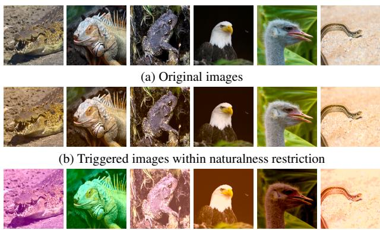  
(c) Triggered images without naturalness restriction  
Figure 4. Triggered images of color backdoor within and without naturalness restriction.

## 4.3. Naturalness Evaluation

Naturalness restriction is added in the searching process of PSO to ensure the naturalness of the triggered images. We conduct experiments to show their indispensability in finding appropriate triggers for color backdoor. Figure 4 compare with the clean images and the generated triggered images within and without the naturalness restriction. It can be seen that the identified color space shift without the naturalness awareness makes the triggered images less realistic. In contrast, with the naturalness restriction, the synthesized triggered images maintain natural-looking. This indicates that the naturalness restriction is important to ensure the naturalness requirement.

We also conduct experiments to illustrate the difference between the original images and the triggered images generated by color backdoor and other state-of-the-art invisible backdoor attacks (see Figure 5). We observe that the difference between the original images and our triggered image is a global shift in color space, which is imperceptible to the defender who has no knowledge of the original image. Our triggered image looks more natural than Refool, Blend, Filter, and the experimental results in Section 4.4.1 demonstrate that color backdoor is more robust than these backdoor attacks against preprocessing-based defenses.

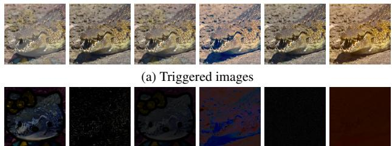  
(b) The magnified (×1.5) difference between the triggered images and the original images  
Figure 5. Different columns represent different invisible backdoor methods: (i) Refool [22], (ii) WaNet [24], (iii) Blend [2], (iv) Filter [21], (v) L2-norm [17], (vi) Color backdoor.

## 4.4. Robustness Evaluation

We evaluate the robustness of color backdoor on CIFAR-10 and CIFAR-100 datasets as examples. More experimental results for other datasets are provided in the appendix.

## 4.4.1 Preprocessing-based Defenses

We first consider the preprocessing-based defenses, which are particularly effective for mitigating invisible backdoor attacks. Three state-of-the-art approaches are evaluated in our experiments: (1) DeepSweep [25]: we employ two data augmentation methods to fine-tune the victim model for 5 epochs and pre-process the testing samples, respectively. The concrete data augmentation methods are selected following [25]. (2) ShrinkPad [19]: the testing images are padded with pixels with a value of zero after shrinking with 2 pixels. (3) Image compression [37]: we use the JPEG compression [32] to compress all the testing images with 75% compression quality before prediction. Existing poisoning backdoor attacks, including BadNet [9], Blend [2], Input-aware [23], WaNet [24], Refool [22], L0-norm [17], L2-norm [17] and Filter [21], are included as baselines to evaluate the robustness6.

Table 4 shows the robustness evaluation results for CI-FAR10. It is obvious that prior state-of-the-art backdoor attacks are vulnerable to most preprocessing-based defenses: the ASR of backdoor attacks with traditional additive triggers (such as BadNet and $L _ { \mathrm { { 2 } } } \mathrm { { - n o r m } ) }$ drops significantly when image transformation operations are applied to the inference images. Some backdoor attacks with natural triggers (such as Filter) remain robust against most preprocessing-based defenses, but are vulnerable to image compression. On the contrary, color backdoor remains its robustness and has the highest ASR against all these preprocessing-based defenses. This is because Filter backdoor adopts fixed filter features as the backdoor trigger, while our attack searches for the optimal trigger by estimating its effectiveness (and robustness). The robustnessguided searching process (within a pre-defined naturalness restriction) makes it more robust and natural.

Table 3. ACC and ASR of the color backdoor attack with different poisoning rates
<table><tr><td rowspan=2 colspan=1>DatasetPoisoning rate</td><td rowspan=1 colspan=1>CIFAR-10</td><td rowspan=1 colspan=4>CIFAR-100</td><td rowspan=1 colspan=1>GTSRB</td><td rowspan=1 colspan=2>ImageNet</td></tr><tr><td rowspan=1 colspan=1>ACC  ASR</td><td rowspan=1 colspan=4>ACC  ASR</td><td rowspan=1 colspan=1>ACC  ASR</td><td rowspan=1 colspan=2>ACC  ASR</td></tr><tr><td rowspan=1 colspan=1>No attack</td><td rowspan=1 colspan=1>90.05    -</td><td rowspan=1 colspan=4>66.86    -</td><td rowspan=1 colspan=1>93.33    -</td><td rowspan=1 colspan=2>71.67    -</td></tr><tr><td rowspan=1 colspan=1>3%</td><td rowspan=1 colspan=1>89.93 93.77</td><td rowspan=2 colspan=4>66.45 93.2596.27</td><td rowspan=2 colspan=1>93.21 95.0493.36 99.70</td><td rowspan=1 colspan=2>70.28 96.44</td></tr><tr><td rowspan=2 colspan=1>5%8%</td><td rowspan=1 colspan=1>89.77 97.55</td><td rowspan=1 colspan=2>65.86</td><td rowspan=1 colspan=2>96.2</td><td rowspan=1 colspan=1>69.11</td><td rowspan=1 colspan=1>98.16</td></tr><tr><td rowspan=1 colspan=1>89.45 98.45</td><td rowspan=1 colspan=4>65.77 98.51</td><td rowspan=1 colspan=1>91.55 99.43</td><td rowspan=1 colspan=2>68.75 99.01</td></tr><tr><td rowspan=1 colspan=1>10%</td><td rowspan=1 colspan=1>87.61 99.03</td><td rowspan=1 colspan=4>64.03 98.84</td><td rowspan=1 colspan=1>87.60 99.89</td><td rowspan=1 colspan=2>66.53 99.17</td></tr></table>

Table 4. Robustness against preprocessing-based defenses (CIFAR-10).
<table><tr><td rowspan="2">Defense Attack</td><td colspan="2">No defense</td><td colspan="2">DeepSweep</td><td colspan="2">ShrinkPad</td><td colspan="2">Compression</td><td rowspan="2">Average ASR</td></tr><tr><td>ACC</td><td>ASR</td><td>ACC</td><td>ASR</td><td>ACC</td><td>ASR</td><td>ACC</td><td>ASR</td></tr><tr><td>BadNet</td><td>89.20</td><td>99.98</td><td>84.57</td><td>54.64</td><td>85.74</td><td>75.20</td><td>81.15</td><td>41.56</td><td>67.85</td></tr><tr><td>Blend</td><td>90.16</td><td>96.03</td><td>85.98</td><td>53.20</td><td>86.96</td><td>17.25</td><td>81.36</td><td>16.72</td><td>45.80</td></tr><tr><td>Input-aware</td><td>94.39</td><td>98.79</td><td>91.59</td><td>42.04</td><td>88.07</td><td>32.69</td><td>81.71</td><td>49.72</td><td>55.81</td></tr><tr><td>WaNet</td><td>91.92</td><td>96.14</td><td>90.21</td><td>45.66</td><td>87.81</td><td>57.13</td><td>84.15</td><td>13.05</td><td>53.00</td></tr><tr><td>Refool</td><td>88.66</td><td>92.47</td><td>82.65</td><td>86.37</td><td>85.53</td><td>93.51</td><td>81.60</td><td>44.57</td><td>79.23</td></tr><tr><td> $L _ { \mathrm { 0 } } – \mathrm { n o r m }$ </td><td>87.35</td><td>77.63</td><td>84.38</td><td>19.89</td><td>83.18</td><td>43.30</td><td>80.09</td><td>35.06</td><td>43.97</td></tr><tr><td> $L _ { 2 } \mathrm { - n o r m }$ </td><td>90.19</td><td>99.86</td><td>85.93</td><td>15.73</td><td>86.71</td><td>12.21</td><td>84.15</td><td>9.23</td><td>34.26</td></tr><tr><td>Filter</td><td>89.91</td><td>99.14</td><td>83.64</td><td>85.56</td><td>85.90</td><td>92.57</td><td>82.95</td><td>23.16</td><td>75.11</td></tr><tr><td>color backdoor</td><td>89.77</td><td>97.55</td><td>85.50</td><td>87.64</td><td>86.15</td><td>93.61</td><td>81.78</td><td>96.89</td><td>93.92</td></tr></table>

Input-aware and WaNet are trained on PreActResNet-18/34, following the default settings in [23, 24].

## 4.4.2 Other Mainstream Defenses

Neural Cleanse [34] quantifies the suspicion of a model by calculating an anomaly score and the model with an anomaly score greater than 2 will be identified as a backdoored model. As shown in Figure 6a, the anomaly score of the color backdoored model is very close to that of the clean model and less than 2, indicating the ineffectiveness of Neural Cleanse in identifying color backdoor. This is because the trigger reconstruction process of Neural Cleanse is to discover the potential adversarial patch. However, the trigger of color backdoor is more like a transformation function, rather than a static feature. This makes Neural Cleanse fail to reconstruct the trigger of color backdoor.

Grad-Cam [29] visualizes the network behavior on an inference image and detects potential trigger regions. Figure 6b (from left to right) shows the clean images and triggered images of BadNet, L -norm and color backdoor in the first row, as well as the corresponding heatmaps in the second row. We observe that Grad-Cam is able to distinguish trigger regions of small additive backdoor triggers. However, the heatmaps of the triggered image generated by color backdoor are similar to that of the original image: both are focused in the center of the image. The reason is that color backdoor is based on the global color space transformation on the entire image, which breaks the underlying assumption of Grad-Cam that relies on identifying a small, unusual region that significantly determines the prediction results.

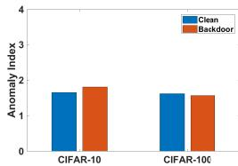  
(a) Neural Cleanse

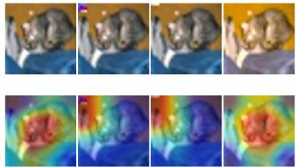  
(b) Grad-Cam

Figure 6. Neural Cleanse and Grad-Cam.  
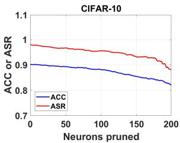

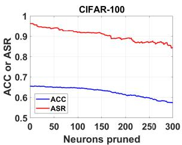  
Figure 7. Fine-pruning.

Fine-Pruning [20] prunes neurons according to their average activation values to mitigate backdoor behaviors. Figure 7 plots the ACC of clean samples and ASR of triggered samples with different numbers of pruned neurons, where the last convolutional layer is selected for pruning and the pruning stops when the ACC drops more than 8%. We observe that the ASR is always higher than ACC, making backdoor mitigation impossible.

STRIP [8] identifies a backdoored model if the predictions of superimposed images are persistent with low entropy. Figure 8 shows the results of STRIP, where we compare the entropy distributions of a clean sample and a triggered sample. We observe that these two samples have very similar distributions so STRIP is not able to distinguish which inference sample is malicious. This is because the operation of superimposing destroys the trigger of color backdoor, thus the prediction of the superimposing of a triggered sample and a clean sample will also change significantly, which is the same as the clean case.

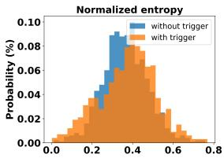

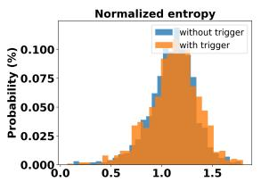  
Figure 8. STRIP for CIFAR-10 (left) and CIFAR-100 (right).

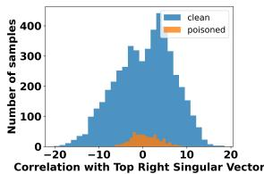

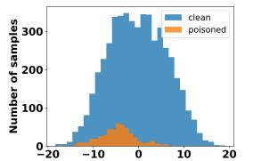  
Figure 9. Spectral Signature for CIFAR-10 (left) and CIFAR-100 (right).

Spectral Signature [31] is a defense method that distinguishes the backdoor-triggered samples using the latent space features. Following the same experimental settings in [31], we randomly select 5,000 clean samples and 500 triggered samples for each dataset and plot the histograms of the correlation scores for both sets of samples. As illustrated in Figure 9, there is no clear separation between the scores of the triggered samples and clean samples, making Spectral Signature ineffective in detecting our colortriggered samples. According to [24], it is mainly because the traditional backdoor attacks have local additive triggers, which affect a small number of neurons, leading to a difference from the correlation distribution of normal samples. However, our color backdoor has a global effect on the features of the sample, and hence a global impact on most neurons, making the distribution difference indistinguishable.

## 4.4.3 Adaptive Defenses

We consider an adaptive defense against our color backdoor attack, where the defender performs a random color space shift over each inference sample7 (since he does not know the shift searched by the attacker) before sending it to the infected model. Figure 10 shows the ACC and ASR of 50 repeated experiments. Due to the randomness of this color space pre-processing method, the defense effect is very unstable: the ASR drops significantly in some cases while remaining high in other cases. The ACC is also affected to varied extents. We find that this defense is effective only when the directions of the random shift and the trigger are opposite, thus causing the color space shift to cancel each other out. Otherwise, the defense effect is not obvious or even has an opposite effect (i.e., ASR increases and ACC drops). Therefore, preprocessing of random color space shift is far from an effective defense against our attack.

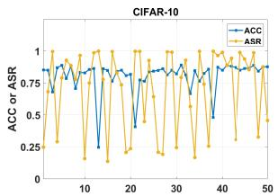

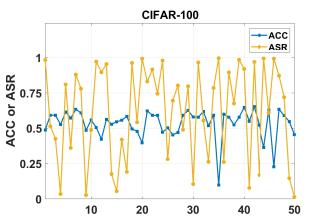  
Figure 10. The defense effect of the random color space shift.

Table 5. Attack performance of our color backdoor with color space augmentation.
<table><tr><td rowspan="2">Color space</td><td colspan="2">CIFAR10</td><td colspan="2">CIFAR100</td></tr><tr><td>ACC</td><td>ASR</td><td>ACC</td><td>ASR</td></tr><tr><td>No attack</td><td>90.05</td><td></td><td>66.86</td><td></td></tr><tr><td>RGB</td><td>87.15</td><td>86.01</td><td>63.79</td><td>84.75</td></tr><tr><td>HSV</td><td>87.43</td><td>81.62</td><td>65.04</td><td>80.43</td></tr><tr><td>LAB</td><td>89.01</td><td>93.10</td><td>64.41</td><td>85.26</td></tr><tr><td>YCbCr</td><td>89.81</td><td>87.89</td><td>65.44</td><td>85.94</td></tr><tr><td>XYZ</td><td>89.53</td><td>96.80</td><td>64.87</td><td>90.17</td></tr><tr><td>LUV</td><td>88.17</td><td>91.09</td><td>64.59</td><td>88.32</td></tr></table>

Color space augmentation is another adaptive defense against color backdoor. We perform the data augmentation with hue and saturation during the training process, where the change ranges of both hue and saturation are set to 30%. The results in Table 5 indicates that color backdoor attack can still achieve high ASR under this color space augmentation. This is because the triggered image and the original image have two extremely different color styles. They fall into two different color style distributions after a random color augmentation. Thus, the model still connects the target label with the color style distribution of the triggered images, and they can still activate the backdoor.

## 5. Conclusion

In this work, we propose a robust backdoor, which employs a uniform color space shift for all pixels as the trigger. The triggered images maintain natural-looking and can bypass the inspection of the defender. The PSO algorithm is employed to optimize the trigger to achieve a robust backdoor attack. Extensive experiments demonstrate the superiority of PSO and the robustness of our color backdoor attack against preprocessing-based defenses as well as other mainstream backdoor defenses.

## References

[1] Jonathan Bragg, Arman Cohan, Kyle Lo, and Iz Beltagy. Flex: Unifying evaluation for few-shot nlp. Proceedings of NIPS, 34, 2021. 1

[2] Xinyun Chen, Chang Liu, Bo Li, Kimberly Lu, and Dawn Song. Targeted backdoor attacks on deep learning systems using data poisoning. arXiv preprint arXiv:1712.05526, 2017. 1, 2, 6

[3] Siyuan Cheng, Yingqi Liu, Shiqing Ma, and Xiangyu Zhang. Deep feature space trojan attack of neural networks by controlled detoxification. In Proceedings of AAAI, volume 35, pages 1148–1156, 2021. 1, 2, 3, 6

[4] Dogan Corus, Duc-Cuong Dang, Anton V Eremeev, and Per Kristian Lehre. Level-based analysis of genetic algorithms and other search processes. IEEE Transactions on Evolutionary Computation, 22(5):707–719, 2017. 5

[5] Khoa Doan, Yingjie Lao, and Ping Li. Backdoor attack with imperceptible input and latent modification. In Proceedings ofNIPS, volume 34, pages 18944–18957, 2021. 1, 2, 3, 6

[6] Russell Eberhart and James Kennedy. A new optimizer using particle swarm theory. In MHS’95. Proceedings of the Sixth International Symposium on Micro Machine and Human Science, pages 39–43. Ieee, 1995. 2, 3

[7] Thomas Elsken, Jan Hendrik Metzen, and Frank Hutter. Neural architecture search: A survey. The Journal of Machine Learning Research, 20(1):1997–2017, 2019. 4

[8] Yansong Gao, Change Xu, Derui Wang, Shiping Chen, Damith C Ranasinghe, and Surya Nepal. Strip: A defence against trojan attacks on deep neural networks. In Proceedings ofthe 35th Annual Computer Security Applications Conference, pages 113–125, 2019. 2, 3, 7

[9] Tianyu Gu, Kang Liu, Brendan Dolan-Gavitt, and Siddharth Garg. Badnets: Evaluating backdooring attacks on deep neural networks. IEEE Access, 7:47230–47244, 2019. 1, 2, 6

[10] Kaiming He, Xiangyu Zhang, Shaoqing Ren, and Jian Sun. Deep residual learning for image recognition. In Proceedings ofCVPR, pages 770–778, 2016. 1

[11] Geoffrey Hinton, Oriol Vinyals, Jeff Dean, et al. Distilling the knowledge in a neural network. arXiv preprint arXiv:1503.02531, 2(7), 2015. 3

[12] Hossein Hosseini and Radha Poovendran. Semantic adversarial examples. In Proceedings of CVPR Workshops, June 2018. 2, 4

[13] Wenbo Jiang, Hongwei Li, Sen Liu, Xizhao Luo, and Rongxing Lu. Poisoning and evasion attacks against deep learning algorithms in autonomous vehicles. IEEE transactions on vehicular technology, 69(4):4439–4449, 2020. 1

[14] Wenbo Jiang, Tianwei Zhang, Han Qiu, Hongwei Li, and Guowen Xu. Incremental learning, incremental backdoor threats. IEEE Transactions on Dependable and Secure Computing, pages 1–11, 2022. 1

[15] Cassidy Laidlaw and Soheil Feizi. Functional adversarial attacks. In Proceedings ofNIPS, volume 32, 2019. 4

[16] Yichong Leng, Xu Tan, Linchen Zhu, Jin Xu, Renqian Luo, Linquan Liu, Tao Qin, Xiangyang Li, Edward Lin, and Tie-Yan Liu. Fastcorrect: Fast error correction with edit align-

ment for automatic speech recognition. In Proceedings of NIPS, volume 34, 2021. 1

[17] Shaofeng Li, Minhui Xue, Benjamin Zi Hao Zhao, Haojin Zhu, and Xinpeng Zhang. Invisible backdoor attacks on deep neural networks via steganography and regularization. IEEE Transactions on Dependable and Secure Computing, 18(5):2088–2105, 2020. 1, 2, 6

[18] Yige Li, Xixiang Lyu, Nodens Koren, Lingjuan Lyu, Bo Li, and Xingjun Ma. Neural attention distillation: Erasing backdoor triggers from deep neural networks. arXiv preprint arXiv:2101.05930, 2021. 3

[19] Yiming Li, Tongqing Zhai, Baoyuan Wu, Yong Jiang, Zhifeng Li, and Shutao Xia. Rethinking the trigger of backdoor attack. arXiv preprint arXiv:2004.04692, 2020. 1, 2, 3, 6

[20] Kang Liu, Brendan Dolan-Gavitt, and Siddharth Garg. Finepruning: Defending against backdooring attacks on deep neural networks. In International Symposium on Research in Attacks, Intrusions, and Defenses, pages 273–294. Springer, 2018. 2, 3, 7

[21] Yingqi Liu, Wen-Chuan Lee, Guanhong Tao, Shiqing Ma, Yousra Aafer, and Xiangyu Zhang. Abs: Scanning neural networks for back-doors by artificial brain stimulation. In Proceedings ofCCS, pages 1265–1282, 2019. 1, 2, 6

[22] Yunfei Liu, Xingjun Ma, James Bailey, and Feng Lu. Reflection backdoor: A natural backdoor attack on deep neural networks. In Proceedings of ECCV, pages 182–199, 2020. 1, 2, 6

[23] Tuan Anh Nguyen and Anh Tran. Input-aware dynamic backdoor attack. In Proceedings of NIPS, volume 33, pages 3454–3464, 2020. 6, 7

[24] Tuan Anh Nguyen and Anh Tuan Tran. Wanet-imperceptible warping-based backdoor attack. In Proceedings of ICLR, 2020. 2, 6, 7, 8

[25] Han Qiu, Yi Zeng, Shangwei Guo, Tianwei Zhang, Meikang Qiu, and Bhavani Thuraisingham. Deepsweep: An evaluation framework for mitigating dnn backdoor attacks using data augmentation. In Proceedings of Asia CCS, pages 363– 377, 2021. 1, 3, 6

[26] Esteban Real, Alok Aggarwal, Yanping Huang, and Quoc V Le. Regularized evolution for image classifier architecture search. In Proceedings of AAAI, volume 33, pages 4780– 4789, 2019. 4

[27] Yankun Ren, Longfei Li, and Jun Zhou. Simtrojan: Stealthy backdoor attack. In 2021 IEEE International Conference on Image Processing (ICIP), pages 819–823. IEEE, 2021. 1, 2, 3, 6

[28] Marco Tulio Ribeiro, Sameer Singh, and Carlos Guestrin. ” why should i trust you?” explaining the predictions of any classifier. In Proceedings of the 22nd ACM SIGKDD international conference on knowledge discovery and data mining, pages 1135–1144, 2016. 2

[29] Ramprasaath R Selvaraju, Michael Cogswell, Abhishek Das, Ramakrishna Vedantam, Devi Parikh, and Dhruv Batra. Grad-cam: Visual explanations from deep networks via gradient-based localization. In Proceedings of ICCV, pages 618–626, 2017. 2, 3, 7

[30] Giorgio Severi, Jim Meyer, Scott Coull, and Alina Oprea. {Explanation-Guided} backdoor poisoning attacks against malware classifiers. In Proceedings of USENIX Security Symposium, pages 1487–1504, 2021. 1

[31] Brandon Tran, Jerry Li, and Aleksander Madry. Spectral signatures in backdoor attacks. In Proceedings of NIPS, volume 31, 2018. 2, 8

[32] Gregory K Wallace. The jpeg still picture compression standard. IEEE transactions on consumer electronics, 38(1):1– 17, 1992. 6

[33] Sheng Wan, Tung-Yu Wu, Heng-Wei Hsu, Wing Hung Wong, and Chen-Yi Lee. Feature consistency training with jpeg compressed images. IEEE Transactions on Circuits and Systemsfor Video Technology, 30(12):4769–4780, 2019. 2

[34] Bolun Wang, Yuanshun Yao, Shawn Shan, Huiying Li, Bimal Viswanath, Haitao Zheng, and Ben Y Zhao. Neural cleanse: Identifying and mitigating backdoor attacks in neural networks. In Proceedings ofS&P, pages 707–723, 2019. 2, 3, 7

[35] Zhou Wang, Alan C Bovik, Hamid R Sheikh, and Eero P Simoncelli. Image quality assessment: from error visibility to structural similarity. IEEE transactions on image processing, 13(4):600–612, 2004. 2, 3, 4

[36] Emily Wenger, Josephine Passananti, Arjun Nitin Bhagoji, Yuanshun Yao, Haitao Zheng, and Ben Y Zhao. Backdoor attacks against deep learning systems in the physical world. In Proceedings of CVPR, pages 6206–6215, 2021. 1

[37] Mingfu Xue, Xin Wang, Shichang Sun, Yushu Zhang, Jian Wang, and Weiqiang Liu. Compression-resistant backdoor attack against deep neural networks. arXiv preprint arXiv:2201.00672, 2022. 1, 2, 3, 6

[38] Kota Yoshida and Takeshi Fujino. Disabling backdoor and identifying poison data by using knowledge distillation in backdoor attacks on deep neural networks. In Proceedings ofthe 13th ACM Workshop on Artificial Intelligence and Security, pages 117–127, 2020. 3

[39] Tongqing Zhai, Yiming Li, Ziqi Zhang, Baoyuan Wu, Yong Jiang, and Shu-Tao Xia. Backdoor attack against speaker verification. In Proceedings of ICASSP, pages 2560–2564. IEEE, 2021. 1

[40] Jie Zhang, Dongdong Chen, Jing Liao, Qidong Huang, Gang Hua, Weiming Zhang, and Nenghai Yu. Poison ink: Robust and invisible backdoor attack. arXiv preprint arXiv:2108.02488, 2021. 2

[41] Michael Zhang, James Lucas, Jimmy Ba, and Geoffrey E Hinton. Lookahead optimizer: k steps forward, 1 step back. Proceedings ofNIPS, 32, 2019. 3

[42] Richard Zhang, Phillip Isola, Alexei A Efros, Eli Shechtman, and Oliver Wang. The unreasonable effectiveness of deep features as a perceptual metric. In Proceedings of CVPR, pages 586–595, 2018. 2, 3, 4

[43] Pu Zhao, Pin-Yu Chen, Payel Das, Karthikeyan Natesan Ramamurthy, and Xue Lin. Bridging mode connectivity in loss landscapes and adversarial robustness. In Proceedings of ICLR, 2020. 3

[44] Zhendong Zhao, Xiaojun Chen, Yuexin Xuan, Ye Dong, Dakui Wang, and Kaitai Liang. Defeat: Deep hidden feature

backdoor attacks by imperceptible perturbation and latent representation constraints. In Proceedings of CVPR, pages 15213–15222, 2022. 1, 2, 3, 6

[45] Zhengyu Zhao, Zhuoran Liu, and Martha Larson. Towards large yet imperceptible adversarial image perturbations with perceptual color distance. In Proceedings of CVPR, June 2020. 4

[46] Haoti Zhong, Cong Liao, Anna Cinzia Squicciarini, Sencun Zhu, and David Miller. Backdoor embedding in convolutional neural network models via invisible perturbation. In Proceedings of the Tenth ACM Conference on Data and Application Security and Privacy, pages 97–108, 2020. 1, 2

[47] Barret Zoph, Vijay Vasudevan, Jonathon Shlens, and Quoc V Le. Learning transferable architectures for scalable image recognition. In Proceedings of CVPR, pages 8697–8710, 2018. 4