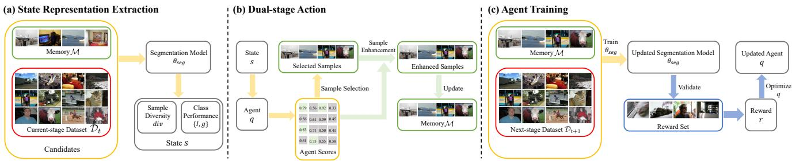
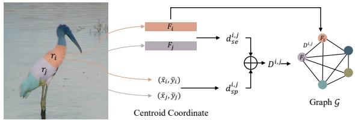
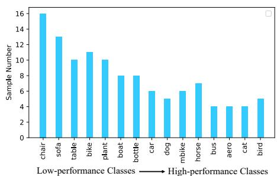
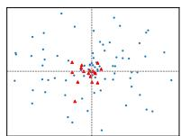
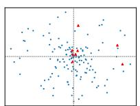
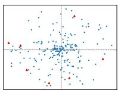

# Continual Semantic Segmentation with Automatic Memory Sample Selection

Lanyun Zhu1\* Tianrun Chen2\* Jianxiong Yin3 Simon See3 Jun Liu1†

Singapore University of Technology and Design 1 Zhejiang University 2 NVIDIA AI Tech Centre 3

lanyun zhu@mymail.sutd.edu.sg tianrun.chen@zju.edu.cn

{jianxiongy, ssee}@nvidia.com jun liu@sutd.edu.sg

## Abstract

Continual Semantic Segmentation (CSS) extends static semantic segmentation by incrementally introducing new classesfor training. To alleviate the catastrophicforgetting issue in CSS, a memory buffer that stores a small number of samples from the previous classes is constructed for replay. However, existing methods select the memory samples either randomly or based on a single-factor-driven handcrafted strategy, which has no guarantee to be optimal. In this work, we propose a novel memory sample selection mechanism that selects informative samplesfor effective replay in a fully automatic way by considering comprehensive factors including sample diversity and class performance. Our mechanism regards the selection operation as a decision-making process and learns an optimal selection policy that directly maximizes the validation performance on a reward set. To facilitate the selection decision, we design a novel state representation and a dual-stage action space. Our extensive experiments on Pascal-VOC 2012 and ADE 20K datasets demonstrate the effectiveness of our approach with state-of-the-art (SOTA) performance achieved, outperforming the second-place one by 12.54% for the 6- stage setting on Pascal-VOC 2012.

## 1. Introduction

Semantic segmentation is an important task with a lot of applications. The rapid development of algorithms [11, 20, 22, 30, 32, 56] and the growing number of publicly available large datasets [14, 55] have led to great success in the field. However, in many scenarios, the static model cannot always meet real-world demands, as the constantly changing environment calls for the model to be constantly updated to deal with new data, sometimes with new classes.

A naive solution is to apply continual learning by incrementally adding new classes to train the model. However, it is not simple as it looks – almost every time, since the previous classes are inaccessible in the new stage, the model forgets the information of them after training for the new classes. This phenomenon, namely catastrophic forgetting, has been a long-standing issue in the field. Furthermore, the issue is especially severe in dense prediction tasks like semantic segmentation.

Facing the issue, existing works [1, 4, 5, 7, 17, 25, 26, 38, 43] propose to perform exemplar replay by introducing a memory buffer to store some samples from previous classes. By doing so, the model can be trained with samples from both current and previous classes, resulting in better generalization. However, since the number of selected samples in the memory is much smaller than those within the new classes, the selected samples are easy to be ignored or cause overfitting when training due to the small number. Careful selection of the samples is required, which naturally brings the question: How to select the best samples for replay?

Some attempts have been made to answer the question, aiming to seek the most effective samples for replay. Researchers propose different criteria that are mostly manually designed based on some heuristic factors like diversity [1, 4, 5, 25, 26, 38, 43]. For example, [33] selects the most common samples with the lowest diversity for replay, believing that the most representative samples will elevate the effectiveness of replay. However, the most common samples may not always be the samples being forgotten in later stages. [4] proposes to save both the low-diversity samples near the distribution center and high-diversity samples near the classification boundaries. However, new challenges arise since the memory length is limited, so it is challenging to find the optimal quotas for the two kinds of samples to promote replay effectiveness to the greatest extent. Moreover, most of the existing methods are designed based on a single factor, the selection performance, however, can be influenced by many factors with complicated relationships. For example, besides diversity, memory sample selection should also be class-dependent because the hard classes need more samples to replay in order to alleviate the more severe catastrophic forgetting issue. Therefore, we argue that it is necessary to select memory samples in a more intelligent way by considering the more comprehensive factors and their complicated relationships.

Witnessing the challenge, in this work, we propose a novel automatic sample selection mechanism for CSS. Our key insight is that selecting memory samples can be regarded as a decision-making task in different training stages, so we formulate the sample selection process as a Markov Decision Process, and we propose to solve it automatically with a reinforcement learning (RL) framework. Specifically, we employ an agent network to make the selection decision, which receives the state representation as the input and selects optimal samples for replay. To help the agent make wiser decisions, we construct a novel and comprehensive state combined with the sample diversity and class performance features. In the process of state computation, the inter-sample similarity needs to be measured. We found the naive similarity measurement by computing the prototype distance is ineffective in segmentation, as the prototype losses the local structure details that are important for making pixel-level predictions. Therefore, we propose a novel similarity measured in a multi-structure graph space to get a more informative state. We further propose a dualstage action space, in which the agent not only selects the most appropriate samples to update the memory, but also enhances the selected samples to have better replay effectiveness in a gradient manner. All the careful designs allow the RL mechanism to be effective in solving the sample selection problem for CSS.

We perform extensive experiments on Pascal-VOC 2012 and ADE 20K datasets, which demonstrate the effectiveness of our proposed novel paradigm for CSS. Benefiting from the reward-driven optimization, the automatically learned policy can help select the more effective samples, thus resulting in better performance than the previous strategies. On both datasets, our method achieves state-of-the-art (SOTA) performance. To summarize, our contributions are as follows:

• We formulate the sample selection of CSS as a Markov Decision Process, and introduce a novel and effective automatic paradigm for sample replay in CSS enabled by reinforcement learning.

• We design an effective RL paradigm tailored for CSS, with novel state representations containing multiple factors that can guide the selection decision, and a dual-stage action space to select samples and boost their replay effectiveness.

• Extensive experiments demonstrate our automatic paradigm for sample replay can effectively alleviate the catastrophic forgetting issue with state-of-the-art (SOTA) performance achieved.

## 2. Related Work

Semantic Segmentation and Continual Semantic Segmentation. Semantic segmentation is a basic task in computer vision and has achieved great success in recent years benefiting from the rapid development of deep-learned based algorithms such as encoder-decoder structure [3, 18, 30, 39, 50], dilated convolution [9–12], pyramid structure [11, 12, 53, 56], attention mechanism [19, 52, 57] and transformers [13, 42, 47, 54]. To meet the requirement in real applications where the new classes are incrementally added, continual learning has been proposed [8, 16, 36, 37] and applied to the semantic segmentation task [6, 17, 33–35, 51]. Among them, many works adopt replay-based methods, which show high effectiveness. [7, 48] use a memory buffer to store replay exemplars, however, in which the samples are selected either randomly or according to heuristic rules. [17] derives richer replay exemplars through a generative adversarial network with high computation cost or web-crawled images requiring the extra data. Different from the above methods, with an RL-driven automatic memory selection policy and the gradient-based sample enhancement operation, our method can be very effective for CSS.

Memory Sample Selection. How to select the appropriate samples is a severe issue for replay-based continual learning methods. Most the previous selection methods rely on manually-designed strategies based on heuristic rules such as sample diversity [1, 4, 26, 49], adversarial Shapley value [40] or feature matching [38]. In general, such hand-crafted methods lack effectiveness guarantees and are difficult to be optimal due to a complex interplay between factors that affect selection performance, as discussed in the Introduction. Our method explores a novel direction by enabling the selection policy to be automatically learned with a carefully-designed RL mechanism.

Reinforcement Learning. Reinforcement learning (RL) has achieved remarkable success in many decision-making tasks like game intelligence [41] and robot control [24, 27]. It has also been employed to computer vision with various applications such as active learning [21], pose estimation [23], model compression [2] and person re-identification [46]. [31] uses RL for the exemplars length management, however, with the completely different working mechanism from ours. Instead of employing RL to control class-level memory length and then still needing a random selection process, our method is end-to-end and can directly select specific samples in one step fully automatically, showing significant effectiveness in semantic segmentation with the task-tailored state representations and a novel dual-stage action space.

  
Figure 1. The overall scheme of our automatic memory sample selection mechanism for CSS. (a) Given the memory M and currentstage dataset $\mathcal { D } _ { t }$ , we first extract the state representation for each sample in $\mathcal { M } \cup \mathcal { D } _ { t }$ , which is consisted of the sample diversity and class performance features. (b) Given the state representations, the agent q produces a score for each candidate sample. Based on the scores, we select several samples and enhance them in a gradient-based manner. The memory M is updated by these samples. (c) The segmentation model $\theta _ { s e g }$ is trained using the updated M and $\mathcal { D } _ { t + 1 }$ . We then validate the updated $\theta _ { s e g }$ on a reward set, resulting in the reward t that is used to optimize agent q.

## 3. Preliminaries

Continual semantic segmentation (CSS) aims to train a segmentation model in $T$ stages continuously without forgetting. In each stage t, a training dataset $\mathcal { D } _ { t }$ can be utilized, where only pixels within the current classes $\mathcal { C } _ { t }$ are labeled, leaving pixels within others classes (including previous classes $\mathcal { C } _ { 1 : t - 1 }$ and future classes $\mathcal { C } _ { t + 1 : T } )$ as the background class. The goal is to allow the model to be able to predict all classes $\mathcal { C } _ { 1 : T }$ after completing all T stages. To alleviate the catastrophic forgetting problem in CSS, an exemplar memory M that contains a small number of sampled data from the previous classes can be used for replay, so that both M and $\mathcal { D } _ { t }$ are involved for training.

In the training process, M is updated once a training stage is completed. This means M will be refilled by new samples from ${ \mathcal { M } } \cup { \mathcal { D } } _ { t }$ after the stage t with the learning on $\mathcal { D } _ { t }$ completed. It is obvious that the careful selection of samples for M could greatly affect the performance, which is also the focus of this work.

## 4. Method

## 4.1. Overall

Considering the memory M with L samples and $\mathcal { D } _ { t }$ with $N _ { t }$ samples, the target of this work is to learn an optimal policy that automatically selects L samples from $M \cup \mathcal { D } _ { t }$ and put them into M for the next stage training, driven by maximizing the designed reward reflecting the performance improvement. The selection decision is made by an agent network that is a three-layered MLP. It converts the CSS to become a decision-making process with the following procedure: 1) Obtaining the state s by assessing the properties of samples that can measure its contribution for replay. 2) Based on $s ,$ using the agent q to make an action a that selects L samples to update the memory M. 3) Training the segmentation network with the updated M. 4) Computing the reward r based on the validation performance of the updated segmentation network. 5) Repeating the above steps until completing all T stages. 6) Optimizing agent q based on r from all stages.

As shown in Fig.1, in this work, we solve the above problem under a reinforcement learning (RL) framework, in which the agent q scores each state s and makes an action a based on the score. Benefiting from the task-specific state representations, a novel selection-enhancement dualstage action space and the reward-driven optimization, we can optimize the agent to learn an effective selection policy. In the following parts of this section, we illustrate the details of how these components are designed.

## 4.2. State Representation

The state representation s is the key to making the automatic selection decision process possible, as it is the input to and serves as the decision support of the agent network. Designing the state should consider the requirements of the selection policy. Intuitively, an optimal policy should make a selection decision by estimating the potential replay contribution of each sample, and allocate different quotas to different classes as the hard classes suffer from the more severe catastrophic forgetting issue and need more samples to replay. Based on these intuitions, we propose to combine two kinds of cues including sample diversity and class performance for constructing state. For an image within class $c ,$ sample diversity div measures its novelty, which can reflect the potential replay effectiveness as indicated by previous works [4, 38]. A higher div indicates the sample differs more from other images within the same class c. We calculate it by computing and averaging the inter-sample similarities. The class performance is constructed as the combination of two metrics: 1) accuracy and 2) forgetfulness. We derive accuracy by computing the training IoU $I _ { c }$ for each class c. The hard classes that are trained to the worse performance have the lower IoUs. However, as the IoU measures the current training accuracy, it cannot reflect whether a class is easily forgotten in the future, which is critical for CSS but difficult to measure directly since the future performance is unknown. We thus estimate forgetfulness $g _ { c }$ by measuring the similarities between c with all other classes, motivated by the previous finding that classes that are more similar to other classes are more likely to be forgotten [35]. Eventually, given an image, on all $C$ classes in it, we compute their diversities $\{ d i \bar { v } _ { c } \} _ { c = 1 } ^ { C }$ , accuracy $\{ I _ { c } \} _ { c = 1 } ^ { C }$ and forgetfulness $\{ g _ { c } \} _ { c = 1 } ^ { C }$ , resulting in three groups of features. Then, we calculate the average values of the three groups over different classes, and concatenate them to get the state representation s of the image.

## 4.2.1 Measuring Similarity in Multi-structure Space

Motivation. Both the sample diversity div and forgetfulness $g _ { c }$ introduced above need to compute the similarity. In previous works, the similarity is mainly measured in the prototype-level space [38] or pixel-level space [45]. The former condenses the sample into a single prototype feature and then calculates the feature distance. It is computationally efficient, but drops the spatial information and structural details, which leads to errors. For example, two images with completely different local structures or object postures may have similar prototype features, since the prototypes are computed by the average features of all pixels, concealing the differences between local details. Such errors caused by the lack of local details are detrimental to the segmentation task, where local structural information is important for making pixel-level predictions [56]. As a result, the state constructed by the prototype-level similarity leads to poor performance when employed to CSS. The pixel-level one retains the local information, however, it requires an unacceptable computation cost due to the pixel-wise distance calculation and may cause overfitting [29]. Thus, to obtain a more informative similarity, a novel representation space is needed, which should not only retain the spatial and structural information but also be condensed for a reasonable computation cost. Based on the discussion, we propose a novel method that first maps each sample into a multi-structure graph space and then measures the inter-sample similarity based on the graph matching. Each vertex of the graph represents a semantic structure, and the edge represents the spatial and semantic correlations, thus a fine-grained similarity can be measured by utilizing the comprehensive information.

Multi-structure Graph. Considering an image with the class c, we represent the region R within c as a graph G through the way illustrated by Fig. 2. To get the local structural representation, we first use the method as in [29] to generate M superpixels $\{ r _ { m } \} _ { m = 1 } ^ { M } ( r _ { 1 } \cup r _ { 2 } \cup \ldots \cup r _ { M } = \mathcal { R } )$

  
Figure 2. Illustration of how the graph for computing sample diversity is constructed. In the figure, $r _ { i }$ and $r _ { j }$ denote two superpixels. $F _ { i }$ and $F _ { j }$ refer to the average features for all pixels within them. $( \overline { { x } } _ { i } , \overline { { y } } _ { i } )$ and $( \overline { { x } } _ { j } , \overline { { y } } _ { j } )$ denote the centroid coordinates of $r _ { i }$ and $r _ { j }$ respectively. $d _ { s e } ^ { i , j }$ and $d _ { s p } ^ { i , j }$ refer to the semantic distance and spatial distance. The generated graph $\mathcal { G }$ will be used to compute the sample diversity.

The motivation for using superpixels is that, according to the construction mechanism of superpixels, each $r _ { m }$ can represent a meaningful semantic structure such as the head of a bird, and condenses the pixel-level representation enabled by clustering pixels with similar features and adjacent positions. Each vertex $F _ { m }$ is then computed as the average feature for all pixels within $r _ { m }$ . We represent the edge of $\mathcal { G }$ as a distance map $D \in \mathbb { R } ^ { M \times M }$ , where the element $D ^ { i , j }$ denotes the distance between the i-th and $j -$ th vertices. To simultaneously consider the context-aware high-level semantic information and low-level spatial correlation, we combine both the semantic distance and spatial distance for getting $D .$ Concretely, the semantic distance $d _ { s e } ^ { i , j }$ is the L2 distance between $F _ { i }$ and $F _ { j } ;$ the spatial distance $d _ { s p } ^ { i , j }$ denotes the Euclidean distance between the two centroid coordinates 1 of the superpixels $r _ { i }$ and $r _ { j }$ , reflecting their relative positions. We normalize $d _ { s e } ^ { i , j }$ and $d _ { s p } ^ { i , j }$ to [0, 1] and derive $D ^ { i , j } = d _ { s e } ^ { i , j } + d _ { s p } ^ { i , j }$ . Such a graph can capture comprehensive representations such as local structure details and spatial information, which are lost in the prototype space but are crucial for measuring a fine-grained similarity.

Inter-graph Similarity. After mapping images into the graph space, we use the matching algorithm to measure the similarities. For two graphs $\mathcal { G } _ { i }$ and ${ \mathcal { G } } _ { j } .$ , the Sinkhorn algorithm [15] is applied for aligning them, in which the transport cost tc is obtained by solving the optimal transport problem. A higher tc represents the lower similarity of the two graphs. The details for this step are presented in supplementary materials. As the edge distance $D ^ { i , j }$ is computed with both the semantic and spatial distance, the computed tc after matching can reflect both the semantic and spatial similarity. For example, considering two regions for the ‘person’ class, we can measure both whether they wear similar clothes (semantic similarity) and whether they are with the same body posture (spatial similarity), capturing the comprehensive fine-grained representations.

Representation Computation. We use the abovementioned similarity measurement to compute the sample diversity div and forgetfulness g in state representations. For an image with the c-th class, let G be its graph. We introduce a support set ${ \cal S } _ { c } = \{ { \mathcal G } _ { c } ^ { i } \} _ { i = 1 } ^ { N _ { c } }$ to contain several graphs for other images within the same class $c .$ For each previous class in $\mathcal { C } _ { 1 : t - 1 }$ , we construct $S _ { c }$ as the set of all images saved in the memory. For each current class in $\mathcal { C } _ { t }$ that has a larger number of samples, to relieve the computation burden, we randomly sample 10% from all images to form $ { \boldsymbol { S } } _ { c }$ . We will show in supplementary material that div computed from a sampled set can be effective enough. A diverse and novel sample is likely to have low similarities compared to other samples within the same class. We thus get div by computing the average similarities by:

$$
d i v = \frac { 1 } { | S _ { c } | } \sum _ { g _ { c } ^ { i } \in S _ { c } } \mathrm { S i m } \left( \mathcal { G } , \mathcal { G } _ { c } ^ { i } \right) ,\tag{1}
$$

where Sim refers to the inter-graph similarity measurement introduced above. To get the forgetfulness $g _ { c }$ for each class $c ,$ we first construct a representative set $\hat { S } _ { c } = \{ \mathcal { G } _ { c } ^ { i } \} _ { i = 1 } ^ { \hat { N } _ { c } }$ containing the top 10% samples in $S _ { c }$ with the lowest diversity scores. These samples are most similar to other samples in c so they can represent the class-level properties. Then forgetfulness $g _ { c }$ is gotten as the class-wise similarity computed by:

$$
g _ { c } = \frac { 1 } { | \hat { S } _ { c } | } \sum _ { g _ { c } ^ { i } \in \hat { S } _ { c } } \frac { 1 } { | \mathcal { C } _ { 1 : t } | - 1 } \sum _ { j \in \mathcal { C } _ { 1 : t } \backslash c } \frac { 1 } { | \hat { S } _ { j } | } \sum _ { \mathcal { G } _ { j } ^ { k } \in \hat { S } _ { j } } \mathrm { S i m } \left( \mathcal { G } _ { c } ^ { i } , \mathcal { G } _ { j } ^ { k } \right)\tag{2}
$$

Eventually, the obtained div and $g$ are combined with the accuracy I, generating the state representations that can help make a wiser selection decision.

## 4.3. Dual-stage Action with Sample Selection and Enhancement

After getting the state information $s ^ { i }$ for each sample, we use an agent network $q$ to produce a score $q ( s ^ { i } )$ by taking $s ^ { i }$ as the input. A higher score indicates the sample is more suitable for replay. Thus, we regard agent score as the replay effectiveness indicator, and utilize it to drive a novel action space for the RL mechanism that has two stages: sample selection and sample enhancement.

Concretely, we first select memory samples by L ones with the highest agent scores, which is written as:

$$
a = \mathrm { \Pi } _ { i \in [ 1 , L + N _ { t } ] } q \left( s ^ { i } \right) .\tag{3}
$$

After that, instead of directly using the static selected samples for training in the next stage, we further propose an enhancement operation that edits each sample to be more effective for replay. This is motivated by our observation of the agent scores for the selected samples. We notice that, only 10% of the selected samples have agent scores exceeding 0.8 (the theoretical maximum score is 1). The phenomenon shows that such samples are the best possible choice from the imperfect candidates, but not the ideally perfect samples for replay. Thus, despite achieving better performance by selecting the most adequate samples, there is still room to further improve the replay effectiveness if we can enhance the samples to reach higher scores. We thus implement enhancement through a gradient-based manner by maximizing the agent score. Concretely, we regard the state $s ^ { x }$ as a feature computed from input image x along with M and $\mathcal { D } _ { t }$ under the segmentation network parameters $\theta _ { s e g }$ with the state computing function $f _ { s }$ , which is formulated as:

$$
s ^ { x } = f _ { s } \left( x ; \mathcal { M } , \mathcal { D } _ { t } , \theta _ { s e g } \right) .\tag{4}
$$

Then the agent score is generated by $q ( s ^ { x } )$ . We perform a gradient update on x so that the agent score $q ( s ^ { x } )$ moves towards the larger direction reflecting the better replay $\operatorname { e f } -$ fectiveness, which is written as:

$$
\begin{array} { l } { { x ^ { \prime } = x + \epsilon \nabla _ { x } q \left( s ^ { x } \right) } } \\ { { \quad = x + \epsilon \nabla _ { x } q \left( f _ { s } \left( x ; \mathcal { M } , \mathcal { D } _ { t } , \theta _ { s e g } \right) \right) , } } \end{array}\tag{5}
$$

where ϵ is a hyper-parameter to control an adequate updating rate so that the image label remains unchanged. With the higher agent score, the resulted $x ^ { \prime }$ can be more effective and is stored into M for replay.

## 4.4. Reward and Optimization

Our selection policy aims to allow the segmentation model trained with the memory M to achieve better performance. Therefore, the reward for optimizing agent should reflect how much the memory samples derived by the agent policy can benefit the CSS training. To implement the goal, we divide a subset from the training set to get a reward set Dreward, and define reward $r _ { t }$ at the t-th stage as the validation accuracy on Dreward evaluated on the segmentation model that has completed the t-th stage. With reward derived, following DQN algorithm [44], the agent is optimized by the temporal difference (TD) error formulated as:

$$
\begin{array} { r } { T D \left( \theta , \hat { \theta } \right) = \displaystyle \frac { 1 } { T - 1 } \sum _ { t = 1 } ^ { T - 1 } \left( r _ { t + 1 } + \frac { \gamma } { L } \sum _ { i = 1 } ^ { L } q \left( s _ { t + 1 } ^ { a _ { t + 1 } ^ { i } } ; \hat { \theta } \right) \right. } \\ { \displaystyle \left. - \frac { 1 } { L } \sum _ { i = 1 } ^ { L } q \left( s _ { t } ^ { a _ { t } ^ { i } } ; \theta \right) \right) ^ { 2 } , } \end{array}\tag{6}
$$

Algorithm 1 Agent Training Algorithm.   
1: Input: agent network q, segmentation network parameters $\theta _ { s e g } ,$ , dataset $\mathcal { D } _ { 1 }$   
2: for y in ${ \bar { 1 } } , . . . , Y$ do   
3: Create $\mathrm { a }$ new task having $T _ { y }$ continual stages with class partitions   
$\{ \mathcal { C } _ { t _ { y } } \} _ { t _ { y } = 1 } ^ { T _ { y } } .$   
4: Partition $\mathcal { D } _ { 1 }$ to $\mathcal { D } _ { 1 } ^ { t r a i n }$ and $\mathcal { D } _ { 1 } ^ { r }$ reward   
5: Initialize $\theta _ { s e g } ,$ initialize M as an empty set   
6: for $t _ { y }$ in $1 , . . . , T _ { y }$ do   
7: Train $\theta _ { s e g }$ on $\mathcal { M } \cup \mathcal { D } _ { 1 } ^ { t }$ train, $, t _ { y }$   
8: Compute state s (Sec.4.2) and agent scores $q ( s _ { t } )$   
9: Select and enhance samples (Sec.4.3), update M   
10: $\mathbf { i f } \ t _ { y } \ >$ 1 then   
11: Compute reward $r _ { t _ { y } }$ (Sec.4.4)   
12: end if   
13: end for   
14: Update q by $\operatorname { E q . }$ 6   
15: end for   
16: Return: q

<table><tr><td></td><td colspan="3">19-1(2 stages)</td><td colspan="3">15-5(2 stages)</td><td colspan="3">15-1(6 stages)</td></tr><tr><td>Method</td><td>0-19</td><td>20</td><td>all</td><td>0-15</td><td>16-20</td><td>all</td><td>0-15</td><td>16-20</td><td>all</td></tr><tr><td>Joint</td><td>79.45</td><td>72.94</td><td>79.14</td><td>79.77</td><td>72.35</td><td>77.43</td><td>78.88</td><td>72.63</td><td>77.39</td></tr><tr><td>EWC [28]</td><td>26.90</td><td>14.00</td><td>26.30</td><td>24.30</td><td>35.50</td><td>27.10</td><td>0.30</td><td>4.30</td><td>1.30</td></tr><tr><td>LwF-MC [38]</td><td>64.40</td><td>13.30</td><td>61.90</td><td>58.10</td><td>35.00</td><td>52.30</td><td>6.40</td><td>8.40</td><td>6.90</td></tr><tr><td>ILT [33]</td><td>67.75</td><td>10.88</td><td>65.05</td><td>67.08</td><td>39.23</td><td>60.45</td><td>8.75</td><td>7.99</td><td>8.56</td></tr><tr><td>MiB [6]</td><td>70.57</td><td>22.82</td><td>68.30</td><td>75.30</td><td>48.68</td><td>68.96</td><td>39.47</td><td>14.50</td><td>33.53</td></tr><tr><td>RCN [51]</td><td></td><td></td><td></td><td>78.80</td><td>52.00</td><td>72.40</td><td>70.60</td><td>23.70</td><td>59.40</td></tr><tr><td>REMINDER [35]</td><td>76.48</td><td>32.34</td><td>74.38</td><td>76.11</td><td>50.74</td><td>70.07</td><td>68.30</td><td>27.23</td><td>58.52</td></tr><tr><td>SDR [34]</td><td>68.52</td><td>23.29</td><td>66.37</td><td>75.21</td><td>46.72</td><td>68.64</td><td>43.08</td><td>19.31</td><td>37.42</td></tr><tr><td>PLOP [17]</td><td>75.35</td><td>37.35</td><td>73.54</td><td>75.73</td><td>51.71</td><td>70.09</td><td>65.12</td><td>21.11</td><td>54.64</td></tr><tr><td>Ours</td><td>79.40</td><td>42.80</td><td>77.66</td><td>79.31</td><td>55.88</td><td>73.73</td><td>78.54</td><td>50.82</td><td>71.94</td></tr></table>

Table 1. Comparison results on Pascal-VOC 2012.

where $s _ { t } ^ { a _ { t } ^ { 2 } }$ refers to the state representation of the i-th selected sample in the t-th stage, θ and $\hat { \theta }$ refer to the agent’s policy and off-policy parameters respectively. Following [44], $\hat { \theta }$ is periodically updated based on θ, aiming to save the learned Q-value.

## 4.5. Agent Training and Deployment

With the above-introduced RL mechanism for CSS, we then present the agent training and deployment method in this section. We denote $\mathcal { D } _ { 1 }$ as the dataset for first-stage training. According to CSS protocol [17], $\mathcal { D } _ { 1 }$ contains multiple classes (usually more than half of the total). Thus, it can provide sufficient information for training an effective agent. The detailed training process is shown in Alg. 1. We train the agent for Y iterations. In each iteration, we randomly divide $\mathcal { D } _ { 1 }$ into the training set $\mathcal { D } _ { 1 } ^ { t r a i n }$ and the reward set $\mathcal { D } _ { 1 } ^ { r e w a r d }$ , and set a new CSS task by reallocating the classes observed in each stage. This helps the agent to learn a more general policy with training from diverse settings.

Once the agent training is completed, we can deploy it on the whole set $\mathcal { D } = \{ \mathcal { D } _ { i } \} _ { i = 1 } ^ { T }$ , selecting and enhancing memory samples at the end of each stage and using them for replay in the next stage.

## 5. Experiments

## 5.1. Comparisons with the State-of-the-arts

We compare the segmentation performance of our method with other state-of-the-art CSS methods on two datasets, including Pascal-VOC 2012 and ADE 20K. The performance is evaluated with three metrics. The first one is the mIoU over the initial classes $\mathcal { C } _ { 1 }$ , and the second one measures the mIoU for all incremental classes $\mathcal { C } _ { 2 : T }$ . The third metric (all) denotes the mIoU for all observed classes $\mathcal { C } _ { 1 : T }$ . In experiments, We follow previous works [17,35] by using Deeplab-v3 with the ResNet-101 backbone as the segmentation model. Following [7], the memory length |M| is 100 and 300 for Pascal-VOC 2012 and ADE20K, respectively. We adopt the widely-used pseudo label mechanism for training the segmentation network. Due to the paper length limitation, please see the supplementary material for more implementation details, segmentation model training details and visualization results.

<table><tr><td>Method</td><td colspan="3">100-50(2 stages)</td><td colspan="3">100-10(6 stages)</td><td colspan="3">100-5(11 stages)</td></tr><tr><td></td><td>0-100</td><td>101-150</td><td>all</td><td>0-100</td><td>101-150</td><td>all</td><td>0-100</td><td>101-150</td><td>all</td></tr><tr><td>Joint</td><td>44.34</td><td>28.21</td><td>39.00</td><td>44.34</td><td>28.21</td><td>39.00</td><td>44.34</td><td>28.21</td><td>39.00</td></tr><tr><td>ILT [33]</td><td>18.29</td><td>14.40</td><td>17.00</td><td>0.11</td><td>3.06</td><td>1.09</td><td>0.08</td><td>1.31</td><td>0.49</td></tr><tr><td>MiB [6]</td><td>40.52</td><td>17.17</td><td>32.79</td><td>38.21</td><td>11.12</td><td>29.24</td><td>36.01</td><td>5.66</td><td>25.96</td></tr><tr><td>SDR [34]</td><td>37.40</td><td>24.80</td><td>33.20</td><td>12.13</td><td>28.94</td><td>34.48</td><td>33.02</td><td>10.63</td><td>25.61</td></tr><tr><td>PLOP [17] REMINDER [35]</td><td>41.87 41.55</td><td>14.89</td><td>32.94</td><td>40.48</td><td>13.61</td><td>31.59</td><td>35.72</td><td>12.18</td><td>27.93</td></tr><tr><td></td><td></td><td>19.16</td><td>34.14</td><td>38.96</td><td>21.28</td><td>33.11</td><td>36.06</td><td>16.38</td><td>29.54</td></tr><tr><td>Ours</td><td>44.06</td><td>24.96</td><td>37.74</td><td>43.88</td><td>25.14</td><td>37.67</td><td>43.35</td><td>18.53</td><td>35.13</td></tr></table>

Table 2. Comparison results on ADE 20K.

Table. 1 presents the performance on Pascal-VOC 2012 for three different settings including 19-1 (2 stages), 15-5 (2 stages) and 15-1 (6 stages). Our method achieves stateof-the-art performance. On the three settings, our method achieves 77.66%, 73.73%, and 71.94% mIoUs on the ‘all metric, outperforming the second-place method by 3.29%, 1.33%, and 12.54%, respectively. The improvement is especially significant for the 15-1 (6 stages) setting, which is quite challenging due to the more severe catastrophic forgetting issue caused by a larger number of continuous stages. Our method, with carefully selecting and enhancing the replay samples, shows elevated effectiveness under such a challenging scenario.

The comparison results with the ADE 20K are shown in Table. 2. For 3 different settings including 100-50 (2 stages), 100-10 (6 stages) and 100-5 (11 stages), our method achieves 37.74%, 37.67% and 35.13% mIoUs on the ‘all metric, improving the second-place one by 2.60%, 4.56% and 5.59% respectively, showing its effectiveness and advantage.

## 5.2. Comparison with Other Sample Selection Strategies

To verify the effectiveness of our RL-driven automatic replay mechanism, we validate and compare it with other sample selection methods in the CSS task. The experiments are conducted on Pascal-VOC 2012 under the 15-1 (6 stages) setting. The results are shown in Table.3. The compared methods include three types: 1) the random selection strategy; 2) the previously-proposed hand-crafted strategies including iCaRL [38], Rainbow [4], CBES [48] and SSUL [7]. Both iCaRL and Rainbow are diversity-based selection criteria. CBES and SSUL are two class-balanced sample selection strategies that are specially designed for CSS. Besides, to validate the effectiveness of the automatic learning mechanism, we also design a new hand-crafted strategy using the same factors as our method (sample diversity and class performance). The newly-designed one is based on our visualization of the learned policy introduced in Sec. 5.4. It shows selecting the common samples is effective for the hard classes with bad performance, while selecting the diverse samples is better for the simple classes with good performance. Thus, we design a strategy where the most common samples with the lowest diversity scores are selected for the top 50% low-performance classes, while the most diverse samples with the highest diversity scores are selected for other high-performance classes. We denote the new-designed (N) hand-crafted (H) strategy (S) as NHS. On the ‘all’ metric, random selection achieves 63.15% mIoU. By smartly selecting the appropriate samples based on heuristic rules, iCaRL, Rainbow CBES and SSUL achieve 65.62%, 66.09% and 66.39% and 66.37% mIoUs, respectively, and NHS further improves it to 66.82% by considering more factors with the complicated relationship. Considering these methods only select samples, for a fair comparison, we report the result of our method w/o the enhancement operation. It achieves 70.02% mIoU, not only outperforms the previously-proposed iCaRL, Rainbow, CBES and SSUL, showing the elevated effectiveness of the novel selection approach; but also outperforms NHS using the same set of factors, demonstrating the significant advantages of the reward-driven automatic policy learning mechanism over the hand-crafted strategies.

<table><tr><td>Selection Strategy</td><td>0-15</td><td>16-20</td><td>all</td></tr><tr><td>Random Selection</td><td>72.82</td><td>32.21</td><td>63.15</td></tr><tr><td>iCaRL [38]</td><td>73.91</td><td>39.11</td><td>65.62</td></tr><tr><td>Rainbow [4]</td><td>74.03</td><td>40.70</td><td>66.09</td></tr><tr><td>CBES [48]</td><td>74.15</td><td>41.57</td><td>66.39</td></tr><tr><td>SSUL [7]</td><td>74.20</td><td>41.33</td><td>66.37</td></tr><tr><td>NHS</td><td>74.50</td><td>42.25</td><td>66.82</td></tr><tr><td>Ours (w/o Enhancement)</td><td>77.54</td><td>45.98</td><td>70.02</td></tr></table>

Table 3. Comparison with other sample selection strategies. NHS denotes a new-designed hand-crafted strategy using the same factors as our method (sample diversity and class performance). For a fair comparison, we report the result of our method w/o the enhancement operation.

## 5.3. Ablation Study

In this part, we perform ablation study to verify the effectiveness of different components in our method. All experiments are conducted on Pascal-VOC 2012 under the 15-1 (6 stages) setting. Due to the paper length limitation, more results including the ablation for memory length |M| and superpixel number M are presented in supplementary materials.

<table><tr><td>Method</td><td>0-15</td><td>16-20</td><td>all</td></tr><tr><td>Ours</td><td>78.54</td><td>50.82</td><td>71.94</td></tr><tr><td>Ours w/o Enhancement</td><td>77.54</td><td>45.98</td><td>70.02</td></tr><tr><td>Ours w/o Enhancement &amp; Selection</td><td>72.82</td><td>32.21</td><td>63.15</td></tr></table>

Table 4. Ablation results of the selection-enhancement dual-stage action.
<table><tr><td>Method</td><td>0-15</td><td>16-20</td><td>all</td></tr><tr><td>Ours</td><td>78.54</td><td>50.82</td><td>71.94</td></tr><tr><td>Ours w/o div</td><td>74.09</td><td>33.33</td><td>64.39</td></tr><tr><td>Ours w/o I</td><td>76.50</td><td>42.08</td><td>68.30</td></tr><tr><td>Ours w/o g</td><td>77.79</td><td>45.32</td><td>70.06</td></tr><tr><td>Ours w/o  $\{ I , g \}$ </td><td>76.18</td><td>36.03</td><td>66.68</td></tr><tr><td>Ours w/o div w/ div_prototype</td><td>76.93</td><td>47.16</td><td>69.83</td></tr></table>

Table 5. Ablation results of the state representations.

Ablation of Selection-enhancement Dual Stage Action. We conduct experiments to verify the effectiveness of the proposed selection-enhancement dual-stage action paradigm, with results shown in Table. 4. Our method with both the sample selection and enhancement actions achieves 71.94% mIoU on the ‘all’ metric. By removing the enhancement operation, the performance decreases to 70.02%. By further removing both enhancement and selection procedures so that the memory is randomly filled, the performance is only 63.15%, 8.79% lower than our method. The results indicate that both the selection and enhancement operations can effectively boost CSS performance.

Ablation of State Representation Design. We then validate different components of the designed state representations and the results are presented in Table. 5. The state representation contains three parts: 1) sample diversity div; 2) accuracy I and 3) forgetfulness g. The latter two constitute the class performance feature. In addition to validating the three parts, we also test using a common diversity metric instead of our novel one. Such a metric measures the inter-sample similarity by directly computing the distance between their prototype features. We name it as div prototype. Using div shows significant performance improvement (69.83% → 71.94%) to div common, demonstrating the effectiveness of our novel graph-based similarity.

## 5.4. Analysis of the Learned Policy

We further analyze the learned sample selection policy both qualitatively and quantitatively to offer more insights into how our method works. After analyzing the learned policy, we can observe the following rules:

(1) Low-performance classes require more replay samples. As shown in Fig.3, on Pascal-VOC 2012 dataset, we count the number of selected samples for different classes with different performances. From left to right, the horizontal axis represents the classes from low to high performance. We can find the negative correlation between class performance and the selected sample number. The low-performance classes are less accurate or more easily to be forgotten, so more samples are required for replay to alleviate the more severe catastrophic forgetting issue.

  
Figure 3. The numbers of selected samples for different classes. The horizontal axis from left to right represents classes from poor to good performance.

(2) Classes with different performances require different kinds of samples. We further investigate the learned strategy for classes with different performances. We visualize the diversity of the selected samples for three representative classes: ‘chair’, ‘boat’, and ‘bird.’ ‘chair’ is a hard class with a low class performance, ‘bird’ is an easy class with a high class performance, and ‘boat’ has a medium class performance. The results are shown in Fig. 4, where the red triangles represent the selected samples, and the blue dots denote other samples that are not selected. Triangles or dots closer to the center represent samples with lower diversity. As can be observed, for the low-performance class ‘chair’, most red triangles are distributed in the center, indicating the agent selects common samples with low diversity. On the contrary, for the high-performance class ‘bird’, the highdiversity samples are selected. For the middle-performance class ‘boat’, both the common and diverse samples are selected. We believe the different degrees of forgetfulness for different classes can explain the learned policy. For hard classes where the catastrophic forgetting is more severe, most samples including both the high-diversity novel ones and low-diversity common ones are forgotten after the model trains on new classes, so using the more common and representative samples can learn a classification space covering most samples. On the contrary, for easy classes with relatively minor catastrophic forgetting issues, the common samples can still be remembered in the next stage while the high-diversity samples are easier to be forgotten. Thus, replay with high-diversity samples can be more effective.

  
(a) Chair

  
(b) Boat

  
(c) Bird  
Figure 4. (Best viewed in color). Visualization of the diversity for the selected samples of three classes including ‘chair’, ‘boat’ and ‘bird’. The red triangles represent the selected samples and the blue dots denote other samples that are not selected. Triangles or dots closer to the center represent samples with the lower diversity.

## 6. Complexity Discussion

Training the agent network requires additional time. According to Alg. 1, the theoretically additional cost is O (Y) higher than the time for deployment. However, we argue that agent training is an offline process and we can use a shallower segmentation network and a smaller dataset for training. With these simplifications, we get a computationefficient agent training process where the training time is 1.16 times that of the deployment phase for the 15-5 (2 stages) setting on Pascal-VOC 2012. Also, the agent trained on one dataset can be deployed on other datasets. Thus the agent only needs to be trained once and can be deployed to different CSS tasks. We present the experimental details for such a cross-dataset deployment in supplementary materials. The additional cost for using the agent in the deployment phase is minor (8.23% and 12.96% of the total training time on Pascal-VOC 2012 and ADE 20K, respectively).

## 7. Conclusion

In this work, we propose a novel and automatic memory selection paradigm. It significantly facilitates alleviating the severe catastrophic forgetting issue through more effective memory management in the Continual Semantic Segmentation (CSS) task. We propose a novel learningbased approach with an agent network to automatically learn the policy. The input representation to the agent network is tailored for the CSS task. We also use the agent network to further perform a novel sample enhancement operation through a gradient-based approach to boost the effectiveness of selected samples. The work provides valuable insights into the memory selection of continual semantic segmentation and practical tools that is readily applicable. Our method is effective and general, as shown by our extensive experiments with state-of-the-art (SOTA) performance.

Acknowledgement This research is supported by the National Research Foundation, Singapore under its AI Singapore Programme (AISG Award No: AISG2-PhD-2021-08- 006), MOE AcRF Tier 2 (Proposal ID: T2EP20222-0035) and SUTD SKI Project (SKI 2021 02 06).

## References

[1] Rahaf Aljundi, Min Lin, Baptiste Goujaud, and Yoshua Bengio. Gradient based sample selection for online continual learning. Advances in neural information processing systems, 32, 2019. 1, 2

[2] Manoj Alwani, Yang Wang, and Vashisht Madhavan. Decore: Deep compression with reinforcement learning. In Proceedings of the IEEE/CVF Conference on Computer Vision and Pattern Recognition, pages 12349–12359, 2022. 2

[3] Vijay Badrinarayanan, Alex Kendall, and Roberto Cipolla. Segnet: A deep convolutional encoder-decoder architecture for image segmentation. IEEE transactions on pattern analysis and machine intelligence, 39(12):2481–2495, 2017. 2

[4] Jihwan Bang, Heesu Kim, YoungJoon Yoo, Jung-Woo Ha, and Jonghyun Choi. Rainbow memory: Continual learning with a memory of diverse samples. In Proceedings of the IEEE/CVF Conference on Computer Vision and Pattern Recognition, pages 8218–8227, 2021. 1, 2, 3, 7

[5] Zalan Borsos, Mojmir Mutny, and Andreas Krause. Coresets´ via bilevel optimization for continual learning and streaming. Advances in Neural Information Processing Systems, 33:14879–14890, 2020. 1

[6] Fabio Cermelli, Massimiliano Mancini, Samuel Rota Bulo, Elisa Ricci, and Barbara Caputo. Modeling the background for incremental learning in semantic segmentation. In Proceedings of the IEEE/CVF Conference on Computer Vision and Pattern Recognition, pages 9233–9242, 2020. 2, 6

[7] Sungmin Cha, YoungJoon Yoo, Taesup Moon, et al. Ssul: Semantic segmentation with unknown label for exemplarbased class-incremental learning. Advances in Neural Information Processing Systems, 34:10919–10930, 2021. 1, 2, 6, 7

[8] Arslan Chaudhry, Puneet K Dokania, Thalaiyasingam Ajanthan, and Philip HS Torr. Riemannian walk for incremental learning: Understanding forgetting and intransigence. In Proceedings of the European Conference on Computer Vision (ECCV), pages 532–547, 2018. 2

[9] Liang-Chieh Chen, George Papandreou, Iasonas Kokkinos, Kevin Murphy, and Alan L Yuille. Semantic image segmentation with deep convolutional nets and fully connected crfs. arXiv preprint arXiv:1412.7062, 2014. 2

[10] Liang-Chieh Chen, George Papandreou, Iasonas Kokkinos, Kevin Murphy, and Alan L Yuille. Deeplab: Semantic image segmentation with deep convolutional nets, atrous convolution, and fully connected crfs. IEEE transactions on pattern analysis and machine intelligence, 40(4):834–848, 2017. 2

[11] Liang-Chieh Chen, George Papandreou, Florian Schroff, and Hartwig Adam. Rethinking atrous convolution for semantic image segmentation. arXiv preprint arXiv:1706.05587, 2017. 1, 2

[12] Liang-Chieh Chen, Yukun Zhu, George Papandreou, Florian Schroff, and Hartwig Adam. Encoder-decoder with atrous separable convolution for semantic image segmentation. In Proceedings of the European conference on computer vision (ECCV), pages 801–818, 2018. 2

[13] Bowen Cheng, Ishan Misra, Alexander G Schwing, Alexander Kirillov, and Rohit Girdhar. Masked-attention mask

transformer for universal image segmentation. In Proceedings of the IEEE/CVF Conference on Computer Vision and Pattern Recognition, pages 1290–1299, 2022. 2

[14] Marius Cordts, Mohamed Omran, Sebastian Ramos, Timo Rehfeld, Markus Enzweiler, Rodrigo Benenson, Uwe Franke, Stefan Roth, and Bernt Schiele. The cityscapes dataset for semantic urban scene understanding. In Proc. of the IEEE Conference on Computer Vision and Pattern Recognition (CVPR), 2016. 1

[15] Marco Cuturi. Sinkhorn distances: Lightspeed computation of optimal transport. Advances in neural information processing systems, 26, 2013. 4

[16] Prithviraj Dhar, Rajat Vikram Singh, Kuan-Chuan Peng, Ziyan Wu, and Rama Chellappa. Learning without memorizing. In Proceedings of the IEEE/CVF conference on computer vision and pattern recognition, pages 5138–5146, 2019. 2

[17] Arthur Douillard, Yifu Chen, Arnaud Dapogny, and Matthieu Cord. Plop: Learning without forgetting for continual semantic segmentation. In Proceedings ofthe IEEE/CVF Conference on Computer Vision and Pattern Recognition, pages 4040–4050, 2021. 1, 2, 6

[18] Mingyuan Fan, Shenqi Lai, Junshi Huang, Xiaoming Wei, Zhenhua Chai, Junfeng Luo, and Xiaolin Wei. Rethinking bisenet for real-time semantic segmentation. In Proceedings of the IEEE/CVF Conference on Computer Vision and Pattern Recognition, pages 9716–9725, 2021. 2

[19] Jun Fu, Jing Liu, Haijie Tian, Yong Li, Yongjun Bao, Zhiwei Fang, and Hanqing Lu. Dual attention network for scene segmentation. In Proceedings of the IEEE Conference on Computer Vision and Pattern Recognition, pages 3146– 3154, 2019. 2

[20] Xiao Fu, Shangzhan Zhang, Tianrun Chen, Yichong Lu, Lanyun Zhu, Xiaowei Zhou, Andreas Geiger, and Yiyi Liao. Panoptic nerf: 3d-to-2d label transfer for panoptic urban scene segmentation. arXiv preprint arXiv:2203.15224, 2022. 1

[21] Jia Gong, Zhipeng Fan, Qiuhong Ke, Hossein Rahmani, and Jun Liu. Meta agent teaming active learning for pose estimation. In Proceedings of the IEEE/CVF Conference on Computer Vision and Pattern Recognition, pages 11079–11089, 2022. 2

[22] Jiaqi Gu, Hyoukjun Kwon, Dilin Wang, Wei Ye, Meng Li, Yu-Hsin Chen, Liangzhen Lai, Vikas Chandra, and David Z. Pan. Multi-scale high-resolution vision transformer for semantic segmentation. In Proceedings of the IEEE/CVF Conference on Computer Vision and Pattern Recognition (CVPR), pages 12094–12103, June 2022. 1

[23] Jiaxin Guo, Fangxun Zhong, Rong Xiong, Yunhui Liu, Yue Wang, and Yiyi Liao. A visual navigation perspective for category-level object pose estimation. arXiv preprint arXiv:2203.13572, 2022. 2

[24] Julian Ibarz, Jie Tan, Chelsea Finn, Mrinal Kalakrishnan, Peter Pastor, and Sergey Levine. How to train your robot with deep reinforcement learning: lessons we have learned. The International Journal of Robotics Research, 40(4-5):698– 721, 2021. 2

[25] David Isele and Akansel Cosgun. Selective experience replay for lifelong learning. In Proceedings of the AAAI Conference on Artificial Intelligence, volume 32, 2018. 1

[26] Xisen Jin, Arka Sadhu, Junyi Du, and Xiang Ren. Gradientbased editing of memory examples for online task-free continual learning. arXiv preprint arXiv:2006.15294, 2020. 1, 2

[27] Tobias Johannink, Shikhar Bahl, Ashvin Nair, Jianlan Luo, Avinash Kumar, Matthias Loskyll, Juan Aparicio Ojea, Eugen Solowjow, and Sergey Levine. Residual reinforcement learning for robot control. In 2019 International Conference on Robotics and Automation (ICRA), pages 6023–6029. IEEE, 2019. 2

[28] James Kirkpatrick, Razvan Pascanu, Neil Rabinowitz, Joel Veness, Guillaume Desjardins, Andrei A Rusu, Kieran Milan, John Quan, Tiago Ramalho, Agnieszka Grabska-Barwinska, et al. Overcoming catastrophic forgetting in neural networks. Proceedings of the national academy of sciences, 114(13):3521–3526, 2017. 6

[29] Gen Li, Varun Jampani, Laura Sevilla-Lara, Deqing Sun, Jonghyun Kim, and Joongkyu Kim. Adaptive prototype learning and allocation for few-shot segmentation. In Proceedings of the IEEE/CVF Conference on Computer Vision and Pattern Recognition, pages 8334–8343, 2021. 4

[30] Xiangtai Li, Ansheng You, Zhen Zhu, Houlong Zhao, Maoke Yang, Kuiyuan Yang, Shaohua Tan, and Yunhai Tong. Semantic flow for fast and accurate scene parsing. In European Conference on Computer Vision, pages 775–793. Springer, 2020. 1, 2

[31] Yaoyao Liu, Bernt Schiele, and Qianru Sun. Rmm: Reinforced memory management for class-incremental learning. Advances in Neural Information Processing Systems, 34:3478–3490, 2021. 2

[32] Zhikang Liu and Lanyun Zhu. Label-guided attention distillation for lane segmentation. Neurocomputing, 438:312– 322, 2021. 1

[33] Umberto Michieli and Pietro Zanuttigh. Incremental learning techniques for semantic segmentation. In Proceedings of the IEEE/CVF International Conference on Computer Vision Workshops, pages 0–0, 2019. 1, 2, 6

[34] Umberto Michieli and Pietro Zanuttigh. Continual semantic segmentation via repulsion-attraction of sparse and disentangled latent representations. In Proceedings ofthe IEEE/CVF Conference on Computer Vision and Pattern Recognition, pages 1114–1124, 2021. 2, 6

[35] Minh Hieu Phan, Son Lam Phung, Long Tran-Thanh, Abdesselam Bouzerdoum, et al. Class similarity weighted knowledge distillation for continual semantic segmentation. In Proceedings of the IEEE/CVF Conference on Computer Vision and Pattern Recognition, pages 16866–16875, 2022. 2, 4, 6

[36] Mozhgan PourKeshavarzi, Guoying Zhao, and Mohammad Sabokrou. Looking back on learned experiences for class/task incremental learning. In International Conference on Learning Representations, 2021. 2

[37] Qi Qin, Wenpeng Hu, Han Peng, Dongyan Zhao, and Bing Liu. Bns: Building network structures dynamically for con-

tinual learning. Advances in Neural Information Processing Systems, 34:20608–20620, 2021. 2

[38] Sylvestre-Alvise Rebuffi, Alexander Kolesnikov, Georg Sperl, and Christoph H Lampert. icarl: Incremental classifier and representation learning. In Proceedings ofthe IEEE conference on Computer Vision and Pattern Recognition, pages 2001–2010, 2017. 1, 2, 3, 4, 6, 7

[39] Olaf Ronneberger, Philipp Fischer, and Thomas Brox. Unet: Convolutional networks for biomedical image segmentation. In International Conference on Medical image computing and computer-assisted intervention, pages 234–241. Springer, 2015. 2

[40] Dongsub Shim, Zheda Mai, Jihwan Jeong, Scott Sanner, Hyunwoo Kim, and Jongseong Jang. Online classincremental continual learning with adversarial shapley value. In Proceedings of the AAAI Conference on Artificial Intelligence, volume 35, pages 9630–9638, 2021. 2

[41] David Silver, Aja Huang, Chris J Maddison, Arthur Guez, Laurent Sifre, George Van Den Driessche, Julian Schrittwieser, Ioannis Antonoglou, Veda Panneershelvam, Marc Lanctot, et al. Mastering the game of go with deep neural networks and tree search. nature, 529(7587):484–489, 2016. 2

[42] Robin Strudel, Ricardo Garcia, Ivan Laptev, and Cordelia Schmid. Segmenter: Transformer for semantic segmentation. In Proceedings ofthe IEEE/CVF International Conference on Computer Vision, pages 7262–7272, 2021. 2

[43] Rishabh Tiwari, Krishnateja Killamsetty, Rishabh Iyer, and Pradeep Shenoy. Gcr: Gradient coreset based replay buffer selection for continual learning. In Proceedings of the IEEE/CVF Conference on Computer Vision and Pattern Recognition, pages 99–108, 2022. 1

[44] Hado Van Hasselt, Arthur Guez, and David Silver. Deep reinforcement learning with double q-learning. In Proceedings of the AAAI conference on artificial intelligence, volume 30, 2016. 5, 6

[45] Haochen Wang, Xudong Zhang, Yutao Hu, Yandan Yang, Xianbin Cao, and Xiantong Zhen. Few-shot semantic segmentation with democratic attention networks. In European Conference on Computer Vision, pages 730–746. Springer, 2020. 4

[46] Wei Wu, Jiawei Liu, Kecheng Zheng, Qibin Sun, and Zheng-Jun Zha. Temporal complementarity-guided reinforcement learning for image-to-video person re-identification. In Proceedings of the IEEE/CVF Conference on Computer Vision and Pattern Recognition (CVPR), pages 7319–7328, June 2022. 2

[47] Enze Xie, Wenhai Wang, Zhiding Yu, Anima Anandkumar, Jose M Alvarez, and Ping Luo. Segformer: Simple and efficient design for semantic segmentation with transformers. Advances in Neural Information Processing Systems, 34:12077–12090, 2021. 2

[48] Shipeng Yan, Jiale Zhou, Jiangwei Xie, Songyang Zhang, and Xuming He. An em framework for online incremental learning of semantic segmentation. In Proceedings of the 29th ACM International Conference on Multimedia, pages 3052–3060, 2021. 2, 7

[49] Jaehong Yoon, Divyam Madaan, Eunho Yang, and Sung Ju Hwang. Online coreset selection for rehearsal-based continual learning. arXiv preprint arXiv:2106.01085, 2021. 2

[50] Changqian Yu, Jingbo Wang, Chao Peng, Changxin Gao, Gang Yu, and Nong Sang. Bisenet: Bilateral segmentation network for real-time semantic segmentation. In Proceedings of the European Conference on Computer Vision (ECCV), pages 325–341, 2018. 2

[51] Chang-Bin Zhang, Jia-Wen Xiao, Xialei Liu, Ying-Cong Chen, and Ming-Ming Cheng. Representation compensation networks for continual semantic segmentation. In Proceedings of the IEEE/CVF Conference on Computer Vision and Pattern Recognition, pages 7053–7064, 2022. 2, 6

[52] Fan Zhang, Yanqin Chen, Zhihang Li, Zhibin Hong, Jingtuo Liu, Feifei Ma, Junyu Han, and Errui Ding. Acfnet: Attentional class feature network for semantic segmentation. In Proceedings of the IEEE/CVF International Conference on Computer Vision, pages 6798–6807, 2019. 2

[53] Hengshuang Zhao, Jianping Shi, Xiaojuan Qi, Xiaogang Wang, and Jiaya Jia. Pyramid scene parsing network. In Proceedings of the IEEE conference on computer vision and pattern recognition, pages 2881–2890, 2017. 2

[54] Sixiao Zheng, Jiachen Lu, Hengshuang Zhao, Xiatian Zhu, Zekun Luo, Yabiao Wang, Yanwei Fu, Jianfeng Feng, Tao Xiang, Philip HS Torr, et al. Rethinking semantic segmentation from a sequence-to-sequence perspective with transformers. In Proceedings of the IEEE/CVF conference on computer vision and pattern recognition, pages 6881–6890, 2021. 2

[55] Bolei Zhou, Hang Zhao, Xavier Puig, Sanja Fidler, Adela Barriuso, and Antonio Torralba. Scene parsing through ade20k dataset. In Proceedings of the IEEE conference on computer vision and pattern recognition, pages 633–641, 2017. 1

[56] Lanyun Zhu, Deyi Ji, Shiping Zhu, Weihao Gan, Wei Wu, and Junjie Yan. Learning statistical texture for semantic segmentation. In Proceedings of the IEEE/CVF Conference on Computer Vision and Pattern Recognition, pages 12537– 12546, 2021. 1, 2, 4

[57] Zhen Zhu, Mengde Xu, Song Bai, Tengteng Huang, and Xiang Bai. Asymmetric non-local neural networks for semantic segmentation. In Proceedings of the IEEE International Conference on Computer Vision, pages 593–602, 2019. 2