# Diverse Embedding Expansion Network and Low-Light Cross-Modality Benchmark for Visible-Infrared Person Re-identification

Yukang Zhang1,2, Hanzi Wang1,2,3\*

1Fujian Key Laboratory of Sensing and Computing for Smart City, School of Informatics, Xiamen University, 361005, P.R. China. 2Key Laboratory of Multimedia Trusted Perception and Efficient Computing, Ministry of Education of China, Xiamen University, 361005, P.R. China. 3Shanghai Artificial Intelligence Laboratory, Shanghai, 200232, China.

zhangyk@stu.xmu.edu.cn, hanzi.wang@xmu.edu.cn

## Abstract

For the visible-infrared person re-identification (VIReID) task, one of the major challenges is the modality gaps between visible (VIS) and infrared (IR) images. However, the training samples are usually limited, while the modality gaps are too large, which leads that the existing methods cannot effectively mine diverse cross-modality clues. To handle this limitation, we propose a novel augmentation network in the embedding space, called diverse embedding expansion network (DEEN). The proposed DEEN can effectively generate diverse embeddings to learn the informative feature representations and reduce the modality discrepancy between the VIS and IR images. Moreover, the VIReID model may be seriously affected by drastic illumination changes, while all the existing VIReID datasets are captured under sufficient illumination without significant light changes. Thus, we provide a low-light cross-modality (LLCM) dataset, which contains 46,767 bounding boxes of 1,064 identities captured by 9 RGB/IR cameras. Extensive experiments on the SYSU-MM01, RegDB and LLCM datasets show the superiority of the proposed DEEN over several other state-of-the-art methods. The code and dataset are released at: https://github.com/ZYK100/LLCM

## 1. Introduction

Person re-identification (ReID) aims to match a given person with gallery images captured by different cameras [3, 9, 52]. Most existing ReID methods [22, 24, 30, 38, 50] only focus on matching RGB images captured by visible cameras at daytime. However, these methods may fail to achieve encouraging results when visible cameras cannot effectively capture person’s information under complex conditions, such as at night or low-light environments. To solve this problem, some visible (VIS)-infrared (IR) person re-identification (VIReID) methods [15,39,41,48] have been proposed to retrieve the VIS (IR) images according to the corresponding IR (VIS) images.

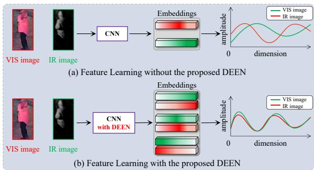  
Figure 1. Motivation of the proposed DEEN, which aims to generate diverse embeddings to make the network focus on learning with the informative feature representations to reduce the modality gaps between the VIS and IR images.

Compared with the widely studied person ReID task, the VIReID task is much more challenging due to the additional cross-modality discrepancy between the VIS and IR images [33, 45, 49, 51]. Typically, there are two popular types of methods to reduce this modality discrepancy. One type is the feature-level methods [5, 11, 16, 35, 40, 42], which try to project the VIS and IR features into a common embedding space, where the modality discrepancy can be minimized. However, the large modality discrepancy makes these methods difficult to project the cross-modality images into a common feature space directly. The other type is the image-level methods [4,28,29,32], which aim to reduce the modality discrepancy by translating an IR (or VIS) image into its VIS (or IR) counterpart by using the GANs [8]. Despite their success in reducing the modality gaps, the generated cross-modality images are usually accompanied by some noises due to the lack of the VIS-IR image pairs.

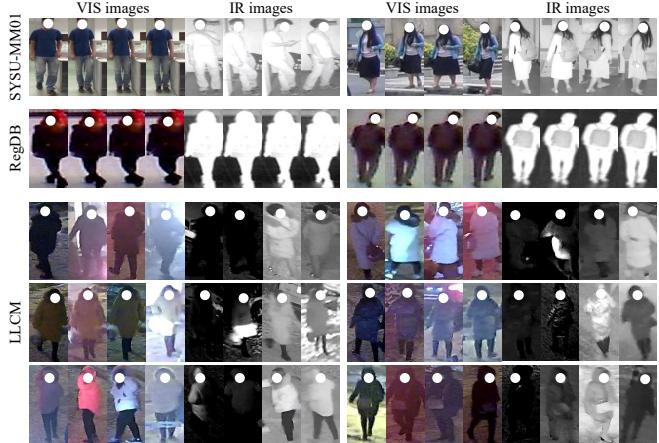  
Figure 2. Comparison of person images on the SYSU-MM01 (1st row), RegDB (2nd row), and LLCM (3rd-5th rows) datasets. Each row shows four VIS images and four IR images of two identities. It is obvious that our LLCM contains a more challenging and realistic VIReID environment.

In this paper, we propose a novel augmentation network in the embedding space for the VIReID task, called diverse embedding expansion network (DEEN), which consists of a diverse embedding expansion (DEE) module and a multistage feature aggregation (MFA) block. The proposed DEE module can generate more embeddings followed by a novel center-guided pair mining (CPM) loss to drive the DEE module to focus on learning with the diverse feature representations. As illustrated in Fig. 1, by exploiting the generated embeddings with diverse information, the proposed DEE module can achieve the performance improvement by using more diverse embeddings. The proposed MFA block can aggregate the features from different stages for mining potential channel-wise and spatial feature representations, which increases the network’s capacity for mining differentlevel diverse embeddings.

Moreover, we observe that the existing VIReID datasets are captured under the environments with sufficient illumination. However, the performance of the VIReID methods may be seriously affected by drastic illumination changes or low illuminations. Therefore, we collect a challenging lowlight cross-modality dataset, called LLCM dataset, which is shown in Fig. 2. Compared with the other VIReID datasets, the LLCM dataset contains a larger number of identities and images captured under low-light scenes, which introduces more challenges to the real-world VIReID task.

In summary, the main contributions are as follows:

• We propose a novel diverse embedding expansion (DEE) module with a center-guided pair mining (CPM) loss to generate more embeddings for learning the diverse feature representations. We are the first to augment the embeddings in the embedding space in VIReID. Besides, we also propose an effective multistage feature aggregation (MFA) block to mine potential channel-wise and spatial feature representations.

• With the incorporation of DEE, CPM loss and MFA into an end-to-end learning framework, we propose an effective diverse embedding expansion network (DEEN), which can effectively reduce the modality discrepancy between the VIS and IR images.

• We collect a low-light cross-modality (LLCM) dataset, which contains 46,767 images of 1,064 identities captured under the environments with illumination changes and low illuminations. The LLCM dataset has more new and important features, which can facilitate the research of VIReID towards practical applications.

• Extensive experiments show that the proposed DEEN outperforms the other state-of-the-art methods for the VIReID task on three challenging datasets.

## 2. Related Work

Generally speaking, there are two main categories of methods in VIReID: the image-level methods and the feature-level methods.

The image-level VIReID methods try to transform one modality into the other for reducing the modality discrepancy between the VIS and IR images in the image space. For this purpose, some GANs-based [4, 28, 29, 32] methods are proposed to perform identity-preserving person image style transformation for aligning cross-modality images and alleviating the problem of limited data. These methods often design complex generative models to align crossmodality images. However, due to the lack of VIS-IR image pairs, the generated images are unavoidably accompanied by some noises. X-modality [14] and its variations [34, 49] apply a lightweight network to introduce an auxiliary middle modality to assist the cross-modality search task. However, there is still a modality gap between this middle modality and the VIS / IR modality.

The feature-level methods aim to find a modality-shared and modality-specific feature space, where the modality gaps can be minimized. For this purpose, MAUM [15] tries to learn cross-modality metrics in two uni-directions to further enhance them with memory-based augmentation. RFM [25] introduces a cross-center loss to explore a more compact intra-class distribution. DCLNet [23] encourages the positive pixels with the same semantic information to be close, while it simultaneously pushes the negative pixels away. cmGAN [5] designs a cutting-edge discriminator to learn discriminative representations from different modalities. However, the large modality gaps between the VIS and IR images make it difficult to project the cross-modality images into a common space directly [7, 18, 21, 26].

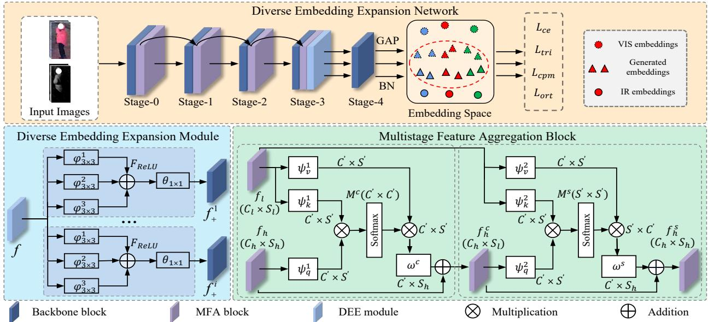  
Figure 3. The pipeline of the proposed network, which includes a DEE module and a MFA block. The DEE module can generate more embeddings with a novel CPM loss to learn diverse feature representations. The MFA block can aggregate the embeddings from different stages for mining diverse channel-wise and spatial feature representations.

## 3. Method

## 3.1. Model Architecture

Fig. 3 provides an overview of the proposed diverse embedding expansion network (DEEN), which utilizes a two-stream ResNet-50 network [12, 44] as the backbone. The VIS-IR features are fed into the proposed diverse embedding expansion (DEE) module to generate more embeddings. Then, a center-guided pair mining (CPM) loss is proposed to make the generated embeddings as diverse as possible for learning informative feature representations. Besides, we incorporate an effective MFA block to aggregate the features from different stages for mining diverse channel-wise and spatial feature representations. During the training stage, all the features before and after the batch normalization (BN) layer are fed into different losses to jointly optimize DEEN.

## 3.2. Diverse Embedding Expansion Module

The proposed DEE module is used to generate more embeddings to alleviate the problem of insufficient training data by using a multi-branch convolutional generation structure. Specifically, for each branch of DEE, we firstly use three $3 \times 3$ dilated convolutional layers $\varphi _ { 3 \times 3 } ^ { 1 } , \varphi _ { 3 \times 3 } ^ { 2 } , \varphi _ { 3 \times 3 } ^ { 3 }$ with different dilation ratios (1, 2, 3) to reduce the number of feature maps f to 1 / 4 of its own size, and then we obtain the feature maps by combining them into one feature map, followed by a ReLU activation layer ${ \bf F } _ { R e L U }$ to improve the non-linear representation capability of the DEE. Then, another convolutional layer $\theta _ { 1 \times 1 }$ with a kernel in size of $1 \times 1$ is applied to the obtained feature map to change its dimension as same as f. Thus, the generated embeddings ${ \bf f } _ { + } ^ { i }$ of the i-th branch can be written as follows:

$$
\mathbf { f } _ { + } ^ { i } = \theta _ { 1 \times 1 } \big ( \mathbf { F } _ { R e L U } \big ( \varphi _ { 3 \times 3 } ^ { 1 } ( \mathbf { f } ) + \varphi _ { 3 \times 3 } ^ { 2 } ( \mathbf { f } ) + \varphi _ { 3 \times 3 } ^ { 3 } ( \mathbf { f } ) \big ) \big ) .\tag{1}
$$

Then, all the generated embeddings are concatenated together and used as the input to the next stage of the backbone network.

## 3.3. Center-Guided Pair Mining Loss

As we can see from the above operation, the DEE module can only generate more embeddings using a multibranch convolutional block. However, this operation cannot effectively obtain diverse embeddings. Thus, we apply the following three properties to constrain the generated embeddings as diverse as possible to effectively reduce the modality discrepancy between the VIS and IR images:

Property 1: The generated embeddings should be as diverse as possible to effectively learn the informative feature representations. This means that we need to push away the distances between the generated embeddings and the original embeddings to learn diverse features and mine diverse cross-modality clues.

Property 2: The generated embeddings should facilitate reducing the modality discrepancy between the VIS and IR images. This means that we need to pull close the distances between the embeddings generated from the VIS modality and the original IR embeddings. Similarly, we also need to pull close the distances between the embeddings generated from the IR modality and the original VIS embeddings.

Property 3: The intra-class distance should be less than the inter-class one. By Property 2, it pushes close the distance between the generated embeddings and the original ones, which may cause the embeddings of different classes to become close. Thus, it is necessary to keep the intra-class distance less than the inter-class distance.

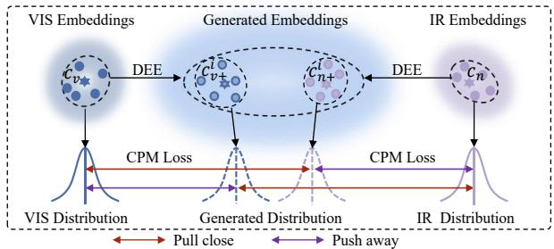  
Figure 4. Illustration of the proposed CPM loss for DEE.

As shown in Fig. 4, for embeddings generated from the VIS modality, the CPM loss can be formulated as follows:

$$
\mathcal { L } ( \mathbf { f } _ { v } , \mathbf { f } _ { n } , \mathbf { f } _ { v + } ^ { i } ) = [ D ( \mathbf { f } _ { n } ^ { j } , \mathbf { f } _ { v + } ^ { i , j } ) - D ( \mathbf { f } _ { v } ^ { j } , \mathbf { f } _ { v + } ^ { i , j } ) - D ( \mathbf { f } _ { v } ^ { j } , \mathbf { f } _ { v } ^ { k } ) ] + ,\tag{2}
$$

where $D ( \cdot , \cdot )$ is the Euclidean distance between two embeddings. $\mathbf { f } _ { v }$ and ${ \bf f } _ { n }$ are the original embeddings from the VIS and IR modalities, and $\mathbf { f } _ { v + } ^ { i }$ is the embeddings generated from the i-th branch of the VIS modality. $j ,$ k are different identities in a minibatch and $[ z ] _ { + } = m a x ( z , 0 )$ . In $\operatorname { E q } .$ (2), the first term can pull the generated embeddings $\mathbf { f } _ { v + } ^ { i }$ towards the original IR’s embeddings ${ \bf f } _ { n }$ to reduce the modality discrepancy between $\mathbf { f } _ { v + } ^ { i , j }$ and $\mathbf { f } _ { n } ^ { j } .$ . The second term can push the generated embeddings $\mathbf { f } _ { v + }$ away from the VIS’s embeddings $\mathbf { f } _ { v }$ to enable $\mathbf { f } _ { v + }$ to learn informative feature representations. The third term can make the intra-class distance less than the inter-class distance.

Then, we use the embedding centers $\mathbf { c } _ { v }$ and ${ \bf c } _ { n }$ of each class to make the centers of generated embeddings ${ \mathbf { c } } _ { v + } ^ { i }$ and ${ \bf c } _ { n + } ^ { i }$ more discriminative, and introduce a margin term α to balance the three terms in Eq. (2). Thus, for the embeddings from VIS, the CPM loss is formulated as follows:

$$
\begin{array} { r } { \mathcal { L } ( \mathbf { c } _ { v } , \mathbf { c } _ { n } , \mathbf { c } _ { v + } ^ { i } ) = [ D ( \mathbf { c } _ { n } ^ { j } , \mathbf { c } _ { v + } ^ { i , j } ) - D ( \mathbf { c } _ { v } ^ { j } , \mathbf { c } _ { v + } ^ { i , j } ) - D ( \mathbf { c } _ { v } ^ { j } , \mathbf { c } _ { v } ^ { k } ) + \alpha ] _ { + } . } \end{array}\tag{3}
$$

Similarly, for the class centers $\mathbf { c } _ { n + } ^ { i }$ of embeddings generated from IR, we have:

$$
\begin{array} { r } { \mathcal { L } ( \mathbf { c } _ { v } , \mathbf { c } _ { n } , \mathbf { c } _ { n + } ^ { i } ) = [ D ( \mathbf { c } _ { v } ^ { j } , \mathbf { c } _ { n + } ^ { i , j } ) - D ( \mathbf { c } _ { n } ^ { j } , \mathbf { c } _ { n + } ^ { i , j } ) - D ( \mathbf { c } _ { n } ^ { j } , \mathbf { c } _ { n } ^ { k } ) + \alpha ] _ { + } . } \end{array}\tag{4}
$$

Thus, the final CPM loss can be formulated as follows:

$$
\begin{array} { r } { \mathcal { L } _ { c p m } = \mathcal { L } ( \mathbf { c } _ { v } , \mathbf { c } _ { n } , \mathbf { c } _ { v + } ^ { i } ) + \mathcal { L } ( \mathbf { c } _ { v } , \mathbf { c } _ { n } , \mathbf { c } _ { n + } ^ { i } ) . } \end{array}\tag{5}
$$

Besides, to ensure that the generated embeddings from different branches can capture different informative feature representations, we force these different embeddings generated by different branches orthogonal to minimize the overlapping elements. Therefore, the orthogonal loss can be formulated as follows:

$$
\mathcal { L } _ { o r t } = \sum _ { m = 1 } ^ { i - 1 } \sum _ { n = m + 1 } ^ { i } ( \mathbf { f } _ { + } ^ { m T } \mathbf { f } _ { + } ^ { n } ) ,\tag{6}
$$

where m and n are the m-th and n-th generated embeddings from the original embeddings, respectively. The orthogonal loss can enforce the generated embeddings to learn more informative feature representations.

## 3.4. Multistage Feature Aggregation Block

Features aggregation of different levels has been demonstrated to be helpful to semantic segmentation, classification and detection task [1, 54, 55]. To aggregate the features from different stages for mining diverse channel-wise and spatial feature representations, we incorporate an effective channel-spatial multistage feature aggregation (MFA) block to aggregate multi-stage features inspired by [31].

Next, we elaborate on the detail of the MFA block, which is shown in Fig. 3. Specifically, we consider two types of source features for the channel-spatial aggregation block in each stage of the backbone network: low-level feature maps $\mathbf { f } _ { l } \ \in \ \mathbb { R } ^ { \forall _ { l } \times H _ { l } \times W _ { l } }$ before the stage and high-level feature maps $\mathbf { f } _ { h } \in \mathbb { R } ^ { C _ { h } \times H _ { h } \times W _ { h } }$ after the stage, where C, W and H denote the number of the channel, width and height of features, respectively. First, we employ three 1×1 convolutional layers $\psi _ { q } ^ { 1 } , \psi _ { v } ^ { 1 } , \psi _ { k } ^ { 1 }$ to transform f into three compact embeddings: $\bar { \psi } _ { q } ^ { 1 } ( \mathbf { f } _ { h } ) , \psi _ { v } ^ { 1 } ( \mathbf { f } _ { l } )$ and $\psi _ { k } ^ { 1 } ( \mathbf { f } _ { l } )$ . Then, we compute the channel-wise similarity matrix $\mathbf { M } ^ { c } \in \mathbb { R } ^ { C ^ { ' } \times C ^ { ' } }$ by matrix multiplication followed by softmax:

$$
\mathbf { M } ^ { c } = \mathbf { F } _ { s o f t m a x } \big ( \psi _ { q } ^ { 1 } ( \mathbf { f } _ { h } ) \times \psi _ { k } ^ { 1 } ( \mathbf { f } _ { l } ) \big ) .\tag{7}
$$

Consequently, we implement the channel-wise multistage feature aggregation by restoring the channel dimension by the matrix multiplication of $\bar { \psi } _ { v } ^ { 1 } ( \mathbf { f } _ { l } )$ ) and Mc. After that, another $1 \times 1$ convolutional layer $\omega ^ { c }$ is applied to transform the size of the above feature maps to that of $\mathbf { f } _ { h } .$ Finally, we get the output by adding $\mathbf { f } _ { h }$ to it by matrix addition:

$$
\mathbf { f } _ { h } ^ { c } = \omega ^ { c } ( \psi _ { v } ^ { 1 } ( \mathbf { f } _ { l } ) \times \mathbf { M } ^ { c } ) + \mathbf { f } _ { h } .\tag{8}
$$

After that, $\mathbf { f } _ { h } ^ { c }$ obtained from the above operations and the low-level feature map $\mathbf { f } _ { l }$ are used to perform the spatial feature aggregation operation, which is similar to the channelwise multistage feature aggregation operation. Finally, we get the MFA’s output as follows:

$$
\mathbf { f } _ { h } ^ { s } = \omega ^ { s } ( \psi _ { v } ^ { 2 } ( \mathbf { f } _ { l } ) \times \mathbf { M } ^ { s } ) + \mathbf { f } _ { h } ^ { c } ,\tag{9}
$$

where $\omega ^ { s }$ and $\psi _ { v } ^ { 2 }$ are two $1 \times 1$ convolutional layers, and $\mathbf { M } ^ { s }$ is the spatial similarity matrix.

## 3.5. Multi-Loss Optimization

Besides the proposed $\mathcal { L } _ { c p m }$ and $\mathcal { L } _ { o r t } .$ , we also combine the cross-entropy loss $\mathcal { L } _ { c e } [ \mathrm { { i } } 7 ]$ and the triplet loss $\mathcal { L } _ { t r i } \left[ 1 3 \right]$ to jointly optimize the network in an end-to-end manner by minimizing the sum of these four losses $\mathcal { L } _ { t o t a l } .$ , which can be formulated as follows:

$$
\mathcal { L } _ { t o t a l } = \mathcal { L } _ { c e } + \mathcal { L } _ { t r i } + \lambda _ { 1 } \mathcal { L } _ { c p m } + \lambda _ { 2 } \mathcal { L } _ { o r t } ,\tag{10}
$$

where $\lambda _ { 1 }$ and $\lambda _ { 2 }$ are the coefficients to control the relative importance of the loss terms.

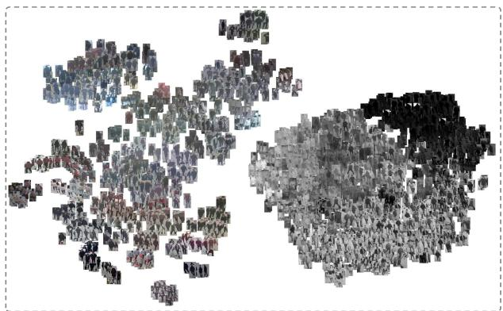  
Figure 5. The distribution of the LLCM’s images in the 2D space. It can be seen that the images under different light conditions present different styles, which further increases the modality discrepancy between the VIS and IR images.

## 4. LLCM Dataset

## 4.1. Dataset Description

In this paper, we collect a new challenging low-light cross-modality dataset, called LLCM dataset. The LLCM dataset utilizes a 9-camera network deployed in low-light environments, which can capture the VIS images in daytime and capture the IR images at night. For protecting the personal privacy information, we utilize MTCNN [47] to get the bounding boxes of persons’ faces and blur those regions. We make sure that each annotated identity is captured by both the VIS and IR cameras. Some examples from the LLCM dataset are shown in Fig. 2. As shown in Tab. 1, compared with the existing VIReID datasets, the LLCM dataset has the following new and important features:

First, the images in the LLCM dataset are captured under complex low-light environment for both the VIS and IR modalities, which contains severe illumination changes and is a common problem in the real scenes. As Fig. 2 and Fig. 5 shown, the severe light conditions can change the color of persons’ clothes and cause the loss of texture information of the clothes, which introduces great challenges to VIReID. Second, the LLCM dataset has a larger number of identities and bounding boxes. This dataset contains 46,767 bounding boxes of 1,064 identities, making it the largest VIReID dataset at present (see Tab 1). Third, the LLCM dataset is collected in over 100 days from January to April, and different climate conditions and cloth styles are considered. Long-term data collection helps to study the VIReID task in different climates and clothing styles, which increases the generalization of the VIReID model.

Besides, considering the real-world applications, the LLCM dataset also contains many images that suffer from various challenges, such as motion bluring, pose variation, camera view changes, occlusion, low resolution and others. All in all, the LLCM dataset is a challenging dataset for the VIReID task, which can further facilitate the research of VIReID towards practical applications.

<table><tr><td>Datasets</td><td>IDs</td><td>Images</td><td>VIS / IR cam.</td><td>low-light</td></tr><tr><td>RegDB [19]</td><td>412</td><td>8,240</td><td>1/1</td><td>X</td></tr><tr><td>SYSU-MM01 [36]</td><td>491</td><td>38,271</td><td>4/2</td><td>X</td></tr><tr><td>LLCM</td><td>1,064</td><td>46,767</td><td>9/9</td><td>V</td></tr></table>

Table 1. Comparison between the LLCM and other two popular VIReID datasets.

## 4.2. Evaluation Protocol

We divide the LLCM dataset into a training set and a testing set at a ratio about 2:1. The training set contains 30,921 bounding boxes of 713 identities (16,946 bounding boxes are from the VIS modality and 13,975 bounding boxes are from the IR modality), and the testing set contains 13,909 bounding boxes of 351 identities (8,680 bounding boxes are from the VIS modality and 7,166 bounding boxes are from the IR modality). Similar to the RegDB [19] dataset, both the VIS to IR mode and the IR to VIS mode are used to evaluate the performance of the VIReID models. During the testing stage, for each camera, we randomly choose one image from the images of each identity to form the gallery set for evaluation the performance of the models. We repeat the above evaluation 10 times with random split of the gallery set and report the average performance.

## 5. Experiments

## 5.1. Datasets

The SYSU-MM01 dataset [36] contains 491 identities captured by 4 VIS cameras and 2 IR cameras, including the All-Search and Indoor-Search modes. For the All-Search mode, all the images captured by all the VIS cameras are used as the gallery set. For the Indoor-Search mode, only the images captured by two indoor VIS cameras are used as the gallery set. The RegDB dataset [19] consists of 412 identities, and each identity has 10 VIS images and 10 IR images captured by a pair of overlapping cameras.

## 5.2. Implementation Details

All the input images are firstly resized to $3 \times 3 8 4 \times 1 4 4$ and the random horizontal flip and random erasing [53] techniques are adopted during the training phase. The initial learning rate is set to $1 \times 1 0 ^ { - 2 }$ and then it increases to $1 \times 1 0 ^ { - 1 }$ after 10 epochs with a warm-up strategy. After that, we decay the learning rate to $1 \times 1 0 ^ { - 2 }$ at 20 epoch, and further decay to $1 \times 1 0 ^ { - 3 }$ and $1 \times 1 0 ^ { - 4 }$ at epoch 60 and epoch 120, respectively, until a total of 150 epochs. In each mini-batch, we randomly select 4 VIS images and 4 IR images of 6 identities for training. The SGD optimizer is adopted for training, where the momentum is set to 0.9. For the RegDB dataset, we remove stage-4 and plug the proposed DEE module into the DEEN after stage-2.

<table><tr><td rowspan="3">Methods</td><td colspan="7">SYSU-MM01</td><td colspan="8">RegDB</td></tr><tr><td colspan="3">All Search</td><td></td><td colspan="3">Indoor Search</td><td colspan="3">VIS to IR</td><td colspan="3"></td><td colspan="3">IR to VIS</td></tr><tr><td>R-1</td><td>R-10</td><td>R-20</td><td>mAP</td><td>R-1</td><td>R-10</td><td>R-20</td><td>mAP</td><td>R-1</td><td>R-10</td><td>R-20</td><td>mAP</td><td>R-1</td><td>R-10 R-20</td><td>mAP</td></tr><tr><td>BDTR [46]</td><td>17.0</td><td>55.4</td><td>72.0</td><td>19.7</td><td>=</td><td></td><td></td><td>33.6</td><td>58.6</td><td>67.4</td><td>32.8</td><td>32.9</td><td>58.5</td><td>68.4</td><td>32.0</td></tr><tr><td>D2RL [32]</td><td>28.9</td><td>70.6</td><td>82.4</td><td>29.2</td><td></td><td></td><td></td><td>43.4</td><td>66.1</td><td>76.3</td><td>44.1</td><td></td><td></td><td></td><td></td></tr><tr><td>Hi-CMD [4]</td><td>34.9</td><td>77.6</td><td></td><td>35.9</td><td></td><td></td><td></td><td>70.9</td><td>86.4</td><td></td><td>66.0</td><td></td><td></td><td></td><td></td></tr><tr><td>JSIA-ReID [29]</td><td>38.1</td><td>80.7</td><td>89.9</td><td>36.9</td><td>43.8</td><td>86.2 94.2</td><td>52.9</td><td>48.1</td><td></td><td></td><td>48.9</td><td>48.5</td><td></td><td></td><td>49.3</td></tr><tr><td>AlignGAN [28]</td><td>42.4</td><td>85.0</td><td>93.7</td><td>40.7</td><td>45.9</td><td>87.6 94.4</td><td>54.3</td><td>57.9</td><td></td><td></td><td>53.6</td><td>56.3</td><td></td><td></td><td>53.4</td></tr><tr><td>X-Modality [14]</td><td>49.9</td><td>89.8</td><td>96.0</td><td>50.7</td><td></td><td></td><td></td><td>62.2</td><td>83.1</td><td>91.7</td><td>60.2</td><td></td><td></td><td></td><td></td></tr><tr><td>DDAG [44]</td><td>54.8</td><td>90.4</td><td>95.8</td><td>53.0</td><td>61.0</td><td>94.1 98.4</td><td>68.0</td><td>69.3</td><td>86.2</td><td>91.5</td><td>63.5</td><td>68.1</td><td>85.2</td><td>90.3</td><td>61.8</td></tr><tr><td>LbA [20]</td><td>55.4</td><td></td><td></td><td>54.1</td><td>58.5</td><td></td><td>66.3</td><td>74.2</td><td></td><td></td><td>67.6</td><td>67.5</td><td></td><td></td><td>72.4</td></tr><tr><td>NFS [2]</td><td>56.9</td><td>91.3</td><td>96.5</td><td>55.5</td><td>62.8</td><td>96.5 99.1</td><td>69.8</td><td>80.5</td><td>91.6</td><td>95.1</td><td>72.1</td><td>78.0</td><td>90.5</td><td>93.6</td><td>69.8</td></tr><tr><td>CM-NAS [6]</td><td>60.8</td><td>92.1</td><td>96.8</td><td>58.9</td><td>68.0</td><td>94.8 97.9</td><td>52.4</td><td>82.8</td><td>95.1</td><td>97.7</td><td>79.3</td><td>81.7</td><td>94.1</td><td>96.9</td><td>77.6</td></tr><tr><td>MCLNet [10]</td><td>65.4</td><td>93.3</td><td>97.1</td><td>62.0</td><td>72.6</td><td>97.0 99.2</td><td>76.6</td><td>80.3</td><td>92.7</td><td>96.0</td><td>73.1</td><td>75.9</td><td>90.9</td><td>94.6</td><td>69.5</td></tr><tr><td>FMCNet [48]</td><td>66.3</td><td></td><td></td><td>62.5</td><td>68.2</td><td></td><td>74.1</td><td>89.1</td><td></td><td></td><td>84.4</td><td>88.4</td><td></td><td></td><td>83.9</td></tr><tr><td>SMCL [34]</td><td>67.4</td><td>92.9</td><td>96.8</td><td>61.8</td><td>68.8</td><td>96.6 98.8</td><td>75.6</td><td>83.9</td><td></td><td></td><td>79.8</td><td>83.1</td><td></td><td></td><td>78.6</td></tr><tr><td>DART [41]</td><td>68.7</td><td>96.4</td><td>99.0</td><td>66.3</td><td>72.5</td><td>97.8 99.5</td><td>78.2</td><td>83.6</td><td></td><td></td><td>75.7</td><td>82.0</td><td></td><td></td><td>73.8</td></tr><tr><td>CAJ [43]</td><td>69.9</td><td>95.7</td><td>98.5</td><td>66.9</td><td>76.3</td><td>97.9 99.5</td><td>80.4</td><td>85.0</td><td>95.5</td><td>97.5</td><td>79.1</td><td>84.8</td><td>95.3</td><td>97.5</td><td>77.8</td></tr><tr><td>MPANet [37]</td><td>70.6</td><td>96.2</td><td>98.8</td><td>68.2</td><td>76.7</td><td>98.2 99.6</td><td>81.0</td><td>82.8</td><td></td><td></td><td>80.7</td><td>83.7</td><td></td><td></td><td>80.9</td></tr><tr><td>MMN [49]</td><td>70.6</td><td>96.2</td><td>99.0</td><td>66.9</td><td>76.2</td><td>97.2 99.3</td><td>79.6</td><td>91.6</td><td>97.7</td><td>98.9</td><td>84.1</td><td>87.5</td><td>96.0</td><td>98.1</td><td>80.5</td></tr><tr><td>DCLNet [23]</td><td>70.8</td><td></td><td></td><td>65.3</td><td>73.5</td><td></td><td>76.8</td><td>81.2</td><td></td><td></td><td>74.3</td><td>78.0</td><td></td><td></td><td>70.6</td></tr><tr><td>MAUM [15]</td><td>71.7</td><td></td><td></td><td>68.8</td><td>77.0</td><td></td><td>81.9</td><td>87.9</td><td></td><td></td><td>85.1</td><td>87.0</td><td></td><td></td><td>84.3</td></tr><tr><td>DEEN (ours)</td><td>74.7</td><td>97.6</td><td>99.2</td><td>71.8</td><td>80.3</td><td>99.0</td><td>99.8 83.3</td><td>91.1</td><td>97.8</td><td>98.9</td><td>85.1</td><td>89.5</td><td>96.8</td><td>98.4</td><td>83.4</td></tr></table>

Table 2. Comparisons between the proposed DEEN and some state-of-the-art methods on the SYSU-MM01 and RegDB datasets.

## 5.3. Comparison with State-of-the-art Methods

We firstly compare the proposed DEEN with several state-of-the-art methods to demonstrate the superiority of our method. The experimental results on the SYSU-MM01 and RegDB datasets are reported in Tab. 2, and the results on our LLCM dataset are reported in Tab. 3.

SYSU-MM01 and RegDB: From Tab. 2, we can see that the results on the two datasets show that the proposed DEEN achieves the best performance against all other stateof-the-art methods. Specifically, for the All-Search mode on SYSU-MM01, DEEN achieves 74.7% Rank-1 accuracy and 71.8% mAP. For the Indoor-Search mode, DEEN achieves 80.3% Rank-1 accuracy and 83.3% mAP. For the VIS to IR mode on RegDB, DEEN achieves 91.1% Rank-1 accuracy and 85.1% mAP. For the IR to VIS mode, the proposed DEEN also obtains 89.5% Rank-1 accuracy and 83.4% mAP. The results validate the effectiveness of our method. Moreover, the results also demonstrate that the proposed DEEN can effectively reduce the modality discrepancy between the VIS and IR modalities.

LLCM: Tab. 3 shows the results on our LLCM dataset. Here, we use several representative open-source methods to evaluate our LLCM dataset and compare them with our method. From Tab. 3 we can draw the following conclusions: the best method only obtains 54.9% Rank-1 accuracy and 62.9% mAP under the IR to VIS mode. The results of the existing methods on our LLCM dataset are generally unsatisfactory. This shows that, on one hand, our LLCM dataset is a very challenging dataset. On the other hand, the change of light has serious influence on the VIReID model. Besides, the proposed DEEN achieves the best performance under both the VIS to IR mode and the IR to VIS mode, which demonstrates the effectiveness of the proposed DEEN to reduce the modality gaps between the VIS and IR images.

<table><tr><td rowspan="3">Model</td><td colspan="8">LLCM</td></tr><tr><td colspan="4">IR to VIS</td><td colspan="4">VIS to IR</td></tr><tr><td>R-1</td><td>R-10</td><td>R-20</td><td>mAP</td><td>R-1</td><td>R-10</td><td>R-20</td><td>mAP</td></tr><tr><td>DDAG [44]</td><td>40.3</td><td>71.4</td><td>79.6</td><td>48.4</td><td>48.0</td><td>79.2</td><td>86.1</td><td>52.3</td></tr><tr><td>DDAG* [44]</td><td>41.0</td><td>73.4</td><td>81.9</td><td>49.6</td><td>48.5</td><td>81.0</td><td>87.8</td><td>53.0</td></tr><tr><td>AGW [45]</td><td>43.6</td><td>74.6</td><td>82.4</td><td>51.8</td><td>51.5</td><td>81.5</td><td>87.9</td><td>55.3</td></tr><tr><td>LbA [20]</td><td>43.8</td><td>78.2</td><td>86.6</td><td>53.1</td><td>50.8</td><td>84.3</td><td>91.1</td><td>55.6</td></tr><tr><td>LbA* [20]</td><td>44.6</td><td>78.2</td><td>86.8</td><td>53.8</td><td>50.8</td><td>84.6</td><td>91.1</td><td>55.9</td></tr><tr><td>AGW* [45]</td><td>46.4</td><td>77.8</td><td>85.2</td><td>54.8</td><td>56.0</td><td>84.9</td><td>90.6</td><td>59.1</td></tr><tr><td>CAJ [43]</td><td>48.8</td><td>79.5</td><td>85.3</td><td>56.6</td><td>56.5</td><td>85.3</td><td>90.9</td><td>59.8</td></tr><tr><td>DART [41]</td><td>52.2</td><td>80.7</td><td>87.0</td><td>59.8</td><td>60.4</td><td>87.1</td><td>91.9</td><td>63.2</td></tr><tr><td>MMN [49]</td><td>52.5</td><td>81.6</td><td>88.4</td><td>58.9</td><td>59.9</td><td>88.5</td><td>93.6</td><td>62.7</td></tr><tr><td>DEEN (ours)</td><td>54.9</td><td>84.9</td><td>90.9</td><td>62.9</td><td>62.5</td><td>90.3</td><td>94.7</td><td>65.8</td></tr></table>

Table 3. Performance obtained by the competing methods on our LLCM dataset. The symbol of “\*” represents the methods that we reproduced with the random erasing technique.

## 5.4. Ablation Studies

Effectiveness of each component: To evaluate the contribution of each component to DEEN, we conduct some ablation studies on the LLCM and SYSU-MM01 datasets by removing certain modules from DEEN and evaluate the influence on the performance. The overall settings remain the same, while only the module under evaluation is used in or removed from DEEN. As shown in Tab. 4, although the DEE module can generate more embeddings using a multibranch convolutional block, which slightly improves the performance of the baseline, the results are not satisfactory. After being constrained by the proposed CPM loss to generate diverse embeddings, DEE can greatly improve the performance of the model and effectively reduce the modality discrepancy between the VIS and IR images. Besides, the proposed MFA block can improve the performance of the baseline by aggregating the features from different stages for mining diverse channel-wise and spatial feature representations. With the incorporation of DEE, CPM and MFA into an end-to-end learning framework, DEEN achieves an impressive performance improvement on two challenging VIReID datasets, which shows DEE and MFA can benefit from each other for generating diverse embeddings.

<table><tr><td colspan="4">Settings</td><td colspan="2">LLCM SYSU-MM01</td></tr><tr><td>DEE</td><td> $\overline { { \mathscr { L } _ { c p m } } }$ </td><td>Lort MFA</td><td>R-I</td><td>mAP</td><td>R-I mAP</td></tr><tr><td>√</td><td></td><td></td><td>45.4</td><td>53.6</td><td>60.7 57.7</td></tr><tr><td></td><td></td><td></td><td>50.5</td><td>59.0 64.7</td><td>62.0</td></tr><tr><td>√</td><td>√</td><td></td><td>53.1</td><td>61.1</td><td>69.2 66.2</td></tr><tr><td>√</td><td></td><td>√</td><td>51.5</td><td>60.1</td><td>65.3 63.2</td></tr><tr><td>√</td><td>√</td><td>√</td><td>53.9</td><td>62.3</td><td>69.8 66.7</td></tr><tr><td></td><td></td><td>√</td><td>51.2</td><td>59.6</td><td>64.7 62.0</td></tr><tr><td>√</td><td>√</td><td>√ √</td><td>54.9</td><td>62.9</td><td>74.7 71.8</td></tr></table>

Table 4. The influence of each component on the performance of the proposed DEEN.
<table><tr><td rowspan="2">Methods</td><td colspan="2">LLCM</td><td colspan="2">SYSU-MM01</td></tr><tr><td>R-1</td><td>mAP</td><td>R-1</td><td>mAP</td></tr><tr><td>DEE after stage-0</td><td>48.5</td><td>57.1</td><td>63.4</td><td>59.4</td></tr><tr><td>DEE after stage-1</td><td>49.4</td><td>57.8</td><td>63.7</td><td>60.8</td></tr><tr><td>DEE after stage-2</td><td>49.6</td><td>57.9</td><td>65.3</td><td>61.7</td></tr><tr><td>DEE after stage-3</td><td>53.9</td><td>62.3</td><td>69.8</td><td>66.7</td></tr><tr><td>DEE after stage-4</td><td>50.9</td><td>59.6</td><td>60.0</td><td>58.0</td></tr></table>

Table 5. The influence of which stage of ResNet-50 to plug the DEE module.
<table><tr><td rowspan="2">Methods</td><td colspan="2">LLCM</td><td colspan="2">SYSU-MM01</td></tr><tr><td>R-1</td><td>mAP</td><td>R-1</td><td>mAP</td></tr><tr><td>Two branches</td><td>52.6</td><td>60.9</td><td>67.5</td><td>64.6</td></tr><tr><td>Three branches</td><td>53.9</td><td>62.3</td><td>69.2</td><td>66.2</td></tr><tr><td>Four branches</td><td>52.4</td><td>60.7</td><td>67.6</td><td>64.6</td></tr></table>

Table 6. Study about how many branches are suitable for DEE.
<table><tr><td rowspan="2">Methods</td><td colspan="2">LLCM</td><td colspan="2">SYSU-MM01</td></tr><tr><td>R-I</td><td>mAP</td><td>R-I</td><td>mAP</td></tr><tr><td>NL</td><td>50.1</td><td>57.4</td><td>63.8</td><td>60.7</td></tr><tr><td>MFA NL + DEE</td><td>51.2 54.2</td><td>59.6 62.4</td><td>64.7 73.4</td><td>62.0</td></tr><tr><td>MFA+ DEE</td><td></td><td></td><td></td><td>70.3</td></tr><tr><td></td><td>54.9</td><td>62.9</td><td>74.7</td><td>71.8</td></tr></table>

Table 7. Comparison with the Non-Local (NL) block.

The influence of which stage of ResNet-50 to plug the DEE module. The proposed DEE can be plugged after any stage of the backbone network. In our experiments, we use ResNet-50 as the backbone, which has five stages: stage-0 to stage-4. We plug DEE after different stages of the ResNet-50 to study how it will affect the performance of the DEEN. As shown in Tab. 5, when DEE is plugged after stage-0 to stage-3, the performance gradually increases, which shows the modality gaps become smaller and the generative ability of DEE becomes stronger at deeper layers of the network. When DEE is plugged after stage-3, it can achieve the best results on both LLCM and SYSU-MM01. However, when DEE is plugged after stage-4, the performance drops rapidly because the CPM loss works directly on the embeddings, enlarging the distances between the generated embeddings and the original embeddings, which increases the difficulty of model optimization. Based on the above analysis, we plug DEE after stage-3 of the backbone if not specified.

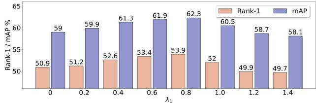

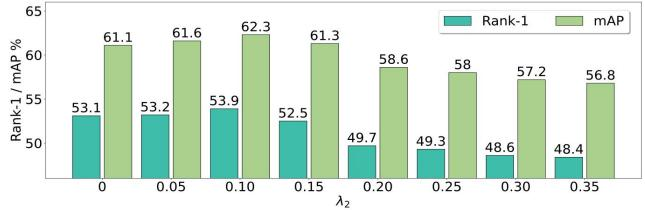

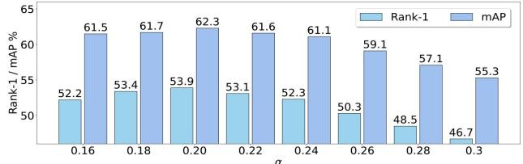  
Figure 6. Influence of different $\lambda _ { 1 } , \lambda _ { 2 }$ and α values on our LLCM.

Effectiveness on how many branches are more suitable for DEE. The proposed DEE module utilizes a multibranch convolutional block to generate diverse embeddings. Here, we study how many branches are suitable for DEE. As shown in Tab. 6, with the increase of the number of DEE’s branches from 2 to 3, more embeddings are generated to reduce the modality gaps, so the performance gradually increases. However, the increase of performance has an upper limit when the number of branches is more than 3, because DEE generates too many redundant features, which leads to the drop of performance. As a result, DEE with three branches can achieve the best performances both on the LLCM and SYSU-MM01 datasets. It indicates that DEE with 3 branches is more suitable for generating diverse embeddings. Thus, we use 3 branches for DEE if not specified.

Comparison with the Non-Local block. In this paper, we propose a MFA block to mine diverse channel-wise and spatial feature representations inspired by the Non-local (NL) block in [31]. Thus, we compare these two blocks to investigate which block is more effective. As shown in Tab. 7, the MFA block outperforms the NL block by 1.1% Rank-1 accuracy and 2.2% mAP, respectively. The results validate the effectiveness of our MFA block. Moreover, the results also show that the MFA block and the DEE module are complementary for generating diverse embeddings to reduce the modality gaps between the VIS and IR images.

The influence of the hyperparameters $\lambda _ { 1 } , \lambda _ { 2 }$ and α. To evaluate the influence of the three hyperparameters, we give quantitative comparisons and report the results in Fig. 6. As we can see, the best performance is achieved when $\lambda _ { 1 }$ is set to 0.8, λ2 is set to 0.1 and α is set to 0.2, respectively.

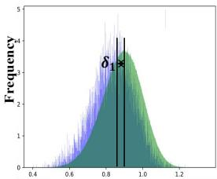  
(a) Initial Distance

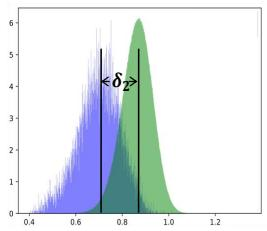  
(b) Baseline Distance

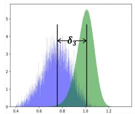  
(c) MFA Distance

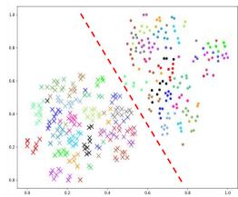

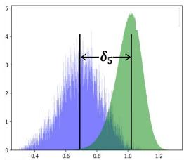

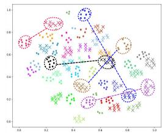

(e) DEEN Distance  
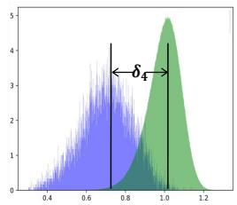  
(d) DEE Distance

(f) Initial Distribution  
(g) Baseline Distribution  
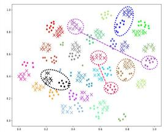  
(h) MFA Distribution

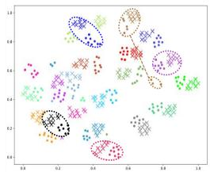  
(i) DEE Distribution

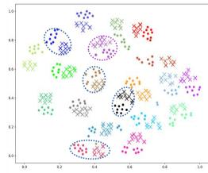  
(j) DEEN Distribution

Figure 7. (a-e) show the intra-class and inter-class distances of cross-modality features. The intra-class and inter-class distances are indicated in blue and green colors, respectively. (f-j) show the distribution of feature embeddings in the 2D feature space, where circles and triangles in different colors denote visible and infrared modalities. A total of 20 persons are selected from the test set. The samples with the same color are from the same person. The “dot” and “cross” markers denote the images from the VIS and IR modalities, respectively.  
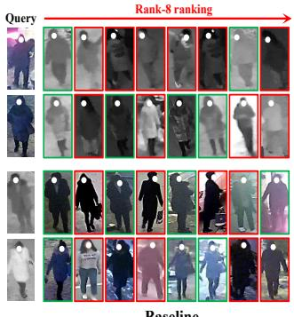  
Baseline

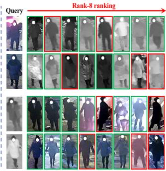  
DEEN  
Figure 8. Some Rank-8 retrieval results obtained by the baseline and the proposed DEEN on our LLCM dataset.

## 5.5. Visualization

Feature distribution. To investigate the reason why DEEN is effective, we visualize the inter-class and intraclass distances on our LLCM dataset as shown in Fig. 7 (ae). Comparing Fig. 7 (c-e) with Fig. 7 (a-b), the means (i.e., the vertical lines) of inter-class and intra-class distances are pushed away by MFA, DEE and DEEN, where $\delta _ { 1 } < \delta _ { 2 } < \delta _ { 3 }$ and $\delta _ { 1 } < \delta _ { 2 } < \delta _ { 4 } < \delta _ { 5 }$ This shows that the intra-class distance of DEEN is significantly reduced compared with the intra-class distance of the initial features (Fig. 7 (a)) and the baseline features (Fig. 7 (b)). Thus, DEEN can effectively reduce the modality discrepancy between the VIS and the IR images. Meanwhile, we also visualize the feature distribution with t-SNE [27] in the 2D feature space in Fig. 7 (f-j), which shows that MFA, DEE and DEEN can effectively discriminate and aggregate feature embeddings of the same person, and reduce the modality discrepancy.

Retrieval result. To further show the effectiveness of DEEN, we also show some retrieval results of DEEN on our LLCM dataset in Fig. 8. For each retrieval case, the retrieved images with green boxes mean the correct matches corresponding the given query, while the red ones mean the incorrect matches. In general, DEEN can effectively improve the ranking results with more correctly matched images ranked in the top positions than the baseline.

## 6. CONCLUSION

In this paper, we propose a novel diverse embedding expansion network (DEEN) in the embedding space for the VIReID task. The proposed DEEN can generate diverse embeddings and mine diverse channel-wise and spatial embeddings to learn the informative feature representations for reducing the modality discrepancy between the VIS and IR images. Moreover, we also provide a challenging low-light cross-modality (LLCM) dataset, which has more new and important features and can further facilitate the research of VIReID towards practical applications. Extensive experiments on the SYSU-MM01, RegDB and LLCM datasets show the superiority of the proposed DEEN over several other state-of-the-art methods.

## 7. Acknowledgments

This work was supported by the National Key Research and Development Program of China under Grant 2022ZD0160402, by the National Natural Science Foundation of China under Grant U21A20514, and by the FuXiaQuan National Independent Innovation Demonstration Zone Collaborative Innovation Platform Project under Grant 3502ZCQXT2022008.

## References

[1] Xuesong Chen, Canmiao Fu, Yong Zhao, Feng Zheng, Jingkuan Song, Rongrong Ji, and Yi Yang. Salience-guided cascaded suppression network for person re-identification. In Proceedings ofthe CVPR, pages 3300–3310, 2020. 4

[2] Yehansen Chen, Lin Wan, Zhihang Li, Qianyan Jing, and Zongyuan Sun. Neural feature search for rgb-infrared person re-identification. In Proceedings of the CVPR, pages 587– 597, 2021. 6

[3] Yoonki Cho, Woo Jae Kim, Seunghoon Hong, and Sung-Eui Yoon. Part-based pseudo label refinement for unsupervised person re-identification. In Proceedings of the CVPR, pages 7308–7318, 2022. 1

[4] Seokeon Choi, Sumin Lee, Youngeun Kim, Taekyung Kim, and Changick Kim. Hi-cmd: Hierarchical cross-modality disentanglement for visible-infrared person re-identification. In Proceedings of the CVPR, pages 10257–10266, 2020. 1, 2, 6

[5] Pingyang Dai, Rongrong Ji, Haibin Wang, Qiong Wu, and Yuyu Huang. Cross-modality person re-identification with generative adversarial training. In Proceedings of the IJCAI, pages 677–683, 2018. 1, 2

[6] Chaoyou Fu, Yibo Hu, Xiang Wu, Hailin Shi, Tao Mei, and Ran He. Cm-nas: Cross-modality neural architecture search for visible-infrared person re-identification. In Proceedings of the ICCV, pages 11823–11832, 2021. 6

[7] Yajun Gao, Tengfei Liang, Yi Jin, Xiaoyan Gu, Wu Liu, Yidong Li, and Congyan Lang. Mso: Multi-feature space joint optimization network for rgb-infrared person reidentification. In Proceedings ofthe ACM MM, pages 5257– 5265, 2021. 2

[8] Ian Goodfellow, Jean Pouget-Abadie, Mehdi Mirza, Bing Xu, David Warde-Farley, Sherjil Ozair, Aaron Courville, and Yoshua Bengio. Generative adversarial nets. In Proceedings of the NeurIPS, pages 2672–2680, 2014. 2

[9] Hongyang Gu, Jianmin Li, Guangyuan Fu, Chifong Wong, Xinghao Chen, and Jun Zhu. Autoloss-gms: Searching generalized margin-based softmax loss function for person reidentification. In Proceedings of the CVPR, pages 4744– 4753, 2022. 1

[10] Xin Hao, Sanyuan Zhao, Mang Ye, and Jianbing Shen. Cross-modality person re-identification via modality confusion and center aggregation. In Proceedings of the CVPR, pages 16403–16412, 2021. 6

[11] Yi Hao, Nannan Wang, Jie Li, and Xinbo Gao. Hsme: Hypersphere manifold embedding for visible thermal person re-identification. In Proceedings of the AAAI, pages 8385– 8392, 2019. 1

[12] Kaiming He, Xiangyu Zhang, Shaoqing Ren, and Jian Sun. Deep residual learning for image recognition. In Proceedings ofthe CVPR, pages 770–778, 2016. 3

[13] Alexander Hermans, Lucas Beyer, and Bastian Leibe. In defense of the triplet loss for person re-identification. ArXiv, 2017. 4

[14] Diangang Li, Xing Wei, Xiaopeng Hong, and Yihong Gong. Infrared-visible cross-modal person re-identification with an

x modality. In Proceedings of the AAAI, pages 4610–4617, 2020. 2, 6

[15] Jialun Liu, Yifan Sun, Feng Zhu, Hongbin Pei, Yi Yang, and Wenhui Li. Learning memory-augmented unidirectional metrics for cross-modality person re-identification. In Proceedings ofthe CVPR, pages 19366–19375, 2022. 1, 2, 6

[16] Yan Lu, Yue Wu, Bin Liu, Tianzhu Zhang, Baopu Li, Qi Chu, and Nenghai Yu. Cross-modality person re-identification with shared-specific feature transfer. In Proceedings of the CVPR, pages 13379–13389, 2020. 1

[17] Hao Luo, Youzhi Gu, Xingyu Liao, Shenqi Lai, and Wei Jiang. Bag of tricks and a strong baseline for deep person re-identification. In Proceedings of the CVPR Workshops, pages 1487–1495, 2019. 4

[18] Ziling Miao, Hong Liu, Wei Shi, Wanlu Xu, and Hanrong Ye. Modality-aware style adaptation for rgb-infrared person re-identification. In Proceedings of the IJCAI, pages 19–27, 2021. 2

[19] Dat Tien Nguyen, Hyung Gil Hong, Ki Wan Kim, and Kang Ryoung Park. Person recognition system based on a combination of body images from visible light and thermal cameras. Sensors, 17(3):605, 2017. 5

[20] Hyunjong Park, Sanghoon Lee, Junghyup Lee, and Bumsub Ham. Learning by aligning: Visible-infrared person reidentification using cross-modal correspondences. In Proceedings ofthe ICCV, pages 12046–12055, 2021. 6

[21] Nan Pu, Wei Chen, Yu Liu, Erwin M Bakker, and Michael S Lew. Dual gaussian-based variational subspace disentanglement for visible-infrared person re-identification. In Proceedings of the ACM MM, pages 2149–2158, 2020. 2

[22] Nan Pu, Wei Chen, Yu Liu, Erwin M. Bakker, and Michael S. Lew. Lifelong person re-identification via adaptive knowledge accumulation. In Proceedings of the CVPR, pages 7901–7910, 2021. 1

[23] Hanzhe Sun, Jun Liu, Zhizhong Zhang, Chengjie Wang, Yanyun Qu, Yuan Xie, and Lizhuang Ma. Not all pixels are matched: Dense contrastive learning for cross-modality person re-identification. In Proceedings of the ACM MM, page 5333–5341, 2022. 2, 6

[24] Lei Tan, Pingyang Dai, Rongrong Ji, and Yongjian Wu. Dynamic prototype mask for occluded person re-identification. In Proceedings ofthe ACM MM, page 531–540, 2022. 1

[25] Lei Tan, Yukang Zhang, Shengmei Shen, Yan Wang, Pingyang Dai, Xianming Lin, Yongjian Wu, and Rongrong Ji. Exploring invariant representation for visible-infrared person re-identification. ArXiv, 2023. 2

[26] Xudong Tian, Zhizhong Zhang, Shaohui Lin, Yanyun Qu, Yuan Xie, and Lizhuang Ma. Farewell to mutual information: Variational distillation for cross-modal person reidentification. In Proceedings of the CVPR, pages 1522– 1531, 2021. 2

[27] Laurens van der Maaten and Geoffrey Hinton. Visualizing data using t-sne. JMLR, 9:2579–2605, 2008. 8

[28] Guan’an Wang, Tianzhu Zhang, Jian Cheng, Si Liu, Yang Yang, and Zengguang Hou. Rgb-infrared cross-modality person re-identification via joint pixel and feature alignment. In Proceedings ofthe ICCV, pages 3623–3632, 2019. 1, 2, 6

[29] Guan-An Wang, Tianzhu Zhang Yang, Jian Cheng, Jianlong Chang, Xu Liang, Zengguang Hou, et al. Crossmodality paired-images generation for rgb-infrared person re-identification. In Proceedings of the AAAI, pages 12144– 12151, 2020. 1, 2, 6

[30] Haochen Wang, Jiayi Shen, Yongtuo Liu, Yan Gao, and Efstratios Gavves. Nformer: Robust person re-identification with neighbor transformer. In Proceedings of the CVPR, pages 7297–7307, 2022. 1

[31] Xiaolong Wang, Ross Girshick, Abhinav Gupta, and Kaiming He. Non-local neural networks. In Proceedings of the CVPR, pages 7794–7803, 2018. 4, 7

[32] Zhixiang Wang, Zheng Wang, Yinqiang Zheng, Yung-Yu Chuang, and Shin’ichi Satoh. Learning to reduce dual-level discrepancy for infrared-visible person re-identification. In Proceedings of the CVPR, pages 618–626, 2019. 1, 2, 6

[33] Xing Wei, Diangang Li, Xiaopeng Hong, Wei Ke, and Yihong Gong. Co-attentive lifting for infrared-visible person re-identification. In Proceedings of the ACM MM, pages 1028–1037, 2020. 1

[34] Ziyu Wei, Xi Yang, Nannan Wang, and Xinbo Gao. Syncretic modality collaborative learning for visible infrared person re-identification. In Proceedings of the ICCV, pages 225–234, 2021. 2, 6

[35] Ancong Wu, Wei-Shi Zheng, Shaogang Gong, and Jianhuang Lai. Rgb-ir person re-identification by cross-modality similarity preservation. IJCV, pages 1–21, 2020. 1

[36] Ancong Wu, Wei-Shi Zheng, Hong-Xing Yu, Shaogang Gong, and Jianhuang Lai. Rgb-infrared cross-modality person re-identification. In Proceedings of the ICCV, pages 5380–5389, 2017. 5

[37] Qiong Wu, Pingyang Dai, Jie Chen, Chia-Wen Lin, Yongjian Wu, Feiyue Huang, Bineng Zhong, and Rongrong Ji. Discover cross-modality nuances for visible-infrared person reidentification. In Proceedings of the CVPR, pages 4330– 4339, 2021. 6

[38] Cheng Yan, Guansong Pang, Lei Wang, Jile Jiao, Xuetao Feng, Chunhua Shen, and Jingjing Li. Bv-person: A largescale dataset for bird-view person re-identification. In Proceedings ofthe ICCV, pages 10943–10952, 2021. 1

[39] Bin Yang, Mang Ye, Jun Chen, and Zesen Wu. Augmented dual-contrastive aggregation learning for unsupervised visible-infrared person re-identification. In Proceedings of the ACM MM, page 2843–2851, 2022. 1

[40] Fan Yang, Zheng Wang, Jing Xiao, and Shin’ichi Satoh. Mining on heterogeneous manifolds for zero-shot crossmodal image retrieval. In Proceedings of the AAAI, pages 12589–12596, 2020. 1

[41] Mouxing Yang, Zhenyu Huang, Peng Hu, Taihao Li, Jiancheng Lv, and Xi Peng. Learning with twin noisy labels for visible-infrared person re-identification. In Proceedings of the CVPR, pages 14308–14317, 2022. 1, 6

[42] Mang Ye, Xiangyuan Lan, Jiawei Li, and Pong C Yuen. Hierarchical discriminative learning for visible thermal person re-identification. In Proceedings of the AAAI, pages 7501– 7508, 2018. 1

[43] Mang Ye, Weijian Ruan, Bo Du, and Mike Zheng Shou. Channel augmented joint learning for visible-infrared recognition. In Proceedings of the ICCV, pages 13567–13576, 2021. 6

[44] Mang Ye, Jianbing Shen, David J Crandall, Ling Shao, and Jiebo Luo. Dynamic dual-attentive aggregation learning for visible-infrared person re-identification. In Proceedings of the ECCV, pages 229–247, 2020. 3, 6

[45] Mang Ye, Jianbing Shen, Gaojie Lin, Tao Xiang, Ling Shao, and Steven CH Hoi. Deep learning for person reidentification: A survey and outlook. ArXiv, 2020. 1, 6

[46] Mang Ye, Zheng Wang, Xiangyuan Lan, and Pong C Yuen. Visible thermal person re-identification via dual-constrained top-ranking. In Proceedings of the IJCAI, pages 1092–1099, 2018. 6

[47] Kaipeng Zhang, Zhanpeng Zhang, Zhifeng Li, and Yu Qiao. Joint face detection and alignment using multitask cascaded convolutional networks. IEEE SPL, 23(10):1499–1503, 2016. 5

[48] Qiang Zhang, Changzhou Lai, Jianan Liu, Nianchang Huang, and Jungong Han. Fmcnet: Feature-level modality compensation for visible-infrared person re-identification. In Proceedings ofthe CVPR, pages 7349–7358, 2022. 1, 6

[49] Yukang Zhang, Yan Yan, Yang Lu, and Hanzi Wang. Towards a unified middle modality learning for visible-infrared person re-identification. In Proceedings of the ACM MM, pages 788–796, 2021. 1, 2, 6

[50] Zhong Zhang, Haijia Zhang, and Shuang Liu. Person reidentification using heterogeneous local graph attention networks. In Proceedings of the CVPR, pages 12136–12145, 2021. 1

[51] Zhiwei Zhao, Bin Liu, Qi Chu, Yan Lu, and Nenghai Yu. Joint color-irrelevant consistency learning and identityaware modality adaptation for visible-infrared cross modality person re-identification. In Proceedings of the AAAI, pages 3520–3528, 2021. 1

[52] Yi Zheng, Shixiang Tang, Guolong Teng, Yixiao Ge, Kaijian Liu, Jing Qin, Donglian Qi, and Dapeng Chen. Online pseudo label generation by hierarchical cluster dynamics for adaptive person re-identification. In Proceedings of the CVPR, pages 8371–8381, 2021. 1

[53] Zhun Zhong, Liang Zheng, Guoliang Kang, Shaozi Li, and Yi Yang. Random erasing data augmentation. In Proceedings ofthe AAAI, pages 13001–13008, 2020. 5

[54] Sanping Zhou, Fei Wang, Zeyi Huang, and Jinjun Wang. Discriminative feature learning with consistent attention regularization for person re-identification. In Proceedings of the ICCV, pages 8040–8049, 2019. 4

[55] Zhen Zhu, Mengde Xu, Song Bai, Tengteng Huang, and Xiang Bai. Asymmetric non-local neural networks for semantic segmentation. In Proceedings of the ICCV, pages 593–602, 2019. 4