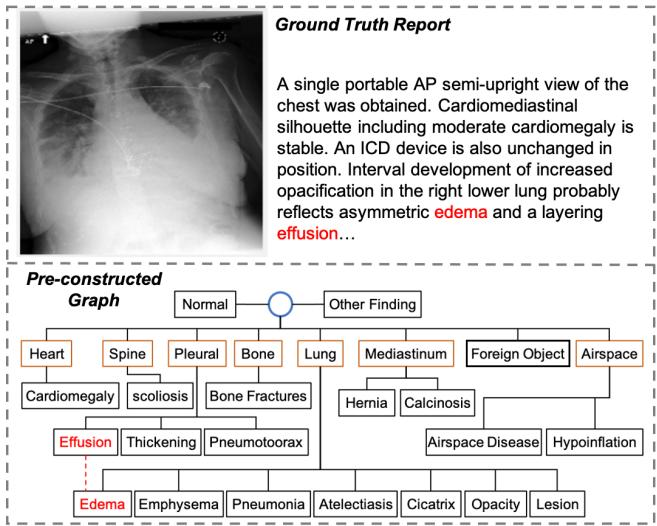
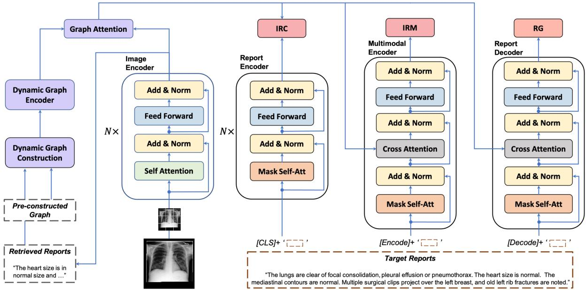
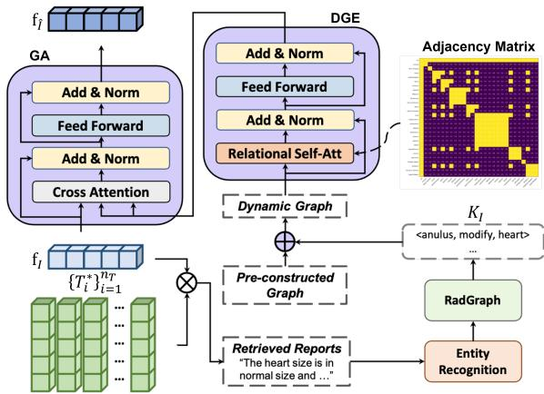
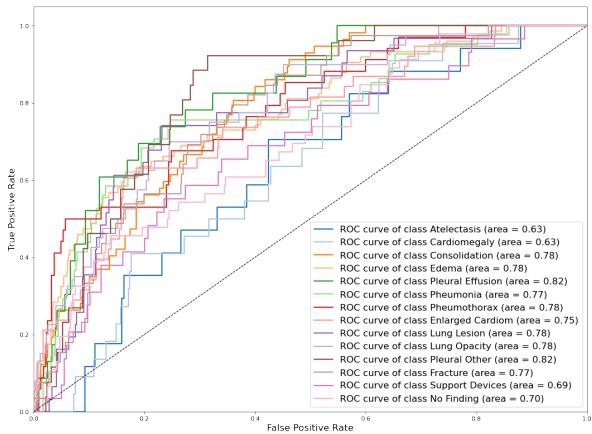
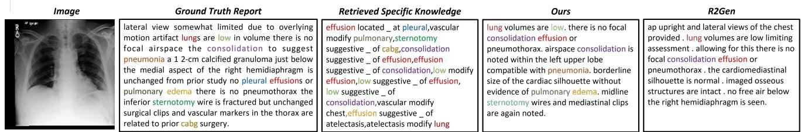

# Dynamic Graph Enhanced Contrastive Learning for Chest X-ray Report Generation

Mingjie Li1 Bingqian Lin2 Zicong Chen5 Haokun Lin2 Xiaodan Liang2,3,4 Xiaojun Chang1\* 1ReLER, AAII, University of Technology Sydney 2School of ISE, Sun Yat-Sen University 3Department of Computer Vision, Mohamed bin Zayed University of Artificial Intelligence 4Peng Cheng National Lab 5The University of Hong Kong

## Abstract

Automatic radiology reporting has great clinical potential to relieve radiologists from heavy workloads and improve diagnosis interpretation. Recently, researchers have enhanced data-driven neural networks with medical knowledge graphs to eliminate the severe visual and textual bias in this task. The structures of such graphs are exploited by using the clinical dependencies formed by the disease topic tags via general knowledge and usually do not update during the training process. Consequently, the fixed graphs can not guarantee the most appropriate scope of knowledge and limit the effectiveness. To address the limitation, we propose a knowledge graph with Dynamic structure and nodes to facilitate chest X-ray report generation with Contrastive Learning, named DCL. In detail, the fundamental structure of our graph is pre-constructed from general knowledge. Then we explore specific knowledge extracted from the retrieved reports to add additional nodes or redefine their relations in a bottom-up manner. Each image feature is integrated with its very own updated graph before being fed into the decoder module for report generation. Finally, this paper introduces Image-Report Contrastive and Image-Report Matching losses to better represent visual features and textual information. Evaluated on IU-Xray and MIMIC-CXR datasets, our DCL outperforms previous state-of-the-art models on these two benchmarks.

## 1. Introduction

Recently, automatic report generation has received growing attentions from both machine learning and automatic medicine fields. It aims to generate semantically coherent and informative reports to describe the referring examination images, such as Chest X-Ray [8, 18], Lung CT Scan [26] or funds angiography [23]. Such techniques have great clinical potential in relieving junior radiologists from heavy workloads and reducing diagnosis errors by improv-

  
Figure 1. An illustration of one sample from MIMIC-CXR [18] and the pre-constructed graph in [46], where the blue circle, orange boxes and black boxes refer to the global node, organ-level entities and key findings, respectively. The red dash line here represents the unconnected relation. ing the interpretation [7, 30].

Witnessed the great progress in artificial intelligence, especially deep learning methods [12,25,39], researchers have proposed various data-driven neural networks for radiology reporting and achieved promising performances in metrics that measure descriptive accuracy [7, 44] and clinical correctness [11, 46]. Compared with the similar task generic image captioning [14], the key challenges in chest X-ray report generation (CRG) task are the severe visual and textual data bias [19, 26]. On the one hand, medical images are highly similar to each other due to the imaging methods and human tissues themselves. However, abnormal regions or lesions that should acquire more attentions usually locate at a small part and lack detailed annotations in existing CRG benchmarks. On the other hand, sentences that describe normal regions are likely to appear repeatedly among each dataset which disables the model to describe specific crucial abnormalities. Two concepts have been proved effective in eliminating those bias.

The first one is to integrate medical knowledge with ORG systems [24,30,44,46]. Zhang et al. [46] constructed a universal graph comprised of a global node, 7 organs/tissues and 20 findings (normal or disease keywords). Disease keyword nodes linked to the same organ are connected to each other and the root in the graph. This graph can enhance the relationships among findings and emphasize the disease keywords. Thus, it is also adopted in the following works [30, 44]. However, this graph is built from general knowledge and may be inappropriate in some cases. As the shown report in Fig. 1, it is observed that effusion should be suggestive of edema, however, such relationship is not modelled in the graph. Furthermore, some nodes like ‘cicatrix’ or ‘hypoinflation’ only appear very few times in two ORG benchmarks [8, 18]. Therefore, it is necessary to update the scope of knowledge for each case; In addition to the medical knowledge, recent works [5,11,31,38,43] utilize contrastive learning to improve the visual and textual representations by contrasting positive and negative pairs. They proposed various contrastive learning objectives to capture the abnormal regions from a chest X-Ray image. Since normal images usually dominate the dataset over abnormal ones [37], it is also crucial to recognize the normal or abnormal cases in the meantime.

In this paper, we propose a novel framework, named DCL, which exploits a dynamic graph integrating specific knowledge with general knowledge to enhance visual representations learned in a contrastive manner. We adopt the general knowledge with 28 entities from [46] as the fundamental structure of our graph, and the relationships are modelled in an adjacency matrix. Given a medical image, we first retrieve its semantically similar reports from the training set. Specific knowledge is extracted from those reports via RadGraph [17] and stored in triplets (<subjective entity, relation, objective entity>). And we integrate those triplets with the pre-constructed graph by dynamically adding additional nodes or linking two entities. We utilize a graph encoder to propagate information over the updated graph for refining the node features, which are initialized by a pretrained SciBert [4]. Then the dedicated node features are attended to visual representations for report generation via a Transformer [39] decoder. Based on the dynamic graph, we introduce a contrastive learning objective, image-report contrastive loss to well represent the visual features and textual information. In addition, contrastive learning can help ensure the accuracy of the report retrieval procedure in the dynamic graph construction process. Image-report matching loss is also employed to further improve the performances.

We evaluate our method on two benchmarks, IU-Xray [8] and MIMIC-CXR [18]. Experimental results demonstrate that our approach can either outperform or match previous state-of-the-art (SOTA) methods in metrics that measure descriptive accuracy and clinical correctness. It indicates that leveraging dynamic graphs to enhance contrastive learning is helpful to generate high-quality reports.

In summary, our main contributions are as follows:

• We propose a novel framework that leverages a dynamic graph to enhance visual representations with contrastive learning paradigms for radiology reporting.

• Our proposed dynamic graph integrates both general and specific knowledge; The contrastive learning objective can improve visual and textual representations and dynamic graph accuracy.

• We conduct extensive experiments on two popular benchmarks to show the effectiveness of our approach, which achieves the SOTA performance on both language generation and clinical efficacy metrics.

## 2. Related Work

## 2.1. Medical Report Generation Meets Knowledge Graph

When radiologists write reports, they will make inferences with their expert knowledge. Typically, a report contains many sections, e.g., impressions, finding, comparison and indication. Following the previous works, we combine the impressions and finding sections as the target for report generation. To endow the medical report generation systems with the capability to incorporate medical knowledge, various kinds of knowledge graphs have been explored and can be roughly divided into three groups. The first kind is proposed to emphasize the abnormal terminologies or disease keywords. Li et al. [20] collected abnormalities from MIMIC-CXR dataset, and utilized them as the node of their proposed abnormality graph. Edges here are the attention weights from source nodes to target nodes in the graph. Such graph is adopted in the following works [26, 48] as prior medical knowledge to enhance the generation procedure and can even facilitate the unsupervised learning framework [32]. Secondly, Zhang et al. [46] and Liu et al. [30] adopted a universal graph with 20 entities. Entities linked to the same organ are connected to each other in the graph. Such relationships are modelled into an adjacency matrix and utilized to propagate messages in a graph encoding module. Since this graph is pre-constructed with prior knowledge in a fixed structure, we found that it can not guarantee the appropriate scope of knowledge for some cases (e.g. missing or unconnected common entities). To tackle this challenge, Liu et al. [30] utilized the global representations from pre-retrieved reports from the training corpus to model domain-specific knowledge. In contrast, we aim to directly update the pre-constructed graph to model the appropriate knowledge. In the last, Li et al. [24] constructed a clinical graph by extracting structural information from the training corpus via a NLP-rule-based algorithm. They restored a set of triplets for each case to model the domain-specific knowledge and replace the visual representations.

  
Figure 2. Illustration of our proposed Dynamic graph enhanced Contrastive Learning approach (DCL). DCL contains two unimodal encoders, a multimodal encoder, a report decoder and three dynamic graph modules for construction, encoding and cross-modal attention, respectively. In addition to Report Generation (RG) loss, Image-Report Contrastive (IRC) loss and Image-Report Matching (IRM) loss are adopted for training DCL.

Our approach is based on the second category. Instead of using the fixed graph in [46], we dynamically update the graph by injecting new knowledge extracted from the retrieved reports for each case. As a result, the appropriate scope of knowledge for different cases can be activated to generate more high-quality reports.

## 2.2. Contrastive Learning

The goal of contrastive learning is to improve representation learning by contrasting positive/negative or similar/dissimilar pairs. Inspired by the recent success of contrastive learning in vision-and-language pretraining tasks [21], some works have introduced it in the CRG systems. Yan et al. [43] developed a weakly supervised method to contrast target reports with incorrect ones by identifying “hard” negative samples. To detect the abnormal regions, Liu et al. [31] compared the referring image with known normal images via a contrastive attention mechanism. Other works [5, 42, 45] employed contrastive learning during the pretraining process to better represent visual features and textual information. All those works aimed to improve the expressiveness of both visual and textual representations and then facilitate radiology reporting. In our work, contrastive learning can also improve the accuracy of the dynamic graph by training the model to retrieve the most semantically similar reports.

## 3. Methodology

In this section, we will introduce the detailed implementations of our proposed Dynamic graph enhanced Contrastive Learning approach (DCL). The overall structure of DCL is illustrated in Fig. 2, which contains four basic modules and three dynamic graph modules with three training objectives. We first describe the background of DCL and then introduce the dynamic graph modules and contrastive learning objectives, respectively.

## 3.1. Background

Notation In this work, we aim to leverage dynamic graphs to enhance contrastive learning for radiology reporting. In the CRG task, the computer is asked to describe a given medical image I with a free-text report ${ \cal T } =$ $\left\{ y _ { 1 } , y _ { 2 } , \ldots , y _ { n } \right\}$ . We denote the target report by $\hat { T } \ =$ $\{ \hat { y } _ { 1 } , \hat { y } _ { 2 } , \dots , \hat { y } _ { \hat { n } } \}$ . n and nˆ represent the numbers of tokens in a report. Our dynamic graph, denoted by $G = \{ V , E \}$ where V and E are the sets of nodes and edges, respectively, is built on a pre-constructed graph $G _ { p r e }$ proposed in [46] and updated with specific knowledge $\mathsf { \bar { K } } _ { I } = \{ k _ { I } ^ { 1 } , . . . , k _ { I } ^ { n _ { K } } \}$ extracted from retrieved reports $\{ T _ { i } ^ { * } \} _ { i = 1 } ^ { n _ { T } }$ . Each k is stored in a triplet format, which consists of a subjective entity $\boldsymbol { e } _ { s } ,$ an objective entity $e _ { o }$ and their relation $r . \ n _ { T }$ and $n _ { K }$ are the numbers of reports and triplets, respectively. All the triplets are acquired from the RadGraph [17].

Typical CRG systems are encoder-decoder frameworks. The encoder is usually a CNN, $e . g .$ g., ResNet [12] or DenseNet [15], encodes the given image I to dense visual vectors $\mathbf { f } _ { I }$ . The decoder is usually a RNN (e.g., LSTM [13]) or a Transformer [39], which decodes $\mathbf { f } _ { I }$ to a report T. In this work, we adopt the Transformer [39] as the backbone to generate the long and robust reports.

Image Encoder Recently, visual Transformers have shown superior capabilities to represent images than CNNs. Thus, we only employ a ViT [10] pretrained on the ImageNet [9] as the image encoder to simplify the architecture. The input image will be divided into 196 patches, and a [CLS] token is further appended to the beginning of sequence before being fed into the encoder layers. The whole process of an encoder layer $\mathbf { f } _ { e } ( \cdot )$ can be written as follows:

$$
\mathbf { f } _ { e } ( x ) = \mathrm { L N } ( \mathrm { F F N } ( e _ { a t t n } ) + e _ { a t t n } ) ,\tag{1}
$$

$$
e _ { a t t n } = \mathrm { L N } ( \mathrm { M H A } ( x ) + x ) ,\tag{2}
$$

where FFN and LN denote the Feed Forward Network [39] and Layer Normalization operation [2], respectively. x is the input of each encoder layer. MHA [39] (multi-head attention) divides a scaled dot-product attention into n parallel heads and each head Att(·) can be written as follows:

$$
\operatorname { A t t } ( x ) = \operatorname { s o f t m a x } ( \frac { \mathbf { Q } ^ { x } ( \mathbf { K } ^ { x } ) ^ { \top } } { \sqrt { d } } ) \mathbf { V } ^ { x } ,\tag{3}
$$

where $d = 7 6 8$ is the dimension of the embedding space and $\{ \mathbf { Q } , \mathbf { K } ^ { * } , \mathbf { V } ^ { * } \}$ are the packed d-dimensional Query, $K e y ,$ Value vectors, respectively. The final output is the encoded visual vectors $\mathbf { f } _ { I } ,$ which will be used for report generation. Report Decoder Our report decoder consists of two Transformer decoder layers. The whole process of a decoder layer $\mathbf { f } _ { d } ( \cdot )$ can be written as follows:

$$
\mathbf { f } _ { d } ( \mathbf { y } ) = \mathrm { L N } ( \mathrm { F F N } ( e _ { c a } ) + e _ { c a } ) ,\tag{4}
$$

$$
e _ { c a } = \mathrm { L N } ( \mathbf { C A } ( e _ { a t t n } , \mathbf { f } _ { I } ) + e _ { a t t n } ) ,\tag{5}
$$

$$
e _ { a t t n } = \mathrm { L N } ( \mathrm { M M H A } ( \mathbf { y } ) + \mathbf { y } ) ) ,\tag{6}
$$

where MMHA and CA represent the masked multi-head self-attention and cross attention mechanism in [39]. $\mathbf { y }$ is the input of decoder. A [Decode] token is added to the beginning of $\mathbf { y }$ to signal the start while a [EOS] token is to signal its end. In Cross-attention sublayer, for each head, $\{ \mathbf { Q } , \mathbf { K } ^ { * } , \mathbf { V } ^ { * } \}$ comes from $\mathbf { Q } = W _ { q } * e _ { a t t n } , \mathbf { K } = W _ { k } * \mathbf { f } _ { I }$ and $\mathbf { V } = W _ { v } * \mathbf { f } _ { I }$ , where W are the learnable parameters. The $f _ { d } ( \mathbf { y } )$ will be sent to a Linear & Log-Softmax layer to get the output of target sentences. Notably, only token embedding is adopted during the decoding procedure. The entire auto-regressive generation process can be written as follows:

$$
p ( T | I ) = \prod _ { t = 1 } p ( y _ { t } | y _ { 1 } , \ldots , y _ { t - 1 } , I ) .\tag{7}
$$

where $y _ { t }$ is the input token in time step t.

Typically, the report generation objective is the crossentropy loss to compare the predicted token index sequence with the ground truth. Given the ground truth report $\hat { T }$ , all the underlying modules are trained to maximize $p ( \mathbf { y } | I )$ by minimizing the following:

$$
\mathcal { L } _ { \mathrm { R G } } = - \sum _ { t = 1 } ^ { \hat { n } } \log p ( \hat { y } _ { t } | \hat { y } _ { 1 } , \cdot \cdot \cdot , \hat { y } _ { t - 1 } , I ) .\tag{8}
$$

## 3.2. Dynamic Graph

The chest knowledge graph $G _ { p r e }$ proposed in [46] has been widely integrated with CRG systems to emphasize the disease keywords and enhance their relationships. $G _ { p r e }$ consists of 27 entities and a root node referring to the global feature and an adjacency matrix $A = \{ e _ { i j } \}$ to represent the edges V. Each node is a disease keyword and we set $e _ { i j }$ to 1 when source node $n _ { i }$ connects target node $n _ { j }$ . Nodes linked to the same organ or tissue are connected to each other and the root. This graph is not updated during the training, and we found that it limits the effectiveness from two aspects. Firstly, those entities can not cover the most common disease keywords for all datasets because of the dataset bias; Secondly, entities linked to different organs can also affect each other clinically. To tackle those limitations, we propose a dynamic graph G with dynamic structure and nodes and integrate it with visual features to generate high-quality reports. This process is illustrated in Fig. 3, and we will introduce the three key modules, i.e., dynamic graph construction, dynamic graph encoder, and graph attention in this section, respectively.

Dynamic Graph Construction We construct our graph in a bottom-up manner, in which we first construct the fundamental structure from general knowledge and then add nodes or redefine their relationships according to specific knowledge. We extend Gmx $G _ { p r e }$ to our fundamental structure with 28 entities consisting of a global node represented by a [CLS] token, 7 organs or tissues, and 20 disease keywords. In addition to link criteria in $G _ { p r e }$ , every organ will connect to each other organ or tissue.

To get the specific knowledge for each given image $I ,$ we first retrieve the top-nT similar reports $\{ T _ { i } ^ { * } \} _ { i = 1 } ^ { n _ { T } }$ by calculating the similarity between the visual feature $\mathbf { f } _ { I }$ and representations of reports in queue $\{ { \bf f } _ { T ^ { * } } ^ { i } \} _ { i = 1 } ^ { n _ { Q } }$ , where $n _ { Q }$ is the length of the report queue. For each retrieved report, we extract anatomy and observation entities by Stanza [47]. Those entities are further utilized to quote the specific knowledge $K _ { I }$ from RadGraph [17]. Each triplet k in $K _ { I }$ aims to depict the relationship between source and target entities. There are three kinds of relations in RadGraph, namely ‘suggestive $o f '$ , ‘modify’ and ‘located $\overrightarrow { a t } \overrightarrow { \mathbf { \nabla } }$ . For a triplet whose only source entity $e _ { s }$ or target entity $e _ { o }$ is in the graph, we will add another entity in the triplet as an additional node, and set their relation to 1 in the adjacency matrix A. Note that if the relation is ‘located $\boldsymbol { a } \boldsymbol { t ^ { \prime } }$ and the entity needed to be added is the target entity $e _ { o } , e _ { o }$ will be treated as an organ/tissue node. In this bottom-up manner, our dynamic graph is capable to exploit both general and specific knowledge.

Dynamic Graph Encoder We propose a dynamic graph encoder to propagate information and learn dedicated node features in our dynamic graph. To this end, this module is built upon the standard Transformer encoder layer $\mathbf { f } _ { G }$ and conducted as (see Figure 3):

$$
\mathbf { f } _ { G } = \mathbf { L N } ( \mathrm { F F N } ( e _ { r s a } ) + e _ { r s a } ) ,\tag{9}
$$

$$
e _ { r s a } = \mathrm { L N } ( \mathrm { R S A } ( \mathbf { f } _ { N } , A ) + \mathbf { f } _ { N } ) ,\tag{10}
$$

where RSA is an MMHA-like relational self-attention module to encode the structural information of a graph to the model. Concretely, we utilize adjacency matrix A as a visible mask [24,33] to control the original MMHA. It promises that each node can only impact its linked nodes and enhance their relationships. ${ \bf f } _ { N }$ is the initialized nodes representations and consists of entity embedding and level encoding. Previous works initialized representations randomly, which limits the effectiveness seriously [49]. Moreover, some additional nodes appear a few times during the training and hard to find the best embeddings. Therefore, we first adopt word embeddings $\epsilon _ { s c i }$ from well-trained SciBert [4] to initialize each entity. For those entities consisting of one more word, $e . g .$ , ‘foreign object’, we calculate the average. Furthermore, we add level encoding $\epsilon _ { l }$ to demonstrate each node is the root, organ, or disease keyword. Thus, the structural information of our graph is well represented and encoded during message passing and propagation.

Graph Attention Graph attention aims to integrate knowledge from dynamic graphs with visual features. Following [30], we utilize cross attention to achieve this goal. The whole process can be written as follows:

$$
\mathbf { f } _ { \hat { I } } = \mathrm { L N } ( \mathrm { F F N } ( e _ { g a } ) + e _ { g a } ) ,\tag{11}
$$

$$
e _ { g a } = \operatorname { L N } ( \operatorname { C A } ( \mathbf { f } _ { I } , \mathbf { f } _ { G } ) ) + \mathbf { f } _ { I } ) .\tag{12}
$$

In each head, Query comes from visual features $\mathbf { f } _ { I }$ while Key and Value come from the learned graph representations $\mathbf { f } _ { G }$ . Finally, we get the dynamic graph enhanced visual features $\mathbf { f } _ { \hat { I } } .$ . Notably, the first token in both $\mathbf { f } _ { \hat { I } }$ and $\mathbf { f } _ { G }$ is [CLS] to aggregate visual and graph information.

## 3.3. Contrastive Learning

Collecting paired image and text data is prohibitively expensive leading to a smaller size of CRG datasets compared with captioning datasets, like COCO [28]. It hinders the potential of existing data-driven CRG systems. In this section, we introduce the image-report contrastive loss used in our DCL, which can effectively improve the visual and textual representations as well as ensure the report retrieval accuracy in the dynamic graph construction process. Moreover, inspired by recent vision-language pretraining works [21,22], we also adopt an image-report matching loss in the proposed method for further enhancing the representations to improve the performance.

  
Figure 3. illustration of our proposed dynamic graph construction, dynamic graph encoder (DGE), and graph attention (GA) modules. The structure of the pre-constructed graph can be found in Fig. 1.

Image-Report Contrastive Loss (IRC) can activate radiology reporting by encouraging the positive image-report pairs to have similar representations in contrast to the negative pairs. A report encoder with the same architecture as an image encoder is utilized to extract textual representations ${ \bf f } _ { T }$ referring to the positive or negative report. Then we calculate the similar between two [CLS] representations by $s = W _ { I } ( V _ { c l s } ) ^ { t } W _ { T } ( T _ { c l s } )$ , where $W _ { I }$ and $W _ { T }$ are two learnable matrices. we also maintain two queues to store the most recent M image-report representations from the momentum image and report encoders. After a Softmax activation, we can get the image-report similarity $\begin{array} { r } { f _ { m } ^ { i 2 r } ( I ) = \frac { \exp s ( I , T _ { m } ) / \tau } { \sum _ { m = 1 } ^ { M } \exp s ( I , T _ { m } ) / \tau } } \end{array}$ and the report-image similarity $f _ { m } ^ { r 2 i } ( T )$ , where $\tau$ is a learnable temperature parameter. The IRC can be written as follows:

$$
\mathcal { L } _ { \mathrm { I R C } } = \frac { 1 } { 2 } ( \mathcal { L } _ { \mathrm { c e } } ( g ( T ) , f ( T ) ) + \mathcal { L } _ { \mathrm { c e } } ( g ( I ) , f ( I ) ) ) ,\tag{13}
$$

where $\mathcal { L } _ { \mathrm { c e } }$ is the cross entropy loss and $g ( I )$ is the ground truth of image-report similarity.

Image-Report Matching Loss (IRM) is a binary classification task to predict whether the given image-report pair is positive (matched) or negative (unmatched). Different from IRC, we utilize a multimodal encoder to capture the multimodal representations via cross attention mechanism. Then [Encode] vector is projected to $d = 2$ with a linear layer to predict the probability $p ^ { i t m }$ . The IRM is conducted as:

$$
{ \mathcal { L } } _ { \mathrm { I R M } } = { \mathcal { L } } _ { \mathrm { c e } } ( g ^ { i t m } , p ^ { i t m } ) .\tag{14}
$$

Finally, we calculate the sum of $\mathcal { L } _ { \mathrm { { R G } } } , \mathcal { L } _ { \mathrm { { I R C } } }$ and $\mathcal { L } _ { \mathrm { I R M } }$ as our total loss function. Notably, the multimodal encoder is only used during the training process to improve representation learning.

## 4. Experiments

## 4.1. Datasets, Evaluation Metrics and Settings

We evaluate our proposed DCL on two widely-used radiology reporting benchmarks, IU-Xray [8] and MIMIC-CXR [18]. We adopt the settings in [7,30] to split those two datasets and preprocess the reports for a fair comparison. IU-Xray [8] has been widely used to evaluate the performance of radiology reporting systems. It contains 3,955 radiology reports and 7,470 chest xray images. Either frontal or frontal and lateral view images are associated with each report. Following [7, 20], we exclude those cases with only one image and finally get 2069/296/590 cases for training/validation/testing. By Stanza [47], 739 unique entities are extracted and utilized as dynamic node candidates.

MIMIC-CXR [18] is the largest radiology dataset to date, consisting of 368,960 chest X-ray images and 222,758 radiology reports and is splitted officially. Recently, various MIMIC-child datasets have been proposed by exploring structural radiology information, e.g., Chest ImaGenome [41] and RadGraph [17]. In this work, we adopt RadGraph to update our dynamic structure. Classified by relation, RadGraph consists of 2,895,725 (suggestive of), 6,115,264 (located at) and 4,010,875 (modify) triplets.

Natural Language Generation Metrics (NLG) are used to measure the descriptive accuracy of predicted reports. CIDEr [40] and BLEU [36] are two main NLG metrics used to measure the quality of predicted reports. BLEU is proposed for machine translation tasks and measures the word n-gram overlap between predictions and reports. Due to the textual bias in CRG datasets, CRG systems can achieve considerable BLEU values even when they just repeat the most frequent sentences. In contrast, CIDEr is tailored to evaluate captioning systems by rewarding topic terms (terminologies in CRG task) and penalizing frequent terms. Additionally, values of ROUGE-L [27] and METEOR [3] are also reported for comparison.

Clinical Efficacy Metrics are recently proposed to capture and evaluate the clinical correctness of predicted reports. It first employs the CheXPert labeling tool proposed in [16] to label predicted reports and the ground truth reports in 14 different medical terminologies. Then classification measurements, i.e., F1-Score, Precision and Recall are calculated to evaluate how well the generated report describes the abnormalities. Since the provider of IU-Xray does not use CheXPert to build the labels, CE metrics are only reported on the MIMIC-CXR dataset [38, 44].

Experimental Settings We use the same image encoder for different views images and concatenate visual tokens via fusion operation for further process. Considering the domain gap between medical and generic texts, we employ a pretrained SciBert [4] to serve as a tokenizer and report encoder. The model is trained on 4 NVIDIA 2080 Ti GPUs with batch sizes 8 and 30 epochs. The checkpoint acquires the highest CIEDr metric is used for testing. The learning rate is set as 1e-4 and the optimizer is AdamW [34] with a weight decay of 0.02. The top 3 similar reports from the text queue Q are retrieved. And the size of Q is set as 65,536 and 1,380 for MIMIC-CXR and IU-Xray. The max length of specific knowledge is set as 90. For batch operation, the nodes in G are padded to 50 with a [PAD] token. Note that, we project all encoded vectors by a linear transformation layer into the dimension of $d = 7 6 8 .$

  
Figure 4. Micro-average of receiver operating characteristic curve for clinical abnormalities predictions from the generated reports.

## 4.2. Main Results

Descriptive Accuracy In Tab. 1, we compare our DCL with a wide range of existing state-of-the-art CRG systems on two benchmarks. R2Gen [7] and CMN [6] have been widely used as baseline CRG models recently. KERP [20], MKG [46], PPKED [30] and MGSK [44] are proposed to integrate medical knowledge with typical CRG backbones. CA [31] and CMCL [29] employ contrastive learning and curriculum learning to improve performance. The performances of other baseline models, such as HRGP [19], M2TR [35] and TopDown [1] are also reported. Since we follow the same settings, we directly cite the results from original papers. As shown in Tab. 1, our DCL achieves the SOTA descriptive accuracy, which outperforms others in CIDEr and ROUGE-L metrics and matches their performances in BLEU-4 and METEOR metrics. Higher CIDEr values demonstrate that our model does not repeat frequent sentences in training set but generates reports with more accurate topics.

Clinical Correctness We also evaluate our method by clinical efficacy (CE) metrics on the MIMIC-CXR dataset and compare the performances with other baseline models. Following official splitting, we directly cite the results from [44] for comparison. In Fig. 4, we show the micro-average of ROC for 14 chesty terminologies prediction and present the AUC scores. ‘Pleural Effusion’ and ‘Pleural Other’ achieve the highest AUCs (0.82). The experimental results in Tab. 2 reveal that our DCL significantly outperforms the previous models on three CE metrics. Compared with the current SOTA method MGSK [44] that also leverages general prior knowledge and specific knowledge from RadGraph [17], we make a performance-boosting. The improvement verifies the importance of our dynamic graph concepts and also demonstrates that our system can predict more accurate clinical information.

<table><tr><td colspan="5">IU-Xray [8]</td><td colspan="5">MIMIC-CXR [18]</td></tr><tr><td>Methods</td><td>CIDEr</td><td>BLEU-4</td><td>ROUGE-L</td><td>METEOR</td><td>Methods</td><td>CIDEr</td><td>BLEU-4</td><td>ROUGE-L</td><td>METEOR</td></tr><tr><td>R2Gen [7]</td><td>0.398</td><td>0.165</td><td>0.371</td><td>0.187</td><td>R2Gen [7]</td><td>0.253</td><td>0.103</td><td>0.277</td><td>0.142</td></tr><tr><td>KERP [20]</td><td>0.280</td><td>0.162</td><td>0.339</td><td></td><td>CMN [6]</td><td></td><td>0.106</td><td>0.278</td><td>0.142</td></tr><tr><td>HRGP [19]</td><td>0.343</td><td>0.151</td><td>0.322</td><td>=</td><td>TopDown [1]</td><td>0.073</td><td>0.092</td><td>0.267</td><td>0.129</td></tr><tr><td>MKG [46]</td><td>0.304</td><td>0.147</td><td>0.367</td><td></td><td>M2TR [35]</td><td></td><td>0.107</td><td>0.272</td><td>0.145</td></tr><tr><td>PPKED [30]</td><td>0.351</td><td>0.168</td><td>0.376</td><td>0.190</td><td>PPKED [30]</td><td>0.237</td><td>0.106</td><td>0.284</td><td>0.149</td></tr><tr><td>MGSK [44]</td><td>0.382</td><td>0.178</td><td>0.381</td><td></td><td>MGSK [44]</td><td>0.203</td><td>0.115</td><td>0.284</td><td></td></tr><tr><td>CA [31]</td><td></td><td>0.169</td><td>0.381</td><td>0.193</td><td>CA [31]</td><td></td><td>0.109</td><td>0.283</td><td>0.151</td></tr><tr><td>CMCL [29]</td><td>-</td><td>0.162</td><td>0.378</td><td>0.186</td><td>CMCL [29]</td><td>-</td><td>0.097</td><td>0.281</td><td>0.133</td></tr><tr><td>Ours</td><td>0.586</td><td>0.163</td><td>0.383</td><td>0.193</td><td>Ours</td><td>0.281</td><td>0.109</td><td>0.284</td><td>0.150</td></tr></table>

Table 1. The performances of our proposed DCL compared with other state-of-the-art systems on IU-Xray and MIMIC-CXR dataset. The best results in each column are highlighted in bold. CIDEr [40] is proposed to evaluate captioning systems.
<table><tr><td>Methods</td><td>Precision</td><td>Recall</td><td>F1-score</td></tr><tr><td>TopDown [1] M2TR [35]</td><td>0.166 0.240</td><td>0.121 0.428</td><td>0.133 0.308</td></tr><tr><td>R2Gen [7] MKSG [44]</td><td>0.333 0.458</td><td>0.273</td><td>0.276</td></tr><tr><td>Ours w/o G</td><td></td><td>0.348</td><td>0.371</td></tr><tr><td>Ours w/o LIRC</td><td>0.275</td><td>0.185</td><td>0.194</td></tr><tr><td></td><td>0.463</td><td>0.337</td><td>0.359</td></tr><tr><td>Ours w/o LIRM</td><td>0.469</td><td>0.353</td><td>0.372</td></tr><tr><td>Ours</td><td>0.471</td><td>0.352</td><td>0.373</td></tr></table>

Table 2. The comparison of the clinical efficacy metrics on MIMIC-CXR dataset. The w/o is the abbreviation of without.

## 4.3. Ablation Study

In this section, we conduct ablation studies on IU-Xray and MIMIC-CXR datasets to investigate the contribution of each component in our proposed DCL. Tab. 3 presents the quantitative analysis of DCL on IU-Xray with measuring descriptive accuracy. And clinical correctness evaluation is reported in Tab. 2. Our base model only keeps the image encoder and report decoder and employs $\mathcal { L } _ { \mathrm { R G } }$

Effect of Dynamic Graph Our dynamic graph is constructed in a bottom-up manner, that exploits general knowledge from $G _ { p r e }$ and specific knowledge $K _ { I }$ extracted from retrieved Top-3 similar reports. Comparing the base model with settings (a) and (b), our dynamic graph can boost the performance of base model, substantially. More specifically, leveraging the general knowledge only lead to an increase on all NLG metrics by 15.2% on CIDEr and 1.1% on BLEU-4. By integrating specific knowledge, our dynamic graph can further boost the performances, e.g. 0.535 → 0.557 on CIDEr. It demonstrates the effectiveness and necessity of constructing dynamic graphs for each image. We hypothesize that this performance improvement may be due to that the dynamic knowledge can emphasize keywords when generating reports since dynamic nodes are from retrieved reports. It has been proved in Tab. 2, leveraging dynamic graph significantly improve the performances on all CE metrics, which means the generated reports can provide more accurate medical terminologies.

Effect of Contrastive Learning Sequentially, we evaluate the effectiveness of two introduced learning objectives, i.e., image report contrastive loss (IRC) and image report matching loss (IRM). The performances of settings (b,c) in Tab. 2 show that both IRC and IRM can boost the base model performances. It proves the importance of visual and textual representation qualities since severe data bias in CRG datasets will degenerate the representation capabilities seriously. However, comparing (c) and (d), it is observed that IRC brings more improvement than IRM. We speculate the reason is that IRC can straightly improve visual and textual representations by aligning similar pairs. In contrast, IRM works on multimodal representations and represents unimodal in an indirect manner.

Choice of Parameter Initialization We employ a pretrained ViT [10] and SciBert [4] as image and report encoder in our implementation. It is worth noting that Transformers lack some of the inductive biases inherent to CNNs and therefore generalize bad with insufficient and unbalanced data [10]. Not surprisingly, comparing setting (f) and the full model, the performances drop steeply without pretrained ViT parameters. The performances of setting (e)

<table><tr><td>Settings</td><td> $G _ { p r e }$ </td><td>KI</td><td>IRC</td><td>IRM</td><td>ViT [10]</td><td>SciBert [4]</td><td>CIDEr</td><td>BLEU-4</td><td>ROUGE-L</td><td>METEOR</td></tr><tr><td>Base</td><td></td><td></td><td></td><td></td><td>V</td><td>√</td><td>0.383</td><td>0.133</td><td>0.277</td><td>0.163</td></tr><tr><td>(a)</td><td>√</td><td></td><td></td><td></td><td>V</td><td>√</td><td>0.535</td><td>0.144</td><td>0.349</td><td>0.180</td></tr><tr><td>(b)</td><td>V</td><td>V</td><td></td><td></td><td>V</td><td>V</td><td>0.557</td><td>0.150</td><td>0.361</td><td>0.182</td></tr><tr><td>(c)</td><td>√</td><td>√</td><td>√</td><td></td><td>V</td><td>√</td><td>0.580</td><td>0.161</td><td>0.385</td><td>0.188</td></tr><tr><td>(d)</td><td>V</td><td>V</td><td></td><td>√</td><td>V</td><td>√</td><td>0.564</td><td>0.155</td><td>0.370</td><td>0.188</td></tr><tr><td>(e)</td><td>√</td><td>V</td><td>√</td><td>V</td><td>√</td><td></td><td>0.580</td><td>0.158</td><td>0.374</td><td>0.190</td></tr><tr><td>(f)</td><td>√</td><td>V</td><td>√</td><td>√</td><td></td><td>√</td><td>0.527</td><td>0.158</td><td>0.356</td><td>0.179</td></tr><tr><td>DCL</td><td>√</td><td>V</td><td>√</td><td>√</td><td>√</td><td>√</td><td>0.586</td><td>0.163</td><td>0.383</td><td>0.193</td></tr></table>

Table 3. Quantitative analysis of proposed method on IU-Xray dataset. The base model consists of an image encoder and a report decoder with report generation loss only.  
  
Figure 5. Illustrations of reports from ground truth, ours and R2Gen [7] and retrieved specific knowledge for one sample from MIMIC-CXR [18]. For better visualization, different colors highlight different medical entities.

demonstrate the effectiveness of pretrained SciBert. The improvement comes from two aspects. Firstly, it provides well pretrained parameters; Secondly, its tokenizer encodes each token (medical terminology) with a well pretrained embedding, which avoids Graph Transformers to propagate similar hidden states [49].

## 4.4. Case Study

To further investigate the effectiveness of our method, we perform qualitative analysis on MIMIC-CXR [18] with their retrieved specific knowledge, and reports from ground truth, our model and R2Gen [7]. Entities extracted by Stanza [47] from the ground truth report have been highlighted with different colors. It is observed that some entities, e.g. cabg, consolidation, and sternotomy) are not included in the pre-constructed graph node lists. This observation proves our motivation for constructing knowledge graphs dynamically. We conduct the same operation on retrieved reports and use extracted entities to quote related triplets from Rad-Graph [17]. Those triplets are known as specific knowledge in this paper and shown in Fig. 5. Retrieved specific knowledge triplets <sternotomy,suggestive of,cabg> and <consolidation,suggestive of,effusion> demonstrate that the retrieved reports contain similar medical terminologies and clinical information. We speculate that IRC and IRM objectives bring such capabilities. Then the entities in our dynamic graph emphasize disease/organ keywords when generating reports and it is why our DCL can predict sentence “airspace consolidation is noted within the left upper lobe compatible with pneumonia.”, but R2Gen can not.

## 5. Conclusion and Discussion

In this paper, we present a practical approach to leverage dynamic graph to enhance contrastive learning for radiology report generation. In which the dynamic graph is constructed in a bottom-up manner to integrate retrieved specific knowledge with general knowledge. Then contrastive learning is employed to improve visual and textual representations, which also promises the accuracy of our dynamic graph. Experiments on two popular benchmarks verify the effectiveness of our method in generating accurate and meaningful reports. More encouragingly, our approach can outperform or match existing SOTA methods in language generation and clinical efficacy metrics.

Limitation and Future Work Retrieved reports can not be exactly the same as ground truth, and knowledge noises are involved during the dynamic graph construction process. It may guide the model to generate inaccurate sentences. In the future, we plan to propose a specific objective for the dynamic graph construction process to further improve the accuracy of dynamic graphs and the quality of predicted reports.

## Acknowledgements

This work was partially supported by “Taishan Scholars Youth Expert Program” of Shandong Province, and partially supported by National Key R&D Program of China under Grant No. 2020AAA0109700.

## References

[1] Peter Anderson, Xiaodong He, Chris Buehler, Damien Teney, Mark Johnson, Stephen Gould, and Lei Zhang. Bottom-up and top-down attention for image captioning and visual question answering. In Proceedings ofthe IEEE Conference on Computer Vision and Pattern Recognition, pages 6077–6086, 2018. 6, 7

[2] Jimmy Lei Ba, Jamie Ryan Kiros, and Geoffrey E Hinton. Layer normalization. arXiv preprint arXiv:1607.06450, 2016. 4

[3] Satanjeev Banerjee and Alon Lavie. Meteor: An automatic metric for mt evaluation with improved correlation with human judgments. In Proceedings of the acl workshop on intrinsic and extrinsic evaluation measuresfor machine translation and/or summarization, pages 65–72, 2005. 6

[4] Iz Beltagy, Kyle Lo, and Arman Cohan. Scibert: A pretrained language model for scientific text. In Proceedings of the Conference on Empirical Methods in Natural Language Processing, pages 3615–3620, 2019. 2, 5, 6, 7, 8

[5] Yu-Jen Chen, Wei-Hsiang Shen, Hao-Wei Chung, Jing-Hao Chiu, Da-Cheng Juan, Tsung-Ying Ho, Chi-Tung Cheng, Meng-Lin Li, and Tsung-Yi Ho. Representative image feature extraction via contrastive learning pretraining for chest x-ray report generation. arXiv preprint arXiv:2209.01604, 2022. 2, 3

[6] Zhihong Chen, Yaling Shen, Yan Song, and Xiang Wan. Cross-modal memory networks for radiology report generation. arXiv preprint arXiv:2204.13258, 2022. 6, 7

[7] Zhihong Chen, Yan Song, Tsung-Hui Chang, and Xiang Wan. Generating radiology reports via memory-driven transformer. In Proceedings of the Conference on Empirical Methods in Natural Language Processing, 2020. 1, 6, 7, 8

[8] Dina Demner-Fushman, Marc D Kohli, Marc B Rosenman, Sonya E Shooshan, Laritza Rodriguez, Sameer Antani, George R Thoma, and Clement J McDonald. Preparing a collection of radiology examinations for distribution and retrieval. Journal of the American Medical Informatics Association, 23(2):304–310, 2016. 1, 2, 6, 7

[9] Jia Deng, Wei Dong, Richard Socher, Li-Jia Li, Kai Li, and Li Fei-Fei. Imagenet: A large-scale hierarchical image database. In Proceedings of the IEEE Conference on Computer Vision and Pattern Recognition, pages 248–255, 2009. 4

[10] Alexey Dosovitskiy, Lucas Beyer, Alexander Kolesnikov, Dirk Weissenborn, Xiaohua Zhai, Thomas Unterthiner, Mostafa Dehghani, Matthias Minderer, Georg Heigold, Sylvain Gelly, et al. An image is worth 16x16 words: Transformers for image recognition at scale. arXiv preprint arXiv:2010.11929, 2020. 4, 7, 8

[11] Mark Endo, Rayan Krishnan, Viswesh Krishna, Andrew Y Ng, and Pranav Rajpurkar. Retrieval-based chest x-ray report generation using a pre-trained contrastive language-image model. In Machine Learning for Health, pages 209–219, 2021. 1, 2

[12] Kaiming He, Xiangyu Zhang, Shaoqing Ren, and Jian Sun. Deep residual learning for image recognition. In Proceed-

ings ofthe IEEE Conference on Computer Vision and Pattern Recognition, pages 770–778, 2016. 1, 4

[13] Sepp Hochreiter and Jurgen Schmidhuber. Long short-term¨ memory. Neural computation, 9(8):1735–1780, 1997. 4

[14] MD Zakir Hossain, Ferdous Sohel, Mohd Fairuz Shiratuddin, and Hamid Laga. A comprehensive survey of deep learning for image captioning. ACM Computing Surveys (CsUR), 51(6):1–36, 2019. 1

[15] Gao Huang, Zhuang Liu, Laurens Van Der Maaten, and Kilian Q Weinberger. Densely connected convolutional networks. In Proceedings ofthe IEEE Conference on Computer Vision and Pattern Recognition, pages 4700–4708, 2017. 4

[16] Jeremy Irvin, Pranav Rajpurkar, Michael Ko, Yifan Yu, Silviana Ciurea-Ilcus, Chris Chute, Henrik Marklund, Behzad Haghgoo, Robyn Ball, Katie Shpanskaya, et al. Chexpert: A large chest radiograph dataset with uncertainty labels and expert comparison. In Proceedings of the AAAI conference on artificial intelligence, volume 33, pages 590–597, 2019. 6

[17] Saahil Jain, Ashwin Agrawal, Adriel Saporta, Steven Truong, Tan Bui, Pierre Chambon, Yuhao Zhang, Matthew P Lungren, Andrew Y Ng, Curtis Langlotz, et al. Radgraph: Extracting clinical entities and relations from radiology reports. In Thirty-fifth Conference on Neural Information Processing Systems Datasets and Benchmarks Track (Round 1), 2021. 2, 4, 6, 7, 8

[18] Alistair E. W. Johnson, Tom J. Pollard, Seth J. Berkowitz, Nathaniel R. Greenbaum, Matthew P. Lungren, Chih ying Deng, Roger G. Mark, and Steven Horng. Mimic-cxr: A large publicly available database of labeled chest radiographs. arXiv preprint arXiv:1901.07042, 2019. 1, 2, 6, 7, 8

[19] Christy Y. Li, Xiaodan Liang, Zhiting Hu, and Eric P. Xing. Hybrid retrieval-generation reinforced agent for medical image report generation. In Proceedings of the Conference on Neural Information Processing Systems, 2018. 1, 6, 7

[20] Christy Y Li, Xiaodan Liang, Zhiting Hu, and Eric P Xing. Knowledge-driven encode, retrieve, paraphrase for medical image report generation. In Proceedings of the AAAI Conference on Artificial Intelligence, volume 33, pages 6666–6673, 2019. 2, 6, 7

[21] Junnan Li, Dongxu Li, Caiming Xiong, and Steven Hoi. Blip: Bootstrapping language-image pre-training for unified vision-language understanding and generation. arXiv preprint arXiv:2201.12086, 2022. 3, 5

[22] Junnan Li, Ramprasaath Selvaraju, Akhilesh Gotmare, Shafiq Joty, Caiming Xiong, and Steven Chu Hong Hoi. Align before fuse: Vision and language representation learning with momentum distillation. Advances in neural information processing systems, 34:9694–9705, 2021. 5

[23] Mingjie Li, Wenjia Cai, Rui Liu, Yuetian Weng, Xiaoyun Zhao, Cong Wang, Xin Chen, Zhong Liu, Caineng Pan, Mengke Li, et al. Ffa-ir: Towards an explainable and reliable medical report generation benchmark. In Thirty-fifth Conference on Neural Information Processing Systems Datasets and Benchmarks Track (Round 2), 2021. 1

[24] Mingjie Li, Wenjia Cai, Karin Verspoor, Shirui Pan, Xiaodan Liang, and Xiaojun Chang. Cross-modal clinical graph

transformer for ophthalmic report generation. In Proceedings ofthe IEEE Conference on Computer Vision and Pattern Recognition, pages 20656–20665, 2022. 2, 3, 5

[25] Mingjie Li, Po-Yao Huang, Xiaojun Chang, Junjie Hu, Y Yang, and Alex Hauptmann. Video pivoting unsupervised multi-modal machine translation. IEEE Transactions on Pattern Analysis and Machine Intelligence, 2022. 1

[26] Mingjie Li, Rui Liu, Fuyu Wang, Xiaojun Chang, and Xiaodan Liang. Auxiliary signal-guided knowledge encoderdecoder for medical report generation. World Wide Web, pages 1–18, 2022. 1, 2

[27] Chin-Yew Lin. ROUGE: A package for automatic evaluation of summaries. In Text Summarization Branches Out. Association for Computational Linguistics, July 2004. 6

[28] Tsung-Yi Lin, Michael Maire, Serge Belongie, James Hays, Pietro Perona, Deva Ramanan, Piotr Dollar, and C Lawrence´ Zitnick. Microsoft coco: Common objects in context. In Proceedings of the European Conference on Computer Vision, pages 740–755, 2014. 5

[29] Fenglin Liu, Shen Ge, and Xian Wu. Competence-based multimodal curriculum learning for medical report generation. arXiv preprint arXiv:2206.14579, 2022. 6, 7

[30] Fenglin Liu, Xian Wu, Shen Ge, Wei Fan, and Yuexian Zou. Exploring and distilling posterior and prior knowledge for radiology report generation. In Proceedings of the IEEE Conference on Computer Vision and Pattern Recognition, pages 13753–13762, 2021. 1, 2, 5, 6, 7

[31] Fenglin Liu, Changchang Yin, Xian Wu, Shen Ge, Ping Zhang, and Xu Sun. Contrastive attention for automatic chest x-ray report generation. In Findings of the Association for Computational Linguistics, pages 269–280, 2021. 2, 3, 6, 7

[32] Fenglin Liu, Chenyu You, Xian Wu, Shen Ge, Xu Sun, et al. Auto-encoding knowledge graph for unsupervised medical report generation. In Proceedings of the Conference on Neural Information Processing Systems, pages 16266–16279, 2021. 2

[33] Weijie Liu, Peng Zhou, Zhe Zhao, Zhiruo Wang, Qi Ju, Haotang Deng, and Ping Wang. K-bert: Enabling language representation with knowledge graph. In Proceedings of the AAAI Conference on Artificial Intelligence, volume 34, pages 2901–2908, 2020. 5

[34] Ilya Loshchilov and Frank Hutter. Decoupled weight decay regularization. arXiv preprint arXiv:1711.05101, 2017. 6

[35] Farhad Nooralahzadeh, Nicolas Perez Gonzalez, Thomas Frauenfelder, Koji Fujimoto, and Michael Krauthammer. Progressive transformer-based generation of radiology reports. arXiv preprint arXiv:2102.09777, 2021. 6, 7

[36] Kishore Papineni, Salim Roukos, Todd Ward, and Wei-Jing Zhu. Bleu: a method for automatic evaluation of machine translation. In Proceedings of the 40th Annual Meeting of the Associationfor Computational Linguistics, July 2002. 6

[37] Hoo-Chang Shin, Kirk Roberts, Le Lu, Dina Demner-Fushman, Jianhua Yao, and Ronald M Summers. Learning to read chest x-rays: Recurrent neural cascade model for automated image annotation. In Proceedings ofthe IEEE Conference on Computer Vision and Pattern Recognition, pages 2497–2506, 2016. 2

[38] Xiao Song, Xiaodan Zhang, Junzhong Ji, Ying Liu, and Pengxu Wei. Cross-modal contrastive attention model for medical report generation. In Proceedings of the 29th International Conference on Computational Linguistics, pages 2388–2397, 2022. 2, 6

[39] Ashish Vaswani, Noam Shazeer, Niki Parmar, Jakob Uszkoreit, Llion Jones, Aidan N Gomez, Łukasz Kaiser, and Illia Polosukhin. Attention is all you need. In Proceedings of the Conference on Neural Information Processing Systems, 2017. 1, 2, 4

[40] Ramakrishna Vedantam, C Lawrence Zitnick, and Devi Parikh. Cider: Consensus-based image description evaluation. In Proceedings of the IEEE Conference on Computer Vision and Pattern Recognition, 2015. 6, 7

[41] Joy Wu, Nkechinyere Agu, Ismini Lourentzou, Arjun Sharma, Joseph Paguio, Jasper Seth Yao, Edward Christopher Dee, William Mitchell, Satyananda Kashyap, Andrea Giovannini, et al. Chest imagenome dataset. PhysioNet, 2021. 6

[42] Xing Wu, Jingwen Li, Jianjia Wang, and Quan Qian. Multimodal contrastive learning for radiology report generation. Journal of Ambient Intelligence and Humanized Computing, pages 1–10, 2022. 3

[43] An Yan, Zexue He, Xing Lu, Jiang Du, Eric Chang, Amilcare Gentili, Julian McAuley, and Chun-nan Hsu. Weakly supervised contrastive learning for chest x-ray report generation. In Findings of the Association for Computational Linguistics: EMNLP 2021, pages 4009–4015, 2021. 2, 3

[44] Shuxin Yang, Xian Wu, Shen Ge, S Kevin Zhou, and Li Xiao. Knowledge matters: Chest radiology report generation with general and specific knowledge. Medical Image Analysis, page 102510, 2022. 1, 2, 6, 7

[45] Yuhao Zhang, Hang Jiang, Yasuhide Miura, Christopher D Manning, and Curtis P Langlotz. Contrastive learning of medical visual representations from paired images and text. arXiv preprint arXiv:2010.00747, 2020. 3

[46] Yixiao Zhang, Xiaosong Wang, Ziyue Xu, Qihang Yu, Alan Yuille, and Daguang Xu. When radiology report generation meets knowledge graph. In Proceedings of the AAAI Conference on Artificial Intelligence, volume 34, pages 12910– 12917, 2020. 1, 2, 3, 4, 6, 7

[47] Yuhao Zhang, Yuhui Zhang, Peng Qi, Christopher D Manning, and Curtis P Langlotz. Biomedical and clinical english model packages for the stanza python nlp library. Journal of the American Medical Informatics Association, 28(9):1892– 1899, 2021. 4, 6, 8

[48] Haifeng Zhao, Jie Chen, Lili Huang, Tingting Yang, Wanhai Ding, and Chuanfu Li. Automatic generation of medical report with knowledge graph. In Proceedings of the International Conference on Computing and Pattern Recognition, pages 1–1, 2021. 2

[49] Yizhen Zheng, Shirui Pan, Vincent Cs Lee, Yu Zheng, and Philip S Yu. Rethinking and scaling up graph contrastive learning: An extremely efficient approach with group discrimination. In Proceedings of the Conference on Neural Information Processing Systems, 2022. 5, 8