# Dynamic Inference with Grounding Based Vision and Language Models

Burak Uzkent, Amanmeet Garg, Wentao Zhu, Keval Doshi, Jingru Yi, Xiaolong Wang, Mohamed Omar Amazon Prime Video

{burauzke,amanmega,zhuwent,kcdos,jyijingr,xiaowanf,omarmk}@amazon.com

## Abstract

Transformers have been recently utilized for vision and language tasks successfully. For example, recent image and language models with more than 200M parameters have been proposed to learn visual grounding in the pre-training step and show impressive results on downstream vision and language tasks. On the other hand, there exists a large amount ofcomputational redundancy in these large models which skips their run-time efficiency. To address this problem, we propose dynamic inferencefor grounding based vision and language models conditioned on the input imagetext pair. We first design an approach to dynamically skip multihead self-attention and feed forward network layers across two backbones and multimodal network. Additionally, we propose dynamic token pruning andfusion for two backbones. In particular, we remove redundant tokens at different levels of the backbones and fuse the image tokens with the language tokens in an adaptive manner. To learn policies for dynamic inference, we train agents using reinforcement learning. In this direction, we replace the CNN backbone in a recent grounding-based vision and language model, MDETR, with a vision transformer and call it ViT-MDETR. Then, we apply our dynamic inference method to ViTMDETR, called D-ViTDMETR, and perform experiments on image-language tasks. Our results show that we can improve the run-time efficiency of the state-of-the-art models MDETR and GLIP by up to ∼ 50% on Referring Expression Comprehension and Segmentation, and VQA with only maximum ∼ 0.3% accuracy drop.

## 1. Introduction

Significant progress has been made in the development of image and language models attributed to: (1) emergence of transformers for different modalities [6,13], and (2) large scale pre-training paradigms [4, 14, 17, 24, 29, 43, 44]. In particular, with the very large scale pre-training of image and language models, large number of parameters and computations are allocated for processing input image-text pair. Specifically, the number of parameters of recent vision and language models can be more than 200M [14, 17, 44], resulting in low run-time efficiency. This problem with the single-modality transformers has been tackled by several studies before [27, 30, 37]. Such computational complex ity is further amplified in multimodal networks often building on multiple transformer models. As a result, reducing the run-time complexity of the multimodal networks can be very beneficial for the downstream tasks. Existing methods including pruning [20], knowledge distillation [10, 33] and quantization [39] can potentially be extended toward this goal. However, they show significant performance drop (≥ 1%) at ≥ 50% compression rates and these methods are mostly designed for parameter reduction not for run-time speed. As a result, we propose dynamic inference with the large image and language models mainly to achieve two goals: (1) drastically reduce runtime complexity, and (2) maintain their high accuracy. Towards these goals, in the first step, we analyze the classic architectural choices for the recent image and language models. A typical image and language model consists of a vision encoder (a CNN or a vision transformer), a text encoder (transformer), and a multimodal transformer (fusion network). Inspired by MDETR [14], we build a vision and language model consisting of vision and language transformer and DETR-like multimodal network and call it ViTMDETR. The transformer modules consist of a multihead self attention (MSA) and feed forward network (FFN) blocks which are experimentally found to be computationally expensive modules in inference-time. It is also known that computationally complexity of transformer MSA module goes up quadratically w.r.t number of tokens. The number of tokens and the computational complexity gets further amplified with inclusion of multimodal inputs and related modules.

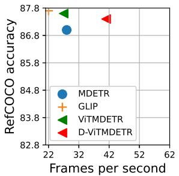

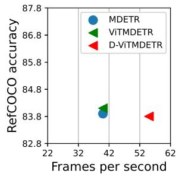

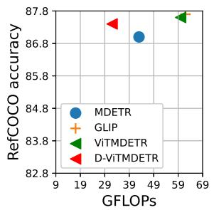

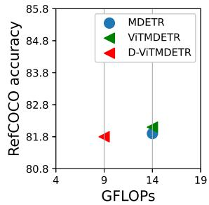  
Figure 1. Accuracy vs frames per second comparison of the large (Top Left) and small (Top Right) models and accuracy vs GLOPs comparison of the large (Bottom Left) and small (Bottom Right) models. D-ViTMDETR outperforms MDETR, GLIP and our ViT-MDETR model in both frames per second and GFLOPs metrics while maintaining high accuracy.

For these reasons, with our D-ViTMDETR model we propose to dynamically prune input tokens from multiple modalities across the transformer backbones and fuse vision tokens adaptively with the text tokens to improve the accuracy. This way, we can reduce the complexity quadratically. Additionally, we adaptively skip the computationally expensive MSA and FFN layers across the two backbones and the multimodal network to further improve run-time efficiency. To learn dynamic policies, we train decision networks using the policy-gradients based reinforcement learning algorithm and distill the knowledge from ViTMDETR to better optimize D-ViTMDETR.

In this research work, our contributions are as below:

• We introduce an MDETR-inspired transformer-based model ViTMDETR for grounding based vision and language tasks.

• We propose a novel method to learn dynamic token pruning and fusion actions to reduce computational complexity using reinforcement learning. Additionally, we train the same agents to learn MSA and FFN layer skipping throughout our vision and language model to further reduce complexity.

• For better optimization, we align the representations and predictions of D-ViTMDETR with the representations and predictions of the ViTMDETR model.

• We perform experiments with both our ViTMDETR and D-ViTMDETR models on several image and language benchmarks for Referring Expression Comprehension (REC) and Segmentation (RES), and VQA tasks. With our dynamic model, D-ViTMDETR, we can improve the run-time efficiency of the state-ofthe-art models MDETR [14] and GLIP [17] by up to ∼ 50% on Referring Expression Comprehension and

Segmentation, and VQA with only maximum ∼ 0.3% accuracy drop as seen in Figure 1.

## 2. Related Works

Grounding Based Image and Language Models We can categorize existing grounding based image and language models into two categories: (1) two-stage and (2) singlestage. Two-stage methods [4, 24, 42] rely on off-the-shelf object detectors to get object proposals and then process the language query for the task of interest. On the other hand, single-stage methods [3, 5, 7, 14, 17, 40, 44] avoid using a separate off-the-shelf object detector and perform end-toend training for detecting the referred object, reducing the computational complexity of the two-stage methods. The most recent vision and language models [5, 14, 17, 18, 38] utilize large-scale transformers to improve the accuracy of the previous models with CNN backbones [3,40]. Other recent works [19,29,31] including CLIP [29] have developed image and language models trained on large-scale data with high-level image-to-text contrastive learning objective.

Dynamic Inference with Transformers Dynamic inference with vision transformers have been mostly studied on single modality data. Wang et al. [35] proposed to leverage the redundancy in the image space to assign adaptive number of patches to each image. Other works [30,37,41] used adaptive number of tokens conditioned on the input. These studies exploit the redundancy on the input (image and tokens) to transformer encoders. On the other hand, depthadaptive inference for transformers showed strong improvements [1, 8, 11, 22]. Next, [27] performs conditional inference on the image space, in the attention heads and FFN components for the task of image recognition. However, there has been no dynamic method designed for multimodal tasks. Different from this studies, our study focuses on the vision and language models for the vision and language tasks. Since the amount of computation in the vision and language models will be drastically larger than the singlemodality tasks, we can expect further gains by using dynamic inference on the vision and language models. In addition to MSA and FFN layer skipping across the backbones and multimodal network, we perform dynamic token pruning for text and vision tokens and adaptively fuse vision tokens with text tokens.

## 3. Proposed Method

## 3.1. Building ViTMDETR

In our vision and language model, we have a vision encoder $f _ { v }$ and text encoder $f _ { t }$ parameterized by $\theta _ { v }$ and $\theta _ { t }$ that outputs representations $z _ { v } \in \mathbb { R } ^ { v }$ and $z _ { t } \in \mathbb { R } ^ { t }$ as

$$
z _ { v } ^ { i = N } = f _ { v } ( x _ { v } ; \theta _ { v } ) , \quad z _ { t } ^ { i = N } = f _ { t } ( x _ { t } ; \theta _ { t } ) .\tag{1}
$$

where N represents the number of encoders. The modalityspecific representations are then concatenated and passed to a third-stage multimodal network, $f _ { m } .$ , parameterized by $\theta _ { m }$ as

$$
z _ { m } = f _ { m } ( [ z _ { v } ^ { i = N } , z _ { t } ^ { i = N } ] ; \theta _ { m } )\tag{2}
$$

where $z _ { m } \in \mathbb { R } ^ { m }$ represents output of multimodal network. We then process $z _ { m }$ with an MLP layer to get task-specific predictions, i.e., referring expression comprehension (REC) and VQA. Given this multimodal network with list of parameters $\theta \ : = \ : [ \theta _ { v } , \theta _ { t } , \theta _ { m } ]$ , our goal is to introduce adaptivity in processing the modalities through vision and text backbones and multimodal network.

Text Backbone The text transformer first projects raw language data to word embeddings and sums them with the positional embedding formulated as

$$
z _ { t } ^ { i = 0 } = e _ { t } ( x _ { t } ) + p _ { t } ( x _ { t } )\tag{3}
$$

where, for a given input token $x _ { t } , \ e _ { t }$ and $p _ { t }$ represent the word and positional embedding functions.

Next, the transformer processes the input embeddings $z _ { t } ^ { i = 0 }$ by N encoders where each encoder consists of MSA, layer norm (LN), GELU [9], and FFN layers. Operations in a transformer encoder can be formulated as

$$
z _ { t } ^ { i } = M S A _ { t } ( L N _ { t } ( z _ { t } ^ { i } ) ) + z _ { t } ^ { i } ,\tag{4}
$$

$$
z _ { t } ^ { i + 1 } = F F N _ { t } ( L N _ { t } ( z _ { t } ^ { i } ) ) + z _ { t } ^ { i } .\tag{5}
$$

We note that we can skip the MSA or FFN layers together with LN layer without any modification to the architecture. This will be useful for our dynamic inference method.

Vision Backbone The vision transformer has a convolutional layer, $e _ { v }$ , to divide the input image into patches and learn patch representations. Patch embedding is then summed with the positional embedding, $p _ { v }$ as

$$
z _ { v } ^ { i = 0 } = e _ { v } ( x _ { v } ) + p _ { v } ( x _ { v } ) .\tag{6}
$$

Next, the vision transformer processes the input embedding $z _ { v } ^ { i = 0 }$ by N encoders with similar components to the text transformer encoder. We can formulate the operations in a vision transformer encoder as

$$
z _ { v } ^ { i } = M S A _ { v } ( L N _ { v } ( z _ { v } ^ { i } ) ) + z _ { v } ^ { i } ,\tag{7}
$$

$$
z _ { v } ^ { i + 1 } = F F N _ { v } ( L N _ { v } ( z _ { v } ^ { i } ) ) + z _ { v } ^ { i } .\tag{8}
$$

Similarly to the text transformer, we can skip the MSA or FFN layers without any modification to the architecture.

Multimodal Transformer We then pass the concatenated representations $[ z _ { t } ^ { i = N } , z _ { v } ^ { i = N } ]$ to a multimodal transformer. MDETR uses a DETR-based transformer [2] to output bounding box predictions for the given multimodal representations. For the REC task, we choose the bounding box predictions with the highest confidence score. For VQA, we do not output bounding boxes; instead, we output class probabilities for different answers. With DETR, we can use a different number of encoders and decoders on the input representations. In this study, we maintain the same structure with the DETR in the MDETR model for the multimodal transformer and use 6 encoders and 6 decoders with traditional transformer MSA and FFN layers on which we can perform skipping without any modification.

## 3.2. Dynamic Token Pruning and Fusion

To achieve dynamic inference, we first propose an approach to prune redundant multimodal tokens and fuse tokens adaptively. We note that we only fuse selected vision tokens with the text tokens and process the fused vision tokens and text tokens with the text backbone. We follow this strategy as pre-trained language transformers are known to generalize to image modality [25]. In this direction, we place a decision network on after every two encoders of the backbones. The decision network provides output for the token pruning and fusion as

$$
p _ { b } , s _ { b } = s i g m o i d ( f _ { d } ( [ z _ { v } ^ { i } , z _ { t } ^ { i } ] ; \theta _ { d } ) )\tag{9}
$$

where $p _ { b }$ represents the continuous predictions on token fusion and pruning across the two backbones whereas $\theta _ { d }$ represent the decision network parameters. On the other hand, $s _ { b }$ represents the actions for MSA and FFN layer skipping that we detail in the next section. We use a single dense layer for the decision network. Note that the number of tokens from each backbone can get large depending on the size of the image and text. As a result, it can be very hard to optimize the decision network to provide actions for many tokens.

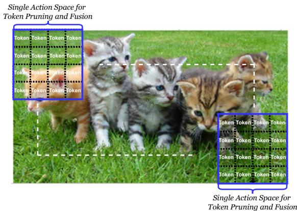  
Figure 2. Demonstration of action space for vision token pruning and fusion. We group each 16 neighboring tokens in a 64×64 window and represent the window with two actions: (1) token pruning and (2) fusion. The actions are then applied to the tokens inside this window.

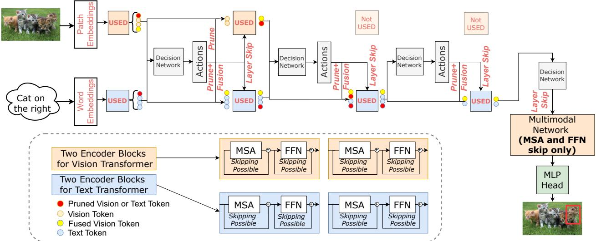  
Figure 3. Framework for combining the dynamic token fusion and pruning together with MSA and FFN layer skipping to get D ViTMDETR model. We do not show layer skipping in the multimodal network for simplicity. By combining layer skipping together with token pruning and fusion, we tackle redundancy in both across the backbones and multimodal network and the input data.

Reducing the Size of Action Space The amount of vision tokens can be very large especially for large size images given that each token covers $1 6 \times 1 6$ pixels patch. Large action space can be a bottleneck for learning the decision network parameters. To simplify their training, we cluster the set of vision tokens by spatially grouping them as shown in Figure 2. More specifically, we divide the image into $M _ { v } \times M _ { v }$ non-overlapping windows where each window is represented by $6 4 \times 6 4$ pixels and take a single pruning and fusion action for all the patches in this window. Our action space for pruning and fusion then becomes $p _ { b } \in [ 0 , 1 ] ^ { 2 * M _ { v } * \bar { M } _ { v } + M _ { t } }$ where $M _ { v } * M _ { v }$ and $M _ { t }$ represent the number of vision token clusters and text tokens. Since, the number of text tokens is much smaller than the number ofvision tokens, we do not modify their action space.

Discrete Actions from Continuous Predictions In test time, we obtain discrete actions by using a piece-wise function as $\mathbf { a _ { p } ^ { j } } = 1 \mathrm { i f } p _ { b } ^ { j } \geq 0 . 5$ , otherwise $\begin{array} { r } { \mathbf { a } _ { \mathbf { p } } ^ { \mathbf { j } } = 0 . } \end{array}$ For $\mathbf { a _ { p } ^ { j } } = 1$ we either prune or fuse the corresponding set of vision tokens in a spatial cluster and we keep the tokens for $\mathbf { a _ { p } ^ { j } } = 0$ To avoid the conflicts between pruning and fusion, we prioritize pruning over fusion. In other words, if we decide to both prune and fuse a set of vision tokens in a cluster, we prune them and ignore fusion actions since pruning favors further computational efficiency.

## 3.3. Dynamic MSA and FFN Layer Skipping

In the next step, we propose a method to dynamically skip MSA and FFN layers in the image and language backbones, and multimodal transformer.

Backbones For MSA and FFN layer skipping, we use the same decision network with the token pruning and fusion actions from Eq. 9 where $s _ { b }$ represents the continuous predictions of the decision network on which MSA and FFN layers should be skipped in the next two encoders of the language and text backbone. As a result, our action space for layer skipping can be represented as $s _ { b } \in [ 0 , 1 ] ^ { 8 }$ as we have 4 MSA an 4 FFN layers in two encoders across the two backbones.

Multimodal Transformer Finally, we integrate a decision network before multimodal transformer as shown below.

$$
s _ { f } = s i g m o i d ( f _ { m } ( [ z _ { v } ^ { N } , z _ { t } ^ { N } ] ; \theta _ { m } ) )\tag{10}
$$

where $s _ { f }$ represents the continuous predictions on skipping MSA and FFN layers in the multimodal network. Our action space in this case can be represented as $s _ { f } \in [ 0 , 1 ] ^ { 2 4 }$ as we have 12 MSA an 12 FFN layers in the 6 encoders and 6 decoders. We note that we have traditional MSA and FFN layers in these encoders and decoders.

Discrete Actions from Continuous Predictions In test time, we obtain discrete actions by using a piece-wise function as $\mathbf { a } _ { \mathbf { s } } ^ { \mathbf { j } } = 1 \mathrm { i f } s _ { s } ^ { j } \geq 0 . 5$ , otherwise $\mathbf { a } _ { \mathbf { s } } ^ { \mathbf { j } } = 0$ . For $\mathbf { a _ { s } ^ { j } } = 1$ we skip the corresponding MSA or FFN layer and use the MSA or FFN layer for $\mathbf { a } _ { \mathbf { s } } ^ { \bar { \mathbf { j } } } = 0$ . We note that we follow the same process to get actions $a _ { m }$ for skipping MSA and FFN layers in the multimodal network after getting the predictions $s _ { f } .$ We show the combination of the token pruning and fusion together with MSA and FFN layer skipping in Figure 3.

## 3.4. Modeling the Reward and Policy Functions

## 3.4.1 Reward Function

Reward function is a critical component of our algorithm as it needs to reflect what we want to achieve with adaptive inference. In our method, our goal is to reduce the computational complexity in the inference time to increase run-time speed. As a result, we propose a dual reward function that consists of: (1) target task accuracy and (2) savings in computational complexity.

Backbones For backbones, we formulate the reward function as

$$
\mathcal { R } _ { b } = \sigma \ast c ( d , g ) + ( 1 - \sigma ) \ast ( \mathcal { P } + \mathcal { F } + \mathcal { S } )\tag{11}
$$

where c represents the task accuracy given model predictions, $d ,$ and ground truth, $^ { g , }$ whereas ${ \mathcal { P } } _ { : }$ , and $\mathcal { F }$ represent the ratio of pruned and fused tokens. S represents the ratio of skipped MSA and FFN layers. We note that we assign same reward to skipping an MSA and an FFN layer. One can assign higher reward to MSA layer since it has more computational complexity. On the other hand, $\sigma \in [ 0 , 1 ]$ controls the trade-off between the task accuracy and computational efficiency obtained by the adaptive inference.

Multimodal Network As we do not prune tokens for the multimodal network, we only consider skipping MSA and FFN layers. We formulate the reward function as

$$
\mathcal { R } _ { f } = \sigma \ast c ( d , g ) + ( 1 - \sigma ) S .\tag{12}
$$

## 3.4.2 Policy Functions

Backbones We model the policy function for the backbones as the multiplication of the probabilities of individual token pruning and fusion actions and repeat it for the layer skipping actions. We represent individual actions with an action-specific Bernoulli distribution. Next, we formulate the policy function for the decision networks for the backbones as

$$
\pi _ { d } ( \mathbf { a } _ { \mathbf { s } } , \mathbf { a } _ { \mathbf { p } } | z _ { v } ^ { i } , z _ { t } ^ { i } ) = \prod _ { j } { s _ { b } ^ { j } } ^ { \mathbf { a } _ { \mathbf { s } } ^ { \mathbf { j } } } ( 1 - s _ { b } ^ { j } ) ^ { 1 - \mathbf { a } _ { \mathbf { s } } ^ { \mathbf { j } } } + \prod _ { j } { p _ { b } ^ { j } } ^ { \mathbf { a } _ { \mathbf { p } } ^ { \mathbf { j } } } ( 1 - p _ { b } ^ { j } ) ^ { 1 - \mathbf { a } _ { \mathbf { p } } ^ { \mathbf { j } } } .\tag{13}
$$

Multimodal Network Similar to the backbones, we model the policy function for the multimodal network as the multiplication of the probabilities of individual actions represented by Bernoulli distribution as

$$
\pi _ { m } ( \mathbf { a _ { m } } | z _ { v } ^ { N } , z _ { t } ^ { N } ) = \prod _ { j } { s _ { f } ^ { j } } ^ { \mathbf { a _ { m } ^ { j } } } ( 1 - s _ { f } ^ { j } ) ^ { 1 - \mathbf { a _ { m } ^ { j } } } .\tag{14}
$$

## 4. Training Procedure

## 4.1. Optimization

As we learn discrete actions, we cannot use the reparameterization trick to optimize the objective w.r.t. $\theta _ { d }$ . To optimize the parameters $\theta _ { d } ,$ we need to use model-free reinforcement learning algorithms. Policy gradient [32] is suitable in our scenario as the number of unique actions the policy network can choose increases exponentially with the number of tokens and MSA and FFN layers. Together with policy gradients we use the REINFORCE method [32] to optimize the objective w.r.t $\theta _ { d }$ and $\theta _ { m }$ as

$$
\begin{array} { r } { \underset { \theta _ { d } , \theta _ { m } } { \arg \operatorname* { m a x } } J = \mathcal { R } _ { b } \nabla l o g _ { \pi _ { \theta _ { d } } } ( \mathbf { a _ { s } } , \mathbf { a _ { p } } | z _ { v } ^ { i } , z _ { t } ^ { i } ) + } \\ { \mathcal { R } _ { f } \nabla l o g _ { \pi _ { \theta _ { m } } } ( \mathbf { a _ { m } } | z _ { v } ^ { i = N } , z _ { t } ^ { i = N } ) } \end{array}\tag{15}
$$

where $\nabla l o g _ { \pi _ { \theta _ { d } } }$ and $\nabla l o g _ { \pi _ { \theta _ { m } } }$ represent the log-likelihood of policy function for the backbones and multimodal network. Next, we substitute the policy functions with Eq. 13 and 14 and take its derivative w.r.t $\theta _ { d }$ and $\theta _ { m }$ for updating the weights.

## 4.2. Pre-training the Decision Networks

After formulating the optimization steps, we pre-train the decision networks on the finetuning dataset while keeping the weights of the backbones and multimodal network frozen. By doing this, we can learn useful policies towards choosing the right decisions for token pruning and fusion together with adaptive layer skipping. To achieve it, we only optimize the objective shown in Eq. 15.

## 4.3. Jointly Finetuning the Decision Networks, Backbones and Multimodal Network

In the previous step, we learned the parameters of the decision networks $\theta _ { d }$ by executing the decisions with the multimodal network and finding the reward value. Up until this step, the multimodal network has not been updated with the dynamic inference which results in accuracy drop. To avoid it, we propose joint-finetuning step where we finetune both the decision networks and backbones, and multimodal network jointly. As a result, the objective for the backbones and multimodal network parameters becomes:

$$
\operatorname* { a r g m i n } _ { \theta _ { v } , \theta _ { t } , \theta _ { m } } L _ { t } = \operatorname { T a s k } \operatorname { L o s s } ( d , g | x _ { t } , y _ { t } , \mathbf { a _ { s } } , \mathbf { a _ { p } } , \mathbf { a _ { m } } )\tag{16}
$$

On the other hand, the objective for the decision networks remain similar to Eq. 15.

## 4.4. Distilling from ViTMDETR

To better optimize the model in the joint finetuning step, we make use of the original fixed model, ViTMDETR, that we started with. In this direction, we add an objective to align the ViTMDETR’s representations with our dynamic model as

$$
\begin{array} { r l r } & { } & { \arg \operatorname* { m i n } _ { { \cal L } _ { d } } = \| z _ { t } ^ { i = N } - \hat { z } _ { t } ^ { i = N } \| _ { 1 } + } \\ & { } & { \theta _ { v } \theta _ { t } \theta _ { m } } \\ & { } & { \| z _ { v } ^ { i = N } - \hat { z } _ { v } ^ { i = N } \| _ { 1 } + \| z _ { m } - \hat { z } _ { m } \| _ { 1 } } \end{array}\tag{17}
$$

where $\hat { z } _ { t } ^ { i = N } , \hat { z } _ { v } ^ { i = N }$ , and $\hat { z } _ { m }$ represent the outputs of ViT-MDETR after the vision and text backbones and the multimodal network, respectively.

In addition to the representation alignment, we also change the ground truth predictions, g, with the predictions of the ViTMDETR, gˆ, and the task loss becomes

$$
\operatorname* { a r g m i n } _ { \theta _ { v } , \theta _ { t } , \theta _ { m } } L _ { t } = \operatorname { T a s k } \operatorname { L o s s } ( d , \hat { g } | x _ { t } , y _ { t } , \mathbf { a _ { s } } , \mathbf { a _ { p } } , \mathbf { a _ { m } } )\tag{18}
$$

Our final objective for end-to-end training of the adaptive network then becomes a linear combination of the task loss $( \mathcal { L } _ { t } )$ and distillation loss $( \mathcal { L } _ { d } )$ objectives as

$$
\operatorname * { a r g m i n } _ { \theta _ { v } , \theta _ { t } , \theta _ { m } } { \mathcal { L } } = { \mathcal { L } } _ { t } + { \mathcal { L } } _ { d } .\tag{19}
$$

## 5. Experiments

Pre-training Dataset MDETR performs end-to-end pretraining for a language-conditioned bounding box detection task. To construct a pre-training dataset, it merges several independent vision and language datasets. These datasets are listed as MSCOCO [21], Flickr30k [28], and VisualGenome [16] as they have bounding box annotations of the objects mentioned in the language query. The task in this step is to accurately detect the bounding boxes of the objects mentioned in a language query. For example, given an input query of cat sitting next to a dog on the chair, the task would be to predict bounding boxes of a cat, a dog, and a chair in the image. We use the same pre-training dataset and objectives to MDETR [14] to pre-train ViTMDETR.

Downstream Tasks/Datasets We finetune the pre-trained model end-to-end on vision and language tasks, including REC, RES and VQA. For REC, we use RefCOCO and RefCOCO+ [15], and RefCOCOg [26] benchmarks. The task in these datasets is to detect the bounding box of the object referred to the language expression. For RES task, we evaluate on the PhraseCut [36] dataset, where, the task is to segment the object associated with the language query. For the VQA, we use GQA benchmark [12].

Metrics As the evaluation metric, for REC and RES tasks we compute the Jaccard index between predicted and ground-truth bounding boxes. If it is above 0.5, the prediction is considered correct. For the VQA, the task is to predict the correct answer from the given answer categories. We use the top-1 accuracy metric to evaluate models. Lastly, we measure the run-time efficiency in terms of frames per second on a single V100 GPU. Additionally, we use the GFLOPs metrics to evaluate the models. 1

Implementation Details. We build our implementation following the official MDETR repository2. We first replace the CNN vision backbone with a transformer backbone, DeiT [33]. To implement DeiT, we use the timm library3. To utilize ImageNet pre-trained weights, we use 384 × 384 pixels images in both training and test time. This way, our whole architecture mostly consists of transformer layers other than the patch embedding convolutional layer. For pre-training ViTMDETR, we use the batch size of 256 on 8 NVIDIA V100 GPUs. For the transfer learning tasks for ViTMDETR we use a batch size of 8 with 2 NVIDIA V100 GPUs. For D-ViTMDETR, we use batch size of 256 with 8 V100 GPUs in the transfer learning tasks. We note that our dynamic inference method benefits from large training batch size as it reduces the variance in the reward objective. Baselines We compare our method to a number of baselines that we designed. Our first baseline represents Random MSA and FFN layer skipping, Random-LS, where we draw skipping probability from a uniform distribution and perform skipping if the sampled probability is higher than a pre-defined threshold. Additionally, we design another baseline, Random-TP+TF, that randomly prunes the tokens given a uniform distribution. Finally, we combine both baselines to get another baseline, Random-LS+TP+TF. In addition to the Random baselines, we develop Stochastic baselines where we decay the likelihood of survival of the tokens, and MSA and FFN layers with the increasing depth. We call this baseline Stochastic-LS+TP+TF.

In addition to our baselines, we compare our models to MDETR [14] and GLIP [17] models. To be consistent with our set up, we pre-train both our ViTMDETR, and MDETR and GLIP in the same pre-training dataset consisting of 1.3M image-text pairs with ground truth bounding box annotations. as shown in Table 1. Also, we pre-train and finetune all the models on 384 × 384 pixels images. Finally, we apply our dynamic inference method to our ViTMDETR model in finetuning tasks and call it D-ViTMDETR.

## 5.1. Results

Experiments on Large Model We first perform experiments on our large image and language model, ViT-MDETR. This model contains two backbones: (1) DeiT-Base [33] with 86M parameters, (2) RoBERTa-Base [23] with 125M parameters and a multimodal network (DETR) with 18M parameters similar to [14], resulting in 229M parameters model. Next, after pre-training the model, we learn dynamic inference on the downstream tasks and report the results in the Table 2. As shown in the table, we can improve the run-time complexity of MDETR by ∼ 50% while achieving ∼ 1% higher accuracy. On the other hand, we perform additional ablation studies with the following two components of our method: (1) dynamic token pruning and fusion, (2) adaptive MSA and FFN layer skipping. With dynamic token pruning (TP) and fusion (TF) only, we can reduce the run-time complexity by ∼ 20%. With adaptive layer skipping (LS), this number goes up to ∼ 30%.

<table><tr><td></td><td colspan="3">RefCOCO</td><td colspan="3">RefCOCO+</td><td colspan="3">RefCOCOg</td><td colspan="2">GQA</td><td colspan="3">PhraseCut</td></tr><tr><td></td><td>val</td><td></td><td>testA</td><td>testB</td><td>val</td><td>testA</td><td>testB</td><td>val</td><td>testA</td><td>Test-Dev</td><td>Test-Std</td><td>Test</td><td>Run-Time Eff. (fps)</td><td>GFLOPs</td></tr><tr><td>MDETR [14]</td><td>87.0</td><td></td><td>88.6</td><td>82.5</td><td>77.2</td><td>81.5</td><td>71.0</td><td>76.9</td><td>77.1</td><td>62.1</td><td>62.0</td><td>57.2</td><td>28</td><td>50</td></tr><tr><td>GLIP [17]</td><td></td><td>87.7</td><td>89.5</td><td>83.0</td><td>78.0</td><td>82.7</td><td>72.4</td><td>77.6</td><td>78.3</td><td>62.6</td><td>62.2</td><td>-</td><td>25</td><td>62</td></tr><tr><td>ViTMDETR</td><td></td><td>87.6</td><td>89.3</td><td>83.3</td><td>78.0</td><td>82.5</td><td>72.6</td><td>77.8</td><td>78.1</td><td>62.3</td><td>62.0</td><td>57.5</td><td>27</td><td>60</td></tr><tr><td>Random-LS</td><td>83.9</td><td></td><td>86.1</td><td>79.7</td><td>75.7</td><td>78.9</td><td>68.0</td><td>73.8</td><td>75.1</td><td>58.2</td><td>58.4</td><td>54.1</td><td>34</td><td>42</td></tr><tr><td>Random-TP+TF</td><td>83.9</td><td></td><td>85.9</td><td>79.8</td><td>75.5</td><td>77.6</td><td>67.9</td><td>74.1</td><td>74.9</td><td>58.4</td><td>58.4</td><td>54.2</td><td>32</td><td>45</td></tr><tr><td>Random-LS+TP+TF</td><td>80.0</td><td></td><td>81.8</td><td>75.2</td><td>71.7</td><td>74.8</td><td>64.1</td><td>69.6</td><td>71.4</td><td>55.8</td><td>55.9</td><td>51.3</td><td>41</td><td>32</td></tr><tr><td>Stochastic-LS+TP+TF</td><td>83.1</td><td></td><td>85.0</td><td>78.8</td><td>74.6</td><td>78.0</td><td>67.0</td><td>72.4</td><td>74.3</td><td>57.0</td><td>57.1</td><td>53.6</td><td>41</td><td>32</td></tr><tr><td>D-ViTMDETR-LS</td><td>87.6</td><td></td><td>89.4</td><td>83.2</td><td>78.3</td><td>82.6</td><td>72.8</td><td>77.7</td><td>78.0</td><td>62.4</td><td>62.0</td><td>57.5</td><td>34</td><td>42</td></tr><tr><td>D-ViTMDETR-TP+TF</td><td>87.6</td><td></td><td>89.3</td><td>83.5</td><td>78.0</td><td>82.8</td><td>72.6</td><td>77.7</td><td>78.2</td><td>62.4</td><td>62.0</td><td>57.5</td><td>32</td><td>45</td></tr><tr><td>D-ViTMDETR-LS+TP+TF</td><td>87.4</td><td></td><td>89.2</td><td>83.2</td><td>78.1</td><td>82.5</td><td>72.4</td><td>77.4</td><td>77.7</td><td>61.9</td><td>61.6</td><td>57.3</td><td>41 (↑ 50%)</td><td>32 (↓ 50%)</td></tr></table>

Table 2. Experiments on referring exprehension comprehension (REC) and Visual Question Answering (GQA) benchmarks on the large model we built. Note that ViTMDETR contains 229M parameters whereas MDETR and GLIP contains 205M and 231M parameters. D-ViTMDETR model is built on top ofpre-trained ViTMDETR and only introduces ∼ 1M more parameters, resulting in 230M parameters.
<table><tr><td></td><td colspan="3">RefCOCO</td><td colspan="3">RefCOCO+</td><td colspan="2">RefCOCOg</td><td colspan="2">GQA</td><td colspan="3">PhraseCut</td></tr><tr><td></td><td>val</td><td>testA</td><td>testB</td><td>val</td><td>testA</td><td>testB</td><td>val</td><td>testA</td><td>Test-Dev</td><td>Test-Std</td><td>Test</td><td>Run-time Eff. (fps)</td><td>GFLOPs</td></tr><tr><td>MDETR [14]</td><td>83.9</td><td>85.4</td><td>79.7</td><td>75.0</td><td>79.5</td><td>69.4</td><td>74.6</td><td>74.9</td><td>58.8</td><td>58.6</td><td>54.5</td><td>40</td><td>14</td></tr><tr><td>ViTMDETR</td><td>84.1</td><td>85.7</td><td>80.0</td><td>75.2</td><td>79.8</td><td>69.8</td><td>74.6</td><td>74.8</td><td>58.8</td><td>58.9</td><td>54.7</td><td>40</td><td>14</td></tr><tr><td>Random-LS</td><td>81.8</td><td>82.4</td><td>77.1</td><td>71.9</td><td>77.8</td><td>67.0</td><td>72.5</td><td>72.6</td><td>55.8</td><td>56.1</td><td>49.0</td><td>48</td><td>11</td></tr><tr><td>Random-TP+TF</td><td>81.8</td><td>82.3</td><td>77.3</td><td>71.9</td><td>77.9</td><td>67.2</td><td>72.7</td><td>72.4</td><td>55.9</td><td>56.0</td><td>50.8</td><td>46</td><td>10</td></tr><tr><td>Random-LS+TP+TF</td><td>79.9</td><td>80.6</td><td>75.4</td><td>69.9</td><td>76.0</td><td>65.6</td><td>70.9</td><td>70.1</td><td>54.0</td><td>54.1</td><td>48.6</td><td>55</td><td>9</td></tr><tr><td>Stochastic-LS+TP+TF</td><td>80.9</td><td>81.7</td><td>76.1</td><td>70.5</td><td>76.9</td><td>66.4</td><td>71.4</td><td>70.9</td><td>54.8</td><td>55.0</td><td>48.9</td><td>55</td><td>9</td></tr><tr><td>D-ViTMDETR-LS</td><td>84.1</td><td>85.9</td><td>79.9</td><td>75.5</td><td>79.6</td><td>70.1</td><td>74.9</td><td>74.8</td><td>58.7</td><td>59.1</td><td>54.5</td><td>48</td><td>11</td></tr><tr><td>D-ViTMDETR-TP+TF</td><td>84.0</td><td>85.9</td><td>79.8</td><td>75.4</td><td>79.6</td><td>70.0</td><td>74.8</td><td>74.6</td><td>58.5</td><td>59.0</td><td>54.5</td><td>46</td><td>10</td></tr><tr><td>D-ViTMDETR-LS+TP+TF</td><td>83.8</td><td>85.7</td><td>79.6</td><td>75.2</td><td>79.5</td><td>69.9</td><td>74.7</td><td>74.4</td><td>58.3</td><td>58.8</td><td>54.2</td><td>55 (↑ 36%)</td><td>9 (↓ 36%)</td></tr></table>

Table 3. Experiments on referring exprehension comprehension (REC) and Visual Question Answering (GQA) benchmarks on the small models. Note that ViTMDETR and MDETR contain 80M and 80M parameters. D-ViTMDETR model is built on top of pre-trained ViTMDETR and only introduces ∼ 1M more parameters, resulting in 81M parameters.

Experiments on Small Model Next, we perform experiments on our small image and language model, ViT-MDETR. This model contains the DeiT-Small vision backbone with 22M parameters and CLIP [29] text backbone with 40M parameters together with a multimodal network with 18M parameters resulting in 80M parameters image and language model. After pre-training this model, we learn dynamic inference on the finetuning tasks as shown in Table 3. As shown in the table, we can reduce the run-time complexity of MDETR by ∼ 36% with no accuracy drop. On the other other hand, in our ablation studies, with dynamic token pruning and fusion only, we can reduce the run-time complexity by ∼ 15%. By adding dynamic layer skipping, this number goes up to ∼ 36%.

## 5.2. Ablation Studies

Impact of Knowledge Distillation In our ablation studies, we first perform experiments on the impact of knowledge distillation for the optimization of our adaptive model. We show the results in Table 4. As seen in the table, knowledge distillation improves the accuracy of the dynamic model by around ∼ 1%.

Impact of Pretraining the Decision Networks Next, we perform experiments on the impact of pre-training the decision networks. We show the results in Table 5. As seen in the table, pre-training the decision networks is important to maintain the high accuracy of our dynamic model.

Impact of Window Size for Spatial Clustering In our experiments, we set the window size to 64 × 64 and learn single action for the vision tokens inside the window. We perform experiments with different window sizes and show the results in Table 6 and show that we get the best results with 64 × 64 windows.

## 5.3. Analyzing Learned Policies

Pruned Tokens Additionally, we visualize the pruned tokens by the decision network in Figure 4. As seen in the figure, the number of tokens that are pruned goes down w.r.t depth of the backbones. This makes sense since we have decreasing number of remaining tokens w.r.t. depth.

Fused Tokens In the next step, we visualize the fusion policies learned by the decision network. In particular, we are interested in how many vision tokens are fused over the increasing number of layers in the backbones. We show the results in Figure 4. As we can see in the figure, the number of vision tokens that are fused with the text tokens goes down w.r.t depth of the backbones. On the other hand, we can see that on average we fuse ∼ 30% of vision tokens with the language tokens across the processing in backbones.

<table><tr><td></td><td colspan="3">RefCOCO</td><td colspan="3">RefCOCO+</td><td colspan="2">RefCOCOg</td><td colspan="2">GQA</td><td>PhraseCut</td></tr><tr><td></td><td>val</td><td>testA</td><td>testB</td><td>val</td><td>testA</td><td>testB</td><td>val</td><td>testA</td><td>Test-Dev</td><td>Test-Std</td><td>Test</td></tr><tr><td>ViTMDETR</td><td>87.6</td><td>89.3</td><td>83.3</td><td>78.0</td><td>82.5</td><td>72.6</td><td>77.8</td><td>78.1</td><td>62.3</td><td>62.0</td><td>57.5</td></tr><tr><td>D-ViTMDETR (LS+TP+AF)</td><td>86.9</td><td>88.4</td><td>82.3</td><td>77.2</td><td>81.3</td><td>71.5</td><td>77.0</td><td>77.4</td><td>60.8</td><td>60.6</td><td>55.9</td></tr><tr><td> $\mathrm { D - V i T M D E T R } \left( \mathrm { L S + T P + A F } \right) + \mathrm { K D }$ </td><td>87.4</td><td>89.2</td><td>83.2</td><td>78.1</td><td>82.5</td><td>72.4</td><td>77.4</td><td>77.7</td><td>61.9</td><td>61.6</td><td>57.3</td></tr></table>

Table 4. Ablation studies on the impact of knowledge distillation.
<table><tr><td></td><td colspan="3">RefCOCO</td><td colspan="3">RefCOCO+</td><td colspan="2">RefCOCOg</td><td colspan="2">GQA</td><td>PhraseCut</td></tr><tr><td></td><td>val</td><td>testA</td><td>testB</td><td>val</td><td>testA</td><td>testB</td><td>val</td><td>testA</td><td>Test-Dev</td><td>Test-Std</td><td>Test</td></tr><tr><td>Without Pre-training</td><td>77.4</td><td>79.2</td><td>73.1</td><td>68.1</td><td>72.5</td><td>62.6</td><td>67.4</td><td>67.7</td><td>51.4</td><td>51.1</td><td>47.0</td></tr><tr><td>With Pre-training</td><td>84.9</td><td>86.7</td><td>80.6</td><td>75.6</td><td>80.0</td><td>69.1</td><td>74.9</td><td>75.2</td><td>58.9</td><td>58.6</td><td>54.5</td></tr></table>

Table 5. Ablation studies on the impact of pretraining the decision network.

<table><tr><td>Window Size</td><td>RefCOCO</td><td>RefCOCOg</td><td>RefCOCO+</td></tr><tr><td>16x16</td><td>84.5</td><td>74.8</td><td>73.0</td></tr><tr><td>32x32</td><td>85.8</td><td>76.4</td><td>74.6</td></tr><tr><td>64x64</td><td>87.4</td><td>78.1</td><td>77.4</td></tr><tr><td>128x128</td><td>87.0</td><td>77.6</td><td>76.5</td></tr></table>

Table 6. Impact of window size on vision token clustering on the val split of RefCOCO, RefCOCOg, and RefCOCO+.

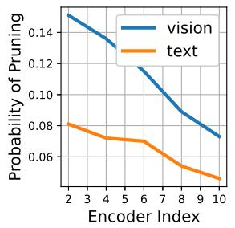  
Figure 4. Probability of token pruning (Left) and fusion (Right) over depth for the RefCOCO experiments.

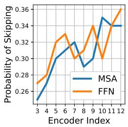

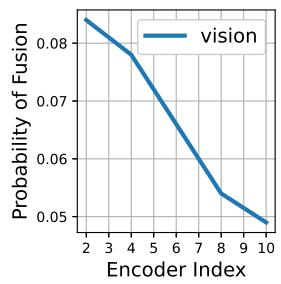

Skipped MSA and FFN layers Next, we analyze the policies learned by the decision networks towards skipping MSA and FFN layers in both vision and text backbone as well as the multimodal network. We note that across the 12 encoders in the backbones, we learn decisions to potentially skip 20 MSA and FFN layers and 12 MSA and FFN layers in the multimodal network.

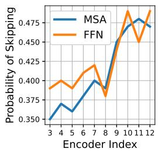

As seen in Figure 5, the skipping operations for MSA and FFN layers are distributed in a way that later MSA and FFN layers especially in the backbones are skipped with higher probability. This is similar to skipping operations with CNNs where shallow layers are more important than deep layers as they provide critical low-level abstraction of objects [34]. On the other hand, there is not a clear pattern with the skipping operations in the multimodal network.

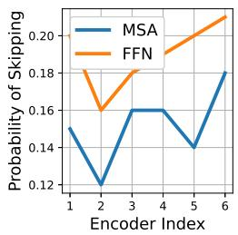

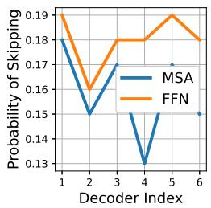  
Figure 5. MSA and FFN layer skipping probability distribution in vision backbone (Top Left), text backbone (Top Right), and multimodal network (Bottom) that consists of 6 encoder and decoder layers. We show the results from RefCOCO experiments.

## 6. Conclusion

We propose a dynamic inference method for the vision and language models. Our method includes learning adaptive policies to skip MSA and FFN layers across vision and language backbones and multimodal network. Additionally, it dynamically prunes tokens from different modalities and fuse tokens at different stages of backbones. We then train our model on downstream vision and language tasks. In our experiments on REC, RES and VQA we show that we can improve the run-time complexity of MDETR, and GLIP by up to ∼ 50% with only maximum ∼ 0.3% accuracy drop.

## References

[1] Arian Bakhtiarnia, Qi Zhang, and Alexandros Iosifidis. Multi-exit vision transformer for dynamic inference. arXiv preprint arXiv:2106.15183, 2021. 2

[2] Nicolas Carion, Francisco Massa, Gabriel Synnaeve, Nicolas Usunier, Alexander Kirillov, and Sergey Zagoruyko. End-toend object detection with transformers. In European Conference on Computer Vision, pages 213–229. Springer, 2020. 3

[3] Xinpeng Chen, Lin Ma, Jingyuan Chen, Zequn Jie, Wei Liu, and Jiebo Luo. Real-time referring expression comprehension by single-stage grounding network. arXiv preprint arXiv:1812.03426, 2018. 2

[4] Yen-Chun Chen, Linjie Li, Licheng Yu, Ahmed El Kholy, Faisal Ahmed, Zhe Gan, Yu Cheng, and Jingjing Liu. Uniter: Universal image-text representation learning. In ECCV, 2020. 1, 2

[5] Jiajun Deng, Zhengyuan Yang, Tianlang Chen, Wengang Zhou, and Houqiang Li. Transvg: End-to-end visual grounding with transformers. arXiv preprint arXiv:2104.08541, 2021. 2

[6] Alexey Dosovitskiy, Lucas Beyer, Alexander Kolesnikov, Dirk Weissenborn, Xiaohua Zhai, Thomas Unterthiner, Mostafa Dehghani, Matthias Minderer, Georg Heigold, Sylvain Gelly, Jakob Uszkoreit, and Neil Houlsby. An image is worth 16x16 words: Transformers for image recognition at scale. In International Conference on Learning Representations, 2021. 1

[7] Zi-Yi Dou, Aishwarya Kamath, Zhe Gan, Pengchuan Zhang, Jianfeng Wang, Linjie Li, Zicheng Liu, Ce Liu, Yann Le-Cun, Nanyun Peng, et al. Coarse-to-fine vision-language pre-training with fusion in the backbone. arXiv preprint arXiv:2206.07643, 2022. 2

[8] Maha Elbayad, Jiatao Gu, Edouard Grave, and Michael Auli. Depth-adaptive transformer. arXiv preprint arXiv:1910.10073, 2019. 2

[9] Dan Hendrycks and Kevin Gimpel. Gaussian error linear units (gelus). arXiv preprint arXiv:1606.08415, 2016. 3

[10] Geoffrey Hinton, Oriol Vinyals, Jeff Dean, et al. Distilling the knowledge in a neural network. arXiv preprint arXiv:1503.02531, 2(7), 2015. 1

[11] Lu Hou, Zhiqi Huang, Lifeng Shang, Xin Jiang, Xiao Chen, and Qun Liu. Dynabert: Dynamic bert with adaptive width and depth. Advances in Neural Information Processing Systems, 33:9782–9793, 2020. 2

[12] Drew A Hudson and Christopher D Manning. Gqa: A new dataset for real-world visual reasoning and compositional question answering. In Proceedings of the IEEE/CVF conference on computer vision and pattern recognition, pages 6700–6709, 2019. 6

[13] Andrew Jaegle, Sebastian Borgeaud, Jean-Baptiste Alayrac, Carl Doersch, Catalin Ionescu, David Ding, Skanda Koppula, Daniel Zoran, Andrew Brock, Evan Shelhamer, et al. Perceiver io: A general architecture for structured inputs & outputs. arXiv preprint arXiv:2107.14795, 2021. 1

[14] Aishwarya Kamath, Mannat Singh, Yann LeCun, Ishan Misra, Gabriel Synnaeve, and Nicolas Carion. Mdetr–

modulated detection for end-to-end multi-modal understanding. arXiv preprint arXiv:2104.12763, 2021. 1, 2, 6, 7

[15] Sahar Kazemzadeh, Vicente Ordonez, Mark Matten, and Tamara Berg. Referitgame: Referring to objects in photographs of natural scenes. In Proceedings of the 2014 conference on empirical methods in natural language processing (EMNLP), pages 787–798, 2014. 6

[16] Ranjay Krishna, Yuke Zhu, Oliver Groth, Justin Johnson, Kenji Hata, Joshua Kravitz, Stephanie Chen, Yannis Kalantidis, Li-Jia Li, David A Shamma, et al. Visual genome: Connecting language and vision using crowdsourced dense image annotations. International journal of computer vision, 123(1):32–73, 2017. 6

[17] Liunian Harold Li, Pengchuan Zhang, Haotian Zhang, Jianwei Yang, Chunyuan Li, Yiwu Zhong, Lijuan Wang, Lu Yuan, Lei Zhang, Jenq-Neng Hwang, et al. Grounded language-image pre-training. In Proceedings of the IEEE/CVF Conference on Computer Vision and Pattern Recognition, pages 10965–10975, 2022. 1, 2, 6, 7

[18] Muchen Li and Leonid Sigal. Referring transformer: A onestep approach to multi-task visual grounding. arXiv preprint arXiv:2106.03089, 2021. 2

[19] Wei Li, Can Gao, Guocheng Niu, Xinyan Xiao, Hao Liu, Jiachen Liu, Hua Wu, and Haifeng Wang. Unimo: Towards unified-modal understanding and generation via cross-modal contrastive learning. arXiv preprint arXiv:2012.15409, 2020. 2

[20] Tailin Liang, John Glossner, Lei Wang, Shaobo Shi, and Xiaotong Zhang. Pruning and quantization for deep neural network acceleration: A survey. Neurocomputing, 461:370– 403, 2021. 1

[21] Tsung-Yi Lin, Michael Maire, Serge Belongie, James Hays, Pietro Perona, Deva Ramanan, Piotr Dollar, and C Lawrence´ Zitnick. Microsoft coco: Common objects in context. In European conference on computer vision, pages 740–755. Springer, 2014. 6

[22] Yijin Liu, Fandong Meng, Jie Zhou, Yufeng Chen, and Jinan Xu. Faster depth-adaptive transformers. In Proceedings of the AAAI Conference on Artificial Intelligence, volume 35, pages 13424–13432, 2021. 2

[23] Yinhan Liu, Myle Ott, Naman Goyal, Jingfei Du, Mandar Joshi, Danqi Chen, Omer Levy, Mike Lewis, Luke Zettlemoyer, and Veselin Stoyanov. Roberta: A robustly optimized bert pretraining approach. arXiv preprint arXiv:1907.11692, 2019. 6

[24] Jiasen Lu, Dhruv Batra, Devi Parikh, and Stefan Lee. Vilbert: Pretraining task-agnostic visiolinguistic representations for vision-and-language tasks. arXiv preprint arXiv:1908.02265, 2019. 1, 2

[25] Kevin Lu, Aditya Grover, Pieter Abbeel, and Igor Mordatch. Pretrained transformers as universal computation engines. arXiv preprint arXiv:2103.05247, 2021. 3

[26] Junhua Mao, Jonathan Huang, Alexander Toshev, Oana Camburu, Alan L Yuille, and Kevin Murphy. Generation and comprehension of unambiguous object descriptions. In Proceedings of the IEEE conference on computer vision and pattern recognition, pages 11–20, 2016. 6

[27] Lingchen Meng, Hengduo Li, Bor-Chun Chen, Shiyi Lan, Zuxuan Wu, Yu-Gang Jiang, and Ser-Nam Lim. Adavit: Adaptive vision transformers for efficient image recognition. In Proceedings of the IEEE/CVF Conference on Computer Vision and Pattern Recognition, pages 12309–12318, 2022. 1, 2

[28] Bryan A Plummer, Liwei Wang, Chris M Cervantes, Juan C Caicedo, Julia Hockenmaier, and Svetlana Lazebnik. Flickr30k entities: Collecting region-to-phrase correspondences for richer image-to-sentence models. In Proceedings of the IEEE international conference on computer vision, pages 2641–2649, 2015. 6

[29] Alec Radford, Jong Wook Kim, Chris Hallacy, Aditya Ramesh, Gabriel Goh, Sandhini Agarwal, Girish Sastry, Amanda Askell, Pamela Mishkin, Jack Clark, et al. Learning transferable visual models from natural language supervision. In International Conference on Machine Learning, pages 8748–8763. PMLR, 2021. 1, 2, 7

[30] Yongming Rao, Wenliang Zhao, Benlin Liu, Jiwen Lu, Jie Zhou, and Cho-Jui Hsieh. Dynamicvit: Efficient vision transformers with dynamic token sparsification. Advances in neural information processing systems, 34:13937–13949, 2021. 1, 2

[31] Sheng Shen, Liunian Harold Li, Hao Tan, Mohit Bansal, Anna Rohrbach, Kai-Wei Chang, Zhewei Yao, and Kurt Keutzer. How much can clip benefit vision-and-language tasks? arXiv preprint arXiv:2107.06383, 2021. 2

[32] Richard S Sutton and Andrew G Barto. Reinforcement learning: An introduction. MIT press, 2018. 5

[33] Hugo Touvron, Matthieu Cord, Matthijs Douze, Francisco Massa, Alexandre Sablayrolles, and Herve J ´ egou. Training´ data-efficient image transformers & distillation through attention. arXiv preprint arXiv:2012.12877, 2020. 1, 6

[34] Xin Wang, Fisher Yu, Zi-Yi Dou, Trevor Darrell, and Joseph E Gonzalez. Skipnet: Learning dynamic routing in convolutional networks. In Proceedings of the European Conference on Computer Vision (ECCV), pages 409–424, 2018. 8

[35] Yulin Wang, Rui Huang, Shiji Song, Zeyi Huang, and Gao Huang. Not all images are worth 16x16 words: Dynamic transformers for efficient image recognition. Advances in Neural Information Processing Systems, 34:11960–11973, 2021. 2

[36] Chenyun Wu, Zhe Lin, Scott Cohen, Trung Bui, and Subhransu Maji. Phrasecut: Language-based image segmentation in the wild. In Proceedings of the IEEE/CVF Conference on Computer Vision and Pattern Recognition, pages 10216–10225, 2020. 6

[37] Yifan Xu, Zhijie Zhang, Mengdan Zhang, Kekai Sheng, Ke Li, Weiming Dong, Liqing Zhang, Changsheng Xu, and Xing Sun. Evo-vit: Slow-fast token evolution for dynamic vision transformer. In Proceedings of the AAAI Conference on Artificial Intelligence, volume 36, pages 2964–2972, 2022. 1, 2

[38] Antoine Yang, Antoine Miech, Josef Sivic, Ivan Laptev, and Cordelia Schmid. Tubedetr: Spatio-temporal video grounding with transformers. In Proceedings ofthe IEEE/CVF Con-

ference on Computer Vision and Pattern Recognition, pages 16442–16453, 2022. 2

[39] Jiwei Yang, Xu Shen, Jun Xing, Xinmei Tian, Houqiang Li, Bing Deng, Jianqiang Huang, and Xian-sheng Hua. Quantization networks. In Proceedings of the IEEE/CVF Conference on Computer Vision and Pattern Recognition, pages 7308–7316, 2019. 1

[40] Zhengyuan Yang, Tianlang Chen, Liwei Wang, and Jiebo Luo. Improving one-stage visual grounding by recursive subquery construction. In Computer Vision–ECCV 2020: 16th European Conference, Glasgow, UK, August 23–28, 2020, Proceedings, Part XIV 16, pages 387–404. Springer, 2020. 2

[41] Hongxu Yin, Arash Vahdat, Jose M Alvarez, Arun Mallya, Jan Kautz, and Pavlo Molchanov. A-vit: Adaptive tokens for efficient vision transformer. In Proceedings of the IEEE/CVF Conference on Computer Vision and Pattern Recognition, pages 10809–10818, 2022. 2

[42] Licheng Yu, Zhe Lin, Xiaohui Shen, Jimei Yang, Xin Lu, Mohit Bansal, and Tamara L Berg. Mattnet: Modular attention network for referring expression comprehension. In Proceedings of the IEEE Conference on Computer Vision and Pattern Recognition, pages 1307–1315, 2018. 2

[43] Xin Yuan, Zhe Lin, Jason Kuen, Jianming Zhang, Yilin Wang, Michael Maire, Ajinkya Kale, and Baldo Faieta. Multimodal contrastive training for visual representation learning. In Proceedings of the IEEE/CVF Conference on Computer Vision and Pattern Recognition, pages 6995–7004, 2021. 1

[44] Haotian Zhang, Pengchuan Zhang, Xiaowei Hu, Yen-Chun Chen, Liunian Harold Li, Xiyang Dai, Lijuan Wang, Lu Yuan, Jenq-Neng Hwang, and Jianfeng Gao. Glipv2: Unifying localization and vision-language understanding. arXiv preprint arXiv:2206.05836, 2022. 1, 2