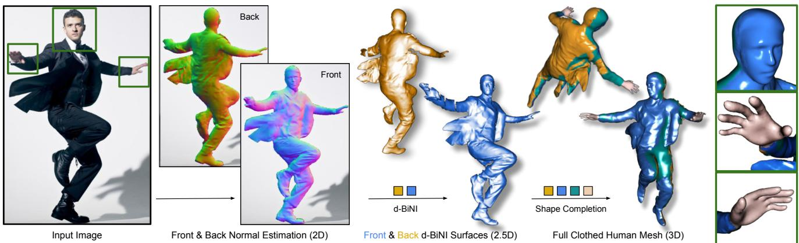
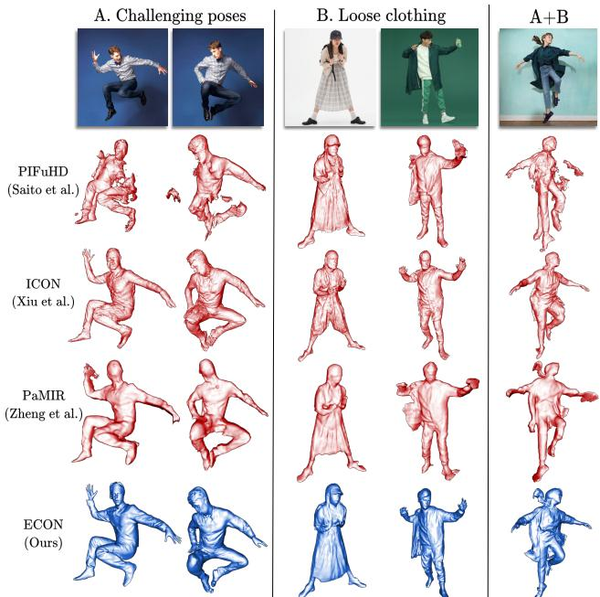
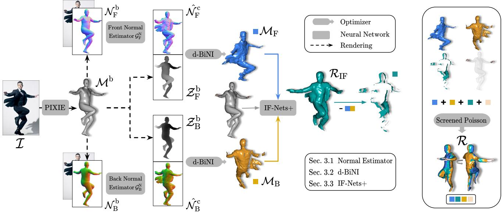
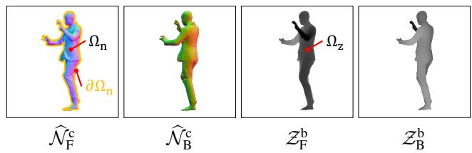
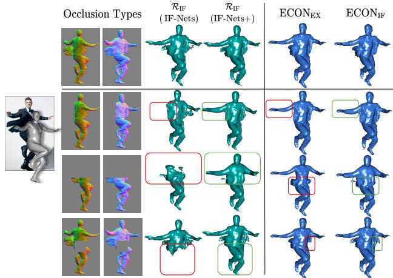
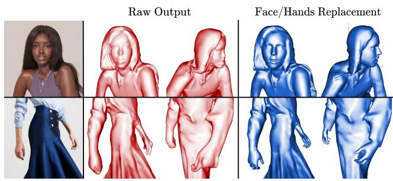
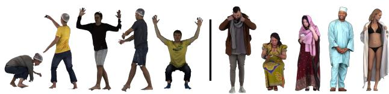
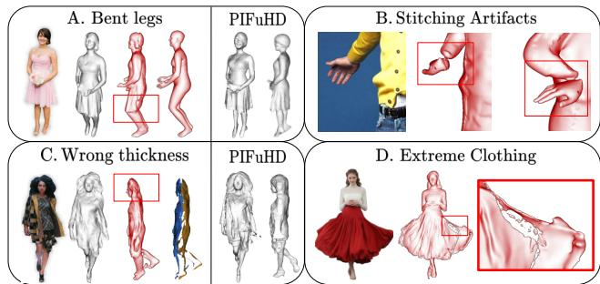
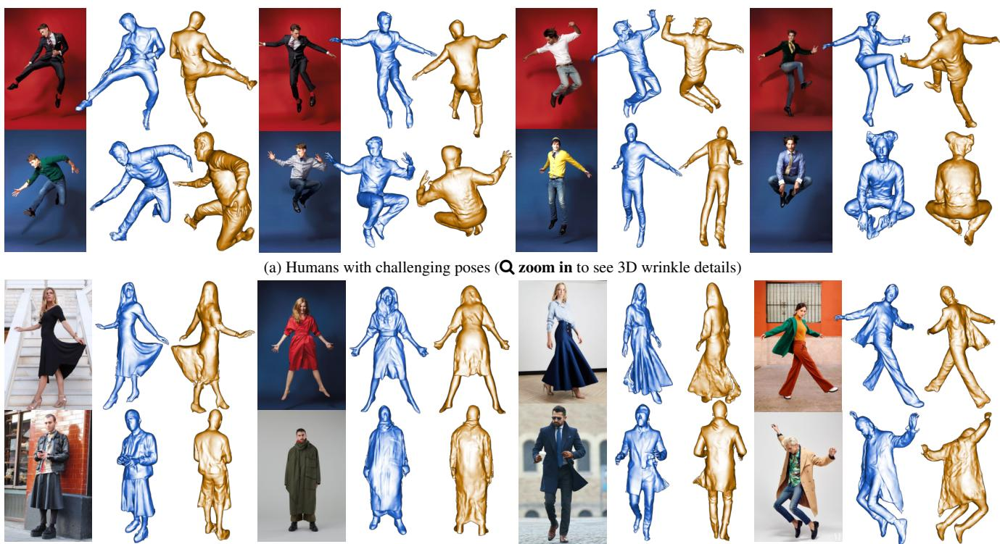
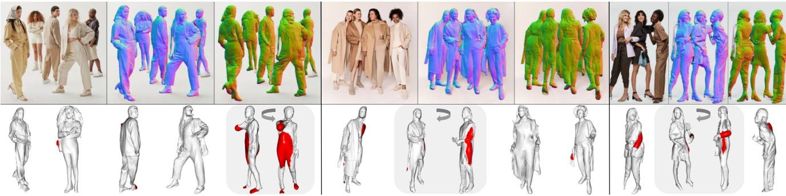

# ECON: Explicit Clothed humans Optimized via Normal integration

Yuliang Xiu1 Jinlong Yang1 Xu Cao2 Dimitrios Tzionas3 Michael J. Black1

1Max Planck Institute for Intelligent Systems, Tubingen, Germany¨

2Osaka University, Japan 3University of Amsterdam, the Netherlands

{yuliang.xiu, jinlong.yang, black}@tue.mpg.de cao.xu@ist.osaka-u.ac.jp d.tzionas@uva.nl

  
Figure 1. Human digitization from a color image. ECON combines the best aspects of free-form implicit representation, and explicit anthropomorphic regularization to infer high-fidelity 3D humans, even with loose clothing or in challenging poses. It does so in three steps: (1) It infers detailed 2D normal maps for the front and back side (Sec. 3.1). (2) The normal maps are converted into detailed, yet incomplete, 2.5D front and back surfaces guided by a SMPL-X estimate (Sec. 3.2). (3) It then “inpaints” the missing geometry between two surfaces (Sec. 3.3). Face or hands can be optionally replaced with the cleaner ones from SMPL-X. See the video on our website for more results.

## Abstract

The combination ofdeep learning, artist-curated scans, and Implicit Functions (IF), is enabling the creation ofdetailed, clothed, 3D humansfrom images. However, existing methods are far from perfect. IF-based methods recover free-form geometry, but produce disembodied limbs or degenerate shapes for novel poses or clothes. To increase robustness for these cases, existing work uses an explicit parametric body model to constrain surface reconstruction, but this limits the recovery offree-form surfaces such as loose clothing that deviatesfrom the body. What we want is a method that combines the best properties of implicit representation and explicit body regularization. To this end, we make two key observations: (1) current networks are better at inferring detailed 2D maps thanfull-3D surfaces, and (2) a parametric model can be seen as a “canvas” for stitching together detailed surface patches. Based on these, our method, ECON, has three main steps: (1) It infers detailed 2D normal mapsfor thefront and back side ofa clothed person. (2) From these, it recovers 2.5D front and back surfaces, called d-BiNI, that are equally detailed, yet incomplete, and registers these w.r.t. each other with the help of a SMPL-X

body mesh recoveredfrom the image. (3) It “inpaints” the missing geometry between d-BiNI surfaces. If the face and hands are noisy, they can optionally be replaced with the ones ofSMPL-X. As a result, ECON infers high-fidelity 3D humans even in loose clothes and challenging poses. This goes beyond previous methods, according to the quantitative evaluation on the CAPE and Renderpeople datasets. Perceptual studies also show that ECON’s perceived realism is better by a large margin. Code and models are availablefor research purposes at econ.is.tue.mpg.de

## 1. Introduction

Human avatars will be key for future games and movies, mixed-reality, tele-presence and the “metaverse”. To build realistic and personalized avatars at scale, we need to faithfully reconstruct detailed 3D humans from color photos taken in the wild. This is still an open problem, due to its challenges; people wear all kinds of different clothing and accessories, and they pose their bodies in many, often imaginative, ways. A good reconstruction method must accurately capture these, while also being robust to novel clothing and poses.

Initial, promising, results have been made possible by using artist-curated scans as training data, and implicit functions (IF) [56,59] as the 3D representation. Seminal work on PIFu(HD) [70, 71] uses “pixel-aligned” IF and reconstructs clothed 3D humans with unconstrained topology. However, these methods tend to overfit to the poses seen in the training data, and have no explicit knowledge about the human body’s structure. Consequently, they produce disembodied limbs or degenerate shapes for images with novel poses; see the 2nd row of Fig. 2. Follow-up work [26, 82, 96] accounts for such artifacts by regularizing the IF using a shape prior provided by an explicit body model [52, 61], but regularization introduces a topological constraint, restricting generalization to novel clothing while attenuating shape details; see the 3rd and 4th rows of Fig. 2. In a nutshell, there are trade-offs between robustness, generalization and detail.

What we want is the best of both worlds; that is, the robustness of explicit anthropomorphic body models, and the flexibility of IF to capture arbitrary clothing topology. To that end, we make two key observations: (1) While inferring detailed 2D normal maps from color images is relatively easy [31, 71, 82], inferring 3D geometry with equally fine details is still challenging [9]. Thus, we exploit networks to infer detailed “geometry-aware” 2D maps that we then lift to 3D. (2) A body model can be seen as a low-frequency “canvas” that “guides” the stitching of detailed surface parts.

With these in mind, we develop ECON, which stands for “Explicit Clothed humans Optimized via Normal integration”. It takes, as input, an RGB image and a SMPL-X body inferred from the image. Then, it outputs a 3D human in free-form clothing with a level of detail and robustness that goes beyond the state of the art (SOTA); see the bottom of Fig. 2. Specifically, ECON has three steps.

Step 1: Front & back normal reconstruction. We predict front- and back-side clothed-human normal maps from the input RGB image, conditioned on the body estimate, with a standard image-to-image translation network.

Step 2: Front & back surface reconstruction. We take the previously predicted normal maps, and the correspond ing depth maps that are rendered from the SMPL-X mesh, to produce detailed and coherent front-/back-side 3D sur faces, $\{ \mathcal { M } _ { \mathrm { F } } , \mathcal { M } _ { \mathrm { B } } \}$ . To this end, we extend the recent BiNI method [7], and develop a novel optimization scheme that is aimed at satisfying three goals for the resulting surfaces: (1) their high-frequency components agree with clothed-human normals, (2) their low-frequency components and the discontinuities agree with the SMPL-X ones, and (3) the depth values on their silhouettes are coherent with each other and consistent with the SMPL-X-based depth maps. The two output surfaces, $\{ \mathcal { M } _ { \mathrm { F } } , \mathcal { M } _ { \mathrm { B } } \}$ , are detailed yet incomplete, i.e., there is missing geometry in occluded and “profile” regions.

Step 3: Full 3D shape completion. This module takes two inputs: (1) the SMPL-X mesh, and (2) the two d-BiNI surfaces, $\{ \mathcal { M } _ { \mathrm { F } } , \mathcal { M } _ { \mathrm { B } } \}$ . The goal is to “inpaint” the missing geometry. Existing methods struggle with this problem. On one hand, Poisson reconstruction [38] produces “blobby” shapes and naively “infills” holes without exploiting a shape distribution prior. On the other hand, data-driven approaches, such as IF-Nets [10], struggle with missing parts caused by (self-)occlusions, and fail to keep the fine details present on two d-BiNI surfaces, producing degenerate geometries.

  
Figure 2. Summary of SOTA. PIFuHD [71] recovers clothing details, but struggles with novel poses. ICON [82] and PaMIR [96] regularize shape to a body shape, but over-constrain the skirts, or over-smooth the wrinkles. ECON combines their best aspects.

We address above the limitations in two steps: (1) We extend and re-train IF-Nets to be conditioned on the SMPL-X body, so that SMPL-X regularizes shape “infilling”. We discard the triangles that lie close to $\{ \mathcal { M } _ { \mathrm { F } } , \mathcal { M } _ { \mathrm { B } } \}$ , and keep the remaining ones as “infilling patches”. (2) We stitch together the front- and back-side surfaces and infilling patches via Poisson reconstruction; note that holes between these are small enough for a general purpose method. The result is a full 3D shape of a clothed human; see Fig. 2, bottom.

We evaluate ECON both on established benchmarks (CAPE [55] and Renderpeople [66]) and in-the-wild images. Quantitative analysis reveals ECON’s superiority. A perceptual study echos this, showing that ECON is significantly preferred over competitors on challenging poses and loose clothing, and competitive with PIFuHD on fashion images. Qualitative results show that ECON generalizes better than the SOTA to a wide variety of poses and clothing, even with extreme looseness or complex topology; see Fig. 9.

With both pose-robustness and topological flexibility, ECON recovers 3D clothed humans with a good level of detail and realistic pose. Code and models are available for research purposes at econ.is.tue.mpg.de

## 2. Related Work

Image-based clothed human reconstruction. Regarding geometric representation, we group the mainstream clothed human reconstruction approaches into “implicit” and “explicit”. Note that with the terms implicit/explicit we mainly refer to the surface decoder rather than thefeature encoder.

1) Explicit-shape-based approaches use either a meshbased parametric body model [35, 52, 61, 69, 83], or a nonparametric depth map [18, 72] or point cloud [90], to reconstruct 3D humans. Many methods [15, 36, 39, 40, 42, 43, 75, 76, 87, 91, 92] estimate or regress minimally-clothed 3D body meshes from RGB pixels and ignore clothing. To account for clothed human shapes, another line of work [2–4, 41, 55, 62, 79, 100] adds 3D offsets on top of the body mesh. This is compatible with current animation pipelines, as they inherit the hierarchical skeleton and skinning weights from the underling statistical body model. However, this “body+offset” approach is not flexible enough to model loose clothing, which deviates significantly from the body topology, such as dresses and skirts. To increase topological flexibility, some methods [5, 33] reconstruct 3D clothed humans by identifying the type of clothing and using the appropriate model to reconstruct it. Scaling up this “cloth-aware” approach to many clothing styles is nontrivial, limiting generalization to in-the-wild outfit variation.

2) Implicit-function-based approaches are topologyagnostic and, thus, can be used to represent arbitrary 3D clothed human shapes. SMPLicit [12], ClothWild [57] and DIG [46] learn a generative clothing model with neural distance fields [11, 56, 59] from a 3D clothing dataset. Given an image, the clothed human is reconstructed by estimating a parametric body and optimizing the latent space of the clothing model. However, the results usually do not align well with the image and lack geometric detail.

PIFu [70] introduces pixel-aligned implicit human shape reconstruction and PIFuHD [71] significantly improves the geometric details with a multi-level architecture and normal maps predicted from the RGB image. However, these two methods do not exploit knowledge of the human body structure. Therefore, these methods overfit to the body poses in the training data, e.g. fashion poses. They fail to generalize to novel poses, producing non-human shapes with broken or disembodied limbs. To address these issues, several methods introduce different geometric priors to regularize the deep implicit representation: GeoPIFu [26] introduces a coarse shape of volumetric humans, Self-Portraits [49], PINA [14], and S3 [85] use depth or LIDAR information to regularize shape and improve robustness to pose variation.

Another direction leverages parametric body models, which represent human body shape well, model the kine matic structure of the body, and can be reliably estimated from RGB images of clothed people. Such a representation can be viewed as a base shape upon which to model clothed humans. Therefore, several methods combine parametric body models with expressive implicit representations to get the best of both worlds. PaMIR [96] and DeepMultiCap [95] condition the pixel-aligned features on a posed and voxelized SMPL mesh. JIFF Introduces a 3DMM face prior to improve the realism of the facial region. ARCH [30], ARCH++ [27] and CAR [50] use SMPL to unpose the pixel-aligned query points from a posed space to a canonical space. To further generalize to unseen poses on in-the-wild photos, ICON [82] regresses shapes from locally-queried features. However, the above approaches gain robustness to unseen poses at the cost of generalization ability to various, especially loose, clothing topologies. We argue that this is because loose clothing differs greatly from human body and that conditioning on the SMPL body in 3D makes it harder for networks to make full use of 2D image features.

Our work is also inspired by “sandwich-like” monocular reconstruction approaches, represented by Moduling Humans [18], FACSIMILE [72] and Any-Shot GIN [80]. Moduling Humans has two networks: a generator that estimates the visible (front) and invisible (back) depth maps from RGB images, and a discriminator that helps regularize the estimation via an adversarial loss. FACSIMILE further improves the geometric details by leveraging a normal loss, which is directly computed from depth estimates via differentiable layers. Recently, Any-Shot GIN generalizes the sandwich-like scheme to novel classes of objects. Given RGB images, it predicts front and back depth maps as well, and then exploits IF-Nets [10] for shape completion. We follow a similar path and extend it, to successfully reconstruct clothed human shapes with SOTA pose generalization, and better details from normal images.

## 3. Method

Given an RGB image, ECON first estimates front and back normal maps (Sec. 3.1), then converts them into front and back partial surfaces (Sec. 3.2), and finally “inpaints” the missing geometry with the help of IF-Nets+ (Sec. 3.3). See ECON’s overview in Fig. 3.

## 3.1. Detailed normal map prediction

Trained on abundant pairs of RGB images and normal images, a “front” normal map, $\widehat { \mathcal { N } } _ { \mathrm { F } } ^ { \mathrm { c } }$ , can be accurately estimated from an RGB image using image-to-image translation networks, as demonstrated in PIFuHD [71] or ICON [82]. Both methods also infer a “back” normal map, $\widehat { \mathcal { N } } _ { \mathrm { B } } ^ { \mathrm { c } }$ , from the image. But, the absence of image cues leads to over-smooth $\widehat { \mathcal { N } } _ { \mathrm { B } } ^ { \mathrm { c } }$ . To address this, we fine-tune ICON’s backside normal predictor, $\mathcal { G } _ { \mathrm { B } } ^ { \mathrm { N } }$ , with an additional MRF loss [77] to enhance the local details by minimizing the difference between the predicted $\widehat { \mathcal { N } } ^ { \mathrm { c } }$ and ground truth (GT) $\mathcal { N } ^ { \mathrm { c } }$ in feature space.

To guide the normal map prediction and make it robust to various body poses, ICON conditions the normal map prediction module on the body normal maps, ${ \mathcal { N } } ^ { \mathfrak { b } }$ , rendered from the estimated body $\mathcal { M } ^ { \flat }$ . Thus, it is important to accurately align the estimated body and clothing silhouette. Apart from the ${ \mathcal { L } } _ { \mathrm { N } , \mathrm { d i f f } }$ and ${ \mathcal { L } } _ { \mathrm { S } { \mathrm { . d i f f } } }$ used in ICON [82], we also apply 2D body landmarks in an additional loss term, ${ \mathcal { L } } _ { \mathrm { J } { \mathrm { . d i f f } } } .$ to further optimize the SMPL-X body, $\mathcal { M } ^ { \mathrm { b } }$ , inferred from PIXIE [15] or PyMAF-X [91]. Specifically, we optimize SMPL-X’s shape, β, pose, θ, and translation, t, to minimize:

  
Figure 3. Overview. ECON takes as input an RGB image, $\mathbf { \delta } _ { \mathcal { Z } , \mathcal { } }$ and a SMPL-X body, $\mathcal { M } ^ { \mathrm { b } }$ . Conditioned on the rendered front and back body normal images, $\pmb { \mathcal { N } } ^ { \mathrm { b } }$ , ECON first predicts front and back clothing normal maps, $\widehat { \mathbf { N } } ^ { \mathrm { c } }$ . These two maps, along with body depth maps, $\mathcal { Z } ^ { \mathrm { b } }$ are fed into a d-BiNI optimizer to produce front and back surfaces, $\{ \mathcal { M } _ { \mathrm { F } } , \mathcal { M } _ { \mathrm { B } } \}$ . Based on such partial surfaces, and body estimate $\mathcal { M } ^ { \mathrm { b } }$ IF-Nets+ implicitly completes $\mathcal { R } _ { \mathrm { I F } }$ . With optional Face or hands from $\mathcal { M } ^ { \mathrm { b } }$ , screened Poisson combines everything as final watertight R.

$$
\begin{array} { r l } { \mathcal { L } _ { \mathrm { S M P L - X } } = \mathcal { L } _ { \mathrm { N _ { \mathrm { - } } d i f f } } + \mathcal { L } _ { \mathrm { S _ { \mathrm { - } } d i f f } } + \mathcal { L } _ { \mathrm { J _ { \mathrm { - } } d i f f } } , } & { } \\ { \mathcal { L } _ { \mathrm { J _ { \mathrm { - } } d i f f } } = \lambda _ { \mathrm { J _ { \mathrm { - } } d i f f } } \vert \mathcal { I } ^ { \mathrm { b } } - \widehat { \mathcal { T } ^ { \mathrm { c } } } \vert , } \end{array}\tag{1}
$$

where ${ \mathcal { L } } _ { \mathrm { N } . \mathrm { d i f f } }$ and ${ \mathcal { L } } _ { S \mathrm { { \_ d i f f } } }$ are the normal-map loss and silhouette loss introduced in ICON [82], and ${ \mathcal { L } } _ { \mathrm { J , d i f f } }$ is the joint loss (L2) between 2D landmarks $\widehat { \mathcal { T } ^ { \mathrm { c } } }$ , which are estimated by a 2D keypoint estimator from the RGB image $\mathcal { T } ,$ and the corresponding re-projected 2D joints ${ \mathcal { I } } ^ { \mathrm { b } }$ from $\mathcal { M } ^ { \mathfrak { b } }$ . For more implementation details, see Sec. A.1 in SupMat.

## 3.2. Front and back surface reconstruction

We now lift the clothed normal maps to 2.5D surfaces. We expect these 2.5D surfaces to satisfy three conditions: (1) high-frequency surface details agree with predicted clothed normal maps, (2) low-frequency surface variations, including discontinuities, agree with SMPL-X’s ones, and (3) the depth of the front and back silhouettes are close to each other.

Unlike PIFuHD [71] or ICON [82], which train a neural network to regress the implicit surface from normal maps, we explicitly model the depth-normal relationship using variational normal integration methods [7,64]. Specifically, we tailor the recent bilateral normal integration (BiNI) method [7] to full-body mesh reconstruction by harnessing the coarse prior, depth maps, and silhouette consistency.

To satisfy the three conditions, we propose a depth-aware silhouette-consistent bilateral normal integration (d-BiNI) method to jointly optimize for the front and back clothed depth maps, $\widehat { \mathcal { Z } } _ { \mathrm { F } } ^ { \mathrm { c } }$ and $\widehat { \mathcal { Z } } _ { \mathrm { B } } ^ { \mathrm { c } }$ :

$$
\mathrm { d - B i N I } ( \widehat { N } _ { \mathrm { F } } ^ { \mathrm { c } } , \widehat { N } _ { \mathrm { B } } ^ { \mathrm { c } } , \mathcal { Z } _ { \mathrm { F } } ^ { \mathrm { b } } , \mathcal { Z } _ { \mathrm { B } } ^ { \mathrm { b } } )  \widehat { \mathcal { Z } } _ { \mathrm { F } } ^ { \mathrm { c } } , \widehat { \mathcal { Z } } _ { \mathrm { B } } ^ { \mathrm { c } } .\tag{2}
$$

Here, $\widehat { \mathcal { N } } _ { * } ^ { \mathrm { c } }$ is the front or back clothed normal map predicted by $\mathcal { G } _ { \mathrm { F , B } } ^ { \mathrm { N } }$ from $\{ \mathcal { T } , \mathcal { N } ^ { \mathrm { b } } \}$ , and $\mathcal { Z } _ { * } ^ { \mathrm { b } }$ is the front or back coarse body depth image rendered from the SMPL-X mesh, $\mathcal { M } ^ { \mathfrak { b } }$

Specifically, our objective function consists of five terms:

$$
\begin{array} { r l } & { \displaystyle \underset { \widehat { \mathcal { Z } } _ { \mathrm { F } } ^ { \mathrm { c } } , \widehat { \mathcal { Z } } _ { \mathrm { B } } ^ { \mathrm { c } } } { \mathrm { m i n } } \mathcal { L } _ { \mathrm { n } } ( \widehat { \mathcal { Z } } _ { \mathrm { F } } ^ { \mathrm { c } } ; \widehat { \mathcal { N } } _ { \mathrm { F } } ^ { \mathrm { c } } ) + \mathcal { L } _ { \mathrm { n } } ( \widehat { \mathcal { Z } } _ { \mathrm { B } } ^ { \mathrm { c } } ; \widehat { \mathcal { N } } _ { \mathrm { B } } ^ { \mathrm { c } } ) + } \\ & { \qquad \lambda _ { \mathrm { d } } \mathcal { L } _ { \mathrm { d } } ( \widehat { \mathcal { Z } } _ { \mathrm { F } } ^ { \mathrm { c } } ; \mathcal { Z } _ { \mathrm { F } } ^ { \mathrm { b } } ) + \lambda _ { \mathrm { d } } \mathcal { L } _ { \mathrm { d } } ( \widehat { \mathcal { Z } } _ { \mathrm { B } } ^ { \mathrm { c } } ; \mathcal { Z } _ { \mathrm { B } } ^ { \mathrm { b } } ) + } \\ & { \qquad \lambda _ { \mathrm { s } } \mathcal { L } _ { \mathrm { s } } ( \widehat { \mathcal { Z } } _ { \mathrm { F } } ^ { \mathrm { c } } , \widehat { \mathcal { Z } } _ { \mathrm { B } } ^ { \mathrm { c } } ) , } \end{array}\tag{3}
$$

where ${ \mathcal { L } } _ { \mathrm { n } }$ is the BiNI loss term introduced by BiNI [7], ${ \mathcal { L } } _ { \mathrm { d } }$ is a depth prior applied to the front and back depth surfaces, and $\mathcal { L } _ { \mathrm { s } }$ is a front-back silhouette consistency term. For a more detailed discussion on these terms, see Sec. A.2 in SupMat.

With Eq. (3), we make two technical contributions beyond BiNI [7]. First, we use the coarse depth prior rendered from the SMPL-X body mesh, $\mathcal { Z } _ { i } ^ { \mathrm { b } }$ , to regularize BiNI:

$$
\begin{array} { r } { \mathcal { L } _ { \mathrm { d } } ( \widehat { \mathcal { Z } } _ { i } ^ { \mathrm { c } } ; \mathcal { Z } _ { i } ^ { \mathrm { b } } ) = | \widehat { \mathcal { Z } } _ { i } ^ { \mathrm { c } } - \mathcal { Z } _ { i } ^ { \mathrm { b } } | _ { \Omega _ { \mathrm { n } } \bigcap \Omega _ { \mathrm { z } } } \quad i \in \{ F , B \} . } \end{array}\tag{4}
$$

  
Figure 4. Four inputs to d-BiNI. $\Omega _ { \mathrm { n } }$ and $\Omega _ { \mathrm { z } }$ are the domains of clothed and body regions, respectively. $\partial \Omega _ { \mathrm { n } }$ is the silhouette of $\Omega _ { \mathrm { n } } .$

This addresses the key problem of putting the front and back surfaces together in a coherent way to form a full body. Optimizing BiNI terms ${ \mathcal { L } } _ { \mathrm { n } }$ leaves an arbitrary global offset between the front and back surfaces. The depth prior terms $\mathcal { L } _ { \mathrm { d } }$ encourage the surfaces with undecided offsets to be consistent with the SMPL-X body, and is computed in the domains $\Omega _ { \mathrm { n } } \bigcap { \Omega _ { \mathrm { z } } } \left( \mathrm { F i g . ~ } 4 \right)$ . For further intuitions on ${ \mathcal { L } } _ { \mathrm { n } }$ and ${ \mathcal { L } } _ { \mathrm { d } } .$ , see Fig. S.4 and Fig. S.5 in SupMat.

Second, we use a silhouette consistency term to encourage the front and back depth values to be the same at the silhouette boundary, which is computed in domain $\partial \Omega _ { \mathrm { n } }$ (Fig. 4):

$$
\mathcal { L } _ { \mathrm { s } } ( \widehat { \mathcal { Z } } _ { \mathrm { F } } ^ { \mathrm { c } } , \widehat { \mathcal { Z } } _ { \mathrm { B } } ^ { \mathrm { c } } ) = | \widehat { \mathcal { Z } } _ { \mathrm { F } } ^ { \mathrm { c } } - \widehat { \mathcal { Z } } _ { \mathrm { B } } ^ { \mathrm { c } } | _ { \partial \Omega _ { \mathrm { n } } } .\tag{5}
$$

The silhouette term improves the physical consistency of the reconstructed front and back clothed depth maps. Without this term, d-BiNI produces intersections of the front and back surfaces around the silhouette, causing “blobby” artifacts and hurting reconstruction quality; see Fig. S.6 in SupMat.

## 3.3. Human shape completion

For simple body poses without self-occlusions, merging front and back d-BiNI surfaces in a straightforward way, as done in FACSIMILE [72] and Moduling Humans [18], can result in a complete 3D clothed scan. However, often poses result in self-occlusions, which cause large portions of the surfaces to be missing. In such cases, Poisson Surface Reconstruction (PSR) [37] leads to blobby artifacts.

PSR completion with SMPL-X (ECONEX). A naive way to “infill” the missing surface is to make use of the estimated SMPL-X body. We remove the triangles from $\mathcal { M } ^ { \mathrm { b } }$ that are visible to front or back cameras. The remaining triangle “soup” $\mathcal { M } ^ { \mathrm { c u l l } }$ contains both side-view boundaries and occluded regions. We apply PSR [37] to the union of $\mathcal { M } ^ { \mathrm { c u l l } }$ and d-BiNI surfaces $\{ \mathcal { M } _ { \mathrm { F } } , \mathcal { M } _ { \mathrm { B } } \}$ to obtain a watertight reconstruction R. This approach is denoted as ECONEX. Although $\mathrm { E C O N } _ { \mathrm { E X } }$ avoids missing limbs or sides, it does not produce a coherent surface for the originally missing clothing and hair surfaces because of the discrepancy between SMPL-X and actual clothing or hair; see $\mathrm { E C O N } _ { \mathrm { E X } }$ in Fig. 5.

Inpainting with IF-Nets+ $( \mathcal { R } _ { \mathrm { I F } } )$ . To improve reconstruction coherence, we use a learned implicit-function (IF) model to “inpaint” the missing geometry given front and back d-BiNI surfaces. Specifically, we tailor a general-purpose shape completion method, IF-Nets [10], to a SMPL-X-guided one, denoted as IF-Nets+. IF-Nets [10] completes the 3D shape from a deficient 3D input, such as an incomplete 3D human shape or a low-resolution voxel grid. Inspired by Li et al. [44], we adapt IF-Nets by conditioning it on a voxelized SMPL-X body to deal with pose variation; for details see Sec. A.3 in SupMat. IF-Nets+ is trained on voxelized front and back ground-truth clothed depth maps, $\{ \mathcal { Z } _ { \mathrm { F } } ^ { \mathrm { c } } , \mathcal { Z } _ { \mathrm { B } } ^ { \mathrm { c } } \}$ and a voxelized (estimated) body mesh, $\mathcal { M } ^ { \mathrm { b } }$ , as input, and is supervised with ground-truth 3D shapes. During training, we randomly mask $\left\{ \mathcal { Z } _ { \mathrm { F } } ^ { \mathrm { c } } , \mathcal { Z } _ { \mathrm { B } } ^ { \mathrm { c } } \right\}$ for robustness to occlusions. During inference, we feed the estimated $\widehat { \mathcal { Z } } _ { \mathrm { F } } ^ { \mathrm { c } } , \widehat { \mathcal { Z } } _ { \mathrm { B } } ^ { \mathrm { c } }$ and $\mathcal { M } ^ { \mathrm { b } }$ into IF-Nets+ to obtain an occupancy field, from which we extract the inpainted mesh, $\mathcal { R } _ { \mathrm { I F } }$ , with Marching cubes [53].

Figure 5. “Inpainting” the missing geometry. We simulate different cases of occlusion by masking the normal images and present the intermediate and final 3D reconstruction of different design choices. While IF-Nets misses certain body parts, IF-Nets+ produces a plausible overall shape. $\mathrm { E C O N } _ { \mathrm { I F } }$ produces more consistent clothing surfaces than $\mathrm { E C O N } _ { \mathrm { E X } }$ due to a learned shape distribution.  
  
Figure 6. Face and hand details. The face and hands of the raw reconstruction can be replaced with the ones of the SMPL-X body.

PSR completion with $\mathcal { R } _ { \mathbf { I F } } \left( \mathbf { E C O N } _ { \mathbf { I F } } \right)$ . To obtain our final mesh, R, we apply PSR to stitch (1) d-BiNI surfaces, (2) sided and occluded triangle soup $\mathcal { M } ^ { \mathrm { c u l l } }$ from ${ \mathcal { R } } _ { \mathrm { I F } } .$ , and optionally, (3) face or hands cropped from the estimated SMPL-X body $\mathcal { M } ^ { \mathrm { b } }$ . The necessity of (3) arises from the poorly reconstructed hands/face in $\mathcal { R } _ { \mathrm { I F } } .$ , see difference in Fig. 6. The approach is denoted as $\mathrm { E C O N _ { I F } }$

  
Figure 7. Datasets for numerical evaluation. We evaluate ECON on images with unseen poses (left) and unseen outfits (right) on the CAPE [55] and Renderpeople [66] datasets, respectively.

Notably, although $\mathcal { R } _ { \mathrm { I F } }$ is already a complete human mesh, due to the lossy voxelization of inputs and limited resolution of Marching cubes algorithm, it somehow smooths out the details of $\tilde { \mathcal { Z } } _ { \{ \mathrm { F } , \mathrm { B } \} } ^ { \mathrm { c } } / \mathcal { M } _ { \{ \mathrm { F } , \mathrm { B } \} }$ , which are optimized via d-BiNI (see $\mathcal { R } _ { \mathrm { I F } } ~ \mathrm { v s } ~ \mathrm { { E C O N } _ { \{ I F , E X \} } }$ in $\operatorname { F i g } . 5 )$ . While $\mathrm { E C O N } _ { \{ \mathrm { I F } , \mathrm { E X } \} }$ preserves d-BiNI details better, only the side-views and occluded parts of $\mathcal { R } _ { \mathrm { I F } }$ are fused in the Poisson step. In Tabs. 1 and 4, we use $\mathrm { E C O N } _ { \{ \mathrm { I F } , \mathrm { E X } \} }$ instead of $\mathcal { R } _ { \mathrm { I F } }$ for evaluation.

## 4. Experiments

## 4.1. Datasets

Training on THuman2.0. THuman2.0 [88] contains 525 high-quality human textured scans in various poses, which are captured by a dense DSLR rig, along with their corresponding SMPL-X fits. We use THuman2.0 to train ICON, ECON (IF-Nets+), IF-Nets, PIFu and PaMIR.

Quantitative evaluation on CAPE & Renderpeople. We primarily evaluate on CAPE [55] and Renderpeople [66]. Specifically, we use the “CAPE-NFP” set (100 scans), which is used by ICON to analyze robustness to complex human poses. Moreover, we select another 100 scans from Renderpeople, containing loose clothing, such as dresses, skirts, robes, down jackets, costumes, etc. With such clothing variance, Renderpeople helps numerically evaluate the flexibility of reconstruction methods w.r.t. shape topology. Samples of the two datasets are shown in Fig. 7.

## 4.2. Metrics

Chamfer and P2S distance (cm). To capture large geometric errors, e.g. occluded parts or wrongly positioned limbs, we report the commonly used Chamfer (bi-directional pointto-surface) and P2S distance (1-directional point-to-surface) between ground-truth and reconstructed meshes.

Normal difference (L2). To measure the fineness of reconstructed local details, as well as projection consistency from the input image, we also report the L2 error between normal images rendered from reconstructed and groundtruth surfaces, by rotating a virtual camera around these by $\{ 0 ^ { \circ } , 9 0 ^ { \circ } , 1 8 0 ^ { \circ } , 2 7 0 ^ { \circ } \}$ w.r.t. to a frontal view.

<table><tr><td>Methods</td><td>Data-driven</td><td colspan="3">OOD poses (CAPE) P2S ↓ Normals ↓</td><td colspan="3">OOD outfits (Renderpeople) Chamfer ↓ P2S↓ Normals ↓</td></tr><tr><td colspan="7">Chamfer ↓</td></tr><tr><td></td><td></td><td>w/o SMPL-X body prior</td><td></td><td></td><td></td><td></td><td></td></tr><tr><td>PIFu * PIFuHD†</td><td>√ √</td><td>1.722 3.767</td><td>1.548 3.591</td><td>0.0674 0.0994</td><td>1.706 1.946</td><td>1.642 1.983</td><td>0.0709 0.0658</td></tr><tr><td colspan="8">w/ GT SMPL-X body prior</td></tr><tr><td>PaMIR *</td><td>√</td><td>0.989</td><td>0.992</td><td>0.0422</td><td>1.296</td><td>1.430</td><td>0.0518</td></tr><tr><td>ICON</td><td>√</td><td>0.971</td><td>0.909</td><td>0.0409</td><td>1.373</td><td>1.522</td><td>0.0566</td></tr><tr><td>ECONIF</td><td>√</td><td>0.996</td><td>0.967</td><td>0.0413</td><td>1.401</td><td>1.422</td><td>0.0516</td></tr><tr><td>ECONEX</td><td>X</td><td>0.926</td><td>0.917</td><td>0.0367</td><td>1.342</td><td>1.458</td><td>0.0478</td></tr></table>

Table 1. Evaluation against the state of the art. All models use a resolution of 256 for marching cubes. ∗Methods are re-implemented in [82] for a fair comparison in terms of network settings and training data. †Official model is trained on the Renderpeople dataset. ECON is optimization-based, thus requires no training (✗). “OOD” is short for “out-of-distribution”.
<table><tr><td></td><td>ICON [82]</td><td>PIFuHD [71]</td><td>PaMIR [96]</td></tr><tr><td>Challenging poses</td><td>0.283</td><td>0.108</td><td>0.132</td></tr><tr><td>Loose clothing</td><td>0.147</td><td>0.362</td><td>0.232</td></tr><tr><td>Fashion images</td><td>0.199</td><td>0.551</td><td>0.290</td></tr></table>

Table 2. Perceptual study. Numbers denote the chance that participants prefer the reconstruction of a competing method over ECON for in-the-wild images. A value of 0.5 indicates equal preference. A value of < 0.5 favors ECON, while of > 0.5 favors competitors.

## 4.3. Evaluation

Quantitative evaluation. We compare ECON with bodyagnostic methods, i.e., PIFu [70] and PIFuHD [71], and body-aware methods, i.e., PaMIR [96] and ICON [82]; see in Tab. 1. For fair comparison, we use re-implementations of PIFu and PaMIR from ICON [82], because they have the same network settings and input data. $\mathrm { E C O N } _ { \mathrm { E X } }$ performs on par with ICON, and outperforms other methods on images containing out-of-distribution (OOD) poses (CAPE), with a distance error below 1cm. In terms of out-of-distribution outfits (Renderpeople), $\mathbf { E C O N _ { E X / I F } }$ performs on par with PaMIR, and much better than PIFuHD. When it comes to high-frequency details measured by normals, ECONEX achieves SOTA performance on both datasets.

Perceptual study. Due to the lack of ground-truth geometry (clothed scan + underneath SMPL-X), we further conduct a perceptual study to evaluate ECON on in-the-wild images. Test images are divided into three categories: “challenging poses”, “loose clothing”, and “fashion images”. Examples of challenging poses and loose clothing can be seen in Fig. 9, and some of fashion images are in SupMat.’s Fig. S.2.

Participants are asked to choose the reconstruction they perceive as more realistic, between a baseline method and ECON. We compute the chances that each baseline is preferred over ECON in Tab. 2. The results of the perceptual study confirm the quantitative evaluation in Tab. 1. For “challenging poses” images, ECON is significantly preferred over PIFuHD and outperforms ICON. On images of people wearing loose clothing, ECON is preferred over ICON by a large margin and outperforms PIFuHD. The reasons for a slight preference of PIFuHD over ECON on fashion images are discussed in Sec. 5. Figure 2 visualizes some comparisons. More examples are provide in Figs. S.7 to S.9 of the SupMat.

<table><tr><td rowspan="2">Methods</td><td colspan="2">OOD poses (CAPE [55])</td><td colspan="2">OOD outfits (Renderpeople) [66]</td><td rowspan="2">Speed FPS ↑</td></tr><tr><td>RMSE↓</td><td>MAE↓</td><td>RMSE↓</td><td>MAE↓</td></tr><tr><td rowspan="2">BiNI [7] d-BiNI</td><td>27.64</td><td>21.11</td><td>20.61</td><td>16.07</td><td>0.52</td></tr><tr><td>13.43</td><td>10.29</td><td>14.43</td><td>11.26</td><td>0.69</td></tr></table>

Table 3. BiNI vs d-BiNI. Comparison between BiNI and d-BiNI surfaces w.r.t. reconstruction accuracy and optimization speed.

<table><tr><td rowspan="2">Methods</td><td colspan="3">OOD poses (CAPE)</td><td colspan="3">OOD outfits (Renderpeople)</td></tr><tr><td>Chamfer ↓</td><td>P2S ↓</td><td>Normals ↓</td><td>Chamfer ↓</td><td>P2S ↓</td><td>Normals ↓</td></tr><tr><td>IF-Nets [10]</td><td>2.116</td><td>1.233</td><td>0.075</td><td>1.883</td><td>1.622</td><td>0.070</td></tr><tr><td>IF-Nets+</td><td>1.401</td><td>1.353</td><td>0.056</td><td>1.477</td><td>1.564</td><td>0.055</td></tr><tr><td>ECONIF</td><td>0.996</td><td>0.967</td><td>0.0413</td><td>1.401</td><td>1.422</td><td>0.0516</td></tr></table>

Table 4. Evaluation for shape completion. Same metrics as Tab. 1, and ECONIF is added as a reference.

  
Figure 8. Failure examples of ECON. (A-B) Failures in recovering a SMPL-X body result, e.g., bent legs or wrong limb poses, cause ECON failures by extension. (C-D) Failures in normal-map estimation provide erroneous geometry to ECON to work with.

## 4.4. Ablation study

d-BiNI vs BiNI. We compare d-BiNI with BiNI using 600 samples (200 scans x 3 views) from CAPE and Renderpeople where ground-truth normal maps and meshes are available. Table 3 reports the “root mean squared error” (RMSE) and “mean absolute error” (MAE) between the estimated and rendered depth maps. d-BiNI significantly improves the reconstruction accuracy by about 50% compared to BiNI. This demonstrates the efficacy of using the coarse body mesh as regularization and taking the consistency of both the front and back surface into consideration. Additionally, d-BiNI is 33% faster than BiNI.

IF-Nets+ vs IF-Nets. Following the metrics of Sec. 4.2, we compare IF-Nets [10] with our IF-Nets+ on RIF. We show the quantitative comparison in Tab. 4. The improvement for out-of-distribution (“OOD”) poses shows that IF-Nets+ is more robust to pose variations than IF-Nets, as it is conditioned on the SMPL-X body. Figure 5 compares the geometry “inpainting” of both methods in the case of occlusions.

## 4.5. Multi-person reconstruction

Thanks to the shape completion module, ECON can deal with occlusions. Unlike other crowd body estimators [73– 75, 86], ECON makes it possible to reconstruct multiple detailed “clothed” 3D humans from an image with interperson occlusions, even though ECON has not been trained for this. Figure 10 shows three examples. The occluded parts, colored in red, are successfully recovered.

## 5. Discussion

Limitations. ECON takes as input an RGB image and an estimated SMPL-X body. However, recovering SMPL-X bodies (or similar models) from a single image is still an open problem, and not fully solved. Any failure in this could lead to ECON failures, such as in Fig. 8-A and Fig. 8-B. As the synthetic data [6, 28, 78] is getting sufficiently realistic, their domain gap with real data is significantly narrowed, it is predictable that such limitations will be eliminated. The reconstruction quality of ECON primarily relies on the accuracy of the predicted normal maps. Poor normal maps can result in overly close-by or even intersecting front and back surfaces, as shown in Fig. 8-C and Fig. 8-D.

Future work. Apart from addressing the above limitations, several other directions are useful for practical applications. Currently, ECON reconstructs only 3D geometry. One could additionally recover an underlying skeleton and skinning weights [45, 84], to obtain fully-animatable avatars. Moreover, generating back-view texture [8,67,68,94] would result in fully-textured avatars. Disentangling clothing [1, 63, 99], hairstyle [89], or accessories [19] from the recovered geometry, would enable the simulation [23], synthesis, editing and transfer of styles [16] for these. ECON’s reconstructions, together with its underneath SMPL-X body, could be useful as 3D shape prior to learn neural avatars [13, 24, 32].

In particular, ECON could be used to augment existing datasets of 2D images with 3D humans. Datasets of real clothed humans with 3D ground truth [55, 60, 66, 88, 97] are limited in size. In contrast, datasets of images without 3D ground truth are widely available in large sizes [17, 21, 51]. We can “augment” such datasets by reconstructing detailed 3D humans from their images. In SupMat., we apply ECON on SHHQ [17] and recover normal maps and 3D humans; see Fig. S.2. As ECON-like methods mature, they could produce pixel-aligned 3D humans from photos at scale, enabling the training of generative models of 3D clothed avatars with details [20, 22, 29, 34, 58, 81, 93].

Possible negative impact. As the reconstruction matures, it opens the potential for low-cost realistic avatar creation. Although such a technique benefits entertainment, film production, tele-presence and future metaverse applications, it could also facilitate deep-fake avatars. Regulations must be established to clarify the appropriate use of such technology.

  
(b) Humans with loose clothing (ü zoom in to see 3D clothing details)

Figure 9. Qualitative results on in-the-wild images. We show 8 examples of reconstructing detailed clothed 3D humans from images with: (a) challenging poses and (b) loose clothing. For each example we show the input image along with two views (front and rotated) of the reconstructed 3D humans. Our approach is robust to pose variations, generalizes well to loose clothing, and contains detailed geometry.  
  
Figure 10. Multiple humans with occlusions.. We detect multiple people and apply ECON to each separately. Although ECON is not trained on multiple people, it is robust to inter-person occlusions. We show three examples, and for each: (top) input image and the predicted front and back normal maps, (bottom) ECON’s reconstruction. Red areas on the estimated mesh indicate occlusions.

## 6. Conclusion

We propose ECON to reconstruct detailed clothed 3D humans from a color image. It combines estimated 2.5D front and back surfaces with and underlying 3D parametric body in a highly effective way. On the one hand, it is robust to novel poses, while on the other hand, it is capable of recovering loose clothing and geometric details, since the reconstructed shape is not over-constrained to the topology of the body. ECON achieves this by using and extending recent advances in variational normal integration [7] and shape completion [10]. It effectively extends these to the task of image-based 3D human reconstruction. We believe ECON can lead to both real-world applications and useful tools for the 3D vision community. The code and models are available at econ.is.tue.mpg.de for research purposes.

Acknowledgments. We thank Lea Hering and Radek Daneˇcek for proofreading, Yao Feng, Haven Feng andˇ Weiyang Liu for valuable feedback, and Tsvetelina Alexiadis for perceptual study. We are especially grateful to Carlos Barreto (Blender Add-on), Teddy Huang (Docker Image), and Justin John (Windows Support). This project has received funding from the European Union’s Horizon 2020 research and innovation programme under the Marie Skłodowska-Curie grant agreement No.860768 (CLIPE project).

Disclosure. is.tue.mpg.de/black/CoI CVPR 2023.txt

## References

[1] Alakh Aggarwal, Jikai Wang, Steven Hogue, Saifeng Ni, Madhukar Budagavi, and Xiaohu Guo. Layered-Garment Net: Generating Multiple Implicit Garment Layers from a Single Image. In Asian Conference on Computer Vision (ACCV), 2022. 7

[2] Thiemo Alldieck, Marcus A. Magnor, Bharat Lal Bhatnagar, Christian Theobalt, and Gerard Pons-Moll. Learning to reconstruct people in clothing from a single RGB camera. In Computer Vision and Pattern Recognition (CVPR), 2019. 3

[3] Thiemo Alldieck, Marcus A. Magnor, Weipeng Xu, Christian Theobalt, and Gerard Pons-Moll. Video based reconstruction of 3D people models. In Computer Vision and Pattern Recognition (CVPR), 2018. 3

[4] Thiemo Alldieck, Gerard Pons-Moll, Christian Theobalt, and Marcus A. Magnor. Tex2Shape: Detailed full human body geometry from a single image. In International Conference on Computer Vision (ICCV), 2019. 3

[5] Bharat Lal Bhatnagar, Garvita Tiwari, Christian Theobalt, and Gerard Pons-Moll. Multi-Garment Net: Learning to dress 3D people from images. In International Conference on Computer Vision (ICCV), 2019. 3

[6] Michael J. Black, Priyanka Patel, Joachim Tesch, and Jinlong Yang. BEDLAM: A Synthetic Dataset of 3D Human Bodies Exhibiting Detailed Lifelike Animated Motion. In Computer Vision and Pattern Recognition (CVPR), 2023. 7

[7] Xu Cao, Hiroaki Santo, Boxin Shi, Fumio Okura, and Yasuyuki Matsushita. Bilateral normal integration. In European Conference on Computer Vision (ECCV), 2022. 2, 4, 7, 8, 9, 12

[8] Dave Zhenyu Chen, Yawar Siddiqui, Hsin-Ying Lee, Sergey Tulyakov, and Matthias Nießner. Text2tex: Text-driven texture synthesis via diffusion models. arXiv:2303.11396, 2023. 7

[9] Xu Chen, Tianjian Jiang, Jie Song, Jinlong Yang, Michael J. Black, Andreas Geiger, and Otmar Hilliges. gDNA: Towards generative detailed neural avatars. In Computer Vision and Pattern Recognition (CVPR), 2022. 2

[10] Julian Chibane, Thiemo Alldieck, and Gerard Pons-Moll. Implicit functions in feature space for 3D shape reconstruction and completion. In Computer Vision and Pattern Recognition (CVPR), 2020. 2, 3, 5, 7, 8, 10

[11] Julian Chibane, Aymen Mir, and Gerard Pons-Moll. Neural unsigned distance fields for implicit function learning. In Conference on Neural Information Processing Systems (NeurIPS), 2020. 3

[12] Enric Corona, Albert Pumarola, Guillem Alenya, Ger-\` ard Pons-Moll, and Francesc Moreno-Noguer. SMPLicit: Topology-aware generative model for clothed people. In Computer Vision and Pattern Recognition (CVPR), 2021. 3

[13] Junting Dong, Qi Fang, Yudong Guo, Sida Peng, Qing Shuai, Xiaowei Zhou, and Hujun Bao. Totalselfscan: Learning fullbody avatars from self-portrait videos of faces, hands, and bodies. In Conference on Neural Information Processing Systems (NeurIPS), 2022. 7

[14] Zijian Dong, Chen Guo, Jie Song, Xu Chen, Andreas Geiger, and Otmar Hilliges. PINA: Learning a personalized implicit

neural avatar from a single RGB-D video sequence. In Computer Vision and Pattern Recognition (CVPR), 2022. 3

[15] Yao Feng, Vasileios Choutas, Timo Bolkart, Dimitrios Tzionas, and Michael J. Black. Collaborative regression of expressive bodies using moderation. In International Conference on 3D Vision (3DV), 2021. 3, 4

[16] Yao Feng, Jinlong Yang, Marc Pollefeys, Michael J. Black, and Timo Bolkart. Capturing and animation of body and clothing from monocular video. In International Conference on Computer Graphics and Interactive Techniques (SIG-GRAPH), 2022. 7

[17] Jianglin Fu, Shikai Li, Yuming Jiang, Kwan-Yee Lin, Chen Qian, Chen Change Loy, Wayne Wu, and Ziwei Liu. StyleGAN-Human: A data-centric odyssey of human generation. In European Conference on Computer Vision (ECCV), 2022. 7, 10

[18] Valentin Gabeur, Jean-Sebastien Franco, Xavier Martin,´ Cordelia Schmid, and Gregory Rogez. Moulding humans: Non-parametric 3D human shape estimation from single images. In International Conference on Computer Vision (ICCV), 2019. 3, 5

[19] Daiheng Gao, Yuliang Xiu, Kailin Li, Lixin Yang, Feng Wang, Peng Zhang, Bang Zhang, Cewu Lu, and Ping Tan. DART: Articulated Hand Model with Diverse Accessories and Rich Textures. In Conference on Neural Information Processing Systems (NeurIPS), Datasets and Benchmarks Track, 2022. 7

[20] Jun Gao, Tianchang Shen, Zian Wang, Wenzheng Chen, Kangxue Yin, Daiqing Li, Or Litany, Zan Gojcic, and Sanja Fidler. Get3d: A generative model of high quality 3d textured shapes learned from images. In Conference on Neural Information Processing Systems (NeurIPS), 2022. 7

[21] Yuying Ge, Ruimao Zhang, Lingyun Wu, Xiaogang Wang, Xiaoou Tang, and Ping Luo. A Versatile Benchmark for Detection, Pose Estimation, Segmentation and Re-Identification of Clothing Images. Computer Vision and Pattern Recognition (CVPR), 2019. 7

[22] Artur Grigorev, Karim Iskakov, Anastasia Ianina, Renat Bashirov, Ilya Zakharkin, Alexander Vakhitov, and Victor Lempitsky. Stylepeople: A generative model of fullbody human avatars. In Computer Vision and Pattern Recognition (CVPR), 2021. 7

[23] Artur Grigorev, Bernhard Thomaszewski, Michael J Black, and Otmar Hilliges. HOOD: Hierarchical Graphs for Generalized Modelling of Clothing Dynamics. In Computer Vision and Pattern Recognition (CVPR), 2023. 7

[24] Chen Guo, Tianjian Jiang, Xu Chen, Jie Song, and Otmar Hilliges. Vid2Avatar: 3D Avatar Reconstruction from Videos in the Wild via Self-supervised Scene Decomposition. In Computer Vision and Pattern Recognition (CVPR), 2023. 7

[25] Kaiming He, Georgia Gkioxari, Piotr Dollar, and Ross Gir-´ shick. Mask r-cnn. In International Conference on Computer Vision (ICCV), 2017. 9

[26] Tong He, John P. Collomosse, Hailin Jin, and Stefano Soatto. Geo-PIFu: Geometry and pixel aligned implicit functions

for single-view human reconstruction. In Conference on Neural Information Processing Systems (NeurIPS), 2020. 2, 3

[27] Tong He, Yuanlu Xu, Shunsuke Saito, Stefano Soatto, and Tony Tung. ARCH++: Animation-ready clothed human reconstruction revisited. In International Conference on Computer Vision (ICCV), 2021. 3

[28] Charlie Hewitt, Tadas Baltrusaitis, Erroll Wood, Lohitˇ Petikam, Louis Florentin, and Hanz Cuevas Velasquez. Procedural Humans for Computer Vision. arXiv:2301.01161, 2023. 7

[29] Fangzhou Hong, Zhaoxi Chen, Yushi Lan, Liang Pan, and Ziwei Liu. EVA3D: Compositional 3D human generation from 2D image collections. arXiv:2210.04888, 2022. 7

[30] Zeng Huang, Yuanlu Xu, Christoph Lassner, Hao Li, and Tony Tung. ARCH: Animatable reconstruction of clothed humans. In Computer Vision and Pattern Recognition (CVPR), 2020. 3

[31] Yasamin Jafarian and Hyun Soo Park. Learning High Fidelity Depths of Dressed Humans by Watching Social Media Dance Videos. In Computer Vision and Pattern Recognition (CVPR), 2021. 2

[32] Boyi Jiang, Yang Hong, Hujun Bao, and Juyong Zhang. Selfrecon: Self reconstruction your digital avatar from monocular video. In Computer Vision and Pattern Recognition (CVPR), 2022. 7

[33] Boyi Jiang, Juyong Zhang, Yang Hong, Jinhao Luo, Ligang Liu, and Hujun Bao. BCNet: Learning body and cloth shape from a single image. In European Conference on Computer Vision (ECCV), 2020. 3

[34] Suyi Jiang, Haoran Jiang, Ziyu Wang, Haimin Luo, Wenzheng Chen, and Lan Xu. HumanGen: Generating Human Radiance Fields with Explicit Priors. arXiv:2212.05321, 2022. 7

[35] Hanbyul Joo, Tomas Simon, and Yaser Sheikh. Total capture: A 3D deformation model for tracking faces, hands, and bodies. In Computer Vision and Pattern Recognition (CVPR), 2018. 3

[36] Angjoo Kanazawa, Michael J. Black, David W. Jacobs, and Jitendra Malik. End-to-end recovery of human shape and pose. In Computer Vision and Pattern Recognition (CVPR), 2018. 3

[37] Michael Kazhdan, Matthew Bolitho, and Hugues Hoppe. Poisson surface reconstruction. In Symposium on Geometry Processing (SGP), 2006. 5, 9

[38] Michael Kazhdan and Hugues Hoppe. Screened poisson surface reconstruction. Transactions on Graphics (TOG), 2013. 2, 10, 12

[39] Muhammed Kocabas, Chun-Hao P. Huang, Otmar Hilliges, and Michael J. Black. PARE: Part attention regressor for 3D human body estimation. In International Conference on Computer Vision (ICCV), 2021. 3

[40] Nikos Kolotouros, Georgios Pavlakos, Michael J. Black, and Kostas Daniilidis. Learning to reconstruct 3D human pose and shape via model-fitting in the loop. In International Conference on Computer Vision (ICCV), 2019. 3

[41] Verica Lazova, Eldar Insafutdinov, and Gerard Pons-Moll. 360-Degree textures of people in clothing from a single image. In International Conference on 3D Vision (3DV), 2019. 3

[42] Jiefeng Li, Siyuan Bian, Qi Liu, Jiasheng Tang, Fan Wang, and Cewu Lu. NIKI: Neural Inverse Kinematics with In vertible Neural Networks for 3D Human Pose and Shape Estimation. In Computer Vision and Pattern Recognition (CVPR), 2023. 3

[43] Jiefeng Li, Chao Xu, Zhicun Chen, Siyuan Bian, Lixin Yang, and Cewu Lu. HybrIK: A hybrid analytical-neural inverse kinematics solution for 3D human pose and shape estimation. In Computer Vision and Pattern Recognition (CVPR), 2021. 3

[44] Lei Li, Zhizheng Liu, Weining Ren, Liudi Yang, Fangjinhua Wang, Marc Pollefeys, and Songyou Peng. 3D textured shape recovery with learned geometric priors. arXiv:2209.03254, 2022. 5

[45] Peizhuo Li, Kfir Aberman, Rana Hanocka, Libin Liu, Olga Sorkine-Hornung, and Baoquan Chen. Learning skeletal articulations with neural blend shapes. Transactions on Graphics (TOG), 2021. 7

[46] Ren Li, Benoˆıt Guillard, Edoardo Remelli, and Pascal Fua. Dig: Draping implicit garment over the human body. In Asian Conference on Computer Vision (ACCV), 2022. 3

[47] Ruilong Li, Kyle Olszewski, Yuliang Xiu, Shunsuke Saito, Zeng Huang, and Hao Li. Volumetric human teleportation. In SIGGRAPH Real-Time Live, 2020. 9

[48] Ruilong Li, Yuliang Xiu, Shunsuke Saito, Zeng Huang, Kyle Olszewski, and Hao Li. Monocular real-time volumetric performance capture. In European Conference on Computer Vision (ECCV), 2020. 9

[49] Zhe Li, Tao Yu, Chuanyu Pan, Zerong Zheng, and Yebin Liu. Robust 3D self-portraits in Seconds. In Computer Vision and Pattern Recognition (CVPR), 2020. 3

[50] Tingting Liao, Xiaomei Zhang, Yuliang Xiu, Hongwei Yi, Xudong Liu, Guo-Jun Qi, Yong Zhang, Xuan Wang, Xiangyu Zhu, and Zhen Lei. High-Fidelity Clothed Avatar Reconstruction from a Single Image. In Computer Vision and Pattern Recognition (CVPR), 2023. 3

[51] Ziwei Liu, Ping Luo, Shi Qiu, Xiaogang Wang, and Xiaoou Tang. Deepfashion: Powering robust clothes recognition and retrieval with rich annotations. In Computer Vision and Pattern Recognition (CVPR), 2016. 7

[52] Matthew Loper, Naureen Mahmood, Javier Romero, Gerard Pons-Moll, and Michael J. Black. SMPL: A skinned multiperson linear model. Transactions on Graphics (TOG), 2015. 2, 3

[53] William E. Lorensen and Harvey E. Cline. Marching cubes: A high resolution 3D surface construction algorithm. International Conference on Computer Graphics and Interactive Techniques (SIGGRAPH), 1987. 5

[54] Camillo Lugaresi, Jiuqiang Tang, Hadon Nash, Chris Mc-Clanahan, Esha Uboweja, Michael Hays, Fan Zhang, Chuo-Ling Chang, Ming Guang Yong, Juhyun Lee, et al. Mediapipe: A framework for building perception pipelines. arXiv:1906.08172, 2019. 9

[55] Qianli Ma, Jinlong Yang, Anurag Ranjan, Sergi Pujades, Gerard Pons-Moll, Siyu Tang, and Michael J. Black. Learning to dress 3D people in generative clothing. In Computer Vision and Pattern Recognition (CVPR), 2020. 2, 3, 6, 7

[56] Lars M. Mescheder, Michael Oechsle, Michael Niemeyer, Sebastian Nowozin, and Andreas Geiger. Occupancy networks: Learning 3D reconstruction in function space. In Computer Vision and Pattern Recognition (CVPR), 2019. 2, 3

[57] Gyeongsik Moon, Hyeongjin Nam, Takaaki Shiratori, and Kyoung Mu Lee. 3D clothed human reconstruction in the wild. In European Conference on Computer Vision (ECCV), 2022. 3

[58] Atsuhiro Noguchi, Xiao Sun, Stephen Lin, and Tatsuya Harada. Unsupervised learning of efficient geometry-aware neural articulated representations. In European Conference on Computer Vision (ECCV), 2022. 7

[59] Jeong Joon Park, Peter Florence, Julian Straub, Richard A. Newcombe, and Steven Lovegrove. DeepSDF: Learning continuous signed distance functions for shape representation. In Computer Vision and Pattern Recognition (CVPR), 2019. 2, 3

[60] Priyanka Patel, Chun-Hao P. Huang, Joachim Tesch, David T. Hoffmann, Shashank Tripathi, and Michael J. Black. AGORA: Avatars in Geography Optimized for Regression Analysis. In Computer Vision and Pattern Recognition (CVPR), 2021. 7

[61] Georgios Pavlakos, Vasileios Choutas, Nima Ghorbani, Timo Bolkart, Ahmed A. A. Osman, Dimitrios Tzionas, and Michael J. Black. Expressive body capture: 3D hands, face, and body from a single image. In Computer Vision and Pattern Recognition (CVPR), 2019. 2, 3

[62] Gerard Pons-Moll, Sergi Pujades, Sonny Hu, and Michael J. Black. ClothCap: Seamless 4D clothing capture and retargeting. Transactions on Graphics (TOG), 2017. 3

[63] Lingteng Qiu, Guanying Chen, Jiapeng Zhou, Mutian Xu, Junle Wang, and Xiaoguang Han. REC-MV: REconstructing 3D Dynamic Cloth from Monucular Videos. In Computer Vision and Pattern Recognition (CVPR), 2023. 7

[64] Yvain Queau, Jean-Denis Durou, and Jean-Fran ´ c¸ois Aujol. Normal integration: A survey. Journal of Mathematical Imaging and Vision, 2018. 4

[65] Nikhila Ravi, Jeremy Reizenstein, David Novotny, Taylor Gordon, Wan-Yen Lo, Justin Johnson, and Georgia Gkioxari. Accelerating 3D deep learning with PyTorch3D. arXiv:2007.08501, 2020. 9

[66] RenderPeople. renderpeople.com, 2018. 2, 6, 7

[67] Elad Richardson, Gal Metzer, Yuval Alaluf, Raja Giryes, and Daniel Cohen-Or. TEXTure: Text-Guided Texturing of 3D Shapes. arXiv:2302.01721, 2023. 7

[68] Robin Rombach, Andreas Blattmann, Dominik Lorenz, Patrick Esser, and Bjorn Ommer. High-resolution image¨ synthesis with latent diffusion models. In Computer Vision and Pattern Recognition (CVPR), 2022. 7

[69] Javier Romero, Dimitrios Tzionas, and Michael J. Black. Embodied hands: Modeling and capturing hands and bodies together. Transactions on Graphics (TOG), 2017. 3

[70] Shunsuke Saito, Zeng Huang, Ryota Natsume, Shigeo Morishima, Hao Li, and Angjoo Kanazawa. PIFu: Pixel-aligned implicit function for high-resolution clothed human digitization. In International Conference on Computer Vision (ICCV), 2019. 2, 3, 6

[71] Shunsuke Saito, Tomas Simon, Jason M. Saragih, and Hanbyul Joo. PIFuHD: Multi-level pixel-aligned implicit function for high-resolution 3D human digitization. In Computer Vision and Pattern Recognition (CVPR), 2020. 2, 3, 4, 6, 10, 13, 14, 15

[72] David Smith, Matthew Loper, Xiaochen Hu, Paris Mavroidis, and Javier Romero. FACSIMILE: Fast and accurate scans from an image in less than a second. In International Conference on Computer Vision (ICCV), 2019. 3, 5

[73] Yu Sun, Qian Bao, Wu Liu, Yili Fu, Black Michael J., and Tao Mei. Monocular, One-stage, Regression of Multiple 3D People. In International Conference on Computer Vision (ICCV), 2021. 7

[74] Yu Sun, Qian Bao, Wu Liu, Tao Mei, and Michael J. Black. TRACE: 5D Temporal Regression of Avatars with Dynamic Cameras in 3D Environments. In Computer Vision and Pattern Recognition (CVPR), 2023. 7

[75] Yu Sun, Wu Liu, Qian Bao, Yili Fu, Tao Mei, and Michael J. Black. Putting people in their place: Monocular regression of 3D people in depth. In Computer Vision and Pattern Recognition (CVPR), 2022. 3, 7

[76] Shashank Tripathi, Lea Muller, Chun-Hao P. Huang, Taheri¨ Omid, Michael J. Black, and Dimitrios Tzionas. 3D Human Pose Estimation via Intuitive Physics. In Computer Vision and Pattern Recognition (CVPR), 2023. 3

[77] Yi Wang, Xin Tao, Xiaojuan Qi, Xiaoyong Shen, and Jiaya Jia. Image inpainting via generative multi-column convolutional neural networks. Conference on Neural Information Processing Systems (NeurIPS), 2018. 3

[78] Andrew Weitz, Lina Colucci, Sidney Primas, and Brinnae Bent. Infiniteform: A synthetic, minimal bias dataset for fitness applications. Conference on Neural Information Processing Systems Workshops (NeurIPSw), Data Centric AI, 2021. 7

[79] Donglai Xiang, Fabian Prada, Chenglei Wu, and Jessica K. Hodgins. MonoClothCap: Towards temporally coherent clothing capture from monocular RGB video. In International Conference on 3D Vision (3DV), 2020. 3

[80] Yongqin Xiang, Julian Chibane, Bharat Lal Bhatnagar, Bernt Schiele, Zeynep Akata, and Gerard Pons-Moll. Any-Shot GIN: Generalizing implicit networks for reconstructing novel classes. In International Conference on 3D Vision (3DV), 2022. 3

[81] Zhangyang Xiong, Di Kang, Derong Jin, Weikai Chen, Linchao Bao, and Xiaoguang Han. Get3DHuman: Lifting StyleGAN-Human into a 3D Generative Model using Pixelaligned Reconstruction Priors. arXiv:2302.01162, 2023. 7

[82] Yuliang Xiu, Jinlong Yang, Dimitrios Tzionas, and Michael J. Black. ICON: Implicit Clothed humans Obtained from Normals. In Computer Vision and Pattern Recognition (CVPR), 2022. 2, 3, 4, 6, 9, 10, 13, 14, 15

[83] Hongyi Xu, Eduard Gabriel Bazavan, Andrei Zanfir, William T. Freeman, Rahul Sukthankar, and Cristian Sminchisescu. GHUM & GHUML: Generative 3D human shape and articulated pose models. In Computer Vision and Pattern Recognition (CVPR), 2020. 3

[84] Zhan Xu, Yang Zhou, Evangelos Kalogerakis, Chris Landreth, and Karan Singh. RigNet: Neural rigging for articulated characters. Transactions on Graphics (TOG), 2020. 7

[85] Ze Yang, Shenlong Wang, Sivabalan Manivasagam, Zeng Huang, Wei-Chiu Ma, Xinchen Yan, Ersin Yumer, and Raquel Urtasun. S3: Neural shape, skeleton, and skinning fields for 3D human modeling. In Computer Vision and Pattern Recognition (CVPR), 2021. 3

[86] Vickie Ye, Georgios Pavlakos, Jitendra Malik, and Angjoo Kanazawa. Decoupling human and camera motion from videos in the wild. In Computer Vision and Pattern Recognition (CVPR), 2023. 7

[87] Hongwei Yi, Hualin Liang, Yifei Liu, Qiong Cao, Yandong Wen, Timo Bolkart, Dacheng Tao, and Michael J Black. Generating holistic 3d human motion from speech. In Computer Vision and Pattern Recognition (CVPR), 2023. 3

[88] Tao Yu, Zerong Zheng, Kaiwen Guo, Pengpeng Liu, Qionghai Dai, and Yebin Liu. Function4D: Real-time human volumetric capture from very sparse consumer RGBD sensors. In Computer Vision and Pattern Recognition (CVPR), 2021. 6, 7, 10

[89] Zheng Yujian, Jin Zirong, Li Moran, Huang Haibin, Ma Chongyang, Cui Shuguang, and Han Xiaoguang. Hairstep: Transfer synthetic to real using strand and depth maps for single-view 3d hair modeling. In Computer Vision and Pattern Recognition (CVPR), 2023. 7

[90] Ilya Zakharkin, Kirill Mazur, Artur Grigorev, and Victor Lempitsky. Point-based modeling of human clothing. In International Conference on Computer Vision (ICCV), 2021. 3

[91] Hongwen Zhang, Yating Tian, Yuxiang Zhang, Mengcheng Li, Liang An, Zhenan Sun, and Yebin Liu. PyMAF-X: Towards well-aligned full-body model regression from monocular images. arXiv:2207.06400, 2022. 3, 4

[92] Hongwen Zhang, Yating Tian, Xinchi Zhou, Wanli Ouyang, Yebin Liu, Limin Wang, and Zhenan Sun. PyMAF: 3D hu man pose and shape regression with pyramidal mesh alignment feedback loop. In International Conference on Computer Vision (ICCV), 2021. 3

[93] Jianfeng Zhang, Zihang Jiang, Dingdong Yang, Hongyi Xu, Yichun Shi, Guoxian Song, Zhongcong Xu, Xinchao Wang, and Jiashi Feng. AvatarGen: A 3D Generative Model for Animatable Human Avatars. In European Conference on Computer Vision Workshops (ECCVw), 2022. 7

[94] Lvmin Zhang and Maneesh Agrawala. Adding conditional control to text-to-image diffusion models. arXiv:2302.05543, 2023. 7

[95] Yang Zheng, Ruizhi Shao, Yuxiang Zhang, Tao Yu, Zerong Zheng, Qionghai Dai, and Yebin Liu. DeepMultiCap: Perfor mance capture of multiple characters using sparse multiview cameras. In International Conference on Computer Vision (ICCV), 2021. 3

[96] Zerong Zheng, Tao Yu, Yebin Liu, and Qionghai Dai. PaMIR: Parametric model-conditioned implicit representation for image-based human reconstruction. Transactions on Pattern Analysis and Machine Intelligence (TPAMI), 2022. 2, 3, 6, 10, 13, 14, 15

[97] Zerong Zheng, Tao Yu, Yixuan Wei, Qionghai Dai, and Yebin Liu. DeepHuman: 3D human reconstruction from a single image. In International Conference on Computer Vision (ICCV), 2019. 7

[98] Zhun Zhong, Liang Zheng, Guoliang Kang, Shaozi Li, and Yi Yang. Random erasing data augmentation. In AAAI Conference on Artificial Intelligence, 2020. 10

[99] Heming Zhu, Lingteng Qiu, Yuda Qiu, and Xiaoguang Han. Registering explicit to implicit: Towards high-fidelity garment mesh reconstruction from single images. In Computer Vision and Pattern Recognition (CVPR), 2022. 7

[100] Hao Zhu, Xinxin Zuo, Sen Wang, Xun Cao, and Ruigang Yang. Detailed human shape estimation from a single image by hierarchical mesh deformation. In Computer Vision and Pattern Recognition (CVPR), 2019. 3