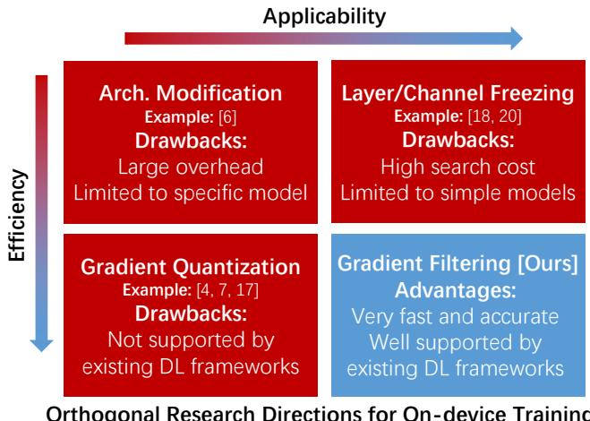
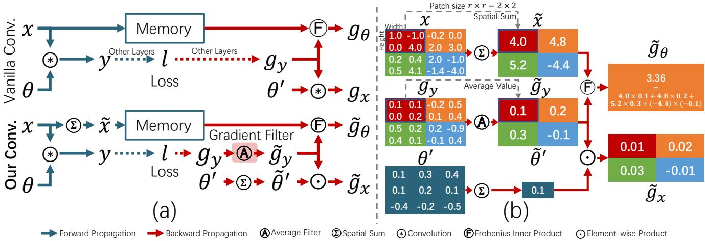
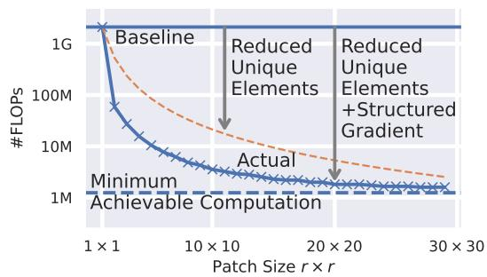
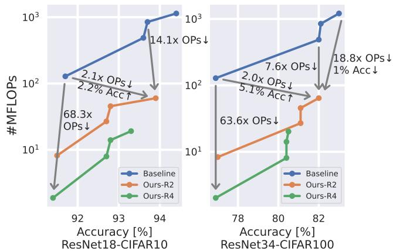
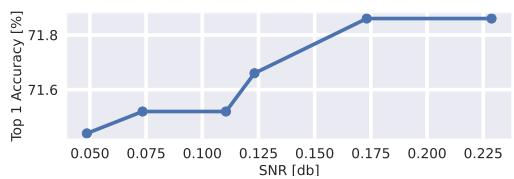
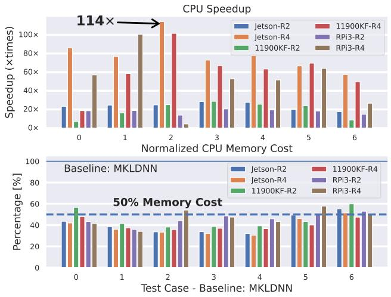
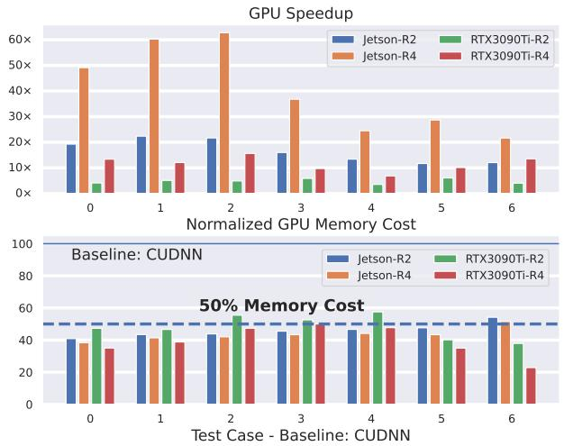

# Efficient On-device Training via Gradient Filtering

Yuedong Yang Guihong Li Radu Marculescu The University of Texas at Austin {albertyoung, lgh, radum}@utexas.edu

## Abstract

Despite its importance for federated learning, continuous learning and many other applications, on-device training remains an open problem for EdgeAI. The problem stems from the large number of operations (e.g., floating point multiplications and additions) and memory consumption required during training by the back-propagation algorithm. Consequently, in this paper, we propose a new gradient filtering approach which enables on-device CNN model training. More precisely, our approach creates a special structure with fewer unique elements in the gradient map, thus significantly reducing the computational complexity and memory consumption of back propagation during training. Extensive experiments on image classification and semantic segmentation with multiple CNN models (e.g., MobileNet, DeepLabV3, UPerNet) and devices (e.g., Raspberry Pi and Jetson Nano) demonstrate the effectiveness and wide applicability ofour approach. For example, compared to SOTA, we achieve up to 19× speedup and 77.1% memory savings on ImageNet classification with only 0.1% accuracy loss. Finally, our method is easy to implement and deploy; over 20× speedup and 90% energy savings have been observed compared to highly optimized baselines in MKLDNN and CUDNN on NVIDIA Jetson Nano. Consequently, our approach opens up a new direction ofresearch with a huge potentialfor on-device training.1

## 1. Introduction

Existing approaches for on-device training are neither efficient nor practical enough to satisfy the resource constraints of edge devices (Figure 1). This is because these methods do not properly address a fundamental problem in on-device training, namely the computational and memory complexity of the back-propagation (BP) algorithm. More precisely, although the architecture modification [6] and layer freezing [18, 20] can help skipping the BP for some layers, for other layers, the complexity remains high. Gradient quantization [4, 7] can reduce the cost of arithmetic operations but cannot reduce the number of operations (e.g., multiplications); thus, the speedup in training remains limited. Moreover, gradient quantization is not supported by existing deep-learning frameworks (e.g., CUDNN [9], MKLDNN [1], PyTorch [25] and Tensorflow [2]). To enable on-device training, there are two important questions must be addressed:

• How can we reduce the computational complexity of back propagation through the convolution layers?

• How can we reduce the data required by the gradient computation during back propagation?

In this paper, we propose gradient filtering, a new research direction, to address both questions. By addressing the first question, we reduce the computational complexity of training; by addressing the second question, we reduce the mem ory consumption.

In general, the gradient propagation through a convolution layer involves multiplying the gradient of the output variable with a Jacobian matrix constructed with data from either the input feature map or the convolution kernel. We aim at simplifying this process with the new gradient filtering approach proposed in Section 3. Intuitively, if the gradient map w.r.t. the output has the same value for all entries, then the computation-intensive matrix multiplication can be greatly simplified, and the data required to construct the Jacobian matrix can be significantly reduced. Thus, our gradient filtering can approximate the gradient w.r.t. the output by creating a new gradient map with a special (i.e., spatial) structure and fewer unique elements. By doing so, the gradient propagation through the convolution layers reduces to cheaper operations, while the data required (hence memory) for the forward propagation also lessens. Through this filtering process, we trade off the gradient precision against the computation complexity during BP. We note that gradient filtering does not necessarily lead to a worse precision, i.e., models sometimes perform better with filtered gradients when compared against models trained with vanilla BP.

In summary, our contributions are as follows:

Orthogonal Research Directions for On-device Training • We propose gradient filtering, which reduces the computation and memory required for BP by more than two orders of magnitude compared to the exact gradient calculation.

• We provide a rigorous error analysis which shows that the errors introduced by the gradient filtering have only a limited influence on model accuracy.

• Our experiments with multiple CNN models and computer vision tasks show that we can train a neural network with significantly less computation and memory costs, with only a marginal accuracy loss compared to baseline methods. Side-by-side comparisons against other training acceleration techniques also suggest the effectiveness of our method.

• Our method is easy to deploy with highly optimized deep learning frameworks (e.g., MKLDNN [1] and CUDNN [9]). Evaluations on resource-constrained edge (Raspberry Pi and Jetson Nano) and highperformance devices (CPU/GPU) show that our method is highly suitable for real life deployment.

The paper is organized as follows. Section 2 reviews relevant work. Section 3 presents our method in detail. Section 4 discusses error analysis, computation and memory consumption. Experimental results are presented in Section 5. Finally, Section 6 summarizes our main contributions.

## 2. Related Work

Architecture Modification: Authors of [6] propose to attach small branches to the original neural network. During training, the attached branches and biases in the original model are updated. Though memory consumption is reduced, updating these branches still needs gradient propagation through the entire network; moreover, a large computational overhead for inference is introduced.

Layer Freezing: Authors of [18, 20] propose to only train parts of the model. [18] makes layer selection based on layer importance metrics, while [20] uses evolutionary search. However, the layers selected by all these methods are typically computationally heavy layers (e.g., the last few layers in ResNet [14]) which consume most of the resources. Thus, the speedup achieved by these approaches is limited. Gradient Quantization: [3,5] quantize gradient after backpropagation, which means these methods cannot accelerate the training on a single device. Work in [4, 7, 15, 17, 28, 29, 33] accelerates training by reducing the cost for every arithmetic operation. However, these methods do not reduce the number of operations, which is typically huge for SOTA CNNs, so their achievable speedup is limited. Also, all these methods are not supported by the popular deep learning frameworks [1, 2, 9, 25].

  
Figure 1. Matrix of orthogonal directions for on-device training. “Arch” is short for “architecture”. Our approach opens up a new direction of research for on-device training for EdgeAI.

In contrast to the prior work, our method opens up a new research direction. More precisely, we reduce the number of computations and memory consumption required for training a single layer via gradient filtering. Thus, our method can be combined with any of the methods mentioned above. For example, in Section H in the Supplementary, we illustrate how our method can work together with the gradient quantization methods to enable a higher speedup.

## 3. Proposed Method

In this section, we introduce our gradient filtering approach to accelerate BP. To this end, we target the most computation and memory heavy operation, i.e., convolution (Figure 2(a)). Table 1 lists some symbols we use.

<table><tr><td rowspan=1 colspan=1> $C _ { x }$ </td><td rowspan=1 colspan=1>Number of channels of x</td></tr><tr><td rowspan=1 colspan=1> $\overline { { W _ { x } , H _ { x } } }$ </td><td rowspan=1 colspan=1>Width and height of x</td></tr><tr><td rowspan=1 colspan=1> $\overline { { \theta } }$ </td><td rowspan=1 colspan=1>Convolution kernel</td></tr><tr><td rowspan=1 colspan=1> $\overline { { { \theta } ^ { \prime } } }$ </td><td rowspan=1 colspan=1>Rotated $\theta , i . e . , \theta ^ { \prime } = \mathrm { r o t } 1 8 0 ( \theta )$ </td></tr><tr><td rowspan=1 colspan=1> $r$ </td><td rowspan=1 colspan=1>Patch size $( r \times r )$ </td></tr><tr><td rowspan=1 colspan=1> $g _ { x } , g _ { y } , g _ { \theta }$ </td><td rowspan=1 colspan=1>Gradients w.r.t. x, y, θ</td></tr><tr><td rowspan=1 colspan=1> $\tilde { g } _ { y }$ </td><td rowspan=1 colspan=1>Approximated gradient $g _ { y }$ </td></tr><tr><td rowspan=1 colspan=1> $\tilde { x } , \tilde { \theta } ^ { \prime }$ </td><td rowspan=1 colspan=1>Sum of x and $\overline { { \theta ^ { \prime } } }$ overspatial dimensions (height and width)</td></tr><tr><td rowspan=1 colspan=1> $x [ n , c _ { i } , h , w ]$ </td><td rowspan=1 colspan=1>Element for feature map xat batch n, channel $c _ { i } ,$ pixel $( h , w )$ </td></tr><tr><td rowspan=1 colspan=1> $\theta [ c _ { o } , c _ { i } , u , v ]$ </td><td rowspan=1 colspan=1>Element for convolution kernel θat output channel $c _ { o } ,$ input channel $c _ { i } .$ position $( u , v )$ </td></tr></table>

Table 1. Table of symbols we use.

  
Figure 2. (a) Computation procedures for vanilla training method (upper) and our method (lower). (b) Example of gradient propagation with gradient filtering. Numbers in this example are chosen randomly for illustration purposes. In this case, the patch size selected for the gradient filter is $2 \times 2$ . Thus, the $4 \times 4$ gradient map $g _ { y }$ is approximated by ${ \tilde { g } } _ { y } ,$ , which has four $2 \times 2$ patches with one unique value for each patch. Also, input feature map x and mirrored convolution kernel $\theta ^ { \prime }$ are spatial summed to x˜ and $\tilde { \theta ^ { \prime } }$ . Since x˜ has fewer unique values than x, memory consumption is reduced. Finally, with $\tilde { g } _ { y } ,$ x˜ and ${ \tilde { \theta } } ,$ we compute the gradient w.r.t. kernel and input feature map with much fewer operations than the standard back propagation method.

## 3.1. Problem Setup

The computations for both forward and backward paths are shown in Figure 2(a). For the standard (vanilla) approach (upper Figure 2(a)), starting with input $x ,$ the forward propagation convolves the input feature map x with kernel θ and returns output $y ,$ which is further processed by the other layers in the neural network (dotted arrow) until the loss value l is calculated. As shown in Figure 2(a), the BP of the convolution layer starts with the gradient map w.r.t. output $y \left( g _ { y } \right)$ . The gradient w.r.t. input $( g _ { x } )$ is calculated by convolving $g _ { y }$ with the rotated convolution kernel $\theta ^ { \prime } , i . e . , g _ { x } = g _ { y } \circledast \mathrm { r o t } 1 8 0 ( \theta ) = g _ { y } \circledast \theta ^ { \prime }$ . The gradient w.r.t. convolution kernel, namely gθ, is calculated with the Frobenius inner product [16] between x and $g _ { y } , i . e . , g _ { \theta } = g _ { y } \textcircled { \mathrm { { F } } } \it$ x.

The lower half of Figure 2(a) shows our method, where several changes are made: We introduce the gradient filter $\mathrm { \Omega ^ { 6 6 } ( \vec { A } ) ^ { 3 } }$ after $g _ { y }$ to generate the approximate gradient for BP. Also, instead of using the accurate x and $\theta ^ { \prime }$ values for gradient computation, we sum over spatial dimensions (height and width dimensions), $i . e . , \tilde { x }$ and ${ \tilde { \theta } } ^ { \prime }$ , respectively. Finally, the convolution layer now multiplies the approximate gradient $\tilde { g } _ { y }$ with spatial kernel $\tilde { \theta } ^ { \prime }$ instead of convolving with it to calculate ${ \tilde { g } } _ { x } .$ . Figure 2(b) shows an example of gradient propagation with our gradient filter.

## 3.2. Preliminary Analysis

Consider the vanilla BP for convolution in Figure 2(a). Equation (1) shows the number of computations (#FLOPs) required to calculate $g _ { x }$ given $g _ { y }$

$$
\# \mathrm { F L O P s } = 2 C _ { x } C _ { y } \cdot W _ { y } H _ { y } \cdot W _ { \theta } H _ { \theta }\tag{1}
$$

The computation requirements in Equation (1) belong to three categories: number of channels, number of unique elements per channel in the gradient map, and kernel size. Our method focuses on the last two categories.

i. Unique elements: $( W _ { y } H _ { y } )$ represents the number of unique elements per channel in the gradient w.r.t. output variable $y \left( g _ { y } \right)$ . Given the high-resolution images we use, this term is huge, so if we manage to reduce the number of unique elements in the spatial dimensions (height and width), the computations required are greatly reduced too.

ii. Kernel size: $( W _ { \theta } H _ { \theta } )$ represents the number of unique elements in the convolution kernel. If the gradient $g _ { y }$ has some special structure, for example $g _ { y } = 1 _ { H _ { y } \times W _ { y } } \cdot v$ (i.e., every element in $g _ { y }$ has the same value v), then the convolution can be simplified to $( \sum \theta ^ { \prime } ) v 1 _ { H _ { y } \times W _ { y } }$ (with boundary elements ignored). With such a special structure, only one multiplication and $( W _ { \theta } H _ { \theta } - 1 )$ additions are required. Moreover, $\sum \theta ^ { \prime }$ is independent of data so the result can be shared across multiple images until θ gets updated.

## 3.3. Gradient Filtering

To reduce the number of unique elements and create the special structure in the gradient map, we apply the gradient filter after the gradient w.r.t. output $( g _ { y } )$ is provided. During the backward propagation, the gradient filter $\textcircled{8} a p .$ proximates the gradient $g _ { y }$ by spatially cutting the gradient map into r ×r-pixel patches and then replacing all elements in each patch with their average value (Figure 2(b)):

$$
\tilde { g } _ { y } [ n , c _ { o } , h , w ] = \frac { 1 } { r ^ { 2 } } \sum _ { i = \lfloor h / r \rfloor r } ^ { \lceil h / r \rceil r } \sum _ { j = \lfloor w / r \rfloor r } ^ { \lceil w / r \rceil } g _ { y } [ n , c _ { o } , i , j ]\tag{2}
$$

For instance in Figure 2(b), we replace the 16 distinct values in the gradient map $g _ { y }$ with 4 average values in $\tilde { g } _ { y }$ . So given a gradient map $g _ { y }$ with N images per batch, $C$ channels, and $H \times W$ pixels per channel, the gradient filter returns a structured approximation of the gradient map containing only $\begin{array} { r } { N \times C \times \lceil \frac { H } { r } \rceil \times \lceil \frac { W } { r } \rceil } \end{array}$ blocks, with one unique value per patch. We use this matrix of unique values to represent the approximate gradient map $\tilde { g } _ { y }$ , as shown in Figure 2(b).

## 3.4. Back Propagation with Gradient Filtering

We describe now the computation procedure used after applying the gradient filter. Detailed derivations are provided in Supplementary Section B.

Gradient w.r.t. input: The gradient w.r.t. input is calculated by convolving $\theta ^ { \prime }$ with $g _ { y }$ (Figure 2(a)). With the approximate gradient $\tilde { g } _ { y }$ , this convolution simplifies to:

$$
\tilde { g } _ { x } [ n , c _ { i } , h , w ] = \sum _ { c _ { o } } \tilde { g } _ { y } [ n , c _ { o } , h , w ] \odot \tilde { \theta } ^ { \prime } [ c _ { o } , c _ { i } ]\tag{3}
$$

where $\begin{array} { r } { \tilde { \theta } ^ { \prime } [ c _ { o } , c _ { i } ] = \sum _ { u , v } \theta ^ { \prime } [ c _ { o } , c _ { i } , u , v ] } \end{array}$ is the spatial sum of convolution kernel θ, as shown in Figure 2(b).

Gradient w.r.t. kernel: The gradient w.r.t. the kernel is calculated by taking the Frobenius inner product between x and $g _ { y } , i . e . , g _ { \theta } [ c _ { o } , c _ { i } , u , v ] = x \textcircled { \mathrm { { F } } } g _ { y }$ , namely:

$$
g _ { \theta } [ c _ { o } , c _ { i } , u , v ] = \sum _ { n , i , j } x [ n , c _ { i } , i + u , j + v ] g _ { y } [ n , c _ { o } , i , j ]\tag{4}
$$

With the approximate gradient $\tilde { g } _ { y } ,$ , the operation can be simplified to:

$$
\tilde { g } _ { \theta } [ c _ { o } , c _ { i } , u , v ] = \sum _ { n , i , j } \tilde { x } [ n , c _ { i } , i , j ] \tilde { g } _ { y } [ n , c _ { o } , i , j ]\tag{5}
$$

with $\begin{array} { r } { { \tilde { x } } [ n , c _ { i } , i , j ] \ = \ \sum _ { h = | i / r | r } ^ { \lceil i / r \rceil r } \sum _ { w = | j / r | r } ^ { \lceil j / r \rceil r } x [ n , c _ { i } , h , w ] . } \end{array}$ As shown in Figure 2(b), $\tilde { x } [ n , c _ { i } , i , j ]$ is the spatial sum of x elements in the same patch containing pixel (i, j).

## 4. Analyses of Proposed Approach

In this section, we analyze our method from three perspectives: gradient filtering approximation error, computation reduction, and memory cost reduction.

## 4.1. Error Analysis of Gradient Filtering

We prove that the approximation error introduced by our gradient filtering is bounded during the gradient propagation. Without losing generality, we consider that all variables have only one channel, $i . e . , C _ { x _ { 0 } } = C _ { x _ { 1 } } = 1$

Proposition 1: For any input-output channel pair $\left( { { c _ { o } } , { c _ { i } } } \right)$ in the convolution kernel θ, assuming the DC component has the largest energy value compared to all components in the spectrum2, then the signal-to-noise-ratio (SNR) of $\tilde { g } _ { x }$ is greater than SNR of $\tilde { g } _ { y }$ .

Proof: We use $G _ { x } , G _ { y }$ and Θ to denote the gradients $g _ { x } , g _ { y }$ and the convolution kernel θ in thefrequency domain; $G _ { x } [ u , v ]$ is the spectrum value at frequency $( u , v )$ and δ is the 2D discrete Dirichlet function. To simplify the discussion, we consider only one patch of size $r \times r$

The gradient returned by the gradient filtering can be written as:

$$
\tilde { g } _ { y } = \frac { 1 } { r ^ { 2 } } 1 _ { r \times r } \circledast g _ { y }\tag{6}
$$

where $\circledast$ denotes convolution. By applying the discrete Fourier transformation, Equation (6) can be rewritten in the frequency domain as:

$$
\tilde { G } _ { y } [ u , v ] = \frac { 1 } { r ^ { 2 } } \delta [ u , v ] G _ { y } [ u , v ]\tag{7}
$$

$\tilde { g } _ { y }$ is the approximation of $g _ { y }$ (i.e., the ground truth for $\tilde { g } _ { y }$ is $g _ { y } )$ , and the SNR of $\tilde { g } _ { y }$ equals to:

$$
\begin{array} { l } { { \mathrm { S N R } _ { \tilde { g } _ { y } } = \frac { \sum _ { ( u , v ) } G _ { y } ^ { 2 } [ u , v ] } { \sum _ { ( u , v ) } ( G _ { y } [ u , v ] - \frac { 1 } { r ^ { 2 } } \delta [ u , v ] G _ { y } [ u , v ] ) ^ { 2 } } } } \\ { { \mathrm { ~ \ ~ \ } = ( 1 - \frac { 2 r ^ { 2 } - 1 } { r ^ { 4 } } \frac { G _ { y } ^ { 2 } [ 0 , 0 ] } { \sum _ { ( u , v ) } G _ { y } ^ { 2 } [ u , v ] } ) ^ { - 1 } } } \end{array}\tag{8}
$$

For the convolution layer, the gradient w.r.t. the approximate variable x˜ in the frequency domain $\mathrm { i } \mathrm { s } ^ { 3 }$ :

$$
\begin{array} { l } { { \tilde { G } _ { x } [ u , v ] = \Theta [ - u , - v ] \tilde { G } _ { y } [ u , v ] } } \\ { { \qquad = \displaystyle \frac { 1 } { r ^ { 2 } } \Theta [ - u , - v ] \delta [ u , v ] G _ { y } [ u , v ] } } \end{array}\tag{9}
$$

and its ground truth is:

$$
G _ { x } [ u , v ] = \Theta [ - u , - v ] G _ { y } [ u , v ]\tag{10}
$$

Similar to Equation (8), the SNR of $g _ { \tilde { x } }$ is:

$$
\mathrm { S N R } _ { \tilde { g } _ { x } } = ( 1 - \frac { 2 r ^ { 2 } - 1 } { r ^ { 4 } } \frac { ( \Theta [ 0 , 0 ] G _ { y } [ 0 , 0 ] ) ^ { 2 } } { \sum _ { ( u , v ) } { ( \Theta [ u , v ] G _ { y } [ u , v ] ) ^ { 2 } } } ) ^ { - 1 }\tag{11}
$$

Equation (11) can be rewritten as:

$$
\begin{array} { r } { \frac { r ^ { 4 } ( 1 - \mathrm { S N R } _ { \tilde { g } _ { x } } ^ { - 1 } ) } { 2 r ^ { 2 } - 1 } = \frac { ( \Theta [ 0 , 0 ] G _ { y } [ 0 , 0 ] ) ^ { 2 } } { \sum _ { ( u , v ) } ( \Theta [ - u , - v ] G _ { y } [ u , v ] ) ^ { 2 } } } \\ { = \frac { G _ { y } ^ { 2 } [ 0 , 0 ] } { \sum _ { ( u , v ) } ( \frac { \Theta [ - u , - v ] } { \Theta [ 0 , 0 ] } G _ { y } [ u , v ] ) ^ { 2 } } } \end{array}\tag{12}
$$

Furthermore, the main assumption $( i . e .$ , the DC component dominates the frequency spectrum of Θ) can be written as:

$$
\Theta ^ { 2 } [ 0 , 0 ] / \mathrm { m a x } _ { ( u , v ) \neq ( 0 , 0 ) } \Theta ^ { 2 } [ u , v ] \geq 1\tag{13}
$$

  
Figure 3. Computation analysis for a specific convolution layer4. Minimum achievable computation is given in Equation (16). By reducing the number of unique elements, computations required by our approach drop to about $1 / r ^ { 2 }$ compared with the standard BP method. By combining it with structured gradient map, computations required by our approach drop further, getting very close to the theoretical limit.

that is, $\begin{array} { r } { \forall ( u , v ) , \frac { \Theta ^ { 2 } [ - u , - v ] } { \Theta ^ { 2 } [ 0 , 0 ] } \le 1 \le } \end{array}$ ; thus, by combining Equation (12) and Equation (13), we have:

$$
\begin{array} { r l r } & { } & { \frac { G _ { y } ^ { 2 } [ 0 , 0 ] } { \sum _ { ( u , v ) } ( \frac { \Theta [ - u , - v ] } { \Theta [ 0 , 0 ] } G _ { y } [ u , v ] ) ^ { 2 } } \geq \frac { G _ { y } ^ { 2 } [ 0 , 0 ] } { \sum _ { ( u , v ) } ( G _ { y } [ u , v ] ) ^ { 2 } } } \\ & { } & { \quad \Leftrightarrow \frac { r ^ { 4 } \left( 1 - \mathrm { S N R } _ { \tilde { g } _ { x } } ^ { - 1 } \right) } { 2 r ^ { 2 } - 1 } \geq \frac { r ^ { 4 } ( 1 - \mathrm { S N R } _ { \tilde { g } _ { y } } ^ { - 1 } ) } { 2 r ^ { 2 } - 1 } } \end{array}\tag{14}
$$

which means that: $\mathrm { S N R } _ { \tilde { g } _ { x } } \geq \mathrm { S N R } _ { \tilde { g } _ { y } }$ . This completes our proof for error analysis. ■

In conclusion, as the gradient propagates through the network, the noise introduced by our gradient filter becomes weaker compared to the real gradient signal. This property ensures that the error in gradient has only a limited influence on the quality of BP. We validate Proposition 1 later in the experimental section.

## 4.2. Computation and Overhead Analysis

In this section, we analyse the computation required to compute $g _ { x }$ , the gradient w.r.t. input x. Figure 3 compares the computation required to propagate the gradient through this convolution layer under different patch sizes $r \times r$ . A patch size $1 \times 1$ means the vanilla BP algorithm which we use as the baseline. As discussed in the preliminary analysis section (Section 3.2), two terms contribute to the computation savings: fewer unique elements in the gradient map and the structured gradient map.

Fewer unique elements: In vanilla BP, there are $H _ { y } W _ { y }$ unique elements in the gradient map. After applying gradient filtering with a patch size $r \times r$ , the number of unique elements reduces to only $\lceil \frac { H _ { y } } { r } \rceil \lceil \frac { W _ { y } } { r } \rceil$ . This reduction contributes the most to the savings in computation (orange line in Figure 3).

Structured Gradient Map: By creating the structured gradient map, the convolution over the gradient map $\tilde { g } _ { y }$ is simplified to the element-wise multiplication and channel-wise addition. Computation is thus reduced to $( H _ { \theta } W _ { \theta } ) ^ { - 1 }$ of its original value. For instance, the example convolution layer in Figure 3 uses a $3 \times 3$ convolution kernel so around 89% computations are removed. The blue line in Figure 3 shows the #FLOPs after combining both methods. Greater reduction is expected when applying our method with larger convolution kernels. For instance, FastDepth [30] uses $5 \times 5$ convolution kernel so as much as 96% reduction in computation can be achieved, in principle.

Minimum Achievable Computation: With the two reductions mentioned above, the computation required to propagate the gradient through the convolution layer is:

$$
\# \mathrm { F L O P s } ( r ) = \lceil \frac { H _ { y } } { r } \rceil \lceil \frac { W _ { y } } { r } \rceil C _ { x } ( 2 C _ { y } - 1 ) + o ( H _ { y } W _ { y } )\tag{15}
$$

where $o ( H _ { y } W _ { y } )$ is a constant term which is independent of r and negligible compared to $H _ { y } W _ { y }$ . When the patch is as large as the feature map, our method reaches the minimum achievable computation (blue dashed line in Figure 3):

$$
\begin{array} { r } { \operatorname* { m i n } _ { r } \# \mathrm { F L O P s } ( r ) = 2 C _ { x } C _ { y } - C _ { x } + o ( H _ { y } W _ { y } ) } \end{array}\tag{16}
$$

In this case, each channel of the gradient map is represented with a single value, so the computation is controlled by the number of input and output channels.

Overhead: The overhead of our approach comes from approximating the feature map $x ,$ gradient $g _ { y } ,$ and kernel θ. As the lower part of Figure 2(a) shows, the approximation for $x$ is considered as part of forward propagation, while the other two as back propagation. Indeed, with the patch size r, the ratio of forward propagation overhead is about $1 / ( 2 C _ { o } W _ { \theta } H _ { \theta } )$ , while the ratio of backward propagation overhead is about $( r ^ { 2 } - 1 ) / ( 2 C _ { x } )$

Given the large number of channels and spatial dimensions in typical neural networks, both overhead values take less than 1% computation in the U-Net example above.

## 4.3. Memory Analysis

As Figure 2(a) shows, the standard back propagation for a convolution layer relies on the input feature map x, which needs to be stored in memory during forward propagation. Since every convolution layer requiring gradient for its kernel needs to save a copy of feature map x, the memory consumption for storing x is huge. With our method, we simplify the feature map x to approximated x˜, which has only $\Big \lceil \frac { \check { H } _ { x } } { r } \Big \rceil \Big \lceil \frac { W _ { x } } { r } \Big \rceil$ unique elements for every channel. Thus, by saving only these unique values, our method achieves around $\begin{array} { r } { ( \bar { 1 } - \frac { \bar { 1 } } { r ^ { 2 } } ) } \end{array}$ memory savings, overall.

<table><tr><td>MobileNetV2 [27]</td><td>#Layers</td><td>Accuracy</td><td>FLOPs</td><td>Mem</td><td>ResNet-18 [14]</td><td>#Layers</td><td>Accuracy</td><td>FLOPs</td><td>Mem</td></tr><tr><td>No Finetuning</td><td>0</td><td>4.2</td><td>0</td><td>0</td><td>No Finetuning</td><td>0</td><td>4.7</td><td>0</td><td>0</td></tr><tr><td rowspan="3">Vanilla BP</td><td>All</td><td>75.1</td><td>1.13G</td><td>24.33MB</td><td>Vanilla</td><td>All</td><td>73.1</td><td>5.42G</td><td>8.33MB</td></tr><tr><td>2</td><td>63.1</td><td>113.68M</td><td>245.00KB</td><td>BP</td><td>2</td><td>70.4</td><td>489.20M</td><td>196.00KB</td></tr><tr><td>4</td><td>62.2</td><td>160.00M</td><td>459.38KB</td><td></td><td>4</td><td>72.3</td><td>1.14G</td><td>490.00KB</td></tr><tr><td>TinyTL [6]</td><td>N/A</td><td>60.2</td><td>663.51M</td><td>683.00KB</td><td>TinyTL [6]</td><td>N/A</td><td>69.2</td><td>3.88G</td><td>1.76MB</td></tr><tr><td>Ours</td><td>2</td><td>63.1</td><td>39.27M</td><td>80.00KB</td><td>Ours</td><td>2</td><td>68.6</td><td>28.32M</td><td>64.00KB</td></tr><tr><td></td><td>4</td><td>63.4</td><td>53.96M</td><td>150.00KB</td><td></td><td>4</td><td>68.5</td><td>61.53M</td><td>112.00KB</td></tr><tr><td>MCUNet [19] No Finetune</td><td>#Layers</td><td>Accuracy</td><td>FLOPs</td><td>Mem</td><td>ResNet-34 [14]</td><td>#Layers</td><td>Accuracy</td><td>FLOPs</td><td>Mem</td></tr><tr><td></td><td>0</td><td>4.1</td><td>0</td><td>0</td><td>No Finetune</td><td>0</td><td></td><td>0</td><td>0</td></tr><tr><td rowspan="3">Vanilla BP</td><td>All</td><td>68.5</td><td>231.67M</td><td>9.17MB</td><td>Vanilla</td><td>All</td><td>70.8</td><td>11.17G</td><td>13.11MB</td></tr><tr><td>2</td><td>62.1</td><td>18.80M</td><td>220.50KB</td><td>BP</td><td>2</td><td>69.6</td><td>489.20M</td><td>196.00KB</td></tr><tr><td>4</td><td>64.9</td><td>33.71M</td><td>312.38KB</td><td></td><td>4</td><td>72.3</td><td>1.21G</td><td>392.00KB</td></tr><tr><td>TinyTL [6]</td><td>N/A</td><td>53.1</td><td>148.01M</td><td>571.5KB</td><td>TinyTL [6]</td><td>N/A</td><td>72.9</td><td>8.03G</td><td>2.95MB</td></tr><tr><td rowspan="2">Ours</td><td>2</td><td>61.8</td><td>6.34M</td><td>72.00KB</td><td>Ours</td><td>2</td><td>68.6</td><td>28.32M</td><td>64.00KB</td></tr><tr><td>4</td><td>64.4</td><td>11.01M</td><td>102.00KB</td><td></td><td>4</td><td>70.6</td><td>64.07M</td><td>128.00KB</td></tr></table>

Table 2. Experimental results for ImageNet classification with four neural networks (MobileNet-V2, ResNet18/34, MCUNet). “#Layers” is short for “the number of active convolutional layers”. For example, #Layers equals to 2 means that only the last two convolutional layer are trained. For memory consumption, we only consider the memory for input feature x. Strategy “No Finetuning” shows the accuracy on new datasets without finetuning the pretrained model. Since TinyTL [6] changes the architecture, “#Layers” is not applicable (N/A).
<table><tr><td>PSPNet [32]</td><td>#Layers</td><td>GFLOPs</td><td>mIoU mAcc</td><td>PSPNet-M [32]</td><td>#Layers</td><td>GFLOPs</td><td>mIoU</td><td>mAcc</td><td>FCN [21]</td><td>#Layers</td><td>GFLOPs</td><td>mIoU</td><td>mAcc</td></tr><tr><td>Calibration</td><td>0</td><td>0</td><td>12.86</td><td>19.74 Calibration</td><td>0</td><td>0</td><td>14.20</td><td>20.46</td><td>Calibration</td><td>0</td><td>0</td><td>10.95</td><td>15.69</td></tr><tr><td>Vanilla</td><td>All</td><td>166.5</td><td>55.01</td><td>68.02 Vanilla</td><td>All</td><td>42.4</td><td>48.48</td><td>61.48</td><td>Vanilla</td><td>All</td><td>170.3</td><td>45.22</td><td>58.80</td></tr><tr><td>BP</td><td>5</td><td>15.0</td><td>39.54</td><td>51.86</td><td>5 BP</td><td></td><td>12.22 36.35</td><td>47.09</td><td></td><td>5</td><td>59.5</td><td>27.41</td><td>37.90</td></tr><tr><td rowspan="2"></td><td>10</td><td>110.6</td><td>53.15</td><td>67.10</td><td>10</td><td>22.46</td><td>46.01</td><td>58.70</td><td>BP</td><td>10</td><td>100.9</td><td>43.87</td><td>57.58</td></tr><tr><td>5</td><td>0.14</td><td>39.34</td><td>51.86 Ours</td><td>5</td><td>0.11</td><td>36.14</td><td>46.86</td><td>Ours</td><td>5</td><td>0.58</td><td>27.42</td><td>37.88</td></tr><tr><td>Ours</td><td>10</td><td>0.79</td><td>50.88</td><td>64.73</td><td>10</td><td>0.76</td><td>44.90</td><td>57.50</td><td></td><td>10</td><td>0.96</td><td>36.30</td><td>48.82</td></tr><tr><td>DLV3 [8]</td><td>#Layers</td><td>GFLOPs</td><td>mIoU</td><td>mAcc DLV3-M [8]</td><td>#Layers</td><td>GFLOPs</td><td>mIoU</td><td>mAcc</td><td>UPerNet [31]</td><td>#Layers</td><td>GFLOPs</td><td>mIoU</td><td>mAcc</td></tr><tr><td>Calibration</td><td>0</td><td>0</td><td>13.95 20.62</td><td>Calibration</td><td>0</td><td>0</td><td>21.96</td><td>36.15</td><td>Calibration</td><td>0</td><td>0</td><td>14.71</td><td>21.82</td></tr><tr><td>Vanilla</td><td>All</td><td>151.2</td><td>58.32 71.72</td><td>Vanilla</td><td>All</td><td>54.4</td><td>55.66</td><td>68.95</td><td></td><td>All</td><td>541.0</td><td>64.88</td><td>77.13</td></tr><tr><td rowspan="3">BP</td><td>5</td><td>18.0</td><td>40.85</td><td>53.16</td><td></td><td>5 14.8</td><td>38.21</td><td>49.35</td><td>Vanilla</td><td>5</td><td></td><td>503.9 47.93</td><td>61.67</td></tr><tr><td>10</td><td>102.0</td><td>54.65</td><td>68.64</td><td>BP</td><td>10</td><td>33.1</td><td>47.95 61.49</td><td></td><td>BP 10</td><td>507.6</td><td>48.83</td><td>63.02</td></tr><tr><td>5</td><td>0.31</td><td>33.09</td><td>44.33</td><td>5</td><td>0.26</td><td>35.47</td><td>46.35</td><td></td><td>5</td><td>1.97</td><td>47.04</td><td>60.44</td></tr><tr><td>Ours</td><td>10</td><td>2.96</td><td>47.11</td><td>60.28</td><td>Ours</td><td>10</td><td>1.40 45.53</td><td>58.99</td><td>Ours</td><td>10</td><td>2.22</td><td>48.00</td><td>62.07</td></tr></table>

Table 3. Experimental results for semantic segmentation task on augmented Pascal VOC12 dataset [8]. Model name with postfix “M” means the model uses MobileNetV2 as backbone, otherwise ResNet18 is used. “#Layers” is short for “the number of active convolutional layers” that are trained. All models are pretrained on Cityscapes dataset [11]. Strategy “Calibration” shows the accuracy when only the classifier and normalization statistics are updated to adapt different numbers of classes between augmented Pascal VOC12 and Cityscapes.

## 5. Experiments

Our experimental section consists of theoretical and practical evaluations. Sections 5.2-5.4 show the theoretical advantages of our method on image classification and semantic segmentation tasks with implementation-agnostic metrics (e.g., accuracy, FLOPs). Then, in Section 5.5, we show how these theoretical advantages translate into practical advantages (i.e., speedup and memory savings) on real edge devices.

## 5.1. Experimental Setup

Classification: Following [24], we split every dataset into two highly non-i.i.d. partitions with the same size. Then, we pretrain our models on the first partition with a vanilla training strategy, and finetune the model on the other partition with different configurations for the training strategy (i.e., with/without gradient filtering, hyper-parameters, number of convolution layers to be trained). More details (e.g., hyper-parameters) are in the Supplementary.

Segmentation: Models are pretrained on Cityscapes [11] by MMSegmentation [10]. Then, we calibrate and finetune these models with different training strategies on the augmented Pascal-VOC12 dataset following [8], which is the combination of Pascal-VOC12 [12] and SBD [13]. More details are included in the supplementary material.

On-device Performance Evaluation: For CPU performance evaluation, we implement our method with MKLDNN [1] (a.k.a. OneDNN) v2.6.0 and compare it with the convolution BP method provided by MKLDNN. We test on three CPUs, namely Intel 11900KF, Quad-core Cortex-A72 (Jetson Nano) and Quad-core Cortex-A53 (Raspberry Pi-3b). For GPU performance evaluation, we implement our method on CUDNN v8.2 [9] and compare with the BP method provided by CUDNN. We test on two GPUs, RTX 3090Ti and the edge GPU on Jetson Nano. Since both MKLDNN and CUDNN only support float32 BP, we test float32 BP only. Additionally, for the experiments on Jetson Nano, we record the energy consumption for CPU and GPU with the embedded power meter. More details (e.g., frequency) are included in the supplementary material.

## 5.2. ImageNet Classification

Table 2 shows our evaluation results on the ImageNet classification task. As shown, our method significantly reduces the FLOPs and memory required for BP, with very little accuracy loss. For example, for ResNet34, our method achieves 18.9× speedup with 1.7% accuracy loss when training four layers; for MobileNetV2, we get a 1.2% better accuracy with 3.0× speedup and 3.1× memory savings. These results illustrate the effectiveness of our method. On most networks, TinyTL has a lower accuracy while consuming more resources compared to the baselines methods.

## 5.3. Semantic Segmentation

Table 3 shows our evaluation results on the augmented Pascal-VOC12 dataset. On a wide range of networks, our method constantly achieves significant speedup with marginal accuracy loss. For the large network UPerNet, our method achieves 229× speedup with only 1% mIoU loss. For the small network PSPNet, our method speedups training by 140× with only 2.27% mIoU loss. This shows the effectiveness of our method on a dense prediction task.

## 5.4. Hyper-Parameter Selection

Figure 4 shows our experimental results for ResNets under different hyper-parameter selection, i.e. number of convolution layers and patch size of gradient filter $r \times r .$ Of note, the y-axis (MFLOPs) in Figure 4 is log scale. More results are included in Supplementary Section G. We highlight three qualitative findings in Figure 4:

a. For a similar accuracy, our method greatly reduces the number of operations (1 to 2 orders of magnitude), while for a similar number of computations, our method achieves a higher accuracy (2% to 5% better).

This finding proves the effectiveness of our method.

b. Given the number of convolution layers to be trained, the more accurate method returns a better accuracy. Baseline (i.e., standard BP) uses the most accurate gradient, Ours-R4 (BP with gradient filter with patch size 4 × 4) uses the least accurate gradient; thus, Baseline $> \mathrm { O u r s - R } 2 > \mathrm { O u r s - R } 4 .$

This finding is intuitive since the more accurate method should introduce smaller noise to the BP, e.g., the gradient filtering with patch size $2 \times 2$ (Ours-R2) introduces less noise than with patch size $4 \times 4 ( \mathrm { O u r s { - } R 4 } )$ . In Figure 5, we evaluate the relationship between accuracy and noise level introduced by gradient filtering. With a higher SNR (i.e., a lower noise level), a better accuracy is achieved.

  
Figure 4. Computation (#MFLOPs, log scale) and model accuracy [%] under different hyper-parameter selection. “Baseline” means vanilla BP; “Ours-R2/4” uses gradient filtering with patch size 2× 2/4 × 4 during BP.

  
Figure 5. Relationship between accuracy and noise level introduced by the gradient filtering. As shown, accuracy increases as the SNR increases, i.e., noise level decreases.

c. Given the number of computations, the less accurate method returns the better accuracy by training more layers, i.e., Ours- $. \mathrm { R 4 } > \mathrm { O u r s - R 2 } >$ baseline.

This finding suggests that for neural network training with relatively low computational resources, training more layers with less accurate gradients is preferable than training fewer layers with more accurate gradients.

## 5.5. On-device Performance Evaluation

Figure 6 and Table 4 show our evaluation results on real devices. More results are included in the Supplementary Section I. As Figure 6 shows, on CPU, most convolution layers achieve speedups over 20× with less than 50% memory consumption for gradient filtering with patch sizes 2×2; for gradient filtering with patch size 4 × 4, the speedups are much higher, namely over 60×. On GPU, the speedup is a little bit lower, but still over 10× and 25×, respectively. Furthermore, as Table 4 shows, our method saves over 95%

  
Figure 6. Speedup and normalized memory consumption results on multiple CPUs and GPUs under different test cases $( i . e .$ different input sizes, numbers of channels, etc.) Detailed configuration of these test cases are included in the supplementary material. $\mathrm { { } ^ { 6 4 } R 2 ^ { 9 } , \mathrm { { } ^ { 6 4 } R 4 ^ { 9 } } }$ mean using gradient filtering with $2 \times 2$ and 4 × 4 patch sizes, respectively. Our method achieves significant speedup with low memory consumption compared to all baseline methods. For example, on Jetson CPU with patch size $4 \times 4$ (“Jetson-R4” in left top figure), our method achieves 114× speedup with only 33% memory consumption for most test cases.

<table><tr><td>Device</td><td>Patch Size</td><td>Normalized Energy Cost [STD]</td></tr><tr><td>Edge</td><td> $2 \times 2$ </td><td>4.13% [0.61%]</td></tr><tr><td>CPU</td><td> $4 \times 4$ </td><td>1.15% [0.18%]</td></tr><tr><td>Edge</td><td> $\overline { { 2 \times 2 } }$ </td><td>3.80% [0.73%]</td></tr><tr><td>GPU</td><td> $4 \times 4$ </td><td>1.22% [1.10%]</td></tr></table>

Table 4. Normalized energy consumption for BP with gradient filtering for different patch sizes. Results are normalized w.r.t. the energy cost of standard BP methods. For instance, for edge CPU with a $4 \times 4$ patch, only 1.15% of energy in standard BP is used. Standard deviations are shown within brackets.

energy for both CPU and GPU scenarios, which largely resolves one of the most important constraints on edge devices. All these experiments on real devices show that our method is practical for the real deployment of both highperformance and IoT applications.
<table><tr><td>Model</td><td>Ratio</td><td>Model</td><td>Ratio</td></tr><tr><td>(Wide)ResNet18-152</td><td>1.462</td><td>VGG(bn)11-19</td><td>1.497</td></tr><tr><td>DenseNet121-201</td><td>2.278</td><td>EfficientNet b0-b7</td><td>1.240</td></tr></table>

Table 5. Evaluation of energy ratio defined in Equation (13) on models published on Torchvision. The ratio greater than 1 empirically verifies our assumption.

## 5.6. Main Assumption Verification

We now empirically verify the assumption that the DC component dominates the frequency spectrum of the convolution kernel (Section 4.1). To this end, we collect the energy ratio shown in Equation (13) from trained models published in Torchvision [23]. As Table 5 shows, for the convolution kernels in all these networks, we get a ratio greater than one, which means that the energy of DC components is larger than energy of all AC components. Thus, our assumption in Section 4.1 empirically holds true in practice.

## 6. Conclusions

In this paper, we have addressed the on-device model training for resource-constrained edge devices. To this end, a new gradient filtering method has been proposed to systematically reduce the computation and memory consumption for the back-propagation algorithm, which is the key bottleneck for efficient model training.

In Section 3, a new gradient filtering approach has been proposed to reduce the computation required for propagating gradients through the convolutional layers. The gradient filtering creates an approximate gradient feature map with fewer unique elements and a special structure; this reduces the computation by more than two orders of magnitude. Furthermore, we proved that the error introduced during back-propagation by our gradient filter is bounded so the influence of gradient approximation is limited.

Extensive experiments in Section 5 have demonstrated the efficiency and wide applicability of our method. Indeed, models can be finetuned with orders of magnitudes fewer computations, while having only a marginal accuracy loss compared to popular baseline methods.

Acknowledgements: This work was supported in part by the US National Science Foundation (NSF) grant CNS-2007284.

## References

[1] Intel® oneapi deep neural network library (onednn). https://www.intel.com/content/www/us/en/ developer/tools/oneapi/onednn.html. 1, 2, 6

[2] Mart´ın Abadi, Ashish Agarwal, Paul Barham, Eugene Brevdo, Zhifeng Chen, Craig Citro, Greg S. Corrado, Andy Davis, Jeffrey Dean, Matthieu Devin, Sanjay Ghemawat, Ian Goodfellow, Andrew Harp, Geoffrey Irving, Michael Isard, Yangqing Jia, Rafal Jozefowicz, Lukasz Kaiser, Manjunath Kudlur, Josh Levenberg, Dandelion Mane, Rajat Monga,´ Sherry Moore, Derek Murray, Chris Olah, Mike Schuster, Jonathon Shlens, Benoit Steiner, Ilya Sutskever, Kunal Talwar, Paul Tucker, Vincent Vanhoucke, Vijay Vasudevan, Fernanda Viegas, Oriol Vinyals, Pete Warden, Martin Watten-´ berg, Martin Wicke, Yuan Yu, and Xiaoqiang Zheng. Tensor-Flow: Large-scale machine learning on heterogeneous systems, 2015. Software available from tensorflow.org. 1, 2

[3] Dan Alistarh, Demjan Grubic, Jerry Z. Li, Ryota Tomioka, and Milan Vojnovic. Qsgd: Communication-efficient sgd via gradient quantization and encoding. In Proceedings of the 31st International Conference on Neural Information Processing Systems, NIPS’17, page 1707–1718, Red Hook, NY, USA, 2017. Curran Associates Inc. 2

[4] Ron Banner, Itay Hubara, Elad Hoffer, and Daniel Soudry. Scalable methods for 8-bit training of neural networks. In Proceedings ofthe 32nd International Conference on Neural Information Processing Systems, NIPS’18, page 5151–5159, Red Hook, NY, USA, 2018. Curran Associates Inc. 1, 2, 11, 17, 19

[5] Jeremy Bernstein, Yu-Xiang Wang, Kamyar Azizzadenesheli, and Animashree Anandkumar. signsgd: Compressed optimisation for non-convex problems. In International Conference on Machine Learning, pages 560–569. PMLR, 2018. 2

[6] Han Cai, Chuang Gan, Ligeng Zhu, and Song Han. Tinytl: Reduce activations, not trainable parameters for efficient ondevice learning. arXiv preprint arXiv:2007.11622, 2020. 1, 2, 6

[7] Jianfei Chen, Yu Gai, Zhewei Yao, Michael W Mahoney, and Joseph E Gonzalez. A statistical framework for low-bitwidth training of deep neural networks. In H. Larochelle, M. Ranzato, R. Hadsell, M.F. Balcan, and H. Lin, editors, Advances in Neural Information Processing Systems, volume 33, pages 883–894. Curran Associates, Inc., 2020. 1, 2, 11, 16, 17, 19

[8] Liang-Chieh Chen, George Papandreou, Florian Schroff, and Hartwig Adam. Rethinking atrous convolution for semantic image segmentation. arXiv preprint arXiv:1706.05587, 2017. 6

[9] Sharan Chetlur, Cliff Woolley, Philippe Vandermersch, Jonathan Cohen, John Tran, Bryan Catanzaro, and Evan Shelhamer. cudnn: Efficient primitives for deep learning. arXiv preprint arXiv:1410.0759, 2014. 1, 2, 6

[10] MMSegmentation Contributors. MMSegmentation: Openmmlab semantic segmentation toolbox and benchmark. https : / / github . com / open - mmlab/mmsegmentation, 2020. 6

[11] Marius Cordts, Mohamed Omran, Sebastian Ramos, Timo Rehfeld, Markus Enzweiler, Rodrigo Benenson, Uwe Franke, Stefan Roth, and Bernt Schiele. The cityscapes dataset for semantic urban scene understanding. In Proc. of the IEEE Conference on Computer Vision and Pattern Recognition (CVPR), 2016. 6

[12] M. Everingham, L. Van Gool, C. K. I. Williams, J. Winn, and A. Zisserman. The pascal visual object classes (voc) challenge. International Journal ofComputer Vision, 88(2):303– 338, June 2010. 6

[13] Bharath Hariharan, Pablo Arbelaez, Lubomir Bourdev, Subhransu Maji, and Jitendra Malik. Semantic contours from inverse detectors. In International Conference on Computer Vision (ICCV), 2011. 6

[14] Kaiming He, Xiangyu Zhang, Shaoqing Ren, and Jian Sun. Deep residual learning for image recognition. In Proceedings of the IEEE conference on computer vision and pattern recognition, pages 770–778, 2016. 2, 6

[15] Ziyang Hong and C. Patrick Yue. Efficient-grad: Efficient training deep convolutional neural networks on edge devices with gradient optimizations. ACM Trans. Embed. Comput. Syst., 21(2), feb 2022. 2

[16] Roger A Horn and Charles R Johnson. Matrix analysis. Cambridge university press, 2012. 3

[17] Itay Hubara, Matthieu Courbariaux, Daniel Soudry, Ran El-Yaniv, and Yoshua Bengio. Quantized neural networks: Training neural networks with low precision weights and activations. J. Mach. Learn. Res., 18(1):6869–6898, jan 2017. 2

[18] Yoonho Lee, Annie S Chen, Fahim Tajwar, Ananya Kumar, Huaxiu Yao, Percy Liang, and Chelsea Finn. Surgical fine-tuning improves adaptation to distribution shifts. arXiv preprint arXiv:2210.11466, 2022. 1, 2

[19] Ji Lin, Wei-Ming Chen, John Cohn, Chuang Gan, and Song Han. Mcunet: Tiny deep learning on iot devices. In Annual Conference on Neural Information Processing Systems (NeurIPS), 2020. 6

[20] Ji Lin, Ligeng Zhu, Wei-Ming Chen, Wei-Chen Wang, Chuang Gan, and Song Han. On-device training under 256kb memory. arXiv preprint arXiv:2206.15472, 2022. 1, 2

[21] Jonathan Long, Evan Shelhamer, and Trevor Darrell. Fully convolutional networks for semantic segmentation. In Proceedings of the IEEE conference on computer vision and pattern recognition, pages 3431–3440, 2015. 6

[22] Ilya Loshchilov and Frank Hutter. SGDR: Stochastic gradient descent with warm restarts. In International Conference on Learning Representations, 2017. 14

[23] Sebastien Marcel and Yann Rodriguez. Torchvision the´ machine-vision package of torch. In Proceedings ofthe 18th ACM international conference on Multimedia, pages 1485– 1488, 2010. 8

[24] Brendan McMahan, Eider Moore, Daniel Ramage, Seth Hampson, and Blaise Aguera y Arcas. Communicationefficient learning of deep networks from decentralized data. In Artificial intelligence and statistics, pages 1273–1282. PMLR, 2017. 6, 14

[25] Adam Paszke, Sam Gross, Francisco Massa, Adam Lerer, James Bradbury, Gregory Chanan, Trevor Killeen, Zeming Lin, Natalia Gimelshein, Luca Antiga, Alban Desmaison, Andreas Kopf, Edward Yang, Zachary DeVito, Martin Raison, Alykhan Tejani, Sasank Chilamkurthy, Benoit Steiner, Lu Fang, Junjie Bai, and Soumith Chintala. Pytorch: An imperative style, high-performance deep learning library. In Advances in Neural Information Processing Systems 32, pages 8024–8035. Curran Associates, Inc., 2019. 1, 2

[26] Olaf Ronneberger, Philipp Fischer, and Thomas Brox. Unet: Convolutional networks for biomedical image segmentation. In International Conference on Medical image computing and computer-assisted intervention, pages 234–241. Springer, 2015. 5

[27] Mark Sandler, Andrew Howard, Menglong Zhu, Andrey Zhmoginov, and Liang-Chieh Chen. Mobilenetv2: Inverted residuals and linear bottlenecks. In Proceedings of the IEEE conference on computer vision and pattern recognition, pages 4510–4520, 2018. 6

[28] Xiao Sun, Naigang Wang, Chia-Yu Chen, Jiamin Ni, Ankur Agrawal, Xiaodong Cui, Swagath Venkataramani, Kaoutar El Maghraoui, Vijayalakshmi (Viji) Srinivasan, and Kailash Gopalakrishnan. Ultra-low precision 4-bit training of deep neural networks. In H. Larochelle, M. Ranzato, R. Hadsell, M.F. Balcan, and H. Lin, editors, Advances in Neural Information Processing Systems, volume 33, pages 1796–1807. Curran Associates, Inc., 2020. 2

[29] Yue Wang, Ziyu Jiang, Xiaohan Chen, Pengfei Xu, Yang Zhao, Yingyan Lin, and Zhangyang Wang. E2-train: Training state-of-the-art cnns with over 80% energy savings. Advances in Neural Information Processing Systems, 32, 2019. 2

[30] Diana Wofk, Fangchang Ma, Tien-Ju Yang, Sertac Karaman, and Vivienne Sze. Fastdepth: Fast monocular depth estimation on embedded systems. In 2019 International Conference on Robotics and Automation (ICRA), pages 6101–6108. IEEE, 2019. 5

[31] Tete Xiao, Yingcheng Liu, Bolei Zhou, Yuning Jiang, and Jian Sun. Unified perceptual parsing for scene understanding. In Proceedings of the European conference on computer vision (ECCV), pages 418–434, 2018. 6

[32] Hengshuang Zhao, Jianping Shi, Xiaojuan Qi, Xiaogang Wang, and Jiaya Jia. Pyramid scene parsing network. In Proceedings of the IEEE conference on computer vision and pattern recognition, pages 2881–2890, 2017. 6

[33] Kang Zhao, Sida Huang, Pan Pan, Yinghan Li, Yingya Zhang, Zhenyu Gu, and Yinghui Xu. Distribution adaptive int8 quantization for training cnns. In Proceedings of the AAAI Conference on Artificial Intelligence, volume 35, pages 3483–3491, 2021. 2