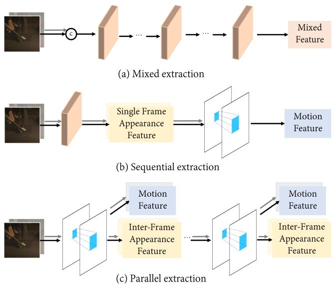
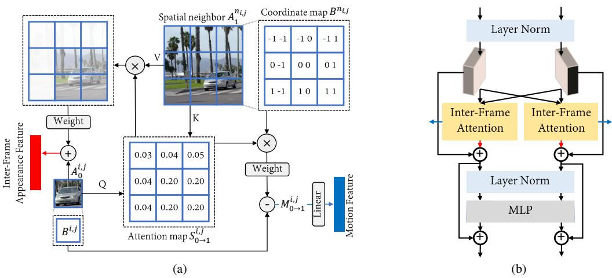
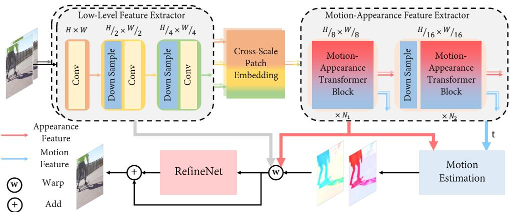
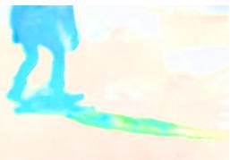
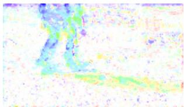
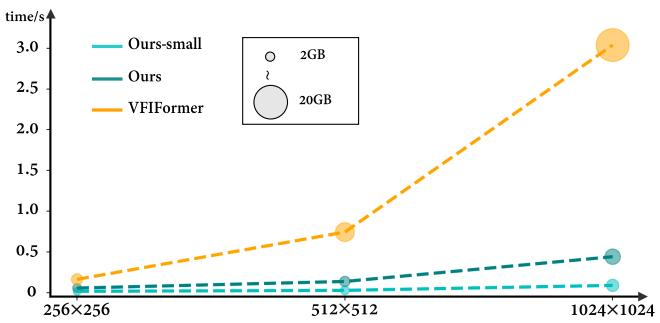
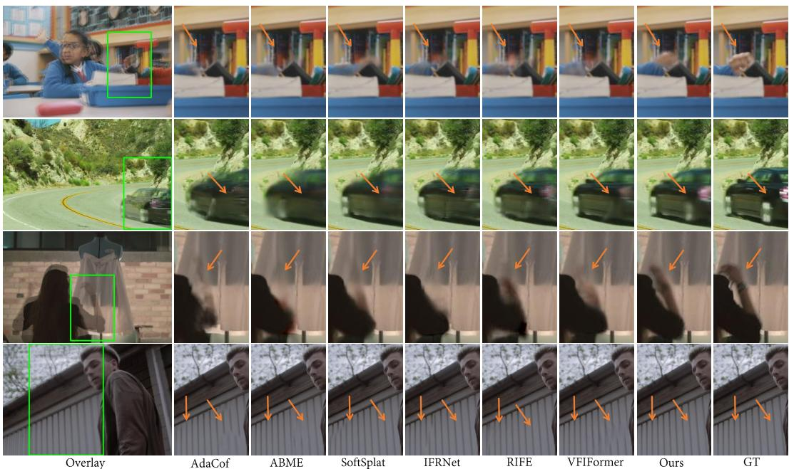
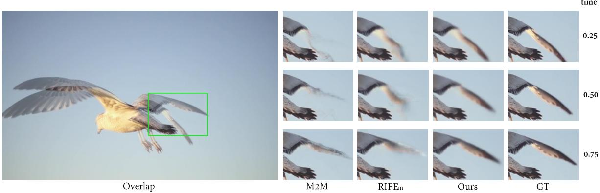

# Extracting Motion and Appearance via Inter-Frame Attention for Efficient Video Frame Interpolation

Guozhen Zhang1 Yuhan Zhu1 Haonan Wang1 Youxin Chen3 Gangshan Wu1 Limin Wang1, 2, \* 1State Key Laboratory for Novel Software Technology, Nanjing University, China 2Shanghai AI Lab, China 3Samsung Electronics (China) R&D Centre, China

## Abstract

Effectively extracting inter-frame motion and appearance information is importantfor videoframe interpolation (VFI). Previous works either extract both types of information in a mixed way or devise separate modules for each type ofinformation, which lead to representation ambiguity and low efficiency. In this paper, we propose a new module to explicitly extract motion and appearance information via a unified operation. Specifically, we rethink the information process in inter-frame attention and reuse its attention map for both appearance feature enhancement and motion information extraction. Furthermore, for efficient VFI, our proposed module could be seamlessly integrated into a hybrid CNN and Transformer architecture. This hybrid pipeline can alleviate the computational complexity of inter-frame attention as well as preserve detailed lowlevel structure information. Experimental results demonstrate that, for both fixed- and arbitrary-timestep interpolation, our method achieves state-of-the-art performance on various datasets. Meanwhile, our approach enjoys a lighter computation overhead over models with close performance. The source code and models are available at https://github.com/MCG-NJU/EMA-VFI.

## 1. Introduction

As a fundamental low-level vision task, the goal of video frame interpolation (VFI) is to generate intermediate frames given a pair of consecutive frames [17, 33]. It has a wide range of real-life applications, such as video compression [53], novel-view rending [13,47], and slow-motion video creation [19]. In general, VFI can be seen as the process of capturing the motion between consecutive frames and then blending the corresponding appearance to synthesize the intermediate frames. From this perspective, the motion and appearance information between input frames is essential for achieving excellent performance in VFI tasks.

  
Figure 1. Illustration of various approaches in video frame interpolation for acquiring motion and appearance information.

Concerning the extraction paradigm of motion and appearance information, the current VFI approaches can be divided into two categories. The first is to handle both appearance and motion information in a mixed way [2, 11, 14, 17, 20, 21, 30, 33, 37, 38, 44], as shown in Fig. 1(a). The two neighboring frames are directly concatenated and fed into a backbone composed of stacked similar modules to generate features with mixed motion and appearance information. Though simple, this approach requires an elaborate design and high capacity in the extractor module, as it needs to deal with both motion and appearance information jointly. The absence of explicit motion information also results in limitations for arbitrary-timestep interpolation. The second category, as shown in Fig. 1(b), is to design separate modules for motion and appearance information extraction [9, 18, 35, 40–42, 45, 56]. This approach requires additional modules, such as cost volume [18, 40, 41], to extract motion information, which often imposes a high computational overhead. Also, only extracting appearance features from a single frame fails to capture the correspondence of appearance information of the same regions between frames, which is an effective cue for the VFI task [18].

To address the issues of the above two extraction paradigms, in this paper, we propose to explicitly extract both motion and appearance information via a unified operation of inter-frame attention. With a single inter-frame attention, as shown in Fig. 1(c), we are able to enhance the appearance features between consecutive frames and acquire motion features at the same time by reusing the attention maps. This basic processing unit could be stacked to obtain the hierarchical motion and appearance information. Specifically, for any patch in the current frame, we take it as the query and its temporal neighbors as keys and values to derive an attention map representing their temporal correlation. After that, the attention map is leveraged to aggregate the appearance features of neighbors to contextualize the current region representation. In addition, the attention map is also used to weight the displacement of neighbors to get an approximate motion vector of the patch from the current frame to the neighbor frame. Finally, the obtained features are utilized with light networks for motion estimation and appearance refinement to synthesize intermediate frames. Compared with previous works, our design enjoys three advantages. (1) The appearance features of each frame can be enhanced with each other yet not be mixed with motion features to preserve the detailed static structure information. (2) The obtained motion features can be scaled by time and then used as cues to guide the generation of frames at any moment between input frames. (3) We only need to control the complexity and the number of modules to balance the overall performance and the inference speed.

Directly using inter-frame attention on original resolution results in huge memory usage and computational overhead. Inspired by some recent works [8, 12, 26, 49, 54, 55, 58], which combines Convolutional Neural Network (CNN) [23] with Transformer [48] to improve the model learning ability and robustness, we adopt a simple but effective architecture: first utilize CNN to extract high-resolution low-level features and then use Transformer blocks equipped with inter-frame attention to extracting low-resolution motion features and inter-frame appearance features. Our proposed module could be seamlessly integrated into this hybrid pipeline to extract motion and appearance features efficiently without losing fine-grained information. Our contributions are summarized as follows:

• We propose to utilize inter-frame attention to extract both motion and appearance information simultaneously for video frame interpolation.

• An hybrid CNN and Transformer design is adopted to overcome the overhead bottleneck of the interframe attention at high-resolution input while preserving fine-grained information.

• Our model achieves state-of-the-art performance on various datasets while being efficient compared to models with similar performance.

## 2. Related Work

## 2.1. Video Frame Interpolation

The current VFI methods can be roughly divided into two categories: mixed methods and motion-aware methods. Mixed methods tends to generate intermediate frames by directly concatenating input frames and feeding into a feature backbone to handle motion and appearance without explicit motion representation. In terms of generative approaches for the intermediate frames, these methods can be subdivided into two categories: directly-generated methods and kernel-based methods. Directly-generated methods [6, 14, 20, 30] generated intermediate frames directly end-to-end from the input frames. Kernel-based methods [4, 5, 11, 24, 37–39, 44] generated interpolated frames by learning kernels and performing local convolution on the input frames. Although these methods are relatively simple, their lack of modeling of motion makes it difficult to match the corresponding regions between intermediate frames and input frames, leading to image blur and artifacts [25]. Motion-aware methods explicitly model the motion (usually represented by optical flow) between two frames to assist in aligning the appearance information of the input frames to intermediate frames. Some early work [19, 27, 29] failed to exploit the input frames’ appearance information and only predicted inter-frame motion for pixel-level alignment. Niklaus et al. [35] first proposed to refine the aligned intermediate frames with a synthesis network utilizing the contextual features. Most of the following works [2,9,16,17,21,33,35,36,40–42,45,56] designed separate modules for explicitly motion modeling and appearance synthesis to boost the performance. Though the current state-of-the-art method [33] has achieved surpris ing performance, the increasing system complexity makes it unrealistic to apply in practice. Our proposed method also explicitly models the motion but could extract motion and appearance information in a unified and efficient way.

## 2.2. Extracting Motion and Appearance

Although it has been rarely explored in the VFI task, a considerable number of articles in the video understanding have discussed how to extract motion information and appearance information simultaneously [10, 22, 50, 51, 59]. Wang et al. [51] exploited learnable multiplicative interactions to acquire relation between frames and fuse it with appearance to generate spatiotemporal features. Zhao et al. [59] derived disentangled components of dynamics purely from raw video frames, which comprise the static appearance, apparent motion, and appearance changes. Some following works [22, 50] also improved this approach with more flexible and dynamic operations. The apparent motion in Zhao et al. [59] is conceptually the closest to the motion feature in our paper, which uses the expected displacement at each point based on a distribution over correspondences to represent motion. Compared to these methods, we are the first to exploit inter-frame attention to extract motion and appearance information directly.

  
Figure 2. (a) An example of how inter-frame attention acquires motion and inter-frame appearance features. For any region $A _ { 0 } ^ { i , j }$ in $\scriptstyle I _ { 0 } .$ , we use it as a query and the spatial neighbors $A _ { 1 } ^ { n _ { i , j } }$ in $\pmb { I } _ { 1 }$ as keys/values to generate an attention map. Then we exploit the attention map to aggregate the appearance information in $\pmb { I } _ { 1 }$ to get an inter-frame appearance representation of the query region, and meanwhile, estimate an approximate displacement of the query region between frames. (b) An illustration of Transformer blocks employing inter-frame attention. We basically follow the conventional design as [48] while maintaining the spatial-temporal structure of different frames

## 2.3. Transformer in Video Frame Interpolation

Transformer [48] has recently been widely used in different tasks of computer vision, and recent works [33, 44] also introduced this architecture into video frame interpolation to leverage the flexibility and ability to capture long-range correspondence. However, when interpolating frames for high-resolution videos, these methods required much more computation and memory overhead compared to models using CNN. Recently, some studies have shown that combining CNN with Transformers improves the performance of the model [8, 12, 26, 49, 54, 55, 58]. Inspired by these methods, our proposed model adopts a similar idea by first extracting high-resolution features using CNN and then using Transformers to capture the motion features and enhanced appearance features.

## 3. Our Method

Our goal is to generate the frame $\hat { { \cal I } } _ { t } ~ \in ~ \mathbb { R } ^ { H \times W \times 3 }$ at any arbitrary timestep $t \in \mathsf { \Gamma } ( 0 , 1 )$ given frames ${ \cal I } _ { 0 } , { \cal I } _ { 1 } \in$ $\mathbb { R } ^ { \bar { H } \times W \times 3 }$ at timestep $t = 0$ and $t = 1$ , as:

$$
\hat { { \cal I } } _ { t } = { \cal O } ( I _ { 0 } , I _ { 1 } , t ) ,\tag{1}
$$

where O is our model. In the following, we first present the process of how to exploit inter-frame attention to extract motion and inter-frame appearance features simultaneously for video frame interpolation and the structure of Transformer blocks equipped with inter-frame attention in Sec. 3.1. Next, we give a detailed description of the overall pipeline which utilizes a CNN design to overcome the heavy overhead brought by Transformer blocks while maintaining the fine-grained features in Sec. 3.2.

## 3.1. Extract Motion and Appearance Information

Capturing motion between input frames and fusing the inter-frame appearance features are critical to the VFI task. Previous methods either extract both information by directly concatenating frames and feeding into a feature backbone or elaborate complex modules respectively, e.g. ContextNet [17,35] for appearance and cost volume [40,41] for motion. In contrast, we propose to utilize inter-frame attention to extract distinguishable motion and appearance information in a unified way. Our motivation for using interframe attention lies in its ability to naturally model interframe motion and transfer appearance information at the same time.

Inter-frame Attention (IFA). An example of how interframe attention acquires motion and inter-frame appearance is shown in Fig. 2a. For the sake of brevity, here we only take the example of obtaining the motion and enhancing appearance information of $I _ { 0 }$ . Now suppose we have the appearance feature of two frames, denoted as $\pmb { A } _ { 0 }$ and $\mathbf { A } _ { 1 } ~ \in ~ \mathbb { R } ^ { \hat { H } \times \hat { W } \times C }$ . For any region, which is denoted as $A _ { 0 } ^ { i , j } ~ \in ~ \mathbb { R } ^ { C }$ in $I _ { 0 } ,$ we use it and its spatial neighbors $A _ { 1 } ^ { n _ { i } , j } \in \mathbb { R } ^ { N \times N \times C }$ in $\pmb { I } _ { 1 }$ , where N represents the neighborhood window size, to generate the query and keys/values

  
Figure 3. Overview of our proposed architecture. First, a low-level feature extractor composed of hierarchical convolutional layers is used to generate multi-scale fine-grained features and also reduce the input size of the Transformer for efficiency. These fine-grained features are then fused by a cross-scale path embedding for enhancing detailed information and fed into the proposed motion-appearance feature extractor to acquire motion and appearance features. Finally, the motion feature and the appearance feature are used for motion estimation and appearance refinement.

respectively:

$$
Q _ { \bf 0 } ^ { i , j } = A _ { 0 } ^ { i , j } W _ { Q } ~ ,\tag{2}
$$

$$
K _ { 1 } ^ { n _ { i } , { j } } = A _ { 1 } ^ { n _ { i } , { j } } W _ { K } ,\tag{3}
$$

$$
\begin{array} { r } { V _ { 1 } ^ { n _ { i , j } } = A _ { 1 } ^ { n _ { i , j } } W _ { V } ~ , } \end{array}\tag{4}
$$

where $W _ { Q } , W _ { K } , W _ { V } \in \mathbb { R } ^ { C \times \hat { C } }$ are linear projection matrices. Then we make a dot product between $Q _ { \mathbf { 0 } } ^ { i , j }$ and each position of $K _ { 1 } ^ { n _ { i , j } }$ and then apply SoftMax following [48] to generate the attention map $S _ { 0  1 } ^ { i , j } \in \mathbb { R } ^ { N \times N }$ , where the value at each location represents the degree of similarity between $A _ { 0 } ^ { i , j }$ and its neighbors, as:

$$
\begin{array} { r } { S _ { \boldsymbol { 0 }  1 } ^ { i , j } = \mathrm { S o f t M a x } ( Q _ { \boldsymbol { 0 } } ^ { i , j } ( K _ { 1 } ^ { n _ { i , j } } ) ^ { \mathrm { T } } / \sqrt { \hat { C } } ) \ . } \end{array}\tag{5}
$$

The obtained $S _ { 0  1 } ^ { i , j }$ can be utilized to transform the appearance information and extract motion information simultaneously. As for appearance, we first aggregate the similar appearance information from $I _ { 1 }$ and then fuse it with $A _ { 0 } ^ { i , j }$ to enhance the appearance information in $I _ { 0 }$ , as:

$$
\hat { A } _ { 0 } ^ { i , j } = A _ { 0 } ^ { i , j } + S _ { 0  1 } ^ { i , j } V _ { 1 } ^ { n _ { i , j } } \ .\tag{6}
$$

The enhanced appearance feature $\hat { A } _ { 0 } ^ { i , j }$ contains the blending of the appearance of the similar region in two different frames, which can provide more information on how the appearance is transformed between frames for generating intermediate frames.

As for motion, we first create a coordinate map $\textbf { \textit { B } } \in$ $\mathbb { R } ^ { \hat { H } \times \hat { W } \times 2 }$ in which the value at each location indicates the relative position in the entire image ((-1,-1) in the top-left and (1,1) in the bottom-right), as shown in Fig. 2(a). Then we weight the neighbors’ coordinates to estimate the approximate corresponding position of $A _ { 0 } ^ { i , j }$ in $\pmb { I } _ { 1 }$ . The motion vector $M _ { 0 \to 1 } ^ { i , j } \in \mathbb { R } ^ { 2 }$ of $A _ { 0 } ^ { i , j }$ can be then generated by

  
Estimated Flow $F _ { t  0 }$

  
Motion Vector $M _ { 1  t }$

Figure 4. Visualization of the estimated flow and motion vector. subtracting between the original position of $A _ { 0 } ^ { i , j }$ and the estimated position in $\pmb { I } _ { 1 }$ , as:

$$
M _ { 0  1 } ^ { i , j } = S _ { 0  1 } ^ { i , j } B ^ { n _ { i , j } } - B ^ { i , j } \ .\tag{7}
$$

$M _ { 0 \to 1 } ^ { i , j }$ contains motion information that can provide an explicit prior for motion estimation. The motion feature is then generated by passing $M _ { 0  1 } ^ { i , j }$ through a linear layer. It is worth noting that under the assumption of local linear motion, we can approximate the motion vector from $I _ { 0 }$ to $\mathbf { } I _ { t }$ by multiplying $\bar { M } _ { 0 \to 1 } ^ { i , j }$ with t, as:

$$
M _ { 0 \to t } ^ { i , j } = t \times M _ { 0 \to 1 } ^ { i , j } .\tag{8}
$$

In this way, $M _ { 0  t } ^ { i , j }$ can be used as cues to guide the following motion estimation for arbitrary timestep frame prediction with only calculating $M _ { 0  1 } ^ { i , j }$ once. Note that the appearance features $\hat { A } _ { 0 } ^ { i , j }$ is also timestep-irrelevant and hence the inter-frame attention only needs to be calculated once for multiple arbitrary timestep frame predictions.

Discussion. To demonstrate that the similarity of the same regions between frames can be captured by inter-frame attention, we compare the optical flow estimated by our trained model with the obtained motion vector. As shown in Fig. 4, motion vectors indeed maintain a high degree of consistency with the predicted optical flow despite the presence of minor noise, which implies that IFA does have the ability to discriminate different regions and $M _ { t }$ can provide a strong prior for motion estimation. More quantitative support is provided in Sec. 4.4.

Structure of Transformer blocks. We incorporate the inter-frame attention into the Transformer block because it has been proven to be effective in many vision tasks. As in Fig. 2b, we basically follow the original Transformer design [48] but modify it for the VFI task in two points: (1) We maintain the spatiotemporal structure of the different frames to perform IFA for extracting distinguishable features. (2) To accommodate different sizes of input frames and enhance the interaction between different regions in the same frame, we perform a similar strategy to [7, 52], in which we remove the original position encoding and replace it with a depth-wise convolution in the MLP.

## 3.2. Overall Pipeline

Our overall pipeline is illustrated in Fig. 3. Since the resolution of input frames could be very high, directly performing inter-frame attention on the original size would bring huge memory usage and computation overhead. Inspired by some recent works [49, 54, 55], we first utilize hierarchical convolutional layers as the low-level feature extractor to generate multi-scale appearance features, as:

$$
\pmb { L } _ { i } ^ { 0 } , \pmb { L } _ { i } ^ { 1 } , \pmb { L } _ { i } ^ { 2 } = \mathcal { F } ( \pmb { I } _ { i } ) ~ ,\tag{9}
$$

where $\mathcal { F }$ represents the low-level feature extractor and $\pmb { L } _ { i } ^ { k }$ represents the appearance feature of i-th frame with the shape $\begin{array} { r } { \frac { H } { 2 ^ { k } } \times \frac { W } { 2 ^ { k } } \times 2 ^ { k } C } \end{array}$ The number of channels $C$ would be doubled each time the feature size reduces. Though this hybrid CNN and Transformer design could relieve the overhead, it also lacks fine-grained information when inputting into Transformer. To alleviate this problem, we reuse the low-level features extracted by CNNs to complement the cross-scale information. Specifically, we propose to use the multi-scale dilated convolution [57] to fuse the information together. For the low-level feature with the shape $\begin{array} { r } { \frac { H } { 2 ^ { k } } \times \frac { W } { 2 ^ { k } } \times 2 ^ { k } C } \end{array}$ , we apply dilated convolutions with stride $2 ^ { 3 - k }$ and dilation from 1 to $2 ^ { 2 - k }$ . Then we concatenate all the acquired features together and fuse them with a linear layer to obtain the cross-scale appearance feature of the i-th frame $C _ { i } .$ . In this way, we can provide fine-grained features for the following Transformer blocks.

Afterward, $C _ { 0 }$ and $C _ { 1 }$ are fed into the hierarchical motion-appearance feature extractor composed of the Transformer blocks containing the inter-frame attention to extract motion features M and inter-frame appearance features $A _ { i }$ . Following the recent motion-aware methods [17, 21, 33, 41], we first utilize the acquired motion and appearance feature to estimate the bidirectional optical flows F and masks $^ { o , }$ then we use them to warp the inputs frame to t and fuse together, as:

$$
\begin{array} { r } { \tilde { I } _ { t } = O \odot \mathrm { B W } ( I _ { 0 } , F _ { t  0 } ) + ( 1 - O ) \odot \mathrm { B W } ( I _ { 1 } , F _ { t  1 } ) , } \\ { ( 1 0 ) } \end{array}
$$

where BW is the backward warp operation [17] and ⊙ represents the Hadamard product. Finally, we further exploit the low-level features $\pmb { L }$ and inter-frame appearance features A to refine the appearance of the fused frame $\tilde { I } _ { t }$ by the RefineNet:

$$
\hat { \cal I } _ { t } = \tilde { \cal I } _ { t } + \mathrm { R e f i n e N e t } \left( \tilde { \cal I } _ { t } , { \cal L } , { \cal A } \right) \ .\tag{11}
$$

Since the motion and appearance features already have enough information, only three convolution layers for estimating motion and a simplified U-Net [43] for the RefineNet are enough for excellent performance. The details of motion estimation and the RefineNet are provided in the supplementary materials.

## 4. Experiments

## 4.1. Datasets

Our model is evaluated on various datasets: 1) Vimeo90K [56], which is composed of two subsets with a fixed resolution of 448 × 256, namely the Triplet and Septuplet datasets. 2) UCF101 [46], which is related to human actions and contains 379 triplets with a resolution of 256 × 256. 3) Middlebury [1], we use the OTHER set in Middlebury for testing, which contains images with a resolution around 640 × 480. 4) SNU-FILM [6], it contains 1,240 triplets with 1280x720 resolution, and is divided into four subsets with different levels of difficulty: Easy, Medium, Hard, and Extreme. 5) Xiph [34], following [36], we downsample and center-corp the original image to 2K resolution to get “Xiph-2K” and “Xiph-4K”. 6) HD [3], it contains 11 videos at three different resolutions of 544p, 720p and 1080p, and we follow the procedure of [17] to test arbitrary-timestep frame synthesis. 7) X4K1000FPS [45], it is a 4K dataset proposed by [45]. We follow the test procedure of [15], performing arbitrary-timestep frame synthesis testing under both 4K and downsampled 2K resolutions.

## 4.2. Implementation Details

Model Configuration. To show the scalable capability of our proposed module, we present two versions of our model: a computation-friendly small model (Ours-small) and a larger but more accurate model (Ours). For the small model, the number of Transformer blocks at each stage $( N _ { 1 }$ and $N _ { 2 }$ in Fig. 3) is 2 and the initial channel number C is 16. For the larger model, those are 4 and 32 respectively. We choose shifted window attention [28] as the inter-frame attention and the window size is set to 7. The remaining structures stay the same for both models. Following [17], we apply the test-time argument to boost the performance of the larger model. The original performance is provided in the ablation study.

Table 1. Quantitative comparison among different benchmarks (IE on Middlebury, PSNR/SSIM on other datasets). The best result and the second best are boldfaced and underlined respectively. “Out of Memory” is denoted as “OOM”, and $" \big < \big >$ in “Extra” implies extra pretrained models are used for training. “†” indicates the results obtained by ourselves, the rest of the results are copied from [15,17,21,33,42]. We use the V100 GPU for testing and follow the test procedure of [17] on Vimeo90K/UCF101/Middlebury, [36] on Xiph, [21] on SNU FILM, respectively. Note that we retested M2M on Xiph in order to be consistent with the procedure of [36] for a fair comparison.
<table><tr><td rowspan="2">Method</td><td rowspan="2">Extra</td><td rowspan="2">Vimeo90K</td><td rowspan="2">UCF101</td><td colspan="2"> $\mathrm { X i p h }$ </td><td rowspan="2">M.B.</td><td colspan="4">SNU-FILM</td></tr><tr><td>2K</td><td>4K</td><td>Easy</td><td>Medium</td><td>Hard</td><td>Extreme</td></tr><tr><td colspan="2">Two-Stage Training</td><td></td><td></td><td></td><td></td><td></td><td></td><td></td><td></td><td></td></tr><tr><td>BMBC [40]</td><td></td><td>35.01/0.9764</td><td>35.15/0.9689</td><td>32.82/0.928</td><td>31.19/0.880</td><td>2.04</td><td>39.90/0.9902</td><td>35.31/0.9774</td><td>29.33/0.9270</td><td>23.92/0.8432</td></tr><tr><td>ABME [41]</td><td></td><td>36.18/0.9805</td><td>35.38/0.9698</td><td>36.53/0.944</td><td>33.73/0.901</td><td>2.01</td><td>39.59/0.9901</td><td>35.77/0.9789</td><td>30.58/0.9364</td><td>25.42/0.8639</td></tr><tr><td>VFIFormer [33]</td><td></td><td>36.50/0.9816</td><td>35.43/0.9700</td><td>00M†</td><td>00M†</td><td>1.82</td><td>40.13/0.9907</td><td>36.09/0.9799</td><td>30.67/0.9378</td><td>25.43/0.8643</td></tr><tr><td colspan="2">Single-Stage Training</td><td></td><td></td><td></td><td></td><td></td><td></td><td></td><td></td><td></td></tr><tr><td>ToFlow [1]</td><td></td><td>33.73/0.9682</td><td>34.58/0.9667</td><td>33.93/0.922</td><td>30.74/0.856</td><td>2.15</td><td>39.08/0.9890</td><td>34.39/0.9740</td><td>28.44/0.9180</td><td>23.39/0.8310</td></tr><tr><td>SepConv [37]</td><td></td><td>33.79/0.9702</td><td>34.78/0.9669</td><td>34.77/0.929</td><td>32.06/0.880</td><td>2.27</td><td>39.41/0.9900</td><td>34.97/0.9762</td><td>29.36/0.9253</td><td>24.31/0.8448</td></tr><tr><td>DAIN [2]</td><td>√</td><td>34.71/0.9756</td><td>34.99/0.9683</td><td>35.95/0.940</td><td>33.49/0.895</td><td>2.04</td><td>39.73/0.9902</td><td>35.46/0.9780</td><td>30.17/0.9335</td><td>25.09/0.8584</td></tr><tr><td>AdaCoF [24]</td><td></td><td>34.47/0.9730</td><td>34.90/0.9680</td><td>34.86/0.928</td><td>31.68/0.870</td><td>2.24</td><td>39.80/0.9900</td><td>35.05/0.9754</td><td>29.46/0.9244</td><td>24.31/0.8439</td></tr><tr><td>CAIN [6]</td><td></td><td>34.65/0.9730</td><td>34.91/0.9690</td><td>35.21/0.937</td><td>32.56/0.901</td><td>2.28</td><td>39.89/0.9900</td><td>35.61/0.9776</td><td>29.90/0.9292</td><td>24.78/0.8507</td></tr><tr><td>SoftSplat [36]</td><td>√</td><td>36.10/0.9802</td><td>35.39/0.9697</td><td>36.62/0.944</td><td>33.60/0.901</td><td>1.81</td><td></td><td></td><td></td><td></td></tr><tr><td>M2M [15]</td><td>√</td><td>35.47/0.9778</td><td>35.28/0.9694</td><td>36.44/0.943†</td><td>33.92/0.899†</td><td>2.09†</td><td>39.66/0.9904†</td><td>35.74/0.9794†</td><td>30.30/0.9360†</td><td>25.08/0.8604†</td></tr><tr><td>IFRNet [21]</td><td>√</td><td>35.80/0.9794</td><td>35.29/0.9693</td><td>36.00/0.936†</td><td>33.99/0.893†</td><td>1.95</td><td>40.03/0.9905</td><td>35.94/0.9793</td><td>30.41/0.9358</td><td>25.05/0.8587</td></tr><tr><td>RIFE [17]</td><td></td><td>35.61/0.9779</td><td>35.28/0.9690</td><td>36.19/0.938†</td><td>33.76/0.894†</td><td>1.96</td><td>39.80/0.9903†</td><td>35.76/0.9787†</td><td>30.36/0.9351†</td><td>25.27/0.8601†</td></tr><tr><td>Ours-small</td><td></td><td>36.07/0.9797</td><td>35.34/0.9696</td><td>36.55/0.942</td><td>34.25/0.902</td><td>1.94</td><td>39.81/0.9906</td><td>35.88/0.9795</td><td>30.69/0.9375</td><td>25.47/0.8632</td></tr><tr><td>Ours</td><td></td><td>36.64/0.9819</td><td>35.48/0.9701</td><td>36.90/0.945</td><td>34.67/0.907</td><td>1.81</td><td>39.98/0.9910</td><td>36.09/0.9801</td><td>30.94/0.9392</td><td>25.69/0.8661</td></tr></table>

  
Figure 5. Comparison between our models and VFIFormer in terms of speed and memory usage at different input resolutions.

Training Details. For fixed-timestep frame interpolation, we train our models on the triplet set of Vimeo90K [56], in which $t ~ = ~ 0 . 5$ We crop each frame to 256 × 256 patches and perform the random flip, time reversal, and rotation argumentation. The training batch size is set to 32. We choose AdamW [32] as the optimizer with $\beta _ { 1 } = 0 . 9$ $\beta _ { 2 } = 0 . 9 9 9$ and weight decay $1 e ^ { - 4 }$ . We first warm up for 2000 steps to increase the learning rate to $2 e ^ { - 4 }$ and then utilize cosine annealing [31] for 300 epochs to reduce the learning rate from $2 e ^ { - 4 }$ to $2 e ^ { - 5 }$ For arbitrary-timestep frame interpolation, we follow the same training procedure of [17], which randomly selects 3 frames from septuplet of Vimeo90K and calculated corresponding t. There is no change in the remaining settings. The training loss basically follows [17,36], which is included in the supplementary file.

Table 2. Quantitative comparison for 4× interpolation on HD and 8× interpolation on XTest. We follow the test procedure of [17] on HD and [15] on XTest. All notations are consistent with Tab. 1. All results except those marked with “†” are extracted from [15, 17].
<table><tr><td>Method</td><td>HD(544p)</td><td>HD(720p)</td><td>HD(1080p)</td><td>XTest-2K</td><td>XTest-4K</td></tr><tr><td>DAIN [2]</td><td>22.17</td><td>30.25</td><td></td><td>29.33</td><td>26.78</td></tr><tr><td>CAIN [6]</td><td>21.81</td><td>31.59</td><td>31.08</td><td>23.62</td><td>22.51</td></tr><tr><td>ABME [41]</td><td>22.46</td><td>31.43</td><td>33.22</td><td>30.65</td><td>30.16</td></tr><tr><td>RIFEm [17]</td><td>22.95</td><td>31.87</td><td>34.25</td><td>31.43†</td><td>30.58</td></tr><tr><td>IFRNet [21]</td><td>22.01†</td><td>31.85†</td><td>33.19†</td><td>31.53†</td><td>30.46†</td></tr><tr><td>M2M [15]</td><td>22.31†</td><td>31.94†</td><td>33.45†</td><td>32.13</td><td>30.88</td></tr><tr><td>Ours-small</td><td>23.26</td><td>32.17</td><td>34.65</td><td>31.89</td><td>30.89</td></tr><tr><td>Ours</td><td>23.62</td><td>32.38</td><td>35.28</td><td>32.85</td><td>31.46</td></tr></table>

## 4.3. Comparison with the State-of-the-Art Methods

To inspect the generalization ability of our proposed methods, we evaluate our model on diverse datasets and compared results with recent VFI approaches, which include: ToFlow [1], SepConv [37], AdaCoF [24], CAIN [6], DAIN [2], BMBC [40], ABME [41], IFRNet [21], RIFE [17], SoftSplat [36], and VFIFormer [33].

Fixed Timestep Interpolation. Tab. 1 shows the results of fixed timestep interpolation (t = 0.5) on various datasets. Our approach achieves state-of-the-art performance on almost all test sets except for the Easy set of SNU-FILM, which we attribute the reason to the fact that we did not apply inter-frame attention to the high-resolution features for a balance between performance and speed. As shown in Fig. 5, as the input size increases, compared to the previous SOTA model, VFIFormer, our model dominates in terms of speed and memory usage, and still maintains better performance. Remarkably, our method has a more significant improvement on large motion datasets. Compared to the previous SOTA, our method has 0.28 dB and 0.68 dB improvements on the 2K and 4K sets of Xiph respectively as well as 0.27 dB and 0.26 dB improvements on Hard and Extreme sets of SNU-FILM respectively.

  
Figure 6. Visual comparison on Vimeo90K [56] triplet set. The position pointed by the arrow indicates where our model performs better.

Table 3. Ablation on the inter-frame attention. We use “SFA” to denote the single frame attention which only applies self-attention within a single frame, “Mixed” to denote the attention conducted within two frames together, and “BCV” to denote the bilateral cost volume proposed by [40].
<table><tr><td>Appearance</td><td>Motion</td><td>Vimeo90K</td><td>Xiph-2K</td><td>Xiph-4K</td><td>Runtime</td></tr><tr><td>SFA</td><td>x</td><td>35.54/0.977</td><td>36.26/0.939</td><td>33.36/0.895</td><td>26ms</td></tr><tr><td>IFA</td><td>X</td><td>36.02/0.980</td><td>36.49/0.942</td><td>34.20/0.902</td><td>27ms</td></tr><tr><td>Mixed</td><td></td><td>35.54/0.978</td><td>35.98/0.939</td><td>33.88/0.899</td><td>26ms</td></tr><tr><td>SFA</td><td>BCV</td><td>35.70/0.978</td><td>36.22/0.939</td><td>33.34/0.895</td><td>297ms</td></tr><tr><td>IFA</td><td>IFA</td><td>36.07/0.980</td><td>36.55/0.942</td><td>34.25/0.902</td><td>30ms</td></tr></table>

Arbitrary Timestep Interpolation. Following [17], we provide the results of multiple frame interpolation on HD benchmark [3] and X4K1000FPS [45], as shown in Tab. 2. Thanks to the explicit motion features that can be used as cues for arbitrary-timestep interpolation, our approaches achieve the best performance on all the test datasets.

Qualitative Comparison. To underpin our quantitative results, we also give visual comparisons between our approaches and other VFI methods in intermediate and multiframe generation respectively. As shown in Fig. 6, compared to other methods, our model provides a superior estimation of the corresponding location of objects in the intermediate frames in the case of large motions and more favorable maintenance of texture information. Our model also exhibits better temporal consistency for complex motions in

Table 4. Ablation on motion cues for arbitrary-timestep interpolation. “M ” indicates that motion features is used as cues and “+t” denotes directly input t as cues.
<table><tr><td>Cues</td><td>HD(720p)</td><td>XTest-2K</td><td>XTest-4K</td><td>Runtime</td></tr><tr><td>+t</td><td>32.05</td><td>31.71</td><td>30.63</td><td>27ms</td></tr><tr><td>Mt</td><td>32.17</td><td>31.89</td><td>30.89</td><td>30ms</td></tr></table>

the multi-frame interpolation case, as shown in Fig. 7.

## 4.4. Ablation Study

In this section, we use the small model (Ours-small) as the baseline to conduct ablation studies for investigating our proposed modules. The training settings are the same as Sec. 4.2 and we provide the test results of Vimeo90K and Xiph in order to observe the performance on both smalland large-motion datasets. We uniformly measure the time of processing a pair of 480p (640 × 480) inputs for each model on the same device (2080Ti), denoted as runtime.

Effect of the Inter-Frame Attention. As the core operation of our proposed model, inter-frame attention (IFA) can enhance the appearance information of each frame and extract bilateral motion information simultaneously. To verify its effectiveness, we replace IFA with different forms of attention as well as cost volume to extract appearance and motion information. As shown in Tab. 3, when using only appearance information, the enhanced inter-frame appearance feature outperforms the single-frame appearance feature substantially. When both appearance and motion information are used, our performance is further enhanced with only a slight increase in runtime.

Motion Cues for Arbitrary-Timestep Interpolation. We use the motion feature extracted by inter-frame attention as the trigger to predict arbitrary timestep frames. To verify its effectiveness, we compare it with the previous approaches which directly concatenate t into the appearance feature as motion cues. As shown in Tab. 4, using motion features as cues achieves better results on multiple datasets and maintains almost the same inference time.

  
Figure 7. Visual comparison for multi-timestep generation selected from SNU-FILM [6].

Table 5. Ablation on the scalable capability of Transformer blocks.
<table><tr><td>N1/N2</td><td>C</td><td>Vimeo90K</td><td>Xiph-2K</td><td>Xiph-4K</td><td>Runtime</td></tr><tr><td>2/2</td><td>16</td><td>36.07/0.980</td><td>36.55/0.942</td><td>34.25/0.902</td><td>30ms</td></tr><tr><td>4/4</td><td>16</td><td>36.21/0.980</td><td>36.61/0.943</td><td>34.31/0.902</td><td>39ms</td></tr><tr><td>2/2</td><td>32</td><td>36.43/0.981</td><td>36.70/0.943</td><td>34.51/0.905</td><td>66ms</td></tr><tr><td>4/4</td><td>32</td><td>36.50/0.981</td><td>36.74/0.944</td><td>34.55/0.906</td><td>78ms</td></tr></table>

Scalable Capability of Transformer Blocks. As we mentioned before, the overall performance of the model can be controlled by simply adjusting the number and complexity of Transformer blocks. To confirm this, we double the number of Transformer blocks or their channels. As shown in Tab. 5, both modifications improve the performance considerably. Since the increase in model complexity caused by the double of channel numbers is greater, the performance improvement is also relatively more noticeable.

Explore the Balance between Performance and Efficiency. To alleviate the computational burden caused by Transformers, we adopt a hybrid CNNs/Transformers design. To explore the performance bounds, we replace the Transformer with CNNs or vice versa. As shown in Tab. 6, using the Transformer only on the lowest scale features will significantly degrade the model’s performance, and using it at higher scales will not improve the performance much while the computational overhead increases considerably.

## 5. Limitations and Future Work

Though a nontrivial improvement has been achieved by our proposed methods, there are still some limitations worth exploring. First, despite the fact that the hybrid CNN and Transformer could relieve computational overhead, they also restrict motion extraction by inter-frame attention within high-resolution appearance features. Second, the input of our methods is restricted to two consecutive frames, which results in the inability to leverage information from multiple consecutive frames. In future work, we will attempt to extend our approach to multi-frame inputs without introducing excessive overhead. Meanwhile, we will also investigate how to utilize inter-frame attention in other fields that also need those two types of information, such as action recognition and action detection.

Table 6. Ablation on different hybrid CNNs/Transformers designs. “C” or “T” denotes we apply convolutional layers or Transformer blocks at the corresponding stage.
<table><tr><td>Architecture</td><td>Vimeo90K</td><td>Xiph-2K</td><td>Xiph-4K</td><td>Runtime</td></tr><tr><td>C-C-C-C-T</td><td>35.26/0.974</td><td>34.43/0.922</td><td>31.44/0.868</td><td>21ms</td></tr><tr><td>C-C-C-T-T</td><td>36.07/0.980</td><td>36.55/0.942</td><td>34.25/0.902</td><td>30ms</td></tr><tr><td>C-C-T-T-T</td><td>36.10/0.980</td><td>36.58/0.943</td><td>34.29/0.903</td><td>44ms</td></tr></table>

## 6. Conclusion

In this work, we have proposed to exploit inter-frame attention for extracting motion and appearance information in video frame interpolation. In particular, we utilize the correlation information hidden within the attention map to simultaneously enhance the appearance information and model motion. Meanwhile, we devised a hybrid CNN and Transformer framework to achieve a better trade-off between performance and efficiency. Experiment results show that our proposed module achieves state-of-the-art performance on both fixed- and arbitrary-timestep interpolation and enjoys effectiveness compared with the previous methods.

Acknowledgements. Thanks to the equal contributions of Yuhan Zhu and Haonan Wang. This work is supported by the National Key R&D Program of China (No. 2022ZD0160900), the National Natural Science Foundation of China (No. 62076119, No. 61921006, No. 62072232), the Fundamental Research Funds for the Central Universities (No. 020214380091), and the Collaborative Innovation Center of Novel Software Technology and Industrialization.

## References

[1] Simon Baker, Daniel Scharstein, JP Lewis, Stefan Roth, Michael J Black, and Richard Szeliski. A database and evaluation methodology for optical flow. International Journal ofComputer Vision, 92(1):1–31, 2011. 5, 6

[2] Wenbo Bao, Wei-Sheng Lai, Chao Ma, Xiaoyun Zhang, Zhiyong Gao, and Ming-Hsuan Yang. Depth-aware video frame interpolation. In Proceedings of the IEEE/CVF Conference on Computer Vision and Pattern Recognition, pages 3703–3712, 2019. 1, 2, 6

[3] Wenbo Bao, Wei-Sheng Lai, Xiaoyun Zhang, Zhiyong Gao, and Ming-Hsuan Yang. Memc-net: Motion estimation and motion compensation driven neural network for video interpolation and enhancement. IEEE Transactions on Pattern Analysis and Machine Intelligence, 43(3):933–948, 2019. 5, 7

[4] Xianhang Cheng and Zhenzhong Chen. Video frame interpolation via deformable separable convolution. In Proceedings ofthe AAAI Conference on Artificial Intelligence, volume 34, pages 10607–10614, 2020. 2

[5] Xianhang Cheng and Zhenzhong Chen. Multiple video frame interpolation via enhanced deformable separable convolution. IEEE Transactions on Pattern Analysis and Machine Intelligence, 2021. 2

[6] Myungsub Choi, Heewon Kim, Bohyung Han, Ning Xu, and Kyoung Mu Lee. Channel attention is all you need for video frame interpolation. In Proceedings ofthe AAAI Conference on Artificial Intelligence, volume 34, pages 10663–10671, 2020. 2, 5, 6, 8

[7] Xiangxiang Chu, Zhi Tian, Bo Zhang, Xinlong Wang, Xiaolin Wei, Huaxia Xia, and Chunhua Shen. Conditional positional encodings for vision transformers. arXiv preprint arXiv:2102.10882, 2021. 5

[8] Zihang Dai, Hanxiao Liu, Quoc V Le, and Mingxing Tan. Coatnet: Marrying convolution and attention for all data sizes. Advances in Neural Information Processing Systems, 34:3965–3977, 2021. 2, 3

[9] Duolikun Danier, Fan Zhang, and David Bull. St-mfnet: A spatio-temporal multi-flow network for frame interpolation. In Proceedings of the IEEE/CVF Conference on Computer Vision and Pattern Recognition, pages 3521–3531, 2022. 1, 2

[10] Ali Diba, Mohsen Fayyaz, Vivek Sharma, M Mahdi Arzani, Rahman Yousefzadeh, Juergen Gall, and Luc Van Gool. Spatio-temporal channel correlation networks for action classification. In Proceedings of the European Conference on Computer Vision, pages 284–299, 2018. 2

[11] Tianyu Ding, Luming Liang, Zhihui Zhu, and Ilya Zharkov. Cdfi: Compression-driven network design for frame interpolation. In Proceedings ofthe IEEE/CVF Conference on Computer Vision and Pattern Recognition, pages 8001–8011, 2021. 1, 2

[12] Stephane d’Ascoli, Hugo Touvron, Matthew L Leavitt, Ari S´ Morcos, Giulio Biroli, and Levent Sagun. Convit: Improving vision transformers with soft convolutional inductive biases. In International Conference on Machine Learning, pages 2286–2296. PMLR, 2021. 2, 3

[13] John Flynn, Ivan Neulander, James Philbin, and Noah Snavely. Deepstereo: Learning to predict new views from the world’s imagery. In Proceedings ofthe IEEE Conference on Computer Vision and Pattern Recognition, pages 5515– 5524, 2016. 1

[14] Shurui Gui, Chaoyue Wang, Qihua Chen, and Dacheng Tao. Featureflow: Robust video interpolation via structure-totexture generation. In Proceedings of the IEEE/CVF Conference on Computer Vision and Pattern Recognition, pages 14004–14013, 2020. 1, 2

[15] Ping Hu, Simon Niklaus, Stan Sclaroff, and Kate Saenko. Many-to-many splatting for efficient video frame interpolation. In Proceedings of the IEEE/CVF Conference on Computer Vision and Pattern Recognition, pages 3553–3562, 2022. 5, 6

[16] Xiaotao Hu, Zhewei Huang, Ailin Huang, Jun Xu, and Shuchang Zhou. A dynamic multi-scale voxel flow network for video prediction. In Proceedings of the IEEE/CVF Conference on Computer Vision and Pattern Recognition (CVPR), 2023. 2

[17] Zhewei Huang, Tianyuan Zhang, Wen Heng, Boxin Shi, and Shuchang Zhou. Rife: Real-time intermediate flow estimation for video frame interpolation. arXiv preprint arXiv:2011.06294, 2020. 1, 2, 3, 5, 6, 7

[18] Zhaoyang Jia, Yan Lu, and Houqiang Li. Neighbor correspondence matching for flow-based video frame synthesis. In Proceedings of the 30th ACM International Conference on Multimedia, pages 5389–5397, 2022. 1, 2

[19] Huaizu Jiang, Deqing Sun, Varun Jampani, Ming-Hsuan Yang, Erik Learned-Miller, and Jan Kautz. Super slomo: High quality estimation of multiple intermediate frames for video interpolation. In Proceedings of the IEEE Conference on Computer Vision and Pattern Recognition, pages 9000– 9008, 2018. 1, 2

[20] Tarun Kalluri, Deepak Pathak, Manmohan Chandraker, and Du Tran. Flavr: Flow-agnostic video representations for fast frame interpolation. arXiv preprint arXiv:2012.08512, 2020. 1, 2

[21] Lingtong Kong, Boyuan Jiang, Donghao Luo, Wenqing Chu, Xiaoming Huang, Ying Tai, Chengjie Wang, and Jie Yang. Ifrnet: Intermediate feature refine network for efficient frame interpolation. In Proceedings of the IEEE/CVF Conference on Computer Vision and Pattern Recognition, pages 1969– 1978, 2022. 1, 2, 5, 6

[22] Heeseung Kwon, Manjin Kim, Suha Kwak, and Minsu Cho. Motionsqueeze: Neural motion feature learning for video understanding. In European Conference on Computer Vision, pages 345–362. Springer, 2020. 2, 3

[23] Yann LeCun, Bernhard Boser, John Denker, Donnie Henderson, Richard Howard, Wayne Hubbard, and Lawrence Jackel. Handwritten digit recognition with a backpropagation network. Advances in neural information processing systems, 2, 1989. 2

[24] Hyeongmin Lee, Taeoh Kim, Tae-young Chung, Daehyun Pak, Yuseok Ban, and Sangyoun Lee. Adacof: Adaptive collaboration of flows for video frame interpolation. In Proceedings of the IEEE/CVF Conference on Computer Vision and Pattern Recognition, pages 5316–5325, 2020. 2, 6

[25] Sungho Lee, Narae Choi, and Woong Il Choi. Enhanced correlation matching based video frame interpolation. In Proceedings of the IEEE/CVF Winter Conference on Applications of Computer Vision, pages 2839–2847, 2022. 2

[26] Yawei Li, Kai Zhang, Jiezhang Cao, Radu Timofte, and Luc Van Gool. Localvit: Bringing locality to vision transformers. arXiv preprint arXiv:2104.05707, 2021. 2, 3

[27] Yu-Lun Liu, Yi-Tung Liao, Yen-Yu Lin, and Yung-Yu Chuang. Deep video frame interpolation using cyclic frame generation. In Proceedings of the AAAI Conference on Artificial Intelligence, volume 33, pages 8794–8802, 2019. 2

[28] Ze Liu, Yutong Lin, Yue Cao, Han Hu, Yixuan Wei, Zheng Zhang, Stephen Lin, and Baining Guo. Swin transformer: Hierarchical vision transformer using shifted windows. In Proceedings of the IEEE/CVF International Conference on Computer Vision, pages 10012–10022, 2021. 5

[29] Ziwei Liu, Raymond A Yeh, Xiaoou Tang, Yiming Liu, and Aseem Agarwala. Video frame synthesis using deep voxel flow. In Proceedings of the IEEE International Conference on Computer Vision, pages 4463–4471, 2017. 2

[30] Gucan Long, Laurent Kneip, Jose M Alvarez, Hongdong Li, Xiaohu Zhang, and Qifeng Yu. Learning image matching by simply watching video. In European Conference on Computer Vision, pages 434–450. Springer, 2016. 1, 2

[31] Ilya Loshchilov and Frank Hutter. Sgdr: Stochastic gradient descent with warm restarts. arXiv preprint arXiv:1608.03983, 2016. 6

[32] Ilya Loshchilov and Frank Hutter. Fixing weight decay regularization in adam. 2018. 6

[33] Liying Lu, Ruizheng Wu, Huaijia Lin, Jiangbo Lu, and Jiaya Jia. Video frame interpolation with transformer. In Proceedings of the IEEE/CVF Conference on Computer Vision and Pattern Recognition, pages 3532–3542, 2022. 1, 2, 3, 5, 6

[34] Christopher Montgomery. Xiph.org video test media (derf’s collection). In Online,https://media.xiph.org/video/derf/, 1994. 5

[35] Simon Niklaus and Feng Liu. Context-aware synthesis for video frame interpolation. In Proceedings of the IEEE Conference on Computer Vision and Pattern Recognition, pages 1701–1710, 2018. 1, 2, 3

[36] Simon Niklaus and Feng Liu. Softmax splatting for video frame interpolation. In Proceedings of the IEEE/CVF Conference on Computer Vision and Pattern Recognition, pages 5437–5446, 2020. 2, 5, 6

[37] Simon Niklaus, Long Mai, and Feng Liu. Video frame interpolation via adaptive convolution. In Proceedings of the IEEE Conference on Computer Vision and Pattern Recognition, pages 670–679, 2017. 1, 2, 6

[38] Simon Niklaus, Long Mai, and Feng Liu. Video frame interpolation via adaptive separable convolution. In Proceedings of the IEEE International Conference on Computer Vision, pages 261–270, 2017. 1, 2

[39] Simon Niklaus, Long Mai, and Oliver Wang. Revisiting adaptive convolutions for video frame interpolation. In Proceedings of the IEEE/CVF Winter Conference on Applications of Computer Vision, pages 1099–1109, 2021. 2

[40] Junheum Park, Keunsoo Ko, Chul Lee, and Chang-Su Kim. Bmbc: Bilateral motion estimation with bilateral cost volume for video interpolation. In European Conference on Computer Vision, pages 109–125. Springer, 2020. 1, 2, 3, 6, 7

[41] Junheum Park, Chul Lee, and Chang-Su Kim. Asymmetric bilateral motion estimation for video frame interpolation. In Proceedings of the IEEE/CVF International Conference on Computer Vision, pages 14539–14548, 2021. 1, 2, 3, 5, 6

[42] Fitsum Reda, Janne Kontkanen, Eric Tabellion, Deqing Sun, Caroline Pantofaru, and Brian Curless. Film: Frame interpolation for large motion. arXiv preprint arXiv:2202.04901, 2022. 1, 2, 6

[43] Olaf Ronneberger, Philipp Fischer, and Thomas Brox. Unet: Convolutional networks for biomedical image segmentation. In International Conference on Medical image computing and computer-assisted intervention, pages 234–241. Springer, 2015. 5

[44] Zhihao Shi, Xiangyu Xu, Xiaohong Liu, Jun Chen, and Ming-Hsuan Yang. Video frame interpolation transformer. In Proceedings of the IEEE/CVF Conference on Computer Vision and Pattern Recognition, pages 17482–17491, 2022. 1, 2, 3

[45] Hyeonjun Sim, Jihyong Oh, and Munchurl Kim. Xvfi: Extreme video frame interpolation. In Proceedings of the IEEE/CVF International Conference on Computer Vision, pages 14489–14498, 2021. 1, 2, 5, 7

[46] Khurram Soomro, Amir Roshan Zamir, and Mubarak Shah. Ucf101: A dataset of 101 human actions classes from videos in the wild. arXiv preprint arXiv:1212.0402, 2012. 5

[47] Richard Szeliski. Prediction error as a quality metric for motion and stereo. In Proceedings of the Seventh IEEE International Conference on Computer Vision, volume 2, pages 781–788. IEEE, 1999. 1

[48] Ashish Vaswani, Noam Shazeer, Niki Parmar, Jakob Uszkoreit, Llion Jones, Aidan N Gomez, Łukasz Kaiser, and Illia Polosukhin. Attention is all you need. Advances in Neural Information Processing Systems, 30, 2017. 2, 3, 4, 5

[49] Cong Wang, Hongmin Xu, Xiong Zhang, Li Wang, Zhitong Zheng, and Haifeng Liu. Convolutional embedding makes hierarchical vision transformer stronger. arXiv preprint arXiv:2207.13317, 2022. 2, 3, 5

[50] Heng Wang, Du Tran, Lorenzo Torresani, and Matt Feiszli. Video modeling with correlation networks. In Proceedings of the IEEE/CVF Conference on Computer Vision and Pattern Recognition, pages 352–361, 2020. 2, 3

[51] Limin Wang, Wei Li, Wen Li, and Luc Van Gool. Appearance-and-relation networks for video classification. In Proceedings ofthe IEEE Conference on Computer Vision and Pattern Recognition, pages 1430–1439, 2018. 2

[52] Wenhai Wang, Enze Xie, Xiang Li, Deng-Ping Fan, Kaitao Song, Ding Liang, Tong Lu, Ping Luo, and Ling Shao. Pvt v2: Improved baselines with pyramid vision transformer. Computational Visual Media, 8(3):415–424, 2022. 5

[53] Chao-Yuan Wu, Nayan Singhal, and Philipp Krahenbuhl. Video compression through image interpolation. In Proceedings of the European Conference on Computer Vision, pages 416–431, 2018. 1

[54] Haiping Wu, Bin Xiao, Noel Codella, Mengchen Liu, Xiyang Dai, Lu Yuan, and Lei Zhang. Cvt: Introducing convolutions to vision transformers. In Proceedings of the IEEE/CVF International Conference on Computer Vision, pages 22–31, 2021. 2, 3, 5

[55] Tete Xiao, Mannat Singh, Eric Mintun, Trevor Darrell, Piotr Dollar, and Ross Girshick. Early convolutions help trans-´ formers see better. Advances in Neural Information Processing Systems, 34:30392–30400, 2021. 2, 3, 5

[56] Tianfan Xue, Baian Chen, Jiajun Wu, Donglai Wei, and William T Freeman. Video enhancement with taskoriented flow. International Journal of Computer Vision, 127(8):1106–1125, 2019. 1, 2, 5, 6, 7

[57] Fisher Yu and Vladlen Koltun. Multi-scale context aggregation by dilated convolutions. arXiv preprint arXiv:1511.07122, 2015. 5

[58] Kun Yuan, Shaopeng Guo, Ziwei Liu, Aojun Zhou, Fengwei Yu, and Wei Wu. Incorporating convolution designs into visual transformers. In Proceedings of the IEEE/CVF International Conference on Computer Vision, pages 579–588, 2021. 2, 3

[59] Yue Zhao, Yuanjun Xiong, and Dahua Lin. Recognize actions by disentangling components of dynamics. In Proceedings ofthe IEEE Conference on Computer Vision and Pattern Recognition, pages 6566–6575, 2018. 2, 3