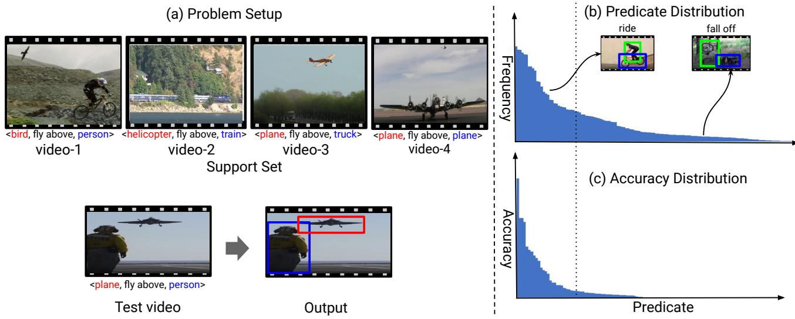
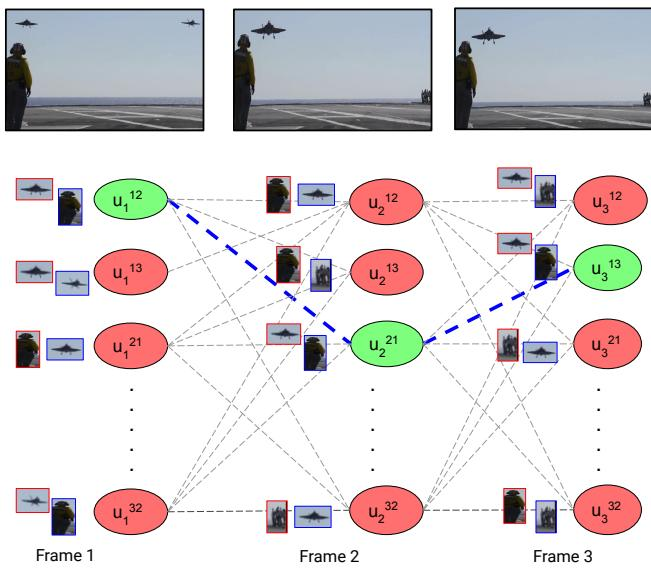
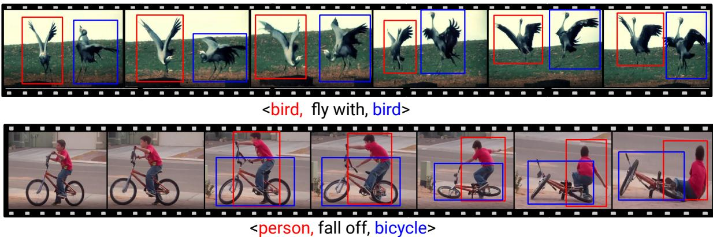
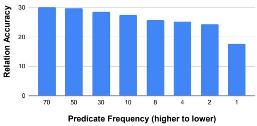

# Few-Shot Referring Relationships in Videos

Yogesh Kumar and Anand Mishra Indian Institute of Technology Jodhpur {kumar.204, mishra}@iitj.ac.in https://vl2g.github.io/projects/refRelations/

  
Figure 1. The proposed problem setup. (a) Given a query visual relationship as <subject, predicate, object> and a test video, our goal is to localize the subject and object on the test video using a support set containing a few videos sharing the same predicate. In this example, the goal is to spatiotemporally localize the plane (subject), and person (object) that are connected viafly above (predicate), using a support set containing only four videos sharing predicatefly above. It should be noted here thatfly above is unseen during training. We refer to this problem asfew-shot referring relationship in videos. This problem setup is inspired by the real-world scenario where obtaining large-scale annotations for every visual relationship is practically infeasible. As shown in (b), a popular visual relationship video dataset, namely ImageNet-VidVRD [27], contains many predicates with very few examples, i.e., it has long-tail distribution. Further, as shown in (c), the success of a recent visual relationship localization technique (vRGV) [35] is clearly proportional to predicate distribution in the train set. This calls for solving referring relationship tasks in a few-shot setup. We propose this task and present a novel principled solution.

## Abstract

Interpreting visual relationships is a core aspect ofcomprehensive video understanding. Given a query visual relationship as <subject, predicate, object> and a test video, our objective is to localize the subject and object that are connected via the predicate. Given modern visio-lingual understanding capabilities, solving this problem is achievable, provided that there are large-scale annotated training examples available. However, annotating for every combination of subject, object, and predicate is cumbersome, expensive, and possibly infeasible. Therefore, there is a need for models that can learn to spatially and temporally localize subjects and objects that are connected via an unseen predicate using only a few support set videos sharing the common predicate. We address this challenging problem, referred to as few-shot referring relationships in videos for the first time. To this end, we pose the problem as a minimization of an objective function defined over a T-partite random field. Here, the vertices of the random field correspond to candidate bounding boxes for the subject and object, and T represents the number of frames in the test video. This objective function is composed of framelevel and visual relationship similarity potentials. To learn these potentials, we use a relation network that takes queryconditioned translational relationship embedding as inputs and is meta-trained using support set videos in an episodic manner. Further, the objective function is minimized using a belief propagation-based message passing on the random field to obtain the spatiotemporal localization or subject and object trajectories. We perform extensive experiments using two public benchmarks, namely ImageNet-VidVRD and VidOR, and compare the proposed approach with competitive baselines to assess its efficacy.

## 1. Introduction

Consider the following problem: given a video, a visual relationship query represented as a <subject, predicate, object> tuple, and a support set of a few videos containing the same predicate but not necessarily the same subjects and objects, our objective is to spatially and temporally localize both subjects and objects that are related via the predicate within the video. We refer to this problem as Few-shot Referring Relationship and illustrate it in Figure 1. Solving this problem has the potential to benefit cross-task video understanding [41] and video retrieval [5, 7], among other applications. Identifying its utility, referring relationship task for images has been first introduced by [15]. However, referring relationships in videos poses additional video-specific challenges, such as understanding dynamic visual relationships. Some of these challenges have been addressed in recent research by Xiao et al. [35], but with a reliance on strong supervision. Referring relationships in videos within a few-shot setup is an under-explored area. We aim to fill this research gap via our work.

Visual relationships inherently have long-tail distributions in any video collection. For example, Image-Net Vid-VRD [27] dataset includes approximately 18.9% predicates with more than 100 instances but 20.5% predicates with less than 10 instances. This phenomenon is also shown in Figure 1, where most predicates belong to the tail side of the distribution. The methods that work best for frequent visual relationships do not necessarily generalize well to unseen visual relationships. Moreover, in a real-world scenario annotating visual relationships for each combination of subject, object, and predicate are cumbersome, expensive, and possibly infeasible. Therefore, there is a need to study visual relationship tasks in a few-shot setup. For instance: only with a few examples of the fly above predicate, such as videos containing <bird, fly above, person>, <helicopter, fly above, train> as shown in Figure 1 (a), a model should be able to generalize to the unseen visual relationship, such as <plane, fly above, person>. We propose a solution for Few-shot Referring Relationship in videos in this work.

We pose the problem of a few-shot referring relationship in the video as a minimization of an objective function defined over a T-partite random field where T is the number of frames in the test video. Furthermore, the vertices of the random field are treated as random variables and represent candidate bounding boxes for the subject and objects. The objective function consists of frame-level potentials and visual relationship similarity potentials, both of which are learned using a relation network that takes queryconditioned translational relationship embeddings as inputs. We meta-train the relation network using support set videos in an episodic manner. Further, the objective function is minimized using a belief propagation-based message passing on the random field to obtain subject and object trajectories. We perform extensive experiments on two public benchmarks, namely ImageNet-VidVRD [27] and VidOR [31], and report the accuracy of localizing subject, object, and relation, denoted by Asub, Aobj , and Ar, respectively, along with other popular measures used in the literature. Our proposed approach clearly outperforms the related baselines.

The contributions of this work are three folds. (i) We propose a novel problem setup for referring relationship in videos, where the model must learn to localize the subject and object corresponding to a query visual relationship that was unseen during training using only a few support videos. (ii) We propose a new formulation to solve this task based on the minimization of an objective function on T-partite random field where T is the number of frames in the test video, and the vertices of the random field representing potential bounding boxes for subject and objects correspond to the random variables. (Section 3.1). (iii) Additionally, to enrich query-conditioned relational embeddings, we present two aggregation techniques, namely global semantic and local localization aggregations. The use of these aggregation techniques results in enhanced relationship representations, which helps to obtain better trajectories for objects and subjects related via the query visual relationship. This is evidenced by extensive experiments and ablations. (Sections 3.2 and 4.5).

## 2. Related Work

Visual Relationships: Interpreting visual relationships in images [19, 21, 38] as well as videos [4, 9, 17, 18, 40] have gained huge attention over the last few years. They have also been key components of large-scale popular datasets such as Visual Genome [16] and Action Genome [11]. Visual relationships were studied with respect to object segmentation to leverage spatial relations [8] and to understand human-object interactions [36] via human-centric relationships. Krishna et al. [16] proposed the concept of scene graphs by combining multiple visual relationships in a graph structure. The structured representation of the scene graph is exploited for several tasks, including image retrieval [12]. Shang et al. [27] extended scene graphs from images to videos. Videos have spatiotemporal nature introducing dynamic relations that are not present in images. Scene graphs in videos represent fine-grain information that helps in the downstream task for spatiotemporal reasoning.

Several works have been introduced that utilize visual relationships to improve downstream tasks such as an image or video captioning [37], visual grounding [10], visual question answering [20]. To localize subjects and objects connected via a query visual relationship, Krishna et al. [15] proposed referring relationship for images. Their proposed method used an iterative message-passing mechanism between subject and object using language priors to ground the query relations. Further, Xiao et al. [35] extended referring relationship to videos and refer it as visual relationship grounding in videos. In a similar spirit, but, in a few-shot set-up, we propose to spatiotemporally localize subjects and objects in a video for a given relationship.

Few-Shot Learning: Few-shot learning in the literature can be grouped into: (i) metric-based [14,28,32] and (ii) modelbased [6, 23, 29] methods. We limit our discussion to only closely related works. Vinyals et al. [32] proposed matching networks that learn to compare using a small support set. Further, Sung et al. [29] proposed a relation network that learns from a few labeled images of the support set by comparing the query image. In this work, we have used a relation network to learn relationship similarity using the given support set videos, and this enabled us to obtain both frame-level and visual relationship similarity potentials.

## 3. Proposed Method

Task Definition: Given an unseen visual relationship consisting of subject (s), predicate (p), and object (o), i.e. $r = < s , \ p , \ o > { \mathrm { a s } }$ a query and a test video v along with a small support set of K videos $S _ { s u p } = \{ < s _ { i } , p , o _ { i } > , v _ { i } \} _ { i = 1 } ^ { K }$ containing the same predicate $p ,$ the goal is to obtain the sequence of bounding boxes (also known as trajectories) $T _ { s } ^ { * }$ and $T _ { o } ^ { * }$ corresponding to subject and object, respectively on the test video v. We refer to this task as few-shot referring relationship in videos. As an example, in Figure 1 (a), $r = < p l a n e , f y$ above, person> is a query that needs to be spatiotemporally localized on a test video using a support set that contains four videos offly above predicate. We pose this task as an optimization problem on a T-partite random field which we describe next.

## 3.1. Few-shot Referring Relationship as an optimization on a T-partite random field

Given a test video v, we split it into T frames. Then, we obtain M most confident object bounding boxes on each frame using FasterRCNN [24]. Video v can be represented as a sequence of extracted bounding boxes, $v =$ $\{ B _ { i } ^ { j } | i \in [ 1 , T ] , \bar { j } \in [ 1 , M ] \}$ }. The pair of these bounding boxes in each frame is a candidate solution for referring relationship task. While finding the optimal solution using a brute force technique is combinatorial and practically infeasible, we solve it using optimization on a T-partite random field. To this end, we construct a $T \cdot$ -partite graph

$G = ( \nu , \mathcal { E } )$ representing the test video as follows: for a frame i, we represent each pair of M bounding boxes as nodes and their all possible next and previous-frame connections as edges. More precisely, the set of vertices V for a video v contains ordered pair of bounding boxes as follows: $\{ u _ { i } ^ { j k } = ( B _ { i } ^ { j } , B _ { i } ^ { k } ) : i , \stackrel { . } { \in } [ 1 , T ] ; j , k \in \stackrel { \smile } { [ 1 , M ] } ; j \neq k \}$ and the set of edges is defined as $\mathcal { E } = \{ ( u _ { i } ^ { j , k } , u _ { ( i + 1 ) } ^ { j , k } ) : i \in$ $[ 1 , T - 1 ] ; j , k \in [ 1 , M ] ; j \neq k \}$ . Each vertex $u _ { i } ^ { j k }$ of this graph is a binary random variable that takes one of two labels {select (1), reject (0)} for the given query r. Figure 2 illustrates the construction of graph G for a three-frame test video. It should be noted here that the selected nodes (corresponding subject and object bounding box) from each frame form subject and object trajectories. To obtain optimal subject and object trajectories $( T _ { s } ^ { * }$ and $T _ { o } ^ { * } )$ for a given visual relationship r, we solve following optimization problem:

$$
\begin{array} { r } { T _ { s } ^ { * } , T _ { o } ^ { * } = \arg \underset { \theta , i , j , k } { \operatorname* { m i n } } \sum _ { i = 1 } ^ { T } \sum _ { j , k = 1 } ^ { M } \left( \Psi _ { i } ( u _ { i } ^ { j k } , r , \theta ) \right. } \\ { \left. + \sum _ { l \in n ( i ) } \Psi _ { i l } ( u _ { i } ^ { j k } , u _ { l } ^ { j k } , r , \theta ) \right) . } \end{array}\tag{1}
$$

Here, $n ( i )$ represents the neighboring nodes to frame $i ,$ and $\pmb { \theta }$ is a learnable parameter of a neural network that needs to be trained using support set videos. Specifically, we use support set videos to meta-train relation network $( R _ { \theta } )$ in a few-shot way. We describe the relation network used in our framework and its training strategy in detail in Section 3.3. Further, in the aforementioned objective function, the terms $\Psi _ { i }$ and $\Psi _ { i l }$ denote frame-level and visual relationship similarity potentials that are defined next.

## 3.1.1 Frame-level Potentials (Ψi)

We compute frame-level potentials $\Psi _ { i } ( u _ { i } ^ { j k } , r , \theta )$ such that the cost of selecting a node to form a trajectory is low if the selected node is semantically similar to query predicate r, otherwise high. Mathematically,

$$
\Psi _ { i } ( u _ { i } ^ { j k } , r , \theta ) = \frac { - \sum _ { m = 1 } ^ { K } R _ { \theta } \Big ( f _ { r } ( u _ { i } ^ { j k } ) , f _ { r } ( u _ { i _ { m } } ^ { j k } ) \Big ) } { K } ,\tag{2}
$$

where, $u _ { i _ { m } } ^ { j k }$ is the relationship pair in the $m ^ { t h }$ support set video connected via query predicate r and $f _ { r } ( u _ { i } ^ { j k } )$ is a visual relationship embedding in video v for $j ^ { t h }$ and $k ^ { t h }$ bounding boxes of $i ^ { t h }$ frame. Thus, $\Psi _ { i } ( u _ { i } ^ { j k } , r , \hat { \pmb { \theta } } )$ gives the negative of average similarity of node $u _ { i } ^ { j k }$ with respect to the relationship of $S _ { s u p }$ having predicate as $r .$ . The $R _ { \theta }$ returns a value closer to 1 when it represents visually and semantically similar visual relationships, and closer to 0, otherwise.

  
Figure 2. Illustration of T-partite random field. Here, we illustrate graph construction using three frames $( T = 3 )$ and three object bounding boxes $( M = 3 )$ . The ordered pair of bounding boxes are represented as a node. For this example, each frame will result in $2 \times { \binom { 3 } { 2 } } = 6$ nodes. Each node corresponds to a binary random variable $( u _ { i } ^ { j k } )$ that takes one of the two labels, i.e. {select (1), reject (0)}. The green- and red-filled nodes correspond to those random variables that the optimization framework aims to assign 1 and 0, respectively, and the dotted blue line indicates the ground truth tracklet. [Best viewed in color].

## 3.1.2 Visual Relationship Similarity Potentials $( \Psi _ { i l } )$

To ensure that coherent (both semantically and visually) visual relationships are being selected across frames, we define visual relationship similarity potential such that the cost of selecting a similar visual relationship in the optimal tracklet is low. To this end, the visual relationship similarity potential ${ \Psi _ { i l } } ( u _ { i } ^ { j k } , u _ { l } ^ { j k } , \pmb { \theta } )$ is computed as follows:

$$
\Psi _ { i l } ( u _ { i } ^ { j k } , u _ { l } ^ { j k } , \pmb { \theta } ) = - R _ { \pmb { \theta } } \Big ( f _ { r } ( u _ { i } ^ { j k } ) , f _ { r } ( u _ { l } ^ { j k } ) \Big ) ,\tag{3}
$$

where $f _ { r } ( u _ { i } ^ { j k } )$ is a visual relationship embedding in the video v for $j ^ { t h }$ and $k ^ { t h }$ bounding boxes of $i ^ { t h }$ frame. The computation of these relationship embeddings and details of the relation network follows next.

## 3.2. Query-conditioned Relationship Embedding

We describe the representation of a frame-level visual relationship in this section. To this end, we first obtain M extracted objects for each frame of the video using Faster-RCNN [24]. Then, given a query relationship $r =$ $< s , p , o >$ , for each frame, an object or subject representation corresponding $\tan j ^ { t h }$ and $k ^ { t h }$ bounding box of $\cdot i ^ { t h }$ frame respectively are obtained by the following equations:

$$
f _ { s } ( B _ { j } ^ { i } ) = \mathbf { W } _ { s _ { 2 } } \Big ( R e L U \Big ( \mathbf { W } _ { s _ { 1 } } [ f _ { a p p } ^ { s } ( B _ { j } ^ { i } ) ; f _ { s p a } ^ { s } ( B _ { j } ^ { i } ) ; G ( s ) ] \Big ) \Big ) ,\tag{4}
$$

$$
f _ { o } ( B _ { j } ^ { i } ) = { \bf W } _ { o _ { 2 } } \Big ( R e L U \Big ( { \bf W } _ { o _ { 1 } } [ f _ { a p p } ^ { o } ( B _ { j } ^ { i } ) ; f _ { s p a } ^ { o } ( B _ { j } ^ { i } ) ; G ( o ) ] \Big ) \Big ) .\tag{5}
$$

Here, $\mathbf { W } _ { s _ { 1 } } , \mathbf { W } _ { s _ { 2 } } , \mathbf { W } _ { o _ { 1 } }$ and $\mathbf { W } _ { o 2 }$ are learnable parameters. In addition, the variables $f _ { a p p } \in \mathbb { R } ^ { 2 0 4 8 }$ and $f _ { s p a } \in \mathbb { R } ^ { 4 }$ represent the ROI appearance and spatial features of the corresponding bounding boxes, while $G ( s ) \ \in \ \mathbb { R } ^ { 3 0 0 }$ and $G ( o ) \in \mathbb { R } ^ { 3 0 0 }$ represent the GloVe word embeddings for the subject and object, respectively. Moreover, [·; ·; ·] denotes the concatenation operation.

From here onwards, for the sake of simplicity of notations, we represent $f _ { s } ( B _ { j } ^ { i } )$ and $f _ { o } ( B _ { k } ^ { i } )$ as $f _ { s }$ and $f _ { o }$ respectively. It should be noted that $f _ { s }$ and $f _ { o }$ can be used directly for obtaining relationship embeddings that can be used to compute frame-level and visual relationship similarity potentials. However, to further enrich these representations, we present the following two attention-based aggregation techniques:

(i) Global Semantic Aggregation (GSA): The subject and object representations, i.e. $f _ { s }$ and $f _ { o }$ learned using eq. (4) and (5) are independent of other frames in the video. However, the global semantic context information from other frames may help in enriching subject and object representation. Therefore, we fused the I3D-features [1] of every frame by weighting them with a global attention vector $\alpha _ { s } ^ { g }$ which is computed as follows:

$$
\alpha _ { s } ^ { g } = G _ { A t t } ( f _ { I 3 D } , G ( s ) ) .\tag{6}
$$

Where $G _ { A t t }$ is a learnable attention unit, and it is defined as follows:

$$
s _ { j } ^ { g } = \mathbf { W } _ { g s _ { 1 } } R e L U ( \mathbf { W } _ { g s _ { 2 } } [ f _ { I 3 D } ^ { j } ; G ( s ) ] + b _ { g s } ) ,\tag{7}
$$

$$
\alpha _ { s _ { j } } ^ { g } = s o f t m a x ( s _ { j } ^ { g } ) ,\tag{8}
$$

where, ${ \bf W } _ { g s _ { 1 } } , { \bf W } _ { g s _ { 2 } }$ and $b _ { g s }$ are learnable parameters and $f _ { I 3 D } ^ { j }$ represent the I3D-feature for $j ^ { t h }$ frame. Finally, after aggregating the global semantic information the subject representation is obtained as:

$$
f _ { s } ^ { g } = \sum _ { j = 1 } ^ { T } ( \alpha _ { s _ { j } } ^ { g } \odot f _ { I 3 D } ^ { j } ) \cdot f _ { s } .\tag{9}
$$

Similarly, object representation after global semantic aggregation is obtained as:

$$
f _ { o } ^ { g } = \sum _ { j = 1 } ^ { T } ( \alpha _ { o _ { j } } ^ { g } \odot f _ { I 3 D } ^ { j } ) \cdot f _ { o } .\tag{10}
$$

Here, $f _ { s }$ and $f _ { o }$ are initial subject and object features obtained using eq. (4) and (5), respectively.

(ii) Local Localization Aggregation (LLA): For adding the context from the adjacent frames as a local localization context, we considered a window size of five, i.e., for $i ^ { t h }$ frame, we considered i − 2 to $i + 2$ frames. The local context helps with partially visible or occluded objects. We fuse the local spatial and ROI features from the adjacent frames weighted by the local attention vector for the subject $s \left( \alpha _ { s } ^ { l } \right)$ which is computed as follows :

$$
\alpha _ { s } ^ { l } = L _ { A t t } ( f _ { l } ^ { - 2 \le t \le 2 } , f _ { s } ) .\tag{11}
$$

Here, $f _ { s }$ is the initial representation of subjects obtained from eq. (4) and $f _ { l } ^ { - 2 \leq t \leq 2 }$ is obtained as:

$$
\begin{array} { r } { { f _ { s } ^ { - 2 } \le t \le 2 } = { \bf W } _ { l s _ { 2 } } R e L U ( { \bf W } _ { l s _ { 1 } } [ ( { f _ { s } ^ { t - 2 } - f _ { s } ^ { t - 1 } } ) } \\ { \cdot ( { f _ { s } ^ { t + 1 } - f _ { s } ^ { t + 2 } } ) ] , } \end{array}\tag{12}
$$

where $f _ { s } ^ { t - 2 }$ ft− to $f _ { s } ^ { t + 2 }$ are stacked ROI and spatial features of all objects from their respective frame numbers. $\mathbf { W } _ { l s _ { 1 } }$ $\mathbf { W } _ { l s _ { 2 } } , \mathbf { W } _ { l s _ { 3 } }$ and $\mathbf { W } _ { l s _ { 4 } }$ are learnable parameters. Then, from eqs. (7) to (10), local localization information-aggregated subject and object features, $f _ { s } ^ { l }$ and $f _ { o } ^ { l }$ , are obtained.

Obtaining Relationship Embedding: To obtain relationship embedding, we first enrich subject and object representations as follows:

$$
f _ { s } = \mathbf { W } _ { s r _ { 1 } } R e L U ( \mathbf { W } _ { s r _ { 2 } } [ f _ { s } ^ { g } ; f _ { s } ^ { l } ] ) ,\tag{13}
$$

$$
f _ { o } = \mathbf { W } _ { o r _ { 1 } } R e L U ( \mathbf { W } _ { o r _ { 2 } } [ f _ { o } ^ { g } ; f _ { o } ^ { l } ] ) .\tag{14}
$$

Where, $\mathbf { W } _ { s r _ { 1 } } , \mathbf { W } _ { s r _ { 2 } } , \mathbf { W } _ { o r _ { 1 } }$ and $\mathbf { W } _ { o r _ { 2 } }$ are learnable parameters. Finally, for any pair of subject and object, $( j , k )$ of $i ^ { t h }$ frame of a video $v ,$ the relationship embedding with respect to query visual relationship r is computed as a translation vector in lower dimensional relation space similar to VTrasE [39] as follows:

$$
\begin{array} { r } { f _ { r } ( \boldsymbol { u } _ { i _ { v } } ^ { j k } ) = { \mathbf { W } } _ { r _ { 2 } } R e L U \Big ( { \mathbf { W } } _ { r _ { 1 } } R e L U ( [ { \mathbf { W } } _ { r s } f _ { j } - { \mathbf { W } } _ { r o } f _ { k } ] ; } \\ { G ( p ) ] \Big ) , \qquad } \end{array}\tag{15}
$$

where, ${ \mathbf W } _ { r _ { 2 } } , { \mathbf W } _ { r _ { 1 } } , { \mathbf W } _ { r s }$ , and $\mathbf { W } _ { r o }$ are learnable parameters and $f _ { j } , \ f _ { k }$ are subject and object representation obtained from eq. (13) and (14) respectively.

## 3.3. Learning Relation Network with Few Examples

The proposed problem formulation has to learn the similarity between object pairs as the visual relationships using a few videos from $S _ { s u p }$ . We have selected the Relation Network $\left( R _ { \theta } \right) \left[ 2 9 \right]$ , a metric-based meta-learning approach, as our method of choice. After learning the similarity measure for the unseen predicate, $R _ { \theta }$ is used to compute both framelevel as well as visual relationship similarity potentials.

For a pair of object pairs $\begin{array} { r c l } { p _ { 1 } } & { = } & { \left( x _ { 1 } , y _ { 1 } \right) } \end{array}$ and $\begin{array} { r l } { p _ { 2 } } & { { } = } \end{array}$ $( x _ { 2 } , y _ { 2 } )$ , their representation as a visual relationship, $f _ { r } ^ { p _ { 1 } } , f _ { r } ^ { p _ { 2 } }$ are obtained using $\mathrm { e q . }$ . (15). Then pairwise similarity score is computed as:

$$
R _ { \pmb \theta } ( f _ { r } ^ { p _ { 1 } } , f _ { r } ^ { p _ { 2 } } ) = \mathbf { W } _ { r } ^ { T } \Phi ( f _ { r } ^ { p _ { 1 } } , f _ { r } ^ { p _ { 2 } } ) + b ,\tag{16}
$$

where $\mathbf { W } _ { r } ,$ b are learnable parameters matrix and bias vector respectively. Further, Φ is computed using the following equation:

$$
\begin{array} { r } { \Phi ( f _ { r } ^ { p _ { 1 } } , f _ { r } ^ { p _ { 2 } } ) = t a n h ( \mathbf { W } _ { 1 } ( [ f _ { r } ^ { p _ { 1 } } ; f _ { r } ^ { p _ { 2 } } ] ) + b _ { 1 } ) \sigma ( \mathbf { W } _ { 2 } [ f _ { r } ^ { p _ { 1 } } ; f _ { r } ^ { p _ { 2 } } ] } \\ { + b _ { 2 } ) + ( ( f _ { r } ^ { p _ { 1 } } + f _ { r } ^ { p _ { 2 } } ) / 2 ) , } \end{array}\tag{17}
$$

where $\mathbf { W } _ { 1 } , \mathbf { W } _ { 2 }$ , and $b _ { 1 } , b _ { 2 }$ are learnable parameters matrices, and bias vectors, and $\sigma$ and tanh are sigmoid and hyperbolic tangent activation functions, respectively.

For each support set video, we extract ground truth positive and negative object pairs. Positive object pairs are connected via the query relation predicate $p ,$ while negative object pairs are picked randomly from a set containing pairs of objects that are not connected via predicate $p .$ We used ground-truth spatial and its corresponding ROI features to get the relation embedding using eq. (15). $R _ { \theta }$ learns to return higher similarity between semantically similar pairs of relationships while lower similarity for other pairs. Let us consider a set of positive object pairs $p _ { r } ^ { + } \stackrel { - } { = } \{ \{ ( x _ { i j } ^ { + } , y _ { i j } ^ { + } ) \} _ { j = 1 } ^ { l } \} _ { i = 1 } ^ { k }$ and negative object pairs $p _ { r } ^ { - } = \{ \{ ( x _ { i j } ^ { - } , y _ { i j } ^ { - } ) \} _ { j = 1 } ^ { l } \} _ { i = 1 } ^ { k }$ extracted from the $S _ { s u p } ,$ where l is the number of positive or negative object pairs extracted from each support set video. Finally, the $R _ { \theta }$ is meta-trained on $S _ { s u p }$ using the following episodic loss.

$$
\begin{array} { r } { \mathcal { L } = \displaystyle \sum _ { a = 1 } ^ { K } \sum _ { b = 1 } ^ { l } \sum _ { c = 1 } ^ { l } l o g \Biggl ( \Bigl ( 1 + e ^ { - R _ { \theta } ( f _ { r } ^ { + b c } , f _ { r } ^ { + b c } ) } \Bigr ) } \\ { \Bigl ( 1 + e ^ { - R _ { \theta } ( f _ { r } ^ { + b c } , f _ { r } ^ { - b c } ) } \Bigr ) \Bigl ( 1 + e ^ { - R _ { \theta } ( f _ { r } ^ { - b c } , f _ { r } ^ { + b c } ) } \Bigr ) \Biggr ) . } \end{array}\tag{18}
$$

## 3.4. Trajectory Generation

To generate the final trajectories of the subject and object, we used three different optimization approaches. In the first technique, we used only frame-level potential $\Psi _ { i }$ to select a node with the optimal potential value, which was determined as the minimum value among all the nodes at frame i. We skipped a frame if the optimal potential value is higher than the fixed threshold $( = - 0 . 5 )$ . As an alternative to this, we also used a greedy solver by selecting a node from frame i using the first technique, and then, we find the next node in the next frame j with optimal $\Psi _ { i j }$ . We skipped a frame $j$ if the optimal $\Psi _ { i j }$ potential value is higher than the fixed threshold $( = - 0 . 5 )$ . In our full model, we used both frame-level potential and visual relationship similarity potential and used belief propagation using message passing [22] to find the optimal trajectories.

<table><tr><td></td><td colspan="6">ImageNet-VidVRD</td><td colspan="8">VidOR</td></tr><tr><td>Method</td><td> $A _ { s - t } ^ { s u b }$ </td><td> $A _ { s } ^ { s u b }$ </td><td> $m I o U _ { s } ^ { s u b }$ </td><td> $A _ { s - t } ^ { o b j }$ </td><td> $A _ { s } ^ { o b j }$ </td><td> $m I o U _ { s } ^ { o b j }$ </td><td> $A _ { s - } ^ { r }$  -t</td><td> $A _ { s - t } ^ { s u b }$ </td><td> $A _ { s } ^ { s u b }$ </td><td> $m I o U _ { s } ^ { s u b }$ </td><td> $A _ { s - t } ^ { o b j }$ </td><td> $A _ { s } ^ { o b j }$ </td><td> $m I o U _ { s } ^ { o b j }$ </td><td> $\underline { { A _ { s - } ^ { r } } }$  t</td></tr><tr><td>VRC [30]</td><td>8.4</td><td>10.7</td><td>11.9</td><td>8.6</td><td>10.3</td><td>11.2</td><td>5.8</td><td>7.2</td><td>9.9</td><td>10.3</td><td>8.0</td><td>10.1</td><td>11.1</td><td>5.6</td></tr><tr><td>vRGV-fs [35]</td><td>8.2</td><td>11.1</td><td>12.4</td><td>8.3</td><td>11.6</td><td>12.9</td><td>6.1</td><td>7.5</td><td>10.3</td><td>10.9</td><td>7.3</td><td>10.7</td><td>11.4</td><td>6.3</td></tr><tr><td>Tracklet-based</td><td>12.6</td><td>15.1</td><td>15.9</td><td>12.8</td><td>14.8</td><td>15.3</td><td>9.6</td><td>11.1</td><td>13.7</td><td>14.2</td><td>10.9</td><td>12.6</td><td>13.8</td><td>8.2</td></tr><tr><td>Ours</td><td></td><td></td><td></td><td></td><td></td><td></td><td></td><td></td><td></td><td></td><td></td><td></td><td></td><td></td></tr><tr><td>w/o vis.sim. potential, w/o GSA, w/o LLA</td><td>19.6</td><td>21.4</td><td>19.1</td><td>18.2</td><td>18.7</td><td>20.8</td><td>16.3</td><td>19.8</td><td>20.7</td><td>18.7</td><td>18.5</td><td>19.2</td><td>20.4</td><td>17.3</td></tr><tr><td>w/o GSA, w/o LLA</td><td>25.3</td><td>26.9</td><td>25.8</td><td>25.7</td><td>25.1</td><td>26.5</td><td>22.8</td><td>24.5</td><td>24.9</td><td>25.1</td><td>24.9</td><td>25.1</td><td>22.3</td><td>21.9</td></tr><tr><td>w/o vis.sim. potential</td><td>22.6</td><td>22.8</td><td>21.9</td><td>22.3</td><td>21.4</td><td>22.9</td><td>17.2</td><td>20.9</td><td>21.3</td><td>22.5</td><td>22.7</td><td>21.7</td><td>22.1</td><td>17.6</td></tr><tr><td>Greedy solver</td><td>25.4</td><td>26.5</td><td>24.7</td><td>24.3</td><td>23.8</td><td>26.4</td><td>22.8</td><td>24.2</td><td>25.6</td><td>23.8</td><td>24.5</td><td>22.7</td><td>25.8</td><td>21.7</td></tr><tr><td>Full model</td><td>26.8</td><td>28.4</td><td>27.1</td><td>26.0</td><td>25.1</td><td>27.9</td><td>25.1</td><td>25.3</td><td>26.9</td><td>26.2</td><td>26.3</td><td>25.7</td><td>27.0</td><td>23.8</td></tr></table>

Table 1. Performance of few-shot referring relationship in videos. Each method is trained on the same split of train and test datasets with a support size of four videos. Ours (full model) represents the proposed method where global semantic aggregation (GSA) and local localization aggregation (LLA) are performed to enrich the query-conditioned relationship representation, a translational relation embedding is learned, and an objective function containing frame-level and visual similarity potential is optimized using belief propagation on the $T \cdot$ partite random field. For more details, refer Section 4.

## 4. Experiments and Results

## 4.1. Datasets

We have used two video benchmark datasets, namely, VidOR [26, 31] and ImageNet-VidVRD [27] in our experiments. ImageNet-VidVRD contains 1000 videos obtained from the ILVSRC2016-VID dataset [25]. It has 132 predicates and 35 object categories. VidOR is a large-scale dataset containing 10,000 videos obtained from YFCC100M collection. VidOR contains 50 predicates and 80 object categories. For our problem setting, we split both datasets into disjoint sets based on predicates and videos by randomly assigning 35 and 15 predicates to the train and test sets of VidOR, while assigning 88 and 22 predicates to the train and test sets of ImageNet-VidVRD, respectively.

## 4.2. Performance Measure

In this work, we adopt widely-used evaluation metrics in the referring relationship and video understanding literature, as described in [3, 15, 35]. Specifically, we calculate the subject and object accuracy, which represents the percentage of correct trajectories returned by the model for the entire test set. A relation accuracy is defined as the percentage of correct subject and object pair trajectories. Here, a pair is considered correct if both subject and object trajectories are correct. For spatiotemporal accuracy, $A _ { s - t } ^ { s u b }$ $A _ { s - t } ^ { o b j }$ , of the subject or object, a trajectory is considered correct if at least 50% of the bounding boxes across frames have $\geq 0 . 5$ intersection over union (IoU) with respect to ground truth bounding boxes. Similarly, for spatiotemporal accuracy of relation, $A _ { s - t } ^ { r } ,$ , a pair of subject and object is considered true only if both trajectories are spatiotemporally accurate (i.e. at least 50% of the bounding boxes across frames have $\geq 0 . 5$ IoU). For spatial accuracy, $A _ { s } ^ { s u b }$ $A _ { o } ^ { o b j }$ , a trajectory is considered true if the average of IoUs of the bounding box with respect to ground truth is at least 0.5. The mean IoU for a trajectory is an average of the IoU score for all bounding boxes with respect to ground truth. The mean IoU of the subject or object, m ${ \ J o U _ { s } ^ { s u b } }$ , ${ _ { 2 I o U _ { s } ^ { o b j } } }$ is the average of the mean IoU of the subject or object for the entire test set.

## 4.3. Baselines

To the best of our knowledge, we are the first to approach referring relationships in videos in a few-shot setup, and there are no existing baselines in the literature that can be directly compared to our approach. Therefore, we adopt closely related methods as our baselines to compare the effectiveness of our method as follows: (i) Few-Shot Visual Relation Co-Localization (VRC): Few-shot VRC has originally been proposed for localizing common subjects and objects in a bag of images in a few-shot setup [30]. We adopt it for videos by treating object trajectory pairs in the test and support set videos as a bag and performing visual relationship co-localization at the frame level. (ii) Visual vRGV [35] tackles the same task as ours but differs significantly in supervision. We adapted vRGV for our few-shot problem setup for a fair comparison. Recall that in our problem setup, the model is trained in episodes, and each episode contains a support set of a few videos and a test video for evaluation. We utilize all available videos from the train set to train the vRGV model. During testing for each episode, we fine-tune the model on the support set and then perform localization for the given query visual relationship on the test video. We refer to these baselines as vRGV in a few-shot setup or vRGV-fs. (iii) Tracklet-based approach: We also propose another baseline that is based on tracklet obtained using DeepSort [34]. Each pair of object tracklet is ranked by a deep metric that is trained using the support set.

  
Figure 3. Qualitative result on a selection of test videos. Each subject and object of the query relationship is spatiotemporally localized on the test videos. Red and blue color bounding boxes represent the subject and object, respectively. [Best viewed in color].

<table><tr><td>GSA</td><td>LLA</td><td> $A _ { s - t } ^ { s u b }$ </td><td> $A _ { s - t } ^ { o b j }$ </td><td> $A _ { s - t } ^ { r }$ </td></tr><tr><td>x</td><td>x</td><td>21.3</td><td>22.1</td><td>20.8</td></tr><tr><td>√</td><td>x</td><td>24.7</td><td>23.5</td><td>22.8</td></tr><tr><td>X</td><td>√</td><td>22.3</td><td>21.7</td><td>21.1</td></tr><tr><td>√</td><td>√</td><td>26.8</td><td>26.0</td><td>25.1</td></tr></table>

Table 2. Ablation study to demonstrate the importance of global semantic aggregation (GSA) and local localization aggregation (LLA) on the ImageNet-VidVRD dataset. Our full model (the last row) performs better as compared to the settings where one or both of these are removed.

While visual relationship detection [4, 9, 17, 18, 40] followed by retrieving the most similar visual relationship with the query may be a possible baseline, detecting “unseen” relationships in a video is a significantly underexplored topic in the literature. In addition, implementing zero-shot or few-shot visual relationship detection methods designed for the image domain [2, 33] in videos may require significant modifications to ensure compatibility. Given this challenge, we opted not to propose this non-trivial baseline.

## 4.4. Implementation Details

For frame-level detection, we utilized FasterRCNN [24], which was pre-trained on MS-COCO with ResNet-101 as the backbone. We extracted the 30 most confident object bounding boxes for each frame. Our implementation was done using PyTorch. We optimized the model parameters using Adam [13] with an initial learning rate of 1e-5, while also employing a dropout rate of 0.3 to reduce overfitting. To prevent overfitting, we used early stopping. We trained the model on an Nvidia-RTX A6000 GPU.

  
Figure 4. Spatiotemporal localization accuracy of the proposed method with different support sizes on the ImageNet-VidVRD.

## 4.5. Results and Discussions

We compare our approach with baselines discussed in Section 4.3 on VidOR and ImageNet-VidVRD datasets in Table 1. We observe that the baselines modified using prior works, namely VRC and vRGV, exhibit weaker performance across all the evaluated metrics. The tracklet-based approach performs marginally better than these baselines. However, its performance is heavily bottle-necked with the quality of tracklets generated. Our approach, without the proposed global semantic and local localization aggregation itself, surpasses these baselines. We also observed a positive impact of frame-level and visual relationship similarity potential; for example, in Table 1, the accuracy of localizing relationship $( A _ { s - t } ^ { r } )$ has increased by 2.3% (absolute scale) in the full model with respect to the greedy solver on ImageNet-VidVRD dataset. The superior performance of our method can be attributed to the principled optimization framework, the proposed aggregation techniques, queryconditioned learning of relationship embeddings, and the effective utilization of support set videos to meta-train relation networks. To show the efficacy of our method and to justify the choice of different modules, we conduct the following ablations and analyses:

Global semantic and local localization aggregation: We remove global semantic (GSA) and local localization aggregation (LLA) in our full model to analyze their effect. In other words, we used equations (4) and (5) to obtain the subject and object representation and analyze its effect on the ImageNet-VidVRD dataset in Table 2. We observe that our full model that uses these two aggregation techniques performs better as compared to the settings where one or both of these are removed.

<table><tr><td></td><td colspan="7">Static</td><td colspan="9">Dynamic</td></tr><tr><td>Metric</td><td>stop front</td><td>taller</td><td>right</td><td>larger</td><td>stand front</td><td>sit behind</td><td>above</td><td>left</td><td>walk behind</td><td>run beneath</td><td>move right</td><td>play</td><td>feed</td><td>faster</td><td>move front</td><td>fly above</td></tr><tr><td></td><td>30.1</td><td>28.8</td><td>28.6</td><td>30.9</td><td>29.7</td><td>26.5</td><td>31.4</td><td>25.8</td><td>19.2</td><td>21.5</td><td>23.7</td><td>27.4</td><td>28.5</td><td>22.4</td><td>25.9</td><td>22.8</td></tr><tr><td>位</td><td>28.3</td><td>30.1</td><td>27.5</td><td>27.2</td><td>26.5</td><td>23.8</td><td>30.1</td><td>23.3</td><td>19.1</td><td>21.7</td><td>22.8</td><td>28.9</td><td>27.2</td><td>22.3</td><td>24.4</td><td>24.3</td></tr><tr><td>Aτs-t</td><td>27.6</td><td>26.2</td><td>26.3</td><td>25.5</td><td>25.9</td><td>22.2</td><td>27.8</td><td>22.5</td><td>18.6</td><td>19.8</td><td>22.6</td><td>26.2</td><td>26.1</td><td>19.2</td><td>23.1</td><td>21.4</td></tr></table>

Table 3. Predicate-wise performance of the proposed method on ImageNet-VidVRD Dataset grouped into static and dynamic categories.
<table><tr><td>Relationship Embedding</td><td> $A _ { s - t } ^ { s u b }$ </td><td> $A _ { s - t } ^ { o b j }$ </td><td> $A _ { s - t } ^ { r }$ </td></tr><tr><td>Concatenation Translation Embedding</td><td>18.3 26.8</td><td>20.1 26.0</td><td>18.7 25.1</td></tr></table>

Table 4. Performance comparison of translational and Concat relationship embedding on ImageNet-VidVRD dataset. In this study, both embeddings are fused with the global and local context.

Translational relation embedding: In the second ablation, we justify the choice of translation visual relationship embedding. To this end, we replaced the translational embedding in eq. (15) with a simple concatenation of subject and object representation. As shown in Table 4, translational relationship embedding used in our model is significantly more robust than simple concatenation embeddings.

Effect of visual relationship similarity potential: To study the effect of visual relationship similarity potential in our optimization framework, we evaluate our model with and without this potential. Table 1 clearly indicates the utility of this potential where our full model that uses both visual relationship similarity and frame-level potential significantly surpass the variant that does not use visual relationship similarity potential.

Effect of support set size/long-tail: To analyze the effect of support set size, we perform experiments by varying its size. Specifically, we present a bar chart showing $A _ { ( s - t ) } ^ { r }$ achieved using our approach on ImageNet-VidVRD dataset with a support set varying from 1 to 70 videos in Figure 4. We observe an intuitive gain with a larger support set.

Unseen subjects or objects: The predicate in the query visual relationship is always unseen in our setup. We further analyze cases where either subject or object is also unseen during training in Table 5. The model performs reasonably well for localizing subjects and objects in videos, even in these cases with an intuitive drop in performance as compared to cases where only the predicate is unseen, and both subject and object are seen.

Performance on static and dynamic relations: In order to analyze the performance of our approach for different types of relations, we present the predicate-wise results in Table 3. The results reveal that our proposed approach generally achieves better performance for static relationships. Nonetheless, despite the additional challenges posed by dynamic relationships, such as the presence of moving objects and subjects, occlusion, motion blur, and deformation, our approach demonstrates reasonable results for dynamic predicates highlighting its robustness.

<table><tr><td>subject</td><td>object</td><td> $A _ { s - t } ^ { s u b }$ </td><td> $A _ { s - t } ^ { o b j }$ </td><td> $A _ { s - t } ^ { r }$ </td></tr><tr><td>√</td><td>√</td><td>28.3</td><td>27.6</td><td>27.3</td></tr><tr><td>√</td><td>x</td><td>23.7</td><td>21.4</td><td>18.6</td></tr><tr><td>x</td><td>√</td><td>19.4</td><td>20.5</td><td>17.2</td></tr></table>

Table 5. Performance comparison when subject or object is unseen during training on ImageNet-VidVRD dataset.

Qualitative Results: Figure 3 shows a selection of qualitative results of our approach on ImageNet-VidVRD dataset where query visual relationships, <bird, fly with, bird>, and <person, fall off, bicycle> are referred in the respective video by localizing the subject and object connected to the query predicate. Our method is successful in localizing subjects and objects connected via dynamic relationships indicating the effectiveness of our approach. We provide more qualitative results on our project website1.

## 5. Conclusions

In this work, we approached the problem from framelevel object detection to video-level trajectory generation by optimizing an objective function on a random field in a few-shot way. We used global semantic and local localization aggregation to enhance query-conditioned translation visual relationship embedding. The objective function is minimized using belief propagation on the random field. We performed experimental comparisons along with ablation studies to show the efficacy of our approach. We firmly believe that our work will open up several future research towards the larger exciting goal of comprehensive cross-task video understanding.

Acknowledgment: This work is partly supported by a gift grant from Accenture Labs (project number: S/ACT/AM/20220078). Y. Kumar is supported by a UGC fellowship.

## References

[1] Joao Carreira and Andrew Zisserman. Quo vadis, action recognition? a new model and the kinetics dataset. In Proc. CVPR, 2017. 4

[2] Long Chen, Hanwang Zhang, Jun Xiao, Wei Liu, and Shih-Fu Chang. Zero-shot visual recognition using semanticspreserving adversarial embedding networks. In Proc. CVPR, 2018. 7

[3] Zhenfang Chen, Lin Ma, Wenhan Luo, and Kwan-Yee Kenneth Wong. Weakly-supervised spatio-temporally grounding natural sentence in video. In Proc. ACL, 2019. 6

[4] Anoop Cherian, Chiori Hori, Tim K Marks, and Jonathan Le Roux. (2.5+ 1) d spatio-temporal scene graphs for video question answering. In Proc. AAAI, 2022. 2, 7

[5] Jianfeng Dong, Xirong Li, Chaoxi Xu, Shouling Ji, Yuan He, Gang Yang, and Xun Wang. Dual encoding for zero-example video retrieval. In Proc. CVPR, 2019. 2

[6] Chelsea Finn, Pieter Abbeel, and Sergey Levine. Modelagnostic meta-learning for fast adaptation of deep networks. In Proc. ICML, 2017. 3

[7] Valentin Gabeur, Chen Sun, Karteek Alahari, and Cordelia Schmid. Multi-modal transformer for video retrieval. In Proc. ECCV, 2020. 2

[8] Carolina Galleguillos, Andrew Rabinovich, and Serge Belongie. Object categorization using co-occurrence, location and appearance. In Proc. CVPR, 2008. 2

[9] Kaifeng Gao, Long Chen, Yifeng Huang, and Jun Xiao. Video relation detection via tracklet based visual transformer. In Proc. ACM MM, 2021. 2, 7

[10] Ronghang Hu, Marcus Rohrbach, Jacob Andreas, Trevor Darrell, and Kate Saenko. Modeling relationships in referential expressions with compositional modular networks. In Proc. CVPR, 2017. 3

[11] Jingwei Ji, Ranjay Krishna, Li Fei-Fei, and Juan Carlos Niebles. Action genome: Actions as compositions of spatiotemporal scene graphs. In Proc. CVPR, 2020. 2

[12] Justin Johnson, Ranjay Krishna, Michael Stark, Li-Jia Li, David Shamma, Michael Bernstein, and Li Fei-Fei. Image retrieval using scene graphs. In Proc. CVPR, 2015. 2

[13] Diederik P. Kingma and Jimmy Ba. Adam: A method for stochastic optimization. In Yoshua Bengio and Yann LeCun, editors, Proc. ICLR, 2015. 7

[14] Gregory Koch, Richard Zemel, Ruslan Salakhutdinov, et al. Siamese neural networks for one-shot image recognition. In Proc. ICML-W, 2015. 3

[15] Ranjay Krishna, Ines Chami, Michael Bernstein, and Li Fei-Fei. Referring relationships. In Proc. CVPR, 2018. 2, 3, 6

[16] Ranjay Krishna, Yuke Zhu, Oliver Groth, Justin Johnson, Kenji Hata, Joshua Kravitz, Stephanie Chen, Yannis Kalantidis, Li-Jia Li, David A Shamma, et al. Visual genome: Connecting language and vision using crowdsourced dense image annotations. IJCV, 123:32–73, 2017. 2

[17] Yicong Li, Xun Yang, Xindi Shang, and Tat-Seng Chua. Interventional video relation detection. In Proc. ACM MM, 2021. 2, 7

[18] Yiming Li, Xiaoshan Yang, and Changsheng Xu. Dynamic scene graph generation via anticipatory pre-training. In Proc. CVPR, 2022. 2, 7

[19] Kongming Liang, Yuhong Guo, Hong Chang, and Xilin Chen. Visual relationship detection with deep structural ranking. In Proc. AAAI, 2018. 2

[20] Pan Lu, Lei Ji, Wei Zhang, Nan Duan, Ming Zhou, and Jianyong Wang. R-vqa: learning visual relation facts with semantic attention for visual question answering. In Proc. SIGKDD, 2018. 3

[21] Xinyu Lyu, Lianli Gao, Yuyu Guo, Zhou Zhao, Hao Huang, Heng Tao Shen, and Jingkuan Song. Fine-grained predicates learning for scene graph generation. In Proc. CVPR, 2022. 2

[22] Judea Pearl. Fusion, propagation, and structuring in belief networks. Artif. Intell., 29(3):241–288, 1986. 6

[23] Sachin Ravi and Hugo Larochelle. Optimization as a model for few-shot learning. In Proc. ICLR, 2017. 3

[24] Shaoqing Ren, Kaiming He, Ross Girshick, and Jian Sun. Faster R-CNN: Towards real-time object detection with region proposal networks. In Proc. NeurIPS, 2015. 3, 4, 7

[25] Olga Russakovsky, Jia Deng, Hao Su, Jonathan Krause, Sanjeev Satheesh, Sean Ma, Zhiheng Huang, Andrej Karpathy, Aditya Khosla, Michael Bernstein, Alexander C. Berg, and Li Fei-Fei. ImageNet Large Scale Visual Recognition Challenge. IJCV, 115:211–252, 2014. 6

[26] Xindi Shang, Donglin Di, Junbin Xiao, Yu Cao, Xun Yang, and Tat-Seng Chua. Annotating objects and relations in usergenerated videos. In ICMR, 2019. 6

[27] Xindi Shang, Tongwei Ren, Jingfan Guo, Hanwang Zhang, and Tat-Seng Chua. Video visual relation detection. In Proc. ACM MM, 2017. 1, 2, 6

[28] Jake Snell, Kevin Swersky, and Richard Zemel. Prototypical networks for few-shot learning. In Proc. NeurIPS, 2017. 3

[29] Flood Sung, Yongxin Yang, Li Zhang, Tao Xiang, Philip HS Torr, and Timothy M Hospedales. Learning to compare: Relation network for few-shot learning. In Proc. CVPR, 2018. 3, 5

[30] Revant Teotia, Vaibhav Mishra, Mayank Maheshwari, and Anand Mishra. Few-shot visual relationship co-localization. In Proc. ICCV, 2021. 6

[31] Bart Thomee, David A Shamma, Gerald Friedland, Benjamin Elizalde, Karl Ni, Douglas Poland, Damian Borth, and Li-Jia Li. Yfcc100m: The new data in multimedia research. Commun. ACM, 59:64–73, 2015. 2, 6

[32] Oriol Vinyals, Charles Blundell, Timothy Lillicrap, Daan Wierstra, et al. Matching networks for one shot learning. In Proc. NeurIPS, 2016. 3

[33] Weitao Wang, Meng Wang, Sen Wang, Guodong Long, Lina Yao, Guilin Qi, and Yang Chen. One-shot learning for longtail visual relation detection. In Proc. AAAI, 2020. 7

[34] Nicolai Wojke, Alex Bewley, and Dietrich Paulus. Simple online and realtime tracking with a deep association metric. In Proc. ICIP, 2017. 7

[35] Junbin Xiao, Xindi Shang, Xun Yang, Sheng Tang, and Tat-Seng Chua. Visual relation grounding in videos. In Proc. ECCV, 2020. 1, 2, 3, 6

[36] Bangpeng Yao and Li Fei-Fei. Modeling mutual context of object and human pose in human-object interaction activities. In Proc. CVPR, 2010. 2

[37] Ting Yao, Yingwei Pan, Yehao Li, and Tao Mei. Exploring visual relationship for image captioning. In Proc. ECCV, 2018. 3

[38] Yibing Zhan, Jun Yu, Ting Yu, and Dacheng Tao. On exploring undetermined relationships for visual relationship detection. In Proc. CVPR, 2019.

[39] Hanwang Zhang, Zawlin Kyaw, Shih-Fu Chang, and Tat-Seng Chua. Visual translation embedding network for visual relation detection. In Proc. CVPR, 2017. 5

[40] Sipeng Zheng, Shizhe Chen, and Qin Jin. Vrdformer: Endto-end video visual relation detection with transformers. In Proc. CVPR, 2022. 2, 7

[41] Dimitri Zhukov, Jean-Baptiste Alayrac, Ramazan Gokberk Cinbis, David Fouhey, Ivan Laptev, and Josef Sivic. Crosstask weakly supervised learning from instructional videos. In Proc. CVPR, 2019. 2