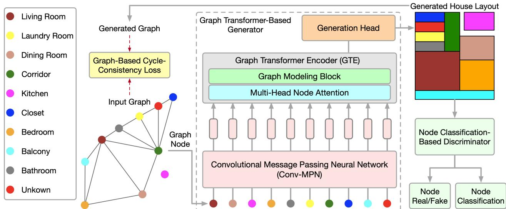
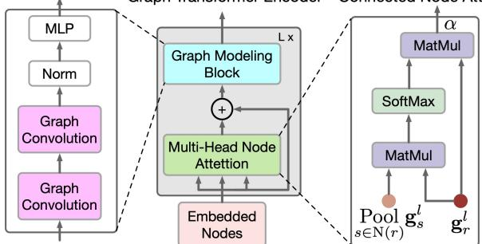
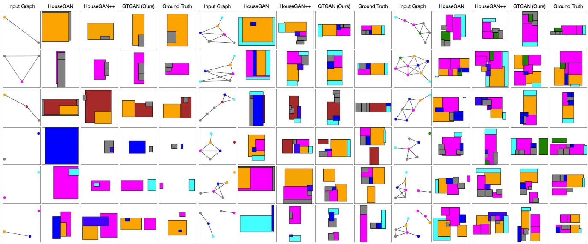
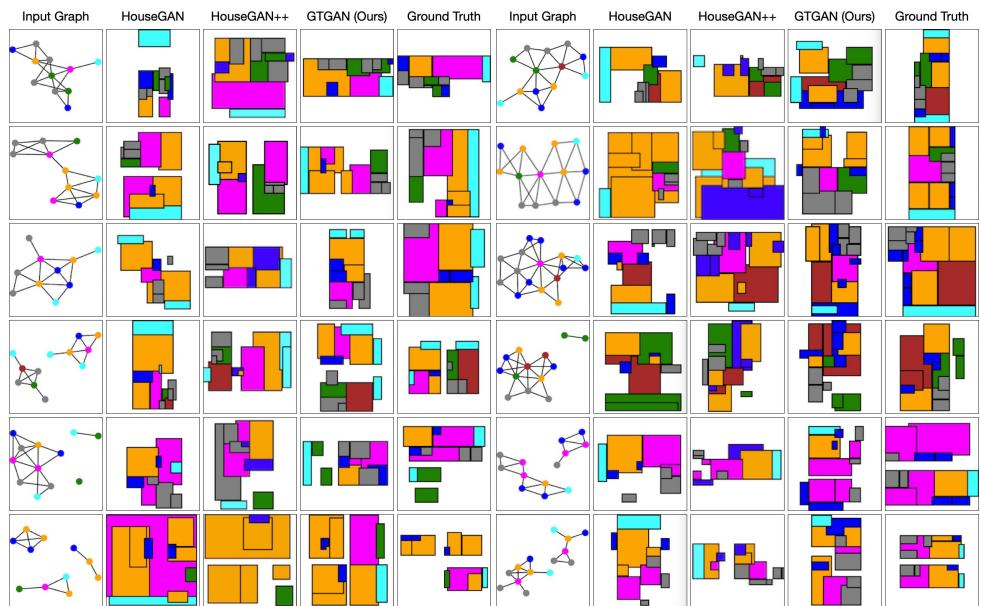
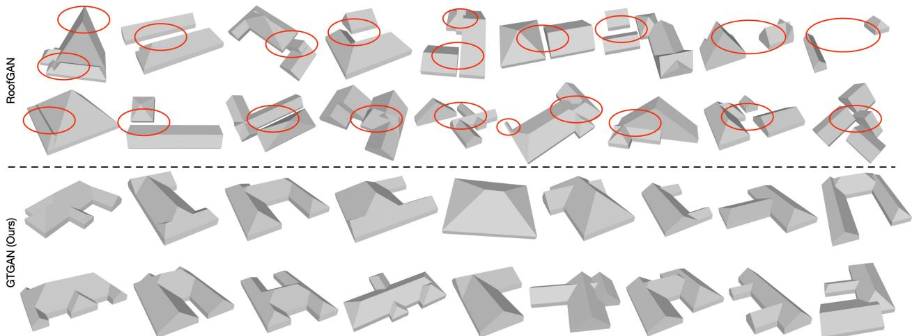
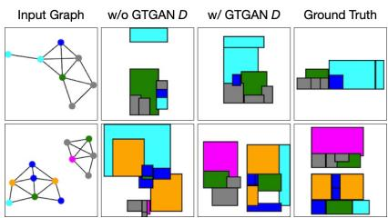
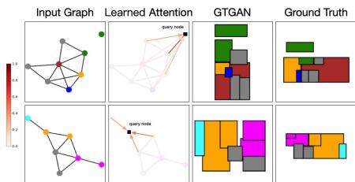

# Graph Transformer GANs for Graph-Constrained House Generation

Hao Tang1 Zhenyu Zhang2 Humphrey Shi3 Bo Li2

Ling Shao4 Nicu Sebe5 Radu Timofte1,6 Luc Van Gool1,7

1CVL, ETH Zurich 2Tencent Youtu Lab 3U of Oregon & UIUC & Picsart AI Research 4UCAS-Terminus AI Lab, UCAS 5University of Trento 6University of Wurzburg 7KU Leuven

## Abstract

We present a novel graph Transformer generative adversarial network (GTGAN) to learn effective graph node relations in an end-to-endfashionfor the challenging graphconstrained house generation task. The proposed graph-Transformer-based generator includes a novel graph Transformer encoder that combines graph convolutions and selfattentions in a Transformer to model both local and global interactions across connected and non-connected graph nodes. Specifically, the proposed connected node attention (CNA) and non-connected node attention (NNA) aim to capture the global relations across connected nodes and non-connected nodes in the input graph, respectively. The proposed graph modeling block (GMB) aims to exploit local vertex interactions based on a house layout topology. Moreover, we propose a new node classification-based discriminator to preserve the high-level semantic and discriminative node features for different house components. Finally, we propose a novel graph-based cycle-consistency loss that aims at maintaining the relative spatial relationships between ground truth and predicted graphs. Experiments on two challenging graph-constrained house generation tasks (i.e., house layout and roof generation) with two public datasets demonstrate the effectiveness of GTGAN in terms of objective quantitative scores and subjective visual realism. New state-of-the-art results are established by large margins on both tasks.

## 1. Introduction

This paper focuses on converting an input graph to a realistic house footprint, as depicted in Figure 1. Existing house generation methods such as [2, 16, 20, 28, 32, 45, 47], typically rely on building convolutional layers. However, convolutional architectures lack an understanding of longrange dependencies in the input graph since inherent inductive biases exist. Several Transformer architectures [3, 6, 11, 17, 18, 24, 43, 44, 46, 54, 55] based on the selfattention mechanism have recently been proposed to encode long-range or global relations, thus learn highly expressive feature representations. On the other hand, graph convolution networks are good at exploiting local and neighborhood vertex correlations based on a graph topology. Therefore, it stands to reason to combine graph convolution networks and Transformers to model local as well as global interactions for solving graph-constrained house generation.

To this end, we propose a novel graph Transformer generative adversarial network (GTGAN), which consists of two main novel components, i.e., a graph Transformerbased generator and a node classification-based discriminator (see Figure 1). The proposed generator aims to generate a realistic house from the input graph, which consists of three components, i.e., a convolutional message passing neural network (Conv-MPN), a graph Transformer encoder (GTE), and a generation head. Specifically, Conv-MPN first receives graph nodes as inputs and aims to extract discriminative node features. Next, the embedded nodes are fed to GTE, in which the long-range and global relation reasoning is performed by the connected node attention (CNA) and non-connected node attention (NNA) modules. Then, the output from both attention modules is fed to the proposed graph modeling block (GMB) to capture local and neighborhood relationships based on a house layout topology. Finally, the output of GTE is fed to the generative head to produce the corresponding house layout or roof. To the best of our knowledge, we are the first to use a graph Transformer to model local and global relations across graph nodes for solving graph-constrained house generation.

In addition, the proposed discriminator aims to distinguish real and fake house layouts, which ensures that our generated house layouts or roofs look realistic. At the same time, the discriminator classifies the generated rooms to their corresponding real labels, preserving the discriminative and semantic features (e.g., size and position) for different house components. To maintain the graph-level layout, we also propose a novel graph-based cycle-consistency loss to preserve the relative spatial relationships between ground truth and predicted graphs.

Overall, our contributions are summarized as follows:

  
Figure 1. Overview of the proposed GTGAN on house layout generation. It consists of a novel graph Transformer-based generator G and a novel node classification-based discriminator D. The generator takes graph nodes as input and aims to capture local and global relations across connected and non-connected nodes using the proposed graph modeling block and multi-head node attention, respectively. Note that we do not use position embeddings since our goal is to predict positional node information in the generated house layout. The discriminator D aims to distinguish real and generated layouts and simultaneously classify the generated house layouts to their corresponding room types. The graph-based cycle-consistency loss aligns the relative spatial relationships between ground truth and predicted nodes. The whole framework is trained in an end-to-end fashion so that all components benefit from each other.

• We propose a novel Transformer-based network (i.e., GT-GAN) for the challenging graph-constrained house generation task. To the best of our knowledge, GTGAN is the first Transformer-based framework, enabling more effective relation reasoning for composing house layouts and validating adjacency constraints.

• We propose a novel graph Transformer generator that combines both graph convolutional networks and Transformers to explicitly model global and local correlations across both connected and non-connected nodes simultaneously. We also propose a new node classificationbased discriminator to preserve high-level semantic and discriminative features for different types of rooms.

• We propose a novel graph-based cycle-consistency loss to guide the learning process toward accurate relative spatial distance of graph nodes.

• Qualitative and quantitative experiments on two challenging graph-constrained house generation tasks (i.e., house layout generation and house roof generation) with two datasets demonstrate that GTGAN can generate better house structures than state-of-the-art methods, such as HouseGAN [28] and RoofGAN [32].

## 2. Related Work

Generative Adversarial Networks [12] have been widely used for image generation [21,34,37,38]. The vanilla GAN consists of a generator and a discriminator. The generator aims to synthesize photorealistic images from a noise vector, while the discriminator aims to distinguish between real and generated samples. To create user-specific images, the conditional GAN (CGAN) [27] was proposed. A CGAN combines a vanilla GAN and external information, such as class labels [7], text descriptions [41, 42, 53], object keypoints [33], human skeletons [35], semantic maps [31, 39, 40], edge maps [36], or attention maps [26]. This paper mainly focuses on the challenging graph-constrained generation task, which aims to transfer an input graph to a realistic house.

Graph-Constrained Layout Generation has been a focus of research recently [10, 16, 25, 45]. For example, Wang et al. [45] presented a layout generation framework that plans an indoor scene as a relation graph and iteratively inserts a 3D model at each node. Hu et al. [16] converted a layout graph along with a building boundary into a floorplan that fulfills both the layout and boundary constraints. Ashual et al. [2] and Johnson et al. [20] tried to generate image layouts and synthesize realistic images from input scene graphs via GCNs. Nauata et al. [28] proposed a graph-constrained generative adversarial network, whose generator and discriminator are built upon a relational architecture. Our innovation is a novel graph Transformer GAN, where the input constraint is encoded into the graph structure of the proposed graph Transformer-based generator and node classificationbased discriminator. Experimental results show the effectiveness of GTGAN over all the leading methods.

Transformers in Computer Vision. The Transformer was first proposed in [43] for machine translation and has established state-of-the-art results in many natural language processing (NLP) tasks. Recently, the Vision Transformer (ViT) [11] equipped with global self-attention has achieved state-of-the-art results on the classification task. Since then, Transformer-based approaches have been shown to be efficient in many computer vision tasks including image segmentation [19, 44, 46], object detection [3, 9, 13, 55], depth estimation [48], pose estimation [23, 24], video inpainting [50], vision-and-language navigation [6], video classification [30], human reaction generation [8], 3D pose transfer [4, 5]. Different from these methods, in this paper, we adopt a Transformer-based network to tackle the graphconstrained house generation task. However, integrating graph convolutional networks and ViTs is not trivial. To this end, we propose a graph Transformer-based generator to capture both local and global relations across nodes in a graph. To the best of our knowledge, GTGAN is the first Transformer-based house generation framework.

## 3. The Proposed Graph Transformer GAN

This section presents the details of the proposed GT-GAN, which consists of a novel graph Transformer-based generator G, a node classification-based discriminator $D ,$ and a graph-based cycle-consistency loss. An illustration of the proposed GTGAN framework is shown in Figure 1.

## 3.1. Graph Transformer-Based Generator

We only illustrate the details of our contributions on the house layout generation task for simplicity. The extension of the proposed contributions to house roof generation is straightforward. Take house layout generation in Figure 1 as an example. The generator $G$ receives a noise vector for each room and a bubble diagram as inputs. It then generates a house layout, where each room is represented as an axisaligned rectangle. We represent each bubble diagram as a graph, where each node represents a room of a certain type, and each edge represents the spatial adjacency. Specifically, we generate a rectangle for each room, where two rooms with a graph edge should be spatially adjacent, while two rooms without an edge should be spatially dis-adjacent.

Input Graph Representation. Given a bubble diagram, we first generate a node for each room and initialize it with a 128-d noise vector sampled from a normal distribution. We then concatenate the noise vector with a 10-d room type vector $\overrightarrow { t _ { r } }$ (r is a room index), encoded in the one-hot format. Therefore, we can obtain a 138-d vector $\overrightarrow { g _ { r } }$ to represent the input bubble diagram as follows,

$$
\overrightarrow { g _ { r } }  \{ \mathbb { N } ( 0 , 1 ) ^ { 1 2 8 } ; \overrightarrow { t _ { r } } \} .\tag{1}
$$

Note that, different from the highly successful ViT [11], we use graph nodes as the input of the proposed graph Transformer instead of using image patches, which makes our framework very different.

Convolutional Message Passing Neural Network. As indicated in HouseGAN [28], Conv-MPN stores feature as a 3D tensor in the output design space. We thus apply a shared linear layer to expand $\overrightarrow { g _ { r } }$ into a feature volume $\mathbf { { \dot { g } } } _ { r } ^ { { \bar { l } } = 1 }$ of size $1 6 \times 8 \times 8 ,$ where l=1 is the feature extracted from the first Conv-MPN layer, which will be upsampled twice using a transposed convolution to become a feature volume $\mathbf { g } _ { r } ^ { l = 3 }$ of size $1 6 { \times } 3 2 { \times } 3 2$

The Conv-MPN layer updates a graph of room-wise feature volumes via a convolutional message passing [51]. Specifically, we update $\mathbf { g } _ { r } ^ { l = 1 }$ over the following steps: 1) We use a GTE to capture the long-range correlations across rooms that are connected in the input graph; 2) We employ another GTE to capture the long-range dependencies across non-connected rooms in the input graph; 3) We concatenate a sum-pooled feature across connected rooms in the input graph; 4) We concatenate a sum-pooled feature across nonconnected rooms; and 5) We apply a convolutional neural network (CNN) on the combined feature. This process can be formulated as follows,

$$
\begin{array} { r l } & { \mathbf { g } _ { r } ^ { l }  \mathrm { C N N } [ \mathbf { g } _ { r } ^ { l } + \mathrm { G T E } ( \underset { s \in \mathrm { N } ( r ) } { \operatorname* { P o o l } } \mathbf { g } _ { s } ^ { l } , \mathbf { g } _ { r } ^ { l } ) +  } \\ & {  \mathrm { G T E } ( \underset { s \in \overline { { \mathrm { N } } } ( r ) } { \operatorname* { P o o l } } \mathbf { g } _ { s } ^ { l } , \mathbf { g } _ { r } ^ { l } ) ; \underset { s \in \mathrm { N } ( r ) } { \operatorname* { P o o l } } \mathbf { g } _ { s } ^ { l } ; \underset { s \in \overline { { \mathrm { N } } } ( r ) } { \operatorname* { P o o l } } \mathbf { g } _ { s } ^ { l } ] , } \end{array}\tag{2}
$$

where $\mathrm { N } ( r )$ and $\overline { { \mathrm { N } } } ( r )$ denote sets of rooms that are connected and not-connected, respectively; $" + "$ and $\stackrel { 6 6 , 5 9 } { , }$ denote pixel-wise addition and channel-wise concatenation, respectively. We also explore two more variations (Eq. (3) and (4)) to validate the effectiveness of Eq. (2) as follows,

$$
\begin{array} { r } { \mathbf { g } _ { r } ^ { l }  \mathrm { C N N } \Bigg [ \mathrm { G T E } ( \mathbf { P o o l } \mathbf { g } _ { s } ^ { l } , \mathbf { g } _ { r } ^ { l } ) + } \\ { \mathrm { G T E } ( \mathbf { P o o l } \mathbf { g } _ { s } ^ { l } , \mathbf { g } _ { r } ^ { l } ) ; \mathbf { P o o l } \mathbf { g } _ { s } ^ { l } ; \mathbf { P o o l } \mathbf { g } _ { s } ^ { l } \Bigg ] . } \end{array}\tag{3}
$$

$$
\begin{array} { r } { \mathbf { g } _ { r } ^ { l }  \mathrm { C N N } [ \mathbf { g } _ { r } ^ { l } + \mathrm { G T E } ( \mathbf { \Delta } _ { s \in \mathrm { N } ( r ) } \mathbf { g } _ { s } ^ { l } , \mathbf { g } _ { r } ^ { l } ) +  } \\ {  \mathrm { G T E } ( \mathbf { \Delta } _ { s \in \mathrm { N } ( r ) } \mathbf { g } _ { s } ^ { l } , \mathbf { g } _ { r } ^ { l } ) ] . } \end{array}\tag{4}
$$

Node Attentions in Graph Transformer Encoder. To capture local and global relationships across graph nodes, we propose a novel GTE, as shown in Figure 2. GTE combines self-attention in Transformer and graph convolution networks to capture global and local correlations, respectively. Note that we do not use position embeddings in our framework since our goal is to generate node positions in the generated house layout.

The proposed GTE is quite different from the one presented in ViT [11] since the two input modalities are different, i.e., images and graph nodes. Thus, we extend the multi-head self-attention in [11] to the multi-head node attention, which aims to capture the global correlations across connected rooms/nodes and the global dependencies across non-connected rooms/nodes. To this end, we propose two novel graph node attention modules, i.e., connected node attention (CNA) and non-connected node attention (NNA). Both CNA and NNA share the same network structure.

Graph Transformer Encoder Connected Node Attention  
  
Figure 2. Overview of the proposed graph Transformer encoder, which consists of a multi-head node attention and a graph modeling block. It can capture both global and local correlations for graph-constrained house generation. This encoder consists of $L { = } 8$ identical blocks. The proposed connected node attention aims to capture long-range relations across connected nodes. Note that the proposed non-connected node attention has the same structure as the connected node attention but takes non-connected nodes as input. It aims to capture long-range relations across nonconnected nodes.

The goal of CNA (see Figure 2) is to model the global correlations across connected rooms. Specifically, we perform a matrix multiplication between the transpose of $\mathrm { P o o l } \mathbf { g } _ { s } ^ { l }$ and $\mathbf { g } _ { r } ^ { l }$ , and apply a Softmax function to calculate the connected node attention map $\begin{array} { l } { \mathrm { A t t } } \\ { \mathrm { N } ( r ) } \end{array}$

$$
\mathrm { A t t } = \mathrm { s o f t m a x } \Bigg [ \frac { \mathbf { g } _ { r } ^ { l } \Big ( \mathbf { \Delta } _ { s \in \mathrm { N } ( r ) } \mathbf { g } _ { s } ^ { l } \Big ) ^ { \top } } { \sqrt { c a r d ( N ( r ) ) } } \Bigg ] ,\tag{5}
$$

where card( $N ( r ) )$ is the number of connected graph nodes in a training batch. The connected node attention map $\mathrm { A t t }$ N(r) measures the connected node’s impact on other connected nodes. Then we perform matrix multiplication between $\mathbf { g } _ { r } ^ { l }$ and the transpose of $\operatorname { \mathrm { A t t } } _ { \mathrm { N } ( r ) }$ . Lastly, we multiply the result by a scaling parameter α to obtain the output,

$$
\mathrm { G T E } \left( \underset { s \in \mathrm { N } ( r ) } { \operatorname { P o o l } } \mathbf { g } _ { s } ^ { l } , \mathbf { g } _ { r } ^ { l } \right) = \alpha \sum _ { 1 } ^ { N } \left( \underset { \mathrm { N } ( r ) } { \operatorname { A t t } } \cdot \mathbf { g } _ { r } ^ { l } \right) ,\tag{6}
$$

where α is a learnable parameter, initialized to 0, and learned by the model [52]. By doing so, each connected node in $\mathrm { N } ( r )$ is a weighted sum of all the connected nodes. Thus, CNA obtains a global view of the spatial graph structure and can selectively adjust rooms according to the connected attention map, improving the house layout’s representations and high-level semantic consistency.

Similarly, the goal of NNA is to capture global relations across non-connected rooms. Specifically, we perform a matrix multiplication between the transpose of $\mathrm { P o o l } \ \mathbf { g } _ { s } ^ { l }$

and $\mathbf { g } _ { r } ^ { l }$ , and apply a Softmax function to calculate the nonconnected node attention map Att:

$$
\overline { { \mathrm { N } } } ( r )
$$

$$
\frac { \mathrm { A t t } = \mathrm { s o f t m a x } } { \overline { { \mathbf { N } } } ( r ) } \Bigg [ \frac { \mathbf { g } _ { r } ^ { l } \Big ( \mathbf { P } _ { 0 0 } \mathbf { l } \mathbf { g } _ { s } ^ { l } \Big ) ^ { \top } } { \sqrt { c a r d ( \overline { { N } } ( r ) ) } } \Bigg ] ,\tag{7}
$$

where card $( \overline { { N } } ( r ) )$ is the number of non-connected graph nodes in a training batch. The non-connected node attention map $\boldsymbol { { \frac { \mathrm { A t t } } { \mathrm { N } } } } ( { \boldsymbol { r } } )$ measures the non-connected node’s impact

on other non-connected nodes. Then we perform matrix multiplication between $\mathbf { g } _ { r } ^ { l }$ and the transpose of $\boldsymbol { \frac { \mathrm { A t t } } { \mathrm { N } } }$ . Lastly,

we multiply the result by a scale parameter $\beta$ to obtain the output as follows,

$$
\mathrm { G T E } \left( \underset { s \in \overline { { \mathbb { N } } } ( r ) } { \operatorname { P o o l } } \mathbf { g } _ { s } ^ { l } , \mathbf { g } _ { r } ^ { l } \right) = \beta \sum _ { 1 } ^ { N } \left( \underset { \overline { { \mathbb { N } } } ( r ) } { \operatorname { A t t } } \cdot \mathbf { g } _ { r } ^ { l } \right) ,\tag{8}
$$

where $\beta$ gradually learns weights from 0 [52]. By doing so, each non-connected node in $\overline { { \mathrm { N } } } ( r )$ is a weighted sum of all the non-connected nodes. Finally, we perform an element-wise sum with $\mathbf { g } _ { r } ^ { l }$ so that the updated node feature can capture both connected and non-connected spatial relations. This process can be expressed as follows,

$$
\mathbf { g } _ { r } ^ { l }  \mathbf { g } _ { r } ^ { l } + \mathrm { G T E } ( \underset { s \in \mathrm { N } ( r ) } { \operatorname { P o o l } } \mathbf { g } _ { s } ^ { l } , \mathbf { g } _ { r } ^ { l } ) + \mathrm { G T E } ( \underset { s \in \mathbb { N } ( r ) } { \operatorname { P o o l } } \mathbf { g } _ { s } ^ { l } , \mathbf { g } _ { r } ^ { l } )\tag{9}
$$

Graph Modeling in Graph Transformer Encoder. While CNA and NNA are useful for extracting long-range and global dependencies, it is less efficient at capturing finegrained local information in complex house data structures. To fix this limitation, we propose a novel graph modeling block, as shown in Figure 2.

Specifically, given the features $\mathbf { g } _ { r } ^ { l }$ generated in Eq. (9), we further improve the local correlations by using graph convolutional networks as follows,

$$
\hat { \mathbf { g } } _ { r } ^ { l } = \operatorname { G C } ( A , \mathbf { g } _ { r } ^ { l } ; P ) = \sigma ( A \mathbf { g } _ { r } ^ { l } P ) ,\tag{10}
$$

where A denotes the adjacency matrix of a graph, $\operatorname { G C } ( \cdot )$ represents graph convolution, and $P$ the trainable parameters. $\sigma ( \cdot )$ is the gaussian error linear unit (GeLU) proposed in [14] activation function that aims to provide the network non-linearity. We follow the structure design in GraphCMR [22] to build our graph modeling block, which can explicitly encode the graph-constrained house structure within the network and thereby improve spatial locality in the feature representations.

Generation Head. We adopt three CNN layers to convert a feature volume into a room segmentation mask of size $1 \times 3 2 \times 3 2$ . The numbers of convolutional channels are 256, 128, and 1, respectively. We pass the graph of segmentation masks to the proposed discriminator D during the training stage. Finally, we fit the tightest axis-aligned rectangle for each room to generate the house layout.

## 3.2. Node Classification-Based Discriminator

The input of the proposed discriminator is a graph of room segmentation masks, either from the generator or a real one. The segmentation masks are of size $1 \times 3 2 \times 3 2$ We also take a 10-d room type vector to preserve the room type information, and then we apply a linear layer to expand it to 8192-d. Next, we reshape it to a tensor of size $8 \times 3 2 \times 3 2$ . Thus, we use a shared three-layer CNN to convert it to a feature of size 16×32×32, followed by two rounds of Conv-MPN and downsampling. Lastly, we use another three-layer CNN to convert each room feature into a 128-d vector $\ddot { \overrightarrow { d } } _ { r }$ . To classify ground-truth samples from the generated ones, we sum-pool over all the room vectors and then apply a single linear layer to produce a scalar $\tilde { \mathbf { d } } _ { \mathbf { 1 } }$ which can be expressed as follows,

$$
\tilde { \mathbf { d } } _ { 1 } \gets \mathrm { L i n e a r } \left( \mathrm { P o o l } \overrightarrow { d } _ { r } \right) .\tag{11}
$$

Moreover, we observe that HouseGAN [28] cannot produce very discriminative rooms, leading to similar generation results for different types of rooms. To provide a more diverse generation for different rooms, we propose a novel node classification loss to learn more discriminative classspecific node representations. Specifically, we sum pool over all the room vectors and add another single linear layer to output a 10-d one-hot vector $\tilde { \mathbf { d } } _ { 2 }$ , classifying generated rooms to the corresponding room labels,

$$
\tilde { \mathbf { d } } _ { 2 } \gets \mathrm { L i n e a r } \left( \mathrm { P o o l } \overrightarrow { d } _ { r } \right) .\tag{12}
$$

We use the binary cross-entropy loss between the real room label $\mathbf { d _ { 2 } }$ and the predicted label $\tilde { \mathbf { d } } _ { 2 }$

## 3.3. Graph-Based Cycle-Consistency Loss

Providing global graph node relationship information is helpful in generating more accurate house layouts. To differentiate this process, we propose a novel loss based on an adjacency matrix that matches the spatial relationships between ground truth and generated graphs, as shown in Figure 1. Precisely, the graphs capture the adjacency relationships between each node of different rooms, and then we enforce the matching between the ground truth and generated graphs through the proposed graph-based cycle-consistency loss. Formally, we represent the graphs using two (square) weighted adjacency matrices of size $M \times M$

$$
\mathbf { G } ^ { g t } = \{ g _ { i , j } ^ { g t } \} _ { { i = 1 } , \ldots , M } , \quad \mathbf { G } ^ { g e n } = \{ g _ { i , j } ^ { g e n } \} _ { { i = 1 } , \ldots , M } .\tag{13}
$$

The matrix $\mathbf { G } ^ { g t }$ contains the adjacency information computed on ground truth graph, while $\mathbf { G } ^ { j e n }$ has the same information computed on the generated graph. Note that we adapt the network in [49] to obtain the $G ^ { g e n }$ from the generated house layout, followed by a fully-connected layer with the size of $M \times M$ , then reshaped it to a square matrix.

In this way, each element of the matrices provides a measure of how close the two nodes i and $j$ are in the ground truth and the generated graph, respectively. To measure the closeness between nodes, which is a hint of the strength of the connection between them, we consider weighted matrices where each entry $g _ { i , j }$ depends on the shortest distance between them. For example, in the ground truth graph in Figure 1, the shortest distance between the dining room and the living room is 1, the shortest distance between the dining room and the closet is 2, and the shortest distance between the bedroom and the closet is 3. Note that we do not consider self-connections, thus $g _ { i , i } ^ { g t } { = } g _ { i , i } ^ { g e n } { = } 0$ for $i { = } 1 , \ldots , M$ Moreover, non-adjacent nodes have −1 as the entry. Then, we define the proposed graph-based cycle-consistency loss as the Frobenius norm between the two adjacency matrices,

$$
\mathcal { L } _ { g c y c } = | | \mathbf { G } ^ { g t } - \mathbf { G } ^ { g e n } | | _ { F } = | | \mathbf { G } ^ { g t } - G ( \mathbf { G } ^ { g t } ) | | _ { F } ,\tag{14}
$$

where G is the proposed graph Transformer-based generator. This loss function aims to faithfully maintain the reciprocal relationships between nodes. On the one hand, disjoint parts are enforced to be predicted as disjoint. On the other hand, neighboring nodes are enforced to be predicted as neighboring and to match the proximity ratios.

## 4. Experiments

The proposed GTGAN can be applied to different graphbased generative tasks such as house layout generation [28] and house roof generation [32]. In this section, we present experimental results and analysis on both tasks.

## 4.1. Results on House Layout Generation

Datasets. We follow HouseGAN [28] and conduct house layout generation experiments on the LIFULL HOME’s dataset, which have different rooms, i.e., living room, kitchen, bedroom, bathroom, closet, balcony, corridor, dining room, laundry room, and unknown.

Evaluation Metrics. We follow HouseGAN [28] and adopt realism, diversity, and compatibility metrics to evaluate the performance of the proposed method. Specifically, we follow [28] and divide the training samples into five subsets based on the number of rooms, i.e., 1-3, 4-6, 7-9, 10-12, and 13+. When generating layouts in a subset, we train the models while excluding samples in the same subset so that they cannot simply memorize. 1) We use the average user rating (12 Ph.D. students and 10 professional architects) to measure realism. We provide 75 generated results with ground truths or 75 results generated by another method for comparison. A subject can give four ratings, i.e., better (+1), equally-good (+1), worse (-1), or equally-bad (-1). 2) The Frechet inception distance (FID) [´ 15] measures the diversity with the rasterized layout images. We rasterize a layout by setting the background to white and then sorting the rooms in decreasing order of area, finally painting each room with a color based on its room type. We follow [28] and use

  
Figure 3. Visualization results compared with HouseGAN [28] and HouseGAN++ [29] on “1-3” (left), “4-6” (middle), and “7-9” (right) subset. The last three rows contain non-connected nodes.

  
Figure 4. Visualization results compared with HouseGAN [28] and HouseGAN++ [29] on “10-12” (left) and “13+” (right) subset. The last three samples contain non-connected nodes.

5,000 samples to compute the FID metric. 3) The compatibility of the bubble diagram is determined by the graph editing distance [1] between the input bubble diagram and the bubble diagram constructed from the generated layout. Quantitative Comparisons. To evaluate the effectiveness of GTGAN on house layout generation, we compare it with several leading methods, i.e., CNN-only, GCN, Ashual et al. [2], Johnson et al. [20], HouseGAN [28], and House-GAN++ [29]. We follow the same setups in [28] to reproduce the results of Ashual et al. [2] and Johnson et al. [20] for fair comparisons. Table 1 shows our main results on the five subsets. Note that we train HouseGAN++ [29] on this dataset using the public source code for a fair comparison, which is denoted as HouseGAN++∗. We observe that

Figure 5. Visualization results compared with the proposed GTGAN (bottom two rows) and RoofGAN (top two rows). We see that GT GAN can generate more realistic roof structures than RoofGAN. Red ovals highlight non-realistic roof structures generated by RoofGAN.
<table><tr><td rowspan="2">Method</td><td>Realism ↑</td><td colspan="5">Diversity ↓</td><td colspan="5">Compatibility ↓</td></tr><tr><td>All Groups</td><td>1-3</td><td>4-6</td><td>7-9</td><td>10-12</td><td>13+</td><td>1-3</td><td>4-6</td><td>7-9</td><td>10-12</td><td>13+</td></tr><tr><td>CNN-only</td><td>-0.54</td><td>13.2</td><td>26.6</td><td>43.6</td><td>54.6</td><td>90.0</td><td>0.4</td><td>3.1</td><td>8.1</td><td>15.8</td><td>34.7</td></tr><tr><td>GCN</td><td>0.14</td><td>18.6</td><td>17.0</td><td>18.1</td><td>22.7</td><td>31.5</td><td>0.1</td><td>0.8</td><td>2.3</td><td>3.2</td><td>3.7</td></tr><tr><td>Ashual et al. [2]</td><td>-0.55</td><td>64.0</td><td>92.2</td><td>87.6</td><td>122.8</td><td>149.9</td><td>0.2</td><td>2.7</td><td>6.2</td><td>19.2</td><td>36.0</td></tr><tr><td>Johnson et al. [20]</td><td>-0.58</td><td>69.8</td><td>86.9</td><td>80.1</td><td>117.5</td><td>123.2</td><td>0.2</td><td>2.6</td><td>5.2</td><td>17.5</td><td>29.3</td></tr><tr><td>HouseGAN [28]</td><td>0.17</td><td>13.6</td><td>9.4</td><td>14.4</td><td>11.6</td><td>20.1</td><td>0.1</td><td>1.1</td><td>2.9</td><td>3.9</td><td>10.8</td></tr><tr><td>HouseGAN++* [29]</td><td>0.19</td><td>11.8</td><td>7.6</td><td>12.2</td><td>10.1</td><td>18.3</td><td>0.08</td><td>0.77</td><td>2.52</td><td>3.65</td><td>7.43</td></tr><tr><td>GTGAN (Ours)</td><td>0.25</td><td>7.1</td><td>5.4</td><td>9.6</td><td>7.5</td><td>16.9</td><td>0.06</td><td>0.62</td><td>2.14</td><td>2.63</td><td>3.42</td></tr></table>

Table 1. Quantitative results of house layout generation on the LIFULL HOME’s dataset. The colors blue, cyan, and orange represent the first, the second, and third best results, respectively. HouseGAN++∗ [29] is reproduced by us.

GTGAN outperforms other competing methods in all the metrics, validating the effectiveness of GTGAN.

Qualitative Comparisons. We compare GTGAN with the most related methods, i.e., HouseGAN [28] and House-GAN++ [29]. The visualization results on the five subsets are shown in Figures 3 and 4. It is easy to tell that GTGAN generates more realistic and reasonable house layouts than the leading methods, i.e., HouseGAN and HouseGAN++. For instance, HouseGAN generates improper room sizes or shapes for certain room types, e.g., the closet, the kitchen, and the closet in the last three rows of Figure 3(left), respectively, are too big. Moreover, HouseGAN generates misalignment of rooms, e.g., the balcony, the kitchen, and the living room in the first three samples of Figure 3(middle) do not align well with other rooms. Lastly, both HouseGAN and HouseGAN++ cannot generate non-connected rooms well, e.g., the corridor, the bathroom, and the bedroom in the last three samples of Figure 3(right) are not accurately generated because they are not connected to other rooms. In contrast, the proposed method alleviates all three problems to a certain extent and generates more realistic and reasonable house layouts.

## 4.2. Results on House Roof Generation

Datasets and Evaluation Metrics. We follow RoofGAN [32] and conduct extensive experiments on the CAD-style roof geometry dataset proposed in [32]. We follow [32] and use the FID [15] and the minimum matching distance (RMMD) as the evaluation metrics for a fair comparison. Quantitative Comparisons. To evaluate the effectiveness of GTGAN on house roof generation, we compare it with three leading methods, i.e., PQ-Net [47], HouseGAN [28], and RoofGAN [32]. Table 2 shows the comparison results on both 3 and 4 primitives. When generating roofs, we follow [32] and split the training and test sets based on the number of primitives to prevent simply copying and pasting. We observe that GTGAN outperforms the other three competing methods in both metrics, demonstrating the effectiveness of our method.

Qualitative Comparisons. We compare GTGAN with the most related method, i.e., RoofGAN [28]. The visualization results are shown in Figure 5. Clearly, we observe that GTGAN generates more realistic and reasonable roof structures than the leading method RoofGAN. For instance, RoofGAN generates isolated, too-long, too-high, or toothin roofs. It also produces poor relationships between different components, which results in unrealistic polygonal shapes and topology. In contrast, GTGAN alleviates all these problems to a certain extent and generates more complex and realistic combinations of roof primitives. Moreover, GTGAN also produces more diverse roofs, which is another advantage of our method.

  
Figure 6. Comparison between w/o and w/ our GTGAN D.

  
Figure 7. Visualization of the learned node attention.

<table><tr><td rowspan="2">Method</td><td colspan="2">3 Primitives</td><td colspan="2">4 Primitives</td></tr><tr><td>FID↓</td><td>RMMD↓</td><td>FID↓</td><td>RMMD↓</td></tr><tr><td>PQ-Net [47]</td><td>13.0</td><td>10.4</td><td>14.6</td><td>12.9</td></tr><tr><td>HouseGAN [28]</td><td>27.5</td><td>8.5</td><td>27.2</td><td>12.5</td></tr><tr><td>RoofGAN [32]</td><td>11.1</td><td>7.5</td><td>13.8</td><td>10.9</td></tr><tr><td>GTGAN (Ours)</td><td>9.3</td><td>5.5</td><td>9.6</td><td>7.2</td></tr></table>

Table 2. Quantitative results of house roof generation on the CAD-style roof geometry dataset.

<table><tr><td>#</td><td>Generator</td><td>Discriminator</td><td>FID↓</td><td>Compatibility ↓</td></tr><tr><td>B1</td><td>HouseGAN [28]</td><td>HouseGAN [28]</td><td>11.6</td><td>3.90</td></tr><tr><td>B2</td><td>GTGAN</td><td>HouseGAN [28]</td><td>10.3</td><td>3.49</td></tr><tr><td>B3</td><td>HouseGAN [28]</td><td>GTGAN</td><td>9.5</td><td>3.22</td></tr><tr><td>B4</td><td>GTGAN</td><td>GTGAN</td><td>8.2</td><td>2.95</td></tr><tr><td>B5</td><td>GTGAN w/o NNA</td><td>GTGAN</td><td>9.4</td><td>3.46</td></tr><tr><td>B6</td><td>GTGAN w/o CNA</td><td>GTGAN</td><td>9.7</td><td>3.68</td></tr><tr><td>B7</td><td>GTGAN w/o GMB</td><td>GTGAN</td><td>9.5</td><td>3.61</td></tr><tr><td>B8</td><td>GTGAN w/ Transformer Layers</td><td>GTGAN</td><td>8.9</td><td>3.45</td></tr><tr><td>B9</td><td>GTGAN w/ Eq. (3)</td><td>GTGAN</td><td>9.4</td><td>3.29</td></tr><tr><td>B10</td><td>GTGAN w/ Eq. (4)</td><td>GTGAN</td><td>9.8</td><td>3.32</td></tr><tr><td>B11</td><td>B4 + Graph-Based Cycle-Consistency Loss</td><td></td><td>7.5</td><td>2.63</td></tr></table>

Table 3. Ablation study of GTGAN on house layout generation.

## 4.3. Ablation Study

We conduct extensive ablation studies on house layout generation (“10-12” subset) to evaluate the effectiveness of each component of the proposed GTGAN.

Baselines Models. GTGAN has 11 baselines, as shown in Table 3: (1) B1 is our baseline combining HouseGAN G and HouseGAN D (i.e., the original HouseGAN [28]). (2) B2 adopts the combination of GTGAN G and HouseGAN D. (3) B3 combines HouseGAN G and GTGAN D. (4) B4 employs both GTGAN G and GTGAN D. (5) B5 is our baseline without using NNA. (6) B6 is our baseline without using CNA. (7) B7 is our baseline without using GMB. (8) B8 is our baseline using Transformer layers instead of Conv-MPN layers. (9) B9 is the variation using Eq. (3) instead of Eq. (2). (10) B10 is the variation using Eq. (4) instead of Eq. (2). (11) B11 is our full model, using the proposed graph-based cycle-consistency loss upon B4.

Ablation Analysis. The results of the ablation study, shown in Table 3, prove that our graph Transformer generator G and node classification-based discriminator D improve the generation performance over the baseline models, validating the effectiveness of the proposed framework. Specifically, when using our generator, B2 yields further improvements over B1, meaning that our generator learns local and global relations across connected and non-connected nodes more effectively, confirming our design motivation. B3 outperforms B1, demonstrating the importance of using our discriminator to generate semantically consistent rooms according to the input graph nodes. We show the comparison results in Figure 6. We see that using our discriminator is helping to preserve the room information in the generated floorplans, leading to a better house layout. Moreover, we observe that B4 generates significantly better results than B2 and B3, further confirming our network design.

We also observe that not using NNA or CNA significantly reduces performance in B5 or B6, which validates the effectiveness of both NNA and CNA. Also, without using the proposed GMB in B7, the performance drops a lot on both metrics. Meanwhile, using Transformer layers (B8) other than Conv-MPN layers slightly reduces the performance, which means that using a mixed model of CNN and Transformer can achieve better results. When we use Eq. (3) and Eq. (4) instead of Eq. (2) in B9 and B10, the performance drops slightly, which also proves the rationality of our model design. Lastly, our full model, B11, significantly outperforms B4, clearly demonstrating the effectiveness of the proposed graph-based cycle-consistency loss.

Visulization of Attention Weights. We show two examples of the learned node attention in Figure 7. The query nodes are colored in black, whereas the edges are colored according to the magnitude of the attention weights, which can be referred to by the color bar on the left. We can observe that the proposed method indeed learns the relationships between nodes.

## 5. Conclusion

With this work, we are the first to explore using a Transformer-based architecture for the graph-constrained house generation task. We provide three contributions, i.e., a graph Transformer-based generator, a node classificationbased discriminator, and a graph-based cycle-consistency loss. The first is employed to model local and global relations across connected and non-connected nodes in a graph. The second component is used to preserve high-level, semantically discriminative features for different house components. The last is used to preserve relative spatial relationships between ground truth and generated graphs. Extensive experiments in terms of both human and automatic evaluation demonstrate that GTGAN achieves remarkably better performance than existing approaches on both house layout and roof generation tasks.

Acknowledgments. This work was partly supported by the ETH Zurich General Fund (OK), the Alexander von Humboldt Foundation, and the EU H2020 project AI4Media (No. 951911).

## References

[1] Zeina Abu-Aisheh, Romain Raveaux, Jean-Yves Ramel, and Patrick Martineau. An exact graph edit distance algorithm for solving pattern recognition problems. In ICPRAM, 2015. 6

[2] Oron Ashual and Lior Wolf. Specifying object attributes and relations in interactive scene generation. In ICCV, 2019. 1, 2, 6, 7

[3] Nicolas Carion, Francisco Massa, Gabriel Synnaeve, Nicolas Usunier, Alexander Kirillov, and Sergey Zagoruyko. End-toend object detection with transformers. In ECCV, 2020. 1, 3

[4] Haoyu Chen, Hao Tang, Nicu Sebe, and Guoying Zhao. Aniformer: Data-driven 3d animation with transformer. In BMVC, 2021. 3

[5] Haoyu Chen, Hao Tang, Zitong Yu, Nicu Sebe, and Guoying Zhao. Geometry-contrastive transformer for generalized 3d pose transfer. In AAAI, 2022. 3

[6] Kevin Chen, Junshen K Chen, Jo Chuang, Marynel Vazquez,´ and Silvio Savarese. Topological planning with transformers for vision-and-language navigation. In CVPR, 2021. 1, 3

[7] Yunjey Choi, Minje Choi, Munyoung Kim, Jung-Woo Ha, Sunghun Kim, and Jaegul Choo. Stargan: Unified generative adversarial networks for multi-domain image-to-image translation. In CVPR, 2018. 2

[8] Baptiste Chopin, Hao Tang, Naima Otberdout, Mohamed Daoudi, and Nicu Sebe. Interaction transformer for human reaction generation. IEEE TMM, 2023. 3

[9] Linhui Dai, Hong Liu, Hao Tang, Zhiwei Wu, and Pinhao Song. Ao2-detr: Arbitrary-oriented object detection transformer. IEEE TCSVT, 2022. 3

[10] Helisa Dhamo, Fabian Manhardt, Nassir Navab, and Federico Tombari. Graph-to-3d: End-to-end generation and manipulation of 3d scenes using scene graphs. In ICCV, 2021. 2

[11] Alexey Dosovitskiy, Lucas Beyer, Alexander Kolesnikov, Dirk Weissenborn, Xiaohua Zhai, Thomas Unterthiner, Mostafa Dehghani, Matthias Minderer, Georg Heigold, Sylvain Gelly, et al. An image is worth 16x16 words: Transformers for image recognition at scale. In ICLR, 2021. 1, 3, 4

[12] Ian Goodfellow, Jean Pouget-Abadie, Mehdi Mirza, Bing Xu, David Warde-Farley, Sherjil Ozair, Aaron Courville, and Yoshua Bengio. Generative adversarial nets. In NeurIPS, 2014. 2

[13] Ali Hassani, Steven Walton, Jiachen Li, Shen Li, and Humphrey Shi. Neighborhood attention transformer. In CVPR, 2023. 3

[14] Dan Hendrycks and Kevin Gimpel. Gaussian error linear units (gelus). arXiv preprint arXiv:1606.08415, 2016. 4

[15] Martin Heusel, Hubert Ramsauer, Thomas Unterthiner, Bernhard Nessler, and Sepp Hochreiter. Gans trained by a two time-scale update rule converge to a local nash equilibrium. In NeurIPS, 2017. 6, 7

[16] Ruizhen Hu, Zeyu Huang, Yuhan Tang, Oliver Van Kaick, Hao Zhang, and Hui Huang. Graph2plan: Learning floor-

plan generation from layout graphs. ACM TOG, 39(4):118– 1, 2020. 1, 2

[17] Lin Huang, Jianchao Tan, Ji Liu, and Junsong Yuan. Handtransformer: Non-autoregressive structured modeling for 3d hand pose estimation. In ECCV, 2020. 1

[18] Lin Huang, Jianchao Tan, Jingjing Meng, Ji Liu, and Junsong Yuan. Hot-net: Non-autoregressive transformer for 3d handobject pose estimation. In ACM MM, 2020. 1

[19] Jitesh Jain, Jiachen Li, MangTik Chiu, Ali Hassani, Nikita Orlov, and Humphrey Shi. Oneformer: One transformer to rule universal image segmentation. In CVPR, 2023. 3

[20] Justin Johnson, Agrim Gupta, and Li Fei-Fei. Image generation from scene graphs. In CVPR, 2018. 1, 2, 6, 7

[21] Tero Karras, Samuli Laine, and Timo Aila. A style-based generator architecture for generative adversarial networks. In CVPR, 2019. 2

[22] Nikos Kolotouros, Georgios Pavlakos, and Kostas Daniilidis. Convolutional mesh regression for single-image human shape reconstruction. In CVPR, 2019. 4

[23] Wenhao Li, Hong Liu, Hao Tang, Pichao Wang, and Luc Van Gool. Mhformer: Multi-hypothesis transformer for 3d human pose estimation. In CVPR, 2022. 3

[24] Kevin Lin, Lijuan Wang, and Zicheng Liu. End-to-end human pose and mesh reconstruction with transformers. In CVPR, 2021. 1, 3

[25] Andrew Luo, Zhoutong Zhang, Jiajun Wu, and Joshua B Tenenbaum. End-to-end optimization of scene layout. In CVPR, 2020. 2

[26] Youssef Alami Mejjati, Christian Richardt, James Tompkin, Darren Cosker, and Kwang In Kim. Unsupervised attentionguided image-to-image translation. In NeurIPS, 2018. 2

[27] Mehdi Mirza and Simon Osindero. Conditional generative adversarial nets. arXiv preprint arXiv:1411.1784, 2014. 2

[28] Nelson Nauata, Kai-Hung Chang, Chin-Yi Cheng, Greg Mori, and Yasutaka Furukawa. House-gan: Relational generative adversarial networks for graph-constrained house layout generation. In ECCV, 2020. 1, 2, 3, 5, 6, 7, 8

[29] Nelson Nauata, Sepidehsadat Hosseini, Kai-Hung Chang, Hang Chu, Chin-Yi Cheng, and Yasutaka Furukawa. Housegan++: Generative adversarial layout refinement network towards intelligent computational agent for professional architects. In CVPR, 2021. 6, 7

[30] Daniel Neimark, Omri Bar, Maya Zohar, and Dotan Asselmann. Video transformer network. In ICCV, 2021. 3

[31] Taesung Park, Ming-Yu Liu, Ting-Chun Wang, and Jun-Yan Zhu. Semantic image synthesis with spatially-adaptive normalization. In CVPR, 2019. 2

[32] Yiming Qian, Hao Zhang, and Yasutaka Furukawa. Roofgan: learning to generate roof geometry and relations for residential houses. In CVPR, 2021. 1, 2, 5, 7, 8

[33] Scott E Reed, Zeynep Akata, Santosh Mohan, Samuel Tenka, Bernt Schiele, and Honglak Lee. Learning what and where to draw. In NeurIPS, 2016. 2

[34] Tamar Rott Shaham, Tali Dekel, and Tomer Michaeli. Singan: Learning a generative model from a single natural image. In ICCV, 2019. 2

[35] Hao Tang, Song Bai, Li Zhang, Philip HS Torr, and Nicu Sebe. Xinggan for person image generation. In ECCV, 2020. 2

[36] Hao Tang, Xiaojuan Qi, Guolei Sun, Dan Xu, Nicu Sebe, Radu Timofte, and Luc Van Gool. Edge guided gans with contrastive learning for semantic image synthesis. In ICLR, 2023. 2

[37] Hao Tang, Ling Shao, Philip HS Torr, and Nicu Sebe. Local and global gans with semantic-aware upsampling for image generation. IEEE TPAMI, 45(1):768–784, 2022. 2

[38] Hao Tang, Philip HS Torr, and Nicu Sebe. Multi-channel attention selection gans for guided image-to-image translation. IEEE TPAMI, (01):1–16, 2022. 2

[39] Hao Tang, Dan Xu, Nicu Sebe, Yanzhi Wang, Jason J Corso, and Yan Yan. Multi-channel attention selection gan with cascaded semantic guidance for cross-view image translation. In CVPR, 2019. 2

[40] Hao Tang, Dan Xu, Yan Yan, Philip HS Torr, and Nicu Sebe. Local class-specific and global image-level generative adversarial networks for semantic-guided scene generation. In CVPR, 2020. 2

[41] Ming Tao, Bing-Kun Bao, Hao Tang, and Changsheng Xu. Galip: Generative adversarial clips for text-to-image synthesis. In CVPR, 2023. 2

[42] Ming Tao, Hao Tang, Fei Wu, Xiao-Yuan Jing, Bing-Kun Bao, and Changsheng Xu. Df-gan: A simple and effective baseline for text-to-image synthesis. In CVPR, 2022. 2

[43] Ashish Vaswani, Noam Shazeer, Niki Parmar, Jakob Uszkoreit, Llion Jones, Aidan N Gomez, Lukasz Kaiser, and Illia Polosukhin. Attention is all you need. In NeurIPS, 2017. 1, 2

[44] Huiyu Wang, Yukun Zhu, Hartwig Adam, Alan Yuille, and Liang-Chieh Chen. Max-deeplab: End-to-end panoptic segmentation with mask transformers. In CVPR, 2021. 1, 3

[45] Kai Wang, Yu-An Lin, Ben Weissmann, Manolis Savva, Angel X Chang, and Daniel Ritchie. Planit: Planning and instantiating indoor scenes with relation graph and spatial prior networks. ACM TOG, 38(4):1–15, 2019. 1, 2

[46] Wenxuan Wang, Chen Chen, Meng Ding, Hong Yu, Sen Zha, and Jiangyun Li. Transbts: Multimodal brain tumor segmentation using transformer. In MICCAI, 2021. 1, 3

[47] Rundi Wu, Yixin Zhuang, Kai Xu, Hao Zhang, and Baoquan Chen. Pq-net: A generative part seq2seq network for 3d shapes. In CVPR, 2020. 1, 7, 8

[48] Guanglei Yang, Hao Tang, Mingli Ding, Nicu Sebe, and Elisa Ricci. Transformer-based attention networks for continuous pixel-wise prediction. In ICCV, 2021. 3

[49] Weijiang Yu, Xiaodan Liang, Ke Gong, Chenhan Jiang, Nong Xiao, and Liang Lin. Layout-graph reasoning for fashion landmark detection. In CVPR, 2019. 5

[50] Yanhong Zeng, Jianlong Fu, and Hongyang Chao. Learning joint spatial-temporal transformations for video inpainting. In ECCV, 2020. 3

[51] Fuyang Zhang, Nelson Nauata, and Yasutaka Furukawa. Conv-mpn: Convolutional message passing neural network for structured outdoor architecture reconstruction. In CVPR, 2020. 3

[52] Han Zhang, Ian Goodfellow, Dimitris Metaxas, and Augustus Odena. Self-attention generative adversarial networks. In ICML, 2019. 4

[53] Han Zhang, Tao Xu, Hongsheng Li, Shaoting Zhang, Xiaogang Wang, Xiaolei Huang, and Dimitris Metaxas. Stackgan: Text to photo-realistic image synthesis with stacked generative adversarial networks. In ICCV, 2017. 2

[54] Sixiao Zheng, Jiachen Lu, Hengshuang Zhao, Xiatian Zhu, Zekun Luo, Yabiao Wang, Yanwei Fu, Jianfeng Feng, Tao Xiang, Philip HS Torr, et al. Rethinking semantic segmentation from a sequence-to-sequence perspective with transformers. In CVPR, 2021. 1

[55] Xizhou Zhu, Weijie Su, Lewei Lu, Bin Li, Xiaogang Wang, and Jifeng Dai. Deformable detr: Deformable transformers for end-to-end object detection. In ICLR, 2021. 1, 3