# High-fidelity 3D Face Generation from Natural Language Descriptions

Menghua Wu, Hao ZhuB, Linjia Huang, Yiyu Zhuang, Yuanxun Lu, Xun Cao

Nanjing University, Nanjing, China

## Abstract

Synthesizing high-quality 3D face models from natural language descriptions is very valuable for many applications, including avatar creation, virtual reality, and telepresence. However, little research ever tapped into this task. We argue the major obstacle lies in 1) the lack of highquality 3D face data with descriptive text annotation, and 2) the complex mapping relationship between descriptive language space and shape/appearance space. To solve these problems, we build DESCRIBE3D dataset, the first large-scale dataset with fine-grained text descriptions for text-to-3D face generation task. Then we propose a twostage framework to first generate a 3D face that matches the concrete descriptions, then optimize the parameters in the 3D shape and texture space with abstract description to refine the 3D face model. Extensive experimental results show that our method can produce a faithful 3D face that conforms to the input descriptions with higher accuracy and quality than previous methods. The code and DE-SCRIBE3D dataset are released at https://github. com/zhuhao-nju/describe3d.

## 1. Introduction

3D faces are highly required in many cutting-edge technologies like digital humans, telepresence, and movie special effects, while creating a high-fidelity 3D face is very complex and requires vast time from an experienced modeler. Recently, many efforts are devoted to the synthesis of text-to-image and image-to-3D, but they lack the ability to synthesize 3D faces given an abstract description. However, there is still no reliable solution to synthesize high-quality 3D faces from descriptive texts in natural language.

We consider the difficulties of synthesizing high-quality 3D face models from natural language descriptions lie in two folds. Firstly, there is still no available fine-grained dataset that contains 3D face models and corresponding text descriptions in the research community, which is crucial for training learning-based 3D generators. Beyond that, it is difficult to leverage massive 2D Internet images to learn high-quality text-to-3D mapping. Secondly, cross-modal mapping from texts to 3D models is non-trivial. Though the progress made in text-to-image synthesis is instructive, the problem of mapping texts to 3D faces is even more challenging due to the complexity of 3D representation.

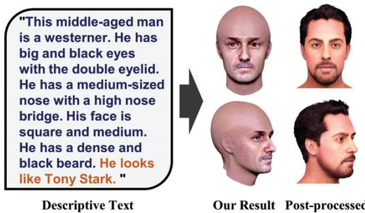  
Figure 1. Given a text describing the appearance (left), our method can synthesize high-quality 3D faces (middle) containing 3D mesh and textures. The resulting model can be easily processed into a rigged face with hair and accessories (right). The dark blue texts indicate concrete descriptions and the brown texts indicate abstract descriptions, and similarly hereinafter.

In this work, we aim at tackling the task of high-fidelity 3D face generation from natural text descriptions from the above two perspectives. We first build a 3D-face-text dataset (named DESCRIBE3D), which contains 1, 627 highquality 3D faces from HeadSpace dataset [6] and FaceScape dataset [48, 55], and fine-grained manually-labeled facial features. The provided annotations include 25 facial attributes, each of which contains 3 to 8 options describing the facial feature. Our dataset covers various races and ages and is delicate in 3D shape and texture. We then propose a two-stage synthesis pipeline, which consists of a concrete synthesis stage mapping the text space to the 3D shape and texture space, and an abstract synthesis stage refining the 3D face with a prompt learning strategy. The mapping for different facial features is disentangled and the diversity of the generative model can be controlled by the additional input of random seeds. As shown in Figure 1, our proposed model can take any word description or combination of phrases as input, and then generate an output of a finetextured 3D face with appearances matching the description. Extensive experiments further validate that the concrete synthesis can generate a detailed 3D face that matches the fine-grained descriptive texts well, and the abstract synthesis enables the network to synthesize abstract features like “wearing makeup” or “looks like Tony Stark”.

In summary, our contributions are as follows:

• We explore a new topic of constructing a high-quality 3D face model from natural descriptive texts and propose a baseline method to achieve such a goal.

• A new dataset - DESCRIBE3D is established with detailed 3D faces and corresponding fine-grained descriptive annotations. The dataset will be released to the public for research purposes.

• The reliable mapping from the text embedding space to the 3D face parametric space is learned by introducing the descriptive code space as an intermediary, which forms the core of our concrete synthesis module. Region-specific triplet loss and weighted $\ell _ { 1 }$ loss further boost the performance.

• Abstract learning based on CLIP is introduced to further optimize the parametric 3D face, enabling our results to conform with abstract descriptions.

## 2. Related Work

To the best of our knowledge, work that directly studies text-to-3D-face generation is quite limited. In this section, we review three relevant topics and discuss the connections along with differences with our proposed task and method. Text-to-shape. Chen et al. [5] proposed to generate colored 3D shapes from natural language by learning implicit crossmodal connections between language and physical properties of 3D shapes. In further research, Liu et al. [28] proposed to decouple the shape and color predictions for learning features in both texts and shapes and propose the word-level spatial transformer to correlate word features from text with spatial features from shape. In several subsequent studies [4, 20, 30], CLIP [34] played an important role which is a large pre-trained vision-language model, and prompt learning is leveraged to harness the powerful representation of the CLIP model. Jain et al. [23] proposed to combine neural rendering with multi-modal image and text representations to synthesize diverse 3D objects from natural language descriptions, and Poole et al. [32] further leverage a pre-trained 2D text-to-image diffusion model and NeRF [31] to perform text-to-3D synthesis with more plausible synthesis.

It is worth noting that among the above researches, only Canfes et al. [4] attempted to generate a 3D face, but their model relies on an unconstrained initial 3D face and only work for short phrases. Leveraging facial priors to achieve fine-grained and high-quality 3D face generation from texts in natural language is still an open problem.

Text-to-image. The study of text-to-2D-image started earlier than that of text-to-3D-shape, most of which are based on the generative adversarial network (GAN) [15]. In earlier research, Reed et al. [35, 36] developed a GANbased deep architecture to generate plausible images of birds and flowers from detailed text descriptions. Zhang et al. [51, 52] proposed stacked generative adversarial networks, which leverage a sketch-refinement process to enhance the resolution of text-driven image generation.Dong et al. [8] proposed a way of synthesizing realistic images given a source image and natural language description and verifying its effectiveness on birds and flowers datasets. In recent years, GAN-based text-to-image methods have come a long way. The progresses include attention-driven multi-stage refinement [47], hierarchical semantic inferring layout [21], global-local attentive and semantic-preserving framework [33], semantic decomposing [50], StyleGAN inversion module [45]. Sun et al. [40] proposed the diverse triplet loss to learn an accurate mapping from the embedding space of CLIP [34] to parametric space of style-GAN [24]. Very recently, diffusion model [19] shows powerful performance in this task [7] and synthesizes impressive images reflecting a high-level understanding of the input description.

The above research works have an enlightening effect on the research of synthesizing a 3D face from descriptive texts, such as the use of the CLIP model, but the two tasks are still very different. Firstly, the representation of 3D faces is much more complex than that of 2D images. Secondly, unlike 2D images that can be easily obtained from the Internet in large quantities, there are very few available 3D face models. These factors determine that text-to-image methods cannot be directly applied to the task of text-to-3D. 3D Face Generation. Early in 1999, Blanz et al. [3] propose a 3D morphable model (3DMM) that is a statistical model built upon a set of 3D faces. Since then, 3DMM has evolved considerably, and we recommend reading Egger et al.’s survey [9] for a comprehensive understanding of these advances. With the breakthrough development of deep learning algorithms, 3DMM is widely used in the task of recovering 3D faces from single image [11,17,38,48,56] or multiple images [2, 46], but the research on generating face models from natural text descriptions is very limited. In recent years, some new attempts have been made to use implicit models such as neural radiation field [22, 29, 57], signed distance field (SDF) [18, 49] and other implicit representations [53, 54] to represent 3D faces.

3D face generation is one of the key components of our task and defines the parametric space for 3D faces, while our work further studies the mapping problem from the text description space to the parametric space of 3D faces.

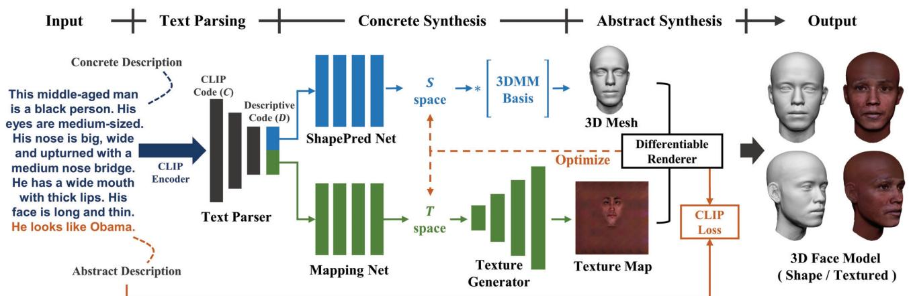  
Figure 2. The overall pipeline consists of three stages: text parsing (Section 3.2), concrete synthesis (Section 3.3), and abstract synthesis (Section 3.4). The dark blue texts indicate concrete descriptions and the brown texts indicate abstract descriptions, and similarly hereinafter.

## 3. Method

In this work, we aim to synthesize a high-quality and faithful 3D head from natural text descriptions. To this end, a three-stage learning-based pipeline is proposed as shown in Figure 2. The text encoder (Section 3.2) first parses the input natural texts and generates a descriptive vector, which is then fed into the module of concrete synthesis (Section 3.3) to predict 3D shape and texture separately. The generated 3D shape and texture are then optimized by abstract synthesis (Section 3.4), then the result 3D face is generated. Our results can be easily processed into a riggable 3D face with full assets. We now explain these submodules in detail.

## 3.1. DESCRIBE3D Dataset

To establish an accurate mapping from natural language to 3D faces, we first need pairs of the 3D model and its matching text description. However, to the best of our knowledge, there is no 3D face model dataset with detailed textual descriptions available. In this work, we build the first fine-grained descriptive 3D face dataset (referred to as DESCRIBE3D dataset) to train our text-to-3D-face model.

Our dataset contains 1, 627 3D face models collected from HeadSpace [6] and FaceScape [48,55] datasets, covering the four major races: Mongoloid, Caucasoid, Negroid, Australoid, and with the range of ages from 16 to 69. We process the raw scanned 3D faces from HeadSpace and FaceScape to uniform their mesh topology. For 3D shape representation, we align all 3D faces into a canonical space with Procrustes analysis [16] and non-rigid iterative closest point (NICP) algorithm [1]. These aligned 3D faces are assigned with a uniform mesh topologically containing 26, 369 vertices and 52, 536 triangle faces. For texture representation, we align all texture maps into a uniform UV coordinate that is attached to the uniform mesh topology.

We then manually annotate these 3D faces to obtain detailed facial shapes and appearance features. As shown in Figure 3, our annotations of the 3D faces contain 25 labels from single-choice questions and a free-style text description, covering features including facial shape, appearance, and free-style descriptions. Then, we generate a concrete descriptive text by filling all features into multiple pre-designed sentence templates, such as “His [eyes] are [medium-sized]” and “He has [wide mouth with thick lips]” (an example shown in Figure 2). A detailed list of sentence patterns will be shown in the supplementary material. These generated sentences are finally combined with the collected text written by human annotators to form a complete description of a human face, which we refer to as concrete descriptions (as opposed to abstract descriptions to be defined in Section 3.4). The average length of concrete descriptions is 79 tokens.

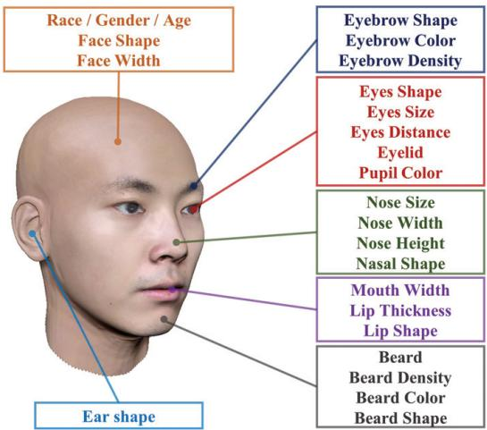  
Figure 3. Our annotations of the 3D faces contain 25 single-choice questions regarding to the attributes shown above and a freestyle text description. These attributes are categorized into shaperelated, color-related, and general-related attributes. A complete questionnaire will be provided in the supplementary material.

## 3.2. Text Parser

The text parser aims at encoding the input natural language into a descriptive code d that can be mapped into the 3D facial model space. In this work, we adopt CLIP [34], a large language–image pre-training model, to encode the description texts into a CLIP embedding. In pilot studies, we observed that directly predicting 3D faces from such embedding did badly in mapping performance, partly because of the high complexity of the text descriptions.We thus propose to first predict a descriptive code derived from our labeled data from the CLIP embedding, and then synthesize the 3D faces from such descriptive code. Specifically, the descriptive code is a $p \times q$ matrix, with $p$ rows representing $p$ different annotated facial attributes, and each column is an q-dimension one-hot vector describing this attribute. The motivation behind such design is simple – the introduction of the descriptive code decomposes a complex mapping task into two simpler tasks: to predict the descriptive code from the text and to synthesize 3D faces from the descriptive code.

Our text parser is an 8-layer MLP, which takes the CLIP embedding as input and predicts the descriptive code. Given the predicted code $\hat { y }$ and ground-truth y, the loss function to train the text parser is formulated as:

$$
L _ { p a r s e } = - \frac { 1 } { p } \sum _ { i = 1 } ^ { p } \sum _ { j = 1 } ^ { q } y _ { i j } \log \mathrm { s o f t m a x } ( \hat { y } _ { i j } ) ,\tag{1}
$$

where i is the index of the annotated facial attributes, and $j$ is the index of the feature option to describe this attribute. As 3D registration loses most features about the ear in the DESCRIBE3D dataset, the descriptive code doesn’t contain the annotation of ear shape. So we set $p = 2 4$ and $q = 8$ in all the experiments.

## 3.3. Concrete Synthesis

The network of concrete synthesis takes the predicted descriptive code as input and aims at generating a set of diverse 3D faces that faithfully match the concrete text descriptions. Considering that a 3D face model contains 3D shapes and textures, we first separate the descriptive code d into shape-related code $d _ { S }$ and texture-related code $d _ { T }$ according to our annotation, then use two sub-networks to synthesize 3D shapes and textures, respectively.

Shape Generation Network. We leverage a 3D morphable model (3DMM) to represent the 3D facial shape in a Sspace, and an MLP is used to predict 3DMM parameters $s \in \ V$ from the shape-related descriptive code $d _ { S } ,$ , referred to as ShapePred Net in Figure 2. Other than predicting 3DMM parameters, another approach to generate 3D shapes is to directly predict a 3D polygon mesh [12] or a position map [14]. In essence, the introduction of 3DMM is equivalent to converting large-scale 3D shapes into low-dimensional parametric space, which provides a strong prior to reducing the difficulty of the shape generation task. Through the experiments (4.4), we found that predicting 3DMM parameters leads to more accurate mapping than directly predicting position maps in our task.

Following FaceScape [48, 55], we generate the 3DMM model from the 3D polygon mesh models in the training set with Principle Components Analysis (PCA) [44]. Specifically, given m facial mesh models and each of which contains n vertices, a $m \times n$ tensor is built representing all these vertices in the training set. We use Tucker decomposition [42] to decompose the m × n tensor to a small PCA basis matrix B and a lower m′-dimensional factor representing facial identity. A new set of vertices v representing 3D face shape can be generated given an arbitrary 3DMM parameter s as:

$$
v = B \times s .\tag{2}
$$

In this way, large-scale data of 3D facial shapes are mapped into an m′-dimensional parameter space, referred to as S-space. In all our experiments, we set $m = 1 , 6 2 7$ $m ^ { \prime } = 3 0 0 .$ , and n = 26, 369.

In this work, we experiment with the following two types of losses to train the ShapePred Net: weighted $\ell _ { 1 }$ loss and region-specific triplet (RST) loss.

Weighted $\ell _ { 1 }$ loss. Through a differentiable 3DMM mapping module, the predicted 3DMM parameters can be transformed into the 3D positions of the vertices. We found that applying $\ell _ { 1 }$ loss directly to all vertices resulted in an overall average result. We use a weighted mask similar to PRNet [13] to calculate the loss for different regions. The weighted $\ell _ { 1 }$ loss function is formulated as:

$$
L _ { w \ell _ { 1 } } = \sum _ { i } \alpha _ { i } \times \| \hat { v _ { i } } - v _ { i } \| _ { 1 } ,\tag{3}
$$

where $v _ { i }$ represents the vertices of i-th region, and $\alpha _ { i }$ represents the corresponding weight. Here we divide the whole head mesh model into four regions: (1) 68 facial landmarks; (2) eyes, nose, and mouth; (3) the other facial regions; and (4) the back of the head with ears. The weights for these regions are set as 16 : 4 : 3 : 0.

Region-specific Triplet (RST) Loss. To enhance the diversity of the generated 3D shape, we propose RST loss to train the 3DMM regressor. Triplet loss was firstly proposed in FaceNet [39] and widely used in the task of face recognition, then was introduced into the task of image generation [40, 43]. The key idea behind this is to make the difference between prediction and positive examples minor, and the difference between prediction and negative examples greater.

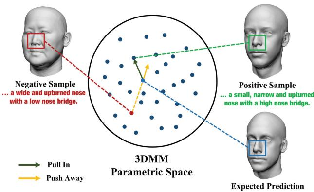  
Figure 4. Region-Specific Triplet loss (RST loss). For a specific region like the nose, RST loss pushes the prediction away from the negative sample and close to the positive sample.

Different from previous works that measure the difference of the samples in the parametric space, we propose to measure the difference with mean Euclidean distance and apply weights for different regions. Specifically, we divide the human face into eyes, nose, mouth and others, and treat them separately in the training phase. As shown in Figure 4, in each training iteration, we randomly select positive-negative pairs for a random region and compute RST loss, which is formulated as:

$$
L _ { R S T } = \operatorname* { m a x } ( \| \hat { v _ { i } } - v _ { i } \| _ { 1 } - \| \hat { v _ { i } } - v _ { i } ^ { * } \| _ { 1 } + m _ { i } , 0 ) \cdot \lambda _ { i } ,\tag{4}
$$

where $\hat { v _ { i } }$ is the predicted vertices of i-th region, $v _ { i }$ is the corresponding ground-truth, and $v _ { i } ^ { * }$ is its counter example. $m _ { i }$ and $\lambda _ { i }$ represent corresponding region margin and weight respectively.

Texture Generation Network. We represent the color of 3D faces with UV texture maps that are attached to the triangle mesh generated by our 3DMM. As shown in Figure 2, we adopt a mapping net to map the shape-related descriptive code $d _ { S }$ into a 3DMM code $s ,$ and a texture generator network to synthesize a UV texture map from the parameter in $T$ space. Here we use StyleGAN2 [25, 37, 41] as the backbone, which is an alternative generator architecture for generative adversarial networks. The input of Style-GAN is a random latent code together with a condition code representing facial features, then these codes are mapped into a W space where different facial features are disentangled, and the 2D images are synthesized from $w \in W$ by a convolutional neural network. In our implementation, our mapping net, texture generator, and $T$ space are corresponding to the mapping network, synthesis network, and W space of StyleGAN, respectively. In the training phase, the StyleGAN2 is re-trained with the UV texture maps in our DESCRIBE3D dataset as images, and the descriptive code $d _ { T }$ as the condition input. The loss function and hyperparameters are the same as the StyleGAN2.

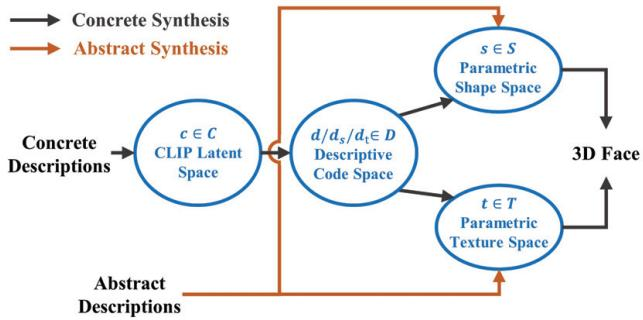  
Figure 5. Relationship of the involved parametric spaces.

## 3.4. Abstract Synthesis

After a full 3D head model with color is produced from the concrete descriptions, we can further improve the model with the abstract descriptions in the input texts, which we refer to as abstract synthesis. Abstract descriptions are in free-style describing a certain non-objective characteristic, such as “looks like Tony Stark” or “wearing makeup”. As shown in Figure 5, the key idea behind is to leverage prompt learning based on CLIP [34], a large language-vision pretrained model, to optimize the parameters in $T$ texture space and S 3DMM space. Specifically, with the trained and fixed model of the concrete synthesis network, both input abstract descriptions texts and the predicted 3D faces (rendered into image) are encoded into the CLIP latent space. Then the texture parameter t and 3DMM parameter s are optimized to minimize the difference between the predicted 3D face and abstract text descriptions in the CLIP latent space.

Considering that the CLIP model is trained on real-world images, a differentiable renderer is indispensable which renders the generated 3D mesh and UV texture into a portrait. Specifically, we use redner [27] to render textured mesh as real images at three viewpoints ranging from $- 3 0 ^ { \circ }$ to $+ 3 0 ^ { \circ }$ and calculate the cosine similarity between the rendered image and the input prompt. The loss function for refining s and t is formulated as:

$$
L _ { C L I P } = 1 - \left. E _ { T } ( t ) , E _ { I } ( i ) \right. ,\tag{5}
$$

where $E _ { T }$ and $E _ { I }$ represent the CLIP text encoder and image encoder respectively, t and i represent the input description and the rendered image, and $\langle \cdot , \cdot \rangle$ represents the cosine similarity.

We propose to use CLIP Loss to optimize the parameters in the $S$ space and $T$ space generated by the pre-trained model and predict a textured mesh that better matches our prompt description. We set the number of iterations to 200 by default.

We also add two regularization losses to constrain S space and $T$ space. Our complete loss function is:

$$
L _ { a b s t r a c t } = L _ { C L I P } + \beta _ { 1 } \| \hat { s } - s _ { o } \| _ { 2 } + \beta _ { 2 } \| \hat { t } - t _ { o } \| _ { 2 } ,\tag{6}
$$

"This old man is Westerner. His face is oval and fat. His eyes are small and triangular. He has a downturned mouth, He has a high nose bridge. He looks like Anthony Hopkins.'

"This girl is Asian. She has small and slender eyes with single eyelids. Her nose is small and wide. Her face is hearted-shaped and medium. She's wearing makeup. "

"This girl is Asian. She has   
medium-sized and almond eyes   
with single eyelids. Her nose is   
small and wide. Her face is   
hearted-shaped and medium. She   
has pimples on the face"

"This middle-aged man is Westerner, His face is oval and fat. His eves are medium-sized and almond with single eyelids. His nose is big and wide with a high nose bridge, He has a sparse black beard. He looks like the Rock."

"This middle-aged woman is Asian.   
She has medium-sized eves. She   
has a big and wide nose with a low   
nose bridge. She has a sparse   
eyebrow. Her face is oval and   
medium. She has wrinkles."

Input Text

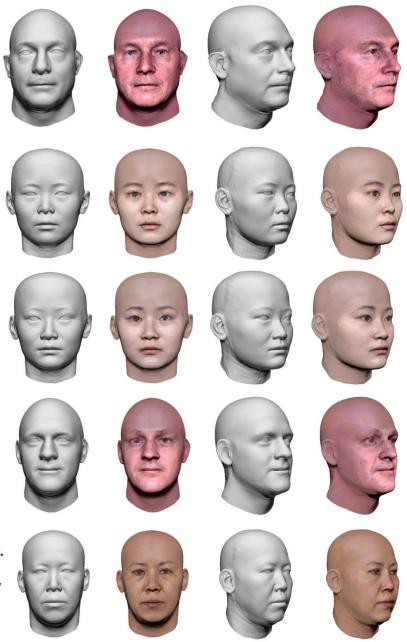  
Concrete Synthesis

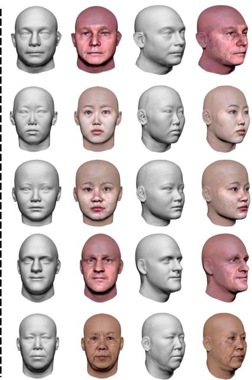  
Abstract Synthesis

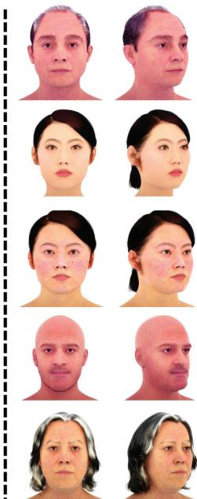  
Post-processed

Figure 6. Qualitative evaluations of our method for text-to-3D face generation. Our pipeline can synthesize 3D faces from concrete (dark blue text) and abstract descriptions (brown text). The hairs and additional accessories can be easily added in the post-process phase.

where $s _ { o }$ and $t _ { o }$ represent the initial value from the concrete synthesis module. It is worth noting that the abstract synthesis is optional and can be conducted multiple times if more than one prompt text is provided. We set $\beta _ { 1 } = 3$ and $\beta _ { 2 } { = } 0 . 0 0 3$ by default.

## 4. Experiments

## 4.1. Implementation Details

Training of Text Parser. We randomly generate 1 million pieces of text descriptions and corresponding descriptive codes d according to our face attribute correspondences, where the text is generated by preset sentence patterns and each text description randomly contains 3 to all 24 attributes. The detailed templates and samples will be shown in the supplementary material. We use the CLIP model to encode the concrete descriptions into 512-dimensional latent code c and train an 8-layer MLP through a crossentropy loss to map CLIP code c to descriptive code d. We use Adam [26] optimizer with a learning rate beginning at 0.001 and decaying after 10 epochs until 20 epochs. We set the batch size to 128.

Training of Shape Generator. We use our DESCRIBE3D dataset to form our training sets. We use PCA to convert the model into a 300-dimensional vector and generate corresponding one-hot code from text annotations to form data pairs. For all data, we randomly select 80% for training and the other 20% for testing. We use weighted $\ell _ { 1 }$ Loss and RST Loss to train our shape generator, an 8-layer MLP. In the first layer, we concatenate the input one-hot code and a 512-dimensional normally distributed noise into the network to generate diverse results. We use ReLU as our activation function.

Training of Texture Synthesis Networks. We follow the hyper-parameters and training settings of StyleGAN to train the mapping network and texture generator. The resolution of the UV texture maps for training and testing is 512×512.

## 4.2. Qualitative Evaluation

We present our main experimental results in Figure 6. We observe that our proposed method can synthesize 3D faces that exactly match the input concrete descriptions (text in dark blue in Figure 6), then these generated 3D faces can be improved to reflect abstract descriptions (text in brown), including “look likes Anthony Hopkins”, “be wearing makeup”, etc. The hairs and additional accessories can also be easily added via 3D modeling software like MetaHuman Creator [10] (right column of Figure 6). More results will be shown in the supplementary material.

## 4.3. Comparison Experiments

We compare our method with the two most relative previous works. We use Chamfer Distance (CD), Complete Rate (CR) to measure the accuracy of the generated 3D shape, and use Relative Face Recognition Rate (RFRR) [40] to measure the identity similarity of the textured 3D face. The precise definition of these metrics will be explained in the supplementary material.

"This middle-aged woman is a westerner Her face is square and medium. She has big and round eyes"

"This young man is Asian. His face is diamond and thin. His eyes are medium-sized and almond. His nose is big and wide with a high nose bridge. He has dense black evebrows"

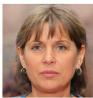  
"This middle-aged woman is a westerner. Her face is round and fat. She has big and round eyes. His nose is big with a high nose bridge"

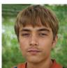  
"This man is Asian. He has medium-sized and almond eyes with single eyelids. His nose is medium-sized, medium-width and upturned with a low nose bridge. His face is long and thin"

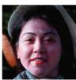

Result Image of TediGAN  
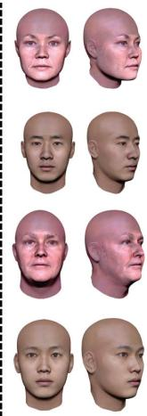  
Input Text  
Result 3D Face of DECA  
Result 3D Face of Ours

Figure 7. Comparison with TediGAN [45]+DECA [11]. The red texts indicate the descriptions that the results of TediGAN+DECA do not match.  
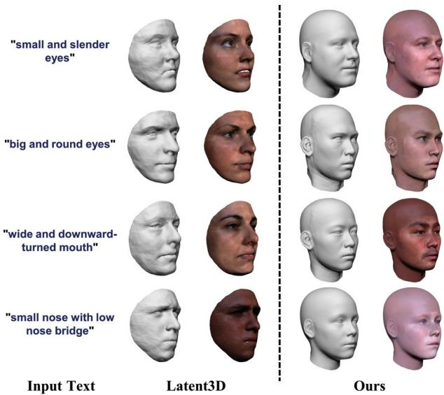  
Figure 8. Comparison with Latent3D [4].

Text-Image-Shape. The task of generating a 3D face from descriptive texts can be achieved by cascading the Text-to-Image model and Image-to-Shape model in an end-to-end manner. Here we choose TediGAN [45], a SOTA Text-to-Image model, and DECA [11], a SOTA single-view face reconstruction model to compose the Text-to-Shape model. As shown in Figure 7, the Text-Image-Shape strategy fails to match many input descriptions (red texts), and Table 1 shows that our method outperforms Text-Image-Shape in all three metrics. We believe this is due to the fact that the TediGAN and DECA cannot be optimized end-to-end. Besides, depth ambiguity commonly exists in the in-the-wild image datasets, which leads to inaccurate shape generation of the Text-Image-Shape strategy.

Latent3D [4]. Latent3D can synthesize a 3D face using text or image-based prompts. As Latent3D can only work for short sentence input, while the performance degraded severely for a long paragraph, we only fed a short descriptive sentence into Latent3D for comparison. Besides, Latent3D set a random face as an initial face for refinement, and we select a random seed to generate the initial face in the comparison experiment. As shown in Figure 8, the result generated by Latent3D fail to recover fine-grained facial features like “round face” and “slender eyes”. Besides, Latent3D relies on an initial guess, and the descriptions can not be matched if the initial guess if the initial value deviates too much from the description. By contrast, our method synthesizes a 3D face that conforms to the description and also supports more detailed descriptions as input. The quantitative evaluation shown in Table 2 also demonstrates the superior performance of our model.

Table 1. Quantitative comparison with Text-Image-Shape.
<table><tr><td>Method</td><td>CD (mm) ↓</td><td>CR (%) ↑</td><td>RFRR ↑</td></tr><tr><td>Text-Image-Shape</td><td>2.78</td><td>83.9</td><td>0.471</td></tr><tr><td>Ours</td><td>2.26</td><td>96.7</td><td>0.788</td></tr></table>

Table 2. Quantitative comparison with Latent3D (only the front face error is calculated due to the generative form of Latent3D).
<table><tr><td>Method</td><td>CD (mm)↓</td><td>CR (%) ↑</td><td>RFRR ↑</td></tr><tr><td>Latent3d [4]</td><td>2.40</td><td>94.3</td><td>0.542</td></tr><tr><td>Ours</td><td>1.53</td><td>99.1</td><td>0.778</td></tr></table>

## 4.4. Ablation Study

Effect of Text Parser and Concrete Synthesis. To validate the effectiveness of the introduction of descriptive code, 3DMM representation, RST loss, and the weights for $\ell _ { 1 }$ loss, we conduct the experiments with the following settings:

• (a) Without Descriptive Code: The descriptive code is not used and the embedding vector generated from the input text by the CLIP encoder is directly fed into the concrete synthesis module.

• (b) Without 3DMM: The network of 3DMM parameter regressing is replaced by a position map generator, of which the backbone is StyleGAN2 [25].

• (c) Without RST loss: The RST loss is removed from the loss function of the shape generation network.

• (d) Without weights of $\ell _ { 1 }$ loss: The weights in the $\ell _ { 1 }$ loss to train the shape generation network are set to 1.

The visualized results of the ablation study are shown in Figure 9. We can see that our full method generates a detailed faithful 3D face. Comparing (a) with (h), we find the results of (a) failed to match the input descriptions, which verified that the introduction of parsed supervision improves the effectiveness of our model. We consider

(c) w/o RST

(g) w/o Render

(f) w/o Opti

(a) w/o Parser

"Her eyes are big, round and black with single eyelids. Her eye distance is medium. She

has a small, wide and upturned nose with a high nose bridge. She has round and black eyebrows. She has a wide mouth and bow-shaped, thick lips. This young woman is Asian. Her face is round and fat. She is wearing makeup."

“This middle-aged woman is a westerner. Her face is diamond and thin. She has big and round eyes. Her nose is medium-sized,   
narrow and upturned with a   
high nose bridge. She has a wide mouth with thin lips. She has wrinkles."

Input Text

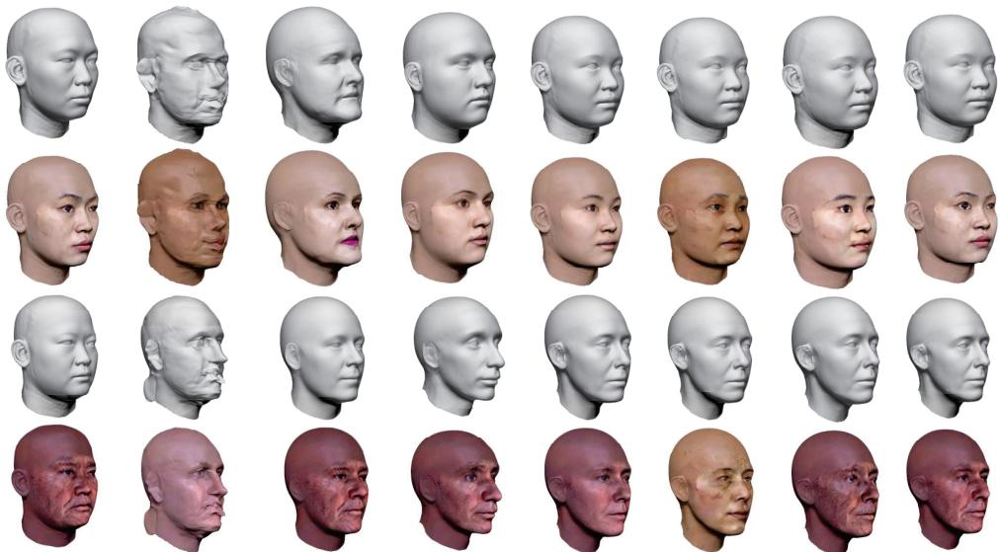  
(b) w/o 3DMM  
(d) w/o Weight  
(e) w/o Abstract  
Figure 9. Generated 3D faces when removing or replacing a certain module in our proposed pipeline for ablation study.

the reason is that the introduction of descriptive code decouples the complex text-to-3D problem into two simpler problems: 1) parsing text to explicitly categorized facial features in the form of one-hot code and 2) generating 3D face from this one-hot code. Comparing (b) with (h), we find the directly predicted shape is distorted, which demonstrates that 3DMM based shape generator is superior to a non-parametric generator in our task. Comparing (c) and (d) with (h), we find the facial features in (c) and (d) are not obvious, though most of the features match the input description. It demonstrates that the recognition of the resulting facial features is enhanced after the RST loss and the weights for $\ell _ { 1 }$ loss is implemented.

Effect of Abstract Synthesis. To validate the effectiveness of the abstract synthesis, optimization method, and differentiable render, we conduct the experiments with the following settings:

• (e) without abstract synthesis: The phase of abstract synthesis is removed.

• (f) prompt: optimization → train : In the abstract synthesis phase, the strategy to optimize s and t is changed to adding CLIP loss to the loss function and fine-tuning the model of the concrete synthesis network.

• (g) without differentiable renderer: In the abstract synthesis phase, the differentiable renderer is removed, and only UV texture is updated through CLIP loss.

We draw the following observations. Comparing (e) with (h), we can see that the abstract descriptions of “makeup” and “wrinkles” appear in (h) while the other facial features are consistent with (e), which demonstrates the effectiveness of abstract synthesis. Comparing (f) with (e), we find the training with clip loss failed to synthesize abstract features while the other facial features in (e) are not maintained. By contrast, the prompt learning strategy in (h) synthesizes more plausible results. Comparing (g) with (h), we find that our method without differentiable render may hallucinate unnatural features. For example, in the first line, the lipstick color in (g) is painted beyond the lips. We consider the reason is that the CLIP model is trained using realworld images, but the UV texture space is distorted compared to the real space, so a differentiable renderer is a requisite to transform the facial appearance from UV texture space to real-world space.

## 5. Conclusion

In this work, we investigate the problem of generating a 3D face from descriptive texts in natural language. To this end, a DESCRIBE3D dataset is developed by annotating descriptions to large-scale 3D face datasets. We first train neural networks to generate a 3D face matching the concrete description and random coding, then optimize the parameters of 3DMM and StyleGAN space with abstract description to further refine the 3D face model. Experiments show that our method can produce a faithful 3D face that conforms to the input description.

There are some drawbacks to our approach. First, our method requires a pre-distinction between concrete and abstract descriptions, and the performance degrades when the input sentences are significantly different from the template sentences we adopt. Besides, as the number of races in the dataset is not balanced, the modeling effect of the facial features of some ethnic minorities is poor.

Acknowledgement. This work was supported by the NSFC grant 62001213, 62025108, and gift funding from Huawei Research and Tencent Rhino-Bird Research Program.

## References

[1] Brian Amberg, Sami Romdhani, and Thomas Vetter. Optimal step nonrigid icp algorithms for surface registration. In CVPR, pages 1–8. IEEE, 2007. 3

[2] Ziqian Bai, Zhaopeng Cui, Jamal Ahmed Rahim, Xiaoming Liu, and Ping Tan. Deep facial non-rigid multi-view stereo. In CVPR, pages 5850–5860, 2020. 2

[3] Volker Blanz and Thomas Vetter. A morphable model for the synthesis of 3d faces. In SIGGRAPH, pages 187–194, 1999. 2

[4] Zehranaz Canfes, M Furkan Atasoy, Alara Dirik, and Pinar Yanardag. Text and image guided 3d avatar generation and manipulation. arXiv preprint arXiv:2202.06079, 2022. 2, 7

[5] Kevin Chen, Christopher B Choy, Manolis Savva, Angel X Chang, Thomas Funkhouser, and Silvio Savarese. Text2shape: Generating shapes from natural language by learning joint embeddings. In ACCV, pages 100–116. Springer, 2018. 2

[6] Hang Dai, Nick Pears, William Smith, and Christian Duncan. Statistical modeling of craniofacial shape and texture. IJCV, 128(2):547–571, 2020. 1, 3

[7] Prafulla Dhariwal and Alexander Nichol. Diffusion models beat gans on image synthesis. NIPS, 34:8780–8794, 2021. 2

[8] Hao Dong, Simiao Yu, Chao Wu, and Yike Guo. Semantic image synthesis via adversarial learning. In ICCV, pages 5706–5714, 2017. 2

[9] Bernhard Egger, William AP Smith, Ayush Tewari, Stefanie Wuhrer, Michael Zollhoefer, Thabo Beeler, Florian Bernard, Timo Bolkart, Adam Kortylewski, Sami Romdhani, et al. 3d morphable face models—past, present, and future. TOG, 39(5):1–38, 2020. 2

[10] Zhixin Fang, Libai Cai, and Gang Wang. Metahuman creator the starting point of the metaverse. In ISCTIS, pages 154– 157. IEEE, 2021. 6

[11] Yao Feng, Haiwen Feng, Michael J Black, and Timo Bolkart. Learning an animatable detailed 3d face model from in-thewild images. TOG, 40(4):1–13, 2021. 2, 7

[12] Yutong Feng, Yifan Feng, Haoxuan You, Xibin Zhao, and Yue Gao. Meshnet: Mesh neural network for 3d shape representation. In AAAI, volume 33, pages 8279–8286, 2019. 4

[13] Yao Feng, Fan Wu, Xiaohu Shao, Yanfeng Wang, and Xi Zhou. Joint 3d face reconstruction and dense alignment with position map regression network. In ECCV, pages 534–551, 2018. 4

[14] Baris Gecer, Alexandros Lattas, Stylianos Ploumpis, Jiankang Deng, Athanasios Papaioannou, Stylianos Moschoglou, and Stefanos Zafeiriou. Synthesizing coupled 3d face modalities by trunk-branch generative adversarial networks. In ECCV, pages 415–433. Springer, 2020. 4

[15] Ian Goodfellow, Jean Pouget-Abadie, Mehdi Mirza, Bing Xu, David Warde-Farley, Sherjil Ozair, Aaron Courville, and Yoshua Bengio. Generative adversarial networks. Communications ofthe ACM, 63(11):139–144, 2020. 2

[16] John C Gower. Generalized procrustes analysis. Psychometrika, 40(1):33–51, 1975. 3

[17] Jianzhu Guo, Xiangyu Zhu, Yang Yang, Fan Yang, Zhen Lei, and Stan Z Li. Towards fast, accurate and stable 3d dense face alignment. In ECCV, pages 152–168. Springer, 2020. 2

[18] Longwei Guo, Hao Zhu, Yuanxun Lu, Menghua Wu, and Xun Cao. Rafare: Learning robust and accurate nonparametric 3d face reconstruction from pseudo 2d&3d pairs. In AAAI, 2023. 2

[19] Jonathan Ho, Ajay Jain, and Pieter Abbeel. Denoising diffusion probabilistic models. NIPS, 33:6840–6851, 2020. 2

[20] Fangzhou Hong, Mingyuan Zhang, Liang Pan, Zhongang Cai, Lei Yang, and Ziwei Liu. Avatarclip: Zero-shot text-driven generation and animation of 3d avatars. TOG, 41(4):1–19, 2022. 2

[21] Seunghoon Hong, Dingdong Yang, Jongwook Choi, and Honglak Lee. Inferring semantic layout for hierarchical textto-image synthesis. In CVPR, pages 7986–7994, 2018. 2

[22] Yang Hong, Bo Peng, Haiyao Xiao, Ligang Liu, and Juyong Zhang. Headnerf: A real-time nerf-based parametric head model. In CVPR, pages 20374–20384, 2022. 2

[23] Ajay Jain, Ben Mildenhall, Jonathan T Barron, Pieter Abbeel, and Ben Poole. Zero-shot text-guided object generation with dream fields. In CVPR, pages 867–876, 2022. 2

[24] Tero Karras, Samuli Laine, and Timo Aila. A style-based generator architecture for generative adversarial networks. In CVPR, pages 4401–4410, 2019. 2

[25] Tero Karras, Samuli Laine, Miika Aittala, Janne Hellsten, Jaakko Lehtinen, and Timo Aila. Analyzing and improving the image quality of StyleGAN. In CVPR, 2020. 5, 7

[26] Diederik P Kingma and Jimmy Ba. Adam: A method for stochastic optimization. ICLR, 2014. 6

[27] Tzu-Mao Li, Miika Aittala, Fredo Durand, and Jaakko Lehti-´ nen. Differentiable monte carlo ray tracing through edge sampling. TOG, 37(6):1–11, 2018. 5

[28] Zhengzhe Liu, Yi Wang, Xiaojuan Qi, and Chi-Wing Fu. Towards implicit text-guided 3d shape generation. In CVPR, pages 17896–17906, 2022. 2

[29] Stephen Lombardi, Tomas Simon, Gabriel Schwartz, Michael Zollhoefer, Yaser Sheikh, and Jason Saragih. Mixture of volumetric primitives for efficient neural rendering. TOG, 40(4):1–13, 2021. 2

[30] Oscar Michel, Roi Bar-On, Richard Liu, Sagie Benaim, and Rana Hanocka. Text2mesh: Text-driven neural stylization for meshes. In CVPR, pages 13492–13502, 2022. 2

[31] Ben Mildenhall, Pratul P Srinivasan, Matthew Tancik, Jonathan T Barron, Ravi Ramamoorthi, and Ren Ng. Nerf: Representing scenes as neural radiance fields for view synthesis. Communications of the ACM, 65(1):99–106, 2021. 2

[32] Ben Poole, Ajay Jain, Jonathan T Barron, and Ben Mildenhall. Dreamfusion: Text-to-3d using 2d diffusion. arXiv preprint arXiv:2209.14988, 2022. 2

[33] Tingting Qiao, Jing Zhang, Duanqing Xu, and Dacheng Tao. Mirrorgan: Learning text-to-image generation by redescription. In CVPR, pages 1505–1514, 2019. 2

[34] Alec Radford, Jong Wook Kim, Chris Hallacy, Aditya Ramesh, Gabriel Goh, Sandhini Agarwal, Girish Sastry,

Amanda Askell, Pamela Mishkin, Jack Clark, et al. Learning transferable visual models from natural language supervision. In ICML, pages 8748–8763. PMLR, 2021. 2, 4, 5

[35] Scott Reed, Zeynep Akata, Xinchen Yan, Lajanugen Logeswaran, Bernt Schiele, and Honglak Lee. Generative adversarial text to image synthesis. In ICML, pages 1060–1069. PMLR, 2016. 2

[36] Scott E Reed, Zeynep Akata, Santosh Mohan, Samuel Tenka, Bernt Schiele, and Honglak Lee. Learning what and where to draw. NIPS, 29, 2016. 2

[37] Elad Richardson, Yuval Alaluf, Or Patashnik, Yotam Nitzan, Yaniv Azar, Stav Shapiro, and Daniel Cohen-Or. Encoding in style: a stylegan encoder for image-to-image translation. In CVPR, pages 2287–2296, 2021. 5

[38] Soubhik Sanyal, Timo Bolkart, Haiwen Feng, and Michael J Black. Learning to regress 3d face shape and expression from an image without 3d supervision. In CVPR, pages 7763– 7772, 2019. 2

[39] Florian Schroff, Dmitry Kalenichenko, and James Philbin. Facenet: A unified embedding for face recognition and clustering. In CVPR, pages 815–823, 2015. 4

[40] Jianxin Sun, Qiyao Deng, Qi Li, Muyi Sun, Min Ren, and Zhenan Sun. Anyface: Free-style text-to-face synthesis and manipulation. In CVPR, pages 18687–18696, 2022. 2, 4, 6

[41] Omer Tov, Yuval Alaluf, Yotam Nitzan, Or Patashnik, and Daniel Cohen-Or. Designing an encoder for stylegan image manipulation. TOG, 40(4):1–14, 2021. 5

[42] Ledyard R Tucker. Some mathematical notes on three-mode factor analysis. Psychometrika, 31(3):279–311, 1966. 4

[43] Haoyi Wang, Victor Sanchez, and Chang-Tsun Li. Ageoriented face synthesis with conditional discriminator pool and adversarial triplet loss. TIP, 30:5413–5425, 2021. 4

[44] Svante Wold, Kim Esbensen, and Paul Geladi. Principal component analysis. Chemometrics and intelligent laboratory systems, 2(1-3):37–52, 1987. 4

[45] Weihao Xia, Yujiu Yang, Jing-Hao Xue, and Baoyuan Wu. Tedigan: Text-guided diverse face image generation and manipulation. In CVPR, pages 2256–2265, 2021. 2, 7

[46] Yunze Xiao, Hao Zhu, Haotian Yang, Zhengyu Diao, Xiangju Lu, and Xun Cao. Detailed facial geometry recovery from multi-view images by learning an implicit function. In AAAI, volume 36, pages 2839–2847, 2022. 2

[47] Tao Xu, Pengchuan Zhang, Qiuyuan Huang, Han Zhang, Zhe Gan, Xiaolei Huang, and Xiaodong He. Attngan: Finegrained text to image generation with attentional generative adversarial networks. In CVPR, pages 1316–1324, 2018. 2

[48] Haotian Yang, Hao Zhu, Yanru Wang, Mingkai Huang, Qiu Shen, Ruigang Yang, and Xun Cao. Facescape: a large-scale high quality 3d face dataset and detailed riggable 3d face prediction. In CVPR, pages 601–610, 2020. 1, 2, 3, 4

[49] Tarun Yenamandra, Ayush Tewari, Florian Bernard, Hans-Peter Seidel, Mohamed Elgharib, Daniel Cremers, and Christian Theobalt. i3dmm: Deep implicit 3d morphable model of human heads. In CVPR, pages 12803–12813, 2021. 2

[50] Guojun Yin, Bin Liu, Lu Sheng, Nenghai Yu, Xiaogang Wang, and Jing Shao. Semantics disentangling for text-toimage generation. In CVPR, pages 2327–2336, 2019. 2

[51] Han Zhang, Tao Xu, Hongsheng Li, Shaoting Zhang, Xiaogang Wang, Xiaolei Huang, and Dimitris N Metaxas. Stackgan: Text to photo-realistic image synthesis with stacked generative adversarial networks. In ICCV, pages 5907–5915, 2017. 2

[52] Han Zhang, Tao Xu, Hongsheng Li, Shaoting Zhang, Xiaogang Wang, Xiaolei Huang, and Dimitris N Metaxas. Stackgan++: Realistic image synthesis with stacked generative adversarial networks. PAMI, 41(8):1947–1962, 2018. 2

[53] Mingwu Zheng, Hongyu Yang, Di Huang, and Liming Chen. Imface: A nonlinear 3d morphable face model with implicit neural representations. In CVPR, pages 20343–20352, 2022. 2

[54] Yufeng Zheng, Victoria Fernandez Abrevaya, Marcel C´ Buhler, Xu Chen, Michael J Black, and Otmar Hilliges. Im¨ avatar: Implicit morphable head avatars from videos. In CVPR, pages 13545–13555, 2022. 2

[55] Hao Zhu, Haotian Yang, Longwei Guo, Yidi Zhang, Yanru Wang, Mingkai Huang, Qiu Shen, Ruigang Yang, and Xun Cao. Facescape: 3d facial dataset and benchmark for single-view 3d face reconstruction. arXiv preprint arXiv:2111.01082, 2021. 1, 3, 4

[56] Xiangyu Zhu, Zhen Lei, Xiaoming Liu, Hailin Shi, and Stan Z Li. Face alignment across large poses: A 3d solution. In CVPR, pages 146–155, 2016. 2

[57] Yiyu Zhuang, Hao Zhu, Xusen Sun, and Xun Cao. Mofanerf: Morphable facial neural radiance field. In ECCV, 2022. 2