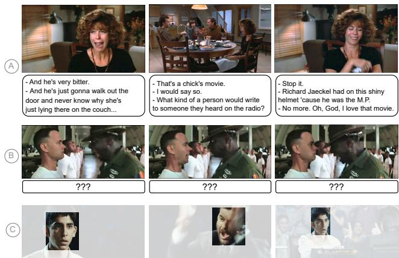
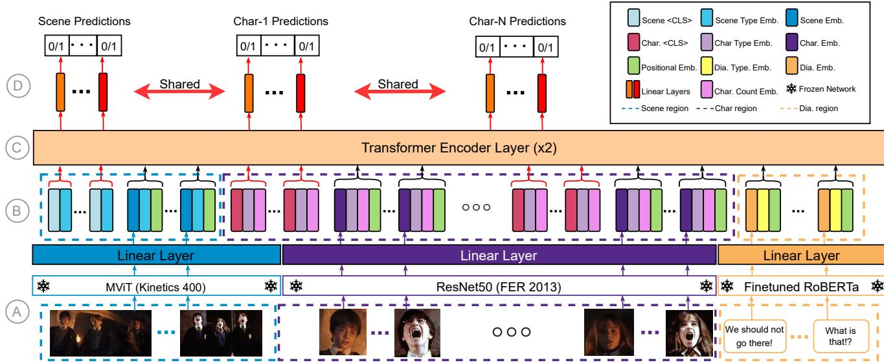
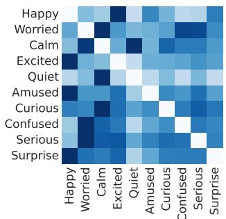
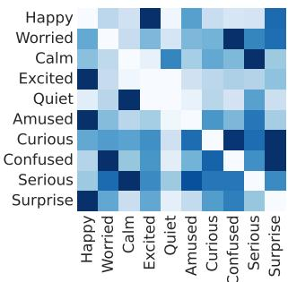
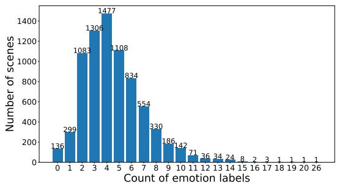
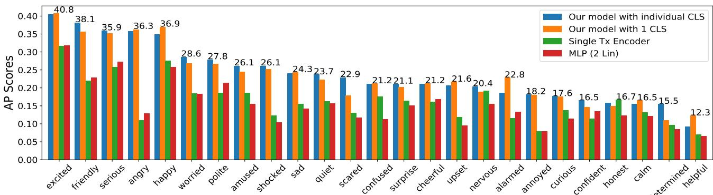
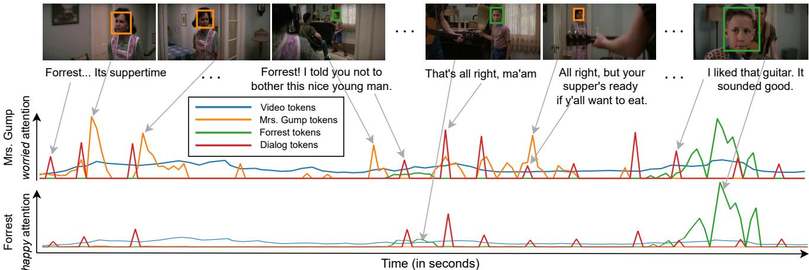
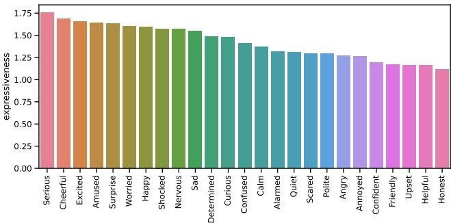

# How you feelin’? Learning Emotions and Mental States in Movie Scenes

Dhruv Srivastava

Aditya Kumar Singh

Makarand Tapaswi

CVIT, IIIT Hyderabad, India

https://katha-ai.github.io/projects/emotx

## Abstract

Movie story analysis requires understanding characters’ emotions and mental states. Towards this goal, we formulate emotion understanding as predicting a diverse and multi-label set of emotions at the level of a movie scene and for each character. We propose EmoTx, a multimodal Transformer-based architecture that ingests videos, multiple characters, and dialog utterances to make joint predictions. By leveraging annotations from the MovieGraphs dataset [72], we aim to predict classic emotions (e.g. happy, angry) and other mental states (e.g. honest, helpful). We conduct experiments on the most frequently occurring 10 and 25 labels, and a mapping that clusters 181 labels to 26. Ablation studies and comparison against adapted stateof-the-art emotion recognition approaches shows the effectiveness ofEmoTx. Analyzing EmoTx’s self-attention scores reveals that expressive emotions often look at character tokens while other mental states rely on video and dialog cues.

## 1. Introduction

In the movie The Pursuit of Happyness, we see the protagonist experience a roller-coaster of emotions from the lows of breakup and homelessness to the highs of getting selected for a coveted job. Such heightened emotions are often useful to draw the audience in through relatable events as one empathizes with the character(s). For machines to understand such a movie (broadly, story), we argue that it is paramount to track how characters’ emotions and mental states evolve over time. Towards this goal, we leverage annotations from MovieGraphs [72] and train models to watch the video, read the dialog, and predict the emotions and mental states of characters in each movie scene.

Emotions are a deeply-studied topic. From ancient Rome and Cicero’s 4-way classification [60], to modern brain research [33], emotions have fascinated humanity. Psychologists use of Plutchik’s wheel [53] or the proposal of universality in facial expressions by Ekman [18], structure has been provided to this field through various theories. Affective emotions are also grouped into mental (affective, behavioral, and cognitive) or bodily states [13].

  
Figure 1. Multimodal models and multi-label emotions are necessary for understanding the story. A: What character emotions can we sense in this scene? Is a single label enough? B: Without the dialog, can we try to guess the emotions of the Sergeant and the Soldier. C: Is it possible to infer the emotions from the characters’ facial expressions (without subtitles and visual background) only? Check the footnote below for the ground-truth emotion labels for these scenes and the supplement for an explanation of the story.

A recent work on recognizing emotions with visual context, Emotic [31] identifies 26 label clusters and proposes a multi-label setup wherein an image may exhibit multiple emotions (e.g. peace, engagement). An alternative to the categorical space, valence, arousal, and dominance are also used as three continuous dimensions [31]. Predicting a rich set of emotions requires analyzing multiple contextual modalities [31, 34, 44]. Popular directions in multimodal emotion recognition are Emotion Recognition in Conversations (ERC) that classifies the emotion for every dialog utterance [42,54,83]; or predicting a single valence-activity score for short ∼10s movie clips [4, 45].

We operate at the level of a movie scene: a set of shots telling a sub-story, typically at one location, among a defined cast, and in a short time span of 30 to 60 s. Thus, scenes are considerably longer than single dialogs [54] or movie clips in [4]. We predict emotions and mental states for all characters in the scene and also by accumulating labels at the scene level. Estimation on a larger time window naturally lends itself to multi-label classification as characters may portray multiple emotions simultaneously (e.g. curious and confused) or have transitions due to interactions with other characters (e.g. worried to calm).

We perform experiments with multiple label sets: Top-10 or 25 most frequently occurring emotion labels in MovieGraphs [72] or a mapping to the 26 labels in the Emotic space, created by [45]. While emotions can broadly be considered as part of mental states, for this work, we consider that expressed emotions are apparent by looking at the character, e.g. surprise, sad, angry; and mental states are latent and only evident through interactions or dialog, e.g. polite, determined, confident, helpful1. We posit that classification in a rich label space of emotions requires looking at multimodal context as evident from masking context in Fig. 1. To this end, we propose EmoTx that jointly models video frames, dialog utterances, and character appearance.

We summarize our contributions as follows: (i) Building on rich annotations from MovieGraphs [72], we formulate scene and per-character emotion and mental state classification as a multi-label problem. (ii) We propose a multimodal Transformer-based architecture EmoTx that predicts emotions by ingesting all information relevant to the movie scene. EmoTx is also able to capture label co-occurrence and jointly predicts all labels. (iii) We adapt several previous works on emotion recognition for this task and show that our approach outperforms them all. (iv) Through analysis of the self-attention mechanism, we show that the model learns to look at relevant modalities at the right time. Selfattention scores also shed light on our model’s treatment of expressive emotions vs. mental states.

## 2. Related Work

We first present work on movie understanding and then dive into visual and multimodal emotion recognition.

Movie understanding has evolved over the last few years from person clustering and identification [6, 7, 19, 29, 46, 65] to analyzing the story. Scene detection [11, 55, 56, 58, 66], question-answering [35, 68, 77], movie captioning [57, 78] with names [50], modeling interactions and/or relationships [21, 32, 43], alignment of text and video storylines [67, 76, 84] and even long-form video understanding [75] have emerged as exciting areas. Much progress has been made through datasets such as Condensed Movies [3], MovieNet [27], VALUE benchmark (goes beyond movies) [37], and MovieGraphs [72]. Building on the annotations from MovieGraphs [72], we focus on another pillar of story understanding complementary to the above directions: identifying the emotions and mental states of each character and the overall scene in a movie.

Visual emotion recognition has relied on face-based recognition of Ekman’s 6 classic emotions [18], and was popularized through datasets such as MMI [49], CK and CK+ [41, 70]. A decade ago, EmotiW [16], FER [24], and AFEW [15] emerged as challenging in-the-wild benchmarks. At the same time, approaches such as [38, 39] introduced deep learning to expression recognition achieving good performance. Breaking away from the above pattern, the Emotic dataset [31] introduced the use of 26 labels for emotion understanding in images while highlighting the importance of context. Combining face features and context using two-stream CNNs [34] or person detections with depth maps [44] were considered. Other directions in emotion recognition include estimating valence-arousal (continuous variables) from faces with limited context [69], learning representations through webly supervised data to overcome biases [48] or improving them further through a joint text-vision embedding space [73]. Different from the above, our work focuses on multi-label emotions and mental states recognition in movies exploiting multimodal context both at the scene- and character-level.

Multimodal datasets for emotion recognition have seen recent adoption. Acted Facial Expressions in the Wild [15] aims to predict emotions from faces, but does not provide any context. The Stanford Emotional Narratives Dataset [47] contains participant shared narratives of positive/negative events in their lives. While multimodal, these are quite different from edited movies and stories that are our focus. The Multimodal EmotionLines Dataset (MELD) [54] is an example of Emotion Recognition in Conversations (ERC) and attempts to estimate the emotion for every dialog utterance in TV episodes from Friends. Different from MELD, we operate at the time-scale of a cohesive story unit, a movie scene. Finally, closest to our work, Annotated Creative Commons Emotional DatabasE (LIRIS-ACCEDE) [4] obtains emotion annotations for short movie clips. However, the clips are quite small (8 to 12 s) and annotations are obtained in the continuous valencearousal space. Different from the above works, we also aim to predict character-level mental states and demonstrate that video and dialog context helps for such labels.

Multimodal emotion recognition methods. RNNs have been used since early days for ERC [28, 42, 62, 74] (often with graph networks [23, 80]) as they allow effective combination of audio, visual, and textual data. Inspired by recent advances, Transformer architectures are also adopted for ERC [12, 61]. External knowledge graphs provide useful commonsense information [22] while topic modeling integrated with Transformers have improved results [83]. Multi-label prediction has also been attempted by considering a sequence-to-set approach [79], however that may not scale with number of labels. While we adopt a Transformer for joint modeling, our goal to predict emotions and mental states for movie scenes and characters is different from ERC. We adapt some of the above methods and compare against them in our experiments. Close to our work, the MovieGraphs [72] emotion annotations are used to model changing emotions across the entire movie [45], and for Temporal Emotion Localization [36]. However, the former tracks one emotion in each scene, while the latter proposes a different, albeit interesting direction.

## 3. Method

EmoTx leverages the self-attention mechanism in Transformers [71] to predict emotions and mental states. We first define the task (Sec. 3.1) and then describe our proposed approach (Sec. 3.2), before ending this section with details regarding training and inference (Sec. 3.3).

## 3.1. Problem Statement

We assume that movies have been segmented automatically [55] or with a human-in-the-loop process [66, 72] into coherent scenes that are self-contained and describe a short part of the story. The focus of this work is on characterizing emotions within a movie scene that are often quite long (30 to 60 s) and may contain several tens of shot changes.

Consider such a movie scene S that consists of a set of video frames V, characters ${ \mathcal { C } } ,$ and dialog utterances $\mathcal { U } .$ Let us denote the set of video frames as $\mathbf { \Psi } \mathcal { V } = \{ f _ { t } \} _ { t = 1 } ^ { T }$ , where $T$ is the number of frames after sub-sampling. Multiple characters often appear in any movie scene. We model N characters in the scene as $\mathcal C = \{ \mathcal P ^ { i } \} _ { i = 1 } ^ { N }$ , where each character $\mathcal { P } ^ { i } = \{ ( f _ { t } , b _ { t } ^ { i } ) \}$ may appear in some frame $f _ { t }$ of the video at the spatial bounding box $b _ { t } ^ { i }$ . We assume that $b _ { t } ^ { i }$ is empty if the character ${ \mathcal { P } } ^ { i }$ does not appear at time t. Finally, $\mathcal { U } = \{ u _ { j } \} _ { j = 1 } ^ { M }$ captures the dialog utterances in the scene. For this work, we use dialogs directly from subtitles and thus assume that they are unnamed. While dialogs may be named through subtitle-transcript alignment [19], scripts are not always available or reliable for movies.

Task formulation. Given a movie scene $s$ with its video, character, and dialog utterance, we wish to predict the emotions and mental states (referred as labels, or simply emotions) at both the scene, $\mathbf { y } ^ { \nu }$ , and per-character, $\mathbf { y } ^ { \mathcal { P } ^ { i } }$ , level. We formulate this as a multi-label classification problem with K labels, $i . e . \textbf { y } = \{ y _ { k } \} _ { k = 1 } ^ { K }$ . Each $y _ { k } \in \{ 0 , 1 \}$ indicates the absence or presence of the $k ^ { \mathrm { { t h } } }$ label in the scene $y _ { k } ^ { \mathcal { V } }$ or portrayed by some character $y _ { k } ^ { \mathcal { P } ^ { i } }$ . For datasets with character-level annotations, scene-level labels are obtained through a simple logical OR operation, i.e. $\mathbf { y } ^ { \nu } = \oplus _ { i = 1 } ^ { N } \mathbf { y } ^ { \mathcal { P } ^ { i } }$

## 3.2. EmoTx: Our Approach

We present EmoTx, our Transformer-based method that recognizes emotions at the movie scene and per-character level. A preliminary video pre-processing and feature extraction pipeline extracts relevant representations. Then, a Transformer encoder combines information across modalities. Finally, we adopt a classification module inspired by previous work on multi-label classification with Transformers [40]. An overview of the approach is presented in Fig. 2.

Preparing multimodal representations. Recognizing complex emotions and mental states (e.g. nervous, determined) requires going beyond facial expressions to understand the larger context of the story. To facilitate this, we encode multimodal information through multiple lenses: (i) the video is encoded to capture where and what event is happening; (ii) we detect, track, cluster, and represent characters based on their face and/or full-body appearance; and (iii) we encode the dialog utterances as information complementary to the visual domain.

A pretrained encoder $\phi _ { \gamma }$ extracts relevant visual information from a single or multiple frames as $\mathbf { f } _ { t } = \phi _ { \mathcal { V } } ( \{ f _ { t } \} )$ . Similarly, a pretrained language model $\phi _ { \mathcal { U } }$ extracts dialog utterance representations as $\mathbf { u } _ { j } = \phi _ { \mathcal { U } } ( u _ { j } )$ . Characters are more involved as we need to first localize them in the appropriate frames. Given a valid bounding box $b _ { t } ^ { i }$ for person ${ \mathcal { P } } ^ { i }$ we extract character features using a backbone pretrained for emotion recognition as $\mathbf { c } _ { t } ^ { i } = \phi _ { \mathcal { C } } ( f _ { t } , b _ { t } ^ { i } )$

Linear projection. Token representations in a Transformer often combine the core information $( e . g .$ . visual representation) with meta information such as the timestamp through position embeddings (e.g. [63]). We first bring all modalities to the same dimension with linear layers. Specifically, we project visual representation $\mathbf { f } _ { t } ~ \in ~ \mathbb { R } ^ { D _ { V } }$ using $\mathbf { W } _ { \mathcal { V } } \in \mathbb { R } ^ { D \times D \nu }$ , utterance representation $\mathbf { u } _ { j } \in \mathbb { R } ^ { D _ { u } }$ using $\mathbf { W } _ { \mathcal { U } } \in \mathbb { R } ^ { D \times D _ { \mathcal { U } } }$ , and character representation $\mathbf { c } _ { t } ^ { i } \in \mathbb { R } ^ { D _ { c } }$ using $\mathbf { W } _ { \mathcal { C } } \in \mathbb { R } ^ { D \times D _ { \mathcal { C } } }$ . We omit linear layer biases for brevity. Modality embeddings. We learn three embedding vectors $\mathbf { E } ^ { \mathcal { M } } \in \dot { \mathbb { R } } ^ { D \times 3 }$ to capture the three modalities corresponding to (1) video, (2) characters, and (3) dialog utterances. We also assist the model in identifying tokens coming from characters by including a special character count embedding, $\mathbf { E } ^ { C } \in \overline { { \mathbb { R } ^ { D \times N } } }$ . Note that the modality and character embeddings do not encode any specific meaning or imposed order (e.g. higher to lower appearance time, names in alphabetical order) - we expect the model to use this only to distinguish one modality/character from the other.

Time embeddings. The number of tokens depend on the chosen frame-rate To inform the model about relative temporal order across modalities, we adopt a discrete time binning strategy that translates real time (in seconds) to an index. Thus, video frame/segment and character box representations fed to the Transformer are associated with their relevant time bins. For an utterance $u _ { j } .$ , binning is done based on its middle timestamp $t _ { j }$ . We denote the time embeddings as $\mathbf { E } ^ { T } \in \mathbb { R } ^ { D \times \lceil T ^ { * } / \dot { \tau } \rceil }$ , where $T ^ { * }$ is the maximum scene duration and $\tau$ is the bin step. For convenience, $\mathbf { E } _ { t } ^ { T }$ selects the embedding using a discretized index $\lceil t / \tau \rceil$

  
Figure 2. An overview of EmoTx. We present the detailed approach in Sec. 3 but provide a short summary here. A: Video features (in blue region), character face features (in purple region), and utterance features (in orange region) are obtained using frozen backbones and projected with linear layers into a joint embedding space. B: Here appropriate embeddings are added to the tokens to distinguish between modalities, character count, and to provide a sense of time. We also create per-emotion classifier tokens associated with the scene or a specific character. C: Two Transformer encoder layers perform self-attention across the sequence of input tokens. D: Finally, we tap the classifier tokens to produce output probability scores for each emotion through a linear classifier shared across the scene and characters.

Classifier tokens. Similar to the classic CLS tokens in Transformer models [17, 85] we use learnable classifier tokens to predict the emotions. Furthermore, inspired by Query2Label [40], we use K classifier tokens rather than tapping a single token to generate all outputs (see Fig. 2D). This allows capturing label co-occurrence within the Transformer layers improving performance. It also enables analysis of per-emotion attention scores providing insights into the model’s workings. In particular, we use K classifier tokens for scene-level predictions (denoted $\mathbf { z } _ { k } ^ { S } )$ and $N \times K$ tokens for character-level predictions (denoted $ { \mathbf { z } } _ { k } ^ { i }$ for character ${ \mathcal { P } } ^ { i }$ , one for each character-emotion pair).

Token representations. Combining the features with relevant embeddings provides rich information to EmoTx. The token representations for each input group are as follows:

$$
\mathrm { s c e n e c l s . \ t o k e n s : } \tilde { \mathbf { z } } _ { k } ^ { S } = \mathbf { z } _ { k } ^ { S } + \mathbf { E } _ { 1 } ^ { \mathcal { M } } ,
$$

$$
\mathrm { c h a r . \ c l s . \ t o k e n s : \ } \tilde { \mathbf { z } } _ { k } ^ { i } = \mathbf { z } _ { k } ^ { i } + \mathbf { E } _ { 2 } ^ { \mathcal { M } } + \mathbf { E } _ { i } ^ { C } ,\tag{1}
$$

(2)

$$
\mathrm { v i d e o : } \tilde { \mathbf { f } } _ { t } = \mathbf { W } _ { \mathcal { V } } \mathbf { f } _ { t } + \mathbf { E } _ { 1 } ^ { \mathcal { M } } + \mathbf { E } _ { t } ^ { T } ,\tag{3}
$$

$$
\mathrm { c h a r a c t e r } \mathrm { b o x : } \tilde { \mathbf { c } } _ { t } ^ { i } = \mathbf { W } _ { \mathcal { C } } \mathbf { c } _ { t } ^ { i } + \mathbf { E } _ { 2 } ^ { \mathcal { M } } + \mathbf { E } _ { i } ^ { C } + \mathbf { E } _ { t } ^ { T } ,\tag{4}
$$

$$
\mathrm { a n d } \mathrm { u t t e r a n c e : } \tilde { \mathbf { u } } _ { j } = \mathbf { W } _ { \mathcal { U } } \mathbf { u } _ { j } + \mathbf { E } _ { 3 } ^ { \mathcal { M } } + \mathbf { E } _ { t _ { j } } ^ { T } .\tag{5}
$$

Fig. 2B illustrates this addition of embedding vectors. We also perform LayerNorm [2] before feeding the tokens to the Transformer encoder layers, not shown for brevity.

Transformer Self-attention. We concatenate and pass all tokens through H=2 layers of the Transformer encoder that computes self-attention across all modalities [71]. For emotion prediction, we only tap the outputs corresponding to the classification tokens as

$$
[ \hat { \mathbf { z } } _ { k } ^ { S } , \hat { \mathbf { z } } _ { k } ^ { i } ] = { \mathsf { T r a n s f o r m e r E n c o d e r } } \left( \tilde { \mathbf { z } } _ { k } ^ { S } , \tilde { \mathbf { f } } _ { t } , \tilde { \mathbf { z } } _ { k } ^ { i } , \tilde { \mathbf { c } } _ { t } ^ { i } , \tilde { \mathbf { u } } _ { j } \right)\tag{6}
$$

We jointly encode all tokens spanning $\{ k \} _ { 1 } ^ { K } , \{ i \} _ { 1 } ^ { N } , \{ t \} _ { 1 } ^ { T }$ and $\dot { \{ j \} } _ { 1 } ^ { M }$

Emotion labeling. The contextualized representations for the scene $\hat { \mathbf { z } } _ { k } ^ { S }$ and characters $\hat { \mathbf { z } } _ { k } ^ { i }$ are sent to a shared linear layer $\mathbf { W } ^ { E } \in \mathbb { R } ^ { K \times D }$ for classification. Finally, the probability estimates through a sigmoid activation $\sigma ( \cdot )$ are:

$$
\hat { y } _ { k } ^ { S } = \sigma ( \mathbf { W } _ { k } ^ { E } \hat { \mathbf { z } } _ { k } ^ { S } ) ~ \mathrm { a n d } ~ \hat { y } _ { k } ^ { i } = \sigma ( \mathbf { W } _ { k } ^ { E } \hat { \mathbf { z } } _ { k } ^ { i } ) , ~ \forall k , i .\tag{7}
$$

## 3.3. Training and Inference

Training. EmoTx is trained in an end-to-end fashion with the BinaryCrossEntropy (BCE) loss. To account for the class imbalance we provide weights $\omega _ { k }$ for the positive labels based on inverse of proportions. The scene and character prediction losses are combined as

$$
\mathcal { L } = \sum _ { k = 1 } ^ { K } \mathsf { B C E } ( \omega _ { k } , y _ { k } ^ { \mathcal { V } } , \hat { y } _ { k } ^ { S } ) + \sum _ { i = 1 } ^ { N } \sum _ { k = 1 } ^ { K } \mathsf { B C E } ( \omega _ { k } , y _ { k } ^ { \mathcal { P } ^ { i } } , \hat { y } _ { k } ^ { i } ) .\tag{8}
$$

  
Figure 3. Row normalized label co-occurrence matrices for the top-10 emotions in a movie scene (left) or for a character (right).

  
Figure 4. Bar chart showing the number of movie scenes associated with a specific count of annotated emotions.

Inference. At test time, we follow the procedure outlined in Sec. 3.2 and generate emotion label estimates for the entire scene and each character as indicated in Eq. 7.

Variations. As we will see empirically, our model is very versatile and well suited for adding/removing modalities or additional representations by adjusting the width of the Transformer (number of tokens). It can be easily modified to act as a unimodal architecture that applies only to video or dialog utterances by disregarding other modalities.

## 4. Experiments and Discussion

We present our experimental setup in Sec. 4.1 before diving into the implementation details in Sec. 4.2. A series of ablation studies motivate the design choices of our model (Sec. 4.3) while we compare against the adapted versions of various SoTA models for emotion recognition in Sec. 4.4. Finally, we present some qualitative analysis and discuss how our model switches from facial expressions to video or dialog context depending on the label in Sec. 4.5.

## 4.1. Dataset and Setup

We use the MovieGraphs dataset [72] that features 51 movies and 7637 movie scenes with detailed graph annotations. We focus on the list of characters and their emotions and mental states, which naturally affords a multilabel setup. Other annotations such as the situation label, or character interactions and relationships [32] are ignored as they cannot be assumed to be available for a new movie.

Label sets. Like other annotations in the MovieGraphs dataset, emotions are also obtained as free-text leading to a huge variability and a long-tail of labels (over 500). We focus our experiments on three types of label sets: (i) Top-10 considers the most frequently occurring 10 emotions; (ii) Top-25 considers frequently occurring 25 labels; and (iii) Emotic, a mapping from 181 MovieGraphs emotions to 26 Emotic labels provided by [45].

Statistics. We first present row max-normalized cooccurrence matrices for the scene and characters (Fig. 3). It is interesting to note how a movie scene has high cooccurrence scores for emotions such as worried and calm (perhaps owing to multiple characters), while worried is most associated with confused for a single character. Another high scoring example for a single character is curious and surprise, while a movie scene has curious with calm and surprise with happy. In Fig. 4, we show the number of movie scenes that contain a specified number of emotions. Most scenes have 4 emotions. The supplementary material section B features further analysis.

Evaluation metric. We use the original splits from MovieGraphs. As we have K binary classification problems, we adopt mean Average Precision (mAP) to measure model performance (similar to Atomic Visual Actions [25]). Note that AP also depends on the label frequency.

## 4.2. Implementation Details

Feature representations play a major role on the performance of any model. We describe different backbones used to extract features for video frames, characters, and dialog.

Video features $\mathbf { f } _ { t } \colon$ The visual context is important for understanding emotions [31, 34, 44]. We extract spatial features using ResNet152 [26] trained on ImageNet [59], ResNet50 [26] trained on Place365 [82], and spatiotemporal features, MViT [20] trained on Kinetics400 [10].

Dialog features $\mathbf { u } _ { j } \colon$ Each utterance is passed through a RoBERTa-Base encoder [85] to obtain an utterance-level embedding. We also extract features from a RoBERTa model fine-tuned for the task of multi-label emotion classification (based on dialog only).

Character features $\mathbf { c } _ { t } ^ { i } \colon$ are represented based on face or person detections. We perform face detection with MTCNN [81] and person detection with Cascade RCNN [8] trained on MovieNet [27]. Tracks are obtained using SORT [5], a simple Kalman filter based algorithm, and clusters using C1C [29]. Details of the character processing pipeline are presented in the supplement section C. ResNet50 [1] trained on SFEW [14] and pretrained on FER13 [24] and VGGFace [51], VGGm [1] trained on FER13 and pretrained on VGGFace, and InceptionResnetV1 [64] trained on VGGFace2 [9] are used to extract face representations.

<table><tr><td rowspan="2">Method</td><td colspan="2">Top-10</td><td colspan="2">Top-25</td></tr><tr><td>Scene</td><td>Char</td><td>Scene</td><td>Char</td></tr><tr><td>Random</td><td>16.87±0.23 12.49±0.15 9.73±0.101</td><td></td><td></td><td> $5 . 8 4 \pm 0 . 0 5$ </td></tr><tr><td>MLP (2 Lin)</td><td> $2 3 . 9 4 { \scriptstyle \pm 0 . 0 3 }$ </td><td> $2 0 . 3 9 { \scriptstyle \pm 0 . 0 1 }$ </td><td> $1 5 . 2 6 { \pm } 0 . 0 2$ </td><td>10.57±0.02</td></tr><tr><td>Single Tx encoder</td><td> $2 5 . 6 6 { \scriptstyle \pm 0 . 0 2 }$ </td><td> $2 0 . 9 5 { \scriptstyle \pm 0 . 0 9 }$ </td><td> $1 6 . 1 4 { \scriptstyle \pm 0 . 0 3 }$ </td><td> $1 1 . 0 8 { \pm } 0 . 1 8$ </td></tr><tr><td>EmoTx: 1 CLS</td><td> $3 4 . I I \pm 0 . 3 4$ </td><td> $2 3 . 8 I \pm 0 . 2 4$ </td><td> $2 3 . 3 4 { \scriptstyle \pm 0 . 1 1 }$ </td><td> $1 2 . 8 6 { \pm } 0 . 1 1$ </td></tr><tr><td>EmoTx (Ours)</td><td> $3 4 . 2 2 { \scriptstyle \pm 0 . 1 8 }$ </td><td> $2 4 . 3 5 { \scriptstyle \pm 0 . 2 3 }$ </td><td> $2 3 . 8 6 { \scriptstyle \pm 0 . 1 0 }$ </td><td> ${ \pm } 3 . 3 6 { \pm } 0 . 1 1$ </td></tr></table>

Table 1. Architecture ablation. Emotions are predicted at both movie scene and individual character (Char) levels. We see that our multimodal model significantly outperforms simpler baselines. Best numbers in bold, close second in italics.

Frame sampling strategy. We sample up to $T { = } 3 0 0$ tokens at 3 fps (100 s) for the video modality. This covers ∼99% of all movie scenes. Our time embedding bins are also at 3 per second, $i . e . \ \tau { = } 0 . 3 3 3 \mathrm { s } .$ . During inference, a fixed set of frames are chosen, while during training, frames are randomly sampled from 3 fps intervals which acts as data augmentation. Character tokens are treated in a similar fashion, however are subject to the character appearing in the video.

Architecture details. We experiment with the number of encoder layers, $H \in \{ 1 , 2 , 4 , 8 \}$ , but find H=2 to work best (perhaps due to the limited size of the dataset). Both the layers have same configuration - 8 attention heads with hidden dimension of 512. The maximum number of characters is N=4 as it covers up to 91% of the scenes. Tokens are padded to create batches and to accommodate shorter video clips. Appropriate masking prevents self-attention on padded tokens. Put together, EmoTx encoder looks at K scene classification tokens, T video tokens, $N \cdot ( K + T )$ character tokens, and T utterance tokens. For $K = 2 5 , N { = } 4$ (Top-25 label set), this is up to 1925 padded tokens.

Training details. Our model is implemented in Py-Torch [52] and trained on a single NVIDIA GeForce RTX-2080 Ti GPU for a maximum of 50 epochs with a batch size of 8. The hyperparameters are tuned to achieve best performance on validation set. We adopt the Adam optimizer [30] with an initial learning rate of $5 \times 1 0 ^ { - 5 }$ , reduced by a factor of 10 using the learning rate scheduler ReduceLROnPlateau. The best checkpoint maximizes the geometric mean of scene and character mAP.

## 4.3. Ablation Studies

We perform ablations across three main dimensions: architectures, modalities, and feature backbones. When not mentioned, we adopt the defaults: (i) MViT trained on Kinetics400 dataset to represent video; (ii) ResNet50 trained on SFEW, FER, and VGGFace for character representations; (iii) fine-tuned RoBERTa for dialog utterance representations; and (iv) EmoTx with appropriate masking to pick modalities or change the number of classifier tokens.

<table><tr><td></td><td>Vr</td><td> $V _ { m }$ </td><td>D</td><td>C</td><td>Top 10 (mAP) Scene</td><td>Char</td><td>Top 25 (mAP) Scene</td><td>Char</td></tr><tr><td>1</td><td>√</td><td>一</td><td></td><td></td><td> $2 2 . 8 1 \pm 0 . 0 2$ </td><td> $1 5 . 9 0 { \scriptstyle \pm 0 . 1 9 }$ </td><td> $1 4 . 8 5 { \scriptstyle \pm 0 . 0 2 }$ </td><td> $7 . 9 8 { \scriptstyle \pm 0 . 0 5 }$ </td></tr><tr><td>2</td><td>-</td><td>√</td><td>一</td><td>一</td><td> $2 5 . 7 3 { \scriptstyle \pm 0 . 0 2 }$ </td><td> $1 7 . 8 8 \pm 0 . 1 2$ </td><td> $1 6 . 1 1 { \scriptstyle \pm 0 . 0 5 }$ </td><td> $8 . 9 6 { \scriptstyle \pm 0 . 1 2 }$ </td></tr><tr><td>3</td><td>一</td><td>一</td><td>√</td><td>-</td><td> $2 7 . 2 8 \pm 0 . 0 1$ </td><td> $2 0 . 2 5 { \scriptstyle \pm 0 . 1 4 }$ </td><td> $2 0 . 2 0 { \scriptstyle \pm 0 . 0 8 }$ </td><td> $1 1 . 0 9 { \scriptstyle \pm 0 . 1 2 }$ </td></tr><tr><td>4</td><td>-</td><td>一</td><td>I</td><td>√</td><td> $3 1 . 3 8 { \scriptstyle \pm 0 . 4 0 }$ </td><td> $2 1 . 2 2 { \scriptstyle \pm 0 . 5 0 }$ </td><td> $2 0 . 3 2 { \scriptstyle \pm 0 . 0 5 }$ </td><td> $1 1 . 2 3 { \scriptstyle \pm 0 . 1 4 }$ </td></tr><tr><td>5</td><td>√</td><td>-</td><td>√</td><td>-</td><td> $2 7 . 1 9 { \scriptstyle \pm 0 . 0 7 }$ </td><td> $1 9 . 4 5 { \scriptstyle \pm 0 . 1 0 }$ </td><td> $1 9 . 7 2 \substack { \pm 0 . 0 3 }$ </td><td> $1 0 . 6 7 \pm 0 . 0 8$ </td></tr><tr><td>6</td><td>一</td><td>√</td><td>√</td><td>一</td><td> $2 8 . 9 3 { \scriptstyle \pm 0 . 0 2 }$ </td><td> $2 1 . 4 1 \pm 0 . 1 5$ </td><td> $2 1 . 2 9 _ { \pm 0 . 0 5 }$ </td><td> $1 2 . 0 3 { \scriptstyle \pm 0 . 2 3 }$ </td></tr><tr><td>7</td><td>一</td><td>一</td><td>√</td><td>√</td><td> $3 3 . 5 9 { \scriptstyle \pm 0 . 1 0 }$ </td><td> $2 3 . 5 4 \pm 0 . 1 6$ </td><td> $2 3 . 4 0 { \scriptstyle \pm 0 . 0 9 }$ </td><td> $1 3 . 0 1 \pm 0 . 0 8$ </td></tr><tr><td>8</td><td>√</td><td>-</td><td>√</td><td>√</td><td> $3 3 . 6 0 { \scriptstyle \pm 0 . 0 2 }$ </td><td> $2 2 . 8 9 { \scriptstyle \pm 0 . 0 2 }$ </td><td> $2 2 . 7 6 { \scriptstyle \pm 0 . 0 2 }$ </td><td> $1 2 . 2 1 { \scriptstyle \pm 0 . 0 2 }$ </td></tr><tr><td>9</td><td>-</td><td>√</td><td>√</td><td>√</td><td> $3 4 . 2 2 \pm 0 . 1 8$ </td><td> $2 4 . 3 5 _ { \pm 0 . 2 3 }$ </td><td> $2 3 . 8 6 _ { \pm 0 . 1 0 }$ </td><td> ${ \bf 1 3 . 3 6 { \scriptstyle \pm 0 . 1 1 } }$ </td></tr></table>

Table 2. Modality ablation. Vr: ResNet50 (Places365), $V _ { m } { : }$ MViT (Kinetics400), D: Dialog, and C: Character.

Architecture ablations. We compare our architecture against simpler variants in Table 1. The first row sets the expectation by providing scores for a random baseline that samples label probabilities from a uniform random distribution between [0, 1] with 100 trials. Next, we evaluate $M L P$ (2 Lin), a simple MLP with two linear layers with inputs as max pooled scene or character features. An alternative to max pooling is self-attention. The Single Tx encoder performs self-attention over features (as tokens) and a classifier token to which a multi-label classifier is attached. Both these approaches are significantly better than random, especially for individual character level predictions which are naturally more challenging than scene-level predictions.

Finally, we compare multimodal EmoTx that uses 1 classifier token to predict all labels (EmoTx: 1 CLS) against K classifier tokens (last row). Both models achieve significant improvements, e.g. in absolute points, +8.5% for Top-10 scene labels and +2.3% for the much harder Top-25 character level labels. We believe the improvements reflect EmoTx’s ability to encode multiple modalities in a meaningful way. Additionally, the variant with K classifier tokens (last row) shows small but consistent +0.5% improvements over 1 classifier token on Top-25 emotions.

Fig. 5 shows the scene-level AP scores for the Top-25 labels. Our model outperforms the MLP and Single Tx encoder on 24 of 25 labels and outperforms the single classifier token variant on 15 of 25 labels. EmoTx is good at recognizing expressive emotions such as excited, serious, happy and even mental states such as friendly, polite, worried. However, other mental states such as determined or helpful are challenging.

Modality ablations. We evaluate the impact of each modality (video, characters, and utterances) on scene- and character-level emotion prediction in Table 2. We observe that the character modality (row 4, R4) outperforms any of the video or dialog modalities (R1-R3). Similarly, dialog features (R3) are better than video features (R1, R2), common in movie understanding tasks [68, 72]. The choice of visual features is important. Scene features $V _ { r }$ are consistently worse than action features $V _ { m }$ as reflected in comparisons R1, R2 or R5, R6 or R8, R9. Finally, we observe that using all modalities (R9) outperforms other combinations, indicating that emotion recognition is a multimodal task.

  
Figure 5. Comparing scene-level per class AP of EmoTx against baselines (Table 1) shows consistent improvements. We also see that our model with K classifier tokens outperforms the 1 CLS token on most classes. AP of the best model is indicated above the bar. Interestingly, the order in which emotions are presented is not the same as the frequency of occurrence (see supplement section B).

<table><tr><td colspan="8">Video MViT R50</td></tr><tr><td colspan="2">K400 P365</td><td colspan="2"></td><td colspan="2">Character R50 VGG-M</td><td colspan="2">Top-10</td><td colspan="2">Top-25</td></tr><tr><td></td><td></td><td></td><td>FER</td><td>FER</td><td>FT</td><td>Scene</td><td></td><td> Char Scene Char</td></tr><tr><td>1</td><td>一</td><td>√</td><td></td><td>√</td><td>No</td><td></td><td></td><td>29.3019.73 19.0510.31</td></tr><tr><td>2</td><td>√</td><td>一</td><td>一</td><td>√</td><td>No</td><td></td><td></td><td>29.34 20.5019.0710.34</td></tr><tr><td>3</td><td>一</td><td>√</td><td>√</td><td>一</td><td>No</td><td>29.69</td><td></td><td>20.25 20.1611.06</td></tr><tr><td>4</td><td>√</td><td>-</td><td>√</td><td></td><td>No</td><td>31.39</td><td></td><td>21.12 20.8811.46</td></tr><tr><td>5</td><td>√</td><td></td><td></td><td>√</td><td>√</td><td></td><td></td><td>31.5021.6021.4911.64</td></tr><tr><td>6</td><td>一</td><td>√</td><td>一</td><td>√</td><td>√</td><td></td><td></td><td>32.42 22.3221.4511.62</td></tr><tr><td>7</td><td>一</td><td>√</td><td>√</td><td>一</td><td>√</td><td></td><td></td><td>33.4622.9822.6912.48</td></tr><tr><td>8</td><td>√</td><td>-</td><td>√</td><td>一</td><td>√</td><td></td><td></td><td>34.22 24.3523.8613.36</td></tr></table>

Table 3. Feature ablations with backbones. (MViT, K400): MViT on Kinetics400, (R50, P365): ResNet50 on Places365, (R50, FER): ResNet50 on Facial Expression Recognition (FER), (VGG-M, FER): VGG-M on FER, and (RB, FT): RoBERTa finetuned. Best numbers in bold. More results in supplement E.

Backbone ablations. We compare several backbones for the task of emotion recognition. The effectiveness of the fine-tuned RoBERTa model is evident by comparing pairs of rows R2, R5 and R3, R7 and R4, R8 of Table 3, where we see a consistent improvement of 1-3%. Character representations with ResNet50-FER show improvement over VGGm-FER as seen from R5, R8 or R6, R7. Finally, comparing R8 shows the benefits provided by action features as compared to places. Detailed results are presented in the supplement, section E.

## 4.4. SoTA Comparison

We compare our model against published works EmotionNet [73], CAER [34], AttendAffectNet [69], and M2Fnet [12] by adapting them for our tasks (adaptation details are provided in the supplement, section F). Table 4 shows scene-level performance while the character-level performance is presented in Table 5. First, we note that the test set seems to be harder than val as also indicated by the random baseline, leading to a performance drop from val to test across all approaches. EmoTx outperforms all previous baselines by a healthy margin. For scene level, we see +4.6% improvement on Emotic labels, +7.8% on Top-25, and +9.7% on Top-10. Character-level predictions are more challenging, but we see consistent improvements of +1.5-3% across all label sets. Matching expectation, we see that simpler models such as EmotionNet or CAER perform worse than Transformer-based approaches of M2Fnet and AttendAffectNet. Note that EmotionNet and CAER are challenging to adapt for character-level predictions and are not presented, but we expect M2Fnet or AttendAffectNet to outperform them.

<table><tr><td rowspan="2">Method</td><td colspan="2">Top 10</td><td colspan="2">Top 25</td><td colspan="2">Emotic</td></tr><tr><td>Val</td><td>Test</td><td>Val</td><td>Test</td><td>Val</td><td>Test</td></tr><tr><td>Random</td><td>16.87</td><td>13.84</td><td>9.73</td><td>7.57</td><td>11.47</td><td>11.36</td></tr><tr><td>CAER [34]</td><td>18.35</td><td>15.38</td><td>11.84</td><td>9.49</td><td>13.91</td><td>12.68</td></tr><tr><td>ENet [73]</td><td>19.14</td><td>16.14</td><td>11.22</td><td>9.08</td><td>13.55</td><td>12.64</td></tr><tr><td>AANet [69]</td><td>21.55</td><td>17.55</td><td>12.55</td><td>10.20</td><td>14.71</td><td>13.37</td></tr><tr><td>M2Fnet [12]</td><td>24.55</td><td>19.10</td><td>16.02</td><td>13.05</td><td>18.27</td><td>16.76</td></tr><tr><td>EmoTx (Ours)</td><td>34.22</td><td>29.35</td><td>23.86</td><td>19.47</td><td>23.67</td><td>21.40</td></tr></table>

Table 4. Comparison against SoTA for scene-level predictions. AANet: AttendAffectNet. ENet: EmotionNet. Mean over 3 runs.

<table><tr><td rowspan="2">Method</td><td colspan="2">Top 10</td><td colspan="2">Top 25</td><td colspan="2">Emotic</td></tr><tr><td>Val</td><td>Test</td><td>Val</td><td>Test</td><td>Val</td><td>Test</td></tr><tr><td>Random</td><td>12.49</td><td>11.37</td><td>5.84</td><td>5.36</td><td>6.40</td><td>6.32</td></tr><tr><td>AANet [69]</td><td>17.43</td><td>16.04</td><td>8.64</td><td>7.20</td><td>8.53</td><td>7.75</td></tr><tr><td>M2Fnet [12]</td><td>20.82</td><td>19.01</td><td>10.67</td><td>9.71</td><td>11.30</td><td>9.92</td></tr><tr><td>EmoTx (Ours)</td><td>24.35</td><td>22.32</td><td>13.36</td><td>11.71</td><td>12.29</td><td>11.76</td></tr></table>

Table 5. Comparison against SoTA for character-level predictions. AANet denotes AttendAffectNet. Mean over 3 runs.

  
Figure 6. A scene from the movie Forrest Gump showing the multimodal self-attention scores for the two predictions: $M r s .$ Gump is worried and Forrest is happy. We observe that the worried classifier token attends to $M r s .$ Gump’s character tokens when she appears at the start of the scene, while Forrest’s happy classifier token attends to Forrest towards the end of the scene. The video frames have relatively similar attention scores while dialog helps with emotional utterances such as told you not to bother or it sounded good.

  
Figure 7. Sorted expressiveness scores for Top-25 emotions. Expressive emotions have higher scores indicating that the model attends to character representations, while mental states have lower scores suggesting more attention to video and dialog context.

## 4.5. Analyzing Self-attention Scores

EmoTx provides an intuitive way to understand which modalities are used to make predictions. We refer to the self-attention scores matrix as α, and analyze specific rows and columns. Separating the K classifier tokens allows us to find attention-score based evidence for each predicted emotion by looking at a row $\alpha _ { \mathbf { z } _ { k } ^ { s } }$ in the matrix.

Fig. 6 shows an example movie scene where EmoTx predicts that Forrest is happy and Mrs. Gump is worried. We see that the model pays attention to the appropriate moments and modalities to make the right predictions.

Expressive emotions vs. Mental states. We hypothesize that the self-attention module may focus on character tokens for expressive emotions, while looking at the overall video frames and dialog for the more abstract mental states. We propose an expressiveness score as

$$
e _ { k } = \frac { \sum _ { i = 1 } ^ { N } \sum _ { t = 1 } ^ { T } \alpha _ { { \mathbf { z } } _ { k } ^ { S } , { \mathbf { c } } _ { t } ^ { i } } } { \sum _ { t = 1 } ^ { T } \alpha _ { { \mathbf { z } } _ { k } ^ { S } , { \mathbf { f } } _ { t } } + \sum _ { j = 1 } ^ { M } \alpha _ { { \mathbf { z } } _ { k } ^ { S } , { \mathbf { u } } _ { j } } } ,\tag{9}
$$

where $\alpha _ { \mathbf { z } _ { k } ^ { S } , \mathbf { c } _ { t } ^ { i } }$ is the self-attention score between the scene classifier token for emotion k $( \mathbf { z } _ { k } ^ { S } )$ and character $\mathcal { P } ^ { i } { } _ { \mathrm { ~ \tiny ~ S ~ } }$ appearance in the video frame as $b _ { t } ^ { i } ; \alpha _ { \mathbf { z } _ { k } ^ { s } , \mathbf { f } _ { t } }$ is for the video $f _ { t }$ and $\alpha _ { \mathbf { z } _ { k } ^ { S } , \mathbf { u } _ { j } }$ is for dialog utterance $u _ { j } .$ . Higher scores indicate expressive emotions as the model focuses on the character features, while lower scores identify mental states that analyze the video and dialog context. Fig. 7 shows the averaged expressiveness score for the Top-25 emotions when the emotion is present in the scene $( i . e . \ y _ { k } { = } 1 )$ . We observe that mental states such as honest, helpful,friendly, confident appear towards the latter half of this plot while most expressive emotions such as cheerful, excited, serious, surprise appear in the first half. Note that the expressiveness scores in our work are for faces and applicable to our particular dataset. We also conduct a short human evaluation to understand expressiveness by annotating whether the emotion is conveyed through video, dialog, or character appearance; presented in the supplement section G.

## 5. Conclusion

We presented a novel task for multi-label emotion and mental state recognition at the level of a movie scene and for each character. A Transformer encoder based model, EmoTx, was proposed that jointly attended to all modalities (features) and obtained significant improvements over previous works adapted for this task. Our learned model was shown to have interpretable attention scores across modalities – they focused on the video or dialog context for mental states while looking at characters for expressive emotions. In the future, EmoTx may benefit from audio features or by considering the larger context of the movies instead of treating every scene independently.

Acknowledgements. We thank Google India Faculty Research Award 2022 for travel support.

## References

[1] S. Albanie and A. Vedaldi. Learning Grimaces by Watching TV. In British Machine Vision Conference (BMVC), 2016. 5

[2] Lei Jimmy Ba, Jamie Ryan Kiros, and Geoffrey E. Hinton. Layer Normalization. arXiv: 1607.06450, 2016. 4

[3] Max Bain, Arsha Nagrani, Andrew Brown, and Andrew Zisserman. Condensed Movies: Story Based Retrieval with Contextual Embeddings. In Asian Conference on Computer Vision (ACCV), 2020. 2

[4] Yoann Baveye, Emmanuel Dellandrea, Christel Chamaret, and Liming Chen. LIRIS-ACCEDE: A video database for affective content analysis. IEEE Transactions on Affective Computing, pages 43–55, 2015. 1, 2

[5] Alex Bewley, Zongyuan Ge, Lionel Ott, Fabio Ramos, and Ben Upcroft. Simple Online and Realtime Tracking. In International Conference on Image Processing (ICIP), 2016. 5

[6] Andrew Brown, Ernesto Coto, and Andrew Zisserman. Automated Video Labelling: Identifying Faces by Corroborative Evidence. In Multimedia Information Processing and Retrieval (MIPR), 2021. 2

[7] Andrew Brown, Vicky Kalogeiton, and Andrew Zisserman. Face, Body, Voice: Video Person-Clustering with Multiple Modalities. In International Conference on Computer Vision Workshops (ICCVW), 2021. 2

[8] Zhaowei Cai and Nuno Vasconcelos. Cascade R-CNN: Delving into High Quality Object Detection. In Conference on Computer Vision and Pattern Recognition (CVPR), 2018. 5

[9] Qiong Cao, Li Shen, Weidi Xie, Omkar M. Parkhi, and Andrew Zisserman. VGGFace2: A Dataset for Recognising Faces across Pose and Age. In International Conference on Automatic Face and Gesture Recognition (FG), 2018. 5

[10] Joao Carreira and Andrew Zisserman. Quo Vadis, Action˜ Recognition? A New Model and the Kinetics Dataset. In Conference on Computer Vision and Pattern Recognition (CVPR), 2017. 5

[11] Shixing Chen, Xiaohan Nie, David Fan, Dongqing Zhang, Vimal Bhat, and Raffay Hamid. Self-Supervised Learning for Scene Boundary Detection. In Conference on Computer Vision and Pattern Recognition (CVPR), 2021. 2

[12] Vishal Chudasama, Purbayan Kar, Ashish Gudmalwar, Nirmesh Shah, Pankaj Wasnik, and Naoyuki Onoe. M2FNet: Multi-modal Fusion Network for Emotion Recognition in Conversation. In Conference on Computer Vision and Pattern Recognition Workshops (CVPRW), 2022. 2, 7

[13] Gerald L. Clore, Andrew Ortony, and Mark A. Foss. The Psychological Foundations of the Affective Lexicon. Journal ofPersonality and Social Psychology, 53(4):751–766, 1987. 1, 2

[14] Abhinav Dhall, Roland Goecke, Simon Lucey, and Tom Gedeon. Static facial expression analysis in tough conditions: Data, evaluation protocol and benchmark. In International Conference on Computer Vision Workshops (ICCVW), 2011. 5

[15] Abhinav Dhall, Roland Goecke, Simon Lucey, and Tom Gedeon. Collecting Large, Richly Annotated Facial-

Expression Databases from Movies. IEEE Multimedia, 19:34–41, 2012. 2

[16] Dhall, Abhinav and Goecke, Roland and Joshi, Jyoti and Wagner, Michael and Gedeon, Tom. Emotion recognition in the wild challenge 2013. In International Conference on Multimodal Interaction (ICMI), 2013. 2

[17] Alexey Dosovitskiy, Lucas Beyer, Alexander Kolesnikov, Dirk Weissenborn, Xiaohua Zhai, Thomas Unterthiner, Mostafa Dehghani, Matthias Minderer, Georg Heigold, Sylvain Gelly, Jakob Uszkoreit, and Neil Houlsby. An Image is Worth 16x16 Words: Transformers for Image Recognition at Scale. In International Conference on Learning Representations (ICLR), 2021. 4

[18] Paul Ekman and W V Friesen. Constants across cultures in the face and emotion. Journal ofpersonality and social psychology, pages 124–9, 1971. 1, 2

[19] Mark Everingham, Josef Sivic, and Andrew Zisserman. “Hello! My name is ... Buffy” – Automatic Naming of Characters in TV Video. In British Machine Vision Conference (BMVC), 2006. 2, 3

[20] Haoqi Fan, Bo Xiong, Karttikeya Mangalam, Yanghao Li, Zhicheng Yan, Jitendra Malik, and Christoph Feichtenhofer. Multiscale Vision Transformers. In International Conference on Computer Vision (ICCV), 2021. 5

[21] Lifeng Fan, Wenguan Wang, Siyuan Huang, Xinyu Tang, and Song-Chun Zhu. Understanding Human Gaze Communication by Spatio-Temporal Graph Reasoning. In Conference on Computer Vision and Pattern Recognition (CVPR), 2019. 2

[22] Deepanway Ghosal, Navonil Majumder, Alexander Gelbukh, Rada Mihalcea, and Soujanya Poria. COSMIC: COmmonSense knowledge for eMotion Identification in Conversations. In Findings of Empirical Methods in Natural Language Processing (EMNLP), 2020. 2

[23] Deepanway Ghosal, Navonil Majumder, Soujanya Poria, Niyati Chhaya, and Alexander Gelbukh. DialogueGCN: A Graph Convolutional Neural Network for Emotion Recognition in Conversation. In Empirical Methods in Natural Language Processing and the International Joint Conference on Natural Language Processing (EMNLP-IJCNLP), 2019. 2

[24] Ian J Goodfellow, Dumitru Erhan, Pierre Luc Carrier, Aaron Courville, Mehdi Mirza, Ben Hamner, Will Cukierski, Yichuan Tang, David Thaler, Dong-Hyun Lee, et al. Challenges in representation learning: A report on three machine learning contests. In International Conference on Neural Information Processing (ICONIPS), 2013. 2, 5

[25] Chunhui Gu, Chen Sun, David A. Ross, Carl Vondrick, Caroline Pantofaru, Yeqing Li, Sudheendra Vijayanarasimhan, George Toderici, Susanna Ricco, Rahul Sukthankar, Cordelia Schmid, and Jitendra Malik. AVA: A Video Dataset of Spatio-temporally Localized Atomic Visual Actions. In Conference on Computer Vision and Pattern Recognition (CVPR), 2018. 5

[26] Kaiming He, Xiangyu Zhang, Shaoqing Ren, and Jian Sun. Deep Residual Learning for Image Recognition. In Conference on Computer Vision and Pattern Recognition (CVPR), June 2016. 5

[27] Qingqiu Huang, Yu Xiong, Anyi Rao, Jiaze Wang, and Dahua Lin. MovieNet: A Holistic Dataset for Movie Understanding. In European Conference on Computer Vision (ECCV), 2020. 2, 5

[28] Wenxiang Jiao, Michael Lyu, and Irwin King. Real-Time Emotion Recognition via Attention Gated Hierarchical Memory Network. In Association for the Advancement of Artificial Intelligence (AAAI), 2020. 2

[29] Kalogeiton, Vicky, and Zisserman, Andrew. Constrained video face clustering using 1nn relations. In British Machine Vision Conference (BMVC), 2020. 2, 5

[30] Diederik P. Kingma and Jimmy Ba. Adam: A Method for Stochastic Optimization. In Yoshua Bengio and Yann Le-Cun, editors, International Conference on Learning Representations (ICLR), 2015. 6

[31] Ronak Kosti, Jose M Alvarez, Adria Recasens, and Agata Lapedriza. Emotion recognition in context. In Conference on Computer Vision and Pattern Recognition (CVPR), 2017. 1, 2, 5

[32] Anna Kukleva, Makarand Tapaswi, and Ivan Laptev. Learning Interactions and Relationships between Movie Characters. In Conference on Computer Vision and Pattern Recognition (CVPR), 2020. 2, 5

[33] Joseph E. LeDoux. Evolution of Human Emotions. Progress in Brain Research, 195:431–442, 2013. 1

[34] Jiyoung Lee, Seungryong Kim, Sunok Kim, Jungin Park, and Kwanghoon Sohn. Context-aware Emotion Recognition Networks. In Conference on Computer Vision and Pattern Recognition (CVPR), 2019. 1, 2, 5, 7

[35] Jie Lei, Licheng Yu, Mohit Bansal, and Tamara L Berg. TVQA: Localized, Compositional Video Question Answering. In Empirical Methods in Natural Language Processing (EMNLP), 2018. 2

[36] Juncheng Li, Junlin Xie, Linchao Zhu, Long Qian, Siliang Tang, Wenqiao Zhang, Haochen Shi, Shengyu Zhang, Longhui Wei, Qi Tian, and Yueting Zhuang. Dilated Context Integrated Network with Cross-Modal Consensus for Temporal Emotion Localization in Videos. In ACM Multimedia (MM), 2022. 3

[37] Linjie Li, Jie Lei, Zhe Gan, Licheng Yu, Yen-Chun Chen, Rohit Pillai, Yu Cheng, Luowei Zhou, Xin Eric Wang, William Yang Wang, et al. VALUE: A Multi-Task Benchmark for Video-and-Language Understanding Evaluation. In Advances in Neural Information Processing Systems (NeurIPS): Track on Datasets and Benchmarks, 2021. 2

[38] Mengyi Liu, Shaoxin Li, S. Shan, Ruiping Wang, and Xilin Chen. Deeply Learning Deformable Facial Action Parts Model for Dynamic Expression Analysis. In Asian Conference on Computer Vision (ACCV), 2014. 2

[39] Ping Liu, Shizhong Han, Zibo Meng, and Yan Tong. Facial Expression Recognition via a Boosted Deep Belief Network. In Conference on Computer Vision and Pattern Recognition (CVPR), pages 1805–1812, 2014. 2

[40] Shilong Liu, Lei Zhang, Xiao Yang, Hang Su, and Jun Zhu. Query2Label: A Simple Transformer Way to Multi-Label Classification. arXiv:2107.10834, 2021. 3, 4

[41] Patrick Lucey, Jeffrey F. Cohn, Takeo Kanade, Jason M. Saragih, Zara Ambadar, and I. Matthews. The Extended

Cohn-Kanade Dataset (CK+): A complete dataset for action unit and emotion-specified expression. In Conference on Computer Vision and Pattern Recognition Workshops (CVPRW), pages 94–101, 2010. 2

[42] Navonil Majumder, Soujanya Poria, Devamanyu Hazarika, Rada Mihalcea, Alexander Gelbukh, and Erik Cambria. DialogueRNN: An Attentive RNN for Emotion Detection in Conversations. In Association for the Advancement of Artificial Intelligence (AAAI), 2019. 1, 2

[43] Manuel J Marin-Jimenez, Vicky Kalogeiton, Pablo Medina-Suarez, and Andrew Zisserman. LAEO-Net: revisiting people Looking At Each Other in videos. In Conference on Computer Vision and Pattern Recognition (CVPR), 2019. 2

[44] Trisha Mittal, Pooja Guhan, Uttaran Bhattacharya, Rohan Chandra, Aniket Bera, and Dinesh Manocha. Emoti-Con: Context-Aware Multimodal Emotion Recognition using Frege’s Principle. In Conference on Computer Vision and Pattern Recognition (CVPR), 2020. 1, 2, 5

[45] Trisha Mittal, Puneet Mathur, Aniket Bera, and Dinesh Manocha. Affect2MM: Affective Analysis of Multimedia Content Using Emotion Causality. In Conference on Computer Vision and Pattern Recognition (CVPR), 2021. 1, 2, 3, 5

[46] Arsha Nagrani and Andrew Zisserman. From Benedict Cumberbatch to Sherlock Holmes: Character Identification in TV series without a Script. In British Machine Vision Conference (BMVC), 2017. 2

[47] Desmond Ong, Zhengxuan Wu, Tan Zhi-Xuan, Marianne Reddan, Isabella Kahhale, Alison Mattek, and Jamil Zaki. Modeling Emotion in Complex Stories: The Stanford Emotional Narratives Dataset. IEEE Transactions on Affective Computing, 2019. 2

[48] Rameswar Panda, Jianming Zhang, Haoxiang Li, Joon-Young Lee, Xin Lu, and Amit K. Roy-Chowdhury. Contemplating Visual Emotions: Understanding and Overcoming Dataset Bias. In Vittorio Ferrari, Martial Hebert, Cristian Sminchisescu, and Yair Weiss, editors, European Conference on Computer Vision (ECCV), 2018. 2

[49] M. Pantic, M. Valstar, R. Rademaker, and L. Maat. Webbased database for facial expression analysis. In International Conference on Multimedia and Expo (ICME), 2005. 2

[50] Jae Sung Park, Trevor Darrell, and Anna Rohrbach. Identity-Aware Multi-Sentence Video Description. In European Conference on Computer Vision (ECCV), 2020. 2

[51] Omkar M. Parkhi, Andrea Vedaldi, and Andrew Zisserman. Deep Face Recognition. In British Machine Vision Conference (BMVC), 2015. 5

[52] Adam Paszke, Sam Gross, Francisco Massa, Adam Lerer, James Bradbury, Gregory Chanan, Trevor Killeen, Zeming Lin, Natalia Gimelshein, Luca Antiga, Alban Desmaison, Andreas Kopf, Edward Yang, Zachary DeVito, Martin Raison, Alykhan Tejani, Sasank Chilamkurthy, Benoit Steiner, Lu Fang, Junjie Bai, and Soumith Chintala. Py-Torch: An Imperative Style, High-Performance Deep Learning Library. In Advances in Neural Information Processing Systems (NeurIPS), 2019. 6

[53] Robert Plutchik. A General Pscychoevolutionary Theory of Emotion. Theories ofEmotion, pages 3–33, 1980. 1

[54] Soujanya Poria, Devamanyu Hazarika, Navonil Majumder, Gautam Naik, Erik Cambria, and Rada Mihalcea. MELD: A Multimodal Multi-Party Dataset for Emotion Recognition in Conversations. In Association of Computational Linguistics (ACL), 2019. 1, 2

[55] Anyi Rao, Linning Xu, Yu Xiong, Guodong Xu, Qingqiu Huang, Bolei Zhou, and Dahua Lin. A Local-to-Global Approach to Multi-modal Movie Scene Segmentation. In Conference on Computer Vision and Pattern Recognition (CVPR), 2020. 2, 3

[56] Zeeshan Rasheed and Mubarak Shah. Scene Detection in Hollywood Movies and TV Shows. In Conference on Computer Vision and Pattern Recognition (CVPR), 2003. 2

[57] Anna Rohrbach, Atousa Torabi, Marcus Rohrbach, Niket Tandon, Chris Pal, Hugo Larochelle, Aaron Courville, and Bernt Schiele. Movie Description. IJCV, 123:94–120, 2017. 2

[58] Daniel Rotman, Dror Porat, and Gal Ashour. Optimal Sequential Grouping for Robust Video Scene Detection using Multiple Modalities. International Journal of Semantic Computing, 11(2):192–208, 2017. 2

[59] Olga Russakovsky, Jia Deng, Hao Su, Jonathan Krause, Sanjeev Satheesh, Sean Ma, Zhiheng Huang, Andrej Karpathy, Aditya Khosla, Michael Bernstein, Alexander C. Berg, and Li Fei-Fei. ImageNet Large Scale Visual Recognition Challenge. International Journal of Computer Vision (IJCV), 115:211–252, 2015. 5

[60] Amy M. Schmitter. 17th and 18th Century Theories of Emotions. In The Stanford Encyclopedia of Philosophy, 2021. 1

[61] Weizhou Shen, Junqing Chen, Xiaojun Quan, and Zhixian Xie. DialogXL: All-in-One XLNet for Multi-Party Conversation Emotion Recognition. In Association for the Advancement ofArtificial Intelligence (AAAI), 2021. 2

[62] Sarath Sivaprasad, Tanmayee Joshi, Rishabh Agrawal, and Niranjan Pedanekar. Multimodal Continuous Prediction of Emotions in Movies using Long Short-Term Memory Networks. In International Conference on Multimedia Retrieval (ICMR), 2018. 2

[63] Chen Sun, Austin Myers, Carl Vondrick, Kevin Murphy, and Cordelia Schmid. VideoBERT: A Joint Model for Video and Language Representation Learning. In International Conference on Computer Vision (ICCV), 2019. 3

[64] Christian Szegedy, Wei Liu, Yangqing Jia, Pierre Sermanet, Scott Reed, Dragomir Anguelov, Dumitru Erhan, Vincent Vanhoucke, and Andrew Rabinovich. Going Deeper with Convolutions. In Conference on Computer Vision and Pattern Recognition (CVPR), 2015. 5

[65] Makarand Tapaswi, Martin Bauml, and Rainer Stiefelhagen.¨ “Knock! Knock! Who is it?” Probabilistic Person Identification in TV series. In Conference on Computer Vision and Pattern Recognition (CVPR), 2012. 2

[66] Makarand Tapaswi, Martin Bauml, and Rainer Stiefelhagen.¨ StoryGraphs: Visualizing Character Interactions as a Timeline. In Conference on Computer Vision and Pattern Recognition (CVPR), 2014. 2, 3

[67] Makarand Tapaswi, Martin Bauml, and Rainer Stiefelhagen.¨ Book2Movie: Aligning Video scenes with Book chapters. In Conference on Computer Vision and Pattern Recognition (CVPR), 2015. 2

[68] Makarand Tapaswi, Yukun Zhu, Rainer Stiefelhagen, Antonio Torralba, Raquel Urtasun, and Sanja Fidler. MovieQA: Understanding Stories in Movies through Question-Answering. In Conference on Computer Vision and Pattern Recognition (CVPR), 2016. 2, 6

[69] Ha Thi Phuong Thao, BT Balamurali, Dorien Herremans, and Gemma Roig. AttendAffectNet: Self-Attention based Networks for Predicting Affective Responses from Movies. In International Conference on Pattern Recognition (ICPR), 2021. 2, 7

[70] Y.-I. Tian, T. Kanade, and J.F. Cohn. Recognizing action units for facial expression analysis. IEEE Transactions on Pattern Analysis and Machine Intelligence (PAMI), 23(2):97–115, 2001. 2

[71] Ashish Vaswani, Noam Shazeer, Niki Parmar, Jakob Uszkoreit, Llion Jones, Aidan N Gomez, Ł ukasz Kaiser, and Illia Polosukhin. Attention is All you Need. In Advances in Neural Information Processing Systems (NeurIPS), 2017. 3, 4

[72] Paul Vicol, Makarand Tapaswi, Lluis Castrejon, and Sanja Fidler. MovieGraphs: Towards Understanding Human-Centric Situations from Videos. In Conference on Computer Vision and Pattern Recognition (CVPR), 2018. 1, 2, 3, 5, 6

[73] Zijun Wei, Jianming Zhang, Zhe Lin, Joon-Young Lee, Niranjan Balasubramanian, Minh Hoai, and Dimitris Samaras. Learning Visual Emotion Representations From Web Data. In Conference on Computer Vision and Pattern Recognition (CVPR), 2020. 2, 7

[74] Martin Wollmer, Angeliki Metallinou, Florian Eyben, Bj ¨ orn¨ Schuller, and Shrikanth S. Narayanan. Context-sensitive Multimodal Emotion Recognition from Speech and Facial Expression using Bidirectional LSTM Modeling. In Interspeech, 2010. 2

[75] Chao-Yuan Wu and Philipp Krahenb¨ uhl. Towards Long-¨ Form Video Understanding. In Conference on Computer Vision and Pattern Recognition (CVPR), 2021. 2

[76] Yu Xiong, Qingqiu Huang, Lingfeng Guo, Hang Zhou, Bolei Zhou, and Dahua Lin. A Graph-based Framework to Bridge Movies and Synopses. In International Conference on Computer Vision (ICCV), 2019. 2

[77] Youngjae Yu, Jongseok Kim, and Gunhee Kim. A Joint Sequence Fusion Model for Video Question Answering and Retrieval. In European Conference on Computer Vision (ECCV), 2018. 2

[78] Youngjae Yu, Hyungjin Ko, Jongwook Choi, and Gunhee Kim. End-to-end Concept Word Detection for Video Captioning, Retrieval, and Question Answering. In Conference on Computer Vision and Pattern Recognition (CVPR), 2017. 2

[79] Dong Zhang, Xincheng Ju, Junhui Li, Shoushan Li, Qiaoming Zhu, and Guodong Zhou. Multi-modal Multi-label Emotion Detection with Modality and Label Dependence. In Empirical Methods in Natural Language Processing (EMNLP), 2020. 3

[80] Dong Zhang, Liangqing Wu, Changlong Sun, Shoushan Li, Qiaoming Zhu, and Guodong Zhou. Modeling both Contextand Speaker-Sensitive Dependence for Emotion Detection in Multi-speaker Conversations. In International Joint Conference on Artificial Intelligence (IJCAI), 2019. 2

[81] Kaipeng Zhang, Zhanpeng Zhang, Zhifeng Li, and Yu Qiao. Joint Face Detection and Alignment using Multi-task Cascaded Convolutional Networks. IEEE Signal Processing Letters, pages 1499–1503, 2016. 5

[82] Bolei Zhou, Agata Lapedriza, Aditya Khosla, Aude Oliva, and Antonio Torralba. Places: A 10 Million Image Database for Scene Recognition. IEEE Transactions on Pattern Analysis and Machine Intelligence (PAMI), 40(6):1452–1464, 2017. 5

[83] Lixing Zhu, Gabriele Pergola, Lin Gui, Deyu Zhou, and Yulan He. Topic-Driven and Knowledge-Aware Transformer for Dialogue Emotion Detection. In International Joint Conference on Natural Language Processing (IJCNLP), 2021. 1, 3

[84] Yukun Zhu, Ryan Kiros, Richard Zemel, Ruslan Salakhutdinov, Raquel Urtasun, Antonio Torralba, and Sanja Fidler. Aligning Books and Movies: Towards Story-like Visual Explanations by Watching Movies and Reading Books. In International Conference on Computer Vision (ICCV), 2015. 2

[85] Liu Zhuang, Lin Wayne, Shi Ya, and Zhao Jun. A Robustly Optimized BERT Pre-training Approach with Post-training. In Chinese National Conference on Computational Linguistics, 2021. 4, 5