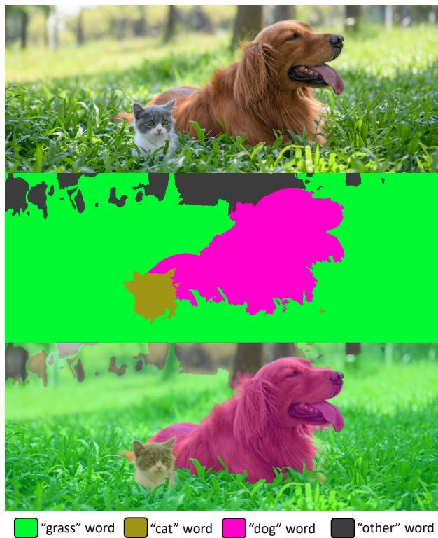
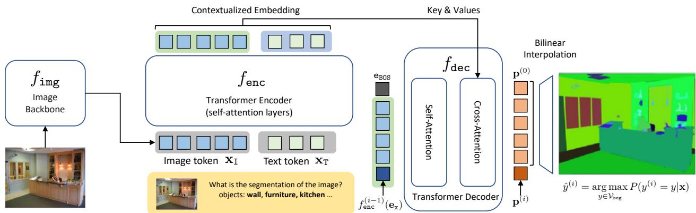
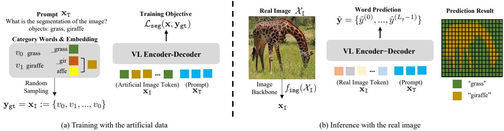
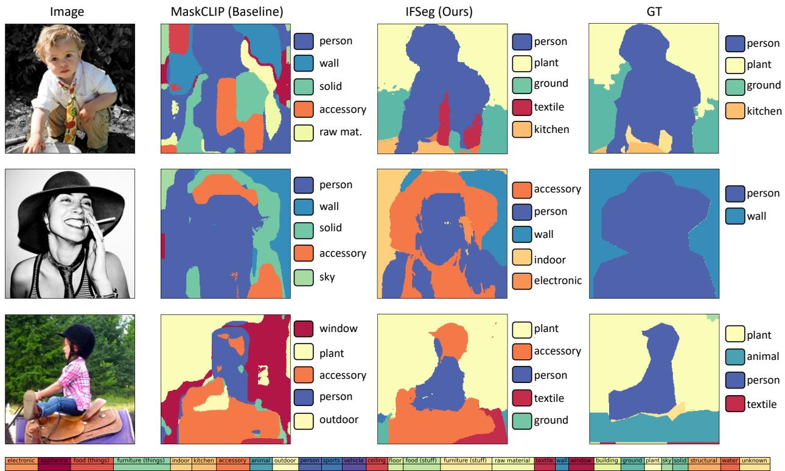

# IFSeg: Image-free Semantic Segmentation via Vision-Language Model

Sukmin Yun13\*† Seong Hyeon Park1\* Paul Hongsuck Seo2 Jinwoo Shin1 1Korea Advanced Institute of Science and Technology (KAIST) 2Google Research 3Mohamed bin Zayed University of Artificial Intelligence (MBZUAI)

sukmin.yun@mbzuai.ac.ae, seonghyp@kaist.ac.kr, phseo@google.com, jinwoos@kaist.ac.kr

## Abstract

Vision-language (VL) pre-training has recently gained much attentionfor its transferability andflexibility in novel concepts (e.g., cross-modality transfer) across various visual tasks. However, VL-driven segmentation has been underexplored, and the existing approaches still have the burden of acquiring additional training images or even segmentation annotations to adapt a VL model to downstream segmentation tasks. In this paper, we introduce a novel image-free segmentation task where the goal is to perform semantic segmentation given only a set ofthe target semantic categories, but without any task-specific images and annotations. To tackle this challenging task, our proposed method, coined IFSeg, generates VL-driven artificial imagesegmentation pairs and updates a pre-trained VL model to a segmentation task. We construct this artificial training data by creating a 2D map of random semantic categories and another map of their corresponding word tokens. Given that a pre-trained VL model projects visual and text tokens into a common space where tokens that share the semantics are located closely, this artificially generated word map can replace the real image inputsfor such a VL model. Through an extensive set ofexperiments, our model not only establishes an effective baselinefor this novel task but also demonstrates strong performances compared to existing methods that rely on stronger supervision, such as task-specific images and segmentation masks. Code is available at https://github.com/alinlab/ifseg.

## 1. Introduction

Understanding a new concept with less cost (e.g., collecting data, annotations, or training) is a challenging yet essential problem in machine learning [41]. The most common practice is fine-tuning a foundation model, pre-trained on a large amount of data [3,6,12,18], for downstream tasks.

  
Figure 1. Visualization of image-free segmentation results via IFSeg on a web image. Here, we present a web image (Top) and its segmentation results (Middle and Bottom) of our image-free segmentation approach. Note that our model is not trained with any task-specific images and annotations, but only the text words (e.g., “grass”, “cat”, “dog” and “other”) as semantic categories.

In particular, such large-scale models have shown successful adaptation to downstream tasks with only little supervision across vision [6] and language [3] domains. Recently, pre-training approaches in the vision-language (VL) domain have also achieved remarkable results in transferring to novel tasks (e.g., few-shot or zero-shot transfer [37]) with various elaborate designs, including modality interaction between the dual encoders [20, 32], the multi-modal encoder [22, 43], and the encoder-decoder [1, 8, 39, 42, 44, 49].

Semantic segmentation is one of the crucial tasks in computer vision that requires understanding dense representations for pixel-wise classifications. Inspired by the success of the contrastive VL pre-training, CLIP [32], several recent attempts [15, 25, 27, 48, 53] have explored CLIP-based segmentation approaches for better transferability (e.g., zeroshot [4, 45] and open-vocabulary segmentation [51]). However, the existing zero-shot or open-vocabulary segmentation approaches still suffer from a burden of training on additional image data, segmentation annotations [15, 25, 48, 53], or natural language supervision [27, 47], to adapt pre-trained VL models to downstream segmentation tasks. In the wild, however, such training data is not readily available; e.g., there would be no task-specific training images or labels for novel web images like Fig. 1. This limitation inspires us to investigate how to fully utilize the VL models for semantic segmentation in a lightweight manner, even without any image data or human-annotated supervision.

Meanwhile, the recent encoder-decoder VL models [1, 8, 39, 42, 44, 49] also have gained popularity with their unique characteristics of image-to-text generation via the VL decoder network. Motivated by this, we explore the potential usability of the VL decoder to segment pixels in the text generation manner as an alternative to traditional vision segmentation decoders, e.g., Semantic FPN [23] and Uper-Net [46]. Interestingly, we found that a solely given set of semantic categories enables the encoder-decoder VL models to perform semantic segmentation without any training images or annotations; Fig. 1 shows the quality of semantic segmentation results on the image-free segmentation task with a wild uncurated image downloaded from the web.

Contribution. In this paper, we introduce a novel Image-Free Segmentation task that aims to segment target semantic categories when only a set of the target semantic categories is given without any task-specific images and annotations. Our core idea to tackle this challenge is that a word set of semantic categories can serve as an artificial image for the VL models on their cross-modal embedding space. To this end, we propose a simple yet effective VL-driven selfsupervised task, coined IFSeg, that generates artificial imagesegmentation pairs using word tokens and updates the VL models to segment them. Specifically, we construct this artificial training data by creating a 2D map of random semantic categories (i.e., artificial image tokens) and another map of their corresponding word tokens. We provide overall illustrations and the proposed method for semantic segmentation via the VL models in Figs. 2 and 3, respectively.

To demonstrate the effectiveness of our method for imagefree semantic segmentation, we incorporate our method with the publicly available encoder-decoder VL model [42].1 In particular, the proposed method, albeit with weaker supervision (i.e., only segmentation categories), can even outperform the baselines that use much stronger supervision, such as task-specific images and segmentation masks. For example, our method outperforms MaskCLIP+ [53] without 118k training images on a zero-shot segmentation scenario in the COCO Stuff benchmark by achieving +6.9 higher mIoU. In addition, we conduct conventional scenarios having images and annotations available for further analysis, including supervised and semi-supervised approaches. As a result, we demonstrate our method still outperforms the recent VL-driven supervised segmentation baselines. For example, our method has achieved an improved +2.0 mIoU compared to DenseCLIP [34] on the ADE20K benchmark.

Overall, our work newly introduces image-free semantic segmentation, a challenging yet potentially crucial task for the computer vision domain, and also highlights the broad applicability of the recent tending VL models. We hope our work could inspire researchers to rethink a new research direction for segmentation tasks in a dataset-free manner.

## 2. Method

In this section, we present a method for performing semantic segmentation tasks using vision-language (VL) encoder-decoder models and our image-free approach in a self-supervised manner. Inspired by the success of zero-shot transfer (e.g., zero-shot image classification [32]) in the recent VL models, we aim to perform semantic segmentation only given a set of target semantic categories but without any task-specific images and annotations during training. However, several prior works [15, 53] observed that it is challenging to directly segment semantic categories via VL models, e.g., CLIP [32], without any modifications and additional training. Nonetheless, we address this challenging task using the pre-trained VL models with an encoder-decoder architecture. In Sec. 2.1, we introduce the VL encoder-decoder architecture and describe how it operates in our method. In Sec. 2.2, we describe how the semantic segmentation task can be handled in the encoder-decoder VL model. In Sec. 2.3, we present our image-free semantic segmentation method.

## 2.1. VL Encoder-Decoder Architecture

Here, we introduce the VL model architecture in our framework and describe its operation step-by-step.

Data format. Our method operates based on sequence data. For instance, let x be a sequence data of length $L _ { \mathbf { x } }$ and let $\mathbf { e _ { x } }$ be its embedding in a D-dimensional vector space:

$$
\mathbf x = \{ x ^ { ( 0 ) } , . . . , x ^ { ( L _ { x } - 1 ) } \} ,\tag{1}
$$

$$
\mathbf { e } _ { \mathrm { x } } = [ \mathbf { e } _ { \mathrm { x } } ^ { ( 0 ) } ; . . . ; \mathbf { e } _ { \mathrm { x } } ^ { ( L _ { \mathrm { x } } - 1 ) } ] \in \mathbb { R } ^ { L _ { \mathrm { x } } \times D } .\tag{2}
$$

Specifically, we deal with the raw image-text $( \mathcal { X } _ { \mathrm { I } } , \mathcal { X } _ { \mathrm { T } } )$ by tokenizing them into a sequence of tokens. The text $\mathcal { X } _ { \mathrm { T } }$ is tokenized by a dictionary $\mathcal { V } = \{ v _ { 0 } , . . . , v _ { N - 1 } \}$ of $N$ predefined words2 and the corresponding word embedding matrix ${ \bf E } = [ { \bf e } _ { 0 } ; . . . ; { \bf e } _ { N - 1 } ] \in \bar { \mathbb { R } ^ { N \times D } }$ that are related by the lookup operation $\mathbf { e } _ { i } : = \mathtt { E m b } ( v _ { i } )$ . For example, we consider the following source text tokens and their embedding,

  
Figure 2. Illustration of the semantic segmentation in VL encoder-decoder. Our method incorporates a transformer encoder-decoder $( f _ { \mathrm { e n c } } , f _ { \mathrm { d e c } } )$ along with an external image backbone $( f _ { \mathrm { i m g } } )$ for tokenizing a given image. Given a pair of an image and a prompt sentence, the transformer generates contextualized embeddings through its self-attention layers. The decoder then sequentially predicts the probabilit distribution over the semantic categories in a region $( e . g . , \textbf { p } ^ { ( i ) } )$ , by transforming an input composed of the special begin-of-sequence (BOS) embedding and the contextualized embeddings at the preceding region indices (e.g., [eBOS; $f ^ { ( 0 ) } ( { \bf e } _ { \bf x } ) ; . . . \hat { ; } f ^ { ( i - 1 ) } ( \bar { \bf e } _ { \bf x } ) ] )$ ) through its self-attention and cross-attention layers. Finally, bilinear interpolation is applied to obtain the final prediction in a desired spatial size.

$$
\mathbf { x } _ { \mathrm { T } } = \{ x _ { \mathrm { T } } ^ { ( 0 ) } , . . . , x _ { \mathrm { T } } ^ { ( L _ { \mathrm { T } } - 1 ) } \} ,\tag{3}
$$

$$
{ \bf e } _ { \mathrm { T } } = [ { \bf e } _ { \mathrm { T } } ^ { ( 0 ) } ; . . . ; { \bf e } _ { \mathrm { T } } ^ { ( L _ { \mathrm { T } } - 1 ) } ] \in \mathbb { R } ^ { L _ { \mathrm { T } } \times D } ,\tag{4}
$$

where $x _ { \mathrm { T } } ^ { ( i ) } \in \mathcal { V }$ and $\mathbf { e } _ { \mathrm { T } } ^ { ( i ) } : = \mathtt { E m b } ( x _ { \mathrm { T } } ^ { ( i ) } )$ . To deal with the image $\mathcal { X } _ { \mathrm { I } }$ , an image backbone3 is introduced to produce a 2D feature map of shape $H \times W \times C$ , followed by a spatial flatten operation $( H \times W \to L _ { \operatorname { I } } )$ , resulting in the sequence

$$
f _ { \mathrm { i n g } } ( \mathcal { X } _ { \mathrm { I } } ) = \widetilde { \mathbf { e } } _ { \mathrm { I } } = [ \widetilde { \mathbf { e } } _ { \mathrm { I } } ^ { ( 0 ) } ; . . . ; \widetilde { \mathbf { e } } _ { \mathrm { I } } ^ { ( L _ { \mathrm { I } } - 1 ) } ] \in \mathbb { R } ^ { L _ { \mathrm { I } } \times C } .\tag{5}
$$

Additionally, a learnable linear layer is applied to fix the output channel size, ${ \bf e } _ { \mathrm { I } } = \mathrm { L i n e a r } ( \mathbf { \bar { e } } _ { \mathrm { I } } ) \in \mathbb { R } ^ { \sum _ { \mathrm { I } } \times D }$ , which we interpret as the embedding of the conceptual image tokens:

$$
\mathbf { x } _ { \mathrm { I } } = \{ x _ { \mathrm { I } } ^ { ( 0 ) } ; . . . ; x _ { \mathrm { I } } ^ { ( L _ { \mathrm { I } } - 1 ) } \} .\tag{6}
$$

Concatenating them together, we assign the token sequence $\mathbf { x } : = \{ \mathbf { x } _ { \mathrm { I } } , \mathbf { x } _ { \mathrm { T } } \}$ in Eq. (1) and the embedding representation ${ \bf e } _ { \mathrm { x } } = \left[ { \bf e } _ { \mathrm { I } } ; { \bf e } _ { \mathrm { T } } \right] ^ { \cdot } \in \mathbb { R } ^ { L _ { \mathrm { x } } \times D }$ in Eq. (2), where $L _ { \mathrm { x } } : = L _ { \mathrm { I } } + L _ { \mathrm { T } }$ VL model architecture. VL models predict a target $\mathbf { y } =$ $\{ y ^ { ( 0 ) } , . . . , y ^ { ( L _ { \mathrm { y } } - 1 ) } \}$ based on a learned distribution $P ( \mathbf { y } | \mathbf { x } )$ given the multi-modal source x. To be specific, we employ an encoder-decoder model [38], where an encoder produces a contextualized encoding of x, and a decoder predicts the target distribution based on the encoding. Specifically, the transformer architecture [14,40] is adopted for implementing the modules, $f _ { \mathrm { e n c } }$ and $f _ { \mathsf { d e c } }$ . The transformer encoder $f _ { \tt e n c }$ produces the contextualized embedding of x by transforming the embedding $\mathbf { e _ { x } }$ with the self-attention mechanism [40],

$$
f _ { \mathrm { e n c } } ( \mathbf { e _ { x } } ) = [ f _ { \mathrm { e n c } } ^ { ( 0 ) } ( \mathbf { e _ { x } } ) ; . . . ; f _ { \mathrm { e n c } } ^ { ( L _ { \mathrm { x } } - 1 ) } ( \mathbf { e _ { x } } ) ] \in \mathbb { R } ^ { L _ { \mathbf { x } } \times D } .\tag{7}
$$

Then, the transformer decoder $f _ { \mathsf { d e c } }$ sequentially produces the output, by transforming a decoder input $\mathbf { d } _ { i } \ =$ $[ \mathbf { d } ^ { ( 0 ) } ; . . . ; \mathbf { d } ^ { ( i ) } ] ^ { \bullet } \in \mathbb { R } ^ { ( \overline { { i } } + 1 ) \times D }$ with the self-attention and the cross-attention [40] mechanism with respect to $f _ { \mathrm { e n c } } ( \mathbf { e } _ { \mathbf { x } } )$

$$
\mathbf { h } ^ { ( i ) } = f _ { \sf d e c } ( \mathbf { d } _ { i } ; f _ { \mathrm { e n c } } ( \mathbf { e _ { x } } ) ) \in \mathbb { R } ^ { D } .\tag{8}
$$

The formulation of the decoder input $\mathbf { d } _ { i }$ would vary depending on the tasks. For example, the formulation during the pre-training is often the earlier targets, $\mathbf { d } ^ { ( i ) } : = \mathtt { E m b } ( y ^ { ( \bar { i } - 1 ) } )$ for $i ~ > ~ 0$ , and a special begin-of-sequence embedding ${ \bf d } ^ { ( 0 ) } : = { \bf e _ { \tt B 0 S } }$ . However, we will revisit and alter this for mulation in Sec. 2.2 for the semantic segmentation task.

Finally, a linear transform by the embedding matrix E produces a logit over the dictionary $\nu ,$

$$
P ( \boldsymbol { y } ^ { ( i ) } | \mathbf { x } ) \propto \mathbf { E } \cdot \mathbf { h } ^ { ( i ) } \in \mathbb { R } ^ { N } .\tag{9}
$$

## 2.2. Semantic Segmentation via Encoder-Decoder

During the VL pre-training (e.g., image captioning), all modules are trained end-to-end by maximizing the likelihood in Eq. (9). We assume that the VL pre-training would align the image tokens with the word tokens in the contextualized embedding space in Eq. (7), which is the key idea in our framework introduced in Sec. 2.3.

In this section, we formulate the semantic segmentation task in the VL encoder-decoder model and discuss the technical considerations. An overall pipeline is depicted in Fig. 2.

  
Figure 3. Overview of the proposed Image-Free Segmentation (IFSeg) task. (a) Training: Artificial training data is constructed by randomly sampling words from the segmentation vocabulary $\mathcal { V } _ { \mathrm { s e g } } = \{ v _ { 0 } , v _ { 1 } \}$ (e.g., “v0: grass” and $^ { \ast } v _ { 1 } \colon$ giraffe”). Sub-word tokens $( e . g . , \mathrm { \ddot { \Omega } ^ { 6 } - g \dot { \Omega } ^ { 5 } } $ and “-affe”) are managed by averaging their embeddings. Given the artificial image token $\mathbf { x } _ { \mathrm { I } }$ and the prompt $\mathbf { x } _ { \mathrm { T } } ,$ we adapt a pre-trained VL encoder-decoder to predict the corresponding word for each region of the artificial image token in a self-supervised manner $( i . e . , \mathbf { y } _ { \mathrm { g t } } = \mathbf { x } _ { \mathrm { I } } )$ . (b) Inference: During the inference on a real image $\mathcal { X } _ { \ I }$ , the real image token is generated using the image backbone $f _ { \mathrm { i m g } } ( \mathcal { X } _ { \mathrm { I } } )$ . The adapted VL encoder-decoder predicts the semantic category words for individual image regions (or pixels).

Task formulation. Given M semantic categories of interest, we formulate a semantic segmentation task as decoding a category word for each dense region of the image. However, this design could be cumbersome in practice, since a certain semantic category word may be tokenized to multiple subwords in the dictionary $\mathcal { V } \ : ( e . g . , \ : \mathrm { \ddot { ~ } g i r a f f e ^ { 3 } } $ is tokenized to 2 sub-words: “ gir” and “affe” in Fig. 3). As a remedy, we treat such a category as a temporary additional word and append the average embedding of the sub-word tokens to the embedding matrix E. In this way, each semantic category is always treated as one distinct word, $\mathcal { V } _ { \mathbf { s e g } } = \{ v _ { 0 } ^ { \prime } , . . . , v _ { M - 1 } ^ { \prime } \}$

To perform the task, we aim to produce spatially conditioned4 decoder outputs on the image tokens $x _ { \mathrm { I } } ^ { ( i ) } ~ ( i . e .$ Eq. (6)). Specifically, we enforce an alternative formulation of decoder input $\mathbf { d } _ { i }$ in Eq. (8) such that the encoder output of the preceding index is used, i.e., $\mathbf { d } ^ { ( i ) } = f _ { \mathrm { e n c } } ^ { ( i - 1 ) } ( \mathbf { e } _ { \mathrm { x } } )$ for $i > 0 ,$ , where $\mathbf { d } ^ { ( 0 ) } = \mathbf { e } _ { \mathrm { B 0 S } }$ without modification. Then, we get $L _ { \mathrm { I } }$ number of decoder outputs as

$$
\mathbf { h } = [ \mathbf { h } ^ { ( 0 ) } ; . . . ; \mathbf { h } ^ { ( L _ { \mathrm { I } } - 1 ) } ] \in \mathbb { R } ^ { L _ { \mathrm { I } } \times D } .\tag{10}
$$

Next, we calculate the logit with Eq. (9) and apply softmax after masking out the words that are not in $\nu _ { \tt s e g }$ to get the normalized probability over the M categories,

$$
\mathbf { p } = [ \mathbf { p } ^ { ( 0 ) } ; \ldots ; \mathbf { p } ^ { ( L _ { \mathtt { I } } - 1 ) } ] \in \mathbb { R } ^ { L _ { \mathtt { I } } \times M } .\tag{11}
$$

Then, we recover the spatial dimension of the image backbone $f _ { \mathrm { i m g } } ( i . e . , L _ { \mathrm { I } }  H \times W )$ and up-sample it with bilinear interpolation to match a desired size $\stackrel { \sim } { P } \times \stackrel { \sim } { W } ( e . g .$ ., an irregular shape of the image $\mathcal { X } _ { \mathrm { I } } )$ . As a result, we obtain the output

$$
\widetilde { \mathbf { p } } = [ \widetilde { \mathbf { p } } ^ { ( 0 ) } ; . . . ; \widetilde { \mathbf { p } } ^ { ( \widetilde { H } \cdot \widetilde { W } - 1 ) } ] \in \mathbb { R } ^ { \widetilde { H } \times \widetilde { W } \times M } ,\tag{12}
$$

and the predictive distribution is defined as:

$$
P ( \boldsymbol { y } ^ { ( i ) } | \mathbf { x } ) : = \widetilde { \mathbf { p } } ^ { ( i ) } \in \mathbb { R } ^ { M } .\tag{13}
$$

Finally, we predict the category with the highest probability,

$$
\hat { y } ^ { ( i ) } = \underset { y \in \mathcal { V } _ { \mathrm { s e g } } } { \arg \operatorname* { m a x } } P ( y ^ { ( i ) } = y | \mathrm { \mathbf { x } } ) .\tag{14}
$$

For fine-tuning given a segmentation label $y _ { \mathrm { g t } } ^ { ( i ) }$ (represented by the semantic category words in $\nu _ { \tt s e g } )$ , we consider the negative log-likelihood as the objective to minimize:

$$
\mathcal { L } _ { \mathrm { s e g } } ( \mathbf { x } , \mathbf { y } _ { \mathrm { g t } } ) = \sum _ { i } - \ln P ( \boldsymbol { y } ^ { ( i ) } = y _ { \mathrm { g t } } ^ { ( i ) } | \mathbf { x } ) .\tag{15}
$$

Prompt design. The text tokens $\mathbf { x } _ { \mathrm { T } }$ in Eq. (3) can be provided as the prompt for instructing the details of the semantic segmentation task, namely the task description and the list of target classes. Specifically, we follow the “task description + category enumeration” protocol in the VQA task [42] where the target classes are enumerated after the task description, $e . g .$ , “what is the segmentation map of the image? object: giraffe, grass,” in Fig. 3. In this design, we expect the VL model to capture the cross-modal relationships between image tokens $\mathbf { x } _ { \mathrm { I } }$ and the semantic categories.

## 2.3. Image-free Semantic Segmentation

In this section, we introduce a VL-driven self-supervised task, coined IFSeg (Image-Free Segmentation), to tackle the image-free semantic segmentation via the encoder-decoder VL model. Our main idea is that during the VL pre-training (in Sec. 2.1), the real image tokens and their corresponding semantic category word tokens can be considered interchangeable because they are both likely to be located in close proximity within the shared contextualized embedding space. To this end, we generate artificial image tokens using given word tokens and update the VL model to segment the corresponding word tokens in a self-supervised manner. In other words, we generate artificial training data for an image-free semantic segmentation task. We provide a brief overview of the proposed image-free approach in Fig. 3.

Constructing artificial image tokens. We construct artificial training data $( i . e .$ , image-segmentation token pairs) from a set of M unique category words $\mathcal { V } _ { \mathbf { s e g } } : = \{ v _ { 0 } ^ { \prime } , . . . , v _ { M - 1 } ^ { \prime } \}$ Specifically, we randomly sample with replacement $U \times V$ number of words to construct a grid map $\widetilde { \mathbf { v } } _ { \tt I F S e g }$ as follows:

$$
\widetilde { \mathbf { v } } _ { \mathtt { I F S e g } } = \{ \widetilde { v } _ { \mathtt { I F S e g } } ^ { ( 0 ) } , . . . , \widetilde { v } _ { \mathtt { I F S e g } } ^ { ( U \cdot V - 1 ) } \} .\tag{16}
$$

The initial grid sizes $U , V$ are randomly drawn from a range $\{ 1 , 2 , . . . , S \}$ with a hyper-parameter $S .$ Then, we up-scale the grid to have the spatial resolution of the image backbone $( i . e . , H \times W )$ via the nearest neighbor interpolation,

$$
\begin{array} { r } { \mathbf { v } _ { \mathtt { I F S e g } } = \{ v _ { \mathtt { I F S e g } } ^ { ( 0 ) } , . . . , v _ { \mathtt { I F S e g } } ^ { ( H \cdot W - 1 ) } \} . } \end{array}\tag{17}
$$

In our experiments, we use $H = W = 3 2$ by following the configuration of the VL pre-training, and we also set $S = 3 2$ as the size of the initial map, so it can vary in the largest range (see Appendix B for analysis on the effect of the initial grid range S). The goal of using various random maps to up-sample our data is to bridge the gap between real images and our synthetic data by introducing a shape regularization effect. This effect allows objects to be depicted as a cluster of various sizes rather than being randomly scattered. Finally, we train the model with the artificial image tokens $\mathbf { v _ { \tt I F S e g } }$ (replacing the real image tokens in Eq. (6)) and their corresponding ground truths using the maximum likelihood in Eq. (15). We note that the image backbone, $f _ { \mathrm { i m g } }$ (in Eq. (5)) is frozen during our self-supervised training.

Post-processing for image-free segmentation. One challenge of the image-free segmentation task is the discrepancy in input modality between training and evaluation, which arises due to the absence of real training images. For example, it is challenging to learn image-specific priors such as object shapes and label coherence in regions with similar textures. To resolve this issue, we found that averaging the output probability based on the image feature (i.e., outputs of image backbone $f _ { \mathrm { i m g } } )$ significantly enhances the segmentation quality. Specifically, we search K-nearest neighbors of the image features in Eq. (5) using the cosine similarity, $\widetilde { \mathbf e } _ { \mathrm { I } } ^ { ( i ) } \cdot \widetilde { \mathbf e } _ { \mathrm { I } } ^ { ( j ) } / | | \widetilde { \mathbf e } _ { \mathrm { I } } ^ { ( i ) } | | \cdot | | \widetilde { \mathbf e } _ { \mathrm { I } } ^ { ( j ) } | |$ . Then, given a set of neighborhood indices $\dot { \mathcal { N } } ^ { ( i ) }$ , we iterate averaging the probability in Eq. (9) with the neighborhood as follows,

$$
\mathbf { p } ^ { ( i ) } : = \sum _ { j \in \mathcal { N } ^ { ( i ) } } \mathbf { p } ^ { ( j ) } / \vert \mathcal { N } ^ { ( i ) } \vert .\tag{18}
$$

We empirically found that the effect of the post-processing diminishes when the real training images and annotations are available. In our experiments, we apply this only for image-free approaches and use $K = 3$ and 25 iterations unless stated otherwise (see Appendix B for ablation studies on varying K and the iteration count).

## 3. Related Works

Vision-language pre-training. The recent vision-language models pre-trained on large-scale image-text data have shown successful results in zero-shot and few-shot adaptation to novel tasks across domains, $e . g .$ , image classification [11], captioning [26] and visual question answering [2]. To improve the quality of cross-modal representations, there have been extensive exploration in design of modality interaction, including the dual encoders [20, 32], the multi-modal encoder [22,43], and the encoder-decoder [1,8,39,42,44,49]. For example, CLIP [32] introduced contrastive pre-training on the dual encoder (i.e., image and text encoder) and has shown impressive zero-shot image classification performances via a simple prompt engineering technique without training. On the other hand, the encoder-decoder VL approaches [1,8,39,42,44,49] also have gained much attention in image-to-text generation tasks such as image captioning and visual question answering. In this paper, we explore the potential usability of the VL decoder for image segmentation from the perspective of image-to-text generation.

Transferable image segmentation. Image segmentation is a core computer vision task, but it is still challenging to segment novel visual categories. To this end, several attempts have been introduced, including unsupervised [9, 17, 19, 27, 50, 53] and zero-shot segmentation [4, 7, 15, 16, 25, 31, 45, 48, 53]. First, unsupervised segmentation approaches [9, 17, 19, 50, 53] have been focused on clustering dense representations of an image, and then matching corresponding segmentation categories via the Hungarian-matching algorithm [13]. On the other hand, the recent VL-driven approaches [27, 53] replace the matching process via the text encoder of CLIP using segmentation vocabulary for better efficiency and transferability. Meanwhile, early approaches in zero-shot segmentation [4, 7, 16, 31, 45] have utilized segmentation vocabulary via learned word embeddings like word2vec [29] and fast-text [21]. Similar to the VL-driven unsupervised segmentation, the VL-driven zero-shot approaches [15, 25, 48, 53] also have been established on CLIP instead of word embeddings. The zero-shot segmentation approaches often require class-agnostic segmentation masks [15, 48] or class-specific segmentation annotations [4, 7, 16, 25, 31, 45, 53]. In this respect, we explore an image-free semantic segmentation task for more realistic scenarios with only given segmentation vocabulary, which can be easily collected than images or other annotations.

## 4. Experiments

In this section, we demonstrate the effectiveness of the proposed image-free approach, IFSeg. Specifically, we incorporate our method with the recent VL encoder-decoder model, OFA [42], which is publicly available5, and evaluate its segmentation abilities on COCO Stuff [5] and ADE20K [52] semantic segmentation benchmarks. Specifically, we compare our method with existing VL-driven segmentation baselines that target various scenarios: (a) zero-shot segmentation scenario [4, 7, 15, 16, 45, 48, 53], (b) cross-dataset segmentation scenario [15,25,48] and (c) unsupervised image segmentation [9, 17, 19, 50, 53]. We consider CLIP [32], MaskCLIP [53], and OFA [42] as baselines to evaluate the segmentation abilities of the pre-trained VL models without fine-tuning. More details are described in each section and Appendix.

Figure 4. Visualization of segmentation results via IFSeg. We visualize the segmentation results of IFSeg (ours) and MaskCLIP (baseline). We also present predicted semantic categories next to each segmentation results. Unlike the MaskCLIP (baseline) only roughly segments segmentation vocabularies onto an image, our method does visual categories with accurate segmentation. We note that both models are not trained using any images from the pre-trained VL models, CLIP and OFA, respectively. Best viewed in color.
<table><tr><td>Method</td><td>Backbone</td><td>Image Dataset</td><td>mIoU</td></tr><tr><td>MaskCLIP+ [53]</td><td>ResNet-101</td><td>COCO (118k)</td><td>48.7</td></tr><tr><td>CLIP [32,53]</td><td>ResNet-101</td><td>x</td><td>12.3</td></tr><tr><td>OFA [42]</td><td>ResNet-101</td><td>x</td><td>6.8</td></tr><tr><td>MaskCLIP [53]</td><td>ResNet-101</td><td>x</td><td>24.8</td></tr><tr><td>IFSeg (ours)</td><td>ResNet-101</td><td>x</td><td>55.6</td></tr></table>

Table 1. Comparison with zero-shot and image-free baselines. We report the mIoU metric of the baselines and our model predicting the 15 unseen semantic categories of the COCO Stuff benchmark. “Image Dataset” denotes required images for training. Our post-processing has been applied to all results for a fair comparison.

Datasets. COCO Stuff [5] is a large-scale dataset that contains 117k training, 5k validation images, and segmentation annotations of 171 semantic categories consisting of 80 objects and 91 stuff categories. For the zero-shot image segmentation, we split COCO Stuff dataset into 156 seen categories and 15 unseen categories.6 ADE20K [52] is a challenging semantic segmentation dataset including 20k training, 5k validation, and segmentation annotations of 150 fine-grained semantic categories that cover indoor and outdoor scenes. In our image-free experiments in Sec. 4.1, we use only semantic categories given by the segmentation benchmarks, without any training images and annotations.

Baselines. We consider a variety of existing VL-driven unsupervised, zero-shot, and the image-free segmentation baselines: (a) unsupervised baselines: IIC [19], PiCIE+H. [9], TransFGU [50], (b) zero-shot baselines: LSeg+7 [25], ZSSeg [48], OpenSeg [15], and MaskCLIP+ [53], where ZSSeg, OpenSeg, and MaskCLIP+ are the recent VLdriven baselines that relied on CLIP [32] or ALIGN [20], and (c) image-free baselines: OFA [42], CLIP [32], and MaskCLIP [53] which directly evaluate the segmentation abilities of the pre-trained VL models, OFA and CLIP.

<table><tr><td>Method</td><td>Text Backbone</td><td>Image Backbone</td><td>Image Dataset</td><td>Segmentation Label</td><td>mIoU</td></tr><tr><td>LSeg+ [15,25]</td><td>ALIGN-BERT-Large [20]</td><td>ResNet-101</td><td>COCO (118k)</td><td>√</td><td>13.0</td></tr><tr><td>OpenSeg [15]</td><td>ALIGN-BERT-Large [20]</td><td>ResNet-101</td><td>COCO (118k)</td><td>√</td><td>15.3</td></tr><tr><td>ZSSeg [48]</td><td>CLIP-ViT-B [32]</td><td>ResNet-101</td><td>COCO (118k)</td><td>√</td><td>20.5</td></tr><tr><td>CLIP† [32,53]</td><td>CLIP-ResNet [32]</td><td>ResNet-101</td><td>x</td><td>x</td><td>3.7</td></tr><tr><td>MaskCLIP† [53]</td><td>CLIP-ResNet [32]</td><td>ResNet-101</td><td>x</td><td>x</td><td>10.3</td></tr><tr><td>OFA† [42]</td><td>OFA-Base [42]</td><td>ResNet-101</td><td>x</td><td>x</td><td>0.5</td></tr><tr><td>IFSeg (ours)†</td><td>OFA-Base [42]</td><td>ResNet-101</td><td>x</td><td>x</td><td>16.8</td></tr></table>

Table 2. Comparison with VL-driven baselines under the cross-dataset (COCO→ADE20K) scenario. We report the mIoU metric evaluated on the ADE20K benchmark. We use the 150 fine-grained semantic categories of the ADE20K for image-free training. “Image Dataset” and “Segmentation Label” denote requirements for their training. † denotes results that our post-processing is applied.

<table><tr><td>Method</td><td>Backbone</td><td>Image Dataset</td><td>mIoU</td></tr><tr><td>IIC [19]</td><td>ResNet-18</td><td>COCO (118k)</td><td>0.6</td></tr><tr><td>PiCIE + H. [9]</td><td>ResNet-18</td><td>COCO (118k)</td><td>4.6</td></tr><tr><td>TransFGU [50]</td><td>ViT-S/8</td><td>COCO (118k)</td><td>11.9</td></tr><tr><td>MaskCLIP+ [53]</td><td>ResNet-101</td><td>COCO (118k)</td><td>18.0</td></tr><tr><td>CLIP† [32,53]</td><td>ResNet-101</td><td>x</td><td>4.6</td></tr><tr><td>MaskCLIP† [53]</td><td>ResNet-101</td><td>x</td><td>12.7</td></tr><tr><td>OFA↑[42]</td><td>ResNet-101</td><td>x</td><td>1.5</td></tr><tr><td>IFSeg (ours)†</td><td>ResNet-101</td><td>x</td><td>16.9</td></tr></table>

Table 3. Comparison with unsupervised semantic segmentation (COCO→COCO) baselines. We report the mIoU metric evaluated on the 171 semantic categories of the COCO Stuff benchmark. † denotes results that our post-processing is applied.

Implementation details. In our experiments, we implement our method on the OFA (encoder-decoder VL model) framework and generally follow the training and evaluation configuration of OFA [42], mmsegmentation8 [10], and MaskCLIP [53] (the strongest baseline) for a fair comparison. We fine-tune our model from the OFA-Base pre-trained weights with the ResNet-101 backbone network. We optimize with AdamW optimizer [28] with a weight decay of 0.1, a learning rate of 0.00005, and a batch size of 16 with 2k iterations unless stated otherwise. We generate 32 32 grid-size of artificial image tokens with S = 32 and use K = 3 with 25 iterations for the post-processing for imagefree baselines. We report a single-scale mean Intersection over Union (mIoU) score evaluated at the original irregular image sizes as the metric. More details of experimental setups are described in Appendix.

## 4.1. Image-free Adaptation for Segmentation

Zero-shot image segmentation. We first evaluate the ef fectiveness of the proposed image-free approach, IFSeg, for adapting VL models toward semantic segmentation tasks. We evaluate the mIoU scores of different models on segmenting the COCO Stuff 15 unseen semantic categories. Specifically, we compare with the image-free baselines, CLIP [32], OFA [42], and MaskCLIP [53] in Tab. 1. In addition, we also compare with MaskCLIP+ [53] under the same evaluation setup as a baseline, which is trained on 118k COCO images using the pseudo-labels generated by MaskCLIP [53]. First of all, Tab. 1 shows that our method can achieve significant improvement in mIoU metric compared to all the image-free baselines, e.g., +30.8 points higher than MaskCLIP. Somewhat surprisingly, our method outperforms MaskCLIP+ [53], which is a stronger baseline trained on additional 118k images, despite our scarce training data regime that does not use any images and annotations except segmentation vocabulary.

Cross-dataset transfer. Again, we compare with VL-driven segmentation baselines in Tab. 2 under a cross-dataset scenario, where the model is trained on the COCO Stuff and evaluated on the ADE20K benchmark. To this end, we train our model using segmentation vocabulary of the COCO Stuff, and then evaluated on the ADE20K vocabulary.

Similar to the above zero-shot scenario, Tab. 2 shows that our method can achieve significant and comparable performance with the image-free baselines and the baselines with stronger supervision despite our image-free training regime. For example, ours achieved 1.5 points higher mIoU than OpenSeg [15] trained on the 118k training images and class-agnostic segmentation mask annotations. Although the reported value of ours is lower than ZSSeg [48], we note that there exists a huge gap between training scale; ZSSeg is trained on the COCO Stuff dataset with its natural language annotations (i.e. captions), in a total 960 larger training configuration (15 larger iterations with 64 larger batch size). Nevertheless, our method still consistently and significantly outperforms all the image-free baselines by a large margin; for example, ours achieves 5.5 higher points than MaskCLIP in terms of the mIoU metric.

Unsupervised image segmentation. On the other hand, we also compare our method with unsupervised segmentation baselines in Tab. 3, which is another promising approach for learning transferable segmentation models. Specifically, un supervised baselines are trained on the COCO Stuff dataset and evaluated 171 semantic categories.

<table><tr><td>Method</td><td>ST</td><td>Image Dataset</td><td>Segmentation Label</td><td>mIoU</td></tr><tr><td>IFSeg</td><td>x</td><td>x</td><td>x</td><td>55.6</td></tr><tr><td>IFSeg</td><td>√</td><td>COCO (118k)</td><td>x</td><td>56.2</td></tr><tr><td>IFSeg</td><td>√</td><td>COCO (118k)</td><td>√</td><td>61.6</td></tr></table>

Table 4. Ablation study on the effect of self-training technique (“ST”) of IFSeg. All models are evaluated on the 15 unseen categories of the COCO Stuff zero-shot segmentation benchmark. We show the effects of task-specific images and segmentation labels (seen) with additional 8k training iterations.

As shown in Tab. 3, our method consistently outperforms all the existing image-free segmentation baselines. For example, our method significantly outperforms MaskCLIP by achieving 16.9 mIoU, while MaskCLIP achieves 12.7. Also, ours shows comparable results to MaskCLIP+, which requires additional training with 118k images for transferring the knowledge of MaskCLIP via pseudo-labeling.

Qualitative Results. We present visualizations of segmentation results obtained by MaskCLIP and Ours in Fig. 4, and it shows that our method even segments more fine-grained categories than the ground-truth labels; for example, the accessory category in the middle and bottom images are captured via ours, but not contained in the labels.

## 4.2. Ablation study

In this section, we perform an ablation study to understand further how the proposed method works when training images or segmentation annotations are available.

Self-training. Self-training technique [4] has been widely used in the VL literature. It generates pseudo-labels of unseen segmentation categories for reducing the gap between seen and unseen semantic categories in a semi-supervised manner; it assumes the pixels of unseen categories could be present in the training images, while those pixels are not annotated. On this line, we also evaluate our method on the COCO Stuff benchmark when training images or the seen annotations are available. Specifically, we fine-tune IFSeg with an additional 8k training iterations using 118k images and the seen annotations. We then evaluate the model on the 15 unseen categories of the COCO Stuff benchmark. Tab. 4 shows the individual effects of training images and seen annotations in our framework. After self-training, our method has improved significantly from 55.6 to 61.6 mIoU, which also largely surpasses the strongest baseline MaskCLIP+ of 48.7 on the COCO Stuff in Tab. 1. Furthermore, we observe that ours can achieve outperforming performance compared to self-training baselines as presented in Appendix A.3.

Supervised semantic segmentation. Here, we perform supervised learning on the ADE20K benchmark varying model size of OFA [42] to demonstrate their effectiveness. For a fair comparison, we follow the training configuration of DenseCLIP [34], which incorporates cross-modal representations of CLIP to Semantic FPN [23], including input resolutions, batch size, and iterations. We also compare with traditional image segmentation decoders like Semantic FPN and UPerNet [46] on pre-trained ImageNet [18].

<table><tr><td>Method</td><td>Backbone</td><td>mIoU</td></tr><tr><td>Semantic FPN [23]</td><td>ResNet-101</td><td>40.4</td></tr><tr><td>UPerNet [46]</td><td>ResNet-101</td><td>43.8</td></tr><tr><td>CLIP + Semantic FPN [32,34]</td><td>ResNet-101</td><td>42.7</td></tr><tr><td>DenseCLIP + Semantic FPN [34]</td><td>ResNet-101</td><td>45.1</td></tr><tr><td>IFSeg (ours)</td><td>ResNet-101</td><td>47.1</td></tr></table>

Table 5. Comparison in supervised semantic segmentation. We report the mIoU metric evaluated on the 150 semantic cateogires of the ADE20K benchmark. We follow training configurations of DenseCLIP, such as image resolutions and training iterations.

As shown in Tab. 5, the encoder-decoder VL models can be successfully fine-tuned to segment semantic categories by surpassing the existing supervised approaches with a large margin, e.g., + 2.0 mIoU compared to the strongest baselines, DenseCLIP, on the ADE20K benchmark.

## 5. Conclusion

We newly introduce a novel image-free semantic segmentation task, which has the goal of performing semantic segmentation without any task-specific images and annotations, except target semantic categories. To tackle this, we propose a simple yet effective image-free framework via vision-language (VL) models in a self-supervised manner. The key idea is that words of semantic categories can act as an artificial image tokens on the cross-modal representation space of pre-trained VL models. Specifically, we generate artificial image-segmentation pairs using word tokens to replace the real image-segmentation pairs for image-free semantic segmentation via the VL models. Through extensive experiments, we demonstrate our models are not only effective baseline for this novel task but also show strong performances over existing methods acquiring the stronger supervision. We believe our work would provide insights into the under-explored yet important problems for semantic segmentation via the pre-trained VL models.

Acknowledgements. This work was supported by Institute of Information & communications Technology Planning & Evaluation (IITP) grant funded by the Korea government (MSIT) (No.2019-0-00075, Artificial Intelligence Gradu ate School Program (KAIST); No.2021-0-02068, Artificial Intelligence Innovation Hub; No.2022-0-00959, Few-shot Learning of Casual Inference in Vision and Language for Decision Making).

## References

[1] Jean-Baptiste Alayrac, Jeff Donahue, Pauline Luc, Antoine Miech, Iain Barr, Yana Hasson, Karel Lenc, Arthur Mensch, Katherine Millican, Malcolm Reynolds, Roman Ring, Eliza Rutherford, Serkan Cabi, Tengda Han, Zhitao Gong, Sina Samangooei, Marianne Monteiro, Jacob Menick, Sebastian Borgeaud, Andrew Brock, Aida Nematzadeh, Sahand Sharifzadeh, Mikolaj Binkowski, Ricardo Barreira, Oriol Vinyals, Andrew Zisserman, and Karen Simonyan. Flamingo: a visual language model for few-shot learning. In Alice H. Oh, Alekh Agarwal, Danielle Belgrave, and Kyunghyun Cho, editors, Advances in Neural Information Processing Systems, 2022. 1, 2, 5

[2] Stanislaw Antol, Aishwarya Agrawal, Jiasen Lu, Margaret Mitchell, Dhruv Batra, C Lawrence Zitnick, and Devi Parikh. Vqa: Visual question answering. In Proceedings ofthe IEEE international conference on computer vision, pages 2425– 2433, 2015. 5

[3] Tom Brown, Benjamin Mann, Nick Ryder, Melanie Subbiah, Jared D Kaplan, Prafulla Dhariwal, Arvind Neelakantan, Pranav Shyam, Girish Sastry, Amanda Askell, Sandhini Agarwal, Ariel Herbert-Voss, Gretchen Krueger, Tom Henighan, Rewon Child, Aditya Ramesh, Daniel Ziegler, Jeffrey Wu, Clemens Winter, Chris Hesse, Mark Chen, Eric Sigler, Mateusz Litwin, Scott Gray, Benjamin Chess, Jack Clark, Christopher Berner, Sam McCandlish, Alec Radford, Ilya Sutskever, and Dario Amodei. Language models are fewshot learners. In Advances in Neural Information Processing Systems, pages 1877–1901, 2020. 1

[4] Maxime Bucher, Tuan-Hung Vu, Matthieu Cord, and Patrick Perez. Zero-shot semantic segmentation.´ Advances in Neural Information Processing Systems, 32, 2019. 2, 5, 6, 8, 13, 14

[5] Holger Caesar, Jasper Uijlings, and Vittorio Ferrari. Cocostuff: Thing and stuff classes in context. In Proceedings of the IEEE conference on computer vision and pattern recognition, pages 1209–1218, 2018. 6, 12, 17

[6] Ting Chen, Simon Kornblith, Kevin Swersky, Mohammad Norouzi, and Geoffrey Hinton. Big self-supervised models are strong semi-supervised learners. In Advances in Neural Information Processing Systems, 2020. 1

[7] Jiaxin Cheng, Soumyaroop Nandi, Prem Natarajan, and Wael Abd-Almageed. Sign: Spatial-information incorporated generative network for generalized zero-shot semantic segmentation. In Proceedings ofthe IEEE/CVF International Conference on Computer Vision, pages 9556–9566, 2021. 5, 6, 13, 14

[8] Jaemin Cho, Jie Lei, Hao Tan, and Mohit Bansal. Unifying vision-and-language tasks via text generation. In International Conference on Machine Learning, pages 1931–1942. PMLR, 2021. 1, 2, 5

[9] Jang Hyun Cho, Utkarsh Mall, Kavita Bala, and Bharath Hariharan. Picie: Unsupervised semantic segmentation using invariance and equivariance in clustering. In Proceedings of the IEEE/CVF Conference on Computer Vision and Pattern Recognition, pages 16794–16804, 2021. 5, 6, 7, 12, 13

[10] MMSegmentation Contributors. MMSegmentation: Openmmlab semantic segmentation toolbox

and benchmark. https : / / github . com / open - mmlab/mmsegmentation, 2020. 7

[11] Jia Deng, Wei Dong, Richard Socher, Li-Jia Li, Kai Li, and Li Fei-Fei. Imagenet: A large-scale hierarchical image database. In Proceedings of the IEEE/CVF Conference on Computer Vision and Pattern Recognition, 2009. 5

[12] Jacob Devlin, Ming-Wei Chang, Kenton Lee, and Kristina Toutanova. Bert: Pre-training of deep bidirectional transformers for language understanding. arXiv preprint arXiv:1810.04805, 2018. 1

[13] Carl Doersch, Abhinav Gupta, and Alexei A Efros. Unsupervised visual representation learning by context prediction. In Proceedings of the IEEE International Conference on Computer Vision, pages 1422–1430, 2015. 5

[14] Alexey Dosovitskiy, Lucas Beyer, Alexander Kolesnikov, Dirk Weissenborn, Xiaohua Zhai, Thomas Unterthiner, Mostafa Dehghani, Matthias Minderer, Georg Heigold, Sylvain Gelly, Jakob Uszkoreit, and Neil Houlsby. An image is worth 16x16 words: Transformers for image recognition at scale. In International Conference on Learning Representations, 2021. 3

[15] Golnaz Ghiasi, Xiuye Gu, Yin Cui, and Tsung-Yi Lin. Scaling open-vocabulary image segmentation with image-level labels. In European Conference on Computer Vision, pages 540–557. Springer, 2022. 2, 5, 6, 7, 13

[16] Zhangxuan Gu, Siyuan Zhou, Li Niu, Zihan Zhao, and Liqing Zhang. Context-aware feature generation for zero-shot semantic segmentation. In Proceedings of the 28th ACM International Conference on Multimedia, pages 1921–1929, 2020. 5, 6, 13, 14

[17] Mark Hamilton, Zhoutong Zhang, Bharath Hariharan, Noah Snavely, and William T. Freeman. Unsupervised semantic segmentation by distilling feature correspondences. In International Conference on Learning Representations, 2022. 5, 6, 12

[18] Kaiming He, Xiangyu Zhang, Shaoqing Ren, and Jian Sun. Deep residual learning for image recognition. In Proceedings of the IEEE/CVF Conference on Computer Vision and Pattern Recognition, 2016. 1, 8

[19] Xu Ji, Joao F Henriques, and Andrea Vedaldi. Invariant information clustering for unsupervised image classification and segmentation. In Proceedings of the IEEE/CVF International Conference on Computer Vision, pages 9865–9874, 2019. 5, 6, 7, 12, 13

[20] Chao Jia, Yinfei Yang, Ye Xia, Yi-Ting Chen, Zarana Parekh, Hieu Pham, Quoc Le, Yun-Hsuan Sung, Zhen Li, and Tom Duerig. Scaling up visual and vision-language representation learning with noisy text supervision. In International Conference on Machine Learning, pages 4904–4916. PMLR, 2021. 1, 5, 6, 7, 13, 14

[21] Armand Joulin, Edouard Grave, Piotr Bojanowski, Matthijs Douze, Herve J´ egou, and Tomas Mikolov. Fasttext. zip:´ Compressing text classification models. arXiv preprint arXiv:1612.03651, 2016. 5, 14

[22] Wonjae Kim, Bokyung Son, and Ildoo Kim. Vilt: Visionand-language transformer without convolution or region supervision. In International Conference on Machine Learning, pages 5583–5594. PMLR, 2021. 1, 5

[23] Alexander Kirillov, Ross Girshick, Kaiming He, and Piotr Dollar. Panoptic feature pyramid networks. In´ Proceedings of the IEEE/CVF Conference on Computer Vision and Pattern Recognition, pages 6399–6408, 2019. 2, 8

[24] Philipp Krahenb ¨ uhl and Vladlen Koltun. Efficient inference in¨ fully connected crfs with gaussian edge potentials. Advances in neural information processing systems, 24, 2011. 16

[25] Boyi Li, Kilian Q Weinberger, Serge Belongie, Vladlen Koltun, and Rene Ranftl. Language-driven semantic segmentation. In International Conference on Learning Representations, 2022. 2, 5, 6, 7, 13

[26] Tsung-Yi Lin, Michael Maire, Serge Belongie, James Hays, Pietro Perona, Deva Ramanan, Piotr Dollar, and C Lawrence´ Zitnick. Microsoft coco: Common objects in context. In European Conference on Computer Vision, 2014. 5

[27] Quande Liu, Youpeng Wen, Jianhua Han, Chunjing Xu, Hang Xu, and Xiaodan Liang. Open-world semantic segmentation via contrasting and clustering vision-language embedding. In European Conference on Computer Vision, pages 275–292. Springer, 2022. 2, 5

[28] Ilya Loshchilov and Frank Hutter. Fixing weight decay regularization in adam. 2018. 7

[29] Tomas Mikolov, Ilya Sutskever, Kai Chen, Greg S Corrado, and Jeff Dean. Distributed representations of words and phrases and their compositionality. Advances in neural information processing systems, 26, 2013. 5, 14

[30] Ron Mokady, Amir Hertz, and Amit H Bermano. Clipcap: Clip prefix for image captioning. arXiv preprint arXiv:2111.09734, 2021. 15, 16

[31] Giuseppe Pastore, Fabio Cermelli, Yongqin Xian, Massimiliano Mancini, Zeynep Akata, and Barbara Caputo. A closer look at self-training for zero-label semantic segmentation. In Proceedings ofthe IEEE/CVF Conference on Computer Vision and Pattern Recognition, pages 2693–2702, 2021. 5, 13, 14

[32] Alec Radford, Jong Wook Kim, Chris Hallacy, Aditya Ramesh, Gabriel Goh, Sandhini Agarwal, Girish Sastry, Amanda Askell, Pamela Mishkin, Jack Clark, et al. Learning transferable visual models from natural language supervision. In International Conference on Machine Learning, pages 8748–8763. PMLR, 2021. 1, 2, 5, 6, 7, 8, 12, 13, 14, 15, 16

[33] Alec Radford, Jeffrey Wu, Rewon Child, David Luan, Dario Amodei, Ilya Sutskever, et al. Language models are unsupervised multitask learners. OpenAI blog, 1(8):9, 2019. 16

[34] Yongming Rao, Wenliang Zhao, Guangyi Chen, Yansong Tang, Zheng Zhu, Guan Huang, Jie Zhou, and Jiwen Lu. Denseclip: Language-guided dense prediction with contextaware prompting. In Proceedings of the IEEE/CVF Conference on Computer Vision and Pattern Recognition, pages 18082–18091, 2022. 2, 8, 16

[35] Rico Sennrich, Barry Haddow, and Alexandra Birch. Neural machine translation of rare words with subword units. In ACL (1), 2016. 3

[36] Piyush Sharma, Nan Ding, Sebastian Goodman, and Radu Soricut. Conceptual captions: A cleaned, hypernymed, image alt-text dataset for automatic image captioning. In Proceedings ofthe 56th Annual Meeting ofthe Associationfor

Computational Linguistics (Volume 1: Long Papers), pages 2556–2565, 2018. 15

[37] Jake Snell, Kevin Swersky, and Richard Zemel. Prototypical networks for few-shot learning. Advances in neural information processing systems, 30, 2017. 1

[38] Ilya Sutskever, Oriol Vinyals, and Quoc V Le. Sequence to sequence learning with neural networks. Advances in neural information processing systems, 27, 2014. 3

[39] Maria Tsimpoukelli, Jacob L Menick, Serkan Cabi, SM Eslami, Oriol Vinyals, and Felix Hill. Multimodal few-shot learning with frozen language models. Advances in Neural Information Processing Systems, 34:200–212, 2021. 1, 2, 5

[40] Ashish Vaswani, Noam Shazeer, Niki Parmar, Jakob Uszkoreit, Llion Jones, Aidan N Gomez, Lukasz Kaiser, and Illia Polosukhin. Attention is all you need. arXiv preprint arXiv:1706.03762, 2017. 3

[41] Oriol Vinyals, Charles Blundell, Timothy Lillicrap, Daan Wierstra, et al. Matching networks for one shot learning. Advances in Neural Information Processing Systems, 29, 2016. 1

[42] Peng Wang, An Yang, Rui Men, Junyang Lin, Shuai Bai, Zhikang Li, Jianxin Ma, Chang Zhou, Jingren Zhou, and Hongxia Yang. Ofa: Unifying architectures, tasks, and modalities through a simple sequence-to-sequence learning framework. In International Conference on Machine Learning, pages 23318–23340. PMLR, 2022. 1, 2, 4, 5, 6, 7, 8, 13, 15, 16

[43] Wenhui Wang, Hangbo Bao, Li Dong, Johan Bjorck, Zhiliang Peng, Qiang Liu, Kriti Aggarwal, Owais Khan Mohammed, Saksham Singhal, Subhojit Som, et al. Image as a foreign language: Beit pretraining for all vision and vision-language tasks. arXiv preprint arXiv:2208.10442, 2022. 1, 5

[44] Zirui Wang, Jiahui Yu, Adams Wei Yu, Zihang Dai, Yulia Tsvetkov, and Yuan Cao. SimVLM: Simple visual language model pretraining with weak supervision. In International Conference on Learning Representations, 2022. 1, 2, 5

[45] Yongqin Xian, Subhabrata Choudhury, Yang He, Bernt Schiele, and Zeynep Akata. Semantic projection network for zero-and few-label semantic segmentation. In Proceedings ofthe IEEE/CVF Conference on Computer Vision and Pattern Recognition, pages 8256–8265, 2019. 2, 5, 6, 13, 14

[46] Tete Xiao, Yingcheng Liu, Bolei Zhou, Yuning Jiang, and Jian Sun. Unified perceptual parsing for scene understanding. In Proceedings of the European Conference on Computer Vision, pages 418–434, 2018. 2, 8

[47] Jiarui Xu, Shalini De Mello, Sifei Liu, Wonmin Byeon, Thomas Breuel, Jan Kautz, and Xiaolong Wang. Groupvit: Semantic segmentation emerges from text supervision. In Proceedings of the IEEE/CVF Conference on Computer Vision and Pattern Recognition, pages 18134–18144, 2022. 2

[48] Mengde Xu, Zheng Zhang, Fangyun Wei, Yutong Lin, Yue Cao, Han Hu, and Xiang Bai. A simple baseline for openvocabulary semantic segmentation with pre-trained visionlanguage model. In European Conference on Computer Vision, pages 736–753. Springer, 2022. 2, 5, 6, 7, 13, 14

[49] Zhengyuan Yang, Zhe Gan, Jianfeng Wang, Xiaowei Hu, Yumao Lu, Zicheng Liu, and Lijuan Wang. An empirical study

of gpt-3 for few-shot knowledge-based vqa. In Proceedings ofthe AAAI Conference on Artificial Intelligence, volume 36, pages 3081–3089, 2022. 1, 2, 5

[50] Zhaoyuan Yin, Pichao Wang, Fan Wang, Xianzhe Xu, Hanling Zhang, Hao Li, and Rong Jin. Transfgu: a top-down approach to fine-grained unsupervised semantic segmentation. In European Conference on Computer Vision, pages 73–89. Springer, 2022. 5, 6, 7, 12, 13

[51] Hang Zhao, Xavier Puig, Bolei Zhou, Sanja Fidler, and Antonio Torralba. Open vocabulary scene parsing. In Proceedings of the IEEE International Conference on Computer Vision, pages 2002–2010, 2017. 2

[52] Bolei Zhou, Hang Zhao, Xavier Puig, Sanja Fidler, Adela Barriuso, and Antonio Torralba. Scene parsing through ade20k dataset. In Proceedings of the IEEE conference on computer vision and pattern recognition, pages 633–641, 2017. 6, 12

[53] Chong Zhou, Chen Change Loy, and Bo Dai. Extract free dense labels from clip. In European Conference on Computer Vision, pages 696–712. Springer, 2022. 2, 5, 6, 7, 12, 13, 14, 15, 16

[54] Kaiyang Zhou, Jingkang Yang, Chen Change Loy, and Ziwei Liu. Conditional prompt learning for vision-language models. In Proceedings of the IEEE/CVF Conference on Computer Vision and Pattern Recognition, pages 16816–16825, 2022. 15

[55] Kaiyang Zhou, Jingkang Yang, Chen Change Loy, and Ziwei Liu. Learning to prompt for vision-language models. International Journal ofComputer Vision, 130(9):2337–2348, 2022. 15