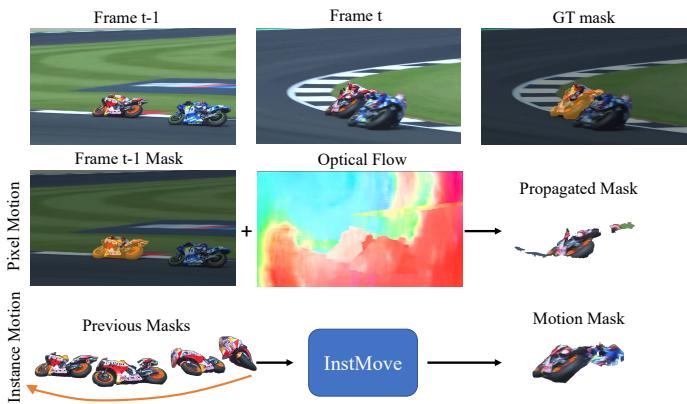
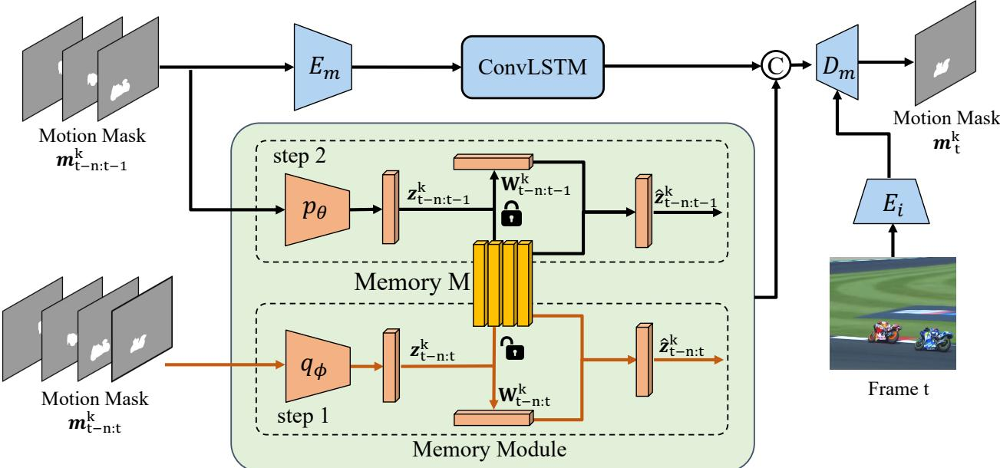
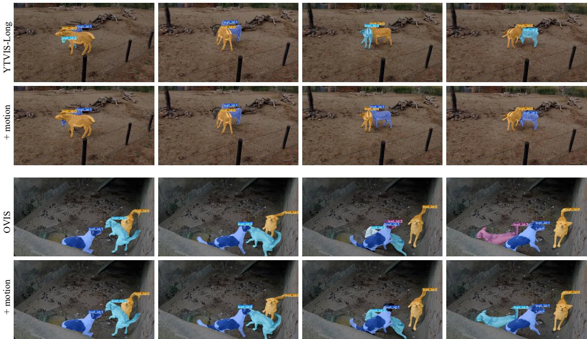

# InstMove: Instance Motion for Object-centric Video Segmentation

Qihao Liu\*1 Junfeng Wu\*2 Yi Jiang3 Xiang Bai2 Alan Yuille1 Song Bai3 1Johns Hopkins University 2Huazhong University of Science and Technology 3ByteDance

## Abstract

Despite significant efforts, cutting-edge video segmentation methods still remain sensitive to occlusion and rapid movement, due to their reliance on the appearance of objects in the form of object embeddings, which are vulnerable to these disturbances. A common solution is to use optical flow to provide motion information, but essentially it only considers pixel-level motion, which still relies on appearance similarity and hence is often inaccurate under occlusion and fast movement. In this work, we study the instance-level motion and present InstMove, which stands for Instance Motion for Object-centric Video Segmentation. In comparison to pixel-wise motion, Inst-Move mainly relies on instance-level motion information that is free from image feature embeddings, and features physical interpretations, making it more accurate and robust toward occlusion and fast-moving objects. To better fit in with the video segmentation tasks, InstMove uses instance masks to model the physical presence of an object and learns the dynamic model through a memory network to predict its position and shape in the nextframe. With only afew lines ofcode, InstMove can be integrated into current SOTA methods for three different video segmentation tasks and boost their performance. Specifically, we improve the previous arts by 1.5 AP on OVIS dataset, which features heavy occlusions, and 4.9 AP on YouTubeVIS-Long dataset, which mainly contains fast moving objects. These results suggest that instance-level motion is robust and accurate, and hence serving as a powerful solution in complex scenariosfor object-centric video segmentation.

## 1. Introduction

Segmenting and tracking object instances in a given video is a critical topic in computer vision, with various applications in video understanding, video editing, autonomous driving, augmented reality, etc. Three representative tasks include video object segmentation (VOS), video instance segmentation (VIS), and multi-object tracking and segmentation (MOTS). These tasks differ significantly from video semantic segmentation [16, 19, 31, 52], which aims to classify every pixel in a video frame, hence we refer to them as object-centric video segmentation in this paper. Despite significant progress, state-of-the-art (SOTA) methods are still struggle with occlusion, rapid motion, and significant changes in objects, resulting in a marked drop in handling longer or more complex videos.

  
Figure 1. Different from optical flow that estimates pixel-level motion, InstMove learns instance-level motion and deformation directly from previous instance masks and predicts more accurate and robust position and shape estimates for the current frame, even in scenarios with occlusions and rapid motion.

One reason we observe is that most methods rely solely on appearance to localize objects and track them across frames. Specifically, a majority of VOS methods [10, 30, 35, 40, 51, 67] use the previous frames as target templates and construct a feature memory bank of embeddings for all target objects. This is then used to match the pixel-level feature in the new frame. Online VIS [6, 15, 21, 28, 65, 72, 73] and MOTS [25, 71] methods directly perform per-frame instance segmentation based on image features and use the object embeddings to track them through the video. While these paradigms work well on simple videos, they are sensitive to intense appearance changes and struggle with handling multiple object instances with similar appearances, resulting in large errors when dealing with complex scenarios with complex motion patterns, occlusion, or deformation.

Apart from appearance cues, object motion, which is another crucial piece of information provided by videos, has also been extensively studied for video segmentation. The majority of motion models in related fields fall into two categories: One line of work uses optical flow to learn pixellevel motion. However, this approach does not help solve the problem of occlusion or fast motion since flow itself is often inaccurate in these scenarios [39,57]. The main reason causing the failure we argue is that optical flow still heavily relies on appearance cues to compute the pixel-level motion across the frame. The other line of work uses a linear speed model, which helps alleviate these tracking problems caused by occlusion and fast motion in MOT [5,44,63,77]. However, it oversimplifies the problem and thus provides limited benefits in other tasks such as VOS and VIS.

In this work, we aim at narrowing the gap between the two aforementioned lines of work by reformulating the motion module and providing InstMove, a simple yet efficient motion prediction plugin that enjoys the advantages of both solutions. First, it is portable and is compatible with and beneficial to approaches of video segmentation tasks. More importantly, similar to optical flow, it also provides highdimensional information of position and shape, which can be beneficial for a range of downstream tasks in a variety of ways, and, similar to the dynamic motion model, it learns physical interpretation to model motion information, improving robustness toward occlusion and fast motion.

To achieve our objective, we utilize an instance mask to indicate the position and shape of a target object, and provide an RNN-based module with a memory network to extract motion features from previous masks, store and retrieve dynamic information, and predict the position and shape information of the next frame based on motion cues. However, while being robust towards appearance changes, predicting shape without the object appearance or image features results in an even less accurate boundary in simple cases. To solve this, we incorporate the low-level image features at the end of InstMove. Finally, to prove the effectiveness of InstMove on object-centric video segmentation tasks, we present two simple ways to integrate InstMove into recent SOTA methods in VIS, VOS, and MOTS, which improve their robustness with minimal modifications.

In the experiments section, we first validate that our motion module is more accurate and compatible with existing methods compared with learning motion and deformation with optical flow methods such as RAFT [55]. We also show that it is more robust to occlusion and rapid movements. Then we demonstrate the improvement of integrating our motion plugin into all recent SOTA methods in VOS, VIS, and MOTS tasks, particularly in complex scenarios with heavy occlusion and rapid motion. Remarkably, with only a few lines of code, we significantly boost the current art by 1.5 AP on OVIS [47], 4.9 AP on YouTubeVIS-Long [69], and reduce IDSw on BDD100K [75] by 28.6%.

In summary, we have revisited the motion models used in video segmentation tasks and propose InstMove, which contains both pixel-level information and instance-level dynamic information to predict shape and position. It provides additional information that is robust to occlusion and rapid motion. The improvements in SOTA methods of all three tasks demonstrate the effectiveness of incorporating instance-level motion in tackling complex scenarios.

## 2. Related work

## 2.1. Video Segmentation and Tracking

Video segmentation and tracking is an important field including tasks such as MOT, MOTS, VIS, VOS, etc. Multi-Object Tracking (MOT) aims to estimate the trajectories of multiple objects of interest in videos. Dominant MOT methods [41, 62, 78, 79] mainly follow the tracking-bydetection paradigm, treating object detection and Re-ID as two separate tasks. MOTS is extended from MOT by changing the form of boxes to a fine-grained representation of masks. MOTS benchmarks [59, 75] are typically drawn from the same scenarios as those of MOT [37,75], and many MOTS methods [25,71] are developed upon MOT trackers.

Video Instance Segmentation (VIS) [47,72] is an emerging vision task that aims to detect, classify, segment, and track object instances in videos simultaneously. It has similar settings to MOTS, but the videos of VIS are mainly from daily life, so there are a large variety of object categories and forms of motion, resulting in more complex scenarios compared with MOTS. Current VIS methods can be categorized as offline or online methods. Offline methods [3, 4, 18, 22, 32, 61, 64] take the whole video or a video clip as input and predict the mask sequence with a single step. MaskProp [4] and Propose-Reduce [32] perform mask propagation in a video clip to improve mask and association. VisTR [61] and related methods [18, 22, 64] adopt the transformer [58] to VIS and model object queries for the input video. Online methods [6,15,21,28,65,72,73] perform instance segmentation on each frame of the video while tracking instances and optimizing results across frames by object embedding similarity and other cues.

Video Object Segmentation (VOS) aims to segment video sequences, classifying each pixel corresponding to foreground objects in every frame. We focus on a semisupervised VOS setting, where the instance annotations of the first frame are provided. Propagation-based methods [8, 36] refine the target segmentation mask in a temporal label propagation manner. Space-Time Memory (STM) network [10,30,35,40,51,67] is another popular framework that builds a memory bank for each object in the video and matches every query frame to the memory bank to readout memory for tracking and segmentation.

All these tasks focus on objects and instance tracking in the video, and hence object motion information is critical, particularly in the case of fast movement, occlusion, and large deformation. We aim to model instance-level motion to alleviate the problem caused by complex scenarios.

## 2.2. Object Motion

Object motion information in the video is a critical problem that is useful for a variety of tasks such as MOT, VOS, and VIS. In MOT tasks, many methods try to utilize motion in various forms. Motion can be modeled for trajectory prediction by constant velocity assumption (CVA) [2, 12]. In crowded environments, pedestrian motion becomes more complex, prompting researchers to utilize the more expressive Social Force Mode [1, 43, 49, 50, 70]. Some methods [5, 44, 63, 77] use the Kalman filter motion model to improve the robustness to serious occlusions and short-term disappearing followed by quick reappearance. Kalman filter is used to predict the location of the tracklets in the subsequent frame, and then the assignment cost matrix is computed as the distance between the predicted motion and all predicted bounding boxes. However, in MOT, motion is only modeled as the velocity and scale of the object. The fine-grained segmentation information of the object is hard to use when it comes to the extended task, i.e., MOTS.

Optical flow estimation has been extensively studied [13, 23,55] and it is widely used as motion information for VOS tasks. Some methods [20, 57, 66] estimate object segmentation and optical flow synergistically and reinforce the representation of the target frame by aligning and integrating representations from its neighbors such that the combination improves robustness to motion blur, appearance variation, and deformation of video objects. A commonly used architecture is dual-branch CNN models [11, 14, 24, 27, 56, 74], consisting of an appearance branch and a motion branch. They take RGB frames and optical flow as input and address the video object segmentation problem by leveraging the complementarity of appearance and motion cues. Optical flow can be used to propagate an object segmentation over time but unfortunately, it is often inaccurate, particularly around object boundaries. To the best of our knowledge, no previous VIS algorithm explicitly models object motion and deformation. In this paper, we focus on the online VIS models and improve their performance in complex scenarios by integrating them with motion information.

Different from the previous motion methods, we propose instance-level motion that has both fine-grained information and physical meaning about an object compared with the velocity model and optical flow. We find that instance-level motion is more accurate and robust to occlusion and fastmoving objects, and can be integrated into current SOTA methods to boost their performance in complex scenarios.

## 3. InstMove: Instance-level Motion Prediction

We aim to design a flexible and efficient motion prediction module that can be easily added on top of any existing method. To this end, we design a memory-based motion prediction. We first formulate the problem in Sec. 3.1. Then we explain how we design the memory network (Sec. 3.2) and how we use it to predict motion (Sec. 3.3). Finally, we explain how we add the motion module to all methods in detail (Sec. 3.4).

## 3.1. Problem Formulation and Motivation

Since we focus on segmentation tasks, we directly use the binary mask of an instance to represent the shape and position and predict motion upon it. Let $I _ { t } \in \mathbb { R } ^ { w \times h \times 3 }$ denotes the t-th frame of the input video and $\mathbf { m } _ { t } ^ { k } \in \mathbb { R } ^ { w \times h }$ denotes the binary mask of instance k in this frame. The goal of this module is to learn the motion and deformation from $\mathbf { m } _ { t - n } ^ { k } : 0 \mathbf { m } _ { t - 1 } ^ { k }$ , and then predict the shape and position, denoted by $\mathbf { m } _ { t } ^ { k }$ . In our problem, we only require our module to predict one frame forward, but we wish it can take various number of frames as input, i.e. m $\mathbf { l } _ { t } ^ { k } = F ( \mathbf { m } _ { t - n : t - 1 } ^ { k } ) , \forall n \geq 2$ where F denotes our motion module.

A naive solution would be to use recurrent neural networks (RNNs) such as Conv-LSTM [54] to extract the dynamics from the input frames and predict the next, but this solution yields poor results. They tend to make pixel-wise predictions for the entire image, while we want to learn instance-level motion and thus all pixels should be considered as a unit. Following the concept of conditional variational autoencode (CVAE) that models the dynamics with a Gaussian and samples latent variables $\mathbf { z } _ { t }$ from this distribution for prediction [34, 48], we also use an encoder during training to learn the motion pattern represented by $\mathbf { z } _ { t } .$ . However, we maintain a memory network M to store representative motion patterns. The stored motion patterns are then used during inference to help refine the incomplete pattern that is extracted only from previous frames $\mathbf { m } _ { t - n : t - 1 } ^ { \bar { k } }$ , and the refined pattern, which contains the instance-level motion information, is used to assist the prediction of the next frames $\mathbf { m } _ { t } ^ { k }$ . Fig. 2 shows the overall framework of our motion prediction plugin.

## 3.2. Memory Network

During training, we assume that we have access to the target mask $\mathbf { m } _ { t } ^ { k }$ . We can learn a motion feature/pattern $\mathbf { z } _ { t - n : t } ^ { k } = q _ { \phi } ( \mathbf { m } _ { t - n : t } ^ { k } )$ . Different from the CVAE model that uses $q _ { \phi }$ to approximate a posterior distribution and use a network to learn the mean and variance, we directly use $q _ { \phi }$ to regress a vector of length l here. The motion pattern $\mathbf { z } _ { t - n : t } ^ { k } \in \mathbb { R } ^ { l }$ is then stored in a memory bank $\mathbf { M } \in \mathbb { R } ^ { c \times l }$ by a corresponding attention weight vector $\mathbf { w } _ { 1 : t } ^ { k } ~ \in ~ \mathbb { R } ^ { c }$ following a typical solution [17, 26, 42]. Specifically, let $\mathbf { v } _ { i } \in \mathbb { R } ^ { l } , i = 1 , . . . ,$ c denotes memory vectors of the memory bank M, then the i-th element of $\mathbf { w } _ { t - n : t } ^ { k }$ is computed via a soft-max function:

  
Figure 2. InstMove model pipeline. We use instance mask $\mathbf { m } ^ { k }$ to represent the position and shape of instance k. During the two-step training process, ground-truth masks $\mathbf { m } _ { t - n : t } ^ { k }$ and $\mathbf { m } _ { t - n : t - 1 } ^ { k }$ are provided and the memory bank M is only updated in step 1. During inference, we directly use the estimated masks $\mathbf { m } _ { t - n : t - 1 } ^ { k }$ of the target video segmentation method as input to predict the mask $\mathbf { m } _ { t } ^ { k }$ , and only step 2 is involved. Image features are added at the very end of InstMove to refine the boundary.

$$
w _ { 1 : t , i } ^ { k } = \frac { e x p \{ S _ { c o s } ( \mathbf { z } _ { t - n : t } ^ { k } , \mathbf { v } _ { i } ) \} } { \sum _ { j = 1 } ^ { c } e x p \{ S _ { c o s } ( \mathbf { z } _ { t - n : t } ^ { k } , \mathbf { v } _ { j } ) \} }\tag{1}
$$

where $\begin{array} { r l r } { S _ { c o s } ( { \bf a } , { \bf b } ) } & { { } = } & { { \frac { { \bf a } \cdot { \bf b } } { | | { \bf a } | | \cdot | | { \bf b } | | } } } \end{array}$ is the cosine similarity between vector a and $b .$ The weight vector $\mathbf { w } _ { t } ^ { k }$ is a nonnegative weight vector with entries sum to one, and it enables us to access the memory bank. Given a latent variable $\mathbf { z } \in \mathbb { R } ^ { l }$ , we can obtain the corresponding memory feature:

$$
\hat { \mathbf { z } } = \mathbf { w } \mathbf { M } = \sum _ { i = 1 } ^ { c } w _ { i } \mathbf { v } _ { i }\tag{2}
$$

This parameters of M are updated via backpropagation. This process provides us a explicit way to store different motion patterns and to retrieve a given motion pattern $\mathbf { z } _ { t - n : t } ^ { k }$ from the memory network.

Given a trained memory bank M and the input masks $\mathbf { m } _ { t - n : t - 1 } ^ { k }$ , we can use another encoder pθ to extract motion patterns $\mathbf { z } _ { t - n : t - 1 } ^ { k } = p _ { \theta } ( \mathbf { m } _ { t - n : t - 1 } ^ { k } )$ . Note that $p _ { \theta }$ and $q _ { \phi }$ share the same architecture but use different parameters. Then we can use Eq. 1 and 2 to access the memory bank, match $\mathbf { z } _ { t - n : t - 1 } ^ { k }$ with a learned motion pattern, and retrieve the corresponding motion pattern/prior $\hat { \mathbf { z } } _ { t - n : t - 1 } ^ { k }$ . The memory bank M is not updated in this step.

## 3.3. Motion Prediction with Memory Network

With the help of memory network, we can then use an RNN-based network to predict the target frame $\mathbf { m } _ { t } ^ { k }$ . Specifically, given the input masks $\mathbf { m } _ { t - n : t - 1 } ^ { k }$ , we use a mask encoder $E _ { m }$ followed by a Conv-LSTM L to extract mask features $\mathbf { f } _ { t - n : t - 1 } ^ { k } = L ( E _ { m } ( \mathbf { m } _ { t - n : t - 1 } ^ { k } ) )$ . Then the mask feature $\mathbf { f } _ { t - n : t - 1 } ^ { k }$ and the retrieved motion pattern $\hat { \mathbf { z } } _ { ( \cdot ) } ^ { k }$ are combined together [26] and fed to a mask decoder $D _ { m }$ to predict the target mask $\mathbf { m } _ { t } ^ { k } = D _ { m } ( \mathbf { f } _ { t - n : t - 1 } ^ { k } , \hat { \mathbf { z } } _ { ( . ) } ^ { k } )$

For each iteration, the training process involves two steps. In step 1, we train the encoder $q _ { \phi }$ and the parameters of memory bank M with input $\mathbf { m } _ { t - n : t } ^ { k }$ . Then $\hat { \mathbf { z } } _ { ( \cdot ) } ^ { k } = \hat { \mathbf { z } } _ { ( t - n : t ) } ^ { k }$ is used to predict the target mask $\mathbf { m } _ { t } ^ { k }$ In step 2, we freeze the the parameters of M and feed $\mathbf { m } _ { t - n : t - 1 } ^ { k }$ to encoder $p _ { \theta _ { - } }$ . We only train the encoder $p _ { \theta }$ in this step and $\hat { \mathbf { z } } _ { ( \cdot ) } ^ { k } = \hat { \mathbf { z } } _ { ( t - n : t - 1 ) } ^ { k }$ is used for prediction. At test time, only pθ with input $\mathbf { m } _ { t - n : t - 1 } ^ { k }$ is used to compute the latent variable and retrieve motion pattern from the memory network. Refine Mask Boundary with Image Features. To obtain more accurate shape estimates, we consider using the image feature at the very end to refine $\mathbf { m } _ { t } ^ { k }$ . We employ the first two stages of ResNet-50 as image encoder $E _ { i }$ to extract low-level features from the original image, which generate feature maps with 8 strides and 4 strides, respectively. They are then upsampled by two and added together with the motion feature in the decoder. Note that this step is optional, and directly using the outputs of the backbone of original video segmentation methods could also yield comparable or even larger improvements (See Sec. 4.7). Loss Function. As the predicted motion mk is in the form of binary masks, we use the mask loss $\mathcal { L } _ { \mathrm { m a s k } }$ that commonly used in segmentation methods such as DETR [7] to supervise the learning of motion. It is defined as a combination of the Dice [38] and Focal loss [33]: $\mathcal { L } _ { \mathrm { m a s k } } = \lambda _ { f o c a l } \mathcal { L } _ { f o c a l } +$ $\lambda _ { d i c e } \mathcal { L } _ { d i c e }$ . We set $\lambda _ { f o c a l } = 1$ and $\lambda _ { d i c e } = 5 $

## 3.4. Plugin for Object-centric Video Segmentation

We consider three different object-centric video segmentation tasks and provide two straightforward ways to utilize our motion module: (1) To help the tracking process, we use motion prediction to obtain a motion score and combine it with the original matching score of embedding similarities. (2) To improve the segmentation quality, we use the motion mask as an attention map and concatenate it with the feature map in the decoder. Both can be easily implemented in a few lines of code, but improving the performance of all methods in these three tasks, especially in complex scenarios with occlusion or fast-moving objects, demonstrating the efficacy of using the instance-level motion.

VIS. For the VIS task, we adopt CrossVIS [73], a classic method, as well as two recently proposed SOTA methods, MinVIS [21] and IDOL [65], as our baselines. To eliminate the influence of random variation during training, we modify only the inference stage of the VIS models and utilize the official pre-trained weights for inference.

1) CrossVIS compares the cosine similarity of embeddings and combines the cues of the box position and the classification results to obtain a matching score, which is used to assign the object in the current frame to the existing tracklets. Therefore, we use the previous masks in the existing tracklets to predict the motion masks of the objects in the current frame, then we calculate the mask IoUs between motion masks and the instance segmentation results as motion score. Finally, we add the motion score to the original matching score to use motion to help with the tracking.

2) IDOL only uses contrastive embedding to calculate the bi-softmax score to assign the objects in the current frame, so we add the motion score to it in the same way.

3) MinVIS employs the Hungarian algorithm on a score matrix S, the cosine similarity of query embeddings, for tracking. To avoid introducing redundant information, we only calculate the motion score for the top 20 tracklets with the highest confidence scores.

MOTS. MOTS has a similar setting to VIS, we adopt PCAN [25] and Unicorn [71]. They use the bi-softmax between object embeddings as the matching score to achieve object tracking. To improve tracking quality, we add motion scores in the same way to introduce motion information.

VOS. For the VOS task, we adopt STCN [10] as an example. Different from previous algorithms for VIS and MOTS, STCN constructs a memory bank for each object in the video, and when predicting the next frame, it needs to read the features in memory to decode them into the predicted mask. Therefore, we added a convolutional layer into the decoder to process the concatenation of the motion mask and feature map. We retrain the STCN to adapt the input of motion information and load the frozen motion module to generate a motion mask during training.

## 4. Experiments

## 4.1. Datasets and Metrics

VIS. For VIS task, the OVIS [47], YouTube-VIS-Long [69], OVIS-Sub, and OVIS-Sub-Sparse datasets are used.

OVIS is a recent and challenging dataset, with 607 training videos, 140 validation videos, and 154 test videos. The videos are considerably longer and last 12.77s on average. OVIS is characterized by challenging scenarios, featuring severe occlusions, complex motion patterns, and rapid object deformation. YouTube-VIS-Long tackles the scenarios of long and highly complicated sequences, consisting of 71 long videos in the validation set. Compared with the previous YouTube-VIS dataset, the videos are longer and with only 1 FPS sample rate, making it very challenging. OVIS-Sub is a subset of the OVIS dataset. The annotations for the OVIS validation set is not available, so we split the training set into custom training and validation sets to evaluate the predicted motion mask. We divided the 607 training videos into a validation subset of 122 videos and a new training subset, following the approach of IDOL [65].

Handling longer videos with lower sampling rates is a valuable scenario, but the small scale of YouTube-VIS-Long makes the analysis on it less convincing. To address this, we sparsely sample the videos from OVIS-Sub to make a larger dataset with the same features, named OVIS-Sub-Sparse. For the validation subset, the frames and annotations are kept every 5 frames to achieve a sampling rate of about 1FPS, similar to YouTube-VIS-Long.

MOTS. We evaluate the methods on BDD100K [75], which is a challenging self-driving dataset with 154 videos for training, 32 videos for validation, and 37 videos for testing. The dataset provides 8 annotated categories for evaluation, where the images in the tracking set are annotated per 5 FPS with 30 FPS frame rate. We report multi-object tracking and segmentation accuracy (MOTSA), number of Identity Switches (IDSw), and ID F1 score. ID F1 score is the ratio of correctly identified detection over the average number of ground-truths and detection.

VOS. DAVIS-17 [46] contains 30 videos in the validation set and there could be multiple tracked targets in each sequence. YouTube-VOS 2019 [68] is a large-scale benchmark for multi-object video segmentation, providing 3,471 videos for the training (65 categories) and 507 videos (65 training categories, 26 unseen categories ) for the validation.

<table><tr><td rowspan="2">Method</td><td colspan="6">OVIS</td><td colspan="6">OVIS-Sub-Sparse</td></tr><tr><td>AP</td><td> $\Delta _ { A P }$ </td><td> $\mathrm { A P _ { 5 0 } }$ </td><td> $\mathrm { A P _ { 7 5 } }$ </td><td> $\mathrm { { A R } _ { 1 } }$ </td><td> $\mathrm { { A R } _ { 1 0 } }$ </td><td> $\mathrm { A P }$ </td><td> $\Delta _ { A P }$ </td><td> $\mathrm { A P _ { 5 0 } }$ </td><td> $\mathrm { A P _ { 7 5 } }$ </td><td> $\mathrm { { A R } _ { 1 } }$ </td><td> $\mathrm { { A R } _ { 1 0 } }$ </td></tr><tr><td>CrossVIS [73]</td><td>12.6</td><td></td><td>28.4</td><td>10.8</td><td>8.9</td><td>17.1</td><td>7.0</td><td></td><td>16.8</td><td>5.5</td><td>6.1</td><td>11.0</td></tr><tr><td>CrossVIS+InstMove</td><td>16.7</td><td> $+ 4 . 1$ </td><td>35.1</td><td>15.0</td><td>10.0</td><td>21.6</td><td>8.9</td><td> $+ 1 . 9$ </td><td>20.7</td><td>7.0</td><td>7.4</td><td>13.3</td></tr><tr><td>MinVIS [21]</td><td>26.2</td><td></td><td>48.2</td><td>25.0</td><td>14.4</td><td>30.1</td><td>15.3</td><td></td><td>31.8</td><td>13.6</td><td>10.1</td><td>20.6</td></tr><tr><td>MinVIS+InstMove</td><td></td><td> $2 7 . 6 \quad \begin{array} { r l } { { } + 1 . 4 } \end{array}$ </td><td>51.0</td><td>26.4</td><td>14.4</td><td>31.5</td><td>18.2</td><td>+ 2.9</td><td>36.9</td><td>16.0</td><td>11.2</td><td>23.3</td></tr><tr><td>IDOL [65]</td><td>29.2</td><td></td><td>49.8</td><td>29.1</td><td>14.8</td><td>37.0</td><td>16.5</td><td></td><td>34.0</td><td>15.3</td><td>10.3</td><td>25.9</td></tr><tr><td>IDOL+InstMove</td><td></td><td> $3 0 . 7 \quad + 1 . 5 \quad$ </td><td>51.4</td><td>30.9</td><td>15.0</td><td>37.7</td><td></td><td> $1 8 . 5 \quad \mathrm { ~ } + 2 . 0$ </td><td>37.8</td><td>16.8</td><td>10.7</td><td>27.0</td></tr></table>

Table 1. Quantitative results of video instance segmentation on OVIS and OVIS-Sub-Sparse validation set. We directly test the official pre-trained models for MinVIS and IDOL, and only use our motion module during inference, with no additional training. For CrossVIS, the pre-trained model is not available, so we report the performance of the model trained by ourselves with the official code. The motion modules used in this table are trained on OVIS and OVIS-Sub-Sparse datasets, respectively.

For DAVIS 2017, we report standard metrics [45]: Jaccard index J , contour accuracy $\mathcal { F }$ and their average $\mathcal { T } \& \mathcal { F }$ . For YouTubeVOS, we report $\mathcal { I }$ and F for both seen and unseen categories, and the averaged overall score G.

## 4.2. Implementation Details

Model Setting. All encoders and decoders involved consist of several Conv layers or fully connected layers. Three 3D-Conv layers are used for $q _ { \phi }$ and $p _ { \theta }$ , and two 2D-Conv layers are used for mask encoder $E _ { m }$ , followed by a 3-layer ConvLSTMs. For mask decoder $D _ { m }$ , we employ three 2D-DeConv layers. The image encoder $E _ { i }$ uses the first two layers of a pre-trained ResNet-50 backbone.

Training and Inference. For evaluation on these video segmentation tasks, we first train InstMove on the corresponding dataset independently and freeze the InstMove weights during inference. We re-scale all the input image masks to 384×384 with padding to preserve the aspect ratios. During training, the ground-truth masks are used, and during inference, we use the masks predicted by the target method as the input of InstMove. To be able to handle different length of inputs, we set randomly select n from [2, 5] during training.

## 4.3. Comparison to Optical Flow

In this section, we demonstrate that our motion module is more accurate and suitable for object-centric video segmentation tasks than the commonly used paradigm of learning pixel-wise motion with optical flow methods such as RAFT. We consider two different scenarios: videos with occlusions and videos with fast-moving objects, and conduct experiments on the OVIS-Sub, and OVIS-Sub-Sparse datasets.

For fair comparisons, we first use the official pre-trained model of RAFT [55] to predict optical flow on the training split of each dataset. The predictions are then used as pseudo-labels to fine-tune the RAFT model for 50k iterations (following the original RAFT paper). After that, we use the new model to generate optical flow predictions on val split and propagate the masks based on them. For our motion module, we directly train it from scratch on the training split for 100K iterations. The results are shown in Table 2. We can see that our model outperforms the RAFTbased motion module by a significant margin, especially for complex videos with occlusion or fast-moving objects.

<table><tr><td rowspan="2"></td><td colspan="2">OVIS-Sub</td><td colspan="2">OVIS-Sub-Sparse</td></tr><tr><td>mAP(↑)</td><td>IOU(↑)</td><td>mAP(↑)</td><td>IOU(↑)</td></tr><tr><td>RAFT [55]</td><td>46.3</td><td>64.2</td><td>30.6</td><td>49.5</td></tr><tr><td>InstMove (Ours)</td><td>67.8</td><td>79.2</td><td>57.3</td><td>70.7</td></tr></table>

Table 2. Comparison for motion prediction using our method and optical flow. We compare the propagated masks from RAFT and the predicted masks from our motion module here. All models are trained/fine-tuned on the corresponding training split and tested on the test split with an image size of 384 × 384. Our model is more accurate and robust under occlusion and fast motion.

## 4.4. Evaluations on Video Instance Segmentation

In this section, we demonstrate that our motion module is able to boost most VIS methods on three challenging datasets. We plug the motion module into three online VIS algorithms to improve their tracking results as described in Sec. 3.4, and then evaluate on three challenging VIS datasets. For IDOL and MinVIS, we directly download the pre-trained model weight on the OVIS and YTVIS21 datasets from the official model zoo. For the OVIS-Sub-Sparse dataset, we follow the official training scripts to train new IDOL and MIinVIS models on the training subset. Since there are no available pre-trained models of CrossVIS in the official model zoo, we retrained CrossVIS on these three datasets. All algorithms use ResNet-50 as backbone.

As shown in Table 1, our motion module can improve the performance of CrossVIS by 4.1 AP, MinVIS by 1.4 AP, and IDOL by 1.5 AP on OVIS validation set. IDOL is the SOTA method for VIS tasks and has made a great improvement in tracking process. It uses a very sophisticated mechanism to solve the tracking problem. The improvement on IDOL shows that we can further improve the tracking quality of VIS by integrating the motion information. When it comes to the YTVIS-Long dataset with lower FPS, it can be seen that the improvement brought by the motion module becomes more significant in Table 3. IDOL and MinVIS are improved by 4.9 AP and 3.6 AP respectively. As shown in the Table 1, MinVIS improves 2.9 AP on OVIS-Sub-Sparse, and IDOL improves 2.0 AP. The results on OVIS-Sub-Sparse demonstrate the improvement brought by our motion module on low FPS videos more convincingly. The low FPS makes the fast-moving objects occur frequently, which is a very challenging scenario. In Figure 3, we provide qualitative results to demonstrate how InstMove improves the tracking result in occlusion and fast-moving scenarios. We believe that the motion information can help the VIS algorithm to better utilize the motion information of the object and to make accurate tracking.

Figure 3. Qualitative results of IDOL on the YouTube-VIS 2022 Long and OVIS validation dataset. We can see that the ID switch happens in the third and last frame of the first row, probably because these two zebras are very close and have similar appearances. The same error happens in the last frame of the third row. Leveraging motion information effectively solves this problem and makes IDOL more robust toward occlusion and similar objects.
<table><tr><td></td><td>AP</td><td> $\mathrm { A P _ { 5 0 } }$ </td><td> $\mathrm { A P _ { 7 5 } }$ </td><td> $\mathrm { { A R } _ { 1 } }$ </td><td> $\mathrm { { A R } _ { 1 0 } }$ </td></tr><tr><td>MinVIS [21]</td><td>22.3</td><td>44.6</td><td>20.2</td><td>19.2</td><td>26.4</td></tr><tr><td>MinVIS+InstMove</td><td>25.9</td><td>46.7</td><td>24.8</td><td>24.5</td><td>30.0</td></tr><tr><td>IDOL [65]</td><td>35.7</td><td>62.4</td><td>35.7</td><td>32.0</td><td>44.7</td></tr><tr><td>IDOL+InstMove</td><td>40.6</td><td>67.2</td><td>45.1</td><td>35.0</td><td>48.2</td></tr></table>

Table 3. Quantitative results of video instance segmentation on YouTube-VIS Long validation set. The motion module used in this table is trained on YouTube-VIS 2021 training set.

<table><tr><td></td><td>mMOTSA (↑)</td><td>IDF1 (↑)</td><td>ID switch (↓)</td></tr><tr><td>PCAN [25]</td><td>30.5</td><td>44.5</td><td>775</td></tr><tr><td>PCAN+InstMove</td><td>30.8</td><td>44.7</td><td>699</td></tr><tr><td>Unicorn [71]</td><td>30.7</td><td>47.1</td><td>2044</td></tr><tr><td>Unicorn+InstMove</td><td>31.2</td><td>48.2</td><td>1460</td></tr></table>

Table 4. Quantitative results of MOTS on BDD100K validation set. InstMove is trained on BDD100K MOTS training set.
<table><tr><td rowspan="2">Unicorn</td><td colspan="2">official val</td><td colspan="2">occlusion-subset</td><td colspan="2">continuous-subset</td></tr><tr><td>IDSw(↓)</td><td>IDSw/I(↓)</td><td>IDSw</td><td>IDSw/I</td><td>IDSw</td><td>IDSw/I</td></tr><tr><td>w/o InstMove</td><td>2044</td><td>41.3%</td><td>1194</td><td>129.6%</td><td>856</td><td>21.3%</td></tr><tr><td>w/ InstMove</td><td>1460</td><td>29.5%</td><td>882</td><td>95.7%</td><td>579</td><td>14.4%</td></tr></table>

Table 5. Comparison of IDSw on MOTS occlusion subsets. We take BDD100K MOTS validation set as ‘official val’, and split it into occlusion and continuous subsets.

## 4.5. Evaluations on Multi-Object Tracking and Segmentation

To evaluate the improvement of our motion module on MOTS tasks, we choose the SOTA algorithms PCAN [25] and Unicorn [71] as our baseline algorithms. As with the VIS algorithm, we directly use the official pre-trained models. InstMove only changes the matching score for tracking during inference, thereby improving the tracking performance of the models without changing their segmentation quality. As shown in Table 4, integrating with Inst-Move improves tracking accuracy and reduces the IDSw of PCAN by 9.8% and Unicorn by 28.6%, thus improving the mMOTSA and IDF1 of them.

<table><tr><td>DAVIS 2017</td><td colspan="2">J&amp;F-Mean(↑)</td><td>J-Mean(↑)</td><td colspan="2">F-Mean(↑)</td></tr><tr><td>STCN [10] STCN+InstMove</td><td colspan="2">83.8 85.1</td><td colspan="2">80.4 82.3</td><td>87.2 87.9</td></tr><tr><td></td><td></td><td></td><td></td><td></td><td></td></tr><tr><td>YouTubeVOS 2019</td><td>G (↑)</td><td>Js (↑)</td><td>Fs (↑)</td><td>Ju (↑)</td><td>Fu (↑)</td></tr><tr><td>STCN [10]</td><td>82.8</td><td>81.5</td><td>77.9</td><td>85.8</td><td>85.9</td></tr><tr><td>STCN+InstMove</td><td>83.4</td><td>82.5</td><td>77.9</td><td>86.9</td><td>86.0</td></tr></table>

Table 6. Quantitative results of video object segmentation on DAVIS 2017 and YouTube-VIS 2019 validation set. The motion module is first pre-trained on DAVIS and YouTube VOS dataset. Then we freeze the motion module and re-train the STCN with the same training setup as the baseline.
<table><tr><td rowspan="2"></td><td colspan="2">OVIS-Sub</td><td colspan="2">OVIS-Sub-Sparse</td></tr><tr><td>mAP(↑)</td><td>IOU(↑)</td><td>mAP(↑)</td><td>IOU(↑)</td></tr><tr><td>No image encoder</td><td>61.0</td><td>74.4</td><td>46.6</td><td>61.7</td></tr><tr><td>Fixed image encoder</td><td>66.2</td><td>77.3</td><td>53.3</td><td>67.1</td></tr><tr><td>Full model</td><td>67.8</td><td>79.2</td><td>57.3</td><td>70.7</td></tr></table>

Table 7. Effects of using image features during motion prediction. For ‘fixed image encoder’, we directly use the pre-trained weights of the first two layers of the image backbone in IDOL [65].

For objects that disappear and reappear in BDD100K, we filter them out and form the occlusion-subset, which contains 921 objects. The rest objects form the continuoussubset. We evaluate the performance of Unicorn w/ and w/o InstMove, and report number of Identity Switches (IDSw) and IDSw per instance (IDSw/I). As shown in Tab. 5, the IDSw/I is reduced more significantly on the occlusionsubset, which indicates that InstMove is able to help MOTS algorithm solve the tracking problem caused by occlusion.

## 4.6. Evaluations on Video Object Segmentation

Since we plug a convolution layer into the original STCN [10] model to introduce motion information from InstMove, we need to retrain the STCN model. We first reload the pre-trained weight that is obtained by training on static image datasets [9, 29, 53, 60, 76] with synthetic deformation, following STCN. Then we perform main training of the same setup on YouTubeVOS [68] and DAVIS [45, 46], and evaluate the performance on YouTube-VOS 2019 and DAVIS 2017 validation set. As shown in Table 6, integrated with our motion module, STCN can be improved from 83.8 to 85.1 on DAVIS2017, and from 82.8 to 83.4 on YouTubeVOS 2019. This demonstrates that the estimation of the position and shape of the object in the next frame predicted by InstMove can be used as prior information to improve the segmentation ability of the VOS models.

<table><tr><td>OVIS</td><td>AP</td><td> $\mathrm { A P _ { 5 0 } }$ </td><td> $\mathrm { A P _ { 7 5 } }$ </td><td> $\mathrm { { A R } _ { 1 } }$ </td><td> $\mathrm { { A R } _ { 1 0 } }$ </td></tr><tr><td>Full model</td><td>30.7</td><td>51.4</td><td>30.9</td><td>15.0</td><td>37.7</td></tr><tr><td>Fixed image encoder</td><td>30.9</td><td>52.4</td><td>30.8</td><td>15.1</td><td>38.0</td></tr><tr><td>No image encoder</td><td>30.1</td><td>51.1</td><td>29.8</td><td>14.7</td><td>37.5</td></tr><tr><td>Kalman</td><td>29.2</td><td>49.7</td><td>28.8</td><td>15.1</td><td>36.1</td></tr><tr><td>w/o motion</td><td>29.2</td><td>49.8</td><td>29.1</td><td>14.8</td><td>37.0</td></tr></table>

Table 8. Effects of fixed-encoder motion module and Kalman filter motion module in VIS task. We report the results on OVIS validation set. For ‘fixed image encoder’, the motion module shares the image encoder weights with IDOL. For ‘Kalman’, we replace our motion module with a Kalman filter to predict the trajectory of the center of the bounding box.

## 4.7. Ablation Study

Refine Mask boundary with Image Features. Tab. 7 shows the effects of using image feature to refine the motion prediction. Directly adding the low-level image features can further improve the accuracy of motion prediction. Using a fixed image encoder also boosts performance. Since all methods require an image backbone to extract features, using a fixed image encoder does not incur extra costs. However, the motion module will no longer be universal, and we need to train a separate motion module for each model.

Effect of Using Different Motion Modules. To investigate the impact of different motion modules on the performance of downstream tasks like VIS, we use the motion module with a fixed image encoder to predict the motion score for IDOL. As shown in Tab. 8, freezing the image encoder still improves the tracking results. To understand whether the Kalman filter motion model used by previous MOT methods [5, 44], we employ a Kalman filter to predict the trajectory of the center of the bounding box, and then calculate the Euclidean distance between the trajectories and the predicted boxes to get the motion score for tracking. The results show that the Kalman filter motion model barely enhances the performance of VIS task.

## 5. Conclusion

In this work, we introduced InstMove that learns the dynamic model of an object by modeling its physical presence with instance masks. In contrast to the velocity model and optical flow-based motion model, InstMove has both finegrained information and the physical meaning of an object. It provides additional information that is robust in complex scenarios and benefits the video segmentation methods.

Acknowledgements. QL acknowledges support from the Office of Naval Research with award N00014-21-1- 2812. JW acknowledges support from the National Natural Science Foundation of China No. 62225603. We thank the reviewers for their efforts and valuable feedback to improve our work.

## References

[1] Alexandre Alahi, Kratarth Goel, Vignesh Ramanathan, Alexandre Robicquet, Li Fei-Fei, and Silvio Savarese. Social lstm: Human trajectory prediction in crowded spaces. In Proceedings of the IEEE conference on computer vision and pattern recognition, pages 961–971, 2016. 3

[2] Anton Andriyenko and Konrad Schindler. Multi-target tracking by continuous energy minimization. In CVPR 2011, pages 1265–1272. IEEE, 2011. 3

[3] Ali Athar, Sabarinath Mahadevan, Aljosa Osep, Laura Leal-Taixe, and Bastian Leibe. Stem-seg: Spatio-temporal em-´ beddings for instance segmentation in videos. In ECCV, 2020. 2

[4] Gedas Bertasius and Lorenzo Torresani. Classifying, segmenting, and tracking object instances in video with mask propagation. In CVPR, 2020. 2

[5] Alex Bewley, Zongyuan Ge, Lionel Ott, Fabio Ramos, and Ben Upcroft. Simple online and realtime tracking. In 2016 IEEE international conference on image processing (ICIP), pages 3464–3468. IEEE, 2016. 2, 3, 8

[6] Jiale Cao, Rao Muhammad Anwer, Hisham Cholakkal, Fahad Shahbaz Khan, Yanwei Pang, and Ling Shao. Sipmask: Spatial information preservation for fast image and video instance segmentation. In ECCV, 2020. 1, 2

[7] Nicolas Carion, Francisco Massa, Gabriel Synnaeve, Nicolas Usunier, Alexander Kirillov, and Sergey Zagoruyko. End-toend object detection with transformers. In Computer Vision– ECCV 2020: 16th European Conference, Glasgow, UK, August 23–28, 2020, Proceedings, Part I 16, pages 213–229. Springer, 2020. 5

[8] Xi Chen, Zuoxin Li, Ye Yuan, Gang Yu, Jianxin Shen, and Donglian Qi. State-aware tracker for real-time video object segmentation. In Proceedings of the IEEE/CVF Conference on Computer Vision and Pattern Recognition, pages 9384– 9393, 2020. 2

[9] Ho Kei Cheng, Jihoon Chung, Yu-Wing Tai, and Chi-Keung Tang. Cascadepsp: Toward class-agnostic and very highresolution segmentation via global and local refinement. In Proceedings of the IEEE/CVF Conference on Computer Vision and Pattern Recognition, pages 8890–8899, 2020. 8

[10] Ho Kei Cheng, Yu-Wing Tai, and Chi-Keung Tang. Rethinking space-time networks with improved memory coverage for efficient video object segmentation. Advances in Neural Information Processing Systems, 34:11781–11794, 2021. 1, 2, 5, 8

[11] Jingchun Cheng, Yi-Hsuan Tsai, Shengjin Wang, and Ming-Hsuan Yang. Segflow: Joint learning for video object segmentation and optical flow. In Proceedings of the IEEE international conference on computer vision, pages 686–695, 2017. 3

[12] Wongun Choi and Silvio Savarese. Multiple target tracking in world coordinate with single, minimally calibrated camera. In European Conference on Computer Vision, pages 553–567. Springer, 2010. 3

[13] Alexey Dosovitskiy, Philipp Fischer, Eddy Ilg, Philip Hausser, Caner Hazirbas, Vladimir Golkov, Patrick Van Der Smagt, Daniel Cremers, and Thomas Brox. Flownet:

Learning optical flow with convolutional networks. In Proceedings of the IEEE international conference on computer vision, pages 2758–2766, 2015. 3

[14] Suyog Dutt Jain, Bo Xiong, and Kristen Grauman. Fusionseg: Learning to combine motion and appearance for fully automatic segmentation of generic objects in videos. In Proceedings of the IEEE conference on computer vision and pattern recognition, pages 3664–3673, 2017. 3

[15] Yang Fu, Linjie Yang, Ding Liu, Thomas S Huang, and Humphrey Shi. Compfeat: Comprehensive feature aggregation for video instance segmentation. arXiv preprint arXiv:2012.03400, 2020. 1, 2

[16] Alberto Garcia-Garcia, Sergio Orts-Escolano, Sergiu Oprea, Victor Villena-Martinez, Pablo Martinez-Gonzalez, and Jose Garcia-Rodriguez. A survey on deep learning techniques for image and video semantic segmentation. Applied Soft Computing, 70:41–65, 2018. 1

[17] Dong Gong, Lingqiao Liu, Vuong Le, Budhaditya Saha, Moussa Reda Mansour, Svetha Venkatesh, and Anton van den Hengel. Memorizing normality to detect anomaly: Memory-augmented deep autoencoder for unsupervised anomaly detection. In Proceedings of the IEEE/CVF International Conference on Computer Vision, pages 1705–1714, 2019. 3

[18] Miran Heo, Sukjun Hwang, Seoung Wug Oh, Joon-Young Lee, and Seon Joo Kim. Vita: Video instance segmentation via object token association. In NeurIPS, 2022. 2

[19] Ping Hu, Fabian Caba, Oliver Wang, Zhe Lin, Stan Sclaroff, and Federico Perazzi. Temporally distributed networks for fast video semantic segmentation. In Proceedings of the IEEE/CVF Conference on Computer Vision and Pattern Recognition, pages 8818–8827, 2020. 1

[20] Yuan-Ting Hu, Jia-Bin Huang, and Alexander G Schwing. Unsupervised video object segmentation using motion saliency-guided spatio-temporal propagation. In Proceedings of the European conference on computer vision (ECCV), pages 786–802, 2018. 3

[21] De-An Huang, Zhiding Yu, and Anima Anandkumar. Minvis: A minimal video instance segmentation framework without video-based training. In NeurIPS, 2022. 1, 2, 5, 6, 7

[22] Sukjun Hwang, Miran Heo, Seoung Wug Oh, and Seon Joo Kim. Video instance segmentation using inter-frame communication transformers. In NeurIPS, 2021. 2

[23] Eddy Ilg, Nikolaus Mayer, Tonmoy Saikia, Margret Keuper, Alexey Dosovitskiy, and Thomas Brox. Flownet 2.0: Evolution of optical flow estimation with deep networks. In Proceedings of the IEEE conference on computer vision and pattern recognition, pages 2462–2470, 2017. 3

[24] Ge-Peng Ji, Keren Fu, Zhe Wu, Deng-Ping Fan, Jianbing Shen, and Ling Shao. Full-duplex strategy for video object segmentation. In Proceedings of the IEEE/CVF international conference on computer vision, pages 4922–4933, 2021. 3

[25] Lei Ke, Xia Li, Martin Danelljan, Yu-Wing Tai, Chi-Keung Tang, and Fisher Yu. Prototypical cross-attention networks for multiple object tracking and segmentation. In NeurIPS, 2021. 1, 2, 5, 7

[26] Sangmin Lee, Hak Gu Kim, Dae Hwi Choi, Hyung-Il Kim, and Yong Man Ro. Video prediction recalling long-term motion context via memory alignment learning. In Proceedings of the IEEE/CVF Conference on Computer Vision and Pattern Recognition, pages 3054–3063, 2021. 3, 4

[27] Haofeng Li, Guanqi Chen, Guanbin Li, and Yizhou Yu. Motion guided attention for video salient object detection. In Proceedings of the IEEE/CVF international conference on computer vision, pages 7274–7283, 2019. 3

[28] Minghan Li, Shuai Li, Lida Li, and Lei Zhang. Spatial feature calibration and temporal fusion for effective one-stage video instance segmentation. In CVPR, 2021. 1, 2

[29] Xiang Li, Tianhan Wei, Yau Pun Chen, Yu-Wing Tai, and Chi-Keung Tang. Fss-1000: A 1000-class dataset for fewshot segmentation. In Proceedings of the IEEE/CVF conference on computer vision and pattern recognition, pages 2869–2878, 2020. 8

[30] Yu Li, Zhuoran Shen, and Ying Shan. Fast video object segmentation using the global context module. In European Conference on Computer Vision, pages 735–750. Springer, 2020. 1, 2

[31] Yule Li, Jianping Shi, and Dahua Lin. Low-latency video semantic segmentation. In Proceedings of the IEEE Conference on Computer Vision and Pattern Recognition, pages 5997–6005, 2018. 1

[32] Huaijia Lin, Ruizheng Wu, Shu Liu, Jiangbo Lu, and Jiaya Jia. Video instance segmentation with a propose-reduce paradigm. In ICCV, 2021. 2

[33] Tsung-Yi Lin, Priya Goyal, Ross Girshick, Kaiming He, and Piotr Dollar. Focal loss for dense object detection. In´ ICCV, 2017. 5

[34] Hung Yu Ling, Fabio Zinno, George Cheng, and Michiel Van De Panne. Character controllers using motion vaes. ACM Transactions on Graphics (TOG), 39(4):40–1, 2020. 3

[35] Xiankai Lu, Wenguan Wang, Martin Danelljan, Tianfe Zhou, Jianbing Shen, and Luc Van Gool. Video object segmentation with episodic graph memory networks. In European Conference on Computer Vision, pages 661–679. Springer, 2020. 1, 2

[36] Jonathon Luiten, Paul Voigtlaender, and Bastian Leibe. Premvos: Proposal-generation, refinement and merging for video object segmentation. In Asian Conference on Computer Vision, pages 565–580. Springer, 2018. 2

[37] Anton Milan, Laura Leal-Taixe, Ian Reid, Stefan Roth, and´ Konrad Schindler. Mot16: A benchmark for multi-object tracking. arXiv preprint arXiv:1603.00831, 2016. 2

[38] Fausto Milletari, Nassir Navab, and Seyed-Ahmad Ahmadi. V-net: Fully convolutional neural networks for volumetric medical image segmentation. In 2016 fourth international conference on 3D vision (3DV), 2016. 5

[39] Seoung Wug Oh, Joon-Young Lee, Kalyan Sunkavalli, and Seon Joo Kim. Fast video object segmentation by referenceguided mask propagation. In Proceedings of the IEEE conference on computer vision and pattern recognition, pages 7376–7385, 2018. 2

[40] Seoung Wug Oh, Joon-Young Lee, Ning Xu, and Seon Joo Kim. Video object segmentation using space-time memory

networks. In Proceedings of the IEEE/CVF International Conference on Computer Vision, pages 9226–9235, 2019. 1, 2

[41] Jiangmiao Pang, Linlu Qiu, Xia Li, Haofeng Chen, Qi Li, Trevor Darrell, and Fisher Yu. Quasi-dense similarity learning for multiple object tracking. In Proceedings of the IEEE/CVF conference on computer vision and pattern recognition, pages 164–173, 2021. 2

[42] Wenjie Pei, Jiyuan Zhang, Xiangrong Wang, Lei Ke, Xiaoyong Shen, and Yu-Wing Tai. Memory-attended recurrent network for video captioning. In Proceedings of the IEEE/CVF Conference on Computer Vision and Pattern Recognition, pages 8347–8356, 2019. 3

[43] Stefano Pellegrini, Andreas Ess, Konrad Schindler, and Luc Van Gool. You’ll never walk alone: Modeling social behavior for multi-target tracking. In 2009 IEEE 12th international conference on computer vision, pages 261–268. IEEE, 2009. 3

[44] Jinlong Peng, Changan Wang, Fangbin Wan, Yang Wu, Yabiao Wang, Ying Tai, Chengjie Wang, Jilin Li, Feiyue Huang, and Yanwei Fu. Chained-tracker: Chaining paired attentive regression results for end-to-end joint multiple-object detection and tracking. In European conference on computer vision, pages 145–161. Springer, 2020. 2, 3, 8

[45] Federico Perazzi, Jordi Pont-Tuset, Brian McWilliams, Luc Van Gool, Markus Gross, and Alexander Sorkine-Hornung. A benchmark dataset and evaluation methodology for video object segmentation. In Proceedings ofthe IEEE conference on computer vision and pattern recognition, pages 724–732, 2016. 6, 8

[46] Jordi Pont-Tuset, Federico Perazzi, Sergi Caelles, Pablo Arbelaez, Alex Sorkine-Hornung, and Luc Van Gool. The 2017´ davis challenge on video object segmentation. arXiv preprint arXiv:1704.00675, 2017. 5, 8

[47] Jiyang Qi, Yan Gao, Yao Hu, Xinggang Wang, Xiaoyu Liu, Xiang Bai, Serge Belongie, Alan Yuille, Philip HS Torr, and Song Bai. Occluded video instance segmentation: A benchmark. International Journal of Computer Vision, pages 1–18, 2022. 2, 5

[48] Davis Rempe, Tolga Birdal, Aaron Hertzmann, Jimei Yang, Srinath Sridhar, and Leonidas J Guibas. Humor: 3d human motion model for robust pose estimation. In Proceedings ofthe IEEE/CVF International Conference on Computer Vision, pages 11488–11499, 2021. 3

[49] Alexandre Robicquet, Amir Sadeghian, Alexandre Alahi, and Silvio Savarese. Learning social etiquette: Human trajectory understanding in crowded scenes. In European conference on computer vision, pages 549–565. Springer, 2016. 3

[50] Paul Scovanner and Marshall F Tappen. Learning pedestrian dynamics from the real world. In 2009 IEEE 12th International Conference on Computer Vision, pages 381–388. IEEE, 2009. 3

[51] Hongje Seong, Junhyuk Hyun, and Euntai Kim. Kernelized memory network for video object segmentation. In European Conference on Computer Vision, pages 629–645. Springer, 2020. 1, 2

[52] Evan Shelhamer, Kate Rakelly, Judy Hoffman, and Trevor Darrell. Clockwork convnets for video semantic segmentation. In European Conference on Computer Vision, pages 852–868. Springer, 2016. 1

[53] Jianping Shi, Qiong Yan, Li Xu, and Jiaya Jia. Hierarchical image saliency detection on extended cssd. IEEE transactions on pattern analysis and machine intelligence, 38(4):717–729, 2015. 8

[54] Xingjian Shi, Zhourong Chen, Hao Wang, Dit-Yan Yeung, Wai-Kin Wong, and Wang-chun Woo. Convolutional lstm network: A machine learning approach for precipitation nowcasting. Advances in neural information processing systems, 28, 2015. 3

[55] Zachary Teed and Jia Deng. Raft: Recurrent all-pairs field transforms for optical flow. In European conference on computer vision, pages 402–419. Springer, 2020. 2, 3, 6

[56] Pavel Tokmakov, Karteek Alahari, and Cordelia Schmid. Learning video object segmentation with visual memory. In Proceedings of the IEEE International Conference on Computer Vision, pages 4481–4490, 2017. 3

[57] Yi-Hsuan Tsai, Ming-Hsuan Yang, and Michael J Black. Video segmentation via object flow. In Proceedings of the IEEE conference on computer vision and pattern recognition, pages 3899–3908, 2016. 2, 3

[58] Ashish Vaswani, Noam Shazeer, Niki Parmar, Jakob Uszkoreit, Llion Jones, Aidan N Gomez, Łukasz Kaiser, and Illia Polosukhin. Attention is all you need. In NeurIPS, 2017. 2

[59] Paul Voigtlaender, Michael Krause, Aljosa Osep, Jonathon Luiten, Berin Balachandar Gnana Sekar, Andreas Geiger, and Bastian Leibe. Mots: Multi-object tracking and segmentation. In Proceedings of the ieee/cvf conference on computer vision and pattern recognition, pages 7942–7951, 2019. 2

[60] Lijun Wang, Huchuan Lu, Yifan Wang, Mengyang Feng, Dong Wang, Baocai Yin, and Xiang Ruan. Learning to detect salient objects with image-level supervision. In Proceedings ofthe IEEE conference on computer vision and pattern recognition, pages 136–145, 2017. 8

[61] Yuqing Wang, Zhaoliang Xu, Xinlong Wang, Chunhua Shen, Baoshan Cheng, Hao Shen, and Huaxia Xia. End-to-end video instance segmentation with transformers. In CVPR, 2021. 2

[62] Zhongdao Wang, Liang Zheng, Yixuan Liu, Yali Li, and Shengjin Wang. Towards real-time multi-object tracking. In European Conference on Computer Vision, pages 107–122. Springer, 2020. 2

[63] Nicolai Wojke, Alex Bewley, and Dietrich Paulus. Simple online and realtime tracking with a deep association metric. In 2017 IEEE international conference on image processing (ICIP), pages 3645–3649. IEEE, 2017. 2, 3

[64] Junfeng Wu, Yi Jiang, Song Bai, Wenqing Zhang, and Xiang Bai. Seqformer: Sequential transformer for video instance segmentation. In European Conference on Computer Vision, pages 553–569. Springer, 2022. 2

[65] Junfeng Wu, Qihao Liu, Yi Jiang, Song Bai, Alan Yuille, and Xiang Bai. In defense of online models for video instance segmentation. In ECCV, pages 588–605. Springer, 2022. 1, 2, 5, 6, 7, 8

[66] Huaxin Xiao, Jiashi Feng, Guosheng Lin, Yu Liu, and Maojun Zhang. Monet: Deep motion exploitation for video object segmentation. In Proceedings of the IEEE Conference on Computer Vision and Pattern Recognition, pages 1140– 1148, 2018. 3

[67] Haozhe Xie, Hongxun Yao, Shangchen Zhou, Shengping Zhang, and Wenxiu Sun. Efficient regional memory network for video object segmentation. In Proceedings of the IEEE/CVF Conference on Computer Vision and Pattern Recognition, pages 1286–1295, 2021. 1, 2

[68] Ning Xu, Linjie Yang, Yuchen Fan, Dingcheng Yue, Yuchen Liang, Jianchao Yang, and Thomas Huang. Youtube-vos: A large-scale video object segmentation benchmark. arXiv preprint arXiv:1809.03327, 2018. 5, 8

[69] Ning Xu, Linjie Yang, Jianchao Yang, Dingcheng Yue, Yuchen Fan, Yuchen Liang, and Thomas S. Huang. Youtubevis dataset 2022 version. https://youtube- vos. org/dataset/vis/. 2, 5

[70] Kota Yamaguchi, Alexander C Berg, Luis E Ortiz, and Tamara L Berg. Who are you with and where are you going? In CVPR 2011, pages 1345–1352. IEEE, 2011.

[71] Bin Yan, Yi Jiang, Peize Sun, Dong Wang, Zehuan Yuan, Ping Luo, and Huchuan Lu. Towards grand unification of object tracking. In ECCV, 2022. 1, 2, 5, 7

[72] Linjie Yang, Yuchen Fan, and Ning Xu. Video instance segmentation. In ICCV, 2019. 1, 2

[73] Shusheng Yang, Yuxin Fang, Xinggang Wang, Yu Li, Chen Fang, Ying Shan, Bin Feng, and Wenyu Liu. Crossover learning for fast online video instance segmentation. In ICCV, 2021. 1, 2, 5, 6

[74] Shu Yang, Lu Zhang, Jinqing Qi, Huchuan Lu, Shuo Wang, and Xiaoxing Zhang. Learning motion-appearance co-attention for zero-shot video object segmentation. In Proceedings of the IEEE/CVF International Conference on Computer Vision, pages 1564–1573, 2021. 3

[75] Fisher Yu, Haofeng Chen, Xin Wang, Wenqi Xian, Yingying Chen, Fangchen Liu, Vashisht Madhavan, and Trevor Darrell. Bdd100k: A diverse driving dataset for heterogeneous multitask learning. In Proceedings of the IEEE/CVF conference on computer vision and pattern recognition, pages 2636–2645, 2020. 2, 5

[76] Yi Zeng, Pingping Zhang, Jianming Zhang, Zhe Lin, and Huchuan Lu. Towards high-resolution salient object detection. In Proceedings ofthe IEEE/CVF International Conference on Computer Vision, pages 7234–7243, 2019. 8

[77] Yifu Zhang, Peize Sun, Yi Jiang, Dongdong Yu, Fucheng Weng, Zehuan Yuan, Ping Luo, Wenyu Liu, and Xinggang Wang. Bytetrack: Multi-object tracking by associating every detection box. In European Conference on Computer Vision, pages 1–21. Springer, 2022. 2, 3

[78] Yifu Zhang, Chunyu Wang, Xinggang Wang, Wenjun Zeng, and Wenyu Liu. Fairmot: On the fairness of detection and re-identification in multiple object tracking. International Journal ofComputer Vision, 129(11):3069–3087, 2021. 2

[79] Xingyi Zhou, Vladlen Koltun, and Philipp Krahenb¨ uhl.¨ Tracking objects as points. In European Conference on Computer Vision, pages 474–490. Springer, 2020. 2