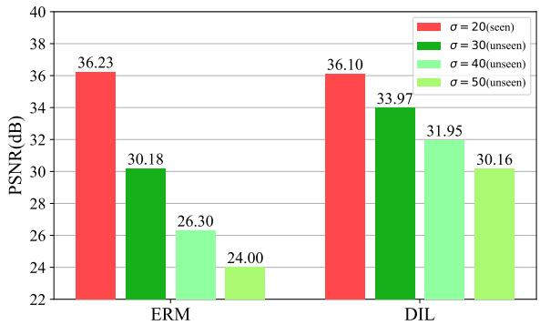
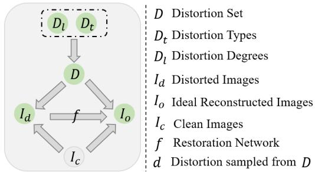
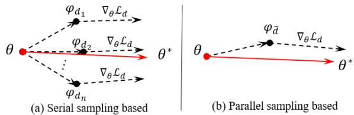
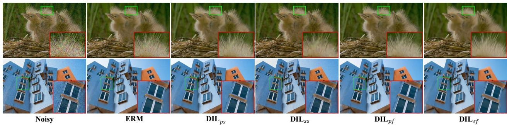
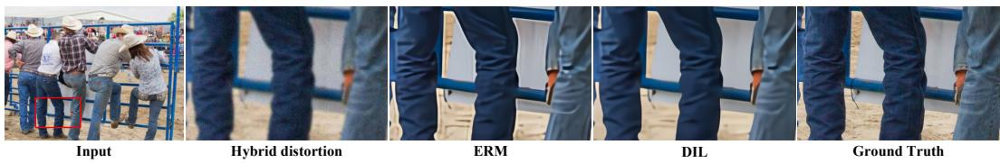
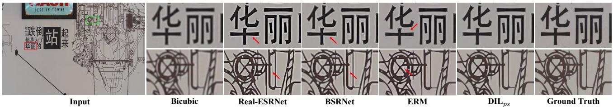

# Learning Distortion Invariant Representation for Image Restoration from A Causality Perspective

Xin Li1, Bingchen Li1, Xin Jin2, Cuiling Lan3†, Zhibo Chen1†

1University of Science and Technology of China 2Eastern Institute for Advanced Study 3Microsoft Research Asia

{lixin666, lbc31415926}@mail.ustc.edu.cn, jinxin@eias.ac.cn,

culan@microsoft.com, chenzhibo@ustc.edu.cn

## Abstract

In recent years, we have witnessed the great advancement ofDeep neural networks (DNNs) in image restoration. However, a critical limitation is that they cannot generalize well to real-world degradations with different degrees or types. In this paper, we are the first to propose a novel training strategy for image restoration from the causality perspective, to improve the generalization ability of DNNs for unknown degradations. Our method, termed Distortion Invariant representation Learning (DIL), treats each distortion type and degree as one specific confounder, and learns the distortion-invariant representation by eliminating the harmful confounding effect of each degradation. We derive our DIL with the back-door criterion in causality by modeling the interventions of different distortions from the optimization perspective. Particularly, we introduce counterfactual distortion augmentation to simulate the virtual distortion types and degrees as the confounders. Then, we instantiate the intervention ofeach distortion with a virtual model updating based on corresponding distorted images, and eliminate themfrom the meta-learning perspective. Extensive experiments demonstrate the generalization capability of our DIL on unseen distortion types and degrees. Our code will be available at https://github.com/ lixinustc/Causal-IR-DIL.

## 1. Introduction

Image restoration (IR) tasks [7, 8, 32, 51], including image super-resolution [11, 24, 43, 46, 56, 57], deblurring [41, 75], denoising [3, 23, 40], compression artifacts removal [28, 53], etc, have achieved amazing/uplifting performances, powered by deep learning. A series of backbones are elaborately and carefully designed to boost the restoration performances for specific degradation. Convolution neural networks (CNNs) [20] and transformers [12,34] are two commonly-used designed choices for the backbones of image restoration. However, these works inevitably suffer from severe performance drops when they encounter unseen degradations as shown in Fig. 1, where the restoration degree in training corresponds to the noise of standard deviation 20 and the degrees in testing are different. The commonly-used training paradigm in image restoration, $i . e . ,$ empirical risk minimization (ERM), does not work well for out-of-distribution degradations. Particularly, the restoration networks trained with ERM merely mine the correlation between distorted image $I _ { d }$ and its ideal reconstructed image $I _ { o }$ by minimizing the distance between $I _ { o }$ and the corresponding clean image $I _ { c } .$ . However, a spurious correlation [44] is also captured which introduces the bad confounding effects of specific degradation d. It means the conditional probability $P ( I _ { o } | I _ { d } )$ is also conditioned on the distortion types or degrees $\textit { d } ( i . e . , d \_ I _ { o } | I _ { d } )$

  
Figure 1. A comparison between ERM and our DIL with RRDB as backbone. The results are tested on Set5 with Gaussian noise.

A robust/generalizable restoration network should be distortion-invariant $( i . e . , \ d \perp \perp \ I _ { o } | I _ { d } )$ . For instance, given two distorted images with the same content $I _ { c }$ but different degradations $d _ { 1 }$ and $d _ { 2 } ,$ , the robust restoration network is expected to recover the same reconstructed image $I _ { o }$ from these two distorted images $( i . e . , P ( I _ { o } | I _ { d } , d = d _ { 1 } ) =$ $P ( I _ { o } | I _ { d } , d = d _ { 2 } ) )$ , respectively. Previous works for the robustness of the restoration network can be roughly divided into two categories, distortion adaptation-based schemes, and domain adaptation/translation-based schemes. Distortion adaptation-based schemes [60] aim to estimate the distortion types or representations, and then, handle the different distortions by adaptively modulating the restoration network. Domain adaptation/translation-based schemes [13, 35,48] regard different distortions as different domains, and introduce the domain adaptation/translation strategies to the image restoration field. Notwithstanding, the above works ignore the exploration of the intrinsic reasons for the poor generalization capability of the restoration network. In this paper, we take the first step to the causality-inspired image restoration, where novel distortion invariant representation learning from the causality perspective is proposed, to improve the generalization capability of the restoration network.

As depicted in [17, 44], correlation is not equivalent to causation. Learning distortion invariant representation for image restoration requires obtaining the causal effects between the distorted and ideal reconstructed images instead of only their correlation. There are two typical adjustment criteria for causal effects estimation [17], the backdoor criterion, and the front-door criterion, respectively. In particular, the back-door criterion aims to remove the bad confounding effects by traversing over known confounders, while the front-door criterion is to solve the challenge that confounders cannot be identified. To improve the generalization capability of the restoration network, we build a structural causal graph in Fig. 2 for the image restoration process and propose the Distortion-Invariant representation Learning (DIL) for image restoration by implementing the back-door criterion from the optimization perspective. There are two challenges for achieving this. The first challenge is how to construct the confounder sets (i.e., distortion sets). From the causality perspective [17, 44], it is better to keep other factors in the distorted image invariant except for distortion types. However, in the real world, collecting distorted/clean image pairs, especially with different real distortions but the same content is impractical. Inspired by counterfactual [44] in causality and the distortion simulation [55, 71], we propose counterfactual distortion augmentation, which selects amounts of high-quality images from the commonly-used dataset [2, 49], and simulate the different distortion degrees or types on these images as the confounders.

Another challenge of implementing DIL stems from finding a stable and proper instantiating scheme for the back-door criterion. Previous works [36,37,54,64,65] have incorporated causal inference in high-level tasks by instantiating the back-door criterion [17] with attention intervention [64], feature interventions [66], etc, which are arduous to be exploited in the low-level task of image restoration. In this work, we theoretically derive our distortion-invariant representation learning DIL by instantiating the back-door criterion from the optimization perspective. Particularly, we model the intervention of simulated distortions for the restoration process by virtually updating the restoration network with the samples from the corresponding distortions. Then, we eliminate the confounding effects of distortions by introducing the optimization strategy from Meta-Learning to our proposed DIL. In this way, we can instantiate the causal learning in image restoration and enable the DIL based on the back-door criterion.

The contributions of this paper are listed as follows:

• We revisit the image restoration task from a causality view and pinpoint that the reason for the poor generalization of the restoration network, is that the restoration network is not independent to the distortions in the training dataset.

• Based on the back-door criterion in causality, we propose a novel training paradigm, Distortion Invariant representation Learning (DIL) for image restoration, where the intervention is instantiated by a virtually model updating under the counterfactual distortion augmentation and is eliminated with the optimization based on meta-learning.

• Extensive experiments on different image restoration tasks have demonstrated the effectiveness of our DIL for improving the generalization ability on unseen distortion types and degrees.

## 2. Related Works

## 2.1. Image Restoration

Image Restoration (IR) [7, 22, 26, 32, 33, 51, 67] aims to recover high-quality images from the corresponding distorted images, which plays a prominent role in improving the human visual experience. With the advancement of deep learning, a series of works have achieved remarkable progress in lots of IR tasks, including image denoising [3, 40, 73], deblurring [41, 50, 75], super-resolution (SR) [9, 11, 27, 58, 61, 62, 74], etc. Particularly, most of them are devoted to elaborately designing the frameworks for different IR tasks based on their degradation process, which can be roughly divided into two categories, CNNbased framework [9, 11, 74], and Transformer-based framework [7, 24, 32, 67]. Despite that, the above works only explore how to improve the ability of inductive bias toward specific degradation, which lacks enough generalization capability. To improve the model’s robustness, some works seek to incorporate the domain translation [13, 35, 48] or distortion-adaptive learning [60] into image restoration. In contrast, we introduce causal learning [17] to image restoration. We answer the reason for the bad robustness of the restoration network and propose distortion-invariant representation learning from a causality perspective.

## 2.2. Causal Inference

Causal Inference is proposed to eliminate the harmful bias of confounders and discover the causal relationship between multiple variables [17]. A do operation is implemented with adjustment criteria, e.g., front-door or backdoor, to estimate the causal effects [44]. In recent years, deep learning has boosted the vast development of a series of intelligent tasks, $e . g .$ , image classification [10, 12, 34], segmentation [19, 47], detection [6, 30], low-level processing [7, 51]. However, prominent works focus on fitting the correlation between inputs and their outputs while ignoring the causation. Due to the existence of confounders, the networks are easy to capture the spurious correlation between inputs and their outputs. For instance, if most lions lie in the grass in the training data, the model inevitably mistakes the grass for a lion. To get rid of the harmful bias of confounders, some studies seek to incorporate causal inference into deep learning. [54, 66] model the interventions of confounders from the feature perspective [64] integrate the front-door criterion to vision-language task from the attention perspective. To improve the generalization capability, [29, 36, 37, 65] introduce the causal learning to domain adaptation/generalization. However, the above causalityinspired methods merely focus on the high-level tasks. In this paper, for the first time, we investigate the causalitybased image restoration, which aims to improve the generalization capability of restoration networks on different distortion types and degrees.

## 3. Methods

## 3.1. A Causal View for Image Restoration

Image restoration aims to restore the distorted images, of which the degradation process can be represented as a function ${ \cal I } _ { d } = g ( I _ { c } , D )$ . Here, $I _ { c } , I _ { d } , D$ denote the clean, distorted images, and distortions, respectively. D contains distortion types $D _ { t }$ and degrees $D _ { l } .$ . A restoration network f is trained with the loss function to minimize the difference between its ideal reconstructed images $I _ { o }$ and the original clean image $I _ { c }$ . We model this whole process with a structure causal graph as shown in Fig. 2. Here, $D \to I _ { d } \gets I _ { c }$ denotes the degradation process of $I _ { d } = g ( I _ { c } , D ) . \ I _ { c } \to I _ { o }$ denotes $I _ { o }$ is learned with the supervision of $I _ { c }$ by maximizing the probability of $P ( I _ { c } | I _ { o } )$ . In addition, $D \to I _ { o }$ refers to the knowledge learned from D to $I _ { o } . \ I _ { d } \to I _ { o }$ means the restoration process with restoration network f.

From the causality perspective, the causal representation of image restoration requires that the restoration network $f$ obtains the causal relationship between $I _ { d } \to I _ { o }$ . However, there are two extra paths $I _ { d } \left. D \right. I _ { o }$ and $I _ { d } \left. I _ { c } \right. I _ { o }$ introducing the spurious correlation to $I _ { d }$ and $I _ { o } ,$ where $I _ { c }$ and D are confounders in causality. Importantly, the $I _ { c }$ are commonly diverse in the datasets and bring more vivid textures to reconstructed image $I _ { o } ,$ , which is a favorable confounder. We do not take into account the confounder $I _ { c }$ in our paper.

  
Figure 2. Structure causal graph for image restoration.

We aim to improve the robustness of the restoration network to unseen or unknown distortions, which are inhibited by the bad confounding effects from confounders $D$ . But, how do the confounders D limit the generalization capability of the restoration network? As shown in Fig. 2, the existing of ${ { I } _ { d } } \gets D \to { { I } _ { o } }$ causes the conditional probability $P ( I _ { o } | I _ { d } )$ learned by restoration network $f$ is also condition on distortions D, i.e., the fitting conditional probability of $f$ is in fact as $P ( I _ { o } | I _ { d } , D )$ . Consequently, the restoration network $f$ is not robust to different distortions due to that it is not independent of different distortions D.

A robust restoration network f should be independent of different distortions $( i . e . , D \perp \perp I _ { o } | I _ { d } )$ . To achieve this, we adopt the back-door criterion in causal inference to realize distortion-invariant learning (DIL) through a $\because \mathrm { d o } ^ { \mathrm { , 5 } }$ operation. Here, $\mathrm { ~ a ~ } ^ { 6 6 } d o ^ { 7 }$ operation [17, 44] is exploited to cut off the connection from the distortion $D$ to $I _ { d } ,$ thereby removing the bad confounding effects of $D$ to the path $I _ { d }  I _ { o } ,$ and learning the distortion-invariant feature representation $( i . e . , D \perp \perp I _ { o } | I _ { d } )$ . We formulate the back-door criterion in image restoration as Equ. 1.

$$
P ( I _ { o } | d o ( I _ { d } ) ) = \sum _ { d _ { i } \in D } P ( I _ { o } | I _ { d } , d _ { i } ) P ( d _ { i } ) , P ( d _ { i } ) = \frac { 1 } { n } ,\tag{1}
$$

where the causal conditional probability $P ( I _ { o } | d o ( I _ { d } ) )$ is the optimization direction for restoration network f towards distortion invariant learning. To simplify the optimization, we set the probability of each distortion $d _ { i }$ as $1 / n$ , where n is the number of distortion types and degrees that existed in confounders. From Equ. 1, two crucial challenges for achieving it arise. 1) How to construct the virtual confounders $( i . e . ,$ , different distortion types or degrees)? since collecting different real distorted images with the same contents are nontrivial in the real world. 2) How to instantiate the intervention of different distortions to the reconstruction process (i.e., the $P ( I _ { o } | I _ { d } , d _ { i } ) )$ ) in image restoration. We achieve this through counterfactual distortion augmentation and distortion-invariant representation learning as described

in the following sections.

## 3.2. Counterfactual Distortion Augmentation

To learn the distortion-invariant representation for the restoration network, it is vital to construct the distortion set $\mathit { D } \left( i . e . \right.$ , confounders). For instance, if we expect the restoration network to have the generalization capability for different distortion degrees, we require to construct the distortion set D with the distortions at different levels. Similarly, we can increase the generalization capability of the restoration network for unknown distortion types by constructing the D with different but related distortion types. Furthermore, to avoid the effects of different image contents, it is better for each clean image to have corresponding distorted images with various distortion types or degrees in $D .$ . However, it is non-trivial to collect datasets that satisfy the above principles in the real world, which is labor-intensive and arduous.

In this paper, we construct the distortion set D with synthesized distortions, which we can call virtual confounders in causality. Concretely, we collected a series of highquality images $I _ { c } ,$ , and generated the distorted images by modifying the degradation process as ${ \cal I } _ { d } = g ( I _ { c } , d _ { i } ) , d _ { i } \in$ $D$ . We can also prove the rightness of the above distortion augmentation from the counterfactuals in causlity [17], where we answer the counterfactual question that $\cdots { i f D }$ is $d _ { i } ,$ , what the $I _ { d }$ would be with $I _ { c }$ invariant?”. The proofcan befound in the Supplementary.

## 3.3. Distortion-invariant Representation Learning

After constructing the virtual confounders/distortions set $D ~ = ~ \{ d _ { i } | 1 ~ \leq ~ i ~ \leq ~ n \}$ We are able to achieve the distortion-invariant representation learning by implementing the back-door criterion as Eq. 1 for image restoration. Let us first introduce the relationship between the probability $P ( I _ { o } | I _ { d } )$ and the commonly-used training paradigm ERM (empirical risk minimization). In image restoration, an ideal reconstruction $I _ { o }$ is expected to learn by maximizing the condition probability $P ( I _ { o } | I _ { d } )$ with loss function as $\mathcal { L } ( f _ { \theta } ( I _ { d } ) , I _ { c } )$ , where $f _ { \theta }$ is the restoration network with the parameters θ and $L$ denotes the loss function, such as the commonly-used $\mathcal { L } _ { 1 }$ or $\mathcal { L } _ { 2 }$ loss. The ERM is used to optimize the network $f _ { \theta }$ (with parameters denoted by θ) by minimizing the loss function overall training dataset $\mathcal { D } = \{ I _ { d } , I _ { c } | d \in D \}$ as:

$$
\theta ^ { * } = \arg \operatorname* { m i n } _ { \theta } \mathbb { E } _ { ( I _ { d } , I _ { c } ) \sim \mathcal { D } } [ \mathcal { L } ( f _ { \theta } ( I _ { d } ) , I _ { c } ) ] ,\tag{2}
$$

where $\theta ^ { * }$ enables the restoration network $f$ to maximize the $P ( I _ { o } | I _ { d } )$ ≈ $P ( I _ { c } | I _ { d } )$ However, the above training process also leads the $P ( I _ { o } | I _ { d } )$ to be not independent to the distortions $d \in D$ in the training dataset $\mathcal { D } _ { : }$ which eliminate the generalization ability of $f$ on the out-of-distribution distortions $( i . e . ,$ , when $d \notin D )$ . To achieve the distortioninvariant representation learning, we aim to maximize the causal conditional probability $P ( I _ { o } | d o ( I _ { d } ) )$ as instead of $P ( I _ { o } | I _ { d } )$ . The key challenge stems from how to model the conditional probability $P ( I _ { o } | I _ { d } , d _ { i } )$ in Eq. $\mathrm { ~ 1 ~ } ( i . e .$ , how to model the intervention from the distortion $d _ { i } \in D$ for the restoration process $P ( I _ { o } | I _ { d } ) )$ .

In this paper, we propose to model the intervention from $d _ { i } \in D$ to the restoration process (i.e., $P ( I _ { o } | I _ { d } , d _ { i } ) )$ through the optimization of the network parameters θ. From the above analysis, we know that the restoration network $f _ { \theta }$ trained with ERM on the paired training data $( I _ { d _ { i } } , I _ { c } )$ is condition on the distortion $d _ { i }$ . This inspires us to instantiate the intervention of different distortion types or degrees $d _ { i } ~ \in ~ D$ through updating the model parameter $\theta$ to $\phi _ { d _ { i } }$ based on ERM with the training distorted-and-clean image pairs $( I _ { d _ { i } } , I _ { c } )$ as:

$$
\phi _ { d _ { i } } = \theta - \alpha \nabla _ { \theta } \mathcal { L } ( f _ { \theta } ( I _ { d _ { i } } ) , I _ { c } ) ,\tag{3}
$$

where $\phi _ { d _ { i } }$ denotes the parameters of the restoration network after one-step update, which is conditioned on the confounder $d _ { i }$ . Consequently, the maximum of the conditional probability $P ( I _ { o } | I _ { d } , d _ { i } )$ can be obtained by minimizing the loss $\mathcal { L } ( f _ { \phi _ { d _ { i } } } ( I _ { d } ) , I _ { c } )$ The optimization direction toward maximizing the causal condition probability $P ( I _ { o } | d o ( I _ { d } ) )$ in Eq. 1 can be derived as:

$$
\theta ^ { * } = \arg \operatorname* { m i n } _ { \theta } \mathbb { E } _ { ( I _ { d } , I _ { c } ) \sim \mathcal { D } } [ \sum _ { d _ { i } \in D } \mathcal { L } ( f _ { \phi _ { d _ { i } } } ( I _ { d } ) , I _ { c } ) ] ,\tag{4}
$$

where D denotes the confounder set which contains n distortion degrees or types. Based on the above optimization objective, we learn distortion-invariant representation learning from a causality perspective.

## 3.4. Implementations of DIL from Meta-Learning

An interesting finding is that the derived optimization direction of DIL from causality perspective in Eq. 4 is consistent with one typical meta-learning strategy termed as MAML [14], even they have different purposes. MAML aims to enable the fast adaptation capability of a network for few-shot tasks, while ours aims to improve the generalization capability of the restoration network. We facilitate our DIL in image restoration based on this meta-learning strategy.

However, it is arduous to directly incorporate the optimization direction of Eq. 4 into the practical training process, which is computationally prohibitive. The reason is that it requires multiple gradient computing and updating, which is expensive, especially for the pixel-wise image restoration. To simplify this process, we utilize the Talyor expansion and inverse expansion to derive Eq. 4 as:

$$
\begin{array} { l } { { \displaystyle \theta ^ { * } = \arg \operatorname* { m i n } _ { \theta } \mathbb { E } _ { ( I _ { d } , I _ { c } ) \sim \mathcal { D } } [ \mathcal { L } ( f _ { \phi _ { \bar { d } } } ( I _ { d } ) , I _ { c } ) ] , \hfill } } \\ { { \displaystyle w h e r e \phi _ { \tilde { d } } = \theta - \alpha \nabla _ { \theta } \sum _ { d _ { i } \in D } \frac { 1 } { n } \mathcal { L } ( f _ { \theta } ( I _ { d _ { i } } ) , I _ { c } ) , \hfill } } \end{array}\tag{5}
$$

Table 1. Quantitative comparison for image denoising on several benchmark datasets. Results are tested on three different unseen distortion degrees in terms of PSNR/SSIM on RGB channel. Best performances are bolded.
<table><tr><td rowspan="2">Datasets</td><td rowspan="2">Levels</td><td colspan="5">Methods</td></tr><tr><td>ERM</td><td> $\overline { { \mathrm { D I L } _ { s f } } }$ </td><td> $\overline { { \mathrm { D I L } _ { p f } } }$ </td><td> $\overline { { \mathrm { ~ D I L } _ { s s } } }$ </td><td> $\overline { { \mathrm { D I L } _ { p s } } }$ </td></tr><tr><td rowspan="3">CBSD68 [38]</td><td>30 (unseen)</td><td>24.90/0.581</td><td> $\overline { { { 3 0 . 2 9 _ { ( 5 . 3 9 \uparrow ) } } / 0 . 8 6 6 } }$ </td><td> $\overline { { 2 9 . 9 2 _ { ( 5 . 0 2 \uparrow ) } / 0 . 8 5 8 } }$ </td><td> $\overline { { 2 7 . 4 8 _ { ( 2 . 5 8 \uparrow ) } / 0 . 8 0 9 } }$ </td><td> $\overline { { 2 9 . 1 4 _ { ( 4 . 2 4 \uparrow ) } / 0 . 8 0 2 } }$ </td></tr><tr><td>40 (unseen)</td><td>21.12/0.400</td><td> $\mathbf { 2 8 . 3 5 } _ { ( 7 . 2 3 \uparrow ) } / 0 . 8 2 5$ </td><td> $2 8 . 1 0 _ { ( 6 . 9 8 \uparrow ) } / 0 . 8 1 2$ </td><td> $2 5 . 9 0 _ { ( 4 . 7 8 \uparrow ) } / 0 . 7 4 6$ </td><td> $2 5 . 7 4 _ { ( 4 . 6 2 \uparrow ) } / 0 . 6 2 9$ </td></tr><tr><td>50 (unseen)</td><td>18.96/0.307</td><td> $\mathbf { 2 6 . 6 4 } _ { ( 7 . 6 8 \uparrow ) } / \mathbf { 0 . 7 7 9 }$ </td><td> $2 6 . 6 1 _ { ( 7 . 6 5 \uparrow ) } / 0 . 7 6 6$ </td><td> $2 4 . 6 3 _ { ( 5 . 6 7 \uparrow ) } / 0 . 6 8 6$ </td><td> $2 3 . 3 4 _ { ( 4 . 3 8 \uparrow ) } / 0 . 5 0 1$ </td></tr><tr><td rowspan="3">Kodak24 [15]</td><td>30 (unseen)</td><td>25.12/0.533</td><td> $\overline { { { \bf 3 1 . 3 9 } _ { ( 6 . 2 7 \uparrow ) } / 0 . 8 6 7 } }$ </td><td> $\overline { { 3 0 . 8 7 _ { ( 5 . 7 5 \uparrow ) } / 0 . 8 5 8 } }$ </td><td> $\overline { { 2 7 . 9 2 _ { ( 2 . 8 0 \uparrow ) } / 0 . 8 0 1 } }$ </td><td> $\overline { { 2 9 . 8 6 _ { ( 4 . 7 4 \uparrow ) } / 0 . 7 8 2 } }$ </td></tr><tr><td>40 (unseen)</td><td>21.22/0.352</td><td> $\mathbf { 2 9 . 4 9 } _ { ( 8 . 2 7 \uparrow ) } / 0 . 8 3 \mathbf { 1 }$ </td><td> $2 9 . 1 5 _ { ( 7 . 9 3 \uparrow ) } / 0 . 8 1 7$ </td><td> $2 6 . 4 6 _ { ( 5 . 2 4 \uparrow ) } / 0 . 7 3 8$ </td><td> $2 6 . 1 3 _ { ( 4 . 9 1 \uparrow ) } / 0 . 5 8 8$ </td></tr><tr><td>50 (unseen)</td><td>19.02/0.263</td><td> $2 7 . 7 6 _ { ( 8 . 7 4 \uparrow ) } / 0 . 7 8 8$ </td><td> $2 7 . 6 7 _ { ( 8 . 6 5 \uparrow ) } / 0 . 7 7 5$ </td><td> $2 5 . 2 4 _ { ( 6 . 2 2 \uparrow ) } / 0 . 6 7 7$ </td><td> $2 3 . 6 0 _ { ( 4 . 5 8 \uparrow ) } / 0 . 4 5 7$ </td></tr><tr><td rowspan="3">McMaster [72]</td><td>30 (unseen)</td><td>25.65/0.569</td><td> $\overline { { { \bf 3 1 . 7 0 } _ { ( 6 . 0 5 \uparrow ) } } / { \bf 0 . 8 7 3 } }$ </td><td> $\overline { { 3 1 . 0 4 _ { ( 5 . 3 9 \uparrow ) } / 0 . 8 5 3 } }$ </td><td> $2 8 . 1 5 _ { ( 2 . 5 0 \uparrow ) } / 0 . 7 9 4$ </td><td> $\overline { { 3 0 . 0 9 _ { ( 4 . 4 4 \uparrow ) } / 0 . 8 0 0 } }$ </td></tr><tr><td>40 (unseen)</td><td>21.73/0.373</td><td>29.81(8.08↑)/0.831</td><td> $2 9 . 0 7 _ { ( 7 . 3 4 \uparrow ) } / 0 . 8 0 2$ </td><td> $2 6 . 5 9 _ { ( 4 . 8 6 \uparrow ) } / 0 . 7 2 8$ </td><td> $2 6 . 2 4 _ { ( 4 . 5 1 \uparrow ) } / 0 . 6 0 5$ </td></tr><tr><td>50 (unseen)</td><td>19.47/0.278</td><td> $\mathbf { 2 8 . 0 2 } _ { ( 8 . 5 5 \uparrow ) } / 0 . 7 8 3$ </td><td> $2 7 . 3 1 _ { ( 7 . 8 4 \uparrow ) } / 0 . 7 4 9$ </td><td> $2 5 . 2 0 _ { ( 5 . 7 3 \uparrow ) } / 0 . 6 6 4$ </td><td> $2 3 . 6 0 _ { ( 4 . 1 3 \uparrow ) } / 0 . 4 6 6$ </td></tr><tr><td rowspan="3">Urban100 [21]</td><td>30 (unseen)</td><td>25.46/0.648</td><td> $\overline { { { \bf 3 0 . 9 3 } _ { \left( 5 . 4 7 \uparrow \right) } / 0 . 8 9 8 } }$ </td><td> $\overline { { 3 0 . 2 6 _ { ( 4 . 8 0 \uparrow ) } / 0 . 8 8 4 } }$ </td><td> $\overline { { 2 6 . 9 5 _ { ( 1 . 4 9 \uparrow ) } / 0 . 8 2 5 } }$ </td><td> $\overline { { 2 9 . 7 3 _ { ( 4 . 2 7 \uparrow ) } / 0 . 8 4 1 } }$ </td></tr><tr><td>40 (unseen)</td><td>21.53/0.479</td><td> $\mathbf { 2 8 . 8 2 } _ { ( 7 . 2 9 \uparrow ) } / 0 . 8 6 6$ </td><td> $2 8 . 3 2 _ { ( 6 . 7 9 \uparrow ) } / 0 . 8 4 8$ </td><td> $2 5 . 2 6 _ { ( 3 . 7 3 \uparrow ) } / 0 . 7 6 7$ </td><td> $2 6 . 2 5 _ { ( 4 . 7 2 \uparrow ) } / 0 . 6 9 1$ </td></tr><tr><td>50 (unseen)</td><td>19.28/0.389</td><td> $\mathbf { 2 6 . 8 8 } _ { ( 7 . 6 0 \uparrow ) } / \mathbf { 0 . 8 2 9 }$ </td><td> $2 6 . 6 3 _ { ( 7 . 3 5 \uparrow ) } / 0 . 8 1 1$ </td><td> $2 3 . 8 5 _ { ( 4 . 5 7 \uparrow ) } / 0 . 7 1 0$ </td><td> $2 3 . 7 1 _ { ( 4 . 4 3 \uparrow ) } / 0 . 5 7 5$ </td></tr><tr><td rowspan="3">Manga109 [39]</td><td>30 (unseen)</td><td>26.62/0.653</td><td> $\overline { { { \bf 3 1 . 9 7 } _ { ( 5 . 3 5 \uparrow ) } / 0 . 9 1 0 } }$ </td><td> $\overline { { 3 1 . 1 4 _ { ( 4 . 5 2 \uparrow ) } / 0 . 9 0 1 } }$ </td><td> $\overline { { 2 6 . 0 2 _ { ( - 0 . 6 \uparrow ) } / 0 . 8 3 3 } }$ </td><td> $\overline { { 3 1 . 0 5 _ { ( 4 . 4 3 \uparrow ) } / 0 . 8 5 8 } }$ </td></tr><tr><td>40 (unseen)</td><td>22.34/0.442</td><td> $\mathbf { 2 9 . 0 2 } _ { ( 6 . 6 8 \uparrow ) } / 0 . 8 8 8$ </td><td> $2 8 . 5 3 _ { ( 6 . 1 9 \uparrow ) } / 0 . 8 7 5$ </td><td> $2 4 . 3 1 _ { ( 1 . 9 7 \uparrow ) } / 0 . 7 8 4$ </td><td> $2 7 . 2 9 _ { ( 4 . 9 5 \uparrow ) } / 0 . 7 0 4$ </td></tr><tr><td>50 (unseen)</td><td>19.95/0.342</td><td> $ { 2 6 . 5 2 _ { ( 6 . 5 7 \uparrow ) } } / 0 . 8 6 0$ </td><td> $2 6 . 3 4 _ { ( 6 . 3 9 \uparrow ) } / 0 . 8 4 6$ </td><td> $2 2 . 8 2 _ { ( 2 . 8 7 \uparrow ) } / 0 . 7 3 4$ </td><td> $2 4 . 4 7 _ { ( 4 . 5 2 \uparrow ) } / 0 . 5 6 4$ </td></tr></table>

  
Figure 3. The comparison of serial sampling and parallel sampling.

where $\phi _ { \bar { d } }$ denotes the parameters of restoration network $f$ that is virtually updated with loss function with samples overall all distortions $D = \{ d _ { i } \} , 1 \leq i \leq n$ . We define it as parallel sampling for DIL, which reduces the complex training process of DIL to two steps. In this paper, we call the original sampling strategy as serial sampling. The comparison between serial sampling and parallel sampling are shown in Fig. 3. The detailed derivation for Eq. 5 are described in the Supplementary.

We also investigate two different gradient updating strategy for DIL. From Eq. 4 and Eq. 5, we can observe that they require the second-order gradient since the gradient is computed with two-step forward through $\phi _ { d _ { i } }$ , which is shown in Fig. 3. To simplify it, Reptile [42] proposes an alternative strategy $( i . e . ,$ , approximating the second-order gradient by the sequential parameter updating with one-order gradient. The optimization direction $( i . e .$ , gradient) is computed with the deviation between the initial and last-step parameters. We integrate it into our DIL and call it first-order optimization. In contrast, the original optimization in Eq. 5 is termed second-order optimization. In summary, we propose four variants for DIL following the above two strategies. $\mathrm { D I L } _ { s f }$ adopts the serial sampling and first-order gradient optimization. $\mathrm { D I L } _ { p f }$ utilizes the parallel sampling and first-order optimization. DI ${ \mathcal { \mathrm { \Pi } } _ { \mathrm { - } s s } } / \mathrm { D I L } _ { p s }$ exploits the second-order optimization and serial/parallel sampling.

## 4. Experiments

In this section. we first describe the implementation details. Then, we validate the effectiveness of our DIL from two typical out-of-distribution settings, $i . e . ,$ , Cross Distortion Degrees, and Cross Distortion Types. Particularly, for cross-distortion degrees, we train the restoration network with seen distortion degrees while testing it with unseen distortion degrees. For cross-distortion types, the restoration network is trained with synthesized distortions and validated on the corresponding real-world or other distortions.

## 4.1. Implementation

We adopt the typical RRDB [56] as our image restoration backbone, which has demonstrated remarkable performances towards various low-level image tasks [52, 55]. All the experiments are done with four NVIDIA 2080Ti GPUs. Adam optimizer is adopted to optimize network parameters in both ERM and DIL training paradigms. More details are given in the Supplementary.

## 4.2. Cross Distortion Degrees

Results on Image Denoising. For image denoising, the training data are composed of distorted images with noise levels [5, 10, 15, 20] and their corresponding clean images. After training the restoration network, we validate it on the test datasets with unseen noise degrees, including [30, 40, 50]. We compare the empirical risk minimization (ERM) and four variants of our proposed DIL, $i . e . , \mathrm { D I L } _ { s f } , \mathrm { D I L } _ { p f }$ $\mathrm { D I L } _ { s s } ,$ and $\mathrm { D I L } _ { p s } ,$ respectively.

The experimental results are shown in Table 1. We can observe that all four variants of DIL achieve great generalization ability on multiple unseen noise levels compared with commonly-used empirical risk minimization (ERM). On several typical scenarios, including natural images (i.e., CBSD68 [38], Kodak24 [15], McMaster [72]), building images (Urban100 [21]), cartoon images (i.e., Manga109 [39]), our DIL even outperforms the ERM by a promising/amazing gain of 8.74 dB at most. Moreover, with the increase of the distribution gap between training and testing data, ours can achieve larger improvements for ERM. Furthermore, for cross distortion degree, $\mathrm { D I L } _ { s f }$ shows the best generalization capability compared with the other three variants by serial sampling and first-order optimization. We also visualize the reconstructed images of the above methods in Fig. 4. For the unseen distortion degree $( \sigma = 3 0 )$ , the ERM cannot remove the noise well and the reconstructed image also contains obvious noise distortion.

Table 2. Quantitative comparison for image deblurring on several benchmark datasets. Results are tested on the five unseen blur degrees [4.2, 4.4, 4.6, 4.8, 5.0] in terms of PSNR/SSIM on RGB channel.
<table><tr><td rowspan=2 colspan=1>Datasets</td><td rowspan=2 colspan=1>Methods</td><td rowspan=1 colspan=5>Levels</td></tr><tr><td rowspan=1 colspan=1>4.2 (unseen)</td><td rowspan=1 colspan=1>4.4 (unseen)</td><td rowspan=1 colspan=1>4.6 (unseen)</td><td rowspan=1 colspan=1>4.8 (unseen)</td><td rowspan=1 colspan=1>5.0 (unseen)</td></tr><tr><td rowspan=2 colspan=1>Set5 [4]</td><td rowspan=1 colspan=1>ERM</td><td rowspan=1 colspan=1>29.31/0.844</td><td rowspan=1 colspan=1>26.55/0.776</td><td rowspan=1 colspan=1> $\overline { { 2 4 . 4 3 / 0 . 7 0 9 } }$ </td><td rowspan=1 colspan=1> $\overline { { 2 2 . 9 6 / 0 . 6 4 8 } }$ </td><td rowspan=1 colspan=1>22.00/0.602</td></tr><tr><td rowspan=1 colspan=1>DIL</td><td rowspan=1 colspan=1> $2 9 . 5 8 _ { ( 0 . 2 7 \uparrow ) } / 0 . 8 4 8$ </td><td rowspan=1 colspan=1> $2 7 . 5 2 _ { ( 0 . 9 7 \uparrow ) } / 0 . 8 0 2$ </td><td rowspan=1 colspan=1> $2 5 . 6 6 _ { ( 1 . 2 3 \uparrow ) } / 0 . 7 5 1$ </td><td rowspan=1 colspan=1> $2 4 . 3 8 _ { ( 1 . 4 2 \uparrow ) } / 0 . 7 0 8$ </td><td rowspan=1 colspan=1> $2 3 . 4 6 _ { ( 1 . 4 6 \uparrow ) } / 0 . 6 7 1$ </td></tr><tr><td rowspan=2 colspan=1>Set14 [68]</td><td rowspan=1 colspan=1>ERM</td><td rowspan=1 colspan=1> $2 7 . 2 2 / 0 . 7 8 1$ </td><td rowspan=1 colspan=1> $\overline { { 2 4 . 9 3 / 0 . 7 2 6 } }$ </td><td rowspan=1 colspan=1> $\overline { { 2 3 . 1 6 / 0 . 6 7 1 } }$ </td><td rowspan=1 colspan=1> $\overline { { 2 1 . 8 9 / 0 . 6 2 4 } }$ </td><td rowspan=1 colspan=1>20.88/0.583</td></tr><tr><td rowspan=1 colspan=1>DIL</td><td rowspan=1 colspan=1> $2 7 . 2 4 _ { ( 0 . 0 2 \uparrow ) } / 0 . 7 7 8$ </td><td rowspan=1 colspan=1> $2 5 . 7 8 _ { ( 0 . 8 5 \uparrow ) } / 0 . 7 4 6$ </td><td rowspan=1 colspan=1> $2 4 . 3 5 _ { ( 1 . 1 9 \uparrow ) } / 0 . 7 0 8$ </td><td rowspan=1 colspan=1> $2 3 . 2 3 _ { ( 1 . 3 4 \uparrow ) } / 0 . 6 7 2$ </td><td rowspan=1 colspan=1> $2 2 . 3 7 _ { ( 1 . 4 9 \uparrow ) } / 0 . 6 4 0$ </td></tr><tr><td rowspan=2 colspan=1>BSD100 [38]</td><td rowspan=1 colspan=1>ERM</td><td rowspan=1 colspan=1> $2 7 . 2 0 / 0 . 7 8 4$ </td><td rowspan=1 colspan=1> $\overline { { 2 5 . 1 7 / 0 . 7 3 2 } }$ </td><td rowspan=1 colspan=1> $2 3 . 5 0 / 0 . 6 8 2$ </td><td rowspan=1 colspan=1> $\overline { { 2 2 . 2 4 / 0 . 6 3 9 } }$ </td><td rowspan=1 colspan=1> $2 1 . 2 8 / 0 . 6 0 2$ </td></tr><tr><td rowspan=1 colspan=1>DIL</td><td rowspan=1 colspan=1> $2 7 . 3 7 _ { ( 0 . 1 7 \uparrow ) } / 0 . 7 8 1$ </td><td rowspan=1 colspan=1> $2 6 . 1 6 _ { ( 0 . 9 9 \uparrow ) } / 0 . 7 5 3$ </td><td rowspan=1 colspan=1> $2 4 . 9 1 _ { ( 1 . 4 1 \uparrow ) } / 0 . 7 1 9$ </td><td rowspan=1 colspan=1> $2 3 . 8 6 _ { ( 1 . 6 2 \uparrow ) } / 0 . 6 8 6$ </td><td rowspan=1 colspan=1> $2 3 . 0 2 _ { ( 1 . 7 4 \uparrow ) } / 0 . 6 5 8$ </td></tr><tr><td rowspan=2 colspan=1>Urban100 [21]</td><td rowspan=1 colspan=1>ERM</td><td rowspan=1 colspan=1> $\overline { { 2 4 . 9 5 / 0 . 7 9 7 } }$ </td><td rowspan=1 colspan=1> $\overline { { 2 2 . 4 1 / 0 . 7 2 3 } }$ </td><td rowspan=1 colspan=1> $\overline { { 2 0 . 5 9 / 0 . 6 5 7 } }$ </td><td rowspan=1 colspan=1> $\overline { { 1 9 . 3 3 / 0 . 6 0 6 } }$ </td><td rowspan=1 colspan=1> $\overline { { 1 8 . 4 0 / 0 . 5 6 5 } }$ </td></tr><tr><td rowspan=1 colspan=1>DIL</td><td rowspan=1 colspan=1> $2 4 . 9 7 _ { ( 0 . 0 2 \uparrow ) } / 0 . 7 9 3$ </td><td rowspan=1 colspan=1> $2 3 . 2 6 _ { ( 0 . 8 5 \uparrow ) } / 0 . 7 4 3$ </td><td rowspan=1 colspan=1> $2 1 . 7 6 _ { ( 1 . 1 7 \uparrow ) } / 0 . 6 9 3$ </td><td rowspan=1 colspan=1> $2 0 . 7 0 _ { ( 1 . 3 7 \uparrow ) } / 0 . 6 5 1$ </td><td rowspan=1 colspan=1> $1 9 . 9 2 _ { ( 1 . 5 2 \uparrow ) } / 0 . 6 1 8$ </td></tr><tr><td rowspan=2 colspan=1>Manga109 [39]</td><td rowspan=1 colspan=1>ERM</td><td rowspan=1 colspan=1> $\overline { { 2 8 . 1 6 / 0 . 8 6 5 } }$ </td><td rowspan=1 colspan=1> $\overline { { 2 3 . 9 6 / 0 . 7 9 1 } }$ </td><td rowspan=1 colspan=1> $\overline { { 2 1 . 2 1 / 0 . 7 1 3 } }$ </td><td rowspan=1 colspan=1> $\overline { { 1 9 . 6 3 / 0 . 6 5 2 } }$ </td><td rowspan=1 colspan=1>18.63/0.606</td></tr><tr><td rowspan=1 colspan=1>DIL</td><td rowspan=1 colspan=1> $2 8 . 0 9 _ { ( - 0 . 0 7 \uparrow ) } / 0 . 8 6 7$ </td><td rowspan=1 colspan=1> $2 5 . 4 1 _ { ( 1 . 4 5 \uparrow ) } / 0 . 8 2 2$ </td><td rowspan=1 colspan=1> $2 3 . 1 5 _ { ( 1 . 9 4 \uparrow ) } / 0 . 7 7 1$ </td><td rowspan=1 colspan=1> $2 1 . 6 9 _ { ( 2 . 0 6 \uparrow ) } / 0 . 7 2 6$ </td><td rowspan=1 colspan=1> $2 0 . 7 2 _ { ( 2 . 0 9 \uparrow ) } / 0 . 6 9 1$ </td></tr></table>

  
Figure 4. Visual comparison of the commonly-used ERM and our proposed four variants of DIL with the unseen noise level 30.

Table 3. Quantitative comparison for hybrid distortion removal. Results are tested on three different distortion levels in terms of PSNR/SSIM on Y channel.
<table><tr><td rowspan=2 colspan=1>Datasets</td><td rowspan=2 colspan=1>Methods</td><td rowspan=1 colspan=3>Distortion level</td></tr><tr><td rowspan=1 colspan=1>Mild(unseen)</td><td rowspan=1 colspan=1>Moderate(unseen)</td><td rowspan=1 colspan=1>Severe(seen)</td></tr><tr><td rowspan=2 colspan=1>BSD100 [38]</td><td rowspan=2 colspan=1>ERMDIL</td><td rowspan=1 colspan=1>25.31/0.687</td><td rowspan=1 colspan=1>24.62/0.642</td><td rowspan=1 colspan=1>25.27/0.617</td></tr><tr><td rowspan=1 colspan=1>26.37/0.691</td><td rowspan=1 colspan=1>25.23/0.645</td><td rowspan=1 colspan=1>25.22/0.613</td></tr><tr><td rowspan=2 colspan=1>Urban100 [21]</td><td rowspan=2 colspan=1>ERMDIL</td><td rowspan=2 colspan=1>23.97/0.73625.00/0.747</td><td rowspan=1 colspan=1>22.51/0.674</td><td rowspan=1 colspan=1>23.38/0.655</td></tr><tr><td rowspan=1 colspan=1>23.13/0.682</td><td rowspan=1 colspan=1>23.20/0.645</td></tr><tr><td rowspan=2 colspan=1>Manga109 [39]</td><td rowspan=2 colspan=1>ERMDIL</td><td rowspan=1 colspan=1>27.43/0.863</td><td rowspan=1 colspan=1>24.85/0.808</td><td rowspan=1 colspan=1>26.50/0.815</td></tr><tr><td rowspan=1 colspan=1>28.41/0.868</td><td rowspan=1 colspan=1>25.30/0.810</td><td rowspan=1 colspan=1>26.19/0.766</td></tr><tr><td rowspan=2 colspan=1>DIV2K [2]</td><td rowspan=2 colspan=1>ERMDIL</td><td rowspan=2 colspan=1>26.19/0.76627.84/0.785</td><td rowspan=1 colspan=1>25.94/0.744</td><td rowspan=1 colspan=1>27.42/0.742</td></tr><tr><td rowspan=1 colspan=1>26.89/0.756</td><td rowspan=1 colspan=1>27.38/0.737</td></tr></table>

However, our $\mathrm { D I L } _ { s f }$ enables the restoration network to recover more vivid and clean images from the unseen noise degrees, which validates the correctness and effectiveness of our proposed DIL.

Results on Image Deblurring. We also validate the generalization capability of our DIL on the challenging image deblurring. Under this scenarios, we train the restoration network with our proposed DIL with the gaussian blurring level [1.0, 2.0, 3.0, 4.0], and validate its generalization capability on the more severe and difficult blurring levels, including 4.2, 4.4, 4.6, 4.8, and 5.0.

As shown in Table. 2, we validate our DIL on five benchmark datasets, including Set5 [4], Set14 [68], BSD100 [38], Urban100 [21], and Manga109 [39]. With the increase of blurring level, the restoration network trained with ERM suffers from a severe performance drop, since the unseen blurring levels are far away from the blurring levels used for training. But our DIL can improve ERM on each unseen blurring level for five datasets. In particular, we achieve the gain of 2.09 dB for the cartoon scene Manga109 [39] on the blurring level 5.0.

Results on Hybrid-distorted Image Restoration. Except for the above single distortion, we also explore the generalization capability of our DIL on hybrid-distorted image restoration. Following [26], the hybrid distorted images are degraded with blur, noise, and Jpeg compression in a sequence manner. Based on the distortion degree, it can be divided into three levels from low to high, i.e., mild, moderate, and severe. In this setting, the restoration network is trained with severe hybrid distortions and validated on the mild and moderate levels.

Table 4. Quantitative results of network generalization capability on real image denoising and synthetic image deraining tasks. Results are tested on Y channel in terms of PSNR/SSIM, except for DND where we obtain our results from official online benchmark.
<table><tr><td rowspan="2">Methods</td><td colspan="2">Datasets (Real Denoising)</td><td colspan="3">Datasets (Deraining)</td></tr><tr><td>SIDD [1]</td><td>DND [45]</td><td>Rain100L [63]</td><td>Rain12 [31]</td><td>Rain800 [70]</td></tr><tr><td>ERM</td><td> $\overline { { 3 8 . 9 0 / 0 . 9 3 7 9 } }$ </td><td> $\overline { { 3 8 . 6 7 / 0 . 9 5 4 9 } }$ </td><td> $2 7 . 6 1 / 0 . 8 5 7 7$ </td><td>31.44/0.8947</td><td>23.36/0.8199</td></tr><tr><td> $\overline { { \mathrm { D I L } _ { s f } } }$ </td><td> $\overline { { 3 9 . 9 6 _ { ( 1 . 0 6 \uparrow ) } / 0 . 9 4 1 0 } }$ </td><td> $\overline { { 3 9 . 1 6 _ { ( 0 . 4 9 \uparrow ) } / 0 . 9 5 3 1 } }$ </td><td> $\overline { { 2 8 . 1 5 _ { ( 0 . 5 4 \uparrow ) } / 0 . 8 6 7 9 } }$ </td><td> $\overline { { { 3 2 . 4 3 _ { ( 0 . 9 9 \uparrow ) } } / 0 . 9 1 6 3 } }$ </td><td> $\overline { { 2 3 . 4 1 _ { ( 0 . 0 5 \uparrow ) } / 0 . 8 2 6 1 } }$ </td></tr><tr><td> $\mathrm { D I L } _ { p s }$ </td><td> $3 9 . 9 2 _ { ( 1 . 0 2 \uparrow ) } / 0 . 9 3 8 5$ </td><td> $3 9 . 0 3 _ { ( 0 . 3 6 \uparrow ) } / 0 . 9 5 5 3$ </td><td> $2 8 . 3 7 _ { ( 0 . 7 6 \uparrow ) } / 0 . 8 7 3 9$ </td><td> $3 3 . 0 7 _ { ( 1 . 6 3 \uparrow ) } / 0 . 9 2 6 6$ </td><td> $2 3 . 5 2 _ { ( 0 . 1 6 \uparrow ) } / 0 . 8 2 8 1$ </td></tr></table>

  
Figure 5. Visual comparison of the commonly-used ERM and our proposed DIL for unseen hybrid-distorted (mild) image restoration.

As shown in Table 3, our DIL achieves an average gain of 1.05 dB, and 0.66 dB on the mild-level, and moderate-level hybrid distortions than ERM, which has a large distribution gap with severe-level hybrid distortions. We can also notice that with the increase of the distribution gap, ours can preserve more performances on the restoration of the out-of-distribution distortions. We also conduct the subjective comparison of our methods with the commonly-used ERM in Fig. 5. We can observe that the restoration network trained with ERM suffers from new artifacts for unseen hybrid-distorted images. But our DIL can eliminate the artifacts well and generate more promising results.

## 4.3. Cross Distortion Types

In this section, we investigate the effects of our proposed DIL on the cross-distortion type setting, which is more challenging than the cross-degree setting.

Results on Real Image Super-resolution Real Image Super-resolution (RealSR) has attracted great attention since it is urgently required in real life, where the distorted image contains complex hybrid distortions, such as blurring, low resolution, noise, etc. However, the distorted/clean pairs for RealSR are hard to be collected. Simulating distortions like Real-world distortion has been a popular solution for RealSR [55, 71]. In this paper, we follow the Real-ESRGAN [55] and utilize its proposed RealSR distortion simulating to generate image pairs as training datasets. Then we test the restoration network on the out-of-distribution datasets, RealSR V3 [5], DRealSR [59], which are two commonly-used datasets for RealSR evaluation.

We show the experimental results on RealSR in Table. 5. Without access to any training samples in RealSR V3, DRealSR, our $\mathrm { D I L } _ { s f }$ can outperform the ERM by 0.29dB on RealSR V3 [5] and 0.26dB on DRealSR dataset [59].

Table 5. Quantitative results of the network generalization capability on RealSR tasks. Results are tested on the Y channel in terms of PSNR/SSIM.
<table><tr><td rowspan=2 colspan=1>Methods</td><td rowspan=1 colspan=2>Datasets</td></tr><tr><td rowspan=1 colspan=1>RealSR V3 [5] (unseen)</td><td rowspan=1 colspan=1>DrealSR [59] (unseen)</td></tr><tr><td rowspan=1 colspan=1>Real-ESRNet [55]BSRNet [71]</td><td rowspan=1 colspan=1>26.19/0.798927.46/0.8082</td><td rowspan=1 colspan=1>28.22/0.847029.45/0.8579</td></tr><tr><td rowspan=1 colspan=1>ERMDILsf</td><td rowspan=1 colspan=1>27.65/0.8098 $2 7 . 9 4 _ { ( 0 . 2 9 \uparrow ) } / 0 . 8 0 9 8$ </td><td rowspan=1 colspan=1>29.73/0.8628 $2 9 . 9 9 _ { ( 0 . 2 6 \uparrow ) } / 0 . 8 6 4 8$ </td></tr><tr><td rowspan=1 colspan=1> $\mathrm { D I L } _ { p s }$ </td><td rowspan=1 colspan=1> $2 8 . 1 2 _ { ( 0 . 4 7 \uparrow ) } / 0 . 8 0 6 7$ </td><td rowspan=1 colspan=1> $3 0 . 5 8 _ { ( 0 . 8 5 \uparrow ) } / 0 . 8 7 1 2$ </td></tr></table>

Table 6. Quantitative results of our DIL on different backbones. Results are tested on the unseen noise level 30 in terms of PSNR/SSIM.
<table><tr><td rowspan=2 colspan=1>Models</td><td rowspan=2 colspan=1>Methods</td><td rowspan=1 colspan=3>Datasets</td></tr><tr><td rowspan=1 colspan=1>CBSD68 [38]</td><td rowspan=1 colspan=1>Kodak24 [15]</td><td rowspan=1 colspan=1>Urban100 [21]</td></tr><tr><td rowspan=2 colspan=1>RRDB</td><td rowspan=1 colspan=1>ERM</td><td rowspan=1 colspan=1>24.90/0.581</td><td rowspan=1 colspan=1>25.12/0.533</td><td rowspan=1 colspan=1>25.46/0.648</td></tr><tr><td rowspan=1 colspan=1>DIL</td><td rowspan=1 colspan=1>30.28/0.866</td><td rowspan=1 colspan=1>31.39/0.867</td><td rowspan=1 colspan=1>30.93/0.898</td></tr><tr><td rowspan=2 colspan=1>SwinIR</td><td rowspan=1 colspan=1>ERM</td><td rowspan=1 colspan=1>24.22/0.551</td><td rowspan=1 colspan=1>24.22/0.493</td><td rowspan=1 colspan=1>24.73/0.618</td></tr><tr><td rowspan=1 colspan=1>DIL</td><td rowspan=1 colspan=1>29.08/0.798</td><td rowspan=1 colspan=1>29.71/0.774</td><td rowspan=1 colspan=1>29.72/0.834</td></tr></table>

Particularly, we notice that $\mathrm { D I L } _ { p s }$ is more suitable for crossdistortion type scenarios than $\mathrm { D I L } _ { s f } .$ , which exceeds the ERM by a 0.47dB on RealSR V3, and 0.85dB on DRealSR dataset. The reason for that we guess is that $\mathrm { D I L } _ { p s }$ is more capable of improving the generalization for the large distribution gap in image restoration. We also visualize the comparison corresponding to the subjective quality for different methods. As shown in Fig. 6, Real-ESRNet [55] and BSR-Net [71] cause the overshooting at the edge of the text. But our $\mathrm { D I L } _ { p s }$ can eliminate the artifacts and achieve a highquality restoration

Results on Real Image Denoising. We also study the generalization capability of our training paradigm DIL on the Real Image Denoising task. Concretely, we select four synthesized distortions based on four categories of color space among camera ISP process [18], and generate training image pairs from DF2K [2, 49] in an online manner. Then we verify its generalization on the commonly-used Real Denoising dataset SIDD [1] and DND [45]. As Table 4 illustrated, our $\mathrm { D I L } _ { p s }$ achieves the PSNR of 39.92 dB, which outperforms the ERM by 1.02dB, which is almost the same with DIL $\cdot { s f }$

  
Figure 6. Visual comparison with state-of-the-art methods on DRealSR [59].

Table 7. Quantitative comparison between different distortion augmentation methods. $\mathrm { D } _ { 1 }$ and $\mathrm { D _ { 2 } }$ are the first order distortion and the second order distortion derived from [55] respectively. Results are tested on RealSR datasets in terms of PSNR/SSIM.
<table><tr><td rowspan=2 colspan=1>Augmentation</td><td rowspan=2 colspan=1>Methods</td><td rowspan=1 colspan=2>Datasets</td></tr><tr><td rowspan=1 colspan=1>RealSR V3 [5]</td><td rowspan=1 colspan=1>DrealSR [59]</td></tr><tr><td rowspan=2 colspan=1> $\mathbf { D } _ { 1 }$ </td><td rowspan=1 colspan=1>ERM</td><td rowspan=1 colspan=1>27.65/0.8098</td><td rowspan=1 colspan=1>29.73/0.8628</td></tr><tr><td rowspan=1 colspan=1>DIL</td><td rowspan=1 colspan=1>27.94/0.8098</td><td rowspan=1 colspan=1>29.99/0.8648</td></tr><tr><td rowspan=2 colspan=1> $\mathrm { D _ { 2 } }$ </td><td rowspan=1 colspan=1>ERM</td><td rowspan=1 colspan=1>27.39/0.8077</td><td rowspan=1 colspan=1>29.41/0.8591</td></tr><tr><td rowspan=1 colspan=1>DIL</td><td rowspan=1 colspan=1>27.65/0.8027</td><td rowspan=1 colspan=1>29.85/0.8677</td></tr></table>

Results on Image Deraining. As an extension experiment, we introduce our DIL to the experiments of image deraining task. Particularly, the raining types and degrees between different datasets are severely different in image deraining. Here, we optimize the restoration network with three image deraining datasets, including DID-MDN [69], Rain14000 [16], and Heavy Rain Dataset [25]. Then we validate the generalization capability of the restoration network on three unseen deraining datasets, i.e., Rain100L [63], Rain12 [31], and Rain800 [70]. We report the experimental results in Table 4. Our DIL $( \mathrm { D I L } _ { p s } )$ enables the restoration network to have a better generalization capability than ERM, which obtains a gain of 0.76dB on Rain100L [63] and 1.63dB on Rain12 [31] dataset.

## 4.4. Ablation Studies

Impact of different restoration networks. We demonstrate the effectiveness of DIL across different network backbones. In addition to the convolution-based RRDB [56] network, we also incorporate our DIL into the transformer-based SwinIR [32]. The performances are reported in Table 6, which reveals that our DIL can also improve the generalization capability of Transformer-based backbones. This study reveals our DIL is a general training paradigm for different backbones.

Effects of different variants for DIL As shown in Table. 1,and 4, we can observe that $\mathrm { D I L } _ { s f }$ is more proper for cross-distortion degrees. But for cross-distortion types, $\mathrm { D I L } _ { p s }$ achieves better performance for RealSR and Image Deraining. It is noteworthy that the distribution gap of different distortion types is larger than different degrees. The first-order optimization is more stable but lacks enough capability for a severe distribution gap compared to secondorder optimization. But all of them are competent in improving the generalization capability.

## 5. Discussion on Limitations

The performance on training data. We also report the performance of our DIL on the seen training data in Table 3. It can be seen that our DIL will cause a slight performance drop but the generalization capability is improved obviously. The reason for that is our DIL implements distortion invariant representation learning, which prevents the restoration network from over-fitting to the training data.

The impact of different distortion augmentation. As shown in Table 7, despite that our DIL achieves the improvement of the generalization capability. The final generalization performance is still related to the distortion augmentation strategy. It is vital to find a universal distortion augmentation strategy, which requires more exploration. We believe it will be a potential/important direction to improve the generalization ability of the restoration network.

## 6. Conclusion

In this paper, we propose a novel distortion invariant representation learning (DIL) training paradigm for image restoration from the causality perspective. In particular, we provide a causal view of the image restoration process, and clarify why the restoration network lacks the generalization capability for different degradations. Based on that, we treat the distortion types and degrees as confounders, of which the confounding effects can be removed with our proposed DIL. Concretely, we produce the spurious confounders by simulating the different distortion types and degrees. Then, an instantiation of the back-door criterion in causality is introduced from the optimization perspective, which enables the restoration network to remove the harmful bias from different degradations. Extensive experiments on the settings, cross distortion degrees, and cross distortion types, have demonstrated that our DIL improves the generalization capability of the restoration network effectively.

## Acknowledgements

This work was supported in part by NSFC under Grant U1908209, 62021001, and ZJNSFC under Grant LQ23F010008.

## References

[1] Abdelrahman Abdelhamed, Stephen Lin, and Michael S Brown. A high-quality denoising dataset for smartphone cameras. In Proceedings of the IEEE Conference on Computer Vision and Pattern Recognition, pages 1692–1700, 2018. 7, 8

[2] Eirikur Agustsson and Radu Timofte. Ntire 2017 challenge on single image super-resolution: Dataset and study. In Proceedings of the IEEE conference on computer vision and pattern recognition workshops, pages 126–135, 2017. 2, 6, 7

[3] Saeed Anwar and Nick Barnes. Real image denoising with feature attention. In Proceedings of the IEEE/CVF international conference on computer vision, pages 3155–3164, 2019. 1, 2

[4] Marco Bevilacqua, Aline Roumy, Christine Guillemot, and Marie Line Alberi-Morel. Low-complexity single-image super-resolution based on nonnegative neighbor embedding. 2012. 6

[5] Jianrui Cai, Hui Zeng, Hongwei Yong, Zisheng Cao, and Lei Zhang. Toward real-world single image super-resolution: A new benchmark and a new model. In Proceedings of the IEEE/CVF International Conference on Computer Vision, pages 3086–3095, 2019. 7, 8

[6] Nicolas Carion, Francisco Massa, Gabriel Synnaeve, Nicolas Usunier, Alexander Kirillov, and Sergey Zagoruyko. End-toend object detection with transformers. In European conference on computer vision, pages 213–229. Springer, 2020. 3

[7] Hanting Chen, Yunhe Wang, Tianyu Guo, Chang Xu, Yiping Deng, Zhenhua Liu, Siwei Ma, Chunjing Xu, Chao Xu, and Wen Gao. Pre-trained image processing transformer. In Proceedings of the IEEE/CVF Conference on Computer Vision and Pattern Recognition, pages 12299–12310, 2021. 1, 2, 3

[8] Yinbo Chen, Sifei Liu, and Xiaolong Wang. Learning continuous image representation with local implicit image function. In Proceedings of the IEEE/CVF conference on computer vision and pattern recognition, pages 8628–8638, 2021. 1

[9] Tao Dai, Jianrui Cai, Yongbing Zhang, Shu-Tao Xia, and Lei Zhang. Second-order attention network for single image super-resolution. In Proceedings of the IEEE/CVF conference on computer vision and pattern recognition, pages 11065–11074, 2019. 2

[10] Jia Deng, Wei Dong, Richard Socher, Li-Jia Li, Kai Li, and Li Fei-Fei. Imagenet: A large-scale hierarchical image database. In 2009 IEEE conference on computer vision and pattern recognition, pages 248–255. Ieee, 2009. 3

[11] Chao Dong, Chen Change Loy, Kaiming He, and Xiaoou Tang. Image super-resolution using deep convolutional networks. IEEE transactions on pattern analysis and machine intelligence, 38(2):295–307, 2015. 1, 2

[12] Alexey Dosovitskiy, Lucas Beyer, Alexander Kolesnikov, Dirk Weissenborn, Xiaohua Zhai, Thomas Unterthiner, Mostafa Dehghani, Matthias Minderer, Georg Heigold, Sylvain Gelly, et al. An image is worth 16x16 words: Transformers for image recognition at scale. arXiv preprint arXiv:2010.11929, 2020. 1, 3

[13] Wenchao Du, Hu Chen, and Hongyu Yang. Learning invariant representation for unsupervised image restoration. In Proceedings of the ieee/cvf conference on computer vision and pattern recognition, pages 14483–14492, 2020. 2

[14] Chelsea Finn, Pieter Abbeel, and Sergey Levine. Modelagnostic meta-learning for fast adaptation of deep networks. In International conference on machine learning, pages 1126–1135. PMLR, 2017. 4

[15] Rich Franzen. Kodak lossless true color image suite. source: http://r0k. us/graphics/kodak, 4(2), 1999. 5, 6, 7

[16] Xueyang Fu, Jiabin Huang, Delu Zeng, Yue Huang, Xinghao Ding, and John Paisley. Removing rain from single images via a deep detail network. In Proceedings of the IEEE conference on computer vision and pattern recognition, pages 3855–3863, 2017. 8

[17] Madelyn Glymour, Judea Pearl, and Nicholas P Jewell. Causal inference in statistics: A primer. John Wiley & Sons, 2016. 2, 3, 4

[18] Shi Guo, Zifei Yan, Kai Zhang, Wangmeng Zuo, and Lei Zhang. Toward convolutional blind denoising of real photographs. In Proceedings of the IEEE/CVF conference on computer vision and pattern recognition, pages 1712–1722, 2019. 7

[19] Kaiming He, Georgia Gkioxari, Piotr Dollar, and Ross Gir-´ shick. Mask r-cnn. In Proceedings ofthe IEEE international conference on computer vision, pages 2961–2969, 2017. 3

[20] Kaiming He, Xiangyu Zhang, Shaoqing Ren, and Jian Sun. Deep residual learning for image recognition. In Proceedings ofthe IEEE conference on computer vision and pattern recognition, pages 770–778, 2016. 1

[21] Jia-Bin Huang, Abhishek Singh, and Narendra Ahuja. Single image super-resolution from transformed self-exemplars. In Proceedings of the IEEE conference on computer vision and pattern recognition, pages 5197–5206, 2015. 5, 6, 7

[22] Xin Jin, Li Zhang, Chaowei Shan, Xin Li, and Zhibo Chen. Dual prior learning for blind and blended image restoration. IEEE Transactions on Image Processing, 31:1042– 1056, 2021. 2

[23] Seunghwan Lee, Donghyeon Cho, Jiwon Kim, and Tae Hyun Kim. Self-supervised fast adaptation for denoising via metalearning. arXiv preprint arXiv:2001.02899, 2020. 1

[24] Bingchen Li, Xin Li, Yiting Lu, Sen Liu, Ruoyu Feng, and Zhibo Chen. Hst: Hierarchical swin transformer for compressed image super-resolution. arXiv preprint arXiv:2208.09885, 2022. 1, 2

[25] Ruoteng Li, Loong-Fah Cheong, and Robby T Tan. Heavy rain image restoration: Integrating physics model and conditional adversarial learning. In Proceedings ofthe IEEE/CVF Conference on Computer Vision and Pattern Recognition, pages 1633–1642, 2019. 8

[26] Xin Li, Xin Jin, Jianxin Lin, Sen Liu, Yaojun Wu, Tao Yu, Wei Zhou, and Zhibo Chen. Learning disentangled feature representation for hybrid-distorted image restoration. In European Conference on Computer Vision, pages 313–329. Springer, 2020. 2, 6

[27] Xin Li, Xin Jin, Tao Yu, Simeng Sun, Yingxue Pang, Zhizheng Zhang, and Zhibo Chen. Learning omnifrequency region-adaptive representations for real image

super-resolution. In Proceedings ofthe AAAI Conference on Artificial Intelligence, volume 35, pages 1975–1983, 2021. 2

[28] Xin Li, Simeng Sun, Zhizheng Zhang, and Zhibo Chen. Multi-scale grouped dense network for vvc intra coding. In Proceedings of the IEEE/CVF Conference on Computer Vision and Pattern Recognition Workshops, pages 158–159, 2020. 1

[29] Xin Li, Zhizheng Zhang, Guoqiang Wei, Cuiling Lan, Wenjun Zeng, Xin Jin, and Zhibo Chen. Confounder identification-free causal visual feature learning. arXiv preprint arXiv:2111.13420, 2021. 3

[30] Yanghao Li, Hanzi Mao, Ross Girshick, and Kaiming He. Exploring plain vision transformer backbones for object detection. arXiv preprint arXiv:2203.16527, 2022. 3

[31] Yu Li, Robby T Tan, Xiaojie Guo, Jiangbo Lu, and Michael S Brown. Rain streak removal using layer priors. In Proceedings ofthe IEEE conference on computer vision and pattern recognition, pages 2736–2744, 2016. 7, 8

[32] Jingyun Liang, Jiezhang Cao, Guolei Sun, Kai Zhang, Luc Van Gool, and Radu Timofte. Swinir: Image restoration using swin transformer. In Proceedings ofthe IEEE/CVF International Conference on Computer Vision, pages 1833–1844, 2021. 1, 2, 8

[33] Jianzhao Liu, Jianxin Lin, Xin Li, Wei Zhou, Sen Liu, and Zhibo Chen. Lira: Lifelong image restoration from unknown blended distortions. In European Conference on Computer Vision, pages 616–632. Springer, 2020. 2

[34] Ze Liu, Yutong Lin, Yue Cao, Han Hu, Yixuan Wei, Zheng Zhang, Stephen Lin, and Baining Guo. Swin transformer: Hierarchical vision transformer using shifted windows. In Proceedings of the IEEE/CVF International Conference on Computer Vision, pages 10012–10022, 2021. 1, 3

[35] Andreas Lugmayr, Martin Danelljan, and Radu Timofte. Unsupervised learning for real-world super-resolution. In 2019 IEEE/CVF International Conference on Computer Vision Workshop (ICCVW), pages 3408–3416. IEEE, 2019. 2

[36] Fangrui Lv, Jian Liang, Shuang Li, Bin Zang, Chi Harold Liu, Ziteng Wang, and Di Liu. Causality inspired representation learning for domain generalization. In Proceedings of the IEEE/CVF Conference on Computer Vision and Pattern Recognition, pages 8046–8056, 2022. 2, 3

[37] Divyat Mahajan, Shruti Tople, and Amit Sharma. Domain generalization using causal matching. In International Conference on Machine Learning, pages 7313–7324. PMLR, 2021. 2, 3

[38] David Martin, Charless Fowlkes, Doron Tal, and Jitendra Malik. A database of human segmented natural images and its application to evaluating segmentation algorithms and measuring ecological statistics. In Proceedings Eighth IEEE International Conference on Computer Vision. ICCV 2001, volume 2, pages 416–423. IEEE, 2001. 5, 6, 7

[39] Yusuke Matsui, Kota Ito, Yuji Aramaki, Azuma Fujimoto, Toru Ogawa, Toshihiko Yamasaki, and Kiyoharu Aizawa. Sketch-based manga retrieval using manga109 dataset. Multimedia Tools and Applications, 76(20):21811–21838, 2017. 5, 6

[40] Sreyas Mohan, Zahra Kadkhodaie, Eero P Simoncelli, and Carlos Fernandez-Granda. Robust and interpretable blind

image denoising via bias-free convolutional neural networks. arXiv preprint arXiv:1906.05478, 2019. 1, 2

[41] Seungjun Nah, Sanghyun Son, Jaerin Lee, and Kyoung Mu Lee. Clean images are hard to reblur: Exploiting the illposed inverse task for dynamic scene deblurring. In International Conference on Learning Representations, 2021. 1, 2

[42] Alex Nichol, Joshua Achiam, and John Schulman. On first-order meta-learning algorithms. arXiv preprint arXiv:1803.02999, 2018. 5

[43] Seobin Park, Jinsu Yoo, Donghyeon Cho, Jiwon Kim, and Tae Hyun Kim. Fast adaptation to super-resolution networks via meta-learning. In European Conference on Computer Vision, pages 754–769. Springer, 2020. 1

[44] Judea Pearl. Causal inference in statistics: An overview. Statistics surveys, 3:96–146, 2009. 1, 2, 3

[45] Tobias Plotz and Stefan Roth. Benchmarking denoising algorithms with real photographs. In Proceedings of the IEEE conference on computer vision and pattern recognition, pages 1586–1595, 2017. 7, 8

[46] Jae Woong Soh, Sunwoo Cho, and Nam Ik Cho. Metatransfer learning for zero-shot super-resolution. In Proceedings of the IEEE/CVF Conference on Computer Vision and Pattern Recognition, pages 3516–3525, 2020. 1

[47] Robin Strudel, Ricardo Garcia, Ivan Laptev, and Cordelia Schmid. Segmenter: Transformer for semantic segmentation. In Proceedings ofthe IEEE/CVF International Conference on Computer Vision, pages 7262–7272, 2021. 3

[48] Wei Sun, Dong Gong, Qinfeng Shi, Anton van den Hengel, and Yanning Zhang. Learning to zoom-in via learning to zoom-out: Real-world super-resolution by generating and adapting degradation. IEEE Transactions on Image Processing, 30:2947–2962, 2021. 2

[49] Radu Timofte, Eirikur Agustsson, Luc Van Gool, Ming-Hsuan Yang, and Lei Zhang. Ntire 2017 challenge on single image super-resolution: Methods and results. In Proceedings of the IEEE conference on computer vision and pattern recognition workshops, pages 114–125, 2017. 2, 7

[50] Phong Tran, Anh Tuan Tran, Quynh Phung, and Minh Hoai. Explore image deblurring via encoded blur kernel space. In Proceedings of the IEEE/CVF Conference on Computer Vision and Pattern Recognition, pages 11956–11965, 2021. 2

[51] Zhengzhong Tu, Hossein Talebi, Han Zhang, Feng Yang, Peyman Milanfar, Alan Bovik, and Yinxiao Li. Maxim: Multi-axis mlp for image processing. In Proceedings of the IEEE/CVF Conference on Computer Vision and Pattern Recognition, pages 5769–5780, 2022. 1, 2, 3

[52] Hua Wang, Dewei Su, Chuangchuang Liu, Longcun Jin, Xianfang Sun, and Xinyi Peng. Deformable non-local network for video super-resolution. IEEE Access, 7:177734–177744, 2019. 5

[53] Menglu Wang, Xueyang Fu, Zepei Sun, and Zheng-Jun Zha. Jpeg artifacts removal via compression quality ranker-guided networks. In Proceedings of the Twenty-Ninth International Conference on International Joint Conferences on Artificial Intelligence, pages 566–572, 2021. 1

[54] Tan Wang, Jianqiang Huang, Hanwang Zhang, and Qianru Sun. Visual commonsense representation learning via causal

inference. In Proceedings of the IEEE/CVF Conference on Computer Vision and Pattern Recognition Workshops, pages 378–379, 2020. 2, 3

[55] Xintao Wang, Liangbin Xie, Chao Dong, and Ying Shan. Real-esrgan: Training real-world blind super-resolution with pure synthetic data. In Proceedings of the IEEE/CVF International Conference on Computer Vision, pages 1905–1914, 2021. 2, 5, 7, 8

[56] Xintao Wang, Ke Yu, Shixiang Wu, Jinjin Gu, Yihao Liu, Chao Dong, Yu Qiao, and Chen Change Loy. Esrgan: Enhanced super-resolution generative adversarial networks. In Proceedings of the European conference on computer vision (ECCV) workshops, pages 0–0, 2018. 1, 5, 8

[57] Pengxu Wei, Hannan Lu, Radu Timofte, Liang Lin, Wangmeng Zuo, Zhihong Pan, Baopu Li, Teng Xi, Yanwen Fan, Gang Zhang, et al. Aim 2020 challenge on real image superresolution: Methods and results. In Computer Vision–ECCV 2020 Workshops: Glasgow, UK, August 23–28, 2020, Proceedings, Part III 16, pages 392–422. Springer, 2020. 1

[58] Pengxu Wei, Hannan Lu, Radu Timofte, Liang Lin, Wangmeng Zuo, Zhihong Pan, Baopu Li, Teng Xi, Yanwen Fan, Gang Zhang, et al. Aim 2020 challenge on real image superresolution: Methods and results. In European Conference on Computer Vision, pages 392–422. Springer, 2020. 2

[59] Pengxu Wei, Ziwei Xie, Hannan Lu, Zongyuan Zhan, Qixiang Ye, Wangmeng Zuo, and Liang Lin. Component divideand-conquer for real-world image super-resolution. In European Conference on Computer Vision, pages 101–117. Springer, 2020. 7, 8

[60] Yunxuan Wei, Shuhang Gu, Yawei Li, Radu Timofte, Longcun Jin, and Hengjie Song. Unsupervised real-world image super resolution via domain-distance aware training. In Proceedings of the IEEE/CVF Conference on Computer Vision and Pattern Recognition, pages 13385–13394, 2021. 2

[61] Zeyu Xiao, Zhiwei Xiong, Xueyang Fu, Dong Liu, and Zheng-Jun Zha. Space-time video super-resolution using temporal profiles. In Proceedings of the 28th ACM International Conference on Multimedia, pages 664–672, 2020. 2

[62] Ren Yang, Radu Timofte, Xin Li, Qi Zhang, Lin Zhang, Fanglong Liu, Dongliang He, He Zheng, Weihang Yuan, Pavel Ostyakov, et al. Aim 2022 challenge on super-resolution of compressed image and video: Dataset, methods and results. arXiv preprint arXiv:2208.11184, 2022. 2

[63] Wenhan Yang, Robby T Tan, Jiashi Feng, Jiaying Liu, Zongming Guo, and Shuicheng Yan. Deep joint rain detection and removal from a single image. In Proceedings of the IEEE conference on computer vision and pattern recognition, pages 1357–1366, 2017. 7, 8

[64] Xu Yang, Hanwang Zhang, Guojun Qi, and Jianfei Cai. Causal attention for vision-language tasks. In Proceedings of the IEEE/CVF Conference on Computer Vision and Pattern Recognition, pages 9847–9857, 2021. 2, 3

[65] Zhongqi Yue, Qianru Sun, Xian-Sheng Hua, and Hanwang Zhang. Transporting causal mechanisms for unsupervised domain adaptation. In Proceedings of the IEEE/CVF International Conference on Computer Vision, pages 8599–8608, 2021. 2, 3

[66] Zhongqi Yue, Hanwang Zhang, Qianru Sun, and Xian-Sheng Hua. Interventional few-shot learning. Advances in neural information processing systems, 33:2734–2746, 2020. 2, 3

[67] Syed Waqas Zamir, Aditya Arora, Salman Khan, Munawar Hayat, Fahad Shahbaz Khan, and Ming-Hsuan Yang. Restormer: Efficient transformer for high-resolution image restoration. In Proceedings of the IEEE/CVF Conference on Computer Vision and Pattern Recognition, pages 5728– 5739, 2022. 2

[68] Roman Zeyde, Michael Elad, and Matan Protter. On single image scale-up using sparse-representations. In International conference on curves and surfaces, pages 711–730. Springer, 2010. 6

[69] He Zhang and Vishal M Patel. Density-aware single image de-raining using a multi-stream dense network. In Proceedings of the IEEE conference on computer vision and pattern recognition, pages 695–704, 2018. 8

[70] He Zhang, Vishwanath Sindagi, and Vishal M Patel. Image de-raining using a conditional generative adversarial network. IEEE transactions on circuits and systems for video technology, 30(11):3943–3956, 2019. 7, 8

[71] Kai Zhang, Jingyun Liang, Luc Van Gool, and Radu Timofte. Designing a practical degradation model for deep blind image super-resolution. In Proceedings of the IEEE/CVF International Conference on Computer Vision, pages 4791– 4800, 2021. 2, 7

[72] Lei Zhang, Xiaolin Wu, Antoni Buades, and Xin Li. Color demosaicking by local directional interpolation and nonlocal adaptive thresholding. Journal of Electronic imaging, 20(2):023016, 2011. 5, 6

[73] Yi Zhang, Dasong Li, Ka Lung Law, Xiaogang Wang, Hongwei Qin, and Hongsheng Li. Idr: Self-supervised image denoising via iterative data refinement. In Proceedings of the IEEE/CVF Conference on Computer Vision and Pattern Recognition, pages 2098–2107, 2022. 2

[74] Yulun Zhang, Kunpeng Li, Kai Li, Lichen Wang, Bineng Zhong, and Yun Fu. Image super-resolution using very deep residual channel attention networks. In Proceedings of the European conference on computer vision (ECCV), pages 286–301, 2018. 2

[75] Yulun Zhang, Yapeng Tian, Yu Kong, Bineng Zhong, and Yun Fu. Residual dense network for image restoration. IEEE Transactions on Pattern Analysis and Machine Intelligence, 43(7):2480–2495, 2020. 1, 2