# Megahertz Light Steering without Moving Parts

Adithya Pediredla1,2, Srinivasa G. Narasimhan2, Maysamreza Chamanzar2, Ioannis Gkioulekas2 1Dartmouth College, 2Carnegie Mellon University

## Abstract

We introduce a light steering technology that operates at megahertz frequencies, has no moving parts, and costs less than a hundred dollars. Our technology can benefit many projector and imaging systems that critically rely on high-speed, reliable, low-cost, and wavelength-independent light steering, including laser scanning projectors, LiDAR sensors, and fluorescence microscopes. Our technology uses ultrasound waves to generate a spatiotemporally-varying refractive indexfield inside a compressible medium, such as water, turning the medium into a dynamic traveling lens. By controlling the electrical input ofthe ultrasound transducers that generate the waves, we can change the lens, and thus steer light, at the speed of sound (1.5 km/s in water). We build a physical prototype ofthis technology, use it to real ize different scanning techniques at megahertz rates (three orders of magnitude faster than commercial alternatives such as galvo mirror scanners), and demonstrate proof-of concept projector and LiDAR applications. To encourage further innovation towards this new technology, we derive theoryfor itsfundamental limits and develop a physically accurate simulatorfor virtual design. Our technology offers a promising solutionfor achieving high-speed and low-cost light steering in a variety ofapplications.

## 1. Introduction

Many imaging systems rely on the ability to steer light, either as it leaves a source or as it reaches a sensor. Examples include laser scanning projectors [28, 56], LiDAR depth sensors [38, 74, 75], and microscopy techniques (confocal microscopy [23, 50], light-sheet microscopy [55, 68], multiphoton microscopy [17, 82]). Compared to full-field lighting and imaging, light steering systems help improve light efficiency [47], counter indirect illumination [27, 42], and enhance illumination and imaging contrast [9, 55]. However, these advantages come at the cost of reduced acquisition speed, bulky moving hardware, and motion artifacts. To alleviate these costs, we introduce a new light steering technology that, through the use of ultrasonic sculpting, makes it possible to scan light both transversally and axially at megahertz (MHz) rates. Additionally, our technology achieves these high scanning rates without any moving parts. Lastly, prototypes of our technology cost no more than a hundred dollars. Altogether, these characteristics represent significant advances over previous light steering technologies (Table 1).

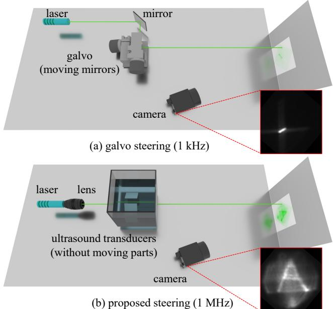  
Figure 1. Megahertz light steering. (a) Light steering systems in LiDAR systems and laser projectors have moving mechanical components, limiting them to kHz scanning rates. (b) Our technology uses the acousto-optic effect to enable MHz light steering without moving parts. The insets show that, before galvo mirrors could scan even a few points, our prototype scanned a thousand points to project the letter “A” on the wall.

Our technology uses the acousto-optic effect1 to turn a transparent medium, such as water, into a programmable optic that steers an incident light beam. Sound is a pressure wave that travels inside a medium by compressing and rar efying it, spatiotemporally changing the medium density. In turn, this changes the refractive index of the medium, which is proportional to the density [63,79]. We design the pressure profile of the sound wave so that, at any time instant, the spatially-varying refractive index makes the medium behave as a periodic set of virtual gradient-index (GRIN) lenses, each with an aperture equal to the sound wavelength. The GRIN lenses bend light beams incident on the medium, with the GRIN profile determining the beam trajectory. These lenses travel at the speed of sound (1.5 km/s in water) and are reconfigurable at MHz frequencies, allowing us to steer light faster than mechanical devices. To enable flexible steering patterns, we combine this optic with a pulsed laser with a programmable pulse rate. By synchronizing the laser source with the sound waveform, and modulating the phase of the sound waveform, we control both the speed of beam steering and the location of the beam.

In Sections 3 and 4, we explain the physical and mathematical details of our technology. We introduce a new design that uses two linear transducers to generate traveling acoustic waves, and discuss how different synchronization choices between ultrasound and pulsed laser result in differ ent scanning patterns. To facilitate the exploration of design parameters (ultrasound speed and frequency, laser frequency) and configurations (transducer geometry), we also develop a physics-based simulator for our technology. In Section 6, we also discuss the fundamental limits of our technology due to diffraction and the uncertainty principle in wave physics.

In Section 5, we experimentally demonstrate these fast programmable light steering techniques for various applications. In particular, in Section 5.2, we demonstrate an arbitrary point projector that can scan arbitrary and programmable light patterns. Compared to raster scanning projectors, which can project billions of points per second in a grid pattern but only a few thousand arbitrary points per second, our prototype can project a million arbitrary points per second, an acceleration by three orders of magnitude. In Section 5.3, we demonstrate a LiDAR prototype that combines our light steering technology with a single-photon avalanche diode (SPAD). We show 3D scans of 100 × 100 resolution at 5000 frames per second (50 million points per second) with a single-pixel SPAD, which is not feasible with scanning galvo mirrors.

Contributions. Our main contributions are:

1. A new light steering technology based on the acoustooptic effect that is three orders of magnitude faster than state-of-the-art mechanical steering technologies.

2. A new hardware design with planar transducers generating of traveling waves.

3. An experimental prototype demonstrating ultrafast arbitrary point projection and LiDAR scanning.

4. A physics-based renderer to simulate digital twins of our prototype and evaluate different designs.

5. The derivation of limits due to fundamental restrictions from wave physics (diffraction limit, scanning speed vs. aperture tradeoff, and uncertainty principle).

We provide our open-source simulator, data, and additional details in the supplement and project website.2

Limitations. Our prototype has a diffraction-limited point spread function (PSF) with a large spatial extent and a “+” shape, due to the use of two linear transducers that create a rectangular aperture. This limits spatial resolution, and introduces structured blur artifacts. These limitations are not fundamental to our core technology, and can be overcome

Table 1. Comparison of light steering technologies. MEMS is microelectromechanical systems, OPA is optical phased arrays, BW is optical bandwidth. For the arrows, red is bad, green is good, down is low, and up is high, and more arrows imply a bigger effect. Our method is superior in terms of cost, speed and supported bandwidth, with no moving parts or fabrication.
<table><tr><td>Tech.</td><td>speed</td><td>fab.</td><td>BW</td><td>cost</td><td>moving</td></tr><tr><td>galvo</td><td>W</td><td>x</td><td>↑</td><td>↓</td><td></td></tr><tr><td>liquid lenses</td><td>W</td><td>x</td><td>↑</td><td>↓</td><td>x</td></tr><tr><td>MEMS</td><td>↑</td><td>√</td><td>↑</td><td>↑</td><td>√</td></tr><tr><td>OPA</td><td>↑↑↑</td><td>√</td><td>↓</td><td>↑个</td><td>x</td></tr><tr><td>ours</td><td>↑↑</td><td>x</td><td>↑</td><td>WW</td><td>x</td></tr></table>

with improved designs and better engineering (Section 6).

## 2. Related work

Light steering in imaging systems. Light steering is a core component in scanning-based active imaging systems. For example, fluorescence microscopy techniques such as confocal microscopy [23, 50], multiphoton microscopy [17, 82], light sheet microscopy [55, 68], and superresolution microscopy [7], use scanning to decrease scattered light and improve light efficiency and imaging contrast. Another example is LiDAR sensors [84] found in commercial applica tions, such as autonomous cars. In these sensors, scanning decreases multipath interference and helps reduce hardware cost, removing the need for two-dimensional LiDAR arrays. Our technology improves the speed and reliability of scanning-based LiDAR, while further reducing the cost.

Light steering is also used in scanning-based laser projectors, to achieve high light efficiency and contrast by illuminating only where necessary. Laser projectors typically perform a 2D raster scan the field of view, with a fast and a slow scanning axis. The speed of the fast scanning axis limits the frame rate to the order of hundreds of kHz. In contrast, our technique can operate at tens of MHz, improving the raster scan rate by two orders of magnitude. Additionally, raster scanners cannot project arbitrary point sequences at a fast rate, and are limited to the frame rate of the projector (60-120 points per second) even when the projection pattern is very sparse. We demonstrate the projection of a million arbitrary points per second, four orders of magnitude faster.

Computational imaging techniques that use laser projectors or LiDAR are generally also scanning-based. Examples include structured light [26, 70], light-transport prob ing [47, 48], motion contrast 3D [44], epipolar gating [3, 46], light curtains [11,76], slope-disparity gating [12,37,73], and non-line-of-sight imaging [39, 41, 49, 51, 81]. As a consequence, all these techniques can become orders of magnitude faster if combined with our light steering device.

Light steering technologies We can distinguish between mechanical and non-mechanical light steering techniques. The former include rotating prisms [2, 78], mirrors [35, 45], and digital micromechanical systems (MEMS) [61, 65]. The latter include acousto-optic (AO) [20, 83] or electrooptic (EO) [69] deflectors, liquid crystal devices [64, 77], and optical phased arrays (OPA) [29, 58]. Table 1 compares these techniques to our MHz steering technology: Mechanical techniques are slow due to the need to physically move optical elements. AO and EO deflectors operate at kHz rates. Liquid lenses and crystals typically have a long settling time, making them the slowest among these techniques.

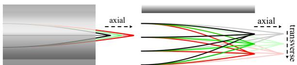  
(a) previous ultrasonically sculpted (b) proposed ultrasonically sculpted lens could lens could steer focus axially steer focus in both axial and transverse directions  
Figure 2. Comparison to previous work. (a) Previous ultrasonically sculpted lenses [10, 32] change the focal length at high speed (b) Our lens can change both focal length (transparencies) and the spatial location (colors) at high speed. We achieve this using traveling waves and synchronizing sound and light signals.

OPAs [29, 58] are solid-state on-chip devices that can steer light at even GHz rates. However, they require onchip microscopic coherent laser generators [71] and cannot easily be coupled to external lasers. They are also expensive to fabricate and currently limited to low-resolution angles. Cheng et al. [15] and Spector [67] have detailed reviews.

Acousto-optic devices. Many acousto-optic devices are commercially available, including tunable filters [21], modulators [5], frequency shifters [85], and deflectors [30]. Among these, the acousto-optic deflector can serve as a light steering device. However, acousto-optic deflectors use a different physical phenomenon, Bragg’s diffraction [72], where beam deviation is proportional to the acoustic wave frequency, and are thus orders of magnitude slower than our technology. Electro-optic deflectors [40, 66] operate on a similar phenomenon and are thus similarly slow.

Tunable acoustic gradient-index (TAG) lenses [16,32] and ultrasonically-sculpted virtual optical waveguides [10, 34] use the same physical principles as our technology. TAG lenses can change the focus depth of an incident beam at kHz rates; however, unlike our technology, they cannot steer it in the transverse axis (Figure 2). Following their recent commercialization, TAG lenses fostered innovation in scientific and application fields such as laser micro machining [14, 18], three-dimensional biomedical imaging [36, 80], microscopy [13, 19, 33], optical coherence tomography [22], high-throughput industrial inspection [31], and adaptive optics [62, 86]. We believe that the additional transverse steering capabilities from our technology will similarly help stimulate significant further innovation.

Table 2. Notation and parameters we use in the paper.
<table><tr><td>quantity</td><td>symbol</td></tr><tr><td>speed</td><td> $c _ { \mathrm { u s } }$ </td></tr><tr><td>wavelength</td><td> $\lambda _ { \mathrm { u s } }$ </td></tr><tr><td>frequency</td><td> $f _ { \mathrm { u s } }$ </td></tr><tr><td>angular frequency</td><td> $\omega _ { \mathrm { u s } } = 2 \pi f _ { \mathrm { u s } }$ </td></tr><tr><td>wavenumber</td><td> $k _ { \mathrm { u s } } = 2 \pi \lambda _ { \mathrm { u s } } ^ { - 1 }$ </td></tr><tr><td>timeperiod</td><td> $T _ { \mathrm { u s } } = f _ { \mathrm { u s } } ^ { - 1 }$ </td></tr></table>

## 3. Traveling-wave acousto-optic lenses

We generate ultrasonic waves inside a transparent medium, such as water, by submerging inside it a planar transducer that we drive with a single harmonic voltage (Figure 3(a)). The resulting pressure $P ( x , t )$ inside the medium (Figure 3(b)) equals

$$
\begin{array} { r } { P ( x , t ) = P _ { o } + P _ { s } \cos ( k _ { \mathrm { u s } } x - \omega _ { \mathrm { u s } } t ) , } \end{array}\tag{1}
$$

where: t is time, x is distance normal to the transducer plane—the pressure is independent of $y$ and z coordinates— $P _ { o }$ is the medium pressure without ultrasound, $P _ { s }$ is proportional to the transducer voltage amplitude, and the remaining parameters are in Table 2.

The refractive index $n ( x , t )$ of the medium changes proportionally to the pressure (Figure 3(c)):

$$
n ( x , t ) = n _ { o } + n _ { s } \cos ( k _ { \mathrm { u s } } x - \omega _ { \mathrm { u s } } t ) ,\tag{2}
$$

where: $n _ { o }$ is the refractive index of the medium without the transducer, $n _ { s } = k P _ { s } ,$ , and k is an empirical coefficient $( k =$ $1 . 4 0 2 \times 1 0 ^ { - 5 } { \mathrm { b a r } } ^ { - 1 }$ for water) [63].

At time $t = 0$ , the convex lobes of this refractive index profile (i.e., regions $x = [ l \lambda _ { \mathrm { u s } } - \lambda _ { \mathrm { u s } } / 2 , l \lambda _ { \mathrm { u s } } + \lambda _ { \mathrm { u s } } / 2 ] ; l \in \mathbb { Z } )$ act as GRIN lenses. Each of these lenses focuses light rays traveling parallel to the transducer onto a line (Figure 3(d)). We can change the lens focal length and aperture by varying the amplitude and frequency of the transducer voltage.

Traveling lenses. The pressure wave and refractive index profile propagate along the x-direction. Thus, the convex lobes vary as: $\boldsymbol { x } ( t ) = [ c _ { \mathrm { u s } } t + l \lambda _ { \mathrm { u s } } - \lambda _ { \mathrm { u s } } / 2 , c _ { \mathrm { u s } } t + l \lambda _ { \mathrm { u s } } + \lambda _ { \mathrm { u s } } / 2 ] ;$ $l \in \mathbb Z$ . As a result, ultrasonically-sculpted cylindrical GRIN lenses are dynamic, and focused lines travel normal to the transducer at the speed of ultrasound (Figure 4).

## 4. Scanning techniques

Even though the ultrasonically-sculpted GRIN lenses travel at the speed of ultrasound, we cannot control the speed or location of the lens focus. To enable such control, we use a pulsed laser with the same repetition frequency as the ultrasound frequency, and programmable phase modulation for the transducer voltage.

Single transducer. For intuition, we first describe the case of a single transducer. Due to phase modulation, the pressure pattern from Equation (1) becomes $P ( x , t ) \ =$ $P _ { o } + P _ { s } \cos ( k _ { \mathrm { u s } } x - \omega _ { \mathrm { u s } } t - \phi ( t ) )$ . If the illumination is continuous, the position of the focused light is $x _ { n } ( t ) \ =$ $\begin{array} { r } { c _ { \mathrm { u s } } t { - } n \lambda _ { \mathrm { u s } } { + } \frac { \phi ( t ) } { 2 \pi } \lambda ; n \in \mathbb { Z } . } \end{array}$ , which is a set of lines moving continuously at the speed of sound. By pulsing the illumination at ultrasound frequency, we get a set of lines flickering at the ultrasound frequency: $\begin{array} { r } { x _ { n } ( m T _ { \mathrm { u s } } ) = ( m - n ) \lambda _ { \mathrm { u s } } + \frac { \phi ( m T _ { \mathrm { u s } } ) } { 2 \pi } \lambda _ { \mathrm { u s } } } \end{array}$ If we modulate the phase linearly $( \phi ( t ) = k \omega _ { \mathrm { u s } } t ; k < 1 )$ , we have $x ( m T _ { \mathrm { u s } } ) = m k c _ { \mathrm { u s } } T _ { \mathrm { u s } }$ for m = n (i.e., the line due to the same laser and ultrasound pulse). Therefore, the lines travel at a reduced speed $k c _ { \mathrm { u s } }$

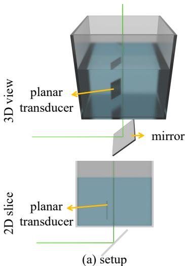

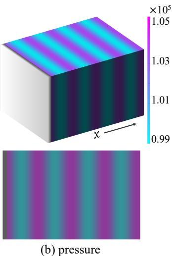

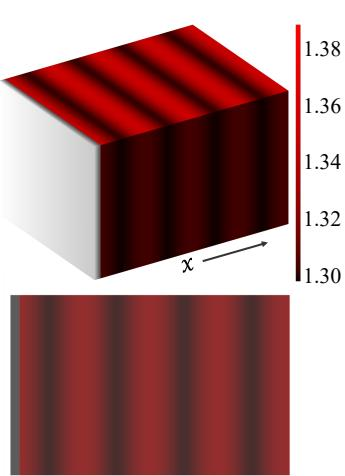  
(c) refractive index

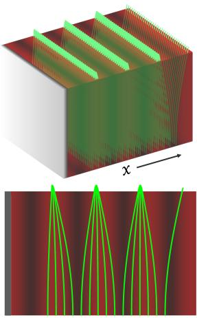  
(d) ray diagram

Figure 3. Ultrasonic sculpting. (a) By placing a planar piezoelectric transducer inside a compressible medium and vibrating the transducer with a sinusoidal voltage, we generate ultrasound inside the medium. (b) Sound is a pressure wave, and at any given time, the pressure inside the medium varies spatially based on the voltage waveform applied to the transducer. (c) The change in the refractive index of the medium is proportional to the pressure. Therefore, the refractive index of the medium also varies spatially, turning the medium into a GRIN lens. (d) Light rays that pass through this GRIN lens will curve continuously and focus on a set of lines. The focal length of these waveguides/lenses is a function of the voltage and frequency applied to the transducer.  
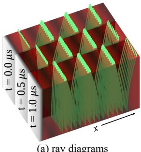  
(a) ray diagrams

0 �s  
0.5 �s  
1.0 �s  
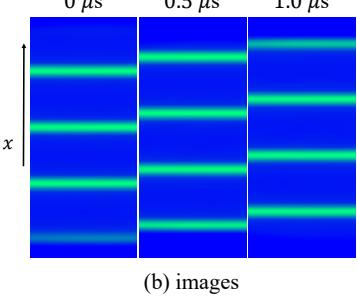  
Figure 4. Planar transducer steers the light. As sound propagates, the spatial refractive index pattern also propagates at the speed of sound. The focussed light, which is a set of lines, also travels normal to the transducer plane at the speed of sound. Apart from the ray diagrams, the images rendered with our simulator (submitted as supplementary) show that the planar transducer moves the focus region (in this case, a line) at the speed of sound.

## 4.1. Point scanning with two transducers

To focus light to a point, we use two orthogonal planar transducers (Figure 5). We describe two extensions of the above approach for focus point control: one for scanning arbitrary point locations at the ultrasound frequency (i.e., MHz), and another for raster scanning at the laser repetition frequency, which is higher than the ultrasound frequency.

Arbitrary point scanning. To scan arbitrary points $( x ( m T _ { \mathrm { u s } } ) , y ( m T _ { \mathrm { u s } } ) )$ for each laser pulse m, we modulate the phases $\phi _ { x } ( t )$ and $\phi _ { y } ( t )$ of both transducers. The focus point location within the region $[ 0 , \lambda _ { \mathrm { u s } } ] \times [ 0 , \lambda _ { \mathrm { u s } } ]$ is:

$$
x ( t ) = ( \phi _ { x } ( t ) / k _ { \mathrm { u s } } + c _ { \mathrm { u s } } t ) \bmod \lambda _ { \mathrm { u s } } ,\tag{3}
$$

$$
y ( t ) = ( \phi _ { y } ( t ) / k _ { \mathrm { u s } } + c _ { \mathrm { u s } } t ) \bmod \lambda _ { \mathrm { u s } } ,\tag{4}
$$

Figure 6 shows the refractive index and ray diagram for four sets of $\phi _ { x }$ and $\phi _ { y }$ values. To scan a set of points $( x ( m T _ { \mathrm { u s } } ) , y ( m T _ { \mathrm { u s } } ) \bar { ) }$ , we compute the phases $( \phi _ { x } ( m T _ { \mathrm { u s } } ) , \phi _ { y } ( m T _ { \mathrm { u s } } ) )$ using Equations (3)-(4), and interpolate to compute $( \phi _ { x } ( t ) , \phi _ { y } ( t ) )$

Raster scanning In theory, we could use arbitrary point scanning to raster scan a two-dimensional grid of points. In that case, the phase modulation for raster scanning would be linear, $( \phi _ { x } ( t ) , \phi _ { y } ( t ) ) = ( k _ { x } \omega _ { \mathrm { u s } } t , k _ { y } \omega _ { \mathrm { u s } } t )$ , where $k _ { x }$ and $k _ { y }$ are phase modulation rates. The phase modulation rate for the faster axis would be equal to the product of the number of scan points and the modulation rate of the slower axis.

However, this approach would limit raster scanning frequency to the ultrasound frequency. If the laser repetition frequency is higher, we can scan more points by running the laser at its highest frequency. Their locations will be:

$$
x ( m T _ { L } ) = ( m k _ { x } ) \frac { \lambda _ { \mathrm { u s } } } { s } \mathrm { m o d } \lambda _ { \mathrm { u s } } ,\tag{5}
$$

$$
y ( m T _ { L } ) = ( m k _ { y } ) { \frac { \lambda _ { \mathrm { u s } } } { s } } { \bmod { \lambda _ { \mathrm { u s } } } } ,\tag{6}
$$

where $s = f _ { L } / f _ { \mathrm { u s } }$ is the ratio of laser $( f _ { L } )$ and ultrasound $( f _ { \mathrm { u s } } )$ frequencies, and $T _ { L } = 1 / f _ { L }$ is the inter-pulse time.

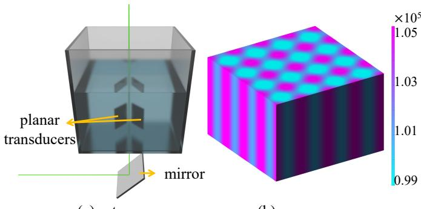  
(a) set up  
(b) pressure

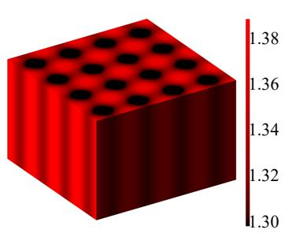  
(c) refractive index

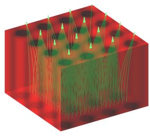  
(d) ray diagram

Figure 5. Two planar transducers for focusing light at a point. (a) We place two planar piezoelectric transducers orthogonal to each other inside a medium. We drive both transducers independently with a sinusoidal voltage. (b) The pressure wave inside the medium is a superposition of the pressure waves generated by the transducers. (c) The change in the refractive index is proportional to the net pressure. (d) Light rays from a wide beam focus on a set of points. We restrict the illumination beam size to focus light on a single point.  
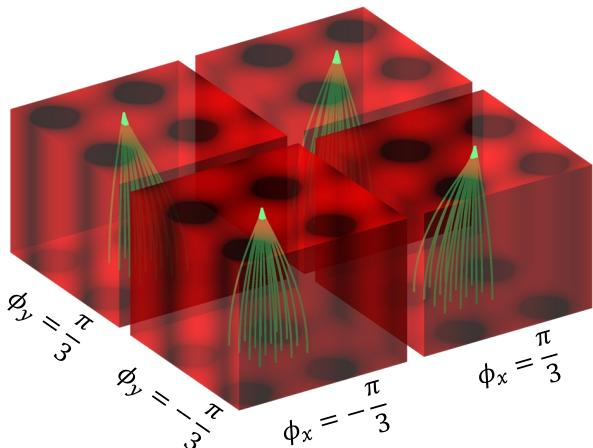  
Figure 6. Point steering. By controlling the phases of the sinusoidal voltages applied to the transducers, we control the location of the focus position. To continuously steer the focus location, we phase modulate the voltages applied to both transducers.

## 5. Experiments

We discuss an experimental prototype implementing our acousto-optic light steering technology, and combining it with a pulsed laser, single-pixel SPAD, and galvo mirrors (for comparison). We use this prototype to demonstrate projector and LiDAR applications. We compare our light steering system with commercially available galvo mirrors, to demonstrate the speed and the new capabilities our system enables. We keep the field-of-view and aperture same for both systems. This comparison is not the most favorable for galvo mirrors, as they typically have a larger field of view, but it is a fair one for evaluating the system’s speed.

## 5.1. Prototype

Figure 7 shows our experimental prototype. We place two planar piezo transducers (P-25.40mm-25.40mm-2.10mm-880-WFB, APC International, Ltd) orthogonal to each other and at an inclination of 45◦ relative to an acrylic tank containing water, to minimize interference from interreflections. A signal generator (SDG6022x, Siglent Tech.) drives the transducers via a power amplifier (ENI A300, Bell electronics). We colocate a pulsed laser (ALPHALAS GmbH, PICOPOWER-LD-510) and a gated SPAD (Microphoton Devices s.r.l.) using a beamsplitter, similar to previous techniques [24, 25, 57]. However, we do not place a lens in front of the SPAD, as the ultrasonically-sculpted lens focuses light from the object onto the SPAD. Instead, we place a lens in front of the laser to create a diverging ray that undergoes the same focusing by the ultrasonically-sculpted lens. We place an aperture after the ultrasonically-sculpted lens to limit the scanning area to only one ultrasonic period. A 45◦ mirror directs the beam to a pair of galvo mirrors (GVS-212, Thorlabs Inc.). We use the galvo mirrors only for comparisons.

To synchronize the transducers, laser, SPAD gate, and SPAD timing circuit, we use two signal generators and synchronize their clock and trigger signals. We use one signal generator to drive the transducers. The two channels of the second signal generator run the laser and the SPAD gate. We explain the SPAD timing synchronization details in Section 5.3. We provide more details about our prototype, including design and alignment, in the supplement.

## 5.2. Arbitrary point projector

We use the technique in Section 4.1 to compute the phases and synthesize the transducer voltage waveforms required to project an arbitrary target sequence of points. We drive the transducers with this waveform and the laser at the same frequency as ultrasound (1 MHz).

To project the same sequence of points with the galvo mirrors, we drive the laser and transducers at a fixed frequency without any phase modulation, which results in a single-point focus. We steer this point with the galvo mirrors to scan the same desired sequence of points. We drive the galvo mirrors at 1 kHz, 2 kHz, 5 kHz frequencies (points per second). The galvo mirrors are rated for 1 kHz, and driving it at frequencies higher than 5 kHz leads to higher motor current and failure of the fuse.

We project the patterns on a white cardboard screen, and capture images with a camera (Allied Vision PRO-GT3400- 09) for two exposures (1 ms and 50 ms) that we show in Figure 8. In this case, we are projecting 100 points that form the letter “A”. At 1 ms exposure, the galvo mirrors only scan a few points, whereas our technique scans the entire shape ten times. At 100 ms or higher exposure, the galvo mirrors can project all the points without distortion.

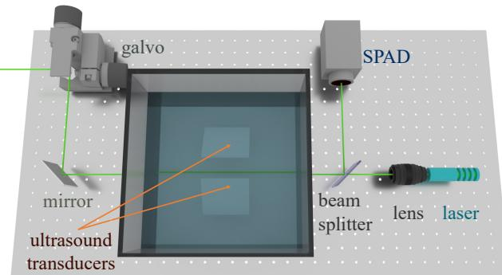

(a) schematic  
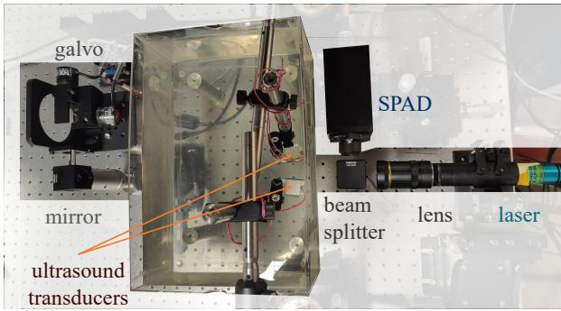  
(b) experimental prototype  
Figure 7. Hardware setup. We show the (a) schematic and (b) prototype built for showing the proof-of-concept applications and comparing them with a galvo mirror system. We diverge the laser beam, and the expanded beam is focused by the ultrasonically-sculpted refractive index. The beam passes through the galvo mirrors onto the scene. We steer the beam either with the ultrasonically-sculpted lens or the galvo mirrors, but not both, depending on the experi ment. The reflected light from the object takes the same path back to the sensor. The SPAD sensor, which is colocated with the laser, does not have any optics in front of it other than the ultrasonicallysculpted lenses. This setup allows us to compare the scanning speed of our system with galvo mirrors, while keeping the aperture the same.

## 5.3. LiDAR

We use a gated SPAD for depth and transient measurements. The gate helps reject the backscattered photons from various optics. After gating, our system does not suffer from pile-up [54, 59, 60]. We use a signal generator to drive the SPAD gate instead of the picosecond delayer (PSD) common in SPAD-based LiDAR systems [8,41,49,53]. Our approach is inexpensive and generates programmable delays at much higher resolution $( 1 \mu \mathrm s )$ than the PSD (50 ns).

We run both the transducer and SPAD signal generators in burst mode with the trigger running at 100 Hz for synchronization. We use picoharp (Microphoton Devices s.r.l.) to measure the time-of-flight of the photons and to synchronize the scanning position. Several previous techniques [39, 43, 49, 57] achieve this synchronization by send ing a synchronization signal to picoharp, which reports a marker event when the synchronization signal is detected. Unfortunately, as our scanning runs at a much higher rate than galvo mirror scanning, we cannot use an external synchronization signal for picoharp due to the massive number of events that would be generated. Fortunately, the picoharp reports the pulse index for each laser pulse it detects. We use the pulse index to compute when the photon is fired, and use Equations (5)-(6) to compute the scan position.

We first use the pulsed raster scanning technique in Section 4.1 to raster scan the scene. We set $f _ { L } { \mathrm { \Omega } } = 5 0 \mathrm { M H z } ,$ $f _ { \mathrm { u s } } ~ { = } 1 \mathrm { M H z } , k _ { x } ~ { = } ~ 1 . 0 0 0 1$ , and $k _ { y } ~ = ~ 1 . 0 1$ These settings result in a spatial resolution of 100 × 100 and scan rate of 5000 frames per second. Figure 9 shows results for four scenes, each with two letters at various depths. Our single channel (single sensor and laser) system scans 50 million points per second. This is three orders of magnitude faster than the 128-channel high-end Velodyne $\mathrm { V L S - } 1 2 8 ^ { \mathrm { T M } }$ LiDAR [1], which scans 5 million points per second.

We also use the arbitrary point scanning technique in Section 4.1 to selectively scan a few points in the field of view. An advantage of such an approach is the potential for adaptive scanning [6]. In Figure 10, we create a three-point scene and image it to compute their spatial locations. We then scan these three points using both galvo mirrors and our technique for 3 ms (1 ms per point). When scanning with the galvo mirrors, a lot of time is spent moving the galvo mirrors from one scan point to another. As a result, many pulses fired by the laser are wasted during the travel time of the galvo mirrors. By contrast, ultrasonic beam steering shifts the focus within the time period of the two laser photons (1 µs) and does not waste any pulses. As a result, our technique’s depth estimation accuracy (computed using mean squared error averaged over a hundred experiments) is 250× higher than that of the galvo mirrors.

## 6. Discussion

We introduced a high-speed, low-cost (the cost of each transducer is only \$26) technology to steer light. Our technology uses the physics of traveling sound waves synchronized with illumination and imaging sensors to enable multiple scanning applications. We built an experimental prototype to demonstrate proof-of-concept applications, such as the ability to perform arbitrary point light projection and raster scanning for LiDAR at MHz rates. In the rest of this section, we discuss some fundamental limits and tradeoffs inherent in our light steering technology due to wave physics, and directions for further exploration they suggest. We summarize some of these tradeoffs in Table 3. In the supplement, we provide a physics-based renderer that can help virtually evaluate improved designs of our technology.

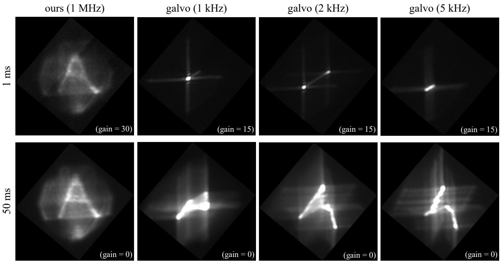

Figure 8. Acousto-optic vs. galvo-mirror projection. We compare our beam steering technique with commercially available Thorlabs galvo mirrors (GVS-212). The $\because _ { \mathrm { A } } \because$ shape is made up of 100 points. With a 1 MHz transducer, we are able to project a million points per second (pps), and hence, project ten thousand $\mathbf { \ddot { A } } \mathbf { \ddot { S } }$ per second. Constrained by the laser’s low beam power $( 2 0 \mu \mathsf { W }$ at 1 MHz), practically we can only capture $\mathbf { \ddot { A } } ^ { \flat }$ at 1 ms exposure. The commercially available galvo mirrors, which are only rated at 1 kpps, only project a streak when driven at 1 kHz, 2 kHz, and 5 kHz. At 50 ms exposure and 1 kHz scan rate, the galvo mirrors only project half the pattern at the rated 1 kHz, and at higher frequencies, the galvo mirrors project a corrupted pattern as we are operating them well beyond their 1 kpps rating.  
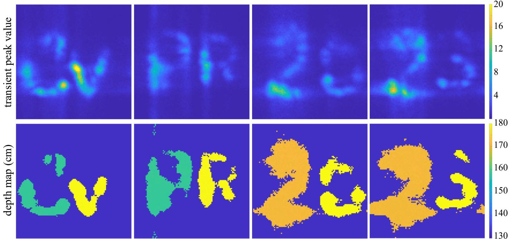  
Figure 9. Depth raster scanning. Each of the four scenes has two characters $, \mathrm { ^ { * } C V ^ { * } , \mathrm { ^ { * } P R ^ { * } , \mathrm { ^ { * } 2 0 ^ { * } , \mathrm { ^ { * } 2 3 ^ { * } , \mathrm { ^ { * } C ^ { * } } } } } }$ and $\mathbf { \omega } ^ { 6 6 } \mathbf { P } ^ { 5 }$ are at approximately 160 cm depth, “2” at 170 cm, and the remaining at 180 cm. The top row shows the peak of the transient measured by the SPAD, and the bottom row shows the depth map in cm. We scan the scene at $1 0 0 \times 1 0 0$ resolution using the raster scanning technique in Section 4.1 for an exposure of one second. The Thorlabs galvo mirrors are not capable of scanning these scenes in under a second.

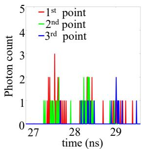

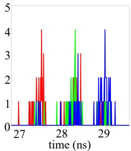  
(a) galvo mirrors  
(depth error = 51.3 cm)  
(b) our technique  
(depth error = 3.28 cm)

Figure 10. Transient and depth measurement. We scan three small objects placed at different depths using commercial galvo mirrors and our technique. The total exposure duration is 3 ms, corresponding to the fastest speed (1kpps) at which the galvo mirrors can scan the scene. The laser repetition rate is 1 MHz. We show three transients measured by (a) the galvo mirrors and (b) our technique when the scan location is at the first, second, and third point. The galvo mirrors spend a significant amount of time moving the focus point from one object to another, wasting pulses emitted during that time. In contrast, our technique does not waste any pulses, as it moves the focus point in just 1 $. \mu \mathrm { s } ,$ the time between two laser pulse emissions. This results in significant improvement in depth estimation accuracy (computed from the highest peak of the transient) compared to the galvo mirrors. The mean squared depth error of our technique is 16× smaller than galvos.  
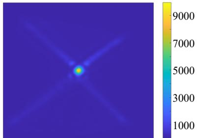  
Figure 11. Beam shape. We show an HDR image of the measured beam. It has a cross shape, as the ultrasonic lens has a square aperture. Using more transducers can result in the beam shape to be more Gaussian-like. The center peak vs. the crosshairs intensity ratio is 20, and the center peak vs. the background ratio is 400.

Scanning speed vs. aperture tradeoff. For the arbitrary point projector, the scanning speed (points per second, pps) is equal to the frequency of the ultrasonic transducer voltage. The aperture of the ultrasonically-sculpted lens is equal to the ultrasound wavelength ${ \lambda _ { \mathrm { u s } } = c _ { \mathrm { u s } } / f _ { \mathrm { u s } } }$ . Therefore, the product of scanning frequency and the lens aperture is always less than or equal to the speed of sound. Increasing the scanning speed decreases the aperture of the ultrasonic lens. This decrease in the aperture size is not a problem for projector applications, but for LiDAR applications, the decrease in aperture decreases light throughput.

Diffraction limit. The numerical aperture of the ultrasonically-sculpted lens is approximately $n \lambda _ { \mathrm { u s } } / { _ { 2 F } } ,$ where

Table 3. Tradeoffs between various system parameters. ↑ is better.
<table><tr><td>parameter</td><td> $c _ { \mathrm { u s } }$ </td><td> $f _ { \mathrm { u s } }$ </td><td> $\bar { \lambda }$ </td><td>n</td></tr><tr><td>scan speed</td><td>个</td><td>个</td><td></td><td></td></tr><tr><td>aperture</td><td>个</td><td></td><td></td><td></td></tr><tr><td>spatial resolution</td><td>←</td><td></td><td></td><td>个</td></tr></table>

F is the focal length of the ultrasonically-sculped waveguide. Therefore, the diffraction-limited spot size is

$$
\Delta x = { \frac { \lambda } { 2 N A } } \approx { \frac { \lambda } { \lambda _ { \mathrm { { u s } } } } } { \frac { F } { n } } = { \frac { \lambda f _ { \mathrm { { u s } } } } { c _ { \mathrm { { u s } } } } } { \frac { F } { n } } .\tag{7}
$$

Uncertainty principle. Spatial resolution is inversely proportional to the diffraction-limited spot size, and as mentioned earlier, temporal resolution is determined by the frequency of the transducer. So, we have the following uncertainty principle between spatial and temporal resolution:

$$
\Delta x \Delta T \leq { \frac { \lambda } { c _ { \mathrm { u s } } } } { \frac { F } { n } } .\tag{8}
$$

To improve spatiotemporal resolution, we can decrease the focal length of the waveguide by increasing the voltage applied to the transducer. However, increasing the voltage makes the system non-linear and increases the probability of cavitation in the medium [52].

Another approach to improve the system’s overall quality (increase aperture size, spatial and temporal resolutions) is to use a medium with a higher speed of sound. For example, tellurium dioxide $\mathrm { ( T e O _ { 2 } ) }$ glass has three times higher speed of sound and 50% higher refractive index than water. Using tellurium dioxide glass will improve light efficiency by an order of magnitude, and simultaneously improve spatial resolution by five times. This material is also part of existing acousto-optic devices [30], but we found them hard to modify. Tellurium dioxide, being a solid, would additionally be a more stable medium than liquid water.

Shape of the blur kernel. We used two transducers in our system, and each one of them creates a cylindrical lens. The net effect of these two cylindrical lenses is a square aperture, whose Fourier transform is the product of two 1D sincs. Therefore, our blur kernel has a cross-shape, as we can see in Fig. 11. We can make this blur kernel closer to a Gaussian-like blur kernel by using multiple transducers arranged around a circular path and synchronized. Based on the application, we can also use deconvolution techniques to improve the results in post-processing [4].

Acknowledgments. We thank Hossein Baktash and Lloyd Lobo for help with the hardware prototype, and Ande Nascimento and Amy Lee for help with the physics-based renderer. This work was supported by NSF awards 1730147, 1900821, 1900849, 1935849, gifts from AWS Cloud Credits for Research and the Sybiel Berkman Foundation, and a Sloan Research Fellowship for Ioannis Gkioulekas.

## References

[1] Technical specifications of Alpha Prime (VLS-128). https: //www.mapix.com/lidar- scanner- sensors/ velodyne/alpha-prime/. Accessed: 2023-03-27. 6

[2] Mohammad Abdo, Vlad Badilita, and Jan Korvink. Spatial scanning hyperspectral imaging combining a rotating slit with a dove prism. Optics Express, 27(15):20290–20304, 2019. 2

[3] Supreeth Achar, Joseph R. Bartels, William L. ’Red’ Whittaker, Kiriakos N. Kutulakos, and Srinivasa G. Narasimhan. Epipolar time-of-flight imaging. ACM Trans. Graph., 36(4), jul 2017. 2

[4] Hossein Baktash, Yash Belhe, Matteo Giuseppe Scopelliti, Yi Hua, Aswin C Sankaranarayanan, and Maysamreza Chamanzar. Computational imaging using ultrasonically-sculpted virtual lenses. In 2022 IEEE International Conference on Computational Photography (ICCP), pages 1–12. IEEE, 2022. 8

[5] Jared Beller and Linbo Shao. Acousto-optic modulators integrated on-chip. Light: Science & Applications, 11(1):1–2, 2022. 3

[6] Alexander W Bergman, David B Lindell, and Gordon Wetzstein. Deep adaptive lidar: End-to-end optimization of sampling and depth completion at low sampling rates. In 2020 IEEE International Conference on Computational Photography (ICCP), pages 1–11. IEEE, 2020. 6

[7] Charles Bond, Adriana N Santiago-Ruiz, Qing Tang, and Melike Lakadamyali. Technological advances in super-resolution microscopy to study cellular processes. Molecular Cell, 82(2):315–332, 2022. 2

[8] Mauro Buttafava, Jessica Zeman, Alberto Tosi, Kevin Eliceiri, and Andreas Velten. Non-line-of-sight imaging using a time-gated single photon avalanche diode. Optics express, 23(16):20997–21011, 2015. 6

[9] Walter A Carrington, Kevin E Fogarty, Larry Lifschitz, and Fredric S Fay. Three-dimensional imaging on confocal and wide-field microscopes. Handbook of biological confocal microscopy, pages 151–161, 1990. 1

[10] Maysamreza Chamanzar, Matteo Giuseppe Scopelliti, Julien Bloch, Ninh Do, Minyoung Huh, Dongjin Seo, Jillian Iafrati, Vikaas S Sohal, Mohammad-Reza Alam, and Michel M Maharbiz. Ultrasonic sculpting of virtual optical waveguides in tissue. Nature communications, 10(1):1–10, 2019. 3

[11] Dorian Chan, Srinivasa G Narasimhan, and Matthew O’Toole. Holocurtains: Programming light curtains via binary holography. In Proceedings of the IEEE/CVF Conference on Computer Vision and Pattern Recognition, pages 17886–17895, 2022. 2

[12] Sreenithy Chandran, Hiroyuki Kubo, Tomoki Ueda, Takuya Funatomi, Yasuhiro Mukaigawa, and Suren Jayasuriya. Slope disparity gating: System and applications. IEEE Transactions on Computational Imaging, 8:317–332, 2022. 2

[13] Ting-Hsuan Chen, Jesse Ault, Howard A Stone, and Craig B Arnold. High-speed axial-scanning wide-field microscopy for volumetric particle tracking velocimetry. Experiments in Fluids, 58(5):1–7, 2017. 3

[14] Ting-Hsuan Chen, Romain Fardel, and Craig B Arnold. Ultrafast z-scanning for high-efficiency laser micro-machining. Light: Science & Applications, 7(4):17181–17181, 2018. 3

[15] Yang Cheng, Jie Cao, and Qun Hao. Optical beam steering using liquid-based devices. Optics and Lasers in Engineering, 146:106700, 2021. 3

[16] Maxim N Cherkashin, Carsten Brenner, Georg Schmitz, and Martin R Hofmann. Transversally travelling ultrasound for light guiding deep into scattering media. Communications Physics, 3(1):1–11, 2020. 3

[17] Winifried Denk, James H Strickler, and Watt W Webb. Twophoton laser scanning fluorescence microscopy. Science, 248(4951):73–76, 1990. 1, 2

[18] Xiaohan Du, SeungYeon Kang, and Craig B Arnold. Opti mization of ultrafast axial scanning parameters for efficient pulsed laser micro-machining. Journal of Materials Processing Technology, 288:116850, 2021. 3

[19] Mart´ı Duocastella, Craig B Arnold, and Jason Puchalla. S electable light-sheet uniformity using tuned axial scanning. Microscopy research and technique, 80(2):250–259, 2017. 3

[20] Vladislav Gavryusev, Giuseppe Sancataldo, Pietro Ricci, Alberto Montalbano, Chiara Fornetto, Lapo Turrini, Annunziatina Laurino, Luca Pesce, Giuseppe de Vito, Natascia Tiso, et al. Dual-beam confocal light-sheet microscopy via flexible acousto-optic deflector. Journal of biomedical optics, 24(10):106504, 2019. 3

[21] Milton S Gottlieb. Acousto-optic tunable filters. In Design andfabrication ofacousto-optic devices, pages 197–283. CRC Press, 2021. 3

[22] Ireneusz Grulkowski, Krzysztof Szulzycki, and Maciej Wojtkowski. Microscopic oct imaging with focus extension by ultrahigh-speed acousto-optic tunable lens and stroboscopic illumination. Optics Express, 22(26):31746–31760, 2014. 3

[23] Min Gu. Principles of three dimensional imaging in confocal microscopes. World Scientific, 1996. 1, 2

[24] Anant Gupta, Atul Ingle, and Mohit Gupta. Asynchronous single-photon 3d imaging. In Proceedings ofthe IEEE/CVF International Conference on Computer Vision, pages 7909– 7918, 2019. 5

[25] Anant Gupta, Atul Ingle, Andreas Velten, and Mohit Gupta. Photon-flooded single-photon 3d cameras. In Proceedings of the IEEE/CVF Conference on Computer Vision and Pattern Recognition, pages 6770–6779, 2019. 5

[26] Mohit Gupta, Amit Agrawal, Ashok Veeraraghavan, and Srinivasa G Narasimhan. Structured light 3d scanning in the presence of global illumination. In CVPR 2011, pages 713–720. IEEE, 2011. 2

[27] Kristofer Henderson, Xiaomeng Liu, Justin Folden, Brevin Tilmon, Suren Jayasuriya, and Sanjeev Koppal. Design and calibration of a fast flying-dot projector for dynamic light transport acquisition. IEEE Transactions on Computational Imaging, 6:529–543, 2020. 1

[28] Sven TS Holmstrom, Utku Baran, and Hakan Urey. Mems¨ laser scanners: a review. Journal ofMicroelectromechanical Systems, 23(2):259–275, 2014. 1

[29] Ching-Pai Hsu, Boda Li, Braulio Solano-Rivas, Amar R Gohil, Pak Hung Chan, Andrew D Moore, and Valentina

Donzella. A review and perspective on optical phased array for automotive lidar. IEEE Journal ofSelected Topics in Quantum Electronics, 27(1):1–16, 2020. 3

[30] Dawoon Jeong, Hansol Jang, Min Uk Jung, and Chang-Seok Kim. Angular resolution variable fmcw lidar with acoustooptic deflector. In Imaging Systems and Applications, pages ITh4D–3. Optica Publishing Group, 2022. 3, 8

[31] S Kang, E Dotsenko, D Amrhein, C Theriault, and Craig B Arnold. Ultra-high-speed variable focus optics for novel applications in advanced imaging. In Photonic Instrumentation Engineering V, volume 10539, page 1053902. SPIE, 2018. 3

[32] SeungYeon Kang, Mart´ı Duocastella, and Craig B Arnold. Variable optical elements for fast focus control. Nature Photonics, 14(9):533–542, 2020. 3

[33] Doycho Karagyozov, Mirna Mihovilovic Skanata, Amanda Lesar, and Marc Gershow. Recording neural activity in unrestrained animals with three-dimensional tracking two-photon microscopy. Cell reports, 25(5):1371–1383, 2018. 3

[34] Yasin Karimi, Matteo Giuseppe Scopelliti, Ninh Do, Mohammad-Reza Alam, and Maysamreza Chamanzar. In situ 3d reconfigurable ultrasonically sculpted optical beam paths. Optics express, 27(5):7249–7265, 2019. 3

[35] Byung-Sub Kim, Steve Gibson, and Tsu-Chin Tsao. Adaptive control of a tilt mirror for laser beam steering. In Proceedings ofthe 2004 American Control Conference, volume 4, pages 3417–3421. IEEE, 2004. 2

[36] Lingjie Kong, Jianyong Tang, Justin P Little, Yang Yu, Tim Lammermann, Charles P Lin, Ronald N Germain, and Meng¨ Cui. Continuous volumetric imaging via an optical phaselocked ultrasound lens. Nature methods, 12(8):759–762, 2015. 3

[37] Hiroyuki Kubo, Suren Jayasuriya, Takafumi Iwaguchi, Takuya Funatomi, Yasuhiro Mukaigawa, and Srinivasa G Narasimhan. Programmable non-epipolar indirect light transport: Capture and analysis. IEEE Transactions on Visualization and Computer Graphics, 27(4):2421–2436, 2019. 2

[38] Nanxi Li, Chong Pei Ho, Jin Xue, Leh Woon Lim, Guanyu Chen, Yuan Hsing Fu, and Lennon Yao Ting Lee. A progress review on solid-state lidar and nanophotonics-based lidar sensors. Laser & Photonics Reviews, page 2100511, 2022. 1

[39] David B Lindell, Gordon Wetzstein, and Matthew O’Toole. Wave-based non-line-of-sight imaging using fast fk migration. ACM Transactions on Graphics (ToG), 38(4):1–13, 2019. 2, 6

[40] Qiyu Liu, Huan Li, and Mo Li. Electromechanical brillouin scattering in integrated optomechanical waveguides. Optica, 6(6):778–785, 2019. 3

[41] Xiaochun Liu, Ibon Guill´ en, Marco La Manna, Ji Hyun Nam,´ Syed Azer Reza, Toan Huu Le, Adrian Jarabo, Diego Gutierrez, and Andreas Velten. Non-line-of-sight imaging using phasor-field virtual wave optics. Nature, 572(7771):620–623, 2019. 2, 6

[42] Xiaomeng Liu, Kristofer Henderson, Joshua Rego, Suren Jayasuriya, and Sanjeev Koppal. Dense lissajous sampling and interpolation for dynamic light-transport. Optics Express, 29(12):18362–18381, 2021. 1

[43] Julio Marco, Adrian Jarabo, Ji Hyun Nam, Xiaochun Liu, Miguel Angel Cosculluela, Andreas Velten, and Diego Gutier-´ rez. Virtual light transport matrices for non-line-of-sight imaging. In Proceedings ofthe IEEE/CVF International Conference on Computer Vision, pages 2440–2449, 2021. 6

[44] Nathan Matsuda, Oliver Cossairt, and Mohit Gupta. Mc3d: Motion contrast 3d scanning. In 2015 IEEE International Conference on Computational Photography (ICCP), pages 1–10. IEEE, 2015. 2

[45] Aongus McCarthy, Nils J Krichel, Nathan R Gemmell, Ximing Ren, Michael G Tanner, Sander N Dorenbos, Val Zwiller, Robert H Hadfield, and Gerald S Buller. Kilometer-range, high resolution depth imaging via 1560 nm wavelength singlephoton detection. Optics express, 21(7):8904–8915, 2013. 2

[46] Srinivasa Narasimhan, Supreeth Achar, Kiriakos Kutulakos, Joe Bartels, and William Whittaker. Method for epipolar time of flight imaging, Mar. 19 2020. US Patent App. 16/468,617. 2

[47] Matthew O’Toole, Supreeth Achar, Srinivasa G Narasimhan, and Kiriakos N Kutulakos. Homogeneous codes for energyefficient illumination and imaging. ACM Transactions on Graphics (ToG), 34(4):1–13, 2015. 1, 2

[48] Matthew O’Toole, Ramesh Raskar, and Kiriakos N Kutulakos. Primal-dual coding to probe light transport. ACM Trans. Graph., 31(4):39–1, 2012. 2

[49] Matthew O’Toole, David B Lindell, and Gordon Wetzstein. Confocal non-line-of-sight imaging based on the light-cone transform. Nature, 555(7696):338–341, 2018. 2, 6

[50] James Pawley. Handbook of biological confocal microscopy, volume 236. Springer Science & Business Media, 2006. 1, 2

[51] Adithya Pediredla, Akshat Dave, and Ashok Veeraraghavan. Snlos: Non-line-of-sight scanning through temporal focusing. In 2019 IEEE International Conference on Computational Photography (ICCP), pages 1–13. IEEE, 2019. 2

[52] Adithya Pediredla, Matteo Giuseppe Scopelliti, Srinivasa Narasimhan, Maysamreza Chamanzar, and Ioannis Gkioulekas. Optimized virtual optical waveguides enhance light throughput in scattering media. preprint, 2021. 8

[53] Adithya Kumar Pediredla, Mauro Buttafava, Alberto Tosi, Oliver Cossairt, and Ashok Veeraraghavan. Reconstructing rooms using photon echoes: A plane based model and reconstruction algorithm for looking around the corner. In 2017 IEEE International Conference on Computational Photography (ICCP), pages 1–12. IEEE, 2017. 6

[54] Adithya K Pediredla, Aswin C Sankaranarayanan, Mauro Buttafava, Alberto Tosi, and Ashok Veeraraghavan. Signal processing based pile-up compensation for gated singlephoton avalanche diodes. arXiv preprint arXiv:1806.07437, 2018. 6

[55] Adithya Kumar Pediredla, Shizheng Zhang, Ben Avants, Fan Ye, Shin Nagayama, Ziying Chen, Caleb Kemere, Jacob T Robinson, and Ashok Veeraraghavan. Deep imaging in scattering media with selective plane illumination microscopy. Journal ofbiomedical optics, 21(12):126009, 2016. 1, 2

[56] Kurt E Petersen. Silicon torsional scanning mirror. IBM Journal ofResearch and Development, 24(5):631–637, 1980.

[57] Ryan Po, Adithya Pediredla, and Ioannis Gkioulekas. Adaptive gating for single-photon 3d imaging. In Proceedings of the IEEE/CVF Conference on Computer Vision and Pattern Recognition, pages 16354–16363, 2022. 5, 6

[58] Christopher V Poulton, Matthew J Byrd, Benjamin Moss, Erman Timurdogan, Ron Millman, and Michael R Watts. 8192-element optical phased array with 100° steering range and flip-chip cmos. In CLEO: QELS Fundamental Science, pages JTh4A–3. Optical Society of America, 2020. 3

[59] Joshua Rapp, Yanting Ma, Robin MA Dawson, and Vivek K Goyal. Dead time compensation for high-flux ranging. IEEE Transactions on Signal Processing, 67(13):3471–3486, 2019. 6

[60] Joshua Rapp, Yanting Ma, Robin MA Dawson, and Vivek K Goyal. High-flux single-photon lidar. Optica, 8(1):30–39, 2021. 6

[61] Joshua Rodriguez, Braden Smith, Brandon Hellman, Adley Gin, Alonzo Espinoza, and Yuzuru Takashima. Multi-beam and single-chip lidar with discrete beam steering by digital micromirror device. In Physics and Simulation of Optoelectronic Devices XXVI, volume 10526, pages 89–94. SPIE, 2018. 3

[62] Patrick S Salter, Z Iqbal, and Martin J Booth. Analysis of the three-dimensional focal positioning capability of adaptive optic elements. International Journal of Optomechatronics, 7(1):1–14, 2013. 3

[63] Matteo Giuseppe Scopelliti and Maysamreza Chamanzar. Ultrasonically sculpted virtual relay lens for in situ microimaging. Light: Science & Applications, 8(1):1–15, 2019. 1, 3

[64] Xiaobing Shang, Jin-Yi Tan, Oliver Willekens, Jelle De Smet, Pankaj Joshi, Dieter Cuypers, Esma Islamaj, Jeroen Beeckman, Kristiaan Neyts, Michael Vervaeke, et al. Electrically controllable liquid crystal component for efficient light steering. IEEE Photonics Journal, 7(2):1–13, 2015. 3

[65] Braden Smith, Brandon Hellman, Adley Gin, Alonzo Espinoza, and Yuzuru Takashima. Single chip lidar with discrete beam steering by digital micromirror device. Optics Express, 25(13):14732–14745, 2017. 3

[66] Qi Wang Song, Xu-Ming Wang, Rebecca Bussjager, and Joseph Osman. Electro-optic beam-steering device based on a lanthanum-modified lead zirconate titanate ceramic wafer. Applied optics, 35(17):3155–3162, 1996. 3

[67] Steven J Spector. Review of lens-assisted beam steering methods. Journal of Optical Microsystems, 2(1):011003, 2022. 3

[68] Ernst HK Stelzer, Frederic Strobl, Bo-Jui Chang, Friedrich Preusser, Stephan Preibisch, Katie McDole, and Reto Fiolka. Light sheet fluorescence microscopy. Nature Reviews Methods Primers, 1(1):1–25, 2021. 1, 2

[69] Lin Sun, Jin-ha Kim, Chiou-hung Jang, Dechang An, Xuejun Lu, Qingjun Zhou, John Martin Taboada, Ray T Chen, Jeffery J Maki, Suning Tang, et al. Polymeric waveguide prism-based electro-optic beam deflector. Optical Engineering, 40(7):1217–1222, 2001. 3

[70] Varun Sundar, Sizhuo Ma, Aswin C Sankaranarayanan, and Mohit Gupta. Single-photon structured light. In Proceedings of the IEEE/CVF Conference on Computer Vision and Pattern Recognition, pages 17865–17875, 2022. 2

[71] Opsys Tech. Opsys tech: The only scanning lidar with absolutely no moving parts. https://www.opsys-tech. com/post/opsys- tech- the- only- scanninglidar - with - absolutely - no - moving - parts. Accessed: 2022-10-20. 3

[72] Chen S Tsai. Guided-wave acousto-optics: interactions, devices, and applications, volume 23. Springer Science & Business Media, 2013. 3

[73] Tomoki Ueda, Hiroyuki Kubo, Suren Jayasuriya, Takuya Funatomi, and Yasuhiro Mukaigawa. Slope disparity gating using a synchronized projector-camera system. In 2019 IEEE International Conference on Computational Photography (ICCP), pages 1–9. IEEE, 2019. 2

[74] Federica Villa, Fabio Severini, Francesca Madonini, and Franco Zappa. Spads and sipms arrays for long-range high-speed light detection and ranging (lidar). Sensors, 21(11):3839, 2021. 1

[75] Dingkang Wang, Connor Watkins, and Huikai Xie. Mems mirrors for lidar: a review. Micromachines, 11(5):456, 2020. 1

[76] Jian Wang, Joseph Bartels, William Whittaker, Aswin C Sankaranarayanan, and Srinivasa G Narasimhan. Programmable triangulation light curtains. In Proceedings of the European Conference on Computer Vision (ECCV), pages 19–34, 2018. 2

[77] Xiangru Wang, Liang Wu, Caidong Xiong, Man Li, Qinggui Tan, Jiyang Shang, Shuanghong Wu, and Qi Qiu. Agile laser beam deflection with high steering precision and angular resolution using liquid crystal optical phased array. IEEE Transactions on Nanotechnology, 17(1):26–28, 2016. 3

[78] Zihan Wang, Jie Cao, Qun Hao, Fanghua Zhang, Yang Cheng, and Xianyue Kong. Super-resolution imaging and field of view extension using a single camera with risley prisms. Review ofScientific Instruments, 90(3):033701, 2019. 2

[79] RM Waxler and CE Weir. Effect of pressure and temperature on the refractive indices of benzene, carbon tetrachloride, and water. Journal of research of the National Bureau of Standards. Section A, Physics and chemistry, 67(2):163, 1963. 1

[80] Ming-Tzo Wei, Shana Elbaum-Garfinkle, Alex S Holehouse, Carlos Chih-Hsiung Chen, Marina Feric, Craig B Arnold, Rodney D Priestley, Rohit V Pappu, and Clifford P Brangwynne. Phase behaviour of disordered proteins underlying low density and high permeability of liquid organelles. Nature chemistry, 9(11):1118–1125, 2017. 3

[81] Shumian Xin, Sotiris Nousias, Kiriakos N Kutulakos, Aswin C Sankaranarayanan, Srinivasa G Narasimhan, and Ioannis Gkioulekas. A theory of fermat paths for non-line-ofsight shape reconstruction. In Proceedings ofthe IEEE/CVF conference on computer vision and pattern recognition, pages 6800–6809, 2019. 2

[82] Chris Xu, Warren Zipfel, Jason B Shear, Rebecca M Williams, and Watt W Webb. Multiphoton fluorescence excitation: new spectral windows for biological nonlinear microscopy. Proceedings of the National Academy of Sciences, 93(20):10763– 10768, 1996. 1, 2

[83] Jiawen Xu and Jiong Tang. Tunable prism based on piezoelectric metamaterial for acoustic beam steering. Applied Physics Letters, 110(18):181902, 2017. 3

[84] Donghai Yang, Yifan Liu, Qingjiu Chen, Meng Chen, Shaodong Zhan, Nim-kwan Cheung, Ho-Yin Chan, Zhidong Wang, and Wen Jung Li. Development of the high angular resolution 360° lidar based on scanning mems mirror. Scientific Reports, 13(1):1540, 2023. 2

[85] Zejie Yu and Xiankai Sun. Gigahertz acousto-optic modulation and frequency shifting on etchless lithium niobate integrated platform. ACS Photonics, 8(3):798–803, 2021. 3

[86] Mantas Zurauskas, Oliver Barnstedt, Maria Frade-Rodriguez,ˇ Scott Waddell, and Martin J Booth. Rapid adaptive remote focusing microscope for sensing of volumetric neural activity. Biomedical optics express, 8(10):4369–4379, 2017. 3