# Power Bundle Adjustment for Large-Scale 3D Reconstruction

Simon Weber1,2

sim.weber@tum.de

Nikolaus Demmel1,2

nikolaus.demmel@tum.de

Tin Chon Chan1,2

tin-1254@hotmail.com

Daniel Cremers1,2,3

cremers@tum.de

## Abstract

We introduce Power Bundle Adjustment as an expansion type algorithm for solving large-scale bundle adjustment problems. It is based on the power series expansion of the inverse Schur complement and constitutes a new family of solvers that we call inverse expansion methods. We theoretically justify the use of power series and we prove the convergence of our approach. Using the real-world BAL dataset we show that the proposed solver challenges the state-of-the-art iterative methods and significantly accelerates the solution ofthe normal equation, evenfor reaching a very high accuracy. This easy-to-implement solver can also complement a recently presented distributed bundle adjustment framework. We demonstrate that employing the proposed Power Bundle Adjustment as a sub-problem solver significantly improves speed and accuracy of the distributed optimization.

## 1. Introduction

Bundle adjustment (BA) is a classical computer vision problem that forms the core component of many 3D reconstruction and Structure from Motion (SfM) algorithms. It refers to the joint estimation of camera parameters and 3D landmark positions by minimization of a non-linear reprojection error. The recent emergence of large-scale internet photo collections [1] raises the need for BA methods that are scalable with respect to both runtime and memory. And building accurate city-scale maps for applications such as augmented reality or autonomous driving brings current BA approaches to their limits.

As the solution of the normal equation is the most time consuming step of BA, the Schur complement trick is usually employed to form the reduced camera system (RCS). This linear system involves only the pose parameters and is significantly smaller. Its size can be reduced even more by using a QR factorization, deriving only a matrix square root of the RCS, and then solving an algebraically equivalent problem [4]. Both the RCS and its square root formulation are commonly solved by iterative methods such as the popular preconditioned conjugate gradients algorithm for largescale problems or by direct methods such as Cholesky factorization for small-scale problems.

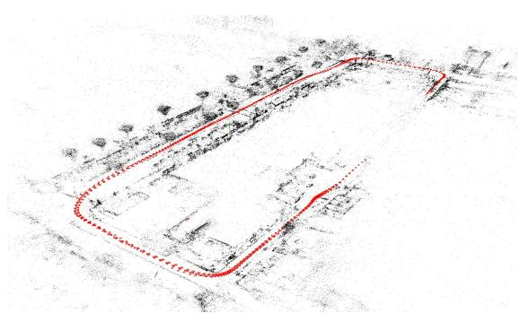  
(a) Ladybug-1197

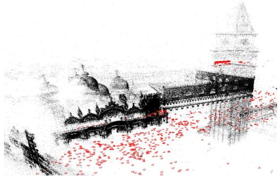  
(b) Venice-1102  
Figure 1. Power Bundle Adjustment (PoBA) is a novel solver for large-scale BA problems that is significantly faster and more memory-efficient than existing solvers. (a) Optimized 3D reconstruction of a Ladybug BAL problem with 1197 poses. PoBA-32 (resp. PoBA-64) is 41% (resp. 36%) faster than the best competing solver to reach a cost tolerance of 1%. (b) Optimized 3D reconstruction of a Venice BAL problem with 1102 poses. PoBA-32 (resp. PoBA-64) is 71% (resp. 69%) faster than the best competing solver to reach a cost tolerance of 1%. PoBA is five times (resp. twice) less memory-consuming than BA (resp. Ceres).

In the following, we will challenge these two families of solvers by relying on an iterative approximation of the inverse Schur complement. In particular, our contributions • We introduce Power Bundle Adjustment (PoBA) for efficient large-scale BA. This new family of techniques that we call inverse expansion methods challenges the state-of-the-art methods which are built on iterative and direct solvers.

• We link the bundle adjustment problem to the theory of power series and we provide theoretical proofs that justify this expansion and establish the convergence of our solver.

• We perform extensive evaluation of the proposed approach on the BAL dataset and compare to several state-of-the-art solvers. We highlight the benefits of PoBA in terms of speed, accuracy, and memoryconsumption. Figure 1 shows reconstructions for two out of the 97 evaluated BAL problems.

• We incorporate our solver into a recently proposed distributed BA framework and show a significant improvement in terms of speed and accuracy.

• We release our solver as open source to facilitate further research: https://github.com/ simonwebertum/poba

## 2. Related Work

Since we propose a new way to solve large-scale bundle adjustment problems, we will review works on bundle adjustment and on traditional solving methods, that is, direct and iterative methods. We also provide some background on power series. For a general introduction to series expansion we refer the reader to [14].

## Scalable bundle adjustment.

A detailed survey of bundle adjustment can be found in [16]. The Schur complement [20] is the prevalent way to exploit the sparsity of the BA Problem. The choice of resolution method is typically governed by the size of the normal equation: With increasing size, direct methods such as sparse and dense Cholesky factorization [15] are outperformed by iterative methods such as inexact Newton algorithms. Large-scale bundle adjustment problems with tens of thousands of images are typically solved by the conjugate gradient method [1, 2, 8]. Some variants have been designed, for instance the search-space can be enlarged [17] or a visibility-based preconditioner can be used [9]. A recent line of works on square root bundle adjustment proposes to replace the Schur complement for eliminating landmarks with nullspace projection [4, 5]. It leads to significant performance improvements and to one of the most performant solver for the bundle adjustment problem in term of speed and accuracy. Nevertheless these methods still rely on traditional solvers for the reduced camera system, i.e. preconditioned conjugate gradient method (PCG) for large-scale [4] and Cholesky decomposition for small-scale [5] problems, besides an important cost in term of memory-consumption. Even with PCG, solving the normal equation remains the bottleneck and finding thousands of unknown parameters requires a large number of inner iterations. Other authors try to improve the runtime of BA with PCG by focusing on efficient parallelization [13]. Recently, Stochastic BA [22] was introduced to stochastically decompose the reduced camera system into subproblems and solve the smaller normal equation by dense factorization. This leads to a distributed optimization framework with improved speed and scalability. By encapsulating the general power series theory into a linear solver we propose to simultaneously improve the speed, the accuracy and the memory-consumption of these existing methods.

## Power series solver.

While power series expansion is common to solve differential equations [3], to the best of our knowledge it has never been employed for solving the bundle adjustment problem. A recent work [21] links the Schur complement to Neumann polynomial expansion to build a new preconditioner. Although this method presents interesting results for some physics problems such as convection-diffusion or atmospheric equations, it remains unsatisfactory for the bundle adjustment problem (see Figure 2). In contrast, we propose to directly apply the power series expansion of the inverse Schur complement for solving the BA problem. Our solver therefore falls in the category of expansion methods that – to our knowledge – have never been applied to the BA problem. In addition to being an easy-to-implement solver it leverages the special structure of the BA problem to simultaneously improve the trade-off speed-accuracy and the memory-consumption of the existing methods.

## 3. Power Series

We briefly introduce power series expansion of a matrix. Let $\rho ( A )$ denote the spectral radius of a square matrix A, i.e. the largest absolute eigenvalue and denote the spectral norm by $\| A \| = \rho ( A )$ . The following proposition holds:

Proposition 1. Let M be a $n \times n$ matrix. If the spectral radius of M satisfies $\| M \| < 1$ , then

$$
( I - M ) ^ { - 1 } = \sum _ { i = 0 } ^ { m } M ^ { i } + R ,\tag{1}
$$

where the error matrix

$$
R = \sum _ { i = m + 1 } ^ { \infty } M ^ { i } ,\tag{2}
$$

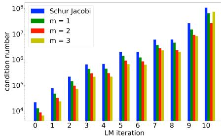  
(a) Condition numbe

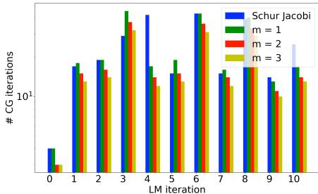  
(b) Number of CG iterations

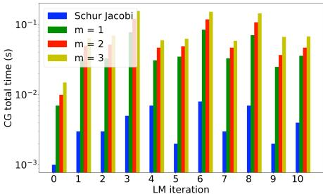  
(c) Total runtime of the CG algorithm  
Figure 2. Although [21] explores the use of power series as a preconditioner for some physics problems it suffers from the special structure of the BA formulation. Given a preconditioner $M ^ { - 1 }$ and the Schur complement S, the condition number $\kappa ( M ^ { - 1 } S )$ is linked to the convergence of the conjugate gradients algorithm. (a) illustrates the behaviour of κ for the ten first iterations of the LM algorithm for the real problem Ladybug-49 with 49 poses from BAL dataset and for different orders m of the power series expansion (22) used as preconditioner for the CG algorithm. The condition number associated to the popular Schur-Jacobi preconditioner is reduced with this power series preconditioner, that is illustrated by a better convergence of the CG algorithm and then a smaller number of CG iterations (b). Nevertheless each supplementary order m is more costly in terms of runtime as the application of the power series preconditioner involves 4m matrix-vector product, whereas the Schur-Jacobi preconditioner can be efficiently stored and applied. (c) It leads to an increase of the overall runtime when solving the normal equation (6).

satisfies

$$
\| R \| \leq \frac { \| M \| ^ { m + 1 } } { 1 - \| M \| } .\tag{3}
$$

A proof is provided in Appendix and an illustration with real problems is given in Figure 5.

## 4. Power Bundle Adjustment

We consider a general form of bundle adjustment with $n _ { p }$ poses and $n _ { l }$ landmarks. Let $\boldsymbol { x } = \left( \boldsymbol { x } _ { p } , \boldsymbol { x } _ { l } \right)$ be the state vector containing all the optimization variables, where the vector $x _ { p }$ of length $d _ { p } n _ { p }$ is associated to the extrinsic and (possibly) intrinsic camera parameters for all poses and the vector $x _ { l }$ of length $3 n _ { l }$ is associated to the 3D coordinates of all landmarks. In case only the extrinsic parameters are unknown then $d _ { p } = 6$ for rotation and translation of each camera. For the evaluated BAL problems we additionally estimate intrinsic parameters and $d _ { p } = 9$ . The objective is to minimize the total bundle adjustment energy

$$
F ( \boldsymbol { x } ) = \frac { 1 } { 2 } \| r ( \boldsymbol { x } ) \| _ { 2 } ^ { 2 } = \frac { 1 } { 2 } \sum _ { i } \| r _ { i } ( \boldsymbol { x } ) \| _ { 2 } ^ { 2 } ,\tag{4}
$$

where the vector $\boldsymbol { r } ( \boldsymbol { x } ) = [ r _ { 1 } ( \boldsymbol { x } ) ^ { \top } , . . . , r _ { k } ( \boldsymbol { x } ) ^ { \top } ] ^ { \top }$ comprises all residuals capturing the discrepancy between model and observation.

## 4.1. Least Squares Problem

This nonlinear least squares problem is commonly solved with the Levenberg-Marquardt (LM) algorithm, which is based on the first-order Taylor approximation of $r ( x )$ around the current state estimate $x ^ { 0 } \overset { ^ { \textstyle - } } { = } ( x _ { p } ^ { 0 } , x _ { l } ^ { 0 } )$ . By adding a regularization term to improve convergence the minimization turns into

$$
\begin{array} { r } { \underset { \Delta x _ { p } , \Delta x _ { l } } { \mathrm { m i n } } \frac { 1 } { 2 } \Big ( \Big \| r ^ { 0 } + \left( J _ { p } \quad J _ { l } \right) \Big ( \underset { \Delta x _ { l } } { \Delta x _ { p } } \Big ) \Big \| _ { 2 } ^ { 2 } } \\ { + \lambda \Big \| \left( D _ { p } \quad D _ { l } \right) \Big ( \underset { \Delta x _ { l } } { \Delta x _ { p } } \Big ) \Big \| _ { 2 } ^ { 2 } \Big ) , } \end{array}\tag{5}
$$

with $\begin{array} { r } { r ^ { 0 } = r ( x ^ { 0 } ) , J _ { p } = \frac { \partial r } { \partial x _ { n } } | _ { x ^ { 0 } } , J _ { l } = \frac { \partial r } { \partial x _ { l } } | _ { x ^ { 0 } } , } \end{array}$ λ a damping coefficient, and $D _ { p }$ and $D _ { c } ^ { ' }$ diagonal damping matrices for pose and landmark variables. This damped problem leads to the corresponding normal equation

$$
H \left( { \Delta x _ { p } } \right) = - \left( { b _ { p } \atop { \Delta x _ { l } } } \right) ,\tag{6}
$$

where

$$
H = \left( \begin{array} { c c } { { U _ { \lambda } } } & { { W } } \\ { { W ^ { \top } } } & { { V _ { \lambda } } } \end{array} \right) ,\tag{7}
$$

$$
\begin{array} { r } { U _ { \lambda } = J _ { p } ^ { \top } J _ { p } + \lambda D _ { p } ^ { \top } D _ { p } , } \end{array}\tag{8}
$$

$$
V _ { \lambda } = J _ { l } ^ { \top } J _ { l } + \lambda D _ { l } ^ { \top } D _ { l } ,\tag{9}
$$

$$
W = J _ { p } ^ { \top } J _ { l } ,
$$

$$
b _ { p } = { J } _ { p } ^ { \top } r ^ { 0 } , b _ { l } = { J } _ { l } ^ { \top } r ^ { 0 } .\tag{10}
$$

(11)

$U _ { \lambda } , V _ { \lambda }$ and H are symmetric positive-definite [16].

## 4.2. Schur Complement

As inverting the system matrix H of size $( d _ { p } n _ { p } + 3 n _ { l } ) ^ { 2 }$ directly tends to be excessively costly for large-scale problems it is common to reduce it by using the Schur complement trick. The idea is to form the reduced camera system

$$
S \Delta x _ { p } = - { \tilde { b } } ,\tag{12}
$$

with

$$
\begin{array} { r } { \boldsymbol { S } = \boldsymbol { U } _ { \lambda } - \boldsymbol { W } \boldsymbol { V } _ { \lambda } ^ { - 1 } \boldsymbol { W } ^ { \top } , } \end{array}\tag{13}
$$

$$
\tilde { b } = b _ { p } - W V _ { \lambda } ^ { - 1 } b _ { l } .\tag{14}
$$

(12) is then solved for $\Delta x _ { p }$ . The optimal $\Delta x _ { l }$ is obtained by back-substitution:

$$
\Delta x _ { l } = - V _ { \lambda } ^ { - 1 } ( - b _ { l } + W ^ { \top } \Delta x _ { p } ) .\tag{15}
$$

## 4.3. Power Bundle Adjustment

Factorizing (13) with the block-matrix $U _ { \lambda }$

$$
\boldsymbol { S } = \boldsymbol { U } _ { \lambda } ( \boldsymbol { I } - \boldsymbol { U } _ { \lambda } ^ { - 1 } \boldsymbol { W } \boldsymbol { V } _ { \lambda } ^ { - 1 } \boldsymbol { W } ^ { \top } )\tag{16}
$$

leads to formulate the inverse Schur complement as

$$
\begin{array} { r } { S ^ { - 1 } = ( I - U _ { \lambda } ^ { - 1 } W V _ { \lambda } ^ { - 1 } W ^ { \top } ) ^ { - 1 } U _ { \lambda } ^ { - 1 } . } \end{array}\tag{17}
$$

In order to expand (17) into a power series as detailed in Proposition 1, we require to bound the spectral radius of $\boldsymbol { U } _ { \lambda } ^ { - \mathrm { i } } \boldsymbol { W } \boldsymbol { V } _ { \lambda } ^ { - 1 } \boldsymbol { W } ^ { \top }$ by 1.

By leveraging the special structure of the BA problem we prove an even stronger result:

Lemma 1. Let $\mu$ be an eigenvalue of $U _ { \lambda } ^ { - 1 } W V _ { \lambda } ^ { - 1 } W ^ { \top }$ Then

$$
\mu \in [ 0 , 1 [ .\tag{18}
$$

Proof. On the one hand $U _ { \lambda } ^ { - \frac { 1 } { 2 } } W V _ { \lambda } ^ { - 1 } W ^ { \top } U _ { \lambda } ^ { - \frac { 1 } { 2 } }$ is symmetric positive semi-definite, as $U _ { \lambda }$ and $V _ { \lambda }$ are symmetric positive definite. Then its eigenvalues are greater than 0. As $U _ { \lambda } ^ { - \frac { 1 } { 2 } } W V _ { \lambda } ^ { - 1 } W ^ { \top } U _ { \lambda } ^ { - \frac { 1 } { 2 } }$ and $U _ { \lambda } ^ { - 1 } W V _ { \lambda } ^ { - 1 } W ^ { \top }$ are similar,

$$
\mu \geq 0 .\tag{19}
$$

On the other hand $U _ { \lambda } ^ { - \frac { 1 } { 2 } } S U _ { \lambda } ^ { - \frac { 1 } { 2 } }$ is symmetric positive definite as $S$ and $U _ { \lambda }$ are. It follows that the eigenvalues of $U _ { \lambda } ^ { - 1 } S$ are all strictly positive due to its similarity with $U _ { \lambda } ^ { - \frac { 1 } { 2 } } S U _ { \lambda } ^ { - \frac { 1 } { 2 } } . \mathrm { A s }$

$$
\begin{array} { r } { U _ { \lambda } ^ { - 1 } W V _ { \lambda } ^ { - 1 } W ^ { \top } = I - U _ { \lambda } ^ { - 1 } S , } \end{array}\tag{20}
$$

it follows that

$$
\mu < 1 ,\tag{21}
$$

that concludes the proof.

□

Let be

$$
\tilde { S } _ { - 1 } ( m ) = \sum _ { i = 0 } ^ { m } ( U _ { \lambda } ^ { - 1 } W V _ { \lambda } ^ { - 1 } W ^ { \top } ) ^ { i } U _ { \lambda } ^ { - 1 } ,\tag{22}
$$

and

$$
x ( m ) = - \tilde { S } _ { - 1 } ( m ) \tilde { b } ,\tag{23}
$$

for $m \geq 0$ . The following proposition confirms that the approximation indeed converges with increasing order of m:

Proposition 2. $\| x ( m ) - \Delta x _ { p } \| _ { 2 } \xrightarrow [ m  + \infty ] { } 0$

Proof. We denote $P = U _ { \lambda } ^ { - 1 } W V _ { \lambda } ^ { - 1 } W ^ { \top }$ . Due to Lemma 1

$$
\| P \| < 1 .\tag{24}
$$

The inverse Schur complement associated to (6) admits a power series expansion:

$$
S ^ { - 1 } = \tilde { S } _ { - 1 } ( m ) + R _ { m } ,\tag{25}
$$

where

$$
R _ { m } = \sum _ { i = m + 1 } ^ { \infty } P ^ { i } U _ { \lambda } ^ { - 1 }\tag{26}
$$

satisfies

$$
\| R _ { m } \| \leq \frac { \| P \| ^ { m + 1 } } { 1 - \| P \| } \| U _ { \lambda } ^ { - 1 } \| .\tag{27}
$$

It follows that:

$$
x ( m ) - \Delta x _ { p } = R _ { m } \tilde { b } .\tag{28}
$$

The consistency of the spectral norm with respect to the vector norm implies:

$$
\| R _ { m } \tilde { b } \| _ { 2 } \leq \| R _ { m } \| \| \tilde { b } \| _ { 2 } .\tag{29}
$$

From (24), (27) and (29) we conclude the proof:

$$
\| R _ { m } \tilde { b } \| _ { 2 } \xrightarrow [ m  + \infty ] { } 0 ,\tag{30}
$$

and then

$$
\| x ( m ) - \Delta x _ { p } \| _ { 2 } \big . \underset { m  + \infty } { \longrightarrow } 0 .\tag{31}
$$

This convergence result proves that

• an approximation of $\Delta x _ { p }$ can be directly obtained by applying (22) to the right-hand side of (12);

• the quality of this approximation depends on the order m and can be as small as desired.

The power series expansion being iteratively derived, a termination rule is necessary.

By analogy with inexact Newton methods [11, 12, 18] such that the conjugate gradients algorithm we set a stop criterion

$$
( i + 1 ) * \| ( x ( i ) - x ( i - 1 ) ) \| _ { 2 } / \| x ( i ) \| _ { 2 } < \epsilon ,\tag{32}
$$

for a given ϵ. This criterion ensures that the power series expansion stops when the refinement of the pose update by expanding the inverse Schur complement into a supplementary order

$$
\lVert ( x ( i ) - x ( i - 1 ) ) \rVert _ { 2 }\tag{33}
$$

is much smaller than the average refinement when reaching the same order

$$
\frac { \| \sum _ { j = 1 } ^ { i } \left( x ( j ) - x ( j - 1 ) \right) + x ( 0 ) \| _ { 2 } } { i + 1 } = \frac { \| x ( i ) \| _ { 2 } } { i + 1 } .\tag{34}
$$

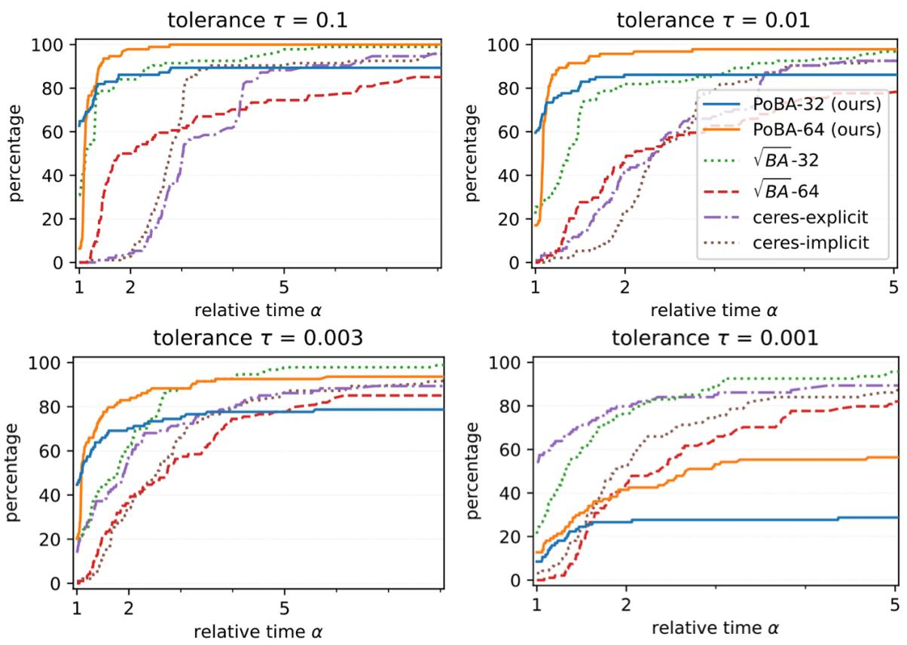  
Figure 3. Performance profiles for all BAL problems show the percentage of problems solved to a given accuracy tolerance $\tau \in$ {0.1, 0.01, 0.003, 0.001} with relative runtime α. Our proposed solver PoBA using series expansion of the Schur complement signifi cantly outperforms all the competing solvers up to the high accuracy $\tau = 0 . 0 0 3$

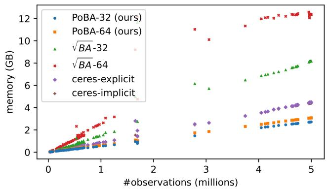  
Figure 4. Memory consumption for all BAL problems. The proposed PoBA solver (orange and blue points) is five times less memory-consuming than $\sqrt { B A }$ solvers.

## 5. Implementation

We implement our PoBA solver in C++ in single (PoBA-32) and double (PoBA-64) floating-point precision, directly on the publicly available implementation1 of [4]. This recent solver presents excellent performance to solve the bundle adjustment by using a QR factorization of the landmark Jacobians. It notably competes the popular Ceres solver. We additionally add a comparison with Ceres’ sparse Schur complement solvers, similarly as in [4]. Ceres-explicit and Ceres-implicit iteratively solve (12) with the conjugate gradients algorithm preconditioned by the Schur-Jacobi preconditioner. The first one saves $S$ in memory as a blocksparse matrix, the second one computes $S$ on-the-fly during iterations. $\sqrt { B A }$ and Ceres offer very competitive performance to solve the bundle adjustment problem, that makes them very challenging baselines to compare PoBA to. We run experiments on MacOS 11.2 with an Intel Core i5 and 4 cores at 2GHz.

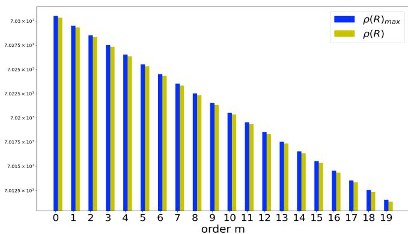  
(a) Ladybug-49

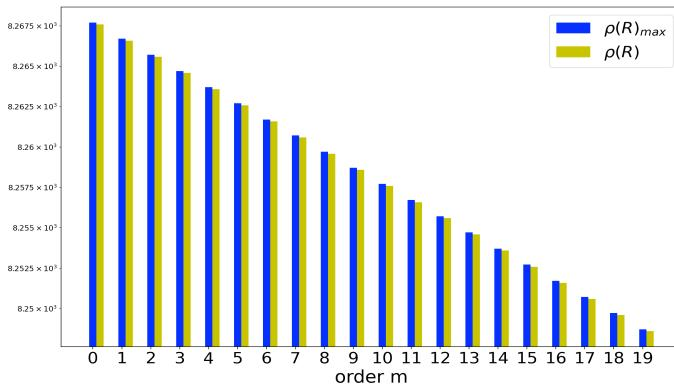  
(b) Trafalgar-193  
Figure 5. Illustration of the inequality (3) in Proposition 1 for the first LM iteration of two BAL problems: (a) Ladybug with 49 poses and (b) Trafalgar with 193 poses. The spectral norm of the error matrix R is plotted in green for $m \ : < \ : 2 0$ . The right-side of the inequality plotted in blue represents the theoretical upper bound of the spectral norm of the error matrix and depends on the considered m and on the spectral norm of $M = U _ { \lambda } ^ { - 1 } \bar { W } V _ { \lambda } ^ { - 1 } W ^ { \top }$ With Spectra library $[ 2 3 ] \rho ( M )$ takes the values (a) 0.999858 for $L { - } 4 9$ and (b) 0.999879 for T-193. Both values are smaller than 1 and $\rho ( R )$ is always smaller than $\rho ( M ) ^ { m + 1 } / ( 1 - \rho ( M ) )$ , as stated in Lemma 1.

## Efficient storage.

We leverage the special structure of BA problem and design a memory-efficient storage. We group the Jacobian matrices and residuals by landmarks and store them in separate dense memory blocks. For a landmark with k observations, all pose Jacobian blocks of size $2 \times d _ { p }$ that correspond to the poses where the landmark was observed, are stacked and stored in a memory block of size $2 k \times d _ { p }$ . Together with the landmark Jacobian block of size $2 k \times 3$ and the residuals of length 2k that are also associated to the landmark, all information of a single landmark is efficiently stored in a memory block of size $2 k \times ( d _ { p } + 4 )$ . Furthermore, operations involved in (15) and (23) are parallelized using the memory blocks.

## Performance Profiles.

To compare a set of solvers the user may be interested in two factors, a lower runtime and a better accuracy. Performance profiles [6] evaluate both jointly. Let S and P be respectively a set of solvers and a set of problems. Let $f _ { 0 } ( \boldsymbol { p } )$ be the initial objective and $f ( p , s )$ the final objective that is reached by solver $s \in S$ when solving problem $p \in P$ . The minimum objective the solvers in S attain for a problem p is $\begin{array} { r } { f ^ { * } ( p ) = \operatorname* { m i n } _ { s \in S } f ( p , s ) } \end{array}$ . Given a tolerance $\tau \in ( 0 , 1 )$ the objective threshold for a problem $p$ is given by

$$
f _ { \tau } ( p ) = f ^ { * } ( p ) + \tau ( f ^ { 0 } ( p ) - f ^ { * } ( p ) )\tag{35}
$$

and the runtime a solver s needs to reach this threshold is noted $T _ { \tau } ( p , s )$ . It is clear that the most efficient solver $s ^ { * }$ for a given problem p reaches the threshold with a runtime $\begin{array} { r } { T _ { \tau } ( p , s ^ { * } ) = \operatorname* { m i n } _ { s \in S } T _ { \tau } ( p , s ) } \end{array}$ . Then, the performance profile of a solver for a relative runtime α is defined as

$$
\rho ( s , \alpha ) = \frac { 1 0 0 } { | P | } | \{ p \in P | T _ { \tau } ( p , s ) \leq \alpha \operatorname* { m i n } _ { s \in S } T _ { \tau } ( p , s ) \} |\tag{36}
$$

Graphically the performance profile of a given solver is the percentage of problems solved faster than the relative runtime α on the x-axis.

## 5.1. Experimental Settings

## Dataset.

For our extensive evaluation we use all 97 bundle adjustment problems from the BAL project page. They are divided within five problems families. Ladybug is composed with images captured by a vehicle with regular rate. Images of Venice, Trafalgar and Dubrovnik come from Flickr.com and have been saved as skeletal sets [1]. Recombination of these problems with additional leaf images leads to the $F i -$ nal family. Details about these problems can be found in Appendix.

## LM loop.

PoBA is in line with the implementation [4] and with Ceres. Starting with damping parameter $1 0 ^ { - 4 }$ we update λ depending on the success or failure of the LM loop. We set the maximal number of LM iterations to 50, terminating earlier if a relative function tolerance of $1 0 ^ { - 6 }$ is reached. Concerning (23) and (32) we set the maximal number of inner iterations to 20 and a threshold $\epsilon = 0 . 0 1$ . Ceres and $\sqrt { B A }$ use same forcing sequence for the inner CG loop, where the maximal number of iterations is set to 500. We add a small Gaussian noise to disturb initial landmark and camera positions.

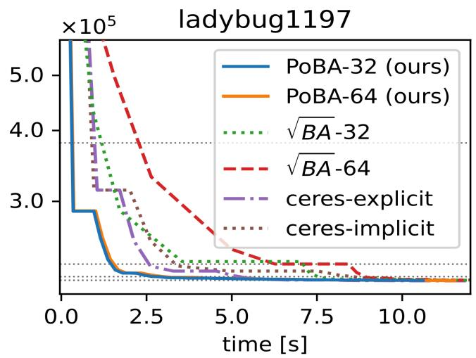

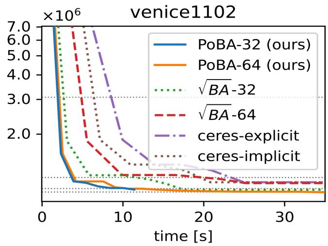

Figure 6. Convergence plots of Ladybug-1197 (left) from BAL dataset with 1197 poses and Venice-1102 (right) from BAL dataset with 1102 poses. Fig. 1 shows a visualization of 3D landmarks and camera poses for these problems. The dotted lines correspond to cost thresholds for the tolerances τ ∈ {0.1, 0.01, 0.003, 0.001}.  
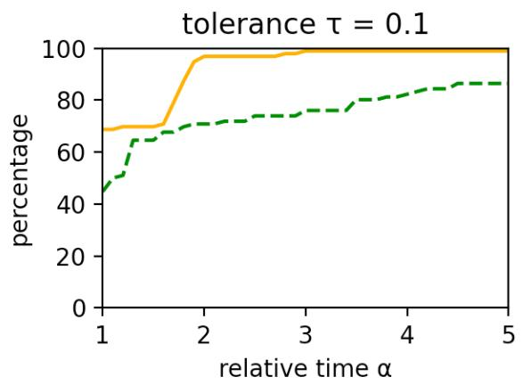

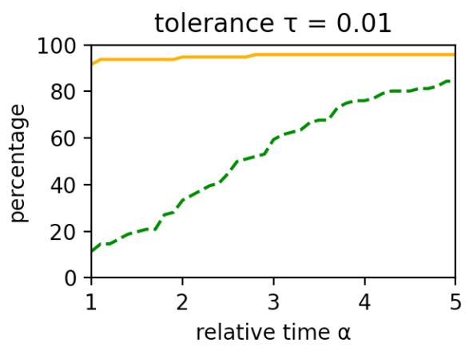

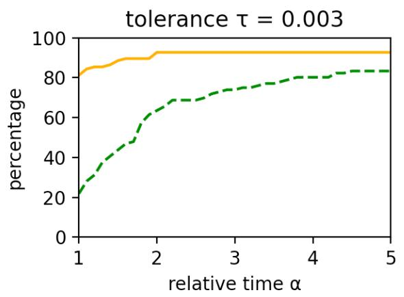

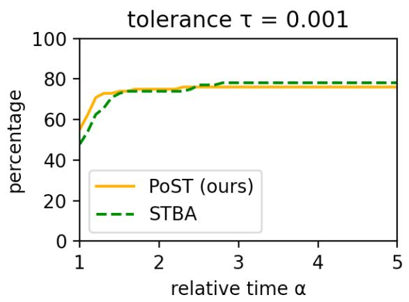  
Figure 7. Performance profiles for all BAL problems with stochastic framework. Our proposed solver PoST outperforms the challenging STBA across all accuracy tolerances $\tau \in \{ 0 . 1 , 0 . 0 1 , 0 . 0 0 3 \}$ , both in terms of speed and precision, and rivals STBA for $\tau = 0 . 0 0 1$

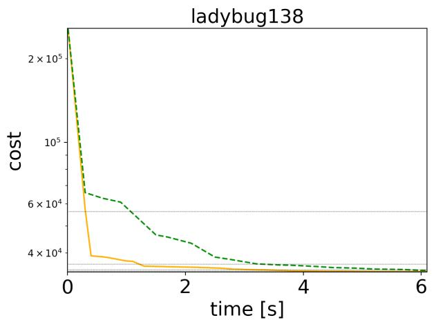

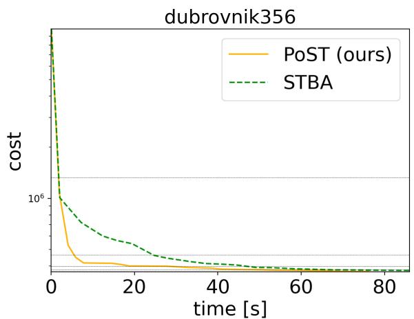  
Figure 8. Convergence plots of Ladybug-138 (left) from BAL dataset with 138 poses and Dubrovnik-356 (right) from BAL dataset with 356 poses. The dotted lines correspond to cost thresholds for the tolerances τ ∈ {0.1, 0.01, 0.003, 0.001}.

## 5.2. Analysis

Figure 3 shows the performance profiles for all BAL datasets with tolerances $\tau \in \{ 0 . 1 , 0 . 0 1 , 0 . 0 0 3 , 0 . 0 0 1 \}$ . For $\tau = 0 . 1$ and $\tau = 0 . 0 1$ PoBA-64 clearly outperforms all challengers both in terms of runtime and accuracy. $P o B A -$ 64 remains clearly the best solver for the excellent accuracy $\tau ~ = ~ 0 . 0 0 3$ until a high relative time $\alpha \ = \ 4 .$ . For higher relative time it is competitive with $\sqrt { B A } - 3 2$ and still outperforms all other challengers. Same conclusion can be drawn from the convergence plot of two differently sized BAL problems (see Figure 6). Figure 4 highlights the low memory consumption of PoBA with respect to its challengers for all BAL problems. Whatever the size of the problem PoBA is much less memory-consuming than $\sqrt { B A }$ and Ceres. Notably it requires almost five times less memory than $\sqrt { B A }$ and almost twice less memory than Ceresimplicit and Ceres-explicit.

## 5.3. Power Stochastic Bundle Adjustment (PoST)

## Stochastic Bundle Adjustment.

STBA decomposes the reduced camera system into clusters inside the Levenberg-Marquardt iterations. The per-cluster linear sub-problems are then solved in parallel with dense $L L ^ { \top }$ factorization due to the dense connectivity inside camera clusters. As shown in [22] this approach outperforms the baselines in terms of runtime and scales to very large BA problems, where it can even be used for distributed optimization. In the following we show that replacing the subproblem solver with our Power Bundle Adjustment can significantly boost runtime even further.

We extend $\mathbf { S } \mathrm { T B A } ^ { 2 }$ by incorporating our solver instead of the dense $L L ^ { \top }$ factorization. Each subproblem is then solved with a power series expansion of the inverse Schur complement with the same parameters as in Section 5.1. In accordance to [22] we set the maximal cluster size to 100 and the implementation is written in double in C++.

## Analysis.

Figure 7 presents the performance profiles with all BAL problems for different tolerances τ. Both solvers have similar accuracy for $\tau = 0 . 0 0 1$ . For $\tau \in \{ 0 . 1 , 0 . 0 1 , 0 . 0 0 3 \}$ PoST clearly outperforms STBA both in terms of runtime and accuracy, most notably for $\tau = 0 . 0 1$ . Same observations are done when we plot the convergence for differently sized BAL problems (see Figure 8).

## 6. Conclusion

We introduce a new class of large-scale bundle adjustment solvers that makes use of a power expansion of the inverse Schur complement. We prove the theoretical validity of the proposed approximation and the convergence of this solver. Moreover, we experimentally confirm that the proposed power series representation of the inverse Schur complement outperforms competitive iterative solvers in terms of speed, accuracy, and memory-consumption. Last but not least, we show that the power series representation can complement distributed bundle adjustment methods to significantly boost its performance for large-scale 3D reconstruction.

## Acknowledgement

This work was supported by the ERC Advanced Grant SIMULACRON, the Munich Center for Machine Learning, the EPSRC Programme Grant VisualAI EP/T028572/1, and the DFG projects WU 959/1-1 and CR 250 20-1 “Splitting Methods for 3D Reconstruction and SLAM”.

## References

[1] S. Agarwal, N. Snavely, S. M. Seitz, and R. Szeliski. Bundle adjustment in the large. In European Conference on Computer Vision (ECCV), pages 29-42. Springer, 2010. 1, 2, 6

[2] M. Byrod, K. ¨ Astr ˚ om. Conjugate gradient bundle ad-¨ justment. In European Conference on Computer Vision (ECCV), 2010. 2

[3] E. A. Coddington, N. Levinson. Theory of Ordinary Differential Equations. McGraw–Hill, 1955. 2

[4] N. Demmel, C. Sommer, D. Cremers, V. Usenko. Square Root Bundle Adjustment for Large-Scale Reconstruction. In Computer Vision and Pattern Recognition (CVPR), 2021. 1, 2, 5, 6

[5] N. Demmel, D. Schubert, C. Sommer, D. Cremers, V. Usenko. Square Root Marginalization for Sliding-Window Bundle Adjustment. In International Conference on Computer Vision (ICCV), 2021. 2

[6] E. D. Dolan, and J. J. More. Benchmarking optimization software with performance profiles. In Mathematical programming 91(2), pages 201–213, 2002. 6

[7] G. Guennebaud, and B. Jacob, et al. Eigen v3, http: //eigen.tuxfamily.org, 2010.

[8] M. R. Hestenes, and E. Stiefel. Methods of conjugate gradients for solving linear systems. In Journal of research of the National Bureau of Standards 49(6), pages 409-436, 1952. 2

[9] A. Kushal, and S. Agarwal. Visibility based preconditioning for bundle adjustment. In Conference on Computer Vision and Pattern Recognition (CVPR), 2012. 2

[10] M. Lourakis, A. A. Argyros. Is levenberg-marquardt the most efficient optimization algorithm for implementing bundle adjustment? In International Conference on Computer Vision (ICCV), 2005.

[11] S. G. Nash, A Survey of Truncated Newton Methods, Journal of Computational and Applied Mathematics, 124(1-2), 45-59, 2000. 4

[12] S. G. Nash, A. Sofer, Assessing A Search Direction Within A Truncated Newton Method, Operation Research Letters 9(1990) 219-221. 4

[13] J. Ren, W. Liang, R. Yan, L. Mai, X. Liu . MegBA: A High-Performance and Distributed Library for Large-Scale Bundle Adjustment. In European Conference on Computer Vision (ECCV), 2022. 2

[14] Y. Saad. Itervative methods for sparse linear systems, 2nd ed. In SIAM, Philadelpha, PA, 2003. 2

[15] L. Trefethen, D. Bau. Numerical linear algebra. SIAM, 1997. 2

[16] B. Triggs, P. F. McLauchlan, R. I. Hartley, and A. W. Fitzgibbon. Bundle adjustment-a modern synthesis. In International workshop on vision algorithms, pages 298-372. Springer, 1999. 2, 3

[17] S. Weber, N. Demmel, and D. Cremers. Multidirectional conjugate gradients for scalable bundle adjustment. In German Conference on Pattern Recognition (GCPR), pages 712-724. Springer, 2021. 2

[18] S. J. Wright, and J. N. Holt. An inexact Levenberg-Marquardt method for large sparse nonlinear least squares. In J. Austral. Math. Soc. Ser. B 26, pages 387- 403, 1985. 4

[19] C. Zach. Robust bundle adjustment revisited. In European Conference on Computer Vision (ECCV), 2014.

[20] F. Zhang. The Schur complement and its applications. In Numerical Methods and Algorithms. Vol. 4, Springer, 2005. 2

[21] Q. Zheng, Y. Xi, and Y. Saad. A power Schur complement low-rank correction preconditioner for general sparse linear systems. In SIAM Journal on Matrix Analysis and Applications, 2021. 2, 3

[22] L. Zhou, Z. Luo, M. Zhen, T. Shen, S. Li, Z. Huang, T. Fang, and L. Quan. Stochastic bundle adjustment for efficient and scalable 3d reconstruction. In European Conference on Computer Vision (ECCV), 2020. 2, 8

[23] https://spectralib.org 6